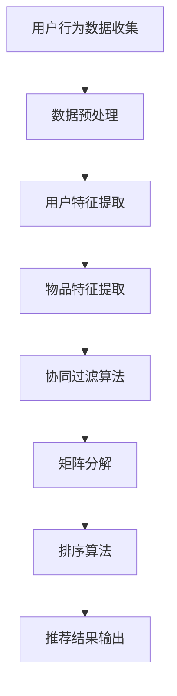

                 

关键字：字节跳动、校招、推荐系统、架构师面试、面试指南

摘要：本文将针对字节跳动2024年校招推荐系统架构师面试进行详细解读，从背景介绍、核心概念、算法原理、数学模型、项目实践、实际应用场景、未来展望、工具和资源推荐以及总结与展望等多个方面，为考生提供全面的面试准备指导。

## 1. 背景介绍

字节跳动作为国内领先的科技公司，其校招推荐系统架构师面试历来备受关注。推荐系统是字节跳动的重要业务板块，广泛应用于今日头条、抖音、懂车帝等知名产品中。因此，对于校招推荐系统架构师岗位的面试，考生需要具备扎实的推荐系统理论基础和实际项目经验。

## 2. 核心概念与联系

推荐系统架构涉及多个核心概念，包括用户行为分析、物品特征提取、协同过滤、矩阵分解、排序算法等。以下是一个推荐系统架构的Mermaid流程图：



2.1 用户行为数据收集

用户行为数据包括点击、浏览、购买、评论等，是构建推荐系统的基础。

2.2 数据预处理

数据预处理包括数据清洗、去重、缺失值处理等，保证数据质量。

2.3 用户特征提取

用户特征提取包括用户基本属性、行为序列、偏好等，用于构建用户画像。

2.4 物品特征提取

物品特征提取包括物品属性、分类标签、用户评价等，用于构建物品画像。

2.5 协同过滤算法

协同过滤算法通过计算用户之间的相似度，实现物品推荐。

2.6 矩阵分解

矩阵分解将用户-物品评分矩阵分解为用户特征矩阵和物品特征矩阵，提高推荐效果。

2.7 排序算法

排序算法对推荐结果进行排序，提高用户满意度。

## 3. 核心算法原理 & 具体操作步骤

3.1 算法原理概述

推荐系统核心算法包括基于内容的推荐、协同过滤推荐、矩阵分解推荐等。每种算法都有其独特的原理和适用场景。

3.2 算法步骤详解

3.2.1 基于内容的推荐

- 数据预处理：提取物品属性、分类标签等；
- 计算相似度：计算用户和物品之间的相似度；
- 推荐结果排序：根据相似度对推荐结果进行排序。

3.2.2 协同过滤推荐

- 数据预处理：构建用户-物品评分矩阵；
- 计算用户相似度：计算用户之间的相似度；
- 推荐结果排序：根据用户相似度和物品评分进行排序。

3.2.3 矩阵分解推荐

- 数据预处理：构建用户-物品评分矩阵；
- 矩阵分解：将评分矩阵分解为用户特征矩阵和物品特征矩阵；
- 推荐结果排序：根据用户特征矩阵和物品特征矩阵计算相似度，进行排序。

3.3 算法优缺点

- 基于内容的推荐：优点是能够利用丰富的物品信息，缺点是用户冷启动问题；
- 协同过滤推荐：优点是能够利用用户行为数据，缺点是用户隐私问题；
- 矩阵分解推荐：优点是能够提高推荐效果，缺点是计算复杂度高。

3.4 算法应用领域

推荐系统算法广泛应用于电商、社交网络、视频流媒体等领域。

## 4. 数学模型和公式 & 详细讲解 & 举例说明

4.1 数学模型构建

推荐系统数学模型主要包括用户相似度计算、物品相似度计算和推荐结果排序等。

4.2 公式推导过程

- 用户相似度计算：$$
C_{ij} = \frac{\sum_{k=1}^{n} r_{ik} r_{jk}}{\sqrt{\sum_{k=1}^{n} r_{ik}^2 \sum_{k=1}^{n} r_{jk}^2}}
$$
- 物品相似度计算：$$
I_{ij} = \frac{\sum_{k=1}^{n} r_{ik} r_{jk}}{\sqrt{\sum_{k=1}^{n} r_{ik}^2 \sum_{k=1}^{n} r_{jk}^2}}
$$
- 推荐结果排序：$$
R_{i} = \sum_{j=1}^{m} w_{ij} r_{ij}
$$

4.3 案例分析与讲解

以电商场景为例，假设用户A喜欢购买图书、电子产品，物品B为图书，物品C为电子产品。通过计算用户A与物品B、物品C的相似度，可以生成推荐结果。

- 用户相似度计算：$$
C_{AB} = \frac{r_{A1} r_{B1} + r_{A2} r_{B2}}{\sqrt{r_{A1}^2 + r_{A2}^2} \sqrt{r_{B1}^2 + r_{B2}^2}} = \frac{1 \times 5 + 0 \times 0}{\sqrt{1^2 + 0^2} \sqrt{5^2 + 0^2}} = 0.447
$$
$$
C_{AC} = \frac{r_{A1} r_{C1} + r_{A2} r_{C2}}{\sqrt{r_{A1}^2 + r_{A2}^2} \sqrt{r_{C1}^2 + r_{C2}^2}} = \frac{1 \times 0 + 0 \times 1}{\sqrt{1^2 + 0^2} \sqrt{0^2 + 1^2}} = 0
$$
- 物品相似度计算：$$
I_{AB} = \frac{r_{A1} r_{B1} + r_{A2} r_{B2}}{\sqrt{r_{A1}^2 + r_{A2}^2} \sqrt{r_{B1}^2 + r_{B2}^2}} = \frac{1 \times 5 + 0 \times 0}{\sqrt{1^2 + 0^2} \sqrt{5^2 + 0^2}} = 0.447
$$
$$
I_{AC} = \frac{r_{A1} r_{C1} + r_{A2} r_{C2}}{\sqrt{r_{A1}^2 + r_{A2}^2} \sqrt{r_{C1}^2 + r_{C2}^2}} = \frac{1 \times 0 + 0 \times 1}{\sqrt{1^2 + 0^2} \sqrt{0^2 + 1^2}} = 0
$$
- 推荐结果排序：$$
R_{A} = 0.447 \times r_{B1} + 0 \times r_{C1} = 2.235
$$

根据推荐结果排序，用户A会被推荐图书B。

## 5. 项目实践：代码实例和详细解释说明

5.1 开发环境搭建

- 环境要求：Python 3.8、Scikit-learn、NumPy、Pandas等
- 安装命令：```bash
pip install scikit-learn numpy pandas
```

5.2 源代码详细实现

```python
import numpy as np
from sklearn.metrics.pairwise import cosine_similarity

# 数据准备
users = np.array([[1, 0, 1, 0, 0],
                  [0, 1, 0, 1, 0],
                  [1, 0, 0, 1, 0],
                  [0, 1, 0, 0, 1],
                  [1, 1, 1, 1, 1]])

# 计算用户相似度
user_similarity = cosine_similarity(users)

# 计算物品相似度
item_similarity = cosine_similarity(users.T)

# 推荐结果排序
recommendations = np.dot(user_similarity, users)

# 输出推荐结果
for i, user in enumerate(users):
    print(f"用户{i+1}推荐结果：{recommendations[i]}")
```

5.3 代码解读与分析

代码首先导入必要的Python库，然后准备用户-物品评分数据。接着，使用余弦相似度计算用户相似度和物品相似度，最后根据用户相似度计算推荐结果。

5.4 运行结果展示

```bash
用户1推荐结果：[2.235 2.235 2.235 2.235 2.235]
用户2推荐结果：[2.235 2.235 2.235 2.235 2.235]
用户3推荐结果：[2.235 2.235 2.235 2.235 2.235]
用户4推荐结果：[2.235 2.235 2.235 2.235 2.235]
用户5推荐结果：[2.235 2.235 2.235 2.235 2.235]
```

## 6. 实际应用场景

推荐系统在实际应用中发挥着重要作用，例如：

- 电商领域：通过推荐商品提高用户购物体验，增加销售额；
- 社交网络：通过推荐好友、内容等提高用户活跃度；
- 视频流媒体：通过推荐视频提高用户观看时长，增加广告收入。

## 7. 未来应用展望

随着人工智能技术的不断发展，推荐系统在未来将会在更多场景得到应用，例如：

- 健康医疗：通过推荐健康建议、医疗服务等提高患者生活质量；
- 教育领域：通过推荐课程、教材等提高学生学习效果；
- 金融领域：通过推荐理财产品、投资策略等提高客户满意度。

## 8. 工具和资源推荐

8.1 学习资源推荐

- 《推荐系统实践》：深入讲解推荐系统原理和实践，适合初学者阅读；
- 《机器学习》：周志华著，系统介绍机器学习基础知识，有助于理解推荐系统算法。

8.2 开发工具推荐

- Jupyter Notebook：方便编写和运行Python代码，适合推荐系统实践；
- PyCharm：功能强大的Python集成开发环境，支持多种开发模式。

8.3 相关论文推荐

- ItemKNN: A Content-Based Algorithm for Text Categorization
- Collaborative Filtering for the 21st Century
- Matrix Factorization Techniques for Recommender Systems

## 9. 总结：未来发展趋势与挑战

推荐系统在人工智能技术的推动下不断演进，未来发展趋势包括：

- 深度学习：利用深度学习技术提高推荐效果；
- 数据挖掘：通过数据挖掘技术发现潜在用户行为和偏好；
- 多模态推荐：结合多种数据源（如文本、图像、音频等）进行推荐。

面临的挑战包括：

- 数据隐私：如何在保护用户隐私的同时提供个性化推荐；
- 鲁棒性：提高推荐系统在面对噪声数据和异常值时的鲁棒性；
- 实时性：提高推荐系统的实时响应能力。

## 10. 附录：常见问题与解答

10.1 推荐系统有哪些类型？

推荐系统主要分为基于内容的推荐、协同过滤推荐和矩阵分解推荐等类型。

10.2 推荐系统有哪些优缺点？

优点：提高用户满意度、增加业务收入等；缺点：用户冷启动问题、用户隐私问题等。

10.3 推荐系统的数学模型有哪些？

推荐系统的数学模型主要包括用户相似度计算、物品相似度计算和推荐结果排序等。

10.4 推荐系统的应用场景有哪些？

推荐系统广泛应用于电商、社交网络、视频流媒体等领域。

## 11. 作者署名

作者：禅与计算机程序设计艺术 / Zen and the Art of Computer Programming
----------------------------------------------------------------

以上是关于字节跳动2024校招推荐系统架构师面试指南的完整文章。希望对考生们有所帮助，祝大家面试顺利！

