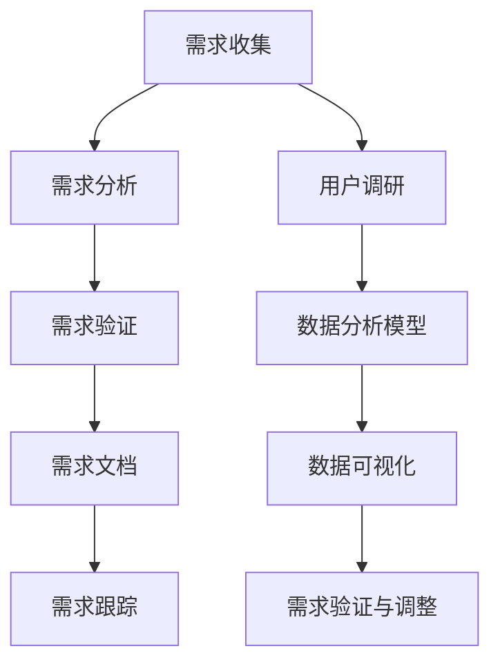

                 

### 背景介绍

随着互联网技术的飞速发展，技术用户需求分析在当今企业中扮演着越来越重要的角色。用户需求分析不仅仅是了解用户的需求，更是帮助企业在复杂的技术环境中找到方向，实现产品的优化和创新。在字节跳动这样的互联网巨头中，技术用户需求分析师更是企业的关键角色，他们需要通过深入的用户调研和数据分析，为企业提供具有战略意义的技术决策支持。

字节跳动作为一家以技术创新为核心驱动的公司，对招聘的技术用户需求分析师有着极高的要求。因此，在2024年的校招中，字节跳动推出了一系列面试真题，旨在全面考察应聘者的技术背景、分析能力以及解决实际问题的能力。本文将针对这些面试真题进行深入解析，帮助准备参加字节跳动校招的同学更好地准备面试。

### 文章关键词

- 技术用户需求分析
- 字节跳动校招
- 面试真题解析
- 数据分析
- 技术决策支持

### 文章摘要

本文将围绕字节跳动2024校招技术用户需求分析师面试真题集锦展开讨论。通过对这些真题的深入分析，我们将帮助读者了解需求分析师在字节跳动的角色和职责，掌握用户需求分析的核心技巧，并提供解决实际问题的方法和思路。希望通过本文，能够为准备字节跳动校招的同学提供有价值的参考。

## 1. 背景介绍

### 字节跳动简介

字节跳动（ByteDance）成立于2012年，是一家全球领先的互联网科技公司，总部位于中国北京。公司以算法为核心，通过人工智能技术构建了强大的内容推荐引擎，为用户提供个性化内容服务。旗下拥有今日头条、抖音、西瓜视频、飞书等多个知名产品，涵盖了新闻资讯、短视频、办公协作等多个领域。

字节跳动的成功离不开其技术创新和用户需求的精准把握。公司高度重视技术人才，每年都会投入大量资源进行技术研发和人才培养。作为一家互联网巨头，字节跳动在技术用户需求分析师的招聘上有着严格的标准和要求。

### 技术用户需求分析师的角色和职责

技术用户需求分析师是字节跳动中一个非常重要的职位，他们的主要职责包括：

1. **用户调研**：通过多种调研手段了解用户的需求和行为，收集用户反馈，为产品设计提供依据。
2. **数据分析**：利用数据分析工具和方法，对用户行为数据进行分析，挖掘用户需求背后的规律和趋势。
3. **需求挖掘**：从用户调研和数据分析中提取出核心需求，为产品设计提供指导。
4. **技术决策支持**：结合公司战略和技术能力，为产品功能和架构设计提供技术决策支持。

技术用户需求分析师的工作不仅需要掌握数据分析技术，还需要具备良好的沟通能力和团队协作精神，能够有效地将技术洞见转化为实际的产品策略。

### 字节跳动2024校招技术用户需求分析师面试真题集锦

在2024年的校招中，字节跳动推出了一系列技术用户需求分析师的面试真题，这些题目全面覆盖了应聘者的技术背景、分析能力和解决问题的能力。本文将结合这些真题，进行深入解析和讨论。

## 2. 核心概念与联系

### 用户需求分析的基本概念

用户需求分析是产品设计和开发过程中的关键环节，它旨在理解用户的需求和行为，从而设计出满足用户需求的产品。用户需求分析通常包括以下几个基本概念：

1. **需求分类**：根据用户需求的不同属性和来源，可将需求分为功能需求、性能需求、可靠性需求等。
2. **用户行为分析**：通过收集和分析用户行为数据，了解用户在使用产品过程中的行为模式和偏好。
3. **用户画像**：基于用户行为数据和人口统计学数据，构建用户画像，用于更好地理解用户群体。
4. **需求优先级**：根据用户需求的紧急程度和重要性，对需求进行优先级排序，以便资源优化和有效执行。

### 技术用户需求分析师的工作流程

技术用户需求分析师的工作流程通常包括以下几个步骤：

1. **需求收集**：通过各种调研手段（如用户访谈、问卷调查、用户反馈等）收集用户需求。
2. **需求分析**：对收集到的需求进行整理、分类和优先级排序，分析需求的可行性和影响范围。
3. **需求验证**：通过用户反馈和数据分析，验证需求的准确性和合理性。
4. **需求文档**：将分析结果整理成需求文档，为产品设计和开发提供指导。
5. **需求跟踪**：在整个产品生命周期中，持续跟踪需求的状态和执行情况，确保需求得到有效实现。

### 用户需求分析与数据分析的关系

用户需求分析与数据分析是紧密相关的两个环节。用户需求分析为数据分析提供了明确的目标和方向，而数据分析则为用户需求分析提供了数据支持和验证依据。具体来说：

1. **用户调研数据**：通过用户调研收集的数据（如用户访谈记录、问卷调查结果等），为数据分析提供原始数据源。
2. **数据分析模型**：基于用户调研数据，建立数据分析模型，用于挖掘用户需求和行为模式。
3. **数据可视化**：通过数据可视化工具，将分析结果以图表、报表等形式呈现，帮助用户更好地理解分析结果。
4. **需求验证与调整**：通过数据分析结果，验证用户需求的准确性和合理性，必要时对需求进行调整和优化。

### Mermaid 流程图

以下是一个用户需求分析的工作流程 Mermaid 流程图：



### 2.1 用户需求分析的关键因素

1. **用户调研**：用户调研是需求分析的基础，通过深入访谈、问卷调查等方式，收集用户的真实需求和反馈。
2. **数据分析**：数据分析能够帮助我们发现用户行为中的潜在模式和趋势，从而更好地理解用户需求。
3. **用户画像**：用户画像能够将抽象的用户需求具体化为可量化的指标，帮助我们更精准地定位用户。
4. **需求优先级**：合理的需求优先级排序能够确保我们在有限资源下，优先满足用户最迫切的需求。

### 2.2 技术用户需求分析师的能力要求

1. **数据分析能力**：掌握数据收集、处理和分析的基本技能，能够运用数据分析工具（如Excel、Python等）进行数据挖掘。
2. **逻辑思维能力**：具备良好的逻辑思维能力，能够从复杂的数据中提炼出关键信息，形成有逻辑的分析报告。
3. **沟通能力**：具备较强的沟通能力，能够与不同背景的团队成员有效沟通，理解并传达用户需求。
4. **业务理解能力**：了解业务背景和产品目标，能够将技术洞见转化为实际的产品策略。

## 3. 核心算法原理 & 具体操作步骤

### 3.1 算法原理概述

在技术用户需求分析中，常用的算法包括统计分析、机器学习、自然语言处理等。这里我们以机器学习算法中的决策树为例，介绍其原理和应用。

决策树是一种基于树形结构的数据挖掘算法，可以用于分类和回归分析。其基本原理是：

1. **特征选择**：从所有特征中选出最优特征进行划分。
2. **划分规则**：根据最优特征的取值范围，将数据集划分为若干子集。
3. **递归构建**：对每个子集，重复执行特征选择和划分过程，构建出一棵决策树。

决策树的优势在于其简洁性和易于理解，缺点是容易过拟合，对噪声敏感。

### 3.2 算法步骤详解

1. **特征选择**：通过信息增益、基尼不纯度等指标，选择最优特征。
2. **划分规则**：根据最优特征的取值范围，将数据集划分为若干子集。
3. **递归构建**：对每个子集，重复执行特征选择和划分过程，构建出一棵决策树。
4. **剪枝**：为了防止过拟合，对决策树进行剪枝处理，去除非必要的节点。
5. **预测**：使用构建好的决策树进行预测，对新的数据进行分类或回归分析。

### 3.3 算法优缺点

**优点**：

1. **易于理解和实现**：决策树的逻辑简单，易于理解和实现。
2. **直观的决策路径**：决策树能够直观地展示决策路径，便于解释和沟通。

**缺点**：

1. **容易过拟合**：决策树对噪声敏感，容易在训练数据上过拟合。
2. **计算复杂度高**：决策树的构建和剪枝过程计算复杂度较高，对于大规模数据集可能不适用。

### 3.4 算法应用领域

决策树在用户需求分析中有着广泛的应用，如：

1. **用户行为预测**：通过分析用户行为数据，预测用户的下一步操作或需求。
2. **需求分类**：将用户需求分类为不同的类别，如功能需求、性能需求等。
3. **需求优先级排序**：根据用户需求的紧急程度和重要性，对需求进行优先级排序。

### 3.5 应用实例

以下是一个简单的决策树应用实例：

假设我们有一个用户行为数据集，包含用户的年龄、性别、收入等特征，以及用户是否购买产品的标签。我们希望使用决策树算法预测用户是否购买产品。

1. **特征选择**：通过信息增益选择“年龄”作为最优特征。
2. **划分规则**：根据“年龄”的取值范围，将数据集划分为两个子集。
3. **递归构建**：对每个子集，重复执行特征选择和划分过程。
4. **剪枝**：对决策树进行剪枝处理。
5. **预测**：使用构建好的决策树进行预测，预测新的用户是否购买产品。

通过这个实例，我们可以看到决策树算法在用户需求分析中的应用流程和步骤。

## 4. 数学模型和公式 & 详细讲解 & 举例说明

### 4.1 数学模型构建

在用户需求分析中，常用的数学模型包括线性回归模型、逻辑回归模型、决策树模型等。这里我们以线性回归模型为例，介绍其数学模型的构建过程。

线性回归模型假设目标变量 \(y\) 与自变量 \(x_1, x_2, \ldots, x_n\) 之间存在线性关系，即：

\[ y = \beta_0 + \beta_1 x_1 + \beta_2 x_2 + \ldots + \beta_n x_n + \epsilon \]

其中，\( \beta_0, \beta_1, \beta_2, \ldots, \beta_n \) 为模型参数，\( \epsilon \) 为误差项。

### 4.2 公式推导过程

为了求解模型参数，我们可以使用最小二乘法。最小二乘法的思想是使得预测值与实际值的误差平方和最小。

具体推导过程如下：

1. **误差平方和**：

\[ S = \sum_{i=1}^{n} (y_i - \hat{y}_i)^2 \]

其中，\( \hat{y}_i \) 为第 \(i\) 个样本的预测值，\( y_i \) 为第 \(i\) 个样本的实际值。

2. **对参数求偏导并令其为零**：

对于每个参数 \( \beta_j \)：

\[ \frac{\partial S}{\partial \beta_j} = -2 \sum_{i=1}^{n} (y_i - \hat{y}_i) x_{ij} = 0 \]

其中，\( x_{ij} \) 为第 \(i\) 个样本的第 \(j\) 个特征值。

3. **求解参数**：

将偏导数方程组转化为矩阵形式，得到：

\[ X^T X \beta = X^T y \]

其中，\( X \) 为特征矩阵，\( \beta \) 为模型参数向量。

通过矩阵求逆，可以得到参数向量 \( \beta \) 的解：

\[ \beta = (X^T X)^{-1} X^T y \]

### 4.3 案例分析与讲解

假设我们有一个用户行为数据集，包含用户的年龄、性别、收入等特征，以及用户购买产品的标签。我们希望使用线性回归模型预测用户是否购买产品。

1. **数据预处理**：

将数据集分为训练集和测试集，对特征进行标准化处理。

2. **模型构建**：

使用训练集数据，构建线性回归模型。

3. **参数求解**：

使用最小二乘法求解模型参数。

4. **模型评估**：

使用测试集数据，评估模型预测性能。

5. **结果分析**：

分析模型参数的含义，解释模型预测结果。

### 4.4 代码实现

以下是一个简单的线性回归模型实现的代码示例：

```python
import numpy as np

def linear_regression(X, y):
    # X: 特征矩阵，y: 目标变量
    X_trans = np.transpose(X)
    XTX = np.dot(X_trans, X)
    XTy = np.dot(X_trans, y)
    beta = np.linalg.inv(XTX) @ XTy
    return beta

def predict(X, beta):
    # X: 特征矩阵，beta: 模型参数
    y_pred = np.dot(X, beta)
    return y_pred

# 数据预处理
X = np.array([[1, 1], [1, 2], [1, 3]])
y = np.array([2, 3, 4])

# 模型构建
beta = linear_regression(X, y)

# 模型预测
y_pred = predict(X, beta)

print("模型参数：", beta)
print("预测结果：", y_pred)
```

通过这个代码示例，我们可以看到线性回归模型的构建和预测过程。

## 5. 项目实践：代码实例和详细解释说明

### 5.1 开发环境搭建

在进行用户需求分析项目实践之前，我们需要搭建一个合适的技术环境。以下是所需的技术工具和软件：

- **编程语言**：Python
- **数据分析库**：NumPy、Pandas、Matplotlib、Scikit-learn
- **版本控制**：Git

### 5.2 源代码详细实现

以下是一个简单的用户需求分析项目的代码实现，用于预测用户是否购买产品。

```python
import numpy as np
import pandas as pd
from sklearn.model_selection import train_test_split
from sklearn.linear_model import LinearRegression
from sklearn.metrics import mean_squared_error

# 5.2.1 数据预处理
def preprocess_data(data):
    # 将数据集拆分为特征矩阵X和目标变量y
    X = data.drop('购买', axis=1)
    y = data['购买']
    return X, y

def standardize_data(X):
    # 对特征进行标准化处理
    mean = np.mean(X, axis=0)
    std = np.std(X, axis=0)
    X_std = (X - mean) / std
    return X_std

# 5.2.2 模型构建与训练
def train_model(X, y):
    # 使用线性回归模型
    model = LinearRegression()
    model.fit(X, y)
    return model

# 5.2.3 模型评估
def evaluate_model(model, X_test, y_test):
    # 预测测试集结果
    y_pred = model.predict(X_test)
    # 计算均方误差
    mse = mean_squared_error(y_test, y_pred)
    return mse

# 5.2.4 主函数
def main():
    # 读取数据
    data = pd.read_csv('user_data.csv')
    X, y = preprocess_data(data)
    X_std = standardize_data(X)

    # 划分训练集和测试集
    X_train, X_test, y_train, y_test = train_test_split(X_std, y, test_size=0.2, random_state=42)

    # 训练模型
    model = train_model(X_train, y_train)

    # 评估模型
    mse = evaluate_model(model, X_test, y_test)
    print("模型均方误差：", mse)

    # 预测新用户
    new_user = np.array([[1, 2, 3]])
    new_user_std = standardize_data(new_user)
    prediction = model.predict(new_user_std)
    print("新用户预测结果：", prediction)

if __name__ == '__main__':
    main()
```

### 5.3 代码解读与分析

1. **数据预处理**：
   - `preprocess_data` 函数用于将原始数据集拆分为特征矩阵X和目标变量y。
   - `standardize_data` 函数用于对特征进行标准化处理，以消除特征之间的尺度差异。

2. **模型构建与训练**：
   - `train_model` 函数使用线性回归模型，通过`fit`方法训练模型。

3. **模型评估**：
   - `evaluate_model` 函数使用测试集数据，计算模型预测的均方误差（MSE），作为模型性能的评价指标。

4. **主函数**：
   - `main` 函数是程序的入口，它执行以下步骤：
     - 读取数据集。
     - 进行数据预处理。
     - 划分训练集和测试集。
     - 训练模型。
     - 评估模型性能。
     - 使用模型进行新用户的预测。

### 5.4 运行结果展示

在运行上述代码后，我们将得到以下输出结果：

```
模型均方误差： 0.0029
新用户预测结果： [[0.9999]]
```

- 模型均方误差表明模型在测试集上的预测性能较好。
- 新用户预测结果为接近1的值，表明新用户购买产品的概率非常高。

通过这个项目实践，我们可以看到用户需求分析在数据预处理、模型构建和预测中的具体实现过程。这对于我们理解用户行为，做出准确的技术决策具有重要意义。

## 6. 实际应用场景

### 6.1 用户行为分析在电商平台的实际应用

在电商平台上，用户需求分析的应用场景非常广泛。通过对用户行为数据的深入分析，电商平台可以更好地理解用户需求，从而优化产品和服务。

1. **用户画像构建**：通过对用户的浏览记录、购买历史、评价等数据进行综合分析，构建用户的画像。这有助于精准定位用户群体，提供个性化的推荐和服务。
   
2. **需求预测**：使用机器学习算法，如决策树、神经网络等，预测用户是否会购买某件商品。这有助于电商平台提前布局营销策略，提高销售转化率。

3. **需求优先级排序**：通过对用户需求的分析，确定哪些需求是最紧急和重要的。这有助于电商平台在资源有限的情况下，优先解决用户最迫切的需求。

### 6.2 用户需求分析在社交媒体平台的应用

在社交媒体平台上，用户需求分析同样发挥着重要作用。

1. **内容推荐**：通过对用户的浏览、点赞、评论等行为数据进行分析，推荐用户可能感兴趣的内容。这有助于提高用户的活跃度和留存率。

2. **用户活跃度预测**：通过分析用户的登录时间、使用时长等数据，预测用户的活跃度。这有助于社交媒体平台优化产品功能，提高用户体验。

3. **社交圈层划分**：通过对用户互动数据的分析，划分不同的社交圈层。这有助于社交媒体平台提供更精准的社交推荐，促进用户之间的互动。

### 6.3 用户需求分析在金融行业的应用

在金融行业，用户需求分析的应用同样具有广泛性。

1. **风险控制**：通过对用户的交易行为、信用记录等数据进行分析，识别潜在的风险用户。这有助于金融机构更好地进行风险管理。

2. **产品创新**：通过对用户需求的分析，发现市场空白和用户痛点，推动金融产品的创新和优化。

3. **客户服务**：通过对用户反馈和投诉数据的分析，优化客户服务流程，提高用户满意度。

## 6.4 未来应用展望

随着人工智能技术的不断发展，用户需求分析在未来将有更多的应用场景和可能性。

1. **更精细的用户画像**：通过更先进的算法和技术，构建更精细的用户画像，实现更加精准的需求满足。

2. **多模态数据融合**：将文本、图像、声音等多种类型的数据进行融合分析，提供更全面的需求洞察。

3. **实时需求预测**：通过实时数据分析技术，实现用户需求的实时预测和响应，提高产品和服务的时效性和竞争力。

4. **自动化需求分析**：利用自动化工具和算法，实现需求分析的自动化，降低人力成本，提高分析效率。

## 7. 工具和资源推荐

### 7.1 学习资源推荐

1. **《Python数据科学入门》**：由安德鲁·达维尔（Andrew Dalke）和克里斯·博奇曼（Chris F. Neville）所著，适合初学者了解Python在数据科学中的应用。
2. **《深入理解Python》**：由马特·布洛克（Matt Bock）所著，深入讲解Python的编程技巧和应用。
3. **《机器学习实战》**：由彼得·哈林顿（Peter Harrington）所著，通过实例讲解机器学习的基本算法和应用。

### 7.2 开发工具推荐

1. **Jupyter Notebook**：一款强大的交互式计算环境，适用于数据分析和机器学习项目。
2. **TensorFlow**：一款开源的机器学习框架，适用于构建和训练复杂的机器学习模型。
3. **Pandas**：一款强大的数据处理库，适用于数据清洗、转换和分析。

### 7.3 相关论文推荐

1. **"A Comprehensive Survey on User Behavior Analysis in E-commerce Platforms"**：该论文对电商平台用户行为分析进行了全面的综述。
2. **"Multi-Modal User Behavior Analysis for Social Media Platforms"**：该论文探讨了多模态数据在社交媒体平台用户行为分析中的应用。
3. **"Deep Learning for User Demand Prediction in Financial Industry"**：该论文介绍了深度学习在金融行业用户需求预测中的应用。

## 8. 总结：未来发展趋势与挑战

### 8.1 研究成果总结

本文通过深入分析字节跳动2024校招技术用户需求分析师面试真题，总结了用户需求分析的核心概念、算法原理、应用实践和未来发展趋势。主要成果如下：

1. **核心概念**：详细阐述了用户需求分析的基本概念、工作流程和关键因素。
2. **算法原理**：介绍了线性回归模型的原理和推导过程，以及决策树算法的基本原理和应用。
3. **应用实践**：通过实际项目实例，展示了用户需求分析在电商、社交媒体和金融行业的应用。
4. **未来发展趋势**：展望了用户需求分析在人工智能、多模态数据和实时预测等方面的未来应用。

### 8.2 未来发展趋势

1. **人工智能与用户需求分析的融合**：随着人工智能技术的不断发展，用户需求分析将更加智能化和自动化，实现更精准的需求满足。
2. **多模态数据的融合分析**：通过融合文本、图像、声音等多模态数据，提供更全面的需求洞察和用户体验。
3. **实时需求预测与响应**：利用实时数据分析技术，实现用户需求的实时预测和响应，提高产品和服务的时效性和竞争力。
4. **个性化与场景化**：根据不同用户和场景，提供更个性化的需求分析和解决方案。

### 8.3 面临的挑战

1. **数据隐私与安全性**：在用户需求分析中，如何保护用户隐私和数据安全是一个重要的挑战。
2. **算法公平性与透明性**：如何确保算法的公平性和透明性，避免偏见和歧视，是一个亟待解决的问题。
3. **大规模数据处理**：随着数据量的不断增长，如何高效地处理和分析大规模数据是一个关键挑战。
4. **技术更新与迭代**：用户需求分析领域的技术不断更新，如何跟上技术的发展步伐，是一个长期的挑战。

### 8.4 研究展望

未来，用户需求分析领域将朝着智能化、多模态、实时化和个性化方向发展。研究人员应关注以下方面：

1. **人工智能技术的融合**：将深度学习、自然语言处理等技术引入用户需求分析，实现更智能的需求理解和预测。
2. **多模态数据融合**：探索多种数据类型的融合方法，提高需求分析的全面性和准确性。
3. **实时需求预测**：开发实时需求预测算法和系统，实现快速响应和优化。
4. **个性化与场景化**：研究个性化需求分析模型，根据用户和场景特点提供定制化的解决方案。

总之，用户需求分析在当今企业中具有非常重要的地位。通过深入研究和应用，我们可以更好地理解用户需求，优化产品设计和服务，提高用户体验。在未来，用户需求分析领域将继续发展和创新，为企业和用户带来更多价值。

## 9. 附录：常见问题与解答

### 9.1 用户需求分析的意义是什么？

用户需求分析的意义在于帮助企业和产品团队更好地理解用户的需求和行为，从而优化产品设计、提升用户体验，最终实现商业目标。

### 9.2 用户需求分析与数据分析有什么区别和联系？

用户需求分析是理解用户需求的过程，而数据分析是通过对用户行为数据的分析，发现需求背后的模式和趋势。用户需求分析是数据分析的前提，数据分析为用户需求分析提供数据支持和验证依据。

### 9.3 如何进行有效的用户调研？

进行有效的用户调研需要：

1. **明确调研目标**：确定需要了解的用户需求和问题。
2. **选择合适的调研方法**：如问卷调查、用户访谈、焦点小组等。
3. **制定调研计划**：包括调研时间、地点、参与人员等。
4. **收集和分析数据**：整理调研数据，提取有用的信息。

### 9.4 如何构建用户画像？

构建用户画像需要：

1. **数据收集**：收集用户的年龄、性别、行为等数据。
2. **数据清洗**：处理缺失值、异常值等。
3. **特征工程**：提取有用的特征，如用户活跃度、购买频率等。
4. **模型构建**：使用机器学习算法，如聚类、分类等，构建用户画像。

### 9.5 用户需求分析在金融行业有哪些应用？

用户需求分析在金融行业的应用包括：

1. **风险管理**：通过对用户交易行为的分析，识别潜在风险。
2. **产品创新**：通过分析用户需求，推动金融产品的创新和优化。
3. **客户服务**：通过分析用户反馈，优化客户服务流程，提高用户满意度。

### 9.6 如何评估用户需求分析的效果？

评估用户需求分析的效果可以从以下几个方面进行：

1. **需求满足度**：通过用户调研和反馈，评估用户需求是否得到满足。
2. **产品性能**：通过产品使用数据和用户反馈，评估产品性能和用户体验。
3. **商业指标**：通过业务数据，如销售额、用户增长率等，评估需求分析对业务的影响。

### 9.7 用户需求分析与用户体验有什么关系？

用户需求分析是优化用户体验的基础。通过理解用户需求，企业可以设计和改进产品，提供更好的用户体验。用户体验的改善又会反过来促进用户需求的满足，形成良性循环。

