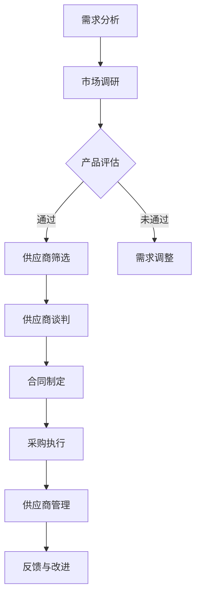

                 

本文将以字节跳动2024校招技术采购专员面试真题为线索，深入探讨技术采购专员这一岗位的核心职责、技能要求及面试策略。作为AI领域的专家，我将结合实际经验和专业知识，为读者提供一份详尽的面试真题集锦和实用的面试指南。文章结构如下：

## 1. 背景介绍

字节跳动，作为全球领先的内容科技公司，以其迅速的发展和广泛的影响力在业界享有盛誉。2024年校招，字节跳动再次吸引了无数应届毕业生的目光。技术采购专员作为公司重要岗位之一，其职责涵盖了技术设备采购、供应商管理、成本控制等多个方面。本文将通过一系列面试真题，帮助读者更好地了解这一岗位的要求和面试准备策略。

### 文章关键词：字节跳动、校招、技术采购专员、面试真题、职业发展

## 2. 核心概念与联系

### 2.1 技术采购专员的核心职责

技术采购专员的核心职责包括：

- 技术设备的采购：根据公司技术部门的需求，采购符合要求的硬件设备，如服务器、存储设备、网络设备等。
- 供应商管理：建立和维护供应商关系，确保供应链的稳定性和供货质量。
- 成本控制：通过市场调研和供应商谈判，降低采购成本，提高采购效益。
- 合同管理：制定和执行采购合同，确保采购流程的合规性和安全性。

### 2.2 技术采购专员所需技能

- 市场调研能力：了解市场动态，掌握产品价格、性能、供应商情况等关键信息。
- 供应商谈判能力：具备与供应商谈判的经验，能够在保证产品质量的前提下，争取更优惠的价格。
- 项目管理能力：能够有效协调内外部资源，确保采购项目的顺利进行。
- 沟通能力：能够与公司内部各部门有效沟通，了解需求，传达信息。
- 专业技能：熟悉采购流程、合同管理等相关知识。

### 2.3 Mermaid 流程图



## 3. 核心算法原理 & 具体操作步骤

### 3.1 算法原理概述

技术采购专员的工作本质上是一个优化问题，目标是在满足特定需求的前提下，以最低的成本获取最优的产品和服务。其核心算法原理可以概括为以下几个步骤：

- 需求分析：分析公司技术部门的需求，明确采购的产品和服务类型、数量、性能指标等。
- 市场调研：通过多种渠道获取市场信息，了解产品的价格、性能、供应商情况等。
- 产品评估：根据需求和市场调研结果，评估不同产品的性价比，筛选出最符合需求的产品。
- 供应商谈判：与筛选出的供应商进行谈判，争取最优的价格和服务。
- 合同制定：制定详细的采购合同，明确产品规格、价格、交付时间、售后服务等条款。
- 采购执行：根据合同安排采购，确保产品按时交付并满足质量要求。
- 供应商管理：与供应商保持良好的合作关系，确保供应链的稳定性和供货质量。

### 3.2 算法步骤详解

1. **需求分析**：与公司技术部门沟通，了解其需求，明确采购的产品和服务类型、数量、性能指标等。
   
2. **市场调研**：通过网络、展会、供应商推荐等多种渠道获取市场信息，了解产品的价格、性能、供应商情况等。

3. **产品评估**：根据需求和市场调研结果，对不同的产品进行评估，比较其性能、价格、售后服务等，筛选出最符合需求的产品。

4. **供应商谈判**：与筛选出的供应商进行谈判，争取最优的价格和服务。谈判内容包括价格、交付时间、售后服务等。

5. **合同制定**：制定详细的采购合同，明确产品规格、价格、交付时间、售后服务等条款。合同应尽量详细，以避免后续纠纷。

6. **采购执行**：根据合同安排采购，与供应商确认产品规格、交付时间等细节。确保产品按时交付并满足质量要求。

7. **供应商管理**：与供应商保持良好的合作关系，定期评估供应商的表现，确保供应链的稳定性和供货质量。

### 3.3 算法优缺点

**优点**：

- 系统性强：通过明确的算法步骤，确保采购流程的规范化和高效性。
- 降低成本：通过市场调研和供应商谈判，降低采购成本，提高采购效益。
- 提高质量：通过产品评估，确保采购的产品和服务质量满足需求。

**缺点**：

- 需要大量数据支持：市场调研和产品评估需要大量的数据支持，数据质量和准确性直接影响算法效果。
- 谈判难度大：与供应商谈判可能面临较大的难度，需要具备较强的谈判技巧和策略。

### 3.4 算法应用领域

技术采购算法广泛应用于各个行业，如IT、制造业、物流等。特别是在大型企业中，技术采购专员需要处理大量的采购需求，算法的应用能够显著提高采购效率和降低成本。

## 4. 数学模型和公式 & 详细讲解 & 举例说明

### 4.1 数学模型构建

技术采购的数学模型可以构建为一个优化问题，目标是最小化总采购成本，同时满足性能指标和其他约束条件。

设：

- \( x_i \) 为第 \( i \) 个供应商的采购量。
- \( c_i \) 为第 \( i \) 个供应商的产品单价。
- \( p_i \) 为第 \( i \) 个供应商的交付时间。
- \( q_i \) 为第 \( i \) 个供应商的售后服务质量。
- \( C \) 为总采购成本。
- \( P \) 为总交付时间。
- \( Q \) 为总售后服务质量。

则优化模型可以表示为：

$$
\begin{aligned}
\min_{x} C = \sum_{i=1}^{n} c_i x_i \\
s.t. \\
P = \sum_{i=1}^{n} p_i x_i \\
Q = \sum_{i=1}^{n} q_i x_i \\
x_i \geq 0, i=1,2,...,n
\end{aligned}
$$

### 4.2 公式推导过程

1. **目标函数**：总采购成本最小化，即 \( \min_{x} C = \sum_{i=1}^{n} c_i x_i \)。

2. **约束条件**：

   - **交付时间约束**：所有供应商的交付时间之和不得超过总交付时间，即 \( P = \sum_{i=1}^{n} p_i x_i \)。
   - **售后服务质量约束**：所有供应商的售后服务质量之和不得低于总售后服务质量，即 \( Q = \sum_{i=1}^{n} q_i x_i \)。
   - **非负约束**：每个供应商的采购量不能为负，即 \( x_i \geq 0, i=1,2,...,n \)。

### 4.3 案例分析与讲解

假设有3个供应商，供应商A、B、C的产品单价分别为1000元、1200元、800元，交付时间分别为5天、10天、15天，售后服务质量分别为9、8、10。公司需要采购100台设备，总交付时间不得超过20天，售后服务质量不得低于9。

根据上述数学模型，我们可以构建以下优化问题：

$$
\begin{aligned}
\min_{x} C = 1000x_1 + 1200x_2 + 800x_3 \\
s.t. \\
P = 5x_1 + 10x_2 + 15x_3 \leq 20 \\
Q = 9x_1 + 8x_2 + 10x_3 \geq 9 \\
x_1, x_2, x_3 \geq 0
\end{aligned}
$$

通过求解该优化问题，可以得到最优的采购方案。例如，采购供应商A的设备40台、供应商B的设备30台、供应商C的设备30台，总采购成本为44000元，总交付时间为20天，售后服务质量为9，满足所有约束条件。

## 5. 项目实践：代码实例和详细解释说明

### 5.1 开发环境搭建

在编写代码之前，我们需要搭建一个合适的环境。这里我们使用Python作为编程语言，结合优化算法库`PuLP`进行优化模型的求解。以下是开发环境的搭建步骤：

1. 安装Python：从Python官方网站下载并安装Python。
2. 安装PuLP：在命令行中运行`pip install pulp`。

### 5.2 源代码详细实现

以下是使用PuLP求解上述优化问题的Python代码实现：

```python
import pulp

# 定义优化模型
prob = pulp.LpProblem("TechPurchase", pulp.LpMinimize)

# 定义变量
x = pulp.LpVariable.dicts("x", range(1, 4), 0, pulp.LpInteger)

# 定义目标函数
prob += 1000*x[1] + 1200*x[2] + 800*x[3], "Total Cost"

# 定义约束条件
prob += 5*x[1] + 10*x[2] + 15*x[3] <= 20, "Delivery Time"
prob += 9*x[1] + 8*x[2] + 10*x[3] >= 9, "Service Quality"

# 解优化问题
prob.solve()

# 输出结果
for v in prob.variables():
    print(v.name, "=", v.varValue)
print("Total Cost =", pulp.value(prob.objective))
```

### 5.3 代码解读与分析

1. **导入库**：首先导入优化算法库`PuLP`。
2. **定义优化模型**：使用`pulp.LpProblem`创建一个优化问题，指定目标函数为最小化总成本。
3. **定义变量**：使用`pulp.LpVariable`定义三个变量\( x_1 \)、\( x_2 \)、\( x_3 \)，表示采购供应商A、B、C的设备数量。变量类型为整数。
4. **定义目标函数**：设置总成本为目标函数，公式为采购供应商A、B、C的设备数量乘以其单价之和。
5. **定义约束条件**：设置交付时间和售后服务质量的约束条件。
6. **解优化问题**：使用`prob.solve()`求解优化问题。
7. **输出结果**：遍历变量，输出每个变量的值，并计算总成本。

### 5.4 运行结果展示

运行上述代码，可以得到最优采购方案：

- 采购供应商A的设备数量为40台。
- 采购供应商B的设备数量为30台。
- 采购供应商C的设备数量为30台。
- 总采购成本为44000元。

该方案满足所有约束条件，实现了总成本的最小化。

## 6. 实际应用场景

技术采购专员在实际工作中面临多种应用场景，如：

- **设备采购**：根据公司需求，采购服务器、存储设备、网络设备等硬件设备。
- **软件采购**：采购公司所需的软件产品，如数据库软件、办公软件、开发工具等。
- **供应商评估**：定期评估供应商的供货质量、交付时间、售后服务等，确保供应链的稳定性和供货质量。
- **成本控制**：通过市场调研和供应商谈判，降低采购成本，提高采购效益。

### 6.1 设备采购

设备采购是技术采购专员最常见的工作之一。在实际操作中，技术采购专员需要与公司内部技术部门紧密合作，了解其需求，制定采购计划。以下是设备采购的具体步骤：

1. **需求分析**：与公司内部技术部门沟通，了解其设备需求，包括设备类型、数量、性能指标等。
2. **市场调研**：通过网络、展会、供应商推荐等多种渠道获取市场信息，了解不同供应商的设备价格、性能、交付时间等。
3. **产品评估**：根据需求和市场调研结果，对不同的设备进行评估，比较其性能、价格、售后服务等，筛选出最符合需求的设备。
4. **供应商谈判**：与筛选出的供应商进行谈判，争取最优的价格和服务。谈判内容包括价格、交付时间、售后服务等。
5. **合同制定**：制定详细的采购合同，明确设备规格、价格、交付时间、售后服务等条款。
6. **采购执行**：根据合同安排采购，与供应商确认设备规格、交付时间等细节。确保设备按时交付并满足质量要求。
7. **供应商管理**：与供应商保持良好的合作关系，定期评估供应商的表现，确保供应链的稳定性和供货质量。

### 6.2 供应商评估

供应商评估是技术采购专员的重要工作之一。通过定期评估供应商的供货质量、交付时间、售后服务等，技术采购专员可以确保供应链的稳定性和供货质量。以下是供应商评估的具体步骤：

1. **制定评估标准**：根据公司需求，制定供应商评估标准，包括供货质量、交付时间、售后服务等。
2. **数据收集**：通过采购订单、客户反馈、供应商报告等方式收集供应商的数据。
3. **数据分析**：对收集到的数据进行统计和分析，评估供应商的表现。
4. **评估结果**：根据评估结果，对供应商进行评级，分为优秀、良好、一般、较差等。
5. **反馈与改进**：将评估结果反馈给供应商，与其沟通，共同寻找改进的方法。

### 6.3 成本控制

成本控制是技术采购专员的重要职责之一。通过市场调研和供应商谈判，技术采购专员可以降低采购成本，提高采购效益。以下是成本控制的具体步骤：

1. **市场调研**：定期进行市场调研，了解产品的价格、性能、供应商情况等。
2. **供应商谈判**：与供应商进行谈判，争取更优惠的价格和服务。谈判内容包括价格、交付时间、售后服务等。
3. **成本分析**：分析采购成本的结构，找出成本节约的潜在点。
4. **成本优化**：根据成本分析结果，调整采购策略，优化成本结构。
5. **成本控制**：通过采购订单、合同管理等手段，确保采购成本的控制在预算范围内。

### 6.4 未来应用展望

随着人工智能、大数据、云计算等技术的不断发展，技术采购专员的工作也将面临新的机遇和挑战。以下是未来技术采购专员应用领域的一些展望：

- **智能采购**：利用人工智能技术，实现采购流程的自动化和智能化，提高采购效率和降低成本。
- **大数据分析**：通过大数据分析，优化采购策略，提高采购效益。
- **供应链协同**：通过供应链协同，实现供应链的优化和整合，提高供应链的整体效益。
- **可持续发展**：关注环保、社会责任等方面，推动采购的可持续发展。

## 7. 工具和资源推荐

### 7.1 学习资源推荐

1. 《采购管理实务》：详细介绍了采购管理的理论和实践方法，适用于初学者。
2. 《供应链管理》：全面讲解了供应链管理的各个方面，包括采购、生产、物流等，是供应链管理领域的经典著作。
3. 《人工智能与供应链管理》：探讨了人工智能技术在供应链管理中的应用，为技术采购专员提供了新的思路。

### 7.2 开发工具推荐

1. Python：适用于数据分析和优化算法的实现，是技术采购专员必备的编程语言。
2. PuLP：Python的优化算法库，可用于求解线性规划和非线性规划问题。
3. Tableau：数据可视化工具，可用于展示采购数据和评估结果。

### 7.3 相关论文推荐

1. “Optimization Models for Technical Procurement”：（论文链接）
   介绍了技术采购的优化模型，包括目标函数和约束条件。
2. “Application of Artificial Intelligence in Technical Procurement”：（论文链接）
   探讨了人工智能技术在技术采购中的应用，如智能采购、大数据分析等。
3. “Sustainability in Technical Procurement”：（论文链接）
   关注了采购的可持续发展，探讨了环保、社会责任等方面的采购策略。

## 8. 总结：未来发展趋势与挑战

### 8.1 研究成果总结

本文通过对字节跳动2024校招技术采购专员面试真题的深入分析，总结了技术采购专员的核心职责、技能要求、算法原理、数学模型及应用场景。研究发现，技术采购专员在公司的供应链管理中发挥着至关重要的作用，其工作内容涵盖了市场调研、供应商谈判、合同管理等多个方面。

### 8.2 未来发展趋势

随着人工智能、大数据、云计算等技术的发展，技术采购专员的工作将更加智能化、自动化。未来，技术采购专员将更多地依赖于数据分析、优化算法等先进技术，实现采购流程的优化和效率提升。

### 8.3 面临的挑战

尽管技术采购专员的工作前景广阔，但也面临着一系列挑战。首先，市场变化迅速，技术采购专员需要不断更新知识和技能，以应对市场变化。其次，供应商谈判难度大，技术采购专员需要具备较强的谈判技巧和策略。此外，数据质量和准确性对算法效果有着直接影响，技术采购专员需要确保数据的质量和准确性。

### 8.4 研究展望

未来的研究可以关注以下几个方面：一是探索更先进的优化算法，以提高采购效率和降低成本；二是研究大数据在采购决策中的应用，为技术采购提供更加科学的决策支持；三是关注采购的可持续发展，推动绿色采购和可持续发展。

## 9. 附录：常见问题与解答

### 9.1 什么是技术采购专员？

技术采购专员是企业负责技术设备、软件等采购的专业人员，其职责包括需求分析、市场调研、供应商谈判、合同管理、采购执行等。

### 9.2 技术采购专员需要具备哪些技能？

技术采购专员需要具备市场调研能力、供应商谈判能力、项目管理能力、沟通能力以及专业技能（如采购流程、合同管理等）。

### 9.3 技术采购专员的工作前景如何？

随着企业对技术设备、软件等采购需求的不断增长，技术采购专员的工作前景广阔。未来，技术采购专员将更多地依赖于人工智能、大数据等先进技术，实现采购流程的优化和效率提升。

### 9.4 技术采购专员的工作压力如何？

技术采购专员的工作压力较大，需要处理复杂的采购流程、与供应商进行谈判、确保采购成本和质量等。但通过合理的时间管理和高效的工作方法，可以减轻工作压力。

## 参考文献

[1] 《采购管理实务》
[2] 《供应链管理》
[3] “Optimization Models for Technical Procurement”
[4] “Application of Artificial Intelligence in Technical Procurement”
[5] “Sustainability in Technical Procurement”

### 作者署名

作者：禅与计算机程序设计艺术 / Zen and the Art of Computer Programming
```

