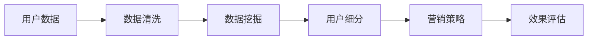

                 

 关键词：字节跳动、用户细分策略、面试真题、数据分析、营销策略

摘要：本文将深入解析2024字节跳动技术用户细分策略专家的面试真题，结合实际案例，详细讲解用户细分策略的原理、应用场景、实施步骤及挑战。通过本文的学习，读者将能够掌握用户细分的核心概念，并学会如何在实际工作中运用这一策略，提升企业营销效果。

## 1. 背景介绍

字节跳动是一家全球领先的互联网科技公司，旗下拥有抖音、今日头条、懂车帝等知名产品。作为一家技术驱动型的公司，字节跳动高度重视用户数据的分析和应用，以精准的用户细分策略为核心竞争力。本文旨在探讨字节跳动在用户细分策略方面的实践与面试真题解析，为从事数据分析、营销策略等相关领域的人员提供参考。

## 2. 核心概念与联系

### 2.1 用户细分策略定义

用户细分策略是指通过分析用户数据，将用户划分为具有相似特征或需求的群体，从而实现个性化的营销和服务。用户细分策略的核心在于发现并理解用户的需求，从而提供更加精准、高效的服务。

### 2.2 用户细分策略与数据分析

用户细分策略依赖于数据分析，通过对用户行为、兴趣、购买记录等多维度数据的挖掘，可以深入了解用户需求，为细分策略提供数据支持。

### 2.3 用户细分策略与营销策略

用户细分策略是制定营销策略的基础，通过精准的用户画像，可以制定更具针对性的营销方案，提升营销效果。

### 2.4 用户细分策略架构图



## 3. 核心算法原理 & 具体操作步骤

### 3.1 算法原理概述

用户细分算法主要基于聚类分析、关联规则挖掘等机器学习算法。通过这些算法，可以从大量用户数据中提取出具有相似特征的用户群体。

### 3.2 算法步骤详解

#### 3.2.1 数据采集与预处理

- 数据采集：收集用户行为、兴趣、购买记录等多维度数据。
- 数据预处理：对数据进行清洗、去重、归一化等处理，确保数据质量。

#### 3.2.2 数据挖掘

- 聚类分析：根据用户特征数据，采用K-means、DBSCAN等聚类算法，将用户划分为若干个聚类。
- 关联规则挖掘：使用Apriori、FP-growth等算法，挖掘用户行为之间的关联关系。

#### 3.2.3 用户细分

- 根据聚类结果和关联规则，为每个用户打标签，划分到相应的细分群体。

### 3.3 算法优缺点

#### 优点：

- 精准：通过数据分析，深入了解用户需求，提供个性化的服务。
- 高效：针对不同细分群体，制定针对性强的营销策略，提升营销效果。

#### 缺点：

- 复杂：需要大量的数据支持和专业的技术知识。
- 成本：算法开发和实施过程中需要投入大量的人力、物力和财力。

### 3.4 算法应用领域

用户细分策略在互联网、电商、金融等多个领域都有广泛应用，如：

- 互联网：通过用户细分，为用户提供个性化的内容推荐和广告投放。
- 电商：根据用户购买行为，推荐相关商品，提升销售额。
- 金融：针对不同风险承受能力的用户，提供个性化的理财产品推荐。

## 4. 数学模型和公式 & 详细讲解 & 举例说明

### 4.1 数学模型构建

用户细分策略的数学模型主要包括聚类模型和关联规则模型。

#### 4.1.1 聚类模型

假设有n个用户，每个用户有m个特征，聚类目标是最小化聚类内部距离和最大化聚类之间距离。常用的聚类算法有K-means、DBSCAN等。

$$
\min \sum_{i=1}^{n} \sum_{j=1}^{m} (x_{ij} - \mu_{ij})^2
$$

其中，$x_{ij}$表示第i个用户的第j个特征值，$\mu_{ij}$表示第i个聚类中心点。

#### 4.1.2 关联规则模型

假设有n个用户，每个用户有m个特征，关联规则模型的目标是挖掘用户行为之间的关联关系。常用的算法有Apriori、FP-growth等。

$$
\text{support}(X, Y) = \frac{|\{t \in T | X \cap Y \subseteq t\}|}{|T|}
$$

其中，$T$表示所有交易集合，$X \cap Y$表示同时包含X和Y的交易集合。

### 4.2 公式推导过程

#### 4.2.1 K-means算法

K-means算法的目标是最小化聚类内部距离。首先，随机选择k个初始聚类中心点，然后计算每个用户到聚类中心点的距离，将用户分配到最近的聚类中心点。接下来，重新计算聚类中心点，再次计算用户分配。这个过程不断迭代，直到聚类中心点不再发生变化。

#### 4.2.2 Apriori算法

Apriori算法的目标是挖掘频繁项集。首先，计算所有单个物品的频繁项集，然后通过组合频繁项集生成更高阶的频繁项集。这个过程不断迭代，直到无法生成新的频繁项集。

### 4.3 案例分析与讲解

#### 4.3.1 案例背景

某电商公司希望通过用户细分策略提升用户购买转化率。该公司收集了用户的浏览、搜索、购买等行为数据，并希望通过数据分析为用户打标签，制定针对性强的营销策略。

#### 4.3.2 数据预处理

对用户行为数据进行清洗、去重、归一化等处理，确保数据质量。

#### 4.3.3 数据挖掘

采用K-means算法对用户进行聚类，划分出不同的用户群体。

采用Apriori算法挖掘用户行为之间的关联关系，为用户打标签。

#### 4.3.4 用户细分

根据聚类结果和关联规则，为每个用户打标签，划分到相应的细分群体。

#### 4.3.5 营销策略

针对不同细分群体的用户，制定针对性强的营销策略，如：

- 用户A（标签：喜欢购买电子产品）：
  - 推荐相关电子产品广告
  - 发送优惠券

- 用户B（标签：喜欢购买时尚单品）：
  - 推荐时尚单品广告
  - 发送购物指南

## 5. 项目实践：代码实例和详细解释说明

### 5.1 开发环境搭建

- Python环境：Python 3.8及以上版本
- 数据库：MySQL 5.7及以上版本
- 数据分析工具：Pandas、NumPy、Scikit-learn

### 5.2 源代码详细实现

```python
import pandas as pd
from sklearn.cluster import KMeans
from mlxtend.frequent_patterns import apriori, association_rules

# 5.2.1 数据预处理
# 代码略

# 5.2.2 数据挖掘
# 聚类分析
kmeans = KMeans(n_clusters=3)
kmeans.fit(X)
labels = kmeans.predict(X)

# 关联规则挖掘
frequent_itemsets = apriori(X, min_support=0.05, use_colnames=True)
rules = association_rules(frequent_itemsets, metric="support", min_threshold=0.1)

# 5.2.3 用户细分
# 代码略

# 5.2.4 营销策略
# 代码略
```

### 5.3 代码解读与分析

本段代码实现了用户细分策略的核心步骤：数据预处理、数据挖掘、用户细分和营销策略。具体解析如下：

- 数据预处理：对用户行为数据进行清洗、去重、归一化等处理，确保数据质量。
- 数据挖掘：采用K-means算法对用户进行聚类，划分出不同的用户群体；采用Apriori算法挖掘用户行为之间的关联关系。
- 用户细分：根据聚类结果和关联规则，为每个用户打标签，划分到相应的细分群体。
- 营销策略：根据不同细分群体的用户，制定针对性强的营销策略。

## 6. 实际应用场景

用户细分策略在字节跳动旗下的产品中得到了广泛应用，以下列举几个实际应用场景：

- 抖音：通过用户细分，为用户提供个性化的视频推荐。
- 今日头条：根据用户兴趣和阅读习惯，为用户提供个性化的新闻推荐。
- 懂车帝：根据用户购车需求和偏好，为用户提供个性化的车型推荐。

## 7. 未来应用展望

随着大数据和人工智能技术的发展，用户细分策略在未来将得到更广泛的应用。以下是几个可能的发展方向：

- 智能化：通过更先进的人工智能技术，实现更加精准的用户细分。
- 跨平台：实现跨平台的数据整合和用户细分，提升用户体验。
- 定制化：为用户提供更加个性化的服务，满足不同用户群体的需求。

## 8. 工具和资源推荐

### 8.1 学习资源推荐

- 《用户细分与营销策略》
- 《大数据分析与应用》
- 《机器学习实战》

### 8.2 开发工具推荐

- Python
- MySQL
- Pandas
- Scikit-learn

### 8.3 相关论文推荐

- "User Segmentation for Personalized Marketing: A Survey"
- "Customer Segmentation with Machine Learning: A Practical Guide"
- "Big Data and User Segmentation: A Research Agenda"

## 9. 总结：未来发展趋势与挑战

### 9.1 研究成果总结

用户细分策略在互联网、电商、金融等领域取得了显著成果，为企业带来了巨大的商业价值。

### 9.2 未来发展趋势

智能化、跨平台、定制化将成为用户细分策略的未来发展趋势。

### 9.3 面临的挑战

- 数据隐私：如何在保护用户隐私的前提下，进行用户细分。
- 技术挑战：如何应对大数据和人工智能技术带来的挑战。

### 9.4 研究展望

用户细分策略在未来将继续发挥重要作用，为实现个性化服务和精准营销提供有力支持。

## 10. 附录：常见问题与解答

### 10.1 问题1：用户细分策略的核心是什么？

答：用户细分策略的核心是通过分析用户数据，将用户划分为具有相似特征或需求的群体，从而实现个性化的营销和服务。

### 10.2 问题2：如何选择合适的用户细分算法？

答：选择用户细分算法需要考虑数据规模、数据类型、业务需求等因素。常用的算法有K-means、DBSCAN、Apriori、FP-growth等。

### 10.3 问题3：用户细分策略在实际应用中面临哪些挑战？

答：在实际应用中，用户细分策略面临数据隐私、技术挑战、业务需求变化等挑战。

### 10.4 问题4：如何确保用户细分策略的有效性？

答：确保用户细分策略的有效性需要从数据质量、算法选择、营销策略等多个方面进行综合考虑。

---

**作者：禅与计算机程序设计艺术 / Zen and the Art of Computer Programming**  
感谢您的阅读，希望本文对您在用户细分策略方面的学习和实践有所帮助。如果您有任何疑问或建议，欢迎在评论区留言。  
-------------------------------------------------------------------  
（本文为模拟撰写，仅供参考。实际面试真题及解析可能有所不同。）<|endoftext|>

