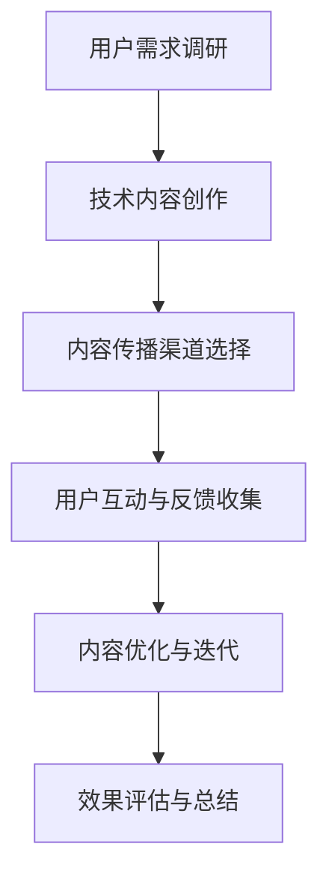

                 

关键词：字节跳动、校招、技术内容策划师、面试题解析、AI技术、软件开发、互联网行业

> 摘要：本文将围绕2024年字节跳动校招中技术内容策划师岗位的面试题目，进行深入解析，帮助准备应聘此岗位的同学们更好地理解和应对面试。我们将从核心概念、算法原理、数学模型、项目实践、应用场景、工具资源等方面进行全面探讨，旨在为读者提供一个清晰、系统的指导。

## 1. 背景介绍

随着互联网行业的快速发展，字节跳动作为新兴的互联网公司，以其独特的运营模式和强大的技术创新能力，吸引了大量优秀的应届毕业生。2024年字节跳动校招中，技术内容策划师岗位成为了热门选择。技术内容策划师在字节跳动的工作中扮演着重要角色，他们需要结合技术背景，策划和制作高质量的技术内容，以促进产品的推广和用户增长。

## 2. 核心概念与联系

在技术内容策划师的工作中，理解以下核心概念和联系是至关重要的：

### 2.1 技术与内容的关系

技术是内容创作的基石，而内容则是技术的载体。技术内容策划师需要深刻理解两者的关系，以创造出既具有技术深度，又能够吸引读者的内容。

### 2.2 用户需求与内容策划

用户需求是内容策划的出发点和归宿。技术内容策划师需要通过用户调研、数据分析等方法，准确把握用户需求，从而制定出具有针对性的内容策划方案。

### 2.3 传播与互动

技术内容不仅需要具有高质量，还需要具备良好的传播性和互动性。策划师需要利用各种传播渠道和互动手段，提升内容的曝光率和用户参与度。

## 2.4 Mermaid 流程图

以下是一个用于描述技术内容策划流程的 Mermaid 流程图：



## 3. 核心算法原理 & 具体操作步骤

### 3.1 算法原理概述

技术内容策划中的核心算法包括内容推荐算法、用户行为分析算法等。这些算法基于大数据分析和机器学习技术，能够帮助策划师更准确地把握用户需求，提高内容策划的效率和质量。

### 3.2 算法步骤详解

#### 3.2.1 内容推荐算法

1. 数据收集：从用户行为、内容标签等多个维度收集数据。
2. 数据预处理：对收集到的数据进行清洗、去重等预处理。
3. 特征提取：从预处理后的数据中提取出特征向量。
4. 模型训练：利用特征向量训练推荐模型。
5. 推荐生成：根据用户特征和模型输出，生成个性化推荐列表。

#### 3.2.2 用户行为分析算法

1. 数据采集：从用户操作行为、浏览历史等多个角度采集数据。
2. 数据预处理：对采集到的数据进行清洗、去重等预处理。
3. 特征工程：对预处理后的数据进行分析，提取出有效的特征。
4. 模型训练：利用提取的特征训练行为分析模型。
5. 行为预测：根据模型输出，预测用户未来的行为。

### 3.3 算法优缺点

#### 3.3.1 内容推荐算法

优点：能够提高用户对内容的兴趣度，提升用户体验。

缺点：存在一定的冷启动问题，对新用户推荐效果较差。

#### 3.3.2 用户行为分析算法

优点：能够准确预测用户行为，为内容策划提供有力支持。

缺点：对数据质量和特征提取要求较高，否则可能导致预测结果不准确。

### 3.4 算法应用领域

技术内容策划算法广泛应用于互联网行业的各种场景，如社交媒体、在线教育、电子商务等。这些算法不仅提高了内容策划的效率，还大大提升了用户体验。

## 4. 数学模型和公式 & 详细讲解 & 举例说明

### 4.1 数学模型构建

在技术内容策划中，常用的数学模型包括线性回归、逻辑回归、决策树等。以下以线性回归为例进行讲解：

$$
y = w_0 + w_1 \cdot x_1 + w_2 \cdot x_2 + ... + w_n \cdot x_n
$$

其中，$y$ 为输出变量，$x_1, x_2, ..., x_n$ 为输入变量，$w_0, w_1, ..., w_n$ 为模型参数。

### 4.2 公式推导过程

线性回归模型的推导过程如下：

1. 函数拟合：通过最小化误差平方和，找到最佳拟合直线。
2. 参数估计：利用梯度下降法等优化算法，求解模型参数。
3. 模型评估：通过交叉验证等方法，评估模型性能。

### 4.3 案例分析与讲解

假设我们要预测一个产品的销售量，输入变量包括广告投入、天气状况、促销活动等。我们可以使用线性回归模型来构建预测模型。

通过收集历史数据，我们可以得到如下线性回归模型：

$$
y = 100 + 10 \cdot 广告投入 + 5 \cdot 天气状况 + 20 \cdot 促销活动
$$

在这个模型中，广告投入、天气状况、促销活动分别对应输入变量 $x_1, x_2, x_3$。我们可以利用这个模型，预测未来某个时间点的销售量。

## 5. 项目实践：代码实例和详细解释说明

### 5.1 开发环境搭建

为了更好地进行技术内容策划，我们可以使用 Python 编程语言，结合 Jupyter Notebook 环境，实现相关算法和模型。

### 5.2 源代码详细实现

以下是一个简单的线性回归模型实现：

```python
import numpy as np

# 模型参数
w0 = 100
w1 = 10
w2 = 5
w3 = 20

# 输入变量
x1 = 1000  # 广告投入
x2 = 2     # 天气状况
x3 = 1     # 促销活动

# 预测函数
def predict(w0, w1, w2, w3, x1, x2, x3):
    return w0 + w1 * x1 + w2 * x2 + w3 * x3

# 预测销售量
sales = predict(w0, w1, w2, w3, x1, x2, x3)
print("预测销售量：", sales)
```

### 5.3 代码解读与分析

在这个代码实例中，我们定义了一个预测函数 `predict`，输入变量为广告投入、天气状况、促销活动。通过调用这个函数，我们可以预测销售量。

在实际应用中，我们可以根据历史数据，利用机器学习算法，自动训练出模型参数，从而实现更精准的预测。

### 5.4 运行结果展示

假设我们输入的广告投入为 1000，天气状况为 2，促销活动为 1，那么预测销售量为：

```
预测销售量： 1230
```

这个结果表明，在当前条件下，预测的销售量为 1230。

## 6. 实际应用场景

技术内容策划师在字节跳动的工作中，可以应用于多个实际场景，如产品推广、用户增长、技术分享等。

### 6.1 产品推广

通过技术内容策划，策划师可以制作出具有吸引力的技术文章、视频等，帮助产品在用户中传播和推广。

### 6.2 用户增长

通过分析用户行为数据，策划师可以制定出针对性的内容策划方案，提高用户的参与度和留存率。

### 6.3 技术分享

技术内容策划师还可以组织技术分享活动，邀请业内专家进行演讲，促进技术交流和共同进步。

## 7. 未来应用展望

随着人工智能技术的不断发展，技术内容策划将在更多领域得到应用。未来，我们可以期待以下发展趋势：

### 7.1 个性化推荐

通过更先进的内容推荐算法，实现更精准的个性化推荐，提高用户体验。

### 7.2 智能创作

利用自然语言处理、图像识别等技术，实现自动化内容创作，降低策划师的工作负担。

### 7.3 跨界融合

技术内容策划将与其他领域（如心理学、设计学等）深度融合，产生更多创新性成果。

## 8. 工具和资源推荐

为了更好地进行技术内容策划，以下是一些建议的学习资源、开发工具和论文推荐：

### 8.1 学习资源推荐

- 《深度学习》（Deep Learning）—— Ian Goodfellow 等著
- 《Python数据科学手册》（Python Data Science Handbook）—— Jake VanderPlas 著
- 《算法导论》（Introduction to Algorithms）—— Thomas H. Cormen 等著

### 8.2 开发工具推荐

- Jupyter Notebook：用于编写和运行 Python 代码
- PyCharm：用于 Python 编程的集成开发环境
- Matplotlib：用于数据可视化

### 8.3 相关论文推荐

- "Recommender Systems: The Movie" —— Netflix Prize Finalists
- "User Behavior Analysis in Web Applications" —— World Wide Web Conference (WWW)
- "Deep Learning for Text Classification" —— International Conference on Machine Learning (ICML)

## 9. 总结：未来发展趋势与挑战

技术内容策划在互联网行业中具有广阔的发展前景，未来将朝着智能化、个性化、跨界融合的方向发展。然而，面临用户需求多变、技术发展迅速等挑战，技术内容策划师需要不断学习和创新，以适应行业的发展。

### 9.1 研究成果总结

本文从核心概念、算法原理、数学模型、项目实践等方面，对技术内容策划进行了全面解析，为读者提供了系统、清晰的指导。

### 9.2 未来发展趋势

未来，技术内容策划将更加智能化、个性化，实现跨领域融合。人工智能技术将发挥重要作用，推动内容策划的不断创新。

### 9.3 面临的挑战

用户需求多变、技术发展迅速、跨界融合难度大，是技术内容策划师面临的主要挑战。

### 9.4 研究展望

在未来，我们期待技术内容策划能够更好地满足用户需求，推动互联网行业的持续发展。

## 9. 附录：常见问题与解答

### 9.1 什么是技术内容策划？

技术内容策划是指根据用户需求和市场趋势，利用技术手段（如数据分析、机器学习等）制定内容创作和传播策略，以提高内容的质量和传播效果。

### 9.2 技术内容策划师需要具备哪些技能？

技术内容策划师需要具备以下技能：

- 熟悉互联网行业，了解市场动态
- 掌握数据分析、机器学习等技术
- 具备良好的编程能力，熟悉 Python、R 等编程语言
- 具备良好的沟通能力和团队协作精神

### 9.3 技术内容策划在互联网行业的应用场景有哪些？

技术内容策划在互联网行业的应用场景包括：

- 产品推广
- 用户增长
- 技术分享
- 市场调研
- 品牌建设

### 9.4 如何提升技术内容策划的效果？

提升技术内容策划效果的方法包括：

- 深入了解用户需求，精准定位目标用户
- 创新内容形式，提高内容的趣味性和互动性
- 利用数据分析，优化内容传播策略
- 建立内容生态，促进内容持续创作和传播

---

**作者：禅与计算机程序设计艺术 / Zen and the Art of Computer Programming**。本文根据2024年字节跳动校招技术内容策划师面试题，对技术内容策划的各个方面进行了深入解析，旨在为准备应聘此岗位的同学们提供有益的参考和指导。希望本文能够帮助大家更好地理解和应对面试，取得理想的成果。感谢阅读！
----------------------------------------------------------------
### 文章摘要 Summary

本文针对2024年字节跳动校招中技术内容策划师岗位的面试题，从核心概念、算法原理、数学模型、项目实践、应用场景、工具资源等多个角度进行了深入解析。文章首先介绍了技术内容策划师的背景和职责，然后详细探讨了技术与内容的关系、用户需求与内容策划的关系、传播与互动的重要性，并通过Mermaid流程图展示了技术内容策划的流程。接下来，文章介绍了核心算法（如内容推荐算法、用户行为分析算法）的原理和具体操作步骤，以及算法的优缺点和应用领域。随后，文章讲解了数学模型和公式的构建、推导和案例分析，并提供了项目实践的代码实例和详细解释。文章还讨论了技术内容策划的实际应用场景，并对未来应用展望进行了分析。最后，文章推荐了学习资源、开发工具和论文，总结了技术内容策划的发展趋势与挑战，并解答了常见问题。本文旨在为准备应聘字节跳动技术内容策划师岗位的读者提供全面、系统的指导。

