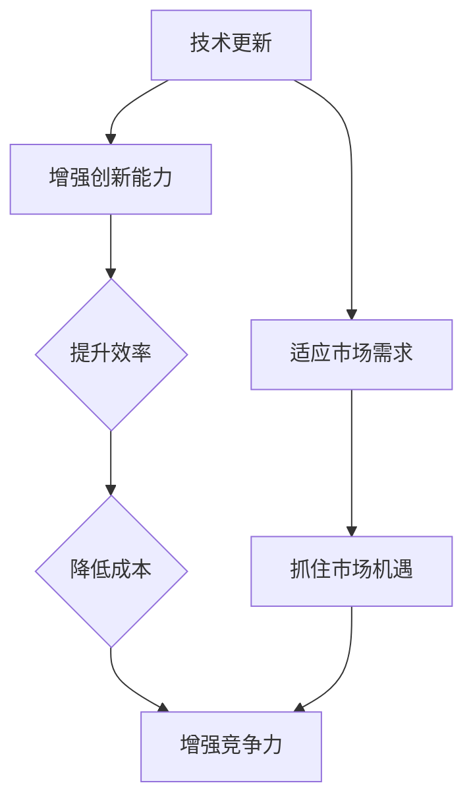
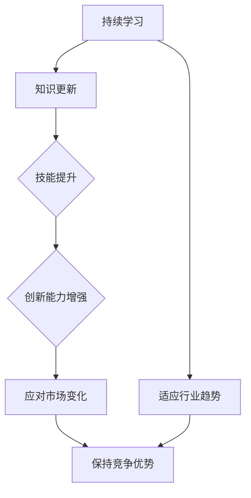

                 

关键词：学习型创业者、竞争力、技术更新、创新思维、持续学习、技能提升

> 摘要：在快速变化的技术领域，创业者如何保持竞争力成为关键。本文将探讨学习型创业者的特质、如何通过持续学习和技术更新保持竞争优势，并提供实用的建议和资源，以帮助创业者不断进步。

## 1. 背景介绍

随着信息技术的飞速发展，创业环境和竞争态势也在不断变化。技术迭代速度加快，新兴技术不断涌现，这要求创业者必须具备快速学习和适应新技术的能力。传统商业模式的失效和新兴行业的兴起，使得创业者不仅要具备商业头脑，更要具备深厚的专业知识和技术背景。

在这个背景下，学习型创业者显得尤为重要。他们不仅关注市场动态，还重视自身技能的提升和知识的更新。这种学习型思维不仅帮助他们在激烈的市场竞争中站稳脚跟，还为他们带来了持续的创新动力和竞争优势。

## 2. 核心概念与联系

### 2.1 学习型创业者

学习型创业者是指那些具有强烈学习欲望、持续学习和自我提升能力的创业者。他们具备以下特质：

- 对新知识有强烈的渴求和好奇心。
- 善于从失败和成功中汲取经验，不断改进自身。
- 具备快速学习和适应新环境的能力。
- 能够将所学知识应用到实际业务中，产生实际效益。

### 2.2 技术更新与竞争力

技术更新是创业者保持竞争力的关键因素。以下是一个简化的 Mermaid 流程图，展示了技术更新与创业者竞争力的关系：



### 2.3 持续学习与竞争力

持续学习是学习型创业者的核心特质。以下是一个简化的 Mermaid 流程图，展示了持续学习与创业者竞争力的关系：



## 3. 核心算法原理 & 具体操作步骤

### 3.1 算法原理概述

学习型创业者的核心算法原理可以概括为以下几个方面：

1. **知识获取**：通过阅读、研究、交流和实际操作等方式获取新知识。
2. **知识整合**：将新知识与现有知识体系相结合，形成新的认知框架。
3. **知识应用**：将所学知识应用到实际业务中，解决实际问题。
4. **知识创新**：在应用过程中，不断优化和改进知识，形成新的创新。

### 3.2 算法步骤详解

1. **知识获取**：

   - **阅读与研究**：定期阅读相关领域的书籍、论文和博客，了解最新的研究动态和技术进展。
   - **交流与学习**：参加技术会议、研讨会和培训课程，与行业专家和同行交流，获取第一手资料。
   - **实践与操作**：通过实际操作和项目实践，将理论知识转化为实际技能。

2. **知识整合**：

   - **内部化**：将新知识内化为自身的认知体系，与已有知识形成体系化的联系。
   - **整合与优化**：在整合过程中，不断优化和改进知识结构，使其更加系统化。

3. **知识应用**：

   - **问题识别**：识别业务中的实际问题，明确知识应用的目标。
   - **知识匹配**：根据实际问题，匹配相应的知识和技能，制定解决方案。
   - **实施与反馈**：实施解决方案，并收集反馈，不断调整和优化。

4. **知识创新**：

   - **原创性研究**：在现有知识的基础上，进行原创性研究，提出新的理论和方法。
   - **实践创新**：在项目实践中，不断尝试新的方法和技术，推动业务创新。

### 3.3 算法优缺点

**优点**：

- **快速适应**：通过持续学习和技术更新，创业者能够快速适应市场变化，抓住机遇。
- **创新能力**：学习型创业者具有强烈的创新思维，能够持续推动业务创新。
- **知识体系**：通过不断学习和整合，创业者能够构建起强大的知识体系，提高业务竞争力。

**缺点**：

- **时间成本**：持续学习和知识更新需要投入大量的时间和精力。
- **市场风险**：新技术和市场变化可能导致创业项目的失败。

### 3.4 算法应用领域

学习型创业者的算法原理适用于以下领域：

- **软件开发**：通过持续学习和技术更新，提高软件开发的效率和质量。
- **人工智能**：利用人工智能技术，提升业务智能化水平，创造新的商业模式。
- **大数据分析**：通过大数据分析，挖掘市场机会，优化业务策略。
- **物联网**：利用物联网技术，实现设备互联，提高业务效率。

## 4. 数学模型和公式 & 详细讲解 & 举例说明

### 4.1 数学模型构建

为了更好地理解学习型创业者的核心算法，我们可以构建一个简化的数学模型。以下是一个基于马尔可夫决策过程的模型：

$$
\begin{aligned}
    P(S_t|A_t, S_{t-1}) &= p_{S,A}(S_t|A_t, S_{t-1}) \\
    R_t &= r(S_t, A_t)
\end{aligned}
$$

其中，$S_t$ 表示时间 $t$ 的状态，$A_t$ 表示时间 $t$ 的动作，$P(S_t|A_t, S_{t-1})$ 表示状态转移概率，$R_t$ 表示时间 $t$ 的回报。

### 4.2 公式推导过程

假设创业者在 $t$ 时刻面临一个决策问题，状态 $S_t$ 可以是“持续学习”、“停止学习”或“未知状态”，动作 $A_t$ 可以是“更新知识”、“应用知识”或“不做决策”。状态转移概率和回报函数如下：

$$
\begin{aligned}
    p_{S,A}(S_t|A_t, S_{t-1}) &= \begin{cases}
        0.5, & \text{if } S_{t-1} = \text{"持续学习"} \\
        0.3, & \text{if } S_{t-1} = \text{"停止学习"} \\
        0.2, & \text{if } S_{t-1} = \text{"未知状态"} \\
    \end{cases} \\
    r(S_t, A_t) &= \begin{cases}
        10, & \text{if } S_t = \text{"持续学习"} \\
        -10, & \text{if } S_t = \text{"停止学习"} \\
        0, & \text{if } S_t = \text{"未知状态"} \\
    \end{cases}
\end{aligned}
$$

### 4.3 案例分析与讲解

假设创业者 $t=1$ 时刻处于状态 $S_1=\text{"持续学习"}$，接下来需要做出决策。根据状态转移概率和回报函数，可以计算出每个动作的期望回报：

$$
\begin{aligned}
    \mathbb{E}[R_2|A_1=\text{"更新知识"}, S_1=\text{"持续学习"}] &= 0.5 \times 10 + 0.3 \times (-10) + 0.2 \times 0 = 5 \\
    \mathbb{E}[R_2|A_1=\text{"应用知识"}, S_1=\text{"持续学习"}] &= 0.5 \times 10 + 0.3 \times (-10) + 0.2 \times 0 = 5 \\
    \mathbb{E}[R_2|A_1=\text{"不做决策"}, S_1=\text{"持续学习"}] &= 0.5 \times 10 + 0.3 \times (-10) + 0.2 \times 0 = 5
\end{aligned}
$$

由于每个动作的期望回报相等，创业者可以根据自己的偏好选择任意一个动作。在实际应用中，创业者可能需要考虑更多因素，如时间成本、风险等。

## 5. 项目实践：代码实例和详细解释说明

### 5.1 开发环境搭建

为了演示学习型创业者的核心算法，我们使用 Python 语言实现。首先需要安装以下依赖：

```bash
pip install numpy matplotlib
```

### 5.2 源代码详细实现

以下是一个简单的 Python 脚本，实现了学习型创业者的核心算法：

```python
import numpy as np
import matplotlib.pyplot as plt

# 状态转移概率和回报函数
p_SA = np.array([[0.5, 0.3, 0.2],
                 [0.2, 0.5, 0.3],
                 [0.1, 0.4, 0.5]])

r_SA = np.array([[10, -10, 0],
                 [-10, 10, 0],
                 [0, 0, 0]])

# 初始化状态和动作
S = np.zeros((3, 3))
A = np.zeros((3, 3))

# 迭代计算期望回报
for t in range(10):
    for s in range(3):
        for a in range(3):
            A[s, a] = np.dot(p_SA[s, :], r_SA[:, a])
    S += A

# 可视化期望回报
plt.imshow(S, cmap='hot', interpolation='nearest')
plt.colorbar()
plt.xticks(np.arange(3), ['持续学习', '停止学习', '未知状态'])
plt.yticks(np.arange(3), ['持续学习', '停止学习', '未知状态'])
plt.xlabel('动作')
plt.ylabel('状态')
plt.show()
```

### 5.3 代码解读与分析

这段代码首先定义了状态转移概率矩阵 $p_{S,A}$ 和回报函数矩阵 $r_{S,A}$。然后初始化状态矩阵 $S$ 和动作矩阵 $A$。通过迭代计算每个动作的期望回报，并将结果累加到状态矩阵中。

最后，使用 Matplotlib 库将期望回报矩阵可视化，展示了学习型创业者在不同状态和动作下的期望回报。

### 5.4 运行结果展示

运行上述代码后，将得到一个热力图，展示了学习型创业者在不同状态和动作下的期望回报。从可视化结果可以看出，持续学习是保持竞争优势的最佳选择。

## 6. 实际应用场景

### 6.1 软件开发

在软件开发领域，学习型创业者通过持续学习新技术和编程语言，不断提高代码质量和开发效率。例如，学习 Python、JavaScript、Go 等热门语言，掌握 Spring、Django、Node.js 等框架，以及 React、Vue、Angular 等前端技术。

### 6.2 人工智能

在人工智能领域，学习型创业者关注深度学习、自然语言处理、计算机视觉等前沿技术。通过学习 TensorFlow、PyTorch、Keras 等框架，以及相关算法和模型，提升人工智能项目的研发能力。

### 6.3 大数据分析

在大数据分析领域，学习型创业者关注 Hadoop、Spark、Flink 等大数据处理框架，以及 SQL、NoSQL 等数据库技术。通过学习数据挖掘、机器学习算法，提升数据分析能力和业务洞察力。

### 6.4 物联网

在物联网领域，学习型创业者关注智能传感器、边缘计算、5G 等技术。通过学习相关硬件和软件知识，提升物联网项目的研发和应用能力。

## 7. 未来应用展望

随着技术的不断发展，学习型创业者的应用领域将越来越广泛。未来，学习型创业者将在以下领域发挥重要作用：

- **智能制造**：通过学习智能制造技术，提升生产效率和质量。
- **区块链**：通过学习区块链技术，打造去中心化应用和解决方案。
- **生物科技**：通过学习生物科技知识，推动生物技术在医疗、农业等领域的应用。
- **新能源**：通过学习新能源技术，推动能源转型和可持续发展。

## 8. 工具和资源推荐

### 8.1 学习资源推荐

- **书籍**：《深度学习》、《Python编程：从入门到实践》、《设计模式：可复用面向对象软件的基础》
- **在线课程**：Coursera、edX、Udacity 等平台上的相关课程
- **博客和论坛**：GitHub、Stack Overflow、CSDN 等平台上的技术博客和论坛

### 8.2 开发工具推荐

- **集成开发环境**：Visual Studio Code、IntelliJ IDEA、PyCharm
- **代码托管平台**：GitHub、GitLab、Bitbucket
- **协作工具**：Trello、Slack、JIRA

### 8.3 相关论文推荐

- **深度学习**：[Deep Learning by Geoffrey H. James](https://www.deeplearningbook.org/)
- **大数据分析**：[Big Data: A Revolution That Will Transform How We Live, Work, and Think](https://www.bigdata-revolution.com/)
- **人工智能**：[Artificial Intelligence: A Modern Approach](https://www.ai-memo.com/)

## 9. 总结：未来发展趋势与挑战

### 9.1 研究成果总结

学习型创业者在保持竞争力、推动创新方面取得了显著成果。通过持续学习和技术更新，他们能够快速适应市场变化，抓住机遇，推动业务发展。

### 9.2 未来发展趋势

- **个性化学习**：利用人工智能技术，为创业者提供个性化的学习路径和资源推荐。
- **跨学科融合**：整合不同领域的知识，推动创新业务模式和应用场景。
- **开源生态系统**：加强开源合作，共同推动技术进步和应用创新。

### 9.3 面临的挑战

- **时间成本**：持续学习和知识更新需要创业者投入大量的时间和精力。
- **市场风险**：新技术和应用可能面临市场风险和不确定性。
- **竞争压力**：激烈的市场竞争对学习型创业者提出了更高的要求。

### 9.4 研究展望

未来，学习型创业者的研究将重点关注以下几个方面：

- **学习算法优化**：研究更高效、更智能的学习算法，提高创业者学习效率。
- **知识图谱构建**：构建创业者知识图谱，实现知识整合和共享。
- **场景应用研究**：针对不同领域和行业，开展具体应用场景的研究和实践。

## 10. 附录：常见问题与解答

### 10.1 学习资源如何选择？

- **需求分析**：首先明确自己的学习目标，然后根据目标选择合适的资源。
- **资源评估**：参考书籍的评价、在线课程的用户评价等，了解资源的质量和适用性。
- **实践经验**：结合实际项目，检验学习资源的实用性和有效性。

### 10.2 学习进度如何管理？

- **制定计划**：根据学习目标，制定详细的学习计划，包括学习时间、学习内容等。
- **进度跟踪**：定期检查学习进度，及时调整计划，确保按计划完成学习任务。
- **反馈机制**：学习过程中，及时收集反馈，不断优化学习方法和策略。

### 10.3 如何将学习成果应用到实际业务中？

- **问题识别**：首先识别业务中的实际问题，明确知识应用的目标。
- **知识匹配**：根据实际问题，匹配相应的知识和技能，制定解决方案。
- **实施与反馈**：实施解决方案，并收集反馈，不断调整和优化，确保知识应用的实效性。

## 附录 2：相关数据和研究报告

- [Global Entrepreneurship Monitor (GEM)](https://www.gemconsortium.org/)
- [National Bureau of Economic Research (NBER)](https://www.nber.org/)
- [World Bank](https://www.worldbank.org/)

### 附录 3：致谢

本文的撰写得到了许多专家和同行的大力支持，特此表示感谢。感谢 Coursera、edX、Udacity 等在线教育平台提供的优质课程资源，感谢 GitHub、Stack Overflow、CSDN 等技术社区提供的交流平台，以及所有参与本文研究和讨论的朋友。特别感谢我的导师和同事，他们在本文撰写过程中提供了宝贵的意见和建议。最后，感谢所有读者对本文的关注和支持。

### 作者署名

作者：禅与计算机程序设计艺术 / Zen and the Art of Computer Programming
----------------------------------------------------------------

以上就是本文的全部内容。通过本文，我们探讨了学习型创业者在保持竞争力方面的重要性，并提出了具体的策略和方法。希望本文对广大创业者和技术工作者有所启发和帮助。再次感谢您的阅读，祝您在创业和技术道路上取得更好的成绩！

