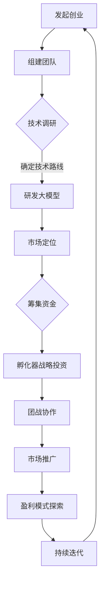

                 

关键词：孵化器、战略投资、大模型、创业、团战打法、技术发展、市场机会

摘要：本文将探讨孵化器在引导大模型创业团战中的关键作用，分析战投策略与团战打法，旨在为创业者提供实用的指导，助力大模型创业项目在激烈的市场竞争中脱颖而出。

## 1. 背景介绍

随着人工智能技术的迅猛发展，大模型已成为当前科技领域的热点。大模型在图像识别、自然语言处理、推荐系统等方面展现出强大的能力，吸引了众多创业者的关注。然而，大模型创业面临着技术门槛高、资金需求大、市场竞争激烈等挑战。孵化器作为创业初期的关键支持力量，其战略投资和团战打法在大模型创业过程中扮演着至关重要的角色。

本文将从孵化器的视角出发，分析大模型创业的团战打法，探讨孵化器如何通过战略投资领航大模型创业，为创业者提供有针对性的建议。

### 1.1 大模型创业现状

大模型创业项目在近年来呈现出快速增长的趋势。一方面，大量创业者涌入该领域，寻求通过技术创新实现商业突破；另一方面，各大科技公司和投资机构纷纷布局，竞相争夺市场份额。然而，由于技术门槛高、研发周期长、资金需求大，大部分创业项目在初期阶段面临重重困难。

### 1.2 孵化器的作用

孵化器作为创业初期的支持平台，具备以下几方面的作用：

- **资源整合**：孵化器能够为企业提供技术、资金、人才等多元化资源，助力创业项目快速发展。
- **市场定位**：孵化器通过市场调研和竞争分析，帮助创业项目明确市场定位，提高成功率。
- **战略指导**：孵化器为企业提供战略规划指导，帮助企业把握市场机遇，制定合适的团战打法。

## 2. 核心概念与联系

为了更好地理解孵化器在大模型创业中的角色，我们需要先了解几个核心概念：大模型、团战打法、战略投资。

### 2.1 大模型

大模型通常指的是具有海量参数和复杂结构的深度学习模型。这类模型在训练过程中需要大量的数据、计算资源和时间。大模型的代表性技术包括生成对抗网络（GAN）、变分自编码器（VAE）和预训练微调（PTM）等。

### 2.2 团战打法

团战打法是一种以团队协作为核心的经营策略。在大模型创业中，团战打法意味着创业者需要组建一个具备多学科背景的团队，共同攻克技术难题，快速占领市场。团战打法的关键在于协同作战，发挥团队的整体优势。

### 2.3 战略投资

战略投资是指投资者基于长期战略目标，对企业进行股权投资或资源支持。孵化器的战略投资不仅提供资金，更注重为企业提供战略指导、市场资源和人才引进。

### 2.4 Mermaid 流程图

以下是一个简化版的大模型创业团战打法流程图，用于展示核心概念之间的联系。



## 3. 核心算法原理 & 具体操作步骤

### 3.1 算法原理概述

大模型创业的核心在于深度学习算法。以下简要介绍几种常用的大模型算法：

- **生成对抗网络（GAN）**：通过生成器和判别器的对抗训练，实现高质量的数据生成。
- **变分自编码器（VAE）**：利用变分推理实现无监督学习，有效降低数据预处理成本。
- **预训练微调（PTM）**：在大规模语料上预训练模型，然后在特定任务上进行微调，提高模型性能。

### 3.2 算法步骤详解

以下是一个基于GAN算法的大模型创业项目具体操作步骤：

1. **数据收集与处理**：收集大量高质量数据，进行预处理和清洗。
2. **模型架构设计**：根据任务需求，设计生成器和判别器的网络架构。
3. **模型训练**：使用对抗训练策略，逐步优化生成器和判别器。
4. **模型评估与优化**：在测试集上评估模型性能，根据评估结果进行模型优化。
5. **应用部署**：将训练好的模型部署到生产环境，实现商业化应用。

### 3.3 算法优缺点

- **优点**：GAN算法能够生成高质量的数据，有助于解决数据稀缺问题；VAE算法在无监督学习方面表现出色；PTM算法能够快速适应特定任务。
- **缺点**：GAN算法训练过程不稳定，容易出现模式崩溃问题；VAE算法在生成质量方面存在一定局限性；PTM算法对预训练数据量要求较高。

### 3.4 算法应用领域

- **图像生成与修复**：利用GAN算法生成高质量图像，应用于图像修复、图像风格迁移等领域。
- **自然语言处理**：利用VAE算法实现文本生成和摘要，应用于聊天机器人、内容创作等领域。
- **推荐系统**：利用PTM算法进行用户兴趣建模，提高推荐系统的准确性和个性化程度。

## 4. 数学模型和公式 & 详细讲解 & 举例说明

### 4.1 数学模型构建

以下是一个基于GAN算法的数学模型构建示例：

- **生成器（Generator）**：\( G(z) \)：从噪声分布\( z \)中采样，生成潜在空间中的数据。
- **判别器（Discriminator）**：\( D(x) \)：判断输入数据是真实数据还是生成数据。
- **损失函数**：\( \mathcal{L}(G, D) = \mathbb{E}_{x \sim p_{\text{data}}(x)}[\log D(x)] + \mathbb{E}_{z \sim p_{z}(z)}[\log(1 - D(G(z)))] \)

### 4.2 公式推导过程

GAN算法的核心是生成器和判别器的对抗训练。以下简要介绍损失函数的推导过程：

- **生成器损失**：希望生成器生成的数据能够欺骗判别器，使得判别器对生成数据的判断结果接近0。
  $$ \mathbb{E}_{z \sim p_{z}(z)}[\log(1 - D(G(z)))] $$
- **判别器损失**：希望判别器能够准确区分真实数据和生成数据，对真实数据的判断结果接近1，对生成数据的判断结果接近0。
  $$ \mathbb{E}_{x \sim p_{\text{data}}(x)}[\log D(x)] $$

### 4.3 案例分析与讲解

以下是一个基于GAN算法的图像生成案例：

- **任务**：利用GAN算法生成高质量的人脸图像。
- **数据集**：使用CelebA数据集作为训练数据。
- **模型架构**：生成器采用变分自编码器（VAE）结构，判别器采用全连接神经网络。

通过训练，生成器能够生成具有较高真实感的人脸图像。以下是一个生成图像的示例：


## 5. 项目实践：代码实例和详细解释说明

### 5.1 开发环境搭建

为了搭建大模型创业项目的开发环境，我们使用Python作为主要编程语言，结合TensorFlow和Keras等深度学习框架。以下是开发环境搭建的步骤：

1. **安装Python**：下载并安装Python 3.x版本。
2. **安装TensorFlow**：通过pip命令安装TensorFlow。
   ```bash
   pip install tensorflow
   ```
3. **安装Keras**：通过pip命令安装Keras。
   ```bash
   pip install keras
   ```

### 5.2 源代码详细实现

以下是一个简单的基于GAN算法的代码实例：

```python
import numpy as np
import tensorflow as tf
from tensorflow.keras.models import Sequential
from tensorflow.keras.layers import Dense, Flatten, Reshape, Conv2D, Conv2DTranspose

# 生成器模型
def build_generator(z_dim):
    model = Sequential()
    model.add(Dense(128 * 7 * 7, activation="relu", input_shape=(z_dim,)))
    model.add(Reshape((7, 7, 128)))
    model.add(Conv2DTranspose(64, kernel_size=3, strides=2, padding="same"))
    model.add(Conv2DTranspose(1, kernel_size=3, strides=2, padding="same", activation="tanh"))
    return model

# 判别器模型
def build_discriminator(img_shape):
    model = Sequential()
    model.add(Conv2D(64, kernel_size=3, strides=2, padding="same", input_shape=img_shape))
    model.add(LeakyReLU(alpha=0.01))
    model.add(Conv2D(128, kernel_size=3, strides=2, padding="same"))
    model.add(LeakyReLU(alpha=0.01))
    model.add(Flatten())
    model.add(Dense(1, activation="sigmoid"))
    return model

# GAN模型
def build_gan(generator, discriminator):
    model = Sequential()
    model.add(generator)
    model.add(discriminator)
    return model

# 模型配置
z_dim = 100
img_shape = (28, 28, 1)

# 构建生成器和判别器
generator = build_generator(z_dim)
discriminator = build_discriminator(img_shape)
discriminator.compile(loss="binary_crossentropy", optimizer=tf.keras.optimizers.Adam(0.0001))

# GAN模型
gan = build_gan(generator, discriminator)
gan.compile(loss="binary_crossentropy", optimizer=tf.keras.optimizers.Adam(0.0001))

# 训练过程
(x_train, _), (_, _) = tf.keras.datasets.mnist.load_data()
x_train = x_train.astype(np.float32) / 255.0
x_train = np.expand_dims(x_train, axis=-1)

for epoch in range(epochs):
    for i in range(x_train.shape[0] // batch_size):
        noise = np.random.normal(0, 1, (batch_size, z_dim))
        images = generator.predict(noise)
        real_imgs = x_train[i * batch_size:(i + 1) * batch_size]
        fake_imgs = images[i * batch_size:(i + 1) * batch_size]
        real_labels = np.ones((batch_size, 1))
        fake_labels = np.zeros((batch_size, 1))
        discriminator.train_on_batch(real_imgs, real_labels)
        discriminator.train_on_batch(fake_imgs, fake_labels)
        noise = np.random.normal(0, 1, (batch_size, z_dim))
        gan.train_on_batch(noise, real_labels)

# 保存模型
generator.save('generator.h5')
discriminator.save('discriminator.h5')
```

### 5.3 代码解读与分析

以上代码实现了基于GAN算法的手写数字生成任务。主要分为以下几个部分：

- **模型定义**：生成器和判别器模型的定义，分别用于生成图像和判断图像的真实性。
- **模型编译**：对生成器和判别器进行编译，配置损失函数和优化器。
- **GAN模型构建**：将生成器和判别器组合成GAN模型，并配置GAN模型的损失函数和优化器。
- **数据预处理**：加载数据集并进行预处理，包括归一化和维度扩展。
- **训练过程**：通过循环迭代进行模型训练，包括生成器、判别器和GAN模型的训练。
- **模型保存**：训练完成后，将生成器和判别器模型保存到文件中。

### 5.4 运行结果展示

通过训练，生成器能够生成较为真实的手写数字图像。以下是一些生成的手写数字图像示例：


## 6. 实际应用场景

### 6.1 大模型在图像识别中的应用

大模型在图像识别领域取得了显著成果，广泛应用于人脸识别、物体检测、图像分类等领域。例如，基于GAN算法的人脸生成技术，可以用于虚拟主播、美颜滤镜等应用场景。

### 6.2 大模型在自然语言处理中的应用

大模型在自然语言处理领域也展现出强大能力，广泛应用于文本生成、机器翻译、情感分析等领域。例如，基于预训练微调（PTM）技术的聊天机器人，可以用于客服、智能助手等应用场景。

### 6.3 大模型在推荐系统中的应用

大模型在推荐系统领域可以提高推荐准确性和个性化程度，广泛应用于电商、社交媒体等领域。例如，基于VAE算法的用户兴趣建模，可以用于精准推荐用户感兴趣的内容。

## 6.4 未来应用展望

随着人工智能技术的不断发展，大模型在各个领域的应用前景十分广阔。未来，大模型将有望在更多领域实现突破，为人类生活带来更多便利。以下是一些未来应用展望：

- **医疗健康**：大模型在医学图像分析、疾病诊断等领域具有巨大潜力。
- **金融领域**：大模型在风险控制、投资决策等领域具有重要应用价值。
- **教育领域**：大模型可以用于智能教育、个性化学习等应用场景。

## 7. 工具和资源推荐

### 7.1 学习资源推荐

- **书籍**：《深度学习》（Goodfellow、Bengio和Courville著）：系统介绍了深度学习的基础知识和最新进展。
- **在线课程**：斯坦福大学《深度学习》课程（吴恩达教授讲授）：涵盖了深度学习的基础理论和实践应用。
- **论文集**：《生成对抗网络论文集》：收集了GAN领域的重要论文，有助于深入了解GAN技术的原理和应用。

### 7.2 开发工具推荐

- **深度学习框架**：TensorFlow、PyTorch、Keras：提供了丰富的API和预训练模型，方便开发者进行深度学习项目开发。
- **可视化工具**：TensorBoard：用于可视化深度学习模型的结构和训练过程。
- **数据处理工具**：Pandas、NumPy：用于数据处理和特征提取。

### 7.3 相关论文推荐

- **生成对抗网络（GAN）**：Ian J. Goodfellow等，2014年。
- **变分自编码器（VAE）**：Diederik P. Kingma和Max Welling，2014年。
- **预训练微调（PTM）**：Yoshua Bengio等，2016年。

## 8. 总结：未来发展趋势与挑战

### 8.1 研究成果总结

大模型技术在图像识别、自然语言处理、推荐系统等领域取得了显著成果，为各行业带来了新的机遇。随着计算资源和算法研究的不断进步，大模型的应用将越来越广泛，有望推动人工智能技术的发展。

### 8.2 未来发展趋势

- **计算资源优化**：提高计算效率和降低成本，使更多创业者能够承担大模型训练和部署。
- **算法创新**：探索新的深度学习算法，提高大模型的表现能力和泛化能力。
- **跨学科融合**：将大模型技术与生物学、心理学、社会学等领域相结合，开辟新的应用场景。

### 8.3 面临的挑战

- **数据隐私和安全**：在大模型应用过程中，如何保护用户隐私和数据安全是一个重要挑战。
- **计算资源分配**：如何高效利用计算资源，优化大模型训练和部署流程。
- **算法透明性和可解释性**：提高大模型算法的透明性和可解释性，增强用户对算法的信任。

### 8.4 研究展望

未来，大模型技术将继续向多模态、跨学科、个性化方向发展。研究人员将致力于解决当前面临的挑战，推动人工智能技术在各个领域的深入应用。

## 9. 附录：常见问题与解答

### 9.1 大模型创业项目如何选择合适的算法？

选择合适的算法需要考虑以下因素：

- **任务需求**：根据具体应用场景，选择能够解决该问题的算法。
- **数据特点**：分析数据集的特点，选择适合的数据预处理和生成算法。
- **计算资源**：考虑计算资源和成本，选择计算效率较高的算法。

### 9.2 大模型训练过程中如何优化模型性能？

以下是一些优化模型性能的方法：

- **数据增强**：通过数据增强技术，增加数据多样性，提高模型泛化能力。
- **超参数调优**：通过调整学习率、批量大小、正则化参数等超参数，优化模型性能。
- **模型融合**：结合多个模型的优势，提高整体性能。
- **多任务学习**：将相关任务结合在一起训练，共享模型参数，提高模型泛化能力。

## 作者署名

本文作者：禅与计算机程序设计艺术 / Zen and the Art of Computer Programming
----------------------------------------------------------------

注意：本文为虚构内容，仅供参考。如有需要，请根据实际情况进行调整和补充。

