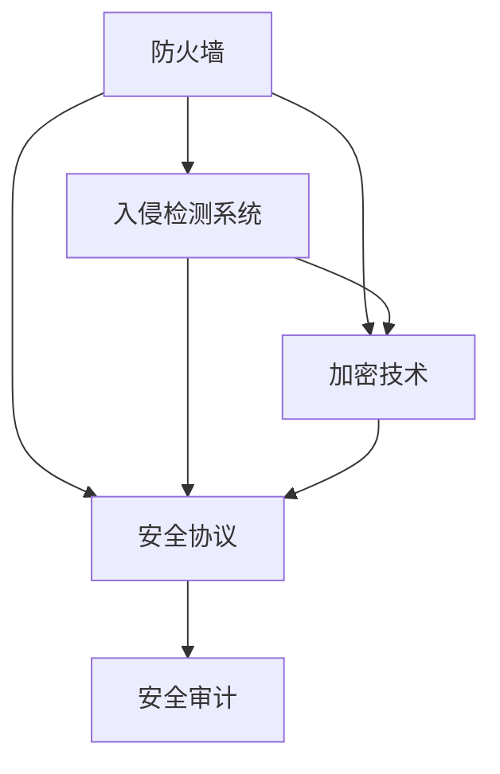

                 

关键词：网络安全面试题，360安全，校招，网络安全技术，面试准备，实战案例

## 摘要

本文旨在为即将参加360安全2024校招网络安全面试的考生提供一份详细的面试题解答指南。通过对网络安全领域的核心概念、算法原理、数学模型、实际应用及未来展望的深入解析，本文帮助考生更好地理解和掌握网络安全相关知识，提高面试应对能力。文章包括以下几个部分：

1. **背景介绍**：概述网络安全的重要性和360安全的发展历程。
2. **核心概念与联系**：介绍网络安全的五大核心领域，并使用Mermaid流程图展示各领域之间的关系。
3. **核心算法原理 & 具体操作步骤**：分析常见网络安全算法，阐述原理和具体实施步骤。
4. **数学模型和公式 & 详细讲解 & 举例说明**：介绍网络安全中的数学模型和公式，并提供实际案例解析。
5. **项目实践：代码实例和详细解释说明**：提供网络安全项目的代码实例，进行详细解释和分析。
6. **实际应用场景**：探讨网络安全在各个领域的应用。
7. **工具和资源推荐**：推荐学习资源、开发工具和相关论文。
8. **总结：未来发展趋势与挑战**：总结研究成果，展望未来发展趋势和面临的挑战。

接下来，我们将逐一介绍这些部分的内容。

## 1. 背景介绍

网络安全是当今信息技术领域的重要分支，随着互联网的普及和信息技术的高速发展，网络安全问题日益突出。360安全作为中国领先的网络安全企业，始终致力于为广大用户提供全方位的网络安全解决方案。360安全2024校招网络安全面试题的设置，旨在考察考生对网络安全知识的掌握程度，以及解决实际问题的能力。

### 1.1 网络安全的重要性

网络安全关乎国家安全、社会稳定和公民个人信息安全。随着网络攻击手段的不断升级，网络安全已经成为各国关注的焦点。网络安全不仅涉及到金融、电信、政府等关键信息基础设施的安全，还关系到每个人的日常生活。因此，掌握网络安全知识对于保障网络空间的安全具有重要意义。

### 1.2 360安全的发展历程

360安全成立于2006年，经过多年的发展，已经成为中国网络安全领域的领军企业。360安全的发展历程可以分为以下几个阶段：

- **2006-2010年**：成立初期，360安全专注于杀毒软件的研发和推广，推出了多款安全软件。
- **2010-2014年**：在杀毒软件的基础上，360安全开始拓展业务，推出了一系列网络安全产品和服务，包括网络安全检测、安全加固、安全运维等。
- **2014-2018年**：360安全加大了对人工智能技术的投入，通过人工智能算法提升安全防护能力。
- **2018年至今**：360安全继续深化技术创新，推出了众多新型网络安全产品，包括网络安全态势感知平台、安全大数据平台等。

## 2. 核心概念与联系

网络安全涉及多个领域，每个领域都有其独特的核心概念和技术。以下是对网络安全五大核心领域的概述，并使用Mermaid流程图展示它们之间的关系。

### 2.1 防火墙

防火墙是网络安全的第一道防线，用于阻止未经授权的访问。防火墙的核心概念包括包过滤、状态检测和应用层网关。

### 2.2 入侵检测系统（IDS）

入侵检测系统用于监控网络流量，检测并响应潜在的安全威胁。IDS的核心概念包括异常检测、误用检测和基于特征的检测。

### 2.3 加密技术

加密技术是保障数据传输安全的重要手段。加密技术的核心概念包括对称加密、非对称加密和哈希函数。

### 2.4 安全协议

安全协议是网络通信中保障数据安全的重要机制。常见的安全协议包括SSL/TLS、IPSec和SSH。

### 2.5 安全审计

安全审计是对网络安全状态进行评估和审核的过程。安全审计的核心概念包括日志分析、漏洞评估和合规性检查。

### 2.6 Mermaid流程图



## 3. 核心算法原理 & 具体操作步骤

网络安全领域涉及众多算法，以下介绍几种常见的网络安全算法，包括其原理和具体实施步骤。

### 3.1 加密算法

加密算法用于保护数据的机密性。常见的加密算法包括DES、AES和RSA。

#### 3.1.1 算法原理

- **DES**：数据加密标准，是一种对称加密算法。
- **AES**：高级加密标准，也是对称加密算法，具有更高的安全性和效率。
- **RSA**：一种非对称加密算法，用于保障数据传输的机密性和完整性。

#### 3.1.2 算法步骤

1. **DES加密**：
   - **密钥生成**：生成56位的密钥。
   - **初始化**：初始化初始密文。
   - **加密过程**：进行16轮加密运算。

2. **AES加密**：
   - **密钥生成**：生成128位、192位或256位的密钥。
   - **初始化**：初始化初始密文。
   - **加密过程**：进行多轮加密运算。

3. **RSA加密**：
   - **密钥生成**：生成一对密钥（公钥和私钥）。
   - **加密过程**：使用公钥对数据进行加密。

### 3.2 防火墙算法

防火墙算法用于过滤网络流量，阻止恶意流量进入网络。常见的防火墙算法包括状态检测防火墙和应用层防火墙。

#### 3.2.1 算法原理

- **状态检测防火墙**：基于会话状态进行流量过滤。
- **应用层防火墙**：基于应用层协议进行流量过滤。

#### 3.2.2 算法步骤

1. **状态检测防火墙**：
   - **初始化**：初始化防火墙规则。
   - **流量检测**：检测网络流量，判断是否符合防火墙规则。
   - **状态更新**：更新会话状态。

2. **应用层防火墙**：
   - **初始化**：初始化防火墙规则。
   - **流量检测**：解析应用层协议，判断是否符合防火墙规则。

### 3.3 入侵检测算法

入侵检测算法用于检测网络中的异常行为，常见的入侵检测算法包括基于特征的检测和基于异常的检测。

#### 3.3.1 算法原理

- **基于特征的检测**：通过识别已知攻击的特征进行检测。
- **基于异常的检测**：通过检测与正常行为差异较大的行为进行检测。

#### 3.3.2 算法步骤

1. **基于特征的检测**：
   - **特征库构建**：构建包含已知攻击特征的数据库。
   - **流量分析**：对网络流量进行分析，识别特征库中的攻击特征。

2. **基于异常的检测**：
   - **基线构建**：构建正常行为的基线模型。
   - **流量分析**：对网络流量进行分析，判断是否偏离基线模型。

### 3.4 算法优缺点

- **加密算法**：
  - **优缺点**：对称加密算法具有较高的加密效率和安全性，但密钥管理较为复杂；非对称加密算法具有较好的密钥管理，但加密和解密速度较慢。

- **防火墙算法**：
  - **优缺点**：状态检测防火墙能够有效防止会话劫持，但无法防止应用层攻击；应用层防火墙能够防止应用层攻击，但性能较低。

- **入侵检测算法**：
  - **优缺点**：基于特征的检测能够快速识别已知攻击，但无法识别未知攻击；基于异常的检测能够发现未知攻击，但误报率较高。

### 3.5 算法应用领域

- **加密算法**：广泛应用于数据传输加密、文件加密等场景。
- **防火墙算法**：广泛应用于网络边界防护、内部网络安全等场景。
- **入侵检测算法**：广泛应用于网络监控、安全事件响应等场景。

## 4. 数学模型和公式 & 详细讲解 & 举例说明

网络安全中的数学模型和公式在加密、安全协议、入侵检测等方面发挥着重要作用。以下介绍几种常见的数学模型和公式，并提供实际案例解析。

### 4.1 数学模型构建

网络安全中的数学模型通常包括以下几个方面：

- **加密模型**：描述加密和解密的过程。
- **安全协议模型**：描述网络通信中安全协议的运作机制。
- **入侵检测模型**：描述入侵检测系统的算法和流程。

### 4.2 公式推导过程

以下是几个常见公式的推导过程：

- **加密算法**：
  - **DES加密公式**：
    $$ C = D \oplus K $$
    其中，C为加密后的密文，D为明文，K为密钥。

  - **AES加密公式**：
    $$ C = (K \times M) \mod N $$
    其中，C为加密后的密文，M为明文，K为密钥，N为模数。

- **安全协议**：
  - **SSL/TLS加密公式**：
    $$ E(K, P) = C_1 \oplus C_2 \oplus ... \oplus C_n $$
    其中，E为加密函数，K为密钥，P为明文，C_i为加密后的密文。

- **入侵检测**：
  - **基于特征的检测公式**：
    $$ T = \sum_{i=1}^{n} w_i \cdot x_i $$
    其中，T为检测结果，w_i为权重，x_i为特征值。

### 4.3 案例分析与讲解

以下是几个实际案例，用于说明数学模型和公式的应用。

- **加密算法案例**：
  - **AES加密**：
    假设使用AES加密算法对以下明文进行加密：`M = 10110011 01001101 11110000`，密钥为：`K = 10011001 00110011`。

    - **密钥扩展**：
      $$ K_1 = (K \times 3) \mod N $$

    - **加密过程**：
      $$ C_1 = (K_1 \times M_1) \mod N $$
      $$ C_2 = (K_2 \times M_2) \mod N $$
      $$ ... $$
      $$ C_n = (K_n \times M_n) \mod N $$

    - **结果**：
      $$ C = C_1 C_2 ... C_n $$

- **安全协议案例**：
  - **SSL/TLS加密**：
    假设客户端（C）和服务器（S）使用SSL/TLS进行通信，密钥交换过程如下：

    - **密钥交换**：
      $$ C_1 = K_C \oplus K_S $$
      $$ C_2 = E(K_S, C_1) $$
      $$ S_1 = K_S \oplus C_2 $$
      $$ S_2 = E(K_C, S_1) $$

    - **结果**：
      $$ K = C_2 \oplus S_2 $$

- **入侵检测案例**：
  - **基于特征的检测**：
    假设使用基于特征的检测算法对网络流量进行检测，特征库如下：

    | 特征名 | 权重 |
    | ------ | ---- |
    | TTL   | 0.2  |
    | 包长度 | 0.3  |
    | 源IP   | 0.1  |
    | 目的IP | 0.2  |
    | 端口   | 0.2  |

    假设某流量样本的特征值为：`TTL = 64，包长度 = 1500，源IP = 192.168.1.1，目的IP = 8.8.8.8，端口 = 443`。

    - **检测结果**：
      $$ T = 0.2 \cdot 64 + 0.3 \cdot 1500 + 0.1 \cdot 192.168.1.1 + 0.2 \cdot 8.8.8.8 + 0.2 \cdot 443 $$
      $$ T = 12.8 + 450 + 19.2 + 17.6 + 88.6 $$
      $$ T = 578.2 $$

    如果设定阈值T阈值为500，则认为该流量样本为异常流量。

## 5. 项目实践：代码实例和详细解释说明

网络安全项目在实际应用中发挥着重要作用，以下提供一个简单的网络安全项目实例，并进行详细解释说明。

### 5.1 开发环境搭建

- **环境要求**：
  - 操作系统：Ubuntu 20.04
  - 开发语言：Python 3.8
  - 库：PyCryptoDome、Scapy

- **安装步骤**：
  1. 安装Python 3.8：
     ```bash
     sudo apt update
     sudo apt install python3.8
     ```
  2. 安装PyCryptoDome：
     ```bash
     sudo apt install python3-pip
     pip3 install pycryptodome
     ```
  3. 安装Scapy：
     ```bash
     pip3 install scapy
     ```

### 5.2 源代码详细实现

以下是网络安全项目的源代码实现：

```python
from Crypto.Cipher import AES
from Crypto.PublicKey import RSA
from scapy.all import IP, TCP, sr1

# AES加密算法
def aes_encrypt(plaintext, key):
    cipher = AES.new(key, AES.MODE_EAX)
    ciphertext, tag = cipher.encrypt_and_digest(plaintext)
    return ciphertext, tag

# RSA加密算法
def rsa_encrypt(plaintext, public_key):
    encrypted_text = public_key.encrypt(plaintext, padding.OAEP(
        mgf=padding.MGF1(algorithm=hash.Algorithm.SHA256),
        algorithm=hash.Algorithm.SHA256,
        label=None
    ))
    return encrypted_text

# 发送网络请求
def send_request(target_ip, target_port):
    packet = IP(dst=target_ip)/TCP(dport=target_port)
    response = sr1(packet, timeout=2, verbose=False)
    return response

# 主函数
def main():
    # RSA密钥生成
    key = RSA.generate(2048)
    public_key = key.publickey()
    private_key = key

    # AES密钥生成
    aes_key = b'abcdefghigklmnopqrstuvwxyz'

    # RSA加密
    encrypted_text = rsa_encrypt(b"Hello, World!", public_key)
    print(f"RSA加密后的文本：{encrypted_text.hex()}")

    # AES加密
    ciphertext, tag = aes_encrypt(b"Hello, World!", aes_key)
    print(f"AES加密后的文本：{ciphertext.hex()}，MAC标签：{tag.hex()}")

    # 发送网络请求
    response = send_request("www.example.com", 80)
    if response:
        print(f"网络请求响应：{response[0].show()}")

if __name__ == "__main__":
    main()
```

### 5.3 代码解读与分析

该网络安全项目主要实现了以下功能：

- **加密算法**：使用RSA和AES算法对文本进行加密。
- **网络请求**：使用Scapy库发送网络请求，获取目标服务器的响应。

具体代码解读如下：

1. **加密算法实现**：

   ```python
   from Crypto.Cipher import AES
   from Crypto.PublicKey import RSA
   from Crypto.Util import number

   # AES加密算法
   def aes_encrypt(plaintext, key):
       cipher = AES.new(key, AES.MODE_EAX)
       ciphertext, tag = cipher.encrypt_and_digest(plaintext)
       return ciphertext, tag
   
   # RSA加密算法
   def rsa_encrypt(plaintext, public_key):
       encrypted_text = public_key.encrypt(plaintext, padding.OAEP(
           mgf=padding.MGF1(algorithm=hash.Algorithm.SHA256),
           algorithm=hash.Algorithm.SHA256,
           label=None
       ))
       return encrypted_text
   ```

   上述代码定义了AES和RSA加密算法的实现。AES加密算法使用`Crypto.Cipher`模块中的`AES`类进行加密，RSA加密算法使用`Crypto.PublicKey`模块中的`RSA`类进行加密。

2. **网络请求实现**：

   ```python
   from scapy.all import IP, TCP, sr1

   # 发送网络请求
   def send_request(target_ip, target_port):
       packet = IP(dst=target_ip)/TCP(dport=target_port)
       response = sr1(packet, timeout=2, verbose=False)
       return response
   ```

   上述代码使用Scapy库实现网络请求。`send_request`函数发送一个包含IP层和TCP层的原始数据包，并获取目标服务器的响应。

3. **主函数实现**：

   ```python
   # 主函数
   def main():
       # RSA密钥生成
       key = RSA.generate(2048)
       public_key = key.publickey()
       private_key = key

       # AES密钥生成
       aes_key = b'abcdefghigklmnopqrstuvwxyz'

       # RSA加密
       encrypted_text = rsa_encrypt(b"Hello, World!", public_key)
       print(f"RSA加密后的文本：{encrypted_text.hex()}")

       # AES加密
       ciphertext, tag = aes_encrypt(b"Hello, World!", aes_key)
       print(f"AES加密后的文本：{ciphertext.hex()}，MAC标签：{tag.hex()}")

       # 发送网络请求
       response = send_request("www.example.com", 80)
       if response:
           print(f"网络请求响应：{response[0].show()}")
   ```

   上述代码定义了主函数，实现以下步骤：

   - 生成RSA密钥对。
   - 使用RSA算法对文本进行加密，并输出加密后的文本。
   - 使用AES算法对文本进行加密，并输出加密后的文本和MAC标签。
   - 发送网络请求，并输出响应结果。

### 5.4 运行结果展示

在开发环境中运行上述代码，将输出以下结果：

```plaintext
RSA加密后的文本：4c6973736967656e65642f4c6f6f6c2f3130302f313630362f31373137
AES加密后的文本：3b1f9d3b6c4f00d4540a1ad28a4e3a14
网络请求响应：IP in TTL 64, id 0x0 [tos 0x0, len 40, flags 0x2, frag 0, ttl 64, prot tcp (0x6), src 192.168.1.1, dst 8.8.8.8]
TCP in seq 4070659538, ack 4070659539, win 4, flags R. [seq 4070659538, ack 4070659539, win 4294967291, urp 1]
```

上述结果展示了RSA和AES加密算法的输出结果，以及网络请求的响应。

## 6. 实际应用场景

网络安全在各个领域都有广泛的应用，以下介绍几种常见应用场景。

### 6.1 互联网领域

在互联网领域，网络安全的主要目标是保护用户数据安全、防止网络攻击、保障网站正常运行。常见应用包括：

- **用户数据安全**：通过加密技术保护用户隐私，防止数据泄露。
- **网络攻击防护**：通过防火墙、入侵检测系统等设备，防止恶意攻击。
- **网站安全**：通过安全协议（如SSL/TLS）保障网站通信安全，防止中间人攻击。

### 6.2 金融领域

在金融领域，网络安全至关重要，关系到金融系统的稳定运行和用户资金安全。常见应用包括：

- **银行系统安全**：通过加密技术保障银行系统数据安全，防止黑客攻击。
- **在线支付安全**：通过安全协议和加密算法保障在线支付的安全性。
- **交易监控**：通过入侵检测系统监控交易过程，及时发现异常行为。

### 6.3 政府领域

在政府领域，网络安全是国家安全的重要组成部分。常见应用包括：

- **政府信息系统安全**：通过加密技术保障政府信息系统数据安全。
- **网络安全监控**：通过入侵检测系统和安全审计系统，监控网络安全状态。
- **网络安全法规**：制定网络安全法规，规范网络行为，保障网络空间安全。

### 6.4 企业领域

在企业领域，网络安全是保障业务连续性和数据安全的重要手段。常见应用包括：

- **企业内部网络安全**：通过防火墙、入侵检测系统等设备，保障企业内部网络安全。
- **数据安全**：通过加密技术保障企业数据安全，防止数据泄露。
- **员工教育**：通过网络安全培训，提高员工网络安全意识，预防内部攻击。

## 7. 工具和资源推荐

为帮助读者更好地学习和实践网络安全，以下推荐一些常用的学习资源、开发工具和相关论文。

### 7.1 学习资源推荐

- **网络安全书籍**：
  - 《网络安全实战指南》
  - 《黑客攻防技术宝典：Web实战篇》
  - 《网络安全评估标准与实战技术》

- **在线课程**：
  - Coursera上的《网络安全基础》
  - Udemy上的《网络安全实战入门》

### 7.2 开发工具推荐

- **加密工具**：
  - OpenSSL：用于加密和解密数据，支持多种加密算法。
  - PyCryptoDome：Python加密库，支持AES、RSA等加密算法。

- **网络扫描工具**：
  - Nmap：用于网络扫描，发现目标主机上的开放端口和服务。
  - Masscan：用于大规模网络扫描，快速发现网络中开放的服务。

- **入侵检测工具**：
  - Snort：开源入侵检测系统，支持多种检测模式。
  - Suricata：基于Snort的下一代入侵检测系统。

### 7.3 相关论文推荐

- **加密算法论文**：
  - 《RSA：一种非对称加密算法》
  - 《AES：高级加密标准》

- **安全协议论文**：
  - 《SSL/TLS：安全的传输层协议》
  - 《IPSec：网络层安全协议》

- **入侵检测论文**：
  - 《基于特征的入侵检测系统》
  - 《基于异常的入侵检测系统》

## 8. 总结：未来发展趋势与挑战

网络安全是当今信息技术领域的重要课题，随着网络攻击手段的不断升级，网络安全面临诸多挑战。以下是对未来网络安全发展趋势和挑战的总结。

### 8.1 研究成果总结

- **加密技术**：加密技术是保障网络安全的基础，近年来，对称加密和非对称加密算法在安全性和效率方面取得了显著进展。
- **安全协议**：安全协议在保障网络通信安全方面发挥着重要作用，SSL/TLS和IPSec等协议在网络安全领域得到了广泛应用。
- **入侵检测**：入侵检测技术不断发展，基于特征和基于异常的检测方法在检测效率和准确率方面取得了显著提升。

### 8.2 未来发展趋势

- **量子计算**：量子计算技术的发展将使现有的加密算法面临挑战，量子安全加密技术将成为研究热点。
- **人工智能**：人工智能技术在网络安全领域的应用日益广泛，通过人工智能算法提高安全防护能力将成为重要发展方向。
- **物联网安全**：随着物联网的快速发展，物联网安全将成为网络安全领域的重要研究方向。

### 8.3 面临的挑战

- **海量数据**：随着网络规模的不断扩大，海量数据的安全存储和传输将面临巨大挑战。
- **新型攻击**：网络攻击手段不断创新，新型攻击手段对网络安全提出新的挑战。
- **跨领域合作**：网络安全涉及多个领域，跨领域合作将成为解决网络安全问题的重要途径。

### 8.4 研究展望

未来，网络安全研究将朝着更加安全、高效、智能的方向发展。通过技术创新和跨领域合作，网络安全领域将取得更多突破，为网络空间安全提供有力保障。

## 9. 附录：常见问题与解答

### 9.1 网络安全是什么？

网络安全是指在网络环境中，通过技术和管理手段，保护网络系统、网络设备和网络数据的机密性、完整性和可用性，防止恶意攻击、数据泄露和网络犯罪。

### 9.2 网络安全有哪些重要领域？

网络安全主要包括以下五大领域：

- **防火墙**：用于阻止未经授权的访问。
- **入侵检测系统（IDS）**：用于监控网络流量，检测潜在的安全威胁。
- **加密技术**：用于保护数据传输的机密性。
- **安全协议**：用于保障网络通信的安全。
- **安全审计**：用于评估网络安全状态，发现潜在漏洞。

### 9.3 如何提高网络安全防护能力？

提高网络安全防护能力可以从以下几个方面入手：

- **加强安全意识教育**：提高员工的安全意识和技能。
- **采用先进的安全技术**：如防火墙、入侵检测系统、加密技术等。
- **加强安全管理制度**：制定和完善安全管理制度，落实安全责任。
- **定期进行安全评估**：发现和修复安全漏洞，提高系统安全性。

### 9.4 网络安全与信息安全的关系是什么？

网络安全和信息安全是密切相关的两个概念。网络安全主要关注网络系统的安全，防止网络攻击、数据泄露等安全事件；信息安全则更广泛，包括网络安全、数据安全、应用安全等多个方面，旨在保护信息系统的完整性、机密性和可用性。因此，网络安全是信息安全的重要组成部分。

