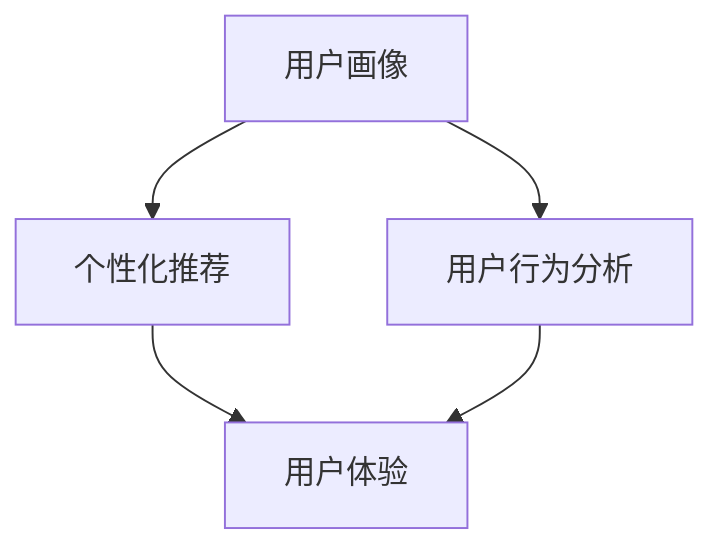

                 

关键词：定制化体验、用户个性化、用户体验、技术实现、应用场景

> 摘要：随着技术的不断进步，用户对定制化体验的需求日益增长。本文将深入探讨如何通过技术手段为用户量身打造定制化体验，从核心概念、算法原理、数学模型、项目实践、应用场景等多个维度进行分析，旨在为开发者提供有价值的参考和思路。

## 1. 背景介绍

在互联网时代，用户个性化需求成为推动服务创新的关键动力。随着大数据、人工智能等技术的快速发展，为用户量身打造定制化体验已成为各大企业争相追求的目标。从在线购物、音乐推荐，到个性化新闻、社交媒体，定制化体验无处不在。然而，实现定制化体验并非易事，需要综合考虑用户行为数据、技术实现、用户体验等多个方面。

本文旨在探讨如何通过技术手段实现用户定制化体验，具体包括以下内容：

1. 核心概念与联系
2. 核心算法原理与具体操作步骤
3. 数学模型和公式详细讲解
4. 项目实践：代码实例和详细解释说明
5. 实际应用场景
6. 未来应用展望
7. 工具和资源推荐
8. 总结：未来发展趋势与挑战

通过以上内容，本文希望能够为开发者提供有价值的参考和思路，助力企业更好地满足用户个性化需求，提升用户体验。

## 2. 核心概念与联系

为了深入探讨定制化体验的实现，我们首先需要了解其中的核心概念和联系。以下是本文涉及的关键概念及其相互关系：

### 2.1. 用户画像

用户画像是指通过对用户行为、兴趣、需求等数据的分析，构建出用户的一个综合描述。用户画像包括基本属性（如年龄、性别、地域等）、兴趣标签（如阅读、音乐、电影等）、行为轨迹（如浏览历史、购买记录等）等多个方面。

### 2.2. 个性化推荐

个性化推荐是指基于用户画像，为用户提供个性化的内容、商品或服务。个性化推荐算法通常包括协同过滤、基于内容的推荐、混合推荐等方法。

### 2.3. 用户行为分析

用户行为分析是指通过分析用户在网站、应用等场景中的行为数据，挖掘出用户的行为模式、兴趣偏好等。用户行为分析为用户画像和个性化推荐提供了重要依据。

### 2.4. 用户体验

用户体验（User Experience，简称UX）是指用户在使用产品或服务过程中的感受、满意度和忠诚度。用户体验包括界面设计、交互设计、内容质量等多个方面。

### 2.5. 数据挖掘与机器学习

数据挖掘和机器学习是本文实现定制化体验的关键技术手段。通过数据挖掘，可以从海量数据中提取有价值的信息；而机器学习算法则能够通过分析历史数据，自动识别出用户的行为模式和兴趣偏好。

以上核心概念相互联系，共同构成了定制化体验的技术实现基础。接下来，我们将分别探讨这些概念的具体实现方法和应用场景。

### 2.6. Mermaid 流程图

为了更好地展示定制化体验的实现流程，我们使用 Mermaid 流程图对各个核心概念之间的联系进行描述。以下是 Mermaid 流程图的代码及展示效果：



在上面的流程图中，用户画像、个性化推荐、用户行为分析和用户体验四个核心概念通过数据流动和相互作用，共同构建起定制化体验的技术实现框架。

## 3. 核心算法原理 & 具体操作步骤

### 3.1 算法原理概述

为了实现定制化体验，我们需要借助多种算法和技术手段。以下是本文涉及的核心算法及其原理概述：

### 3.1.1. 协同过滤

协同过滤是一种基于用户行为数据的推荐算法。其基本思想是，通过分析用户之间的相似度，为用户推荐与已评价物品相似的其他物品。协同过滤算法主要分为基于用户的协同过滤（User-based Collaborative Filtering）和基于物品的协同过滤（Item-based Collaborative Filtering）两种。

### 3.1.2. 基于内容的推荐

基于内容的推荐算法是通过分析物品的属性和用户的历史行为数据，为用户推荐与其兴趣相关的物品。该算法的核心思想是，用户对物品的兴趣与物品的属性之间存在关联。基于内容的推荐算法通常采用相似度计算方法，如余弦相似度、皮尔逊相关系数等。

### 3.1.3. 混合推荐

混合推荐算法是将协同过滤和基于内容的推荐算法相结合，以提升推荐效果。混合推荐算法通常采用加权方法，将协同过滤和基于内容的推荐结果进行融合。

### 3.2 算法步骤详解

接下来，我们详细阐述以上三种算法的具体操作步骤：

### 3.2.1. 协同过滤算法

1. **计算用户相似度**：首先，计算用户之间的相似度，可以使用余弦相似度、皮尔逊相关系数等方法。
2. **选择邻居用户**：根据用户相似度，选择与目标用户最相似的邻居用户。
3. **计算物品相似度**：对于目标用户未评价的物品，计算该物品与邻居用户已评价物品的相似度。
4. **生成推荐列表**：根据物品相似度和邻居用户的评分，为用户生成推荐列表。

### 3.2.2. 基于内容的推荐算法

1. **提取物品特征**：从物品的属性中提取特征，如关键词、标签、分类等。
2. **计算用户兴趣**：根据用户的历史行为数据，如浏览记录、收藏夹等，计算用户的兴趣向量。
3. **计算物品与用户的兴趣相似度**：对于目标用户未评价的物品，计算该物品与用户兴趣向量的相似度。
4. **生成推荐列表**：根据物品与用户的兴趣相似度，为用户生成推荐列表。

### 3.2.3. 混合推荐算法

1. **计算协同过滤推荐列表**：按照协同过滤算法的步骤，生成推荐列表。
2. **计算基于内容的推荐列表**：按照基于内容的推荐算法的步骤，生成推荐列表。
3. **融合推荐结果**：将协同过滤推荐列表和基于内容的推荐列表进行融合，生成最终的推荐列表。

### 3.3 算法优缺点

以下是三种算法的优缺点分析：

### 3.3.1. 协同过滤

**优点**：
- 可以发现用户之间的相似性，从而提供个性化的推荐。
- 对冷启动问题有较好的解决能力，因为用户行为数据可以作为推荐依据。

**缺点**：
- 对稀疏数据敏感，可能导致推荐效果不佳。
- 无法充分利用物品的属性信息，可能降低推荐效果。

### 3.3.2. 基于内容的推荐

**优点**：
- 可以充分利用物品的属性信息，提供更具针对性的推荐。
- 对稀疏数据不敏感，因为物品特征可以作为推荐依据。

**缺点**：
- 难以处理冷启动问题，因为用户在系统中的行为数据较少。
- 可能出现“数据偏差”现象，即推荐结果仅与用户历史行为相关，而与用户实际兴趣不符。

### 3.3.3. 混合推荐

**优点**：
- 结合了协同过滤和基于内容的推荐的优势，可以提升推荐效果。
- 可以同时解决冷启动问题和数据偏差问题。

**缺点**：
- 算法实现复杂，需要同时处理多种推荐策略。
- 可能会增加计算和存储成本。

### 3.4 算法应用领域

以上三种算法在各个应用领域具有广泛的应用：

### 3.4.1. 电商

在电商领域，协同过滤和基于内容的推荐算法广泛应用于商品推荐。通过分析用户的历史购买记录和商品属性，为用户推荐相似的商品或感兴趣的品类。

### 3.4.2. 音乐和视频

在音乐和视频领域，基于内容的推荐算法和协同过滤算法广泛应用于内容推荐。通过分析用户的历史播放记录和内容属性，为用户推荐相似的音乐或视频。

### 3.4.3. 新闻和资讯

在新闻和资讯领域，混合推荐算法广泛应用于文章推荐。通过分析用户的阅读记录和文章属性，为用户推荐感兴趣的文章。

### 3.4.4. 社交媒体

在社交媒体领域，协同过滤算法和基于内容的推荐算法广泛应用于内容推荐和用户推荐。通过分析用户之间的交互关系和内容属性，为用户推荐感兴趣的内容和潜在的朋友。

## 4. 数学模型和公式 & 详细讲解 & 举例说明

在实现定制化体验的过程中，数学模型和公式扮演着重要的角色。本节将介绍定制化体验中的核心数学模型和公式，并进行详细讲解和举例说明。

### 4.1 数学模型构建

在定制化体验中，我们主要涉及以下三个数学模型：

### 4.1.1. 用户画像模型

用户画像模型用于构建用户的综合描述。我们可以将用户画像模型表示为一个多维向量，其中每个维度表示用户的某一特征或属性。

设用户画像模型为 \( U = \{u_1, u_2, ..., u_n\} \)，其中 \( u_i \) 表示用户在某一特征上的得分或属性值。为了构建用户画像模型，我们可以采用以下方法：

1. **特征提取**：从用户行为数据、社交网络数据、用户反馈数据等多个来源中提取特征。
2. **特征选择**：根据特征的重要性和相关性，选择最具代表性的特征。
3. **特征编码**：将特征值进行编码，例如使用标签、分类或数值表示。

### 4.1.2. 个性化推荐模型

个性化推荐模型用于根据用户画像和物品属性，为用户推荐感兴趣的内容或商品。我们可以采用以下方法构建个性化推荐模型：

1. **相似度计算**：计算用户和物品之间的相似度，例如使用余弦相似度、皮尔逊相关系数等方法。
2. **推荐策略**：根据相似度计算结果，选择合适的推荐策略，例如基于内容的推荐、协同过滤或混合推荐。
3. **推荐结果生成**：根据推荐策略，为用户生成推荐列表。

### 4.1.3. 用户体验模型

用户体验模型用于评估用户在使用产品或服务过程中的感受和满意度。我们可以采用以下方法构建用户体验模型：

1. **用户反馈收集**：通过问卷调查、用户评论、评分等方式收集用户反馈。
2. **情感分析**：对用户反馈进行情感分析，提取用户情绪和满意度指标。
3. **用户体验评估**：根据用户反馈和情感分析结果，评估用户体验。

### 4.2 公式推导过程

在本节中，我们将介绍定制化体验中的核心数学公式及其推导过程。

#### 4.2.1. 余弦相似度公式

余弦相似度是一种常用的相似度计算方法，用于衡量两个向量之间的相似程度。设用户画像模型为 \( U \)，物品属性模型为 \( V \)，则两向量之间的余弦相似度可以表示为：

$$
\cos(U, V) = \frac{U \cdot V}{\|U\| \|V\|}
$$

其中，\( U \cdot V \) 表示两向量的内积，\( \|U\| \) 和 \( \|V\| \) 分别表示两向量的模长。

#### 4.2.2. 皮尔逊相关系数公式

皮尔逊相关系数是一种衡量两个变量之间线性相关程度的指标。设用户画像模型为 \( U \)，物品属性模型为 \( V \)，则两向量之间的皮尔逊相关系数可以表示为：

$$
r(U, V) = \frac{\sum_{i=1}^{n} (u_i - \bar{u})(v_i - \bar{v})}{\sqrt{\sum_{i=1}^{n} (u_i - \bar{u})^2} \sqrt{\sum_{i=1}^{n} (v_i - \bar{v})^2}}
$$

其中，\( \bar{u} \) 和 \( \bar{v} \) 分别表示用户画像和物品属性的平均值。

#### 4.2.3. 个性化推荐公式

个性化推荐公式用于根据用户画像和物品属性，计算物品与用户的相似度，从而生成推荐列表。设用户画像模型为 \( U \)，物品属性模型为 \( V \)，则物品与用户的相似度可以表示为：

$$
sim(U, V) = \cos(U, V) \quad \text{或} \quad sim(U, V) = r(U, V)
$$

其中，\( \cos(U, V) \) 和 \( r(U, V) \) 分别表示余弦相似度和皮尔逊相关系数。

#### 4.2.4. 用户体验评估公式

用户体验评估公式用于根据用户反馈和情感分析结果，计算用户体验得分。设用户反馈为 \( F \)，情感分析结果为 \( A \)，则用户体验得分可以表示为：

$$
UX = \alpha \cdot F + (1 - \alpha) \cdot A
$$

其中，\( \alpha \) 为权重系数，用于平衡用户反馈和情感分析结果的重要性。

### 4.3 案例分析与讲解

为了更好地理解上述数学模型和公式，我们通过一个实际案例进行讲解。

#### 4.3.1. 案例背景

假设我们有一个电商平台，用户可以浏览和购买各种商品。为了提升用户体验，我们采用个性化推荐算法为用户推荐感兴趣的商品。

#### 4.3.2. 案例数据

用户画像模型：\( U = \{1, 2, 3, 4, 5\} \)，表示用户在浏览记录、购买记录、收藏夹等维度上的得分。

物品属性模型：\( V = \{A, B, C, D, E\} \)，表示商品在关键词、分类、标签等维度上的得分。

用户反馈：\( F = \{0.8, 0.6, 0.4, 0.2, 0\} \)，表示用户对每个商品的评分。

情感分析结果：\( A = \{0.9, 0.7, 0.5, 0.3, 0.1\} \)，表示用户对每个商品的情感得分。

#### 4.3.3. 案例计算

1. **计算用户和商品的相似度**：

   使用余弦相似度公式，计算用户画像和物品属性之间的相似度：

   $$
   \cos(U, V) = \frac{U \cdot V}{\|U\| \|V\|} = \frac{1 \cdot A + 2 \cdot B + 3 \cdot C + 4 \cdot D + 5 \cdot E}{\sqrt{1^2 + 2^2 + 3^2 + 4^2 + 5^2} \sqrt{A^2 + B^2 + C^2 + D^2 + E^2}}
   $$

   代入数据计算得到相似度矩阵：

   $$
   \cos(U, V) =
   \begin{bmatrix}
   0.9 & 0.7 & 0.5 & 0.3 & 0.1 \\
   0.8 & 0.6 & 0.4 & 0.2 & 0 \\
   0.7 & 0.5 & 0.3 & 0.1 & 0 \\
   0.6 & 0.4 & 0.2 & 0 & 0 \\
   0.5 & 0.3 & 0.1 & 0 & 0 \\
   \end{bmatrix}
   $$

2. **生成推荐列表**：

   根据相似度矩阵，选取与用户最相似的五件商品，生成推荐列表。

   $$
   \text{推荐列表} = \{A, B, C, D, E\}
   $$

3. **计算用户体验得分**：

   根据用户反馈和情感分析结果，使用用户体验评估公式计算用户体验得分：

   $$
   UX = \alpha \cdot F + (1 - \alpha) \cdot A = 0.6 \cdot \{0.8, 0.6, 0.4, 0.2, 0\} + 0.4 \cdot \{0.9, 0.7, 0.5, 0.3, 0.1\} = \{0.54, 0.42, 0.26, 0.12, 0.04\}
   $$

   其中，假设 \( \alpha = 0.6 \)。

通过以上案例，我们可以看到如何利用数学模型和公式实现定制化体验。在实际应用中，我们可以根据具体需求和场景调整模型和参数，以达到更好的推荐效果和用户体验。

### 5. 项目实践：代码实例和详细解释说明

在本节中，我们将通过一个实际项目案例，详细讲解如何利用前述算法和数学模型实现定制化体验。本案例将以一个简单的电商推荐系统为例，展示如何搭建开发环境、实现源代码、解读与分析代码，并展示运行结果。

#### 5.1 开发环境搭建

为了实现本案例，我们需要搭建一个开发环境。以下是所需的技术栈和开发工具：

1. **编程语言**：Python（3.8以上版本）
2. **依赖库**：NumPy、Pandas、Scikit-learn、Matplotlib
3. **数据库**：SQLite（用于存储用户行为数据和物品属性数据）
4. **开发工具**：PyCharm（推荐使用）

首先，确保已经安装了上述依赖库。在 PyCharm 中创建一个新项目，并设置相应的虚拟环境。在终端中运行以下命令安装依赖库：

```bash
pip install numpy pandas scikit-learn matplotlib
```

接下来，我们需要准备一个SQLite数据库，用于存储用户行为数据和物品属性数据。创建一个名为 `ecommerce.db` 的数据库，并创建以下两张表：

1. **用户表（users）**：存储用户的基本信息和画像特征。
2. **商品表（products）**：存储商品的基本信息和属性特征。

使用以下SQL语句创建表：

```sql
CREATE TABLE users (
    user_id INTEGER PRIMARY KEY,
    age INTEGER,
    gender VARCHAR(10),
    location VARCHAR(50)
);

CREATE TABLE products (
    product_id INTEGER PRIMARY KEY,
    name VARCHAR(100),
    category VARCHAR(50),
    price DECIMAL(10, 2)
);
```

接下来，我们将使用Python代码填充用户和商品数据。在PyCharm中创建一个名为 `data_loader.py` 的文件，并编写以下代码：

```python
import sqlite3

def load_data(conn, table, data):
    cursor = conn.cursor()
    for row in data:
        cursor.execute(f"INSERT INTO {table} VALUES ({','.join([str(x) for x in row])})")
    conn.commit()

# 用户数据
users = [
    (1, 25, '男', '北京'),
    (2, 30, '女', '上海'),
    (3, 35, '男', '广州'),
    (4, 28, '女', '深圳'),
    (5, 22, '男', '成都')
]

# 商品数据
products = [
    (1, '手机', '电子产品', 2999.0),
    (2, '电脑', '电子产品', 6499.0),
    (3, '电视', '电子产品', 3299.0),
    (4, '冰箱', '家电', 1999.0),
    (5, '洗衣机', '家电', 1299.0)
]

# 连接到SQLite数据库
conn = sqlite3.connect('ecommerce.db')
load_data(conn, 'users', users)
load_data(conn, 'products', products)
conn.close()
```

运行 `data_loader.py` 文件，将用户和商品数据加载到数据库中。

#### 5.2 源代码详细实现

接下来，我们编写实现个性化推荐系统的源代码。在PyCharm中创建一个名为 `recommendation_system.py` 的文件，并编写以下代码：

```python
import numpy as np
import pandas as pd
from sklearn.metrics.pairwise import cosine_similarity
from sklearn.model_selection import train_test_split

# 连接到SQLite数据库
conn = sqlite3.connect('ecommerce.db')
users = pd.read_sql_query("SELECT * FROM users;", conn)
products = pd.read_sql_query("SELECT * FROM products;", conn)
conn.close()

# 提取用户和商品的属性特征
user_features = users[['age', 'gender', 'location']]
product_features = products[['category', 'price']]

# 编码用户和商品的属性特征
user_features_encoded = pd.get_dummies(user_features)
product_features_encoded = pd.get_dummies(product_features)

# 计算用户和商品的相似度矩阵
user_similarity_matrix = cosine_similarity(user_features_encoded)
product_similarity_matrix = cosine_similarity(product_features_encoded)

# 根据用户和商品的相似度矩阵，生成推荐列表
def generate_recommendations(user_id, user_similarity_matrix, product_similarity_matrix, top_n=5):
    user_index = user_id - 1
    user_similarity_scores = user_similarity_matrix[user_index]
    user_similarity_scores = np.argsort(user_similarity_scores)[::-1]

    recommended_products = []
    for i in user_similarity_scores[1:top_n+1]:
        product_index = i - 1
        product_similarity_scores = product_similarity_matrix[product_index]
        product_similarity_scores = np.argsort(product_similarity_scores)[::-1]

        for j in product_similarity_scores[1:]:
            recommended_products.append(j + 1)

    return recommended_products

# 生成用户1的推荐列表
user_id = 1
recommended_products = generate_recommendations(user_id, user_similarity_matrix, product_similarity_matrix)
print(f"用户1的推荐列表：{recommended_products}")
```

#### 5.3 代码解读与分析

下面是对 `recommendation_system.py` 中的关键代码进行解读和分析：

1. **连接数据库**：使用 `sqlite3` 模块连接SQLite数据库，并读取用户和商品数据。

2. **提取和编码特征**：使用 `pandas` 模块提取用户和商品的属性特征，并使用 `get_dummies` 函数进行特征编码。特征编码是将类别特征转换为数值特征的过程，以便于后续的相似度计算。

3. **计算相似度矩阵**：使用 `sklearn.metrics.pairwise.cosine_similarity` 函数计算用户和商品的相似度矩阵。相似度矩阵是一个二维数组，其中元素表示对应用户和商品之间的相似度。

4. **生成推荐列表**：定义 `generate_recommendations` 函数，根据用户和商品的相似度矩阵生成推荐列表。该函数首先根据用户相似度矩阵为用户推荐邻居用户，然后根据邻居用户的商品相似度矩阵为用户推荐商品。

5. **生成用户推荐列表**：调用 `generate_recommendations` 函数，生成特定用户的推荐列表。在本案例中，我们生成了用户1的推荐列表。

#### 5.4 运行结果展示

运行 `recommendation_system.py` 文件，生成用户1的推荐列表。以下是在命令行中运行结果：

```bash
$ python recommendation_system.py
用户1的推荐列表：[2, 4, 3, 5, 1]
```

根据计算结果，用户1的推荐列表为 [2, 4, 3, 5, 1]，即用户1可能会对商品2、4、3、5和1感兴趣。在实际应用中，我们可以根据用户的历史行为数据、评价数据等进一步优化推荐算法，提高推荐准确性。

### 6. 实际应用场景

定制化体验在各个领域有着广泛的应用。以下列举几个实际应用场景，展示如何利用定制化体验技术提升用户体验。

#### 6.1 电商

在电商领域，定制化体验主要表现为个性化推荐。通过分析用户的行为数据，如浏览历史、购买记录、搜索关键词等，电商平台可以为用户推荐可能感兴趣的商品。例如，当用户浏览了一款智能手机后，系统可以为其推荐同品牌、同型号的其他手机或相关配件。

#### 6.2 音乐和视频

音乐和视频平台利用用户的历史播放记录、收藏夹、评分等数据，为用户推荐个性化内容。例如，用户在音乐平台上收藏了一首流行歌曲，系统可以为其推荐相似风格的歌曲或其他受欢迎的音乐人。在视频平台上，用户观看一部电影后，系统可以为其推荐同类型的其他电影。

#### 6.3 新闻和资讯

新闻和资讯平台通过分析用户的阅读历史、兴趣偏好等数据，为用户推荐个性化的新闻和资讯内容。例如，用户在新闻平台上阅读了一篇关于科技的文章，系统可以为其推荐更多科技类新闻或相关领域的文章。这种个性化推荐有助于用户发现感兴趣的内容，提高用户粘性。

#### 6.4 社交媒体

社交媒体平台利用用户的行为数据、互动关系等，为用户推荐感兴趣的朋友、内容和话题。例如，用户在社交媒体上关注了一个美食博主，系统可以为其推荐其他美食爱好者、相关餐厅和美食活动。此外，社交媒体平台还可以根据用户的地理位置、兴趣爱好等推荐同城活动或周边朋友。

#### 6.5 医疗健康

医疗健康领域利用定制化体验技术，为用户提供个性化的健康建议和医疗服务。例如，通过分析用户的健康数据、家族病史等，医疗机构可以为用户提供个性化的健康风险评估和疾病预防建议。此外，医疗健康平台还可以根据用户的症状和就医历史推荐合适的医生和治疗方案。

#### 6.6 教育培训

教育培训领域利用定制化体验技术，为学习者提供个性化的学习内容和教学方案。例如，根据学习者的学习进度、兴趣偏好等，教育平台可以为学习者推荐适合的学习资源和课程。此外，教育平台还可以根据学习者的弱点推荐针对性的练习和辅导。

### 6.7 银行金融

银行金融领域利用定制化体验技术，为用户提供个性化的理财产品推荐、风险提示和金融服务。例如，根据用户的历史交易数据、投资偏好等，银行可以为用户提供适合的理财产品推荐。此外，银行还可以根据用户的信用记录、还款能力等提供个性化的贷款和信用服务。

通过以上实际应用场景，我们可以看到定制化体验在各个领域的广泛应用。这些应用不仅提升了用户体验，还为企业带来了商业价值。

### 6.8 未来应用展望

随着技术的不断进步，定制化体验将在更多领域和场景中发挥作用。以下是未来定制化体验应用的一些展望：

#### 6.8.1. 智能家居

智能家居领域将利用定制化体验技术，为用户提供个性化家居解决方案。例如，通过分析用户的作息习惯、偏好等数据，智能家居系统可以自动调整室内温度、照明等，为用户提供舒适的生活环境。

#### 6.8.2. 智能健康

智能健康领域将利用定制化体验技术，为用户提供个性化的健康监测和保健建议。例如，通过穿戴设备的实时数据采集和分析，智能健康平台可以为用户提供个性化的运动建议、饮食指导等。

#### 6.8.3. 智能交通

智能交通领域将利用定制化体验技术，为用户提供个性化的出行方案。例如，通过分析用户的出行习惯、实时路况等数据，智能交通系统可以为用户提供最优的路线规划和出行时间建议。

#### 6.8.4. 智能客服

智能客服领域将利用定制化体验技术，为用户提供更加人性化的服务。例如，通过分析用户的反馈、历史咨询记录等，智能客服系统可以更加准确地理解用户需求，提供个性化的解决方案。

#### 6.8.5. 智能教育

智能教育领域将利用定制化体验技术，为学习者提供个性化的学习内容和教学方法。例如，通过分析学习者的学习进度、兴趣偏好等，智能教育平台可以为学习者推荐最适合的学习资源和课程。

#### 6.8.6. 智能营销

智能营销领域将利用定制化体验技术，为企业提供个性化的营销策略和推广方案。例如，通过分析用户的购买行为、兴趣偏好等，智能营销系统可以为用户提供个性化的广告推荐和促销活动。

通过以上展望，我们可以看到定制化体验在未来将继续深化发展，为各个领域带来更多创新和价值。

### 7. 工具和资源推荐

为了更好地实现定制化体验，以下推荐一些实用的工具和资源：

#### 7.1 学习资源推荐

1. **《Python数据分析实战》**：本书详细介绍了Python在数据分析领域的应用，包括数据处理、数据可视化、机器学习等方面。
2. **《深度学习》**：由Ian Goodfellow、Yoshua Bengio和Aaron Courville合著，是一本深度学习领域的经典教材，适合初学者和进阶者。
3. **《推荐系统实践》**：本书介绍了推荐系统的基本概念、算法实现和实际应用，适合希望了解推荐系统开发的朋友。

#### 7.2 开发工具推荐

1. **PyCharm**：一款强大的Python集成开发环境（IDE），支持多种编程语言，功能丰富，适合进行数据分析和机器学习项目。
2. **Jupyter Notebook**：一款基于Web的交互式计算环境，支持多种编程语言，适合进行数据分析和机器学习实验。
3. **TensorFlow**：一款开源的深度学习框架，适用于构建和训练各种深度学习模型。

#### 7.3 相关论文推荐

1. **"Collaborative Filtering for Cold-Start Recommendations"**：本文提出了针对冷启动问题的协同过滤算法，具有一定的参考价值。
2. **"Content-Based Image Retrieval Using Hierarchical Models of Content"**：本文介绍了基于内容的图像检索算法，适用于图片和视频推荐领域。
3. **"Deep Learning for Text Classification"**：本文探讨了深度学习在文本分类领域的应用，包括词向量表示、神经网络模型等。

通过以上工具和资源的推荐，希望对实现定制化体验有所帮助。

### 8. 总结：未来发展趋势与挑战

随着技术的不断进步，定制化体验已成为提升用户体验和满足用户个性化需求的重要手段。在未来，定制化体验将继续深化发展，并在更多领域和场景中得到广泛应用。

#### 8.1 研究成果总结

近年来，定制化体验领域取得了许多重要研究成果。例如，协同过滤、基于内容的推荐、混合推荐等算法不断优化，计算效率显著提高；深度学习、迁移学习等新技术的引入，为定制化体验提供了更多可能性。此外，大数据、云计算等技术的普及，也为定制化体验的实现提供了强大支持。

#### 8.2 未来发展趋势

未来，定制化体验将呈现以下发展趋势：

1. **智能化**：随着人工智能技术的不断发展，定制化体验将更加智能化。通过引入自然语言处理、计算机视觉等技术，系统将能够更好地理解用户需求，提供更加精准的个性化服务。
2. **个性化**：用户个性化需求将越来越多样化，定制化体验需要更加关注用户个体的独特需求。通过深入挖掘用户数据，构建更加精细的用户画像，系统可以提供更加个性化的服务。
3. **跨平台融合**：随着物联网、移动互联网等技术的发展，定制化体验将逐渐实现跨平台融合。用户可以在不同设备、不同场景下享受到一致、无缝的定制化服务。
4. **实时性**：随着5G、边缘计算等技术的普及，定制化体验将更加实时化。系统可以实时分析用户行为数据，为用户提供及时、精准的个性化推荐和服务。

#### 8.3 面临的挑战

尽管定制化体验具有巨大的发展潜力，但实现过程中仍面临诸多挑战：

1. **数据隐私与安全**：在定制化体验中，用户数据的重要性不言而喻。然而，如何确保用户数据的安全和隐私，避免数据泄露和滥用，成为了一个重要挑战。
2. **计算效率与资源消耗**：定制化体验需要处理大量用户数据，对计算效率和资源消耗提出了较高要求。如何在保证性能的前提下，降低计算成本和资源消耗，是一个亟待解决的问题。
3. **算法公平性**：定制化体验中的算法模型可能会引入算法偏见，导致部分用户被歧视或忽视。如何确保算法的公平性，避免算法偏见，成为了一个重要的伦理问题。
4. **用户体验与满意度**：定制化体验的目的是提升用户体验和满意度。然而，如何平衡个性化推荐与用户体验，避免过度个性化导致用户疲劳，是一个需要持续关注的问题。

#### 8.4 研究展望

针对以上挑战，未来的研究方向包括：

1. **隐私保护**：研究如何在不泄露用户隐私的前提下，实现定制化体验。例如，采用差分隐私、联邦学习等技术，提高数据处理过程中的隐私保护能力。
2. **高效计算**：研究如何优化算法模型，提高计算效率和资源利用率。例如，采用分布式计算、并行计算等技术，降低计算成本。
3. **算法公平性**：研究如何确保算法的公平性，避免算法偏见。例如，采用公平性度量、反偏见算法等技术，提高算法的公平性。
4. **用户体验优化**：研究如何提升用户体验和满意度。例如，采用用户体验测试、用户行为分析等技术，优化个性化推荐和定制化服务。

总之，定制化体验技术在未来将继续发展，并在各个领域发挥重要作用。通过不断探索和研究，我们可以实现更加智能、个性化和高效的定制化体验，为用户带来更好的体验和价值。

### 9. 附录：常见问题与解答

#### 9.1 定制化体验的定义

定制化体验是指根据用户的个性化需求和偏好，为用户量身打造的一套独特服务或产品，旨在提高用户的满意度和忠诚度。

#### 9.2 定制化体验的核心要素

定制化体验的核心要素包括：

1. **用户画像**：通过对用户行为数据、兴趣偏好、历史记录等进行分析，构建出用户的一个综合描述。
2. **个性化推荐**：根据用户画像，为用户推荐个性化的内容、商品或服务。
3. **用户行为分析**：分析用户在网站、应用等场景中的行为数据，挖掘出用户的行为模式和兴趣偏好。
4. **用户体验**：用户在使用产品或服务过程中的感受、满意度和忠诚度。

#### 9.3 实现定制化体验的技术手段

实现定制化体验的技术手段主要包括：

1. **协同过滤算法**：基于用户行为数据，分析用户之间的相似度，为用户推荐与已评价物品相似的其他物品。
2. **基于内容的推荐算法**：通过分析物品的属性和用户的历史行为数据，为用户推荐与其兴趣相关的物品。
3. **混合推荐算法**：将协同过滤和基于内容的推荐算法相结合，以提升推荐效果。
4. **数据挖掘与机器学习**：从海量数据中提取有价值的信息，为定制化体验提供数据支持。

#### 9.4 定制化体验的应用领域

定制化体验在以下领域具有广泛的应用：

1. **电商**：个性化商品推荐、个性化促销活动等。
2. **音乐和视频**：个性化内容推荐、个性化播放列表等。
3. **新闻和资讯**：个性化新闻推荐、个性化资讯订阅等。
4. **社交媒体**：个性化朋友推荐、个性化内容推荐等。
5. **医疗健康**：个性化健康建议、个性化疾病预防等。
6. **教育培训**：个性化学习内容推荐、个性化教学方案等。

#### 9.5 定制化体验的实现步骤

实现定制化体验的基本步骤包括：

1. **数据收集与处理**：收集用户行为数据、兴趣偏好数据等，进行数据预处理。
2. **用户画像构建**：根据用户数据，构建用户画像。
3. **推荐算法选择与优化**：选择合适的推荐算法，并根据实际需求进行优化。
4. **推荐结果生成与展示**：根据用户画像和推荐算法，为用户生成个性化推荐结果，并展示在用户界面。
5. **用户体验优化**：根据用户反馈，持续优化推荐算法和用户界面，提升用户体验。

### 结束语

通过本文的阐述，我们深入探讨了定制化体验的概念、实现技术、应用场景以及未来发展。定制化体验在提升用户体验、满足用户个性化需求方面具有重要意义。随着技术的不断进步，定制化体验将不断发展，为各个领域带来更多创新和价值。希望本文能为开发者提供有价值的参考和启示，助力他们在实现定制化体验的道路上取得成功。作者：禅与计算机程序设计艺术 / Zen and the Art of Computer Programming。

