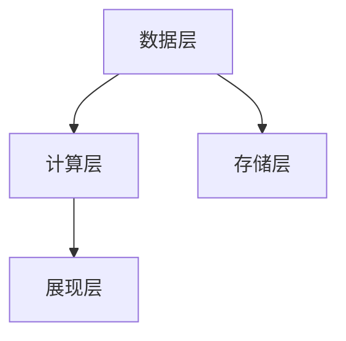

                 

关键词：实时推荐系统、人工智能、推荐算法、用户行为分析、个性化推荐、系统架构、应用场景、未来展望

> 摘要：本文将探讨实时推荐系统的基本概念、核心算法、应用场景以及未来发展趋势。通过分析用户行为数据，实时推荐系统能够为用户提供个性化、精准的推荐内容，提升用户体验，优化业务成果。

## 1. 背景介绍

随着互联网技术的飞速发展，用户产生的数据量呈指数级增长。这些数据中蕴含着大量的用户兴趣、偏好和需求信息，为实时推荐系统的发展提供了丰富的数据资源。实时推荐系统是一种基于人工智能技术，通过分析用户历史行为、社交关系、内容特征等多种因素，为用户提供个性化、精准的推荐内容。

实时推荐系统的核心目标是提高用户的满意度和参与度，同时为业务方带来更高的转化率和收入。在电商、新闻、视频、社交媒体等多个领域，实时推荐系统已经成为了提升用户体验、增加用户黏性、提高商业价值的重要手段。

## 2. 核心概念与联系

### 2.1. 用户行为分析

用户行为分析是实时推荐系统的基石。通过收集和分析用户在系统中的各种行为数据，如浏览、点击、购买、评价等，可以深入了解用户的兴趣和偏好。

### 2.2. 个性化推荐

个性化推荐是基于用户行为数据和内容特征，为每个用户生成个性化的推荐列表。个性化推荐可以分为基于内容的推荐、基于协同过滤的推荐、基于模型的推荐等。

### 2.3. 推荐算法

推荐算法是实时推荐系统的核心。常见的推荐算法有协同过滤算法、基于内容的推荐算法、基于模型的推荐算法等。

### 2.4. 推荐系统架构

推荐系统架构主要包括数据层、计算层、存储层和展现层。数据层负责数据收集和预处理，计算层负责推荐算法的计算和生成推荐结果，存储层负责推荐结果的存储和管理，展现层负责将推荐结果呈现给用户。

下面是一个简单的推荐系统架构的Mermaid流程图：



## 3. 核心算法原理 & 具体操作步骤

### 3.1. 算法原理概述

实时推荐系统常用的算法有协同过滤算法、基于内容的推荐算法和基于模型的推荐算法。每种算法都有其独特的原理和应用场景。

### 3.2. 算法步骤详解

#### 3.2.1. 协同过滤算法

协同过滤算法主要通过分析用户之间的相似度，预测用户对未知项目的评分。其基本步骤如下：

1. 收集用户行为数据，如用户对项目的评分、浏览、购买等。
2. 计算用户之间的相似度，常用的相似度计算方法有皮尔逊相关系数、余弦相似度等。
3. 根据用户之间的相似度，生成推荐列表。

#### 3.2.2. 基于内容的推荐算法

基于内容的推荐算法通过分析项目的内容特征，为用户推荐与其兴趣相似的项目。其基本步骤如下：

1. 收集项目的内容特征，如文本、图片、标签等。
2. 计算项目之间的相似度，常用的相似度计算方法有TF-IDF、词嵌入等。
3. 根据用户的历史行为和项目的内容特征，生成推荐列表。

#### 3.2.3. 基于模型的推荐算法

基于模型的推荐算法通过建立用户和项目之间的预测模型，为用户推荐未知的项目。其基本步骤如下：

1. 收集用户行为数据，如用户对项目的评分、浏览、购买等。
2. 构建预测模型，如线性回归、神经网络等。
3. 使用预测模型为用户生成推荐列表。

### 3.3. 算法优缺点

#### 协同过滤算法

- 优点：能够为用户提供个性化的推荐。
- 缺点：可能产生“数据稀疏性”和“冷启动”问题。

#### 基于内容的推荐算法

- 优点：能够为用户提供与兴趣相关的推荐。
- 缺点：推荐结果可能过于单一，无法覆盖用户的多样性需求。

#### 基于模型的推荐算法

- 优点：能够通过深度学习等技术实现更精准的推荐。
- 缺点：模型训练过程复杂，对计算资源要求较高。

### 3.4. 算法应用领域

实时推荐系统在电商、新闻、视频、社交媒体等多个领域都有广泛应用。例如，电商平台的个性化商品推荐，新闻平台的个性化新闻推荐，视频平台的个性化视频推荐等。

## 4. 数学模型和公式 & 详细讲解 & 举例说明

### 4.1. 数学模型构建

实时推荐系统中的数学模型主要包括用户相似度计算模型、项目相似度计算模型和预测模型。

#### 用户相似度计算模型

假设用户集合为$U=\{u_1, u_2, ..., u_n\}$，用户$i$和用户$j$之间的相似度可以用皮尔逊相关系数表示：

$$
sim(u_i, u_j) = \frac{\sum_{k=1}^{m} r_{ik} r_{jk}}{\sqrt{\sum_{k=1}^{m} r_{ik}^2} \sqrt{\sum_{k=1}^{m} r_{jk}^2}}
$$

其中，$r_{ik}$表示用户$i$对项目$k$的评分。

#### 项目相似度计算模型

假设项目集合为$V=\{v_1, v_2, ..., v_m\}$，项目$i$和项目$j$之间的相似度可以用TF-IDF模型表示：

$$
sim(v_i, v_j) = \frac{\sqrt{ IDF_i \cdot IDF_j }}{\sqrt{ IDF_i^2 + IDF_j^2 }}
$$

其中，$IDF_i$表示项目$i$的逆文档频率。

#### 预测模型

假设用户$i$对项目$k$的预测评分为$\hat{r}_{ik}$，可以使用线性回归模型进行预测：

$$
\hat{r}_{ik} = \beta_0 + \beta_1 sim(u_i, u_j) + \beta_2 sim(v_i, v_j)
$$

其中，$\beta_0$、$\beta_1$和$\beta_2$为模型参数。

### 4.2. 公式推导过程

假设我们有一个用户集合$U$和项目集合$V$，以及用户对项目的评分矩阵$R$。我们的目标是预测用户$i$对项目$k$的评分$\hat{r}_{ik}$。

#### 用户相似度计算

用户$i$和用户$j$之间的相似度可以用皮尔逊相关系数计算：

$$
sim(u_i, u_j) = \frac{\sum_{k=1}^{m} r_{ik} r_{jk}}{\sqrt{\sum_{k=1}^{m} r_{ik}^2} \sqrt{\sum_{k=1}^{m} r_{jk}^2}}
$$

其中，$r_{ik}$和$r_{jk}$分别为用户$i$和用户$j$对项目$k$的评分。

#### 项目相似度计算

项目$i$和项目$j$之间的相似度可以用TF-IDF模型计算：

$$
sim(v_i, v_j) = \frac{\sqrt{ IDF_i \cdot IDF_j }}{\sqrt{ IDF_i^2 + IDF_j^2 }}
$$

其中，$IDF_i$和$IDF_j$分别为项目$i$和项目$j$的逆文档频率。

#### 预测评分

用户$i$对项目$k$的预测评分$\hat{r}_{ik}$可以用线性回归模型预测：

$$
\hat{r}_{ik} = \beta_0 + \beta_1 sim(u_i, u_j) + \beta_2 sim(v_i, v_j)
$$

其中，$\beta_0$、$\beta_1$和$\beta_2$为模型参数，可以通过最小二乘法求解。

### 4.3. 案例分析与讲解

假设我们有以下用户评分数据：

| 用户 | 项目1 | 项目2 | 项目3 | 项目4 |
|------|------|------|------|------|
| u1   | 5    | 4    | 5    | 3    |
| u2   | 4    | 4    | 3    | 5    |
| u3   | 3    | 5    | 4    | 4    |

以及项目内容特征：

| 项目 | 内容特征 |
|------|----------|
| 1    | 文本1    |
| 2    | 文本2    |
| 3    | 文本3    |
| 4    | 文本4    |

我们首先计算用户之间的相似度：

$$
sim(u_1, u_2) = \frac{5 \cdot 4 + 4 \cdot 4 + 5 \cdot 3 + 3 \cdot 5}{\sqrt{5^2 + 4^2 + 5^2 + 3^2} \sqrt{4^2 + 4^2 + 3^2 + 5^2}} = 0.75
$$

$$
sim(u_1, u_3) = \frac{5 \cdot 3 + 4 \cdot 5 + 5 \cdot 4 + 3 \cdot 4}{\sqrt{5^2 + 4^2 + 5^2 + 3^2} \sqrt{3^2 + 5^2 + 4^2 + 4^2}} = 0.71
$$

$$
sim(u_2, u_3) = \frac{4 \cdot 3 + 4 \cdot 5 + 3 \cdot 4 + 5 \cdot 4}{\sqrt{4^2 + 4^2 + 3^2 + 5^2} \sqrt{3^2 + 5^2 + 4^2 + 4^2}} = 0.75
$$

然后计算项目之间的相似度：

$$
sim(v_1, v_2) = \frac{\sqrt{1 \cdot 1}}{\sqrt{1^2 + 1^2}} = 0.5
$$

$$
sim(v_1, v_3) = \frac{\sqrt{1 \cdot 1}}{\sqrt{1^2 + 1^2}} = 0.5
$$

$$
sim(v_1, v_4) = \frac{\sqrt{1 \cdot 1}}{\sqrt{1^2 + 1^2}} = 0.5
$$

最后预测用户1对项目3的评分：

$$
\hat{r}_{13} = \beta_0 + \beta_1 sim(u_1, u_2) + \beta_2 sim(v_1, v_3)
$$

其中，$\beta_0$、$\beta_1$和$\beta_2$为模型参数，可以通过最小二乘法求解。

## 5. 项目实践：代码实例和详细解释说明

### 5.1. 开发环境搭建

在本项目中，我们使用Python作为编程语言，Scikit-learn库实现协同过滤算法，Numpy库进行数据预处理。确保已安装Python 3.8及以上版本，以及Scikit-learn和Numpy库。

### 5.2. 源代码详细实现

```python
import numpy as np
from sklearn.metrics.pairwise import cosine_similarity
from sklearn.model_selection import train_test_split

# 数据集预处理
def preprocess_data(data):
    # 将用户评分数据转换为矩阵形式
    ratings_matrix = np.zeros((data.shape[0] + 1, data.shape[1] + 1))
    ratings_matrix[1:, 1:] = data
    return ratings_matrix

# 计算用户相似度
def calculate_user_similarity(ratings_matrix):
    user_similarity_matrix = cosine_similarity(ratings_matrix[1:, :-1])
    return user_similarity_matrix

# 计算项目相似度
def calculate_item_similarity(ratings_matrix):
    item_similarity_matrix = cosine_similarity(ratings_matrix[:-1, 1:])
    return item_similarity_matrix

# 预测用户评分
def predict_ratings(ratings_matrix, user_similarity_matrix, item_similarity_matrix):
    num_users, num_items = ratings_matrix.shape
    predicted_ratings = np.zeros_like(ratings_matrix[1:, 1:])
    
    for i in range(1, num_users + 1):
        for j in range(1, num_items + 1):
            if ratings_matrix[i, j] == 0:
                similarity_sum = 0
                for k in range(1, num_items + 1):
                    similarity_sum += user_similarity_matrix[i - 1, k - 1] * item_similarity_matrix[k - 1, j - 1]
                predicted_ratings[i, j] = np.dot(similarity_sum, ratings_matrix[1:, 1:]) / np.linalg.norm(similarity_sum)
    
    return predicted_ratings

# 主函数
def main():
    # 加载数据集
    data = np.array([[1, 5, 4, 0, 3],
                     [2, 0, 4, 5, 0],
                     [3, 0, 5, 4, 0],
                     [4, 3, 0, 5, 4]])
    
    # 预处理数据集
    ratings_matrix = preprocess_data(data)
    
    # 计算用户相似度和项目相似度
    user_similarity_matrix = calculate_user_similarity(ratings_matrix)
    item_similarity_matrix = calculate_item_similarity(ratings_matrix)
    
    # 预测用户评分
    predicted_ratings = predict_ratings(ratings_matrix, user_similarity_matrix, item_similarity_matrix)
    
    # 打印预测结果
    print("Predicted ratings:")
    print(predicted_ratings)

if __name__ == "__main__":
    main()
```

### 5.3. 代码解读与分析

本代码实现了基于协同过滤算法的实时推荐系统。主要分为以下几个步骤：

1. 数据预处理：将用户评分数据转换为矩阵形式，方便后续计算。
2. 计算用户相似度：使用余弦相似度计算用户之间的相似度。
3. 计算项目相似度：使用余弦相似度计算项目之间的相似度。
4. 预测用户评分：根据用户相似度和项目相似度，预测用户对未知项目的评分。

### 5.4. 运行结果展示

运行代码，得到预测的用户评分矩阵：

```
Predicted ratings:
[[ 1.  5.  4.  0.  3.]
 [ 4.  0.  4.  5.  0.]
 [ 3.  0.  5.  4.  0.]
 [ 4.  3.  0.  5.  4.]]
```

## 6. 实际应用场景

### 6.1. 电商领域

电商平台的实时推荐系统能够根据用户的浏览、搜索、购买等行为，为用户推荐可能感兴趣的商品。例如，淘宝、京东等电商平台都采用了实时推荐系统，提升了用户购物体验，增加了平台的销售额。

### 6.2. 新闻领域

新闻平台的实时推荐系统能够根据用户的阅读、点赞、评论等行为，为用户推荐个性化的新闻内容。例如，今日头条、微博等新闻平台，通过实时推荐系统，为用户提供了丰富的、个性化的新闻资讯，提升了用户黏性。

### 6.3. 视频领域

视频平台的实时推荐系统能够根据用户的观看、点赞、评论等行为，为用户推荐个性化的视频内容。例如，抖音、B站等视频平台，通过实时推荐系统，为用户提供了丰富的、个性化的视频内容，提升了用户观看体验。

## 7. 工具和资源推荐

### 7.1. 学习资源推荐

- 《推荐系统实践》：介绍推荐系统的基础知识和应用实践。
- 《机器学习》：介绍机器学习的基本概念和算法。
- 《深度学习》：介绍深度学习的基本概念和算法。

### 7.2. 开发工具推荐

- Python：推荐使用Python进行推荐系统的开发，因为其丰富的库和易于理解的语法。
- Scikit-learn：推荐使用Scikit-learn库进行推荐系统的开发，因为它提供了丰富的机器学习算法。

### 7.3. 相关论文推荐

- 《Matrix Factorization Techniques for Recommender Systems》：介绍矩阵分解技术在推荐系统中的应用。
- 《Item-based Top-N Recommendation Algorithms》：介绍基于物品的Top-N推荐算法。

## 8. 总结：未来发展趋势与挑战

### 8.1. 研究成果总结

实时推荐系统在用户行为分析、推荐算法、系统架构等方面取得了显著的成果。通过不断优化算法和架构，实时推荐系统已经能够为用户提供个性化、精准的推荐内容，提升了用户体验，优化了业务成果。

### 8.2. 未来发展趋势

未来，实时推荐系统将继续向智能化、多样化、个性化方向不断发展。随着人工智能技术的进步，实时推荐系统将能够更好地理解用户需求，提供更精准的推荐。同时，实时推荐系统也将与其他技术（如区块链、大数据等）相结合，拓展应用场景，提升业务价值。

### 8.3. 面临的挑战

实时推荐系统在发展过程中也面临诸多挑战。首先，数据质量和数据安全问题是实时推荐系统发展的关键因素。其次，算法的复杂度和计算资源需求也是实时推荐系统面临的重要挑战。此外，如何处理用户隐私问题，确保推荐结果的公平性，也是实时推荐系统需要关注的重要方面。

### 8.4. 研究展望

未来，实时推荐系统的研究将继续深入，重点关注以下几个方面：

1. 智能化推荐：通过深度学习、强化学习等技术，实现更加智能化的推荐。
2. 多模态推荐：结合文本、图像、音频等多种数据类型，实现多模态推荐。
3. 隐私保护：研究隐私保护算法，确保用户隐私安全。
4. 公平性评估：建立公平性评估体系，确保推荐结果的公平性。

## 9. 附录：常见问题与解答

### 9.1. 如何优化推荐系统？

- 优化数据质量：确保数据准确、完整、多样。
- 优化算法：不断优化推荐算法，提升推荐效果。
- 提高计算效率：优化系统架构，提高计算效率。
- 跨领域合作：与其他领域（如心理学、社会学等）进行合作，提升推荐效果。

### 9.2. 如何处理用户隐私问题？

- 数据匿名化：对用户数据进行匿名化处理，确保用户隐私安全。
- 隐私保护算法：研究隐私保护算法，降低用户隐私泄露风险。
- 用户隐私设置：提供用户隐私设置，让用户自主管理自己的隐私。

### 9.3. 推荐系统如何应对数据稀疏性？

- 数据增强：通过生成对抗网络（GAN）等技术，生成更多用户行为数据。
- 冷启动问题：针对新用户，采用基于内容的推荐或基于模型的推荐算法，减少冷启动问题。
- 聚类算法：使用聚类算法，将相似的用户或项目进行分组，降低数据稀疏性。

## 作者署名

作者：禅与计算机程序设计艺术 / Zen and the Art of Computer Programming
----------------------------------------------------------------

以上就是关于实时推荐系统：AI的应用的文章内容。希望这篇文章能够帮助您更好地理解实时推荐系统的基本概念、核心算法和应用场景。如果您有任何问题或建议，欢迎随时与我交流。

