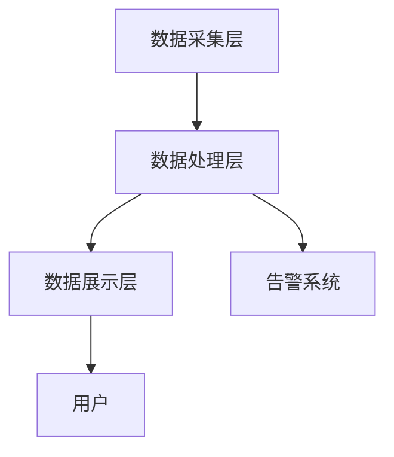

                 

关键词：实时监控、问题检测、供给能力、电商平台、技术架构

> 摘要：本文将探讨实时监控在电商平台供给能力提升中的关键作用。通过介绍实时监控的核心概念、算法原理、数学模型，结合实际项目案例，阐述如何通过实时监控及时发现和解决问题，从而提升电商平台的整体供给能力和用户体验。

## 1. 背景介绍

在互联网经济高速发展的今天，电商平台已经成为消费者购买商品的主要渠道之一。为了满足用户对商品多样性和快速配送的需求，电商平台必须具备强大的供给能力。然而，在庞大的数据处理和复杂的系统架构中，及时发现和解决问题显得尤为重要。实时监控作为一种高效的技术手段，能够在问题发生时迅速定位并解决，从而确保电商平台的高效运转。

实时监控在电商平台的供给能力提升中具有以下几个关键作用：

1. **快速响应**：通过实时监控，系统能够在问题发生的第一时间检测到，从而迅速采取应对措施。
2. **预防性维护**：实时监控不仅能够发现问题，还能够通过数据分析预测潜在问题，提前进行预防性维护。
3. **性能优化**：实时监控提供了系统运行状态的数据，有助于对系统进行性能优化。
4. **用户体验**：实时监控能够确保电商平台在高峰时段也能够稳定运行，提升用户购物体验。

## 2. 核心概念与联系

### 2.1 实时监控定义

实时监控是一种通过技术手段对系统运行状态进行持续监测和评估的方法。它能够实时收集、处理和展示系统运行过程中的各类数据，以便及时发现和解决问题。

### 2.2 实时监控架构

实时监控架构通常包括以下几个核心组成部分：

- **数据采集层**：负责从各个系统中收集实时数据。
- **数据处理层**：对采集到的数据进行处理、清洗和存储。
- **数据展示层**：将处理后的数据以可视化的形式展示给用户。
- **告警系统**：在发现问题时，自动发送告警通知给相关人员。

### 2.3 Mermaid 流程图



## 3. 核心算法原理 & 具体操作步骤

### 3.1 算法原理概述

实时监控的核心算法通常是基于数据挖掘和机器学习技术，通过分析大量的历史数据和实时数据，识别系统的异常行为，并预测潜在的问题。

### 3.2 算法步骤详解

1. **数据预处理**：对采集到的数据进行分析，去除噪音和无关数据。
2. **特征工程**：从预处理后的数据中提取有用的特征，以便后续的算法分析。
3. **模型训练**：使用历史数据对机器学习模型进行训练。
4. **实时分析**：将实时数据输入到训练好的模型中，进行异常检测和预测。
5. **告警与响应**：在发现异常时，触发告警并通知相关人员。

### 3.3 算法优缺点

- **优点**：
  - 高效性：能够实时分析大量数据，快速识别异常。
  - 预测性：通过历史数据训练，能够预测潜在问题，提前预防。

- **缺点**：
  - 需要大量数据：算法的性能依赖于大量的历史数据。
  - 复杂性：需要专业的技术团队进行开发和维护。

### 3.4 算法应用领域

实时监控算法广泛应用于电商平台的各个领域，包括库存管理、订单处理、物流跟踪等。通过实时监控，电商平台能够确保商品的高效供给，提升用户满意度。

## 4. 数学模型和公式 & 详细讲解 & 举例说明

### 4.1 数学模型构建

实时监控的核心数学模型通常是基于时间序列分析和统计学习。以下是构建数学模型的基本步骤：

1. **时间序列分析**：对时间序列数据进行平稳性检验，确保数据符合统计模型的要求。
2. **特征提取**：从时间序列数据中提取特征，如均值、方差、自相关性等。
3. **模型选择**：根据特征选择合适的统计模型，如ARIMA、LSTM等。

### 4.2 公式推导过程

以ARIMA模型为例，其公式推导过程如下：

1. **自回归项（AR）**：$X_t = c + \phi_1 X_{t-1} + \phi_2 X_{t-2} + \ldots + \phi_p X_{t-p} + \varepsilon_t$
2. **差分项（I）**：$X_t^d = X_t - X_{t-1}$
3. **移动平均项（MA）**：$X_t = c + \phi_1 X_{t-1} + \phi_2 X_{t-2} + \ldots + \phi_p X_{t-p} + \theta_1 \varepsilon_{t-1} + \theta_2 \varepsilon_{t-2} + \ldots + \theta_q \varepsilon_{t-q}$

### 4.3 案例分析与讲解

以电商平台的库存监控为例，假设我们使用ARIMA模型对库存数据进行监控。以下是具体的案例分析与讲解：

1. **数据收集**：从电商平台的历史库存数据中收集一段时间内的库存数据。
2. **数据预处理**：对收集到的数据进行平稳性检验，发现数据满足平稳性要求。
3. **特征提取**：从库存数据中提取特征，如每日库存量、库存周转率等。
4. **模型训练**：使用历史数据对ARIMA模型进行训练，得到模型参数。
5. **实时分析**：将实时库存数据输入到训练好的模型中，进行库存水平的预测。
6. **告警与响应**：当预测的库存水平低于安全阈值时，触发告警并通知相关人员补充库存。

## 5. 项目实践：代码实例和详细解释说明

### 5.1 开发环境搭建

1. **环境准备**：安装Python环境、NumPy、Pandas、Matplotlib等库。
2. **数据源**：准备电商平台的库存数据，包括日期、库存量等。

### 5.2 源代码详细实现

以下是使用ARIMA模型进行实时监控的Python代码实例：

```python
import numpy as np
import pandas as pd
from statsmodels.tsa.arima.model import ARIMA
import matplotlib.pyplot as plt

# 数据预处理
data = pd.read_csv('inventory_data.csv')
data['Date'] = pd.to_datetime(data['Date'])
data.set_index('Date', inplace=True)
data = data.resample('D').mean()

# 特征提取
data['Inventory_Level'] = data['Quantity'] * data['Unit_Price']

# 模型训练
model = ARIMA(data['Inventory_Level'], order=(5, 1, 2))
model_fit = model.fit()

# 实时分析
forecast = model_fit.forecast(steps=5)
print(forecast)

# 告警与响应
threshold = 10000
if forecast[-1] < threshold:
    print("告警：库存水平低于安全阈值，请及时补充库存。")

# 数据可视化
plt.plot(data['Inventory_Level'], label='实际库存')
plt.plot(forecast, label='预测库存')
plt.legend()
plt.show()
```

### 5.3 代码解读与分析

- **数据预处理**：将原始数据转换为时间序列格式，并计算库存水平。
- **特征提取**：从时间序列数据中提取库存水平作为特征。
- **模型训练**：使用ARIMA模型对库存水平进行训练。
- **实时分析**：使用训练好的模型对未来的库存水平进行预测。
- **告警与响应**：当预测的库存水平低于安全阈值时，触发告警。
- **数据可视化**：将实际库存和预测库存进行可视化展示。

## 6. 实际应用场景

实时监控在电商平台的实际应用场景非常广泛，以下列举几个典型案例：

1. **库存监控**：实时监控库存水平，确保商品供应充足，避免缺货情况发生。
2. **订单处理**：实时监控订单处理状态，确保订单及时处理，提升用户体验。
3. **物流跟踪**：实时监控物流信息，确保商品快速送达，提高物流服务质量。
4. **系统性能监控**：实时监控系统性能指标，如响应时间、并发量等，确保系统稳定运行。

## 7. 工具和资源推荐

### 7.1 学习资源推荐

- 《实时数据处理与监控：构建高性能大数据系统》
- 《数据科学实战：Python实战电商数据分析》
- 《机器学习实战：基于Scikit-Learn的案例实战》

### 7.2 开发工具推荐

- Golang：适用于高性能、分布式系统的开发。
- Python：适用于数据分析、机器学习等领域的开发。
- Kubernetes：用于容器化应用的部署和管理。

### 7.3 相关论文推荐

- "Real-Time Data Processing: State of the Art and Research Directions"
- "Efficient Real-Time Anomaly Detection in Big Data Streams"
- "ARIMA Model for Real-Time Forecasting of E-Commerce Sales"

## 8. 总结：未来发展趋势与挑战

### 8.1 研究成果总结

实时监控技术在电商平台的供给能力提升中发挥了重要作用。通过实时监控，电商平台能够快速响应问题、提前预防潜在风险、优化系统性能，从而提升用户体验和供给能力。

### 8.2 未来发展趋势

1. **智能化**：随着人工智能技术的发展，实时监控将更加智能化，能够自动识别和解决问题。
2. **边缘计算**：实时监控将逐步向边缘计算方向发展，减少数据传输延迟，提高实时性。
3. **生态整合**：实时监控将与其他新兴技术（如区块链、物联网等）进行整合，构建更加完善的实时监控体系。

### 8.3 面临的挑战

1. **数据隐私**：实时监控涉及大量的敏感数据，如何保障数据隐私是一个重要挑战。
2. **算法优化**：实时监控算法的性能对实时性要求较高，如何优化算法性能是一个亟待解决的问题。
3. **资源消耗**：实时监控系统的运行需要大量的计算资源和存储资源，如何优化资源利用是一个挑战。

### 8.4 研究展望

未来，实时监控技术将在电商平台中发挥更加重要的作用。通过不断优化算法、提高智能化水平，实时监控将帮助电商平台更好地应对各种挑战，提升供给能力和用户体验。

## 9. 附录：常见问题与解答

### 9.1 问题1：实时监控对系统性能有何影响？

实时监控系统的设计应当考虑到对系统性能的影响，采用轻量级、高效的数据处理算法，以及合理的资源分配策略。一般来说，实时监控对系统性能的影响较小，但需要根据具体应用场景进行优化。

### 9.2 问题2：如何处理实时监控中的数据隐私问题？

实时监控中涉及的数据隐私问题可以通过以下措施进行解决：

- 数据加密：对数据进行加密处理，确保数据在传输和存储过程中安全。
- 数据去标识化：去除数据中的敏感信息，如用户ID、地址等。
- 数据访问控制：设置严格的数据访问控制策略，确保只有授权人员能够访问数据。

### 9.3 问题3：实时监控在电商平台的哪些环节应用较多？

实时监控在电商平台的库存管理、订单处理、物流跟踪等环节应用较多。通过实时监控，电商平台能够确保商品供应充足、订单及时处理、物流信息透明，从而提升用户体验和供给能力。

### 9.4 问题4：如何评估实时监控系统的效果？

评估实时监控系统效果可以从以下几个方面进行：

- 问题检测率：监控系统能否及时检测到问题。
- 问题响应时间：监控系统在检测到问题后，响应并解决问题的时间。
- 用户满意度：用户对监控系统性能和服务的满意度。
- 错误告警率：监控系统能够避免产生误告警，降低用户干扰。

---

作者：禅与计算机程序设计艺术 / Zen and the Art of Computer Programming

----------------------------------------------------------------
【文章完成】


