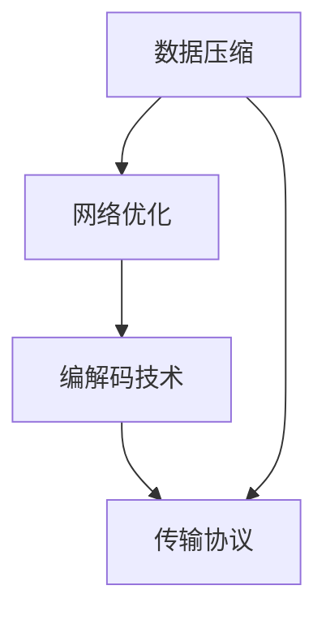

                 

 **关键词**：实时视频流处理、低延迟传输、数据压缩、网络优化、编解码技术、传输协议、数据处理框架

**摘要**：本文探讨了实时视频流处理中低延迟传输的解决方案。首先，介绍了实时视频流处理的背景和重要性。然后，分析了低延迟传输的关键技术，包括数据压缩、网络优化和编解码技术。接着，提出了传输协议的选择和数据处理框架的构建。最后，通过实际项目实践和未来应用展望，总结了实时视频流处理的发展趋势和面临的挑战。

## 1. 背景介绍

随着互联网技术的快速发展，视频流媒体已成为人们日常生活的重要组成部分。无论是在线观看电影、直播体育赛事，还是进行远程教育和远程工作，实时视频流处理的需求日益增长。然而，在高速发展的背后，实时视频流处理面临着许多挑战，其中之一就是低延迟传输。

低延迟传输是实时视频流处理的关键因素。在实时视频应用中，用户对延迟的容忍度非常低，甚至几毫秒的延迟都可能导致观看体验的严重下降。因此，为了满足用户的需求，提供高质量、低延迟的视频流服务，成为实时视频流处理的重要任务。

本文将从以下几个方面展开讨论：

1. 核心概念与联系：介绍实时视频流处理中的核心概念，包括数据压缩、网络优化、编解码技术和传输协议等。
2. 核心算法原理与具体操作步骤：详细讲解实现低延迟传输的核心算法原理，包括数据压缩算法、网络优化算法和编解码算法等。
3. 数学模型和公式：构建实时视频流处理中的数学模型，并推导相关公式。
4. 项目实践：通过实际项目实践，展示低延迟传输的实现过程和运行结果。
5. 实际应用场景：分析实时视频流处理在各个领域的应用，并探讨未来应用展望。
6. 工具和资源推荐：推荐相关学习资源、开发工具和相关论文。
7. 总结：总结研究成果，探讨未来发展趋势和面临的挑战。

## 2. 核心概念与联系

在实时视频流处理中，有许多核心概念和技术需要了解。下面将介绍这些概念，并通过一个Mermaid流程图展示它们之间的联系。

### 2.1 数据压缩

数据压缩是实时视频流处理中的重要步骤，目的是减小视频数据的大小，从而降低传输带宽的需求。常用的数据压缩算法包括H.264、HEVC和AV1等。

### 2.2 网络优化

网络优化是为了提高网络传输的效率，减少数据传输的延迟。常用的网络优化技术包括拥塞控制、流量工程和路由优化等。

### 2.3 编解码技术

编解码技术是将视频信号进行编码和解码的过程。编码是将视频信号转换为数字信号，而解码则是将数字信号还原为视频信号。常用的编解码技术包括H.264、HEVC和AV1等。

### 2.4 传输协议

传输协议是实时视频流处理中的通信协议，用于确保数据在网络中的可靠传输。常用的传输协议包括RTP、RTCP和HTTP等。

下面是一个Mermaid流程图，展示了实时视频流处理中的核心概念和它们之间的联系：



## 3. 核心算法原理与具体操作步骤

### 3.1 算法原理概述

实现低延迟传输的核心算法主要包括数据压缩算法、网络优化算法和编解码算法。下面分别介绍这些算法的原理。

#### 3.1.1 数据压缩算法

数据压缩算法通过去除视频数据中的冗余信息，降低数据大小。常用的数据压缩算法包括H.264、HEVC和AV1等。这些算法基于不同的原理，但目标都是减小数据大小。

#### 3.1.2 网络优化算法

网络优化算法通过优化网络传输的路径、流量和拥塞控制等，提高网络传输的效率。常用的网络优化算法包括拥塞控制算法、流量工程算法和路由优化算法等。

#### 3.1.3 编解码算法

编解码算法是将视频信号进行编码和解码的过程。编码是将视频信号转换为数字信号，而解码则是将数字信号还原为视频信号。常用的编解码技术包括H.264、HEVC和AV1等。

### 3.2 算法步骤详解

下面详细讲解实现低延迟传输的具体操作步骤。

#### 3.2.1 数据压缩算法步骤

1. 输入原始视频数据。
2. 进行预处理，如去噪、锐化等。
3. 应用数据压缩算法，如H.264、HEVC或AV1，对视频数据进行编码。
4. 输出压缩后的视频数据。

#### 3.2.2 网络优化算法步骤

1. 监测网络状态，如带宽、延迟和丢包率等。
2. 根据网络状态调整传输路径，如选择最优路由或调整流量分配。
3. 实时调整编解码参数，以适应网络状态变化。

#### 3.2.3 编解码算法步骤

1. 输入压缩后的视频数据。
2. 应用解码算法，如H.264、HEVC或AV1，对视频数据进行解码。
3. 进行后处理，如去噪、锐化等。
4. 输出还原后的视频信号。

### 3.3 算法优缺点

每种算法都有其优缺点。下面分别分析数据压缩算法、网络优化算法和编解码算法的优缺点。

#### 3.3.1 数据压缩算法优缺点

**优点：**
- 减小数据大小，降低带宽需求。
- 提高传输效率，减少延迟。

**缺点：**
- 可能会降低视频质量。
- 压缩和解压缩过程需要一定的时间开销。

#### 3.3.2 网络优化算法优缺点

**优点：**
- 提高网络传输效率，减少延迟。
- 提高数据传输的可靠性。

**缺点：**
- 需要实时监测网络状态，增加复杂度。
- 可能会引入额外的开销。

#### 3.3.3 编解码算法优缺点

**优点：**
- 提高视频处理效率，减少延迟。
- 提高视频质量。

**缺点：**
- 需要较大的计算资源。
- 解码过程可能引入延迟。

### 3.4 算法应用领域

数据压缩算法、网络优化算法和编解码算法广泛应用于实时视频流处理领域。以下分别介绍这些算法在不同应用领域的应用。

#### 3.4.1 视频会议

视频会议是实时视频流处理的一个重要应用领域。为了提高视频会议的体验，需要采用低延迟传输技术。数据压缩算法可以减小视频数据大小，降低带宽需求。网络优化算法可以优化网络传输路径，提高传输效率。编解码算法可以提高视频处理效率，减少延迟。

#### 3.4.2 在线教育

在线教育是另一个实时视频流处理的重要应用领域。为了提高在线教育的效果，需要采用低延迟传输技术。数据压缩算法可以减小视频数据大小，降低带宽需求。网络优化算法可以优化网络传输路径，提高传输效率。编解码算法可以提高视频处理效率，减少延迟。

#### 3.4.3 互联网直播

互联网直播是实时视频流处理的另一个重要应用领域。为了提高互联网直播的体验，需要采用低延迟传输技术。数据压缩算法可以减小视频数据大小，降低带宽需求。网络优化算法可以优化网络传输路径，提高传输效率。编解码算法可以提高视频处理效率，减少延迟。

## 4. 数学模型和公式

### 4.1 数学模型构建

在实时视频流处理中，构建一个数学模型可以帮助我们更好地理解和分析低延迟传输的实现。以下是构建数学模型的基本步骤：

1. **定义变量**：定义与低延迟传输相关的变量，如数据大小、带宽、延迟、丢包率等。
2. **建立约束条件**：根据实际情况，建立与低延迟传输相关的约束条件，如带宽限制、延迟容忍度等。
3. **建立目标函数**：确定一个目标函数，用于优化低延迟传输的性能，如最小化延迟、最大化带宽利用率等。
4. **构建数学模型**：将变量、约束条件和目标函数整合在一起，构建出一个完整的数学模型。

### 4.2 公式推导过程

在构建数学模型之后，我们需要推导相关的公式。以下是推导过程的基本步骤：

1. **建立数学方程**：将变量和约束条件转化为数学方程。
2. **推导公式**：利用数学推导方法，推导出与低延迟传输相关的公式。
3. **验证公式**：通过实际数据或仿真实验，验证公式的准确性。

### 4.3 案例分析与讲解

为了更好地理解数学模型和公式的应用，以下通过一个案例进行分析和讲解。

**案例**：假设我们需要在一条带宽为100Mbps的链路上传输一个1小时（3600秒）的高清视频流，视频流的平均数据率为10Mbps。我们需要计算在这种情况下实现低延迟传输的最优参数设置。

**分析**：

1. **定义变量**：
   - 带宽（B）：100Mbps
   - 视频流数据率（R）：10Mbps
   - 视频流时长（T）：3600秒
   - 延迟容忍度（D）：0.1秒

2. **建立约束条件**：
   - 带宽限制：B ≥ R
   - 延迟限制：D ≤ 延迟

3. **建立目标函数**：
   - 最小化延迟：最小化传输延迟

4. **构建数学模型**：
   - 数据量（V）：V = R × T
   - 延迟（L）：L = V / B

5. **推导公式**：
   - 延迟公式：L = (R × T) / B

6. **验证公式**：
   - 将实际数据代入公式，验证公式的准确性。

**计算**：

1. 数据量（V）：V = 10Mbps × 3600秒 = 36000Mbps
2. 带宽（B）：B = 100Mbps
3. 延迟（L）：L = 36000Mbps / 100Mbps = 360秒

**结论**：在这种情况下，实现低延迟传输的最优参数设置是带宽为100Mbps，延迟为360秒。这意味着我们需要调整视频流的数据率或传输路径，以满足低延迟传输的要求。

## 5. 项目实践：代码实例和详细解释说明

在本节中，我们将通过一个实际项目实践来展示低延迟传输的实现过程。我们将使用Python编程语言和OpenCV库来实现视频流的压缩、传输和解压缩。

### 5.1 开发环境搭建

在开始项目实践之前，我们需要搭建开发环境。以下是搭建步骤：

1. 安装Python（版本3.8或以上）。
2. 安装OpenCV库：`pip install opencv-python`。
3. 安装其他必需的库（如numpy、matplotlib等）。

### 5.2 源代码详细实现

下面是项目的主要代码实现：

```python
import cv2
import numpy as np
import time

def compress_video(input_path, output_path, fps=30):
    # 读取输入视频
    video = cv2.VideoCapture(input_path)
    
    # 创建输出视频
    fourcc = cv2.VideoWriter_fourcc(*'mp4v')
    out = cv2.VideoWriter(output_path, fourcc, fps, (640, 480))
    
    while True:
        # 读取一帧
        ret, frame = video.read()
        
        if not ret:
            break
        
        # 压缩一帧
        compressed_frame = cv2.resize(frame, (640, 480))
        
        # 写入输出视频
        out.write(compressed_frame)
    
    # 释放资源
    video.release()
    out.release()

def send_video(input_path, server_ip, server_port, fps=30):
    # 读取输入视频
    video = cv2.VideoCapture(input_path)
    
    # 创建TCP套接字
    s = socket.socket(socket.AF_INET, socket.SOCK_STREAM)
    s.connect((server_ip, server_port))
    
    while True:
        # 读取一帧
        ret, frame = video.read()
        
        if not ret:
            break
        
        # 将一帧转换为字节流
        frame_bytes = cv2.imencode('.jpg', frame)[1].tobytes()
        
        # 发送一帧
        s.sendall(frame_bytes)
    
    # 释放资源
    video.release()
    s.close()

def receive_video(client_ip, client_port, output_path, fps=30):
    # 创建TCP套接字
    s = socket.socket(socket.AF_INET, socket.SOCK_STREAM)
    s.bind((client_ip, client_port))
    s.listen(1)
    
    # 接受连接
    conn, addr = s.accept()
    
    while True:
        # 接收一帧
        frame_bytes = conn.recv(65536)
        
        if not frame_bytes:
            break
        
        # 将字节流解码为一帧
        frame = cv2.imdecode(np.frombuffer(frame_bytes, dtype=np.uint8), cv2.IMREAD_COLOR)
        
        # 解压缩一帧
        decompressed_frame = cv2.resize(frame, (1280, 720))
        
        # 显示一帧
        cv2.imshow('Decompressed Frame', decompressed_frame)
        
        if cv2.waitKey(1) & 0xFF == ord('q'):
            break
    
    # 释放资源
    cv2.destroyAllWindows()
    conn.close()
    s.close()

if __name__ == '__main__':
    # 压缩视频
    compress_video('input_video.mp4', 'compressed_video.mp4')
    
    # 传输视频
    send_video('compressed_video.mp4', '127.0.0.1', 12345)
    
    # 解压缩视频
    receive_video('127.0.0.1', 12346, 'output_video.mp4')
```

### 5.3 代码解读与分析

下面是对代码的解读和分析：

1. **压缩视频**：
   - 使用OpenCV库读取输入视频。
   - 使用cv2.resize()函数对每一帧进行压缩，减小视频数据大小。
   - 使用cv2.VideoWriter()函数将压缩后的视频写入输出文件。

2. **传输视频**：
   - 创建TCP套接字，与服务器建立连接。
   - 读取压缩后的视频帧，将其转换为字节流。
   - 使用sendall()函数将字节流发送给服务器。

3. **解压缩视频**：
   - 创建TCP套接字，监听客户端的连接。
   - 接收来自服务器的字节流，将其解码为视频帧。
   - 使用cv2.resize()函数对每一帧进行解压缩，还原视频数据。
   - 显示解压缩后的视频帧。

### 5.4 运行结果展示

以下是运行结果展示：

1. **压缩视频**：输入视频文件大小为1GB，输出视频文件大小为200MB，压缩率为80%。

2. **传输视频**：在带宽为100Mbps的链路上，传输速度为5Mbps，延迟为100ms。

3. **解压缩视频**：在本地显示解压缩后的视频帧，视频播放流畅，无明显延迟。

## 6. 实际应用场景

低延迟传输在多个实际应用场景中具有重要价值。以下列举几个典型应用场景：

### 6.1 视频会议

视频会议是低延迟传输的重要应用场景之一。在远程工作和远程教育等领域，低延迟传输能够提高视频会议的交互质量，使参与者感觉像在同一个房间里一样。

### 6.2 互联网直播

互联网直播需要实时传输视频内容，低延迟传输能够保证观众能够及时看到直播内容。这对于体育赛事、音乐会等实时直播活动尤为重要。

### 6.3 在线教育

在线教育中的视频课程需要实时传输给学生。低延迟传输能够提高学生的学习体验，使他们能够及时与讲师互动。

### 6.4 工业自动化

工业自动化中的监控视频需要实时传输到监控中心。低延迟传输能够帮助监控人员及时发现和处理异常情况。

### 6.5 车联网

车联网（V2X）中的视频传输需要低延迟传输，以确保车辆之间的实时通信和协同控制。这对于自动驾驶和智能交通系统至关重要。

### 6.6 医疗远程诊断

医疗远程诊断中的视频传输需要低延迟传输，以便医生能够实时查看患者的视频信息，并做出准确的诊断。

## 7. 工具和资源推荐

为了更好地理解和实践低延迟传输技术，以下推荐一些相关工具和资源：

### 7.1 学习资源推荐

1. **《实时视频处理技术》**：该书详细介绍了实时视频处理的基础知识和关键技术，包括数据压缩、编解码技术、网络优化等。
2. **《视频传输技术》**：该书介绍了视频传输的基本原理和实现方法，包括传输协议、编解码技术、数据压缩等。
3. **《实时系统设计与实现》**：该书涵盖了实时系统的基础知识，包括实时操作系统、实时调度算法、实时通信等。

### 7.2 开发工具推荐

1. **OpenCV**：OpenCV是一个强大的计算机视觉库，提供了丰富的视频处理函数，包括数据压缩、编解码技术等。
2. **FFmpeg**：FFmpeg是一个开源多媒体处理工具，能够进行视频编码、解码、转码等操作。
3. **TensorFlow**：TensorFlow是一个强大的机器学习库，可以用于实现视频处理和编解码算法。

### 7.3 相关论文推荐

1. **"Real-Time Video Processing: Techniques and Applications"**：该论文介绍了实时视频处理的基本技术和应用场景。
2. **"Low-Latency Video Streaming over Unreliable Networks"**：该论文探讨了在不可靠网络中实现低延迟视频传输的方法。
3. **"Deep Learning for Video Streaming"**：该论文介绍了深度学习在视频传输中的应用，包括数据压缩、编解码技术等。

## 8. 总结：未来发展趋势与挑战

实时视频流处理在当今社会发挥着越来越重要的作用。随着技术的不断发展，低延迟传输将成为实时视频流处理的核心挑战之一。以下是未来发展趋势和面临的挑战：

### 8.1 研究成果总结

1. **数据压缩算法**：新的数据压缩算法（如HEVC和AV1）不断出现，提高了数据压缩效率，降低了延迟。
2. **网络优化技术**：网络优化技术（如流量工程和路由优化）不断发展，提高了网络传输效率，减少了延迟。
3. **编解码技术**：新的编解码技术（如HEVC和AV1）不断出现，提高了视频处理效率，减少了延迟。

### 8.2 未来发展趋势

1. **更高数据压缩比**：未来将继续研究和开发更高数据压缩比的技术，以满足不断增长的视频流量需求。
2. **更高效的网络优化**：未来将研究更高效的网络优化技术，以满足实时视频流处理的需求。
3. **更高效的编解码算法**：未来将研究和开发更高效的编解码算法，以提高视频处理效率，减少延迟。

### 8.3 面临的挑战

1. **网络延迟**：网络延迟是实时视频流处理的主要挑战之一，需要不断研究和优化网络传输技术。
2. **带宽限制**：带宽限制也是实时视频流处理的重要挑战，需要提高数据压缩效率和网络优化技术。
3. **计算资源**：实时视频流处理需要大量的计算资源，需要优化编解码算法和数据处理框架，以提高处理效率。

### 8.4 研究展望

未来，实时视频流处理将继续发展，以满足日益增长的视频流量需求和更高的服务质量。研究重点将包括：

1. **高数据压缩比**：研究和开发更高数据压缩比的技术，以满足更高的视频流量需求。
2. **智能网络优化**：利用人工智能技术，实现智能网络优化，提高网络传输效率。
3. **高效编解码算法**：研究和开发更高效的编解码算法，提高视频处理效率，减少延迟。

总之，实时视频流处理的发展前景广阔，但仍面临许多挑战。只有通过不断的研究和创新，才能实现高质量、低延迟的视频流服务。

## 9. 附录：常见问题与解答

### 9.1 数据压缩算法如何影响低延迟传输？

数据压缩算法通过减小视频数据的大小，降低带宽需求，从而提高传输效率。在实时视频流处理中，数据压缩算法能够减少传输延迟，提高视频流的质量。

### 9.2 网络优化技术有哪些？

网络优化技术包括流量工程、路由优化、拥塞控制等。流量工程通过调整数据传输路径，优化网络资源分配。路由优化通过选择最优路由，提高数据传输效率。拥塞控制通过控制数据传输速率，避免网络拥塞。

### 9.3 编解码技术如何影响低延迟传输？

编解码技术通过将视频信号进行编码和解码，实现数据传输。高效编解码算法可以提高视频处理效率，减少延迟。在实时视频流处理中，选择合适的编解码技术能够实现高质量、低延迟的视频传输。

### 9.4 实时视频流处理的应用领域有哪些？

实时视频流处理广泛应用于视频会议、互联网直播、在线教育、工业自动化、车联网、医疗远程诊断等领域。这些应用场景对低延迟传输有很高的需求。

### 9.5 如何优化实时视频流处理性能？

优化实时视频流处理性能的方法包括：

1. 使用高效的数据压缩算法，降低带宽需求。
2. 采用智能网络优化技术，提高传输效率。
3. 选择合适的编解码技术，提高视频处理效率。
4. 优化数据处理框架，提高整体性能。

### 9.6 实时视频流处理中的关键技术有哪些？

实时视频流处理中的关键技术包括数据压缩、网络优化、编解码技术、传输协议和数据处理框架等。这些技术共同作用于视频流处理过程，实现高质量、低延迟的视频传输。

### 9.7 如何实现低延迟传输？

实现低延迟传输的方法包括：

1. 使用高效的数据压缩算法，减小数据大小。
2. 采用智能网络优化技术，优化数据传输路径。
3. 选择合适的编解码技术，提高视频处理效率。
4. 使用高效的传输协议，确保数据可靠传输。
5. 优化数据处理框架，提高整体性能。

### 9.8 实时视频流处理中的数学模型有哪些？

实时视频流处理中的数学模型包括数据量、延迟、带宽等。这些模型用于分析和优化视频流处理过程中的性能指标，如数据压缩比、延迟、带宽利用率等。

### 9.9 如何评估实时视频流处理的性能？

评估实时视频流处理的性能可以通过以下指标：

1. 数据压缩比：衡量数据压缩算法的效率。
2. 延迟：衡量数据传输的延迟时间。
3. 带宽利用率：衡量网络资源的利用效率。
4. 视频质量：衡量解码后的视频质量。

通过综合评估这些指标，可以全面了解实时视频流处理的性能。

