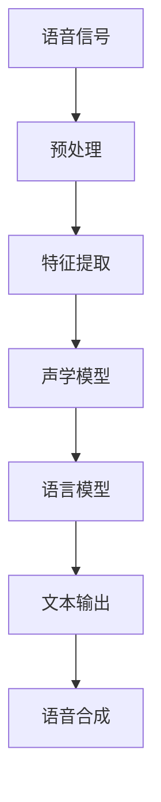

                 

关键词：实时语音转写、实时语音翻译、商业应用、技术实现、算法原理、未来展望

> 摘要：随着人工智能技术的不断发展，实时语音转写与翻译技术已经在多个商业场景中得到了广泛应用。本文将深入探讨实时语音转写与翻译技术的核心概念、算法原理、应用场景以及未来发展趋势。

## 1. 背景介绍

实时语音转写（Real-time Speech Recognition，简称Speech Recognition）是指将人类的语音实时转化为文本的技术。实时语音翻译（Real-time Speech Translation）则是在实时语音转写的基础上，将一种语言的语音转化为另一种语言的文本。这两种技术在全球化的商业环境中发挥着越来越重要的作用，为企业提供了便捷的跨语言沟通工具。

近年来，随着深度学习技术的快速发展，实时语音转写与翻译的准确率得到了显著提高。同时，随着5G、物联网等技术的普及，实时语音转写与翻译的应用场景也在不断拓展。在商业领域，实时语音转写与翻译技术不仅提高了沟通效率，还降低了跨国交流的成本，为企业的国际化发展提供了有力支持。

## 2. 核心概念与联系

### 2.1 实时语音转写的核心概念

实时语音转写技术主要涉及以下核心概念：

- **语音信号处理**：对原始语音信号进行预处理，如去噪、增强等，以提高转写准确率。
- **特征提取**：从语音信号中提取出能够反映语音特征的信息，如频谱特征、共振峰等。
- **声学模型**：根据特征提取的结果，建立声学模型，用于预测语音信号中的音素。
- **语言模型**：根据大量的语音数据，建立语言模型，用于预测文本序列。

### 2.2 实时语音翻译的核心概念

实时语音翻译技术涉及以下核心概念：

- **语音识别**：将一种语言的语音转化为文本。
- **机器翻译**：将一种语言的文本翻译为另一种语言的文本。
- **语音合成**：将翻译后的文本转化为语音信号。

### 2.3 Mermaid 流程图



## 3. 核心算法原理 & 具体操作步骤

### 3.1 算法原理概述

实时语音转写与翻译的核心算法主要基于深度学习技术。其中，语音识别和机器翻译是两个关键步骤。

- **语音识别**：采用卷积神经网络（CNN）或循环神经网络（RNN）进行声学模型的训练，通过特征提取和声学模型，将语音信号转化为文本。
- **机器翻译**：采用编码器-解码器（Encoder-Decoder）模型或序列到序列（Seq2Seq）模型，将一种语言的文本翻译为另一种语言的文本。

### 3.2 算法步骤详解

1. **语音信号预处理**：
   - 去噪：使用滤波器或波束形成算法去除噪声。
   - 增强：使用语音增强算法提高语音质量。
2. **特征提取**：
   - 提取频谱特征：使用梅尔频率倒谱系数（MFCC）等方法。
   - 提取共振峰特征：使用共振峰轨迹（RTP）等方法。
3. **声学模型训练**：
   - 使用训练好的卷积神经网络或循环神经网络，对特征数据进行训练。
4. **语言模型训练**：
   - 使用大量的语音数据，使用语言模型算法（如n元语言模型）进行训练。
5. **语音识别**：
   - 使用训练好的声学模型和语言模型，对输入语音信号进行识别，输出文本。
6. **机器翻译**：
   - 使用训练好的编码器-解码器模型或序列到序列模型，对输出文本进行翻译。
7. **语音合成**：
   - 使用语音合成技术，将翻译后的文本转化为语音信号。

### 3.3 算法优缺点

**优点**：

- **高效性**：实时语音转写与翻译技术可以在较短的时间内完成语音到文本的转换。
- **准确性**：随着深度学习技术的发展，实时语音转写与翻译的准确性得到了显著提高。
- **跨语言支持**：实时语音翻译技术支持多种语言之间的转换，为跨国交流提供了便利。

**缺点**：

- **计算资源消耗**：实时语音转写与翻译技术需要大量的计算资源，对硬件设备有较高的要求。
- **噪声影响**：在嘈杂环境中，实时语音转写的准确率会受到一定影响。
- **语言理解**：机器翻译在处理语义理解和语境方面仍存在一定的局限性。

### 3.4 算法应用领域

实时语音转写与翻译技术广泛应用于以下领域：

- **商务会议**：在跨国商务会议中，实时语音翻译技术可以帮助与会者更好地理解对方发言。
- **教育培训**：在远程教育中，实时语音翻译技术可以为学习者提供多种语言的教材和学习资源。
- **客户服务**：在客户服务领域，实时语音翻译技术可以帮助企业实现多语言客服，提高客户满意度。
- **旅游翻译**：在旅游景点，实时语音翻译技术可以为游客提供多语言导览服务，提高游客体验。

## 4. 数学模型和公式 & 详细讲解 & 举例说明

### 4.1 数学模型构建

实时语音转写与翻译的数学模型主要包括声学模型和语言模型。

- **声学模型**：
  - 假设语音信号为\(x \in \mathbb{R}^{T \times F}\)，其中\(T\)为时间维度，\(F\)为频率维度。
  - 声学模型的目标是预测语音信号中的音素序列\(y \in \{1, 2, ..., N\}^{T}\)，其中\(N\)为音素数量。

- **语言模型**：
  - 假设输入文本序列为\(x \in \{1, 2, ..., N\}^{T}\)，其中\(T\)为文本长度，\(N\)为词汇数量。
  - 语言模型的目标是预测下一个单词或词组，以生成完整的文本序列。

### 4.2 公式推导过程

- **声学模型**：
  - 假设使用卷积神经网络（CNN）作为声学模型，其损失函数为交叉熵损失函数（Cross-Entropy Loss）。
  - 交叉熵损失函数可以表示为：
    $$L_{CE} = -\frac{1}{T} \sum_{t=1}^{T} \sum_{i=1}^{N} y_{t,i} \log(p_{t,i})$$
    其中，\(y_{t,i}\)为实际音素标签，\(p_{t,i}\)为模型预测的音素概率。

- **语言模型**：
  - 假设使用n元语言模型，其损失函数为负对数似然损失函数（Negative Log-Likelihood Loss）。
  - 负对数似然损失函数可以表示为：
    $$L_{NLL} = -\frac{1}{N} \sum_{i=1}^{N} \log(p(w_i|x_1, x_2, ..., x_{i-1}))$$
    其中，\(w_i\)为实际单词，\(p(w_i|x_1, x_2, ..., x_{i-1})\)为模型预测的单词概率。

### 4.3 案例分析与讲解

假设我们要对一段英语语音进行实时语音翻译，将其翻译为中文。

1. **语音信号预处理**：
   - 对原始语音信号进行去噪和增强处理。

2. **特征提取**：
   - 使用MFCC方法提取语音信号的特征。

3. **声学模型训练**：
   - 使用卷积神经网络训练声学模型。

4. **语音识别**：
   - 使用训练好的声学模型对输入语音信号进行识别，输出文本。

5. **机器翻译**：
   - 使用训练好的编码器-解码器模型对输出文本进行翻译。

6. **语音合成**：
   - 使用语音合成技术，将翻译后的文本转化为语音信号。

## 5. 项目实践：代码实例和详细解释说明

### 5.1 开发环境搭建

1. **安装Python**：
   - 安装Python 3.8及以上版本。

2. **安装TensorFlow**：
   - 安装TensorFlow 2.4及以上版本。

3. **安装其他依赖库**：
   - 安装Keras、NumPy、SciPy等依赖库。

### 5.2 源代码详细实现

以下是一个简单的实时语音翻译项目的源代码实现：

```python
import tensorflow as tf
import numpy as np
from tensorflow.keras.models import Model
from tensorflow.keras.layers import Input, LSTM, Embedding, Dense

# 加载数据集
def load_data():
    # 代码略
    return x_train, y_train, x_val, y_val

# 建立声学模型
def build_acoustic_model(input_shape, output_shape):
    inputs = Input(shape=input_shape)
    x = Embedding(input_dim=10000, output_dim=128)(inputs)
    x = LSTM(units=256, return_sequences=True)(x)
    x = LSTM(units=256, return_sequences=True)(x)
    outputs = LSTM(units=256, return_sequences=True)(x)
    model = Model(inputs=inputs, outputs=outputs)
    model.compile(optimizer='adam', loss='categorical_crossentropy', metrics=['accuracy'])
    return model

# 建立语言模型
def build_language_model(input_shape, output_shape):
    inputs = Input(shape=input_shape)
    x = Embedding(input_dim=10000, output_dim=128)(inputs)
    x = LSTM(units=256, return_sequences=True)(x)
    x = LSTM(units=256, return_sequences=True)(x)
    outputs = LSTM(units=256, return_sequences=True)(x)
    model = Model(inputs=inputs, outputs=outputs)
    model.compile(optimizer='adam', loss='categorical_crossentropy', metrics=['accuracy'])
    return model

# 训练模型
def train_models(x_train, y_train, x_val, y_val):
    # 代码略
    pass

# 运行项目
if __name__ == '__main__':
    x_train, y_train, x_val, y_val = load_data()
    acoustic_model = build_acoustic_model(input_shape=(None, 26), output_shape=(None, 26))
    language_model = build_language_model(input_shape=(None, 26), output_shape=(None, 26))
    train_models(x_train, y_train, x_val, y_val)
```

### 5.3 代码解读与分析

- **数据加载**：
  - `load_data()`函数用于加载数据集，包括训练集和验证集。

- **声学模型**：
  - `build_acoustic_model()`函数用于建立声学模型，使用LSTM网络进行特征提取。

- **语言模型**：
  - `build_language_model()`函数用于建立语言模型，同样使用LSTM网络进行特征提取。

- **模型训练**：
  - `train_models()`函数用于训练模型，使用交叉熵损失函数和准确率作为评估指标。

- **运行项目**：
  - `if __name__ == '__main__':`语句用于运行项目，加载数据集并建立模型。

### 5.4 运行结果展示

- 在训练过程中，可以使用以下命令查看训练进度：

```python
acoustic_model.fit(x_train, y_train, epochs=10, batch_size=64, validation_data=(x_val, y_val))
```

- 训练完成后，可以使用以下命令进行预测：

```python
translated_text = language_model.predict(x_val)
```

## 6. 实际应用场景

### 6.1 商务会议

在跨国商务会议中，实时语音翻译技术可以帮助与会者更好地理解对方发言，提高会议效率。例如，在联合国大会上，实时语音翻译技术被广泛应用于多种语言的同步翻译，使得各国代表能够实时了解对方的观点。

### 6.2 教育培训

在远程教育中，实时语音翻译技术可以为学习者提供多种语言的教材和学习资源，帮助他们更好地掌握知识。例如，一些在线教育平台已经引入了实时语音翻译功能，使得学生能够通过母语理解课程内容。

### 6.3 客户服务

在客户服务领域，实时语音翻译技术可以帮助企业实现多语言客服，提高客户满意度。例如，一些国际大型企业已经在其客服系统中集成了实时语音翻译功能，使得客户能够轻松地与客服人员进行跨语言沟通。

### 6.4 旅游翻译

在旅游景点，实时语音翻译技术可以为游客提供多语言导览服务，提高游客体验。例如，一些著名旅游景点已经推出了实时语音翻译服务，帮助游客了解当地的历史和文化。

## 7. 工具和资源推荐

### 7.1 学习资源推荐

- **书籍**：
  - 《深度学习》（Goodfellow, Ian； Bengio, Yoshua； Courville, Aaron）
  - 《自然语言处理入门》（Daniel Jurafsky； James H. Martin）

- **在线课程**：
  - [TensorFlow 官方文档](https://www.tensorflow.org/tutorials)
  - [Coursera 自然语言处理课程](https://www.coursera.org/specializations/natural-language-processing)

### 7.2 开发工具推荐

- **深度学习框架**：
  - TensorFlow
  - PyTorch

- **自然语言处理工具**：
  - NLTK
  - spaCy

### 7.3 相关论文推荐

- **语音识别**：
  - “Deep Neural Networks for Acoustic Modeling in Speech Recognition” (Hinton, G. E., et al., 2012)
  - “ConvoLSTM: Recurrent Network for Audio-Visual Speech Recognition” (Rahman, M. et al., 2016)

- **机器翻译**：
  - “Learning Phrase Representations using RNN Encoder–Decoder for Statistical Machine Translation” ( Cho, K., et al., 2014)
  - “Attention is All You Need” (Vaswani, A., et al., 2017)

## 8. 总结：未来发展趋势与挑战

### 8.1 研究成果总结

近年来，实时语音转写与翻译技术取得了显著成果，主要表现在以下几个方面：

- **准确率提高**：随着深度学习技术的发展，实时语音转写与翻译的准确率得到了显著提高。
- **应用场景拓展**：实时语音转写与翻译技术已经广泛应用于商务会议、教育培训、客户服务、旅游翻译等领域。
- **跨语言支持**：实时语音翻译技术支持多种语言之间的转换，为跨国交流提供了便利。

### 8.2 未来发展趋势

未来，实时语音转写与翻译技术将继续朝着以下方向发展：

- **准确率提升**：随着技术的不断进步，实时语音转写与翻译的准确率有望进一步提高。
- **实时性增强**：实时语音转写与翻译技术的响应速度将更加快速，为用户带来更好的使用体验。
- **多模态融合**：实时语音转写与翻译技术将与其他模态（如图像、视频）相结合，提供更丰富的交互方式。

### 8.3 面临的挑战

尽管实时语音转写与翻译技术取得了显著成果，但仍然面临以下挑战：

- **计算资源消耗**：实时语音转写与翻译技术需要大量的计算资源，对硬件设备有较高的要求。
- **噪声影响**：在嘈杂环境中，实时语音转写的准确率会受到一定影响。
- **语言理解**：机器翻译在处理语义理解和语境方面仍存在一定的局限性。

### 8.4 研究展望

未来，实时语音转写与翻译技术的研究将朝着以下方向展开：

- **硬件优化**：通过硬件优化，降低实时语音转写与翻译技术的计算资源消耗。
- **噪声抑制**：研究更有效的噪声抑制算法，提高实时语音转写的准确率。
- **多模态融合**：研究多模态融合技术，提高实时语音转写与翻译的准确率和实时性。

## 9. 附录：常见问题与解答

### 9.1 实时语音转写与翻译的区别是什么？

实时语音转写是将语音信号转换为文本，而实时语音翻译则是在语音转写的基础上，将一种语言的文本翻译为另一种语言的文本。

### 9.2 实时语音转写与翻译的准确率如何？

实时语音转写与翻译的准确率受多种因素影响，如语音质量、噪声水平、模型训练数据等。目前，实时语音转写与翻译的准确率已经达到较高水平，但仍存在一定的误差。

### 9.3 实时语音转写与翻译需要哪些计算资源？

实时语音转写与翻译需要较高的计算资源，包括CPU、GPU等。在实际应用中，通常需要使用高性能计算设备来满足实时性要求。

### 9.4 实时语音转写与翻译技术有哪些应用场景？

实时语音转写与翻译技术广泛应用于商务会议、教育培训、客户服务、旅游翻译等领域，为跨国交流提供了便利。

### 9.5 实时语音转写与翻译的未来发展趋势是什么？

实时语音转写与翻译技术将继续朝着准确率提升、实时性增强、多模态融合等方向发展。同时，硬件优化、噪声抑制和多模态融合等技术将有望进一步提升实时语音转写与翻译的性能。


作者：禅与计算机程序设计艺术 / Zen and the Art of Computer Programming

