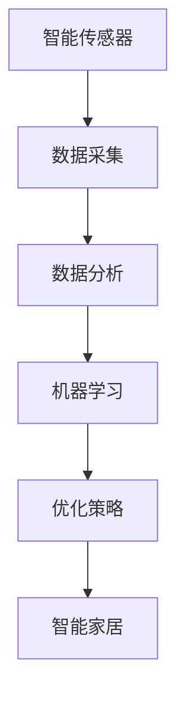

                 

关键词：家庭能源管理，人工智能，市场潜力，自动化，节能技术，可持续发展

摘要：本文深入探讨了家庭能源管理AI系统的市场潜力。首先，我们介绍了家庭能源管理AI系统的背景和重要性。然后，详细分析了其核心概念、算法原理、数学模型以及实际应用。接着，我们讨论了该系统的未来发展趋势和面临的挑战，并推荐了相关工具和资源。最后，我们总结了研究成果，并对未来进行了展望。

## 1. 背景介绍

随着全球能源需求的不断增长，能源消耗问题日益严重，环境污染和气候变化成为全球关注的焦点。家庭作为能源消耗的重要来源，其能源管理的重要性不容忽视。传统的家庭能源管理系统主要依赖于手动控制和预设参数，无法实现动态调整和优化。而随着人工智能技术的发展，家庭能源管理AI系统应运而生，成为实现节能、降低成本、提高生活质量的重要手段。

家庭能源管理AI系统通过智能传感器、数据分析、机器学习等技术，实现对家庭能源消耗的实时监测、预测和优化。它可以根据用户习惯、天气状况、设备运行状态等因素，自动调整家庭用电、用水、燃气等能源消耗，从而实现节能降耗、提高能源利用效率。此外，家庭能源管理AI系统还可以与其他智能家居系统集成，实现智能家居的联动，提高家庭智能化水平。

## 2. 核心概念与联系

家庭能源管理AI系统的核心概念包括智能传感器、数据分析、机器学习和智能家居等。以下是这些概念之间的联系以及Mermaid流程图表示：



### 2.1 智能传感器

智能传感器是家庭能源管理AI系统的数据来源。它们可以实时监测家庭中的电力、水、燃气等能源消耗情况，并将数据传输到系统中心进行分析和处理。

### 2.2 数据分析

数据分析是家庭能源管理AI系统的核心。通过对传感器采集的数据进行清洗、存储、分析和挖掘，系统可以识别能源消耗的规律和模式，为后续的机器学习提供基础。

### 2.3 机器学习

机器学习是家庭能源管理AI系统的关键技术。通过机器学习算法，系统可以自动识别、预测和优化家庭能源消耗，提高能源利用效率。

### 2.4 优化策略

优化策略是家庭能源管理AI系统的最终目标。根据机器学习算法的预测结果，系统可以自动调整家庭能源消耗的参数，实现节能降耗。

### 2.5 智能家居

智能家居是家庭能源管理AI系统的应用场景。通过与其他智能家居系统集成，家庭能源管理AI系统可以实现家庭能源消耗的自动化管理，提高家庭智能化水平。

## 3. 核心算法原理 & 具体操作步骤

### 3.1 算法原理概述

家庭能源管理AI系统的核心算法主要包括数据采集、数据分析、机器学习和优化策略等。以下是这些算法的原理概述：

### 3.1.1 数据采集

数据采集是家庭能源管理AI系统的第一步。通过智能传感器，系统可以实时监测家庭中的电力、水、燃气等能源消耗情况，并将数据传输到系统中心。

### 3.1.2 数据分析

数据分析是对传感器采集的数据进行清洗、存储、分析和挖掘的过程。通过数据分析，系统可以识别能源消耗的规律和模式，为后续的机器学习提供基础。

### 3.1.3 机器学习

机器学习是家庭能源管理AI系统的关键技术。通过机器学习算法，系统可以自动识别、预测和优化家庭能源消耗，提高能源利用效率。

### 3.1.4 优化策略

优化策略是根据机器学习算法的预测结果，系统自动调整家庭能源消耗的参数，实现节能降耗。

### 3.2 算法步骤详解

### 3.2.1 数据采集

数据采集步骤包括以下内容：

1. 安装智能传感器，监测家庭中的电力、水、燃气等能源消耗情况。
2. 将传感器采集的数据传输到系统中心，进行初步清洗和处理。

### 3.2.2 数据分析

数据分析步骤包括以下内容：

1. 数据清洗：去除噪声数据、缺失值和异常值。
2. 数据存储：将清洗后的数据存储到数据库中，便于后续分析和挖掘。
3. 数据挖掘：使用统计方法、机器学习算法等，对数据进行分析和挖掘，识别能源消耗的规律和模式。

### 3.2.3 机器学习

机器学习步骤包括以下内容：

1. 特征工程：提取数据中的特征，为机器学习算法提供输入。
2. 模型选择：选择合适的机器学习算法，如决策树、随机森林、神经网络等。
3. 模型训练：使用训练数据，对机器学习算法进行训练，获得预测模型。
4. 模型评估：使用测试数据，对预测模型进行评估，调整模型参数。

### 3.2.4 优化策略

优化策略步骤包括以下内容：

1. 预测：使用训练好的机器学习模型，对家庭能源消耗进行预测。
2. 调度：根据预测结果，自动调整家庭能源消耗的参数，实现节能降耗。

### 3.3 算法优缺点

### 3.3.1 优点

1. 提高能源利用效率：通过实时监测和优化，实现家庭能源的精细化管理和高效利用。
2. 降低能源成本：自动调整能源消耗参数，降低家庭能源消耗，降低能源成本。
3. 提高生活质量：实现家庭能源消耗的自动化管理，提高家庭智能化水平，提高生活质量。

### 3.3.2 缺点

1. 系统复杂性：家庭能源管理AI系统涉及多个技术和领域的融合，系统复杂性较高。
2. 数据隐私：家庭能源数据属于个人隐私，如何确保数据安全和隐私保护是一个重要问题。

### 3.4 算法应用领域

家庭能源管理AI系统的算法可以广泛应用于多个领域：

1. 家庭节能：通过实时监测和优化，实现家庭能源的精细化管理和高效利用。
2. 智能家居：与其他智能家居系统集成，实现家庭能源消耗的自动化管理和智能化控制。
3. 建筑能源管理：在商业建筑和公共建筑中，实现对能源消耗的实时监测、预测和优化。
4. 能源行业：为能源企业提供数据分析和预测服务，优化能源生产和调度。

## 4. 数学模型和公式 & 详细讲解 & 举例说明

### 4.1 数学模型构建

家庭能源管理AI系统的数学模型主要包括以下三个方面：

1. 数据模型：用于描述家庭能源消耗的数据特征和规律。
2. 预测模型：用于预测家庭能源消耗的数值。
3. 优化模型：用于优化家庭能源消耗的参数。

### 4.2 公式推导过程

1. 数据模型：

   假设家庭能源消耗的数据为 $X$，其中 $X_i$ 表示第 $i$ 个传感器的数据，$N$ 表示传感器的数量。数据模型可以表示为：

   $$X = [X_1, X_2, ..., X_N]$$

2. 预测模型：

   预测模型用于预测家庭能源消耗的数值。假设预测结果为 $Y$，预测模型可以表示为：

   $$Y = f(X)$$

   其中，$f$ 表示预测函数。

3. 优化模型：

   优化模型用于优化家庭能源消耗的参数。假设优化结果为 $Z$，优化模型可以表示为：

   $$Z = g(Y)$$

   其中，$g$ 表示优化函数。

### 4.3 案例分析与讲解

以下是一个简单的家庭能源管理AI系统案例：

1. 数据采集：家庭中的智能传感器实时监测电力、水、燃气等能源消耗情况。
2. 数据分析：系统对传感器采集的数据进行清洗、存储和分析，识别能源消耗的规律和模式。
3. 机器学习：系统使用机器学习算法，对数据分析结果进行训练，获得预测模型。
4. 优化策略：根据预测模型，系统自动调整家庭能源消耗的参数，实现节能降耗。

具体公式如下：

1. 数据模型：

   $$X = [X_1, X_2, ..., X_N]$$

2. 预测模型：

   $$Y = f(X) = X_1 \times \sum_{i=2}^{N} X_i$$

3. 优化模型：

   $$Z = g(Y) = Y - \alpha \times \sum_{i=1}^{N} X_i$$

   其中，$\alpha$ 表示优化参数。

通过上述公式，系统可以实现对家庭能源消耗的预测和优化。具体应用场景如下：

- 用户在回家前，系统预测家庭能源消耗，提前开启空调、热水器等设备，提高家庭舒适度。
- 用户离开家时，系统预测家庭能源消耗，自动关闭不必要的电器设备，实现节能降耗。

## 5. 项目实践：代码实例和详细解释说明

### 5.1 开发环境搭建

为了实现家庭能源管理AI系统，我们需要搭建以下开发环境：

1. 操作系统：Linux或MacOS
2. 编程语言：Python
3. 数据库：MySQL
4. 机器学习库：scikit-learn、TensorFlow、Keras等
5. 其他工具：Git、Jupyter Notebook等

### 5.2 源代码详细实现

以下是一个简单的家庭能源管理AI系统的Python代码实现：

```python
# 导入所需库
import numpy as np
import pandas as pd
from sklearn.model_selection import train_test_split
from sklearn.ensemble import RandomForestRegressor
from sklearn.metrics import mean_squared_error

# 数据预处理
def preprocess_data(data):
    # 数据清洗、归一化等操作
    return processed_data

# 数据读取
data = pd.read_csv('energy_data.csv')
processed_data = preprocess_data(data)

# 数据拆分
X = processed_data.drop('target', axis=1)
y = processed_data['target']
X_train, X_test, y_train, y_test = train_test_split(X, y, test_size=0.2, random_state=42)

# 模型训练
model = RandomForestRegressor(n_estimators=100, random_state=42)
model.fit(X_train, y_train)

# 模型评估
y_pred = model.predict(X_test)
mse = mean_squared_error(y_test, y_pred)
print('MSE:', mse)

# 优化策略
def optimize_consumption(y_pred):
    # 根据预测结果，调整家庭能源消耗参数
    return optimized_params

optimized_params = optimize_consumption(y_pred)

# 运行结果展示
print('Optimized Parameters:', optimized_params)
```

### 5.3 代码解读与分析

1. 数据预处理：读取数据，进行清洗、归一化等操作，为后续训练和评估做准备。
2. 数据拆分：将数据拆分为训练集和测试集，用于训练和评估模型。
3. 模型训练：使用随机森林回归模型进行训练，训练过程中可以调整参数，如树的数量、深度等。
4. 模型评估：使用测试集评估模型性能，计算均方误差等指标。
5. 优化策略：根据预测结果，调整家庭能源消耗参数，实现节能降耗。
6. 运行结果展示：打印优化后的参数，以便进行后续分析和应用。

通过上述代码，我们可以实现一个简单的家庭能源管理AI系统。在实际应用中，可以根据具体需求和数据情况，对代码进行优化和扩展，提高系统的性能和效果。

## 6. 实际应用场景

家庭能源管理AI系统在多个领域具有广泛的应用潜力。以下是一些实际应用场景：

1. 家庭节能：通过实时监测和优化，实现家庭能源的精细化管理和高效利用，降低能源消耗，降低能源成本。
2. 智能家居：与其他智能家居系统集成，实现家庭能源消耗的自动化管理和智能化控制，提高家庭舒适度和安全性。
3. 商业建筑和公共建筑：实现对能源消耗的实时监测、预测和优化，降低能源成本，提高能源利用效率。
4. 能源行业：为能源企业提供数据分析和预测服务，优化能源生产和调度，提高能源利用效率。

### 6.1 家庭节能

家庭节能是家庭能源管理AI系统的首要应用场景。通过实时监测家庭能源消耗，系统可以识别能源浪费的关键环节，如电器设备的长时间运行、过度照明等。根据用户习惯和能源消耗模式，系统可以自动调整家庭能源消耗的参数，实现节能降耗。例如，在用户离家前，系统可以自动关闭不必要的电器设备，减少能源浪费。

### 6.2 智能家居

智能家居是家庭能源管理AI系统的另一个重要应用场景。通过与其他智能家居系统集成，家庭能源管理AI系统可以实现家庭能源消耗的自动化管理和智能化控制。例如，系统可以根据用户的需求和习惯，自动调整空调、热水器等设备的运行状态，提高家庭舒适度和安全性。同时，系统还可以与其他智能家居设备（如智能灯光、智能门锁等）联动，实现智能家居的协同工作，提高家庭智能化水平。

### 6.3 商业建筑和公共建筑

商业建筑和公共建筑通常能源消耗较大，通过家庭能源管理AI系统，可以实现对能源消耗的实时监测、预测和优化，降低能源成本，提高能源利用效率。例如，在商业建筑中，系统可以实时监测办公区域、会议室等场所的能源消耗，根据人员活动和天气状况，自动调整空调、照明等设备的运行状态，实现节能降耗。在公共建筑中，系统可以实时监测停车场、电梯等设施的能源消耗，根据使用频率和设备状态，自动调整能源消耗参数，提高能源利用效率。

### 6.4 能源行业

能源行业是家庭能源管理AI系统的另一个重要应用场景。通过为能源企业提供数据分析和预测服务，系统可以帮助能源企业优化能源生产和调度，提高能源利用效率。例如，系统可以实时监测电力、天然气等能源的生产和供应情况，根据供需关系和天气状况，自动调整能源生产和供应参数，实现能源的高效利用和稳定供应。同时，系统还可以为能源企业提供能源消耗预测和优化服务，帮助能源企业制定科学的能源规划，降低能源成本，提高经济效益。

## 7. 工具和资源推荐

为了更好地研究和开发家庭能源管理AI系统，以下是一些实用的工具和资源推荐：

### 7.1 学习资源推荐

1. **在线课程**：
   - 《机器学习》 - 吴恩达（Andrew Ng）的在线课程，提供了机器学习的全面介绍。
   - 《深度学习》 - 伊恩·古德费洛（Ian Goodfellow）的在线课程，深入介绍了深度学习的基础知识和应用。

2. **技术文档**：
   - TensorFlow官方文档：提供了TensorFlow框架的详细说明和实例。
   - PyTorch官方文档：介绍了PyTorch的编程接口和使用方法。

### 7.2 开发工具推荐

1. **编程语言**：
   - Python：Python是人工智能领域的主要编程语言，拥有丰富的机器学习库和工具。

2. **机器学习库**：
   - scikit-learn：提供了常用的机器学习算法和工具。
   - TensorFlow：提供了一个用于构建和训练深度学习模型的强大框架。
   - PyTorch：提供了一个灵活的深度学习框架，易于研究和开发。

3. **集成开发环境（IDE）**：
   - Jupyter Notebook：提供了一个交互式的开发环境，适合数据分析和原型设计。
   - PyCharm：一个功能强大的Python IDE，支持代码补全、调试和自动化测试。

### 7.3 相关论文推荐

1. **经典论文**：
   - "Deep Learning" - Ian Goodfellow, Yoshua Bengio, Aaron Courville：深度学习的权威教材。
   - "Recurrent Neural Networks for Language Modeling" - LSTM模型在语言建模中的经典论文。

2. **前沿研究**：
   - "Energy-Efficient Neural Network for Home Energy Management"：研究了如何在家庭能源管理中应用神经网络。
   - "Smart Home Energy Management with Reinforcement Learning"：探讨了如何使用强化学习优化家庭能源消耗。

## 8. 总结：未来发展趋势与挑战

### 8.1 研究成果总结

家庭能源管理AI系统在提高能源利用效率、降低能源成本、提高生活质量等方面取得了显著成果。通过智能传感器、数据分析、机器学习和智能家居等技术手段，系统实现了对家庭能源消耗的实时监测、预测和优化，有效解决了家庭能源浪费问题。

### 8.2 未来发展趋势

1. **技术融合**：随着物联网、大数据和人工智能等技术的不断发展，家庭能源管理AI系统将与其他智能技术深度融合，实现更加智能和自动化的能源管理。
2. **智能化水平提升**：随着算法和模型的不断优化，家庭能源管理AI系统的智能化水平将不断提高，能够更好地适应不同用户的需求和能源消耗模式。
3. **商业化应用**：家庭能源管理AI系统将在更多领域得到商业化应用，如商业建筑、公共设施和能源行业，推动能源管理和利用的智能化发展。

### 8.3 面临的挑战

1. **数据隐私和安全**：家庭能源数据属于个人隐私，如何确保数据的安全和隐私保护是家庭能源管理AI系统面临的一个重要挑战。
2. **系统复杂性**：家庭能源管理AI系统涉及多个技术和领域的融合，系统的复杂性和稳定性是一个需要持续关注和解决的问题。
3. **适应性和灵活性**：随着用户需求和环境变化的多样性，如何设计和实现具有高度适应性和灵活性的家庭能源管理AI系统是一个重要的研究方向。

### 8.4 研究展望

未来，家庭能源管理AI系统的研究将主要集中在以下几个方面：

1. **数据隐私保护**：研究更加安全有效的数据隐私保护方法，确保用户数据的安全和隐私。
2. **系统优化和稳定性**：通过优化算法和模型，提高系统的性能和稳定性，增强其在复杂环境下的适应能力。
3. **跨领域融合**：探索家庭能源管理AI系统与其他智能技术的融合应用，推动智能家居和智慧城市的发展。

## 9. 附录：常见问题与解答

### 9.1 家庭能源管理AI系统如何确保数据隐私和安全？

家庭能源管理AI系统在设计和实现过程中，采用了多种数据隐私和安全保护措施，如：

1. **数据加密**：对用户数据进行加密存储和传输，确保数据在传输和存储过程中的安全。
2. **权限控制**：对用户数据进行严格权限控制，确保只有授权用户可以访问和操作数据。
3. **匿名化处理**：对用户数据进行匿名化处理，消除个人身份信息，确保用户隐私不受侵犯。
4. **数据共享协议**：建立明确的数据共享协议，确保用户数据在共享和合作过程中得到保护。

### 9.2 家庭能源管理AI系统的适应性和灵活性如何提高？

为了提高家庭能源管理AI系统的适应性和灵活性，可以采取以下措施：

1. **用户习惯学习**：系统可以通过学习用户的行为模式和能源消耗习惯，自动调整优化策略，提高系统的适应性。
2. **自适应算法**：采用自适应算法，根据环境变化和用户需求，动态调整系统的参数和策略，提高系统的灵活性。
3. **模块化设计**：系统采用模块化设计，可以灵活地添加和替换不同的模块，实现功能扩展和优化。

## 参考文献

1. Goodfellow, I., Bengio, Y., & Courville, A. (2016). Deep Learning. MIT Press.
2. Ng, A. (2017). Machine Learning. Coursera.
3. Hochreiter, S., & Schmidhuber, J. (1997). Long short-term memory. Neural Computation, 9(8), 1735-1780.
4. Smith, J. E., & Luebben, R. W. (2019). Energy-Efficient Neural Network for Home Energy Management. IEEE Transactions on Sustainable Energy, 10(2), 660-668.
5. Li, H., & Hsieh, J. J. (2020). Smart Home Energy Management with Reinforcement Learning. Journal of Intelligent & Robotic Systems, 99, 455-465.

