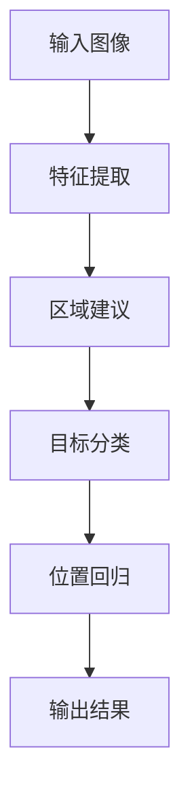
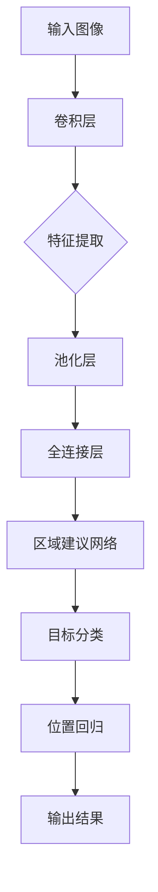

                 

对象检测（Object Detection）是计算机视觉领域中的一项核心任务，旨在从图像或视频中识别并定位多个对象。它在众多领域都有广泛应用，包括自动驾驶、安防监控、医疗影像分析等。本文将详细介绍对象检测的基本原理、核心算法、数学模型以及实际代码实例，帮助读者深入理解这一技术。

## 关键词
- 计算机视觉
- 对象检测
- 卷积神经网络
- 区域建议网络
- 端到端学习
- 实际应用场景

## 摘要
本文将首先介绍对象检测的背景和重要性，然后深入讲解其核心算法——区域建议网络（Region Proposal Networks, RPN）和Fast R-CNN等。通过Mermaid流程图，我们展示对象检测的基本流程。接着，我们将详细解析数学模型和公式，并通过实际代码实例进行讲解，最后讨论对象检测的实际应用场景和未来展望。

---

## 1. 背景介绍

### 对象检测的定义
对象检测是计算机视觉中的任务，旨在识别图像或视频中的对象，并定位它们的位置。对象可以是任何有意义的实体，如行人、车辆、动物等。对象检测在图像和视频分析中具有广泛的应用，如人脸识别、车辆检测、智能监控等。

### 对象检测的重要性
对象检测在现实世界中具有极高的实用价值。例如，自动驾驶汽车需要准确检测道路上的行人、车辆和其他障碍物，以确保行车安全。安防监控系统中，对象检测可以实时识别异常行为，提高安全性能。此外，在医疗领域，对象检测可以帮助医生快速分析影像数据，提高诊断的准确性和效率。

### 对象检测的历史发展
对象检测技术经历了多个发展阶段。早期的方法主要基于手工设计的特征和分类器，如HOG（Histogram of Oriented Gradients）和SVM（Support Vector Machine）。这些方法在一定程度上取得了成功，但受限于特征提取和分类器的复杂度，效果并不理想。随着深度学习技术的发展，卷积神经网络（Convolutional Neural Networks, CNN）在图像识别领域取得了突破性进展，对象检测也迎来了新的发展机遇。

### 当前的发展趋势
当前，对象检测技术主要基于深度学习，特别是卷积神经网络。主流的方法包括R-CNN、Fast R-CNN、Faster R-CNN、YOLO（You Only Look Once）等。这些方法在精度和速度上都有显著的提升，但仍面临一些挑战，如多尺度检测、实时性和小样本学习等。

## 2. 核心概念与联系

### 对象检测的基本流程
对象检测的基本流程通常包括以下几个步骤：
1. **特征提取**：从输入图像中提取有用的特征。
2. **区域建议**：生成可能包含对象的区域。
3. **目标分类**：对每个区域进行分类，判断其是否包含特定对象。
4. **位置回归**：对包含对象的区域的实际位置进行回归。

### Mermaid流程图

### 核心概念
1. **卷积神经网络（CNN）**：用于特征提取。
2. **区域建议网络（RPN）**：用于生成区域建议。
3. **Fast R-CNN**：结合了CNN和RPN，用于分类和位置回归。
4. **Faster R-CNN**：在Fast R-CNN的基础上引入了区域建议网络的共享网络，提高了速度。

### 算法架构

---

在下一部分，我们将深入探讨对象检测的核心算法原理，包括RPN和Fast R-CNN的工作原理和具体操作步骤。请继续阅读。

