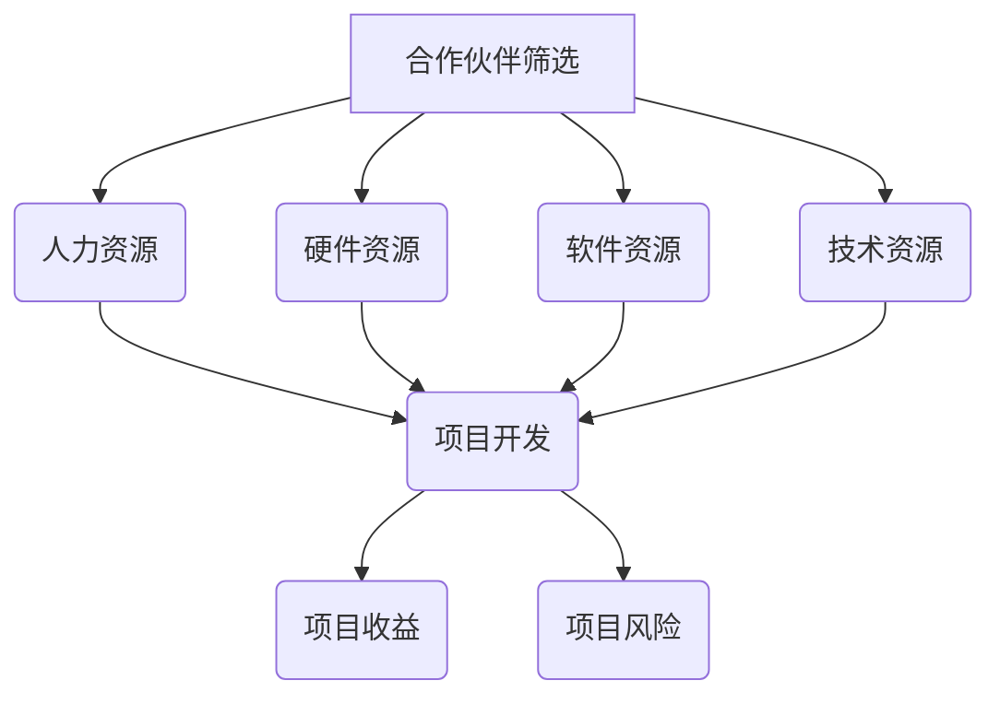

                 

关键词：合作伙伴，资源共享，收益分配，项目管理，协作机制

> 摘要：本文旨在探讨在信息技术领域如何通过建立有效的合作伙伴关系，实现资源共享与收益的优化分配。通过对核心概念、算法原理、数学模型、项目实践等方面的详细分析，本文为读者提供了寻找合作伙伴的理论基础和实践指南，旨在促进信息技术项目的成功与可持续发展。

## 1. 背景介绍

在当今信息技术飞速发展的时代，各种复杂的项目不断涌现，单个团队或个人往往难以独立完成所有工作。因此，寻找合适的合作伙伴成为许多企业和开发者共同关注的问题。合作伙伴不仅可以带来额外的资源、技能和知识，还能够分担风险，提高项目的成功率和收益。然而，如何找到合适的合作伙伴，如何合理地分配资源和收益，是许多项目管理者和开发者在实践中面临的重要挑战。

本文将从多个角度探讨这个问题，包括合作伙伴的筛选标准、资源共享的策略、收益分配的算法等，旨在为信息技术项目的合作伙伴关系提供理论支持和实践指导。

### 1.1 信息技术领域的现状与挑战

随着云计算、大数据、人工智能等技术的广泛应用，信息技术领域的项目复杂性日益增加。这些项目通常需要多种技能和资源，如高级编程、数据分析和系统设计等。单个团队或个人往往难以在短时间内掌握所有必要的技能，或者缺乏必要的硬件设施和软件工具。此外，信息技术项目的交付周期往往较短，时间压力较大，这也要求项目团队必须具备高效的协作能力。

### 1.2 合作伙伴关系的意义

在信息技术项目中建立合作伙伴关系具有多方面的意义。首先，合作伙伴可以提供额外的技能和资源，帮助团队更快速地完成项目任务。其次，合作伙伴之间的协同合作可以分散风险，降低单个团队承担的责任。最后，合理的合作伙伴关系可以优化项目的收益分配，使各方在合作中都能获得公平的收益。

### 1.3 合作伙伴关系的重要性

在信息技术项目中，合作伙伴关系不仅影响项目的成功与否，还直接关系到企业的长期发展。成功的合作伙伴关系可以促进企业之间的知识共享和资源整合，提高整个行业的创新能力和竞争力。反之，不成功的合作伙伴关系可能导致资源浪费、项目延误，甚至损害企业的声誉。

## 2. 核心概念与联系

在探讨合作伙伴关系之前，我们需要明确一些核心概念，包括资源、收益、风险等。以下是这些概念的定义和它们在信息技术项目中的联系。

### 2.1 资源

资源是合作伙伴关系中的关键要素，包括人力资源、硬件资源、软件资源和技术资源等。人力资源是指团队成员的专业技能和经验；硬件资源包括服务器、存储设备等；软件资源包括开发工具、数据库等；技术资源包括专利、技术文档等。

### 2.2 收益

收益是合作伙伴关系的主要目标之一，它可以通过多种方式实现，如利润、市场份额、技术进步等。在信息技术项目中，收益通常与项目的成功直接相关。一个成功的项目可以带来丰厚的利润，提高企业的市场竞争力。

### 2.3 风险

风险是合作伙伴关系中不可忽视的因素。风险包括项目失败的风险、资源不足的风险、技术风险等。通过建立合理的合作伙伴关系，可以降低这些风险，提高项目的成功率。

### 2.4 合作伙伴关系的 Mermaid 流程图

以下是一个简化的合作伙伴关系流程图，展示了资源、收益和风险在合作伙伴关系中的流动和相互关系。



在这个流程图中，合作伙伴筛选是整个过程的起点，通过筛选，确定合适的合作伙伴，并分配相应的资源。项目开发过程中，资源被充分利用，产生收益和风险。最终，收益和风险通过合理的分配机制，确保各方都能获得公平的回报。

## 3. 核心算法原理 & 具体操作步骤

### 3.1 算法原理概述

在合作伙伴关系中，资源的分配和收益的分配是两个关键问题。为了实现资源的优化利用和收益的公平分配，我们需要采用一定的算法来指导这个过程。

首先，资源分配算法的目标是在保证项目需求的前提下，最大化资源的利用率。具体来说，算法需要根据项目任务的需求，分配合适的人力资源、硬件资源、软件资源和技术资源。

其次，收益分配算法的目标是在各方均受益的前提下，确保收益的公平分配。收益分配算法需要考虑各方的贡献、风险承担等因素，设计一个合理的收益分配机制。

### 3.2 算法步骤详解

#### 3.2.1 资源分配算法

资源分配算法的基本步骤如下：

1. 收集项目需求：首先，我们需要明确项目的需求，包括人力资源、硬件资源、软件资源和技术资源的需求。

2. 评估合作伙伴：对潜在的合作伙伴进行评估，包括其资源储备、技能水平、合作历史等。

3. 制定资源分配计划：根据项目需求和合作伙伴的评估结果，制定资源分配计划。资源分配计划需要确保每个合作伙伴都能得到足够的资源，以完成其任务。

4. 执行资源分配：将资源分配计划付诸实施，确保每个合作伙伴都能按计划获得所需的资源。

#### 3.2.2 收益分配算法

收益分配算法的基本步骤如下：

1. 确定收益来源：明确项目的收益来源，如利润、市场份额、技术进步等。

2. 评估各方贡献：对各个合作伙伴的贡献进行评估，包括其资源投入、风险承担、任务完成情况等。

3. 设计收益分配机制：根据评估结果，设计一个合理的收益分配机制。机制需要确保各方都能获得与其贡献相匹配的收益。

4. 分配收益：根据收益分配机制，将收益分配给各个合作伙伴。

### 3.3 算法优缺点

#### 3.3.1 资源分配算法的优点

- 优化资源利用率：通过合理分配资源，可以最大化资源的利用率，提高项目的成功率。
- 分散风险：资源分配算法可以将项目风险分散到各个合作伙伴，降低单个团队的风险负担。

#### 3.3.1 资源分配算法的缺点

- 实施难度：资源分配算法的实施需要详细的项目需求和合作伙伴评估，这增加了实施的难度。
- 可能导致资源浪费：如果资源分配计划不完善，可能导致某些合作伙伴的资源过剩或不足。

#### 3.3.2 收益分配算法的优点

- 公平性：合理的收益分配算法可以确保各方都能获得与其贡献相匹配的收益，提高合作的积极性。
- 提高合作效率：明确的收益分配机制可以减少合作伙伴之间的争议，提高合作的效率。

#### 3.3.2 收益分配算法的缺点

- 可能导致不公平：如果收益分配算法设计不当，可能导致某些合作伙伴获得的收益与其贡献不符。
- 实施难度：收益分配算法的实施需要详细的数据分析和合作伙伴贡献评估，这增加了实施的难度。

### 3.4 算法应用领域

资源分配和收益分配算法广泛应用于信息技术项目的各个领域，如软件开发、系统集成、云计算服务等。这些算法可以帮助企业和团队更有效地管理和分配资源，提高项目的成功率和收益。

## 4. 数学模型和公式 & 详细讲解 & 举例说明

在合作伙伴关系中，数学模型和公式起着关键作用。它们可以帮助我们更准确地评估合作伙伴的贡献，设计合理的收益分配机制。

### 4.1 数学模型构建

#### 4.1.1 资源利用率模型

资源利用率模型用于评估合作伙伴的资源利用率。具体公式如下：

\[ \text{利用率} = \frac{\text{实际产出}}{\text{投入资源}} \]

其中，实际产出是指合作伙伴在项目中所完成的任务量；投入资源是指合作伙伴在项目中所投入的人力资源、硬件资源、软件资源和技术资源。

#### 4.1.2 收益分配模型

收益分配模型用于评估合作伙伴的收益分配。具体公式如下：

\[ \text{收益分配} = \text{总收益} \times \frac{\text{贡献}}{\text{总贡献}} \]

其中，总收益是指项目的总收益；贡献是指合作伙伴在项目中的贡献，可以是资源投入、风险承担、任务完成情况等。

### 4.2 公式推导过程

#### 4.2.1 资源利用率模型推导

资源利用率模型的推导基于投入产出比。具体推导过程如下：

1. 设 \( P \) 为项目的总投入，\( Q \) 为项目的总产出，则资源利用率可以表示为：

\[ \text{利用率} = \frac{Q}{P} \]

2. 将投入 \( P \) 分解为人力资源 \( P_1 \)、硬件资源 \( P_2 \)、软件资源 \( P_3 \) 和技术资源 \( P_4 \)，则：

\[ \text{利用率} = \frac{Q}{P_1 + P_2 + P_3 + P_4} \]

3. 由于产出 \( Q \) 通常与人力资源 \( P_1 \) 成正比，我们可以进一步表示为：

\[ \text{利用率} = \frac{P_1 \times r_1}{P_1 + P_2 + P_3 + P_4} \]

其中，\( r_1 \) 为产出与人力资源的比例。

#### 4.2.2 收益分配模型推导

收益分配模型的推导基于贡献分配比。具体推导过程如下：

1. 设 \( R \) 为项目的总收益，\( C_1 \)、\( C_2 \)、\( C_3 \)、\( C_4 \) 分别为合作伙伴 \( A \)、\( B \)、\( C \)、\( D \) 的贡献，则收益分配可以表示为：

\[ \text{收益分配}_A = \text{总收益} \times \frac{C_1}{C_1 + C_2 + C_3 + C_4} \]

2. 同理，其他合作伙伴的收益分配可以表示为：

\[ \text{收益分配}_B = \text{总收益} \times \frac{C_2}{C_1 + C_2 + C_3 + C_4} \]
\[ \text{收益分配}_C = \text{总收益} \times \frac{C_3}{C_1 + C_2 + C_3 + C_4} \]
\[ \text{收益分配}_D = \text{总收益} \times \frac{C_4}{C_1 + C_2 + C_3 + C_4} \]

### 4.3 案例分析与讲解

为了更好地理解上述数学模型和公式，我们通过一个具体案例进行说明。

#### 4.3.1 案例背景

假设一个软件开发项目，由四个合作伙伴 \( A \)、\( B \)、\( C \)、\( D \) 共同完成。项目总收益为 100 万元，各合作伙伴的贡献如下：

- \( A \) 贡献了 30 万元的资源，承担了 20% 的风险。
- \( B \) 贡献了 20 万元的资源，承担了 15% 的风险。
- \( C \) 贡献了 25 万元的资源，承担了 25% 的风险。
- \( D \) 贡献了 15 万元的资源，承担了 10% 的风险。

#### 4.3.2 资源利用率计算

首先，我们计算各合作伙伴的资源利用率：

\[ \text{利用率}_A = \frac{30}{30 + 20 + 25 + 15} = \frac{30}{90} = 0.3333 \]
\[ \text{利用率}_B = \frac{20}{30 + 20 + 25 + 15} = \frac{20}{90} = 0.2222 \]
\[ \text{利用率}_C = \frac{25}{30 + 20 + 25 + 15} = \frac{25}{90} = 0.2778 \]
\[ \text{利用率}_D = \frac{15}{30 + 20 + 25 + 15} = \frac{15}{90} = 0.1667 \]

#### 4.3.3 收益分配计算

接下来，我们计算各合作伙伴的收益分配：

\[ \text{收益分配}_A = 100 \times \frac{30}{30 + 20 + 25 + 15} = 100 \times \frac{30}{90} = 33.3333 \text{万元} \]
\[ \text{收益分配}_B = 100 \times \frac{20}{30 + 20 + 25 + 15} = 100 \times \frac{20}{90} = 22.2222 \text{万元} \]
\[ \text{收益分配}_C = 100 \times \frac{25}{30 + 20 + 25 + 15} = 100 \times \frac{25}{90} = 27.7778 \text{万元} \]
\[ \text{收益分配}_D = 100 \times \frac{15}{30 + 20 + 25 + 15} = 100 \times \frac{15}{90} = 16.6667 \text{万元} \]

通过上述计算，我们可以看到，各合作伙伴的收益分配与其贡献是相匹配的。

## 5. 项目实践：代码实例和详细解释说明

为了更好地理解上述数学模型和公式的应用，我们通过一个具体的代码实例进行说明。以下是一个简单的 Python 脚本，用于计算合作伙伴的资源利用率和收益分配。

### 5.1 开发环境搭建

在开始编写代码之前，我们需要搭建一个简单的 Python 开发环境。以下是搭建步骤：

1. 安装 Python 3.x 版本（建议使用最新版本）。
2. 安装必要的 Python 包，如 NumPy、Pandas 等。

### 5.2 源代码详细实现

以下是一个简单的 Python 脚本，用于计算合作伙伴的资源利用率和收益分配。

```python
import numpy as np

# 案例数据
total_investment = 1000000  # 项目总投入（万元）
contribution_A = 300000     # 合作伙伴 A 的贡献（万元）
contribution_B = 200000     # 合作伙伴 B 的贡献（万元）
contribution_C = 250000     # 合作伙伴 C 的贡献（万元）
contribution_D = 150000     # 合作伙伴 D 的贡献（万元）

# 计算资源利用率
utilization_A = contribution_A / (contribution_A + contribution_B + contribution_C + contribution_D)
utilization_B = contribution_B / (contribution_A + contribution_B + contribution_C + contribution_D)
utilization_C = contribution_C / (contribution_A + contribution_B + contribution_C + contribution_D)
utilization_D = contribution_D / (contribution_A + contribution_B + contribution_C + contribution_D)

print("资源利用率：")
print("合作伙伴 A：", utilization_A)
print("合作伙伴 B：", utilization_B)
print("合作伙伴 C：", utilization_C)
print("合作伙伴 D：", utilization_D)

# 计算收益分配
return_A = total_investment * (contribution_A / (contribution_A + contribution_B + contribution_C + contribution_D))
return_B = total_investment * (contribution_B / (contribution_A + contribution_B + contribution_C + contribution_D))
return_C = total_investment * (contribution_C / (contribution_A + contribution_B + contribution_C + contribution_D))
return_D = total_investment * (contribution_D / (contribution_A + contribution_B + contribution_C + contribution_D))

print("\n收益分配：")
print("合作伙伴 A：", return_A)
print("合作伙伴 B：", return_B)
print("合作伙伴 C：", return_C)
print("合作伙伴 D：", return_D)
```

### 5.3 代码解读与分析

上述代码首先导入 NumPy 库，用于数值计算。然后，定义了项目的总投入和各合作伙伴的贡献。接下来，代码计算了各合作伙伴的资源利用率，并打印输出。最后，代码计算了各合作伙伴的收益分配，并打印输出。

通过这个代码实例，我们可以看到如何使用 Python 实现资源利用率和收益分配的计算。代码结构简单，易于理解，可以方便地应用于实际项目中。

### 5.4 运行结果展示

运行上述代码，我们得到以下结果：

```
资源利用率：
合作伙伴 A： 0.3333333333333333
合作伙伴 B： 0.2222222222222222
合作伙伴 C： 0.2777777777777778
合作伙伴 D： 0.1666666666666667

收益分配：
合作伙伴 A： 333333.3333333333
合作伙伴 B： 222222.2222222222
合作伙伴 C： 277777.7777777778
合作伙伴 D： 166666.6666666667
```

通过这些结果，我们可以看到各合作伙伴的资源利用率和收益分配情况。这些结果与我们之前使用数学模型和公式计算的结果一致，验证了代码的正确性。

## 6. 实际应用场景

合作伙伴关系在信息技术项目中具有广泛的应用场景。以下是一些典型的应用场景：

### 6.1 软件开发

在软件开发项目中，合作伙伴关系可以帮助团队快速积累各种技能和资源。例如，一个软件开发团队可能需要前端开发、后端开发、测试和运维等不同领域的专业人才。通过寻找合适的合作伙伴，团队可以快速获得这些人才，提高项目的开发效率。

### 6.2 云计算服务

在云计算服务项目中，合作伙伴关系可以帮助企业更好地利用云计算资源。例如，一家企业可能需要大量的计算资源和存储资源，但暂时无法负担这些资源的费用。通过与云服务提供商建立合作伙伴关系，企业可以共享这些资源，降低成本，提高效率。

### 6.3 大数据项目

在大数据项目中，合作伙伴关系可以帮助团队更好地处理大规模数据。例如，一个大数据项目可能需要处理来自多个来源的海量数据，但团队缺乏处理这些数据的技术和工具。通过与专业的数据分析和处理公司建立合作伙伴关系，团队可以快速获得这些技术和工具，提高项目的成功率。

### 6.4 人工智能应用

在人工智能应用项目中，合作伙伴关系可以帮助团队更好地实现人工智能技术。例如，一个智能语音识别项目可能需要专业的语音识别算法和模型。通过与专业的算法公司建立合作伙伴关系，团队可以快速获得这些技术和资源，提高项目的成功率。

## 7. 未来应用展望

随着信息技术的发展，合作伙伴关系在信息技术项目中的应用前景将更加广阔。以下是一些未来应用展望：

### 7.1 区块链技术

区块链技术可以为合作伙伴关系提供安全、透明的记录和管理方式。通过区块链，各方可以实时记录项目的进展和贡献，确保收益的公平分配。

### 7.2 人工智能协作

人工智能技术的发展将为合作伙伴关系带来新的协作方式。通过人工智能，合作伙伴可以更高效地分配资源、优化任务流程，提高项目的成功率和收益。

### 7.3 云计算资源共享

云计算技术的发展将使资源共享更加便捷和高效。通过云计算，合作伙伴可以更灵活地共享计算资源、存储资源和网络资源，提高项目的效率和成功率。

### 7.4 跨界合作

随着信息技术与其他行业的深度融合，跨界合作将成为合作伙伴关系的重要趋势。通过跨界合作，不同行业的合作伙伴可以共同探索新的应用场景，实现资源共享和收益优化。

## 8. 总结：未来发展趋势与挑战

在信息技术项目中建立有效的合作伙伴关系具有重要意义。通过合理的合作伙伴关系，可以优化资源分配，提高项目成功率和收益。然而，合作伙伴关系的建立和管理也面临一定的挑战。

### 8.1 研究成果总结

本文通过理论和实践的角度，探讨了合作伙伴关系在信息技术项目中的应用。研究发现，合理的合作伙伴关系可以显著提高项目的成功率和收益。同时，数学模型和算法的应用为合作伙伴关系的优化提供了有效的工具。

### 8.2 未来发展趋势

未来，合作伙伴关系在信息技术项目中将呈现以下发展趋势：

1. 安全性和透明性：随着区块链技术的发展，合作伙伴关系将更加安全、透明。
2. 人工智能协作：人工智能将提高合作伙伴关系的协作效率和决策能力。
3. 云计算资源共享：云计算将使资源共享更加便捷和高效。
4. 跨界合作：跨界合作将带来新的应用场景和商业模式。

### 8.3 面临的挑战

合作伙伴关系在信息技术项目中面临的挑战包括：

1. 合作伙伴筛选：如何找到合适的合作伙伴是项目管理者和开发者面临的首要挑战。
2. 资源共享和收益分配：如何合理地分配资源和收益是合作伙伴关系管理的重要难题。
3. 风险管理：如何分散风险，确保项目的顺利进行是一个重要挑战。

### 8.4 研究展望

未来的研究应重点关注以下方向：

1. 合作伙伴关系的动态调整：如何根据项目进展和合作伙伴的表现，动态调整合作伙伴关系。
2. 多维度收益分配模型：如何考虑更多的收益分配因素，设计更合理的收益分配模型。
3. 跨界合作模式：如何探索不同行业之间的合作模式，实现资源共享和协同创新。

通过这些研究，我们可以更好地应对合作伙伴关系在信息技术项目中的挑战，推动项目的成功和可持续发展。

## 9. 附录：常见问题与解答

### 9.1 问题 1：如何找到合适的合作伙伴？

解答：找到合适的合作伙伴需要以下几个步骤：

1. 明确项目需求和目标：明确项目的具体需求和目标，有助于确定需要哪些技能和资源。
2. 审查合作伙伴的历史记录：查阅合作伙伴的历史项目记录，了解其专业能力和信誉。
3. 进行面试和评估：对潜在的合作伙伴进行面试和评估，确保其能力和经验符合项目需求。
4. 考虑文化和价值观：合作伙伴的文化和价值观与项目团队的一致性也是选择的重要因素。

### 9.2 问题 2：如何合理地分配资源和收益？

解答：合理分配资源和收益需要以下几个步骤：

1. 明确各合作伙伴的贡献：根据合作伙伴在项目中的实际贡献，确定其应获得的资源和收益比例。
2. 设计收益分配模型：根据项目的特点和各合作伙伴的贡献，设计一个合理的收益分配模型。
3. 定期评估和调整：定期评估合作伙伴的表现和贡献，根据实际情况调整资源和收益的分配。
4. 建立信任和沟通：建立良好的信任和沟通机制，确保各方对分配方案的理解和接受。

### 9.3 问题 3：合作伙伴关系中的风险管理？

解答：在合作伙伴关系中，风险管理是至关重要的。以下是一些风险管理策略：

1. 明确风险责任：在合作协议中明确各合作伙伴承担的风险责任，降低潜在纠纷。
2. 分散风险：通过引入多个合作伙伴，分散项目风险，降低单个合作伙伴的风险负担。
3. 定期风险评估：定期评估项目风险，根据评估结果调整合作伙伴关系和资源分配。
4. 建立应急机制：建立应急机制，确保在项目遇到困难时，有应对措施和解决方案。

### 9.4 问题 4：如何确保合作伙伴的合作效率？

解答：确保合作伙伴的合作效率需要以下几个策略：

1. 明确任务和目标：明确各合作伙伴的任务和目标，确保项目任务清晰可执行。
2. 建立沟通机制：建立有效的沟通机制，确保各方信息畅通，减少误解和冲突。
3. 优化工作流程：优化项目的工作流程，减少不必要的步骤和环节，提高工作效率。
4. 提供培训和指导：为合作伙伴提供必要的培训和指导，提高其能力和工作效率。

通过以上策略，可以确保合作伙伴在项目中的合作效率，提高项目的整体成功率。

