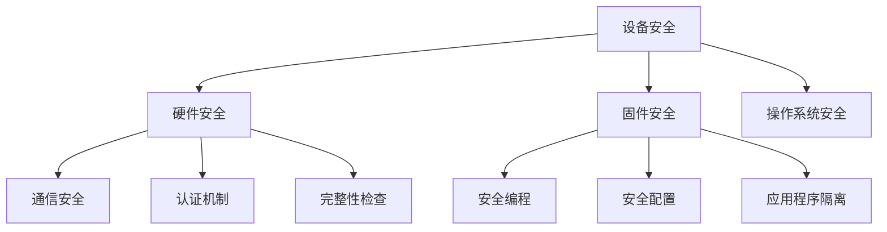

                 

关键词：嵌入式系统，安全性，数据保护，加密算法，安全协议，攻击防御，漏洞修复

> 摘要：随着物联网和智能制造的快速发展，嵌入式系统在各个领域得到了广泛应用。然而，随之而来的安全性问题也日益突出。本文将深入探讨嵌入式系统的安全策略，包括设备层、通信层和应用层的安全措施，以及如何通过加密算法、安全协议和漏洞修复来保护设备和数据完整性。

## 1. 背景介绍

嵌入式系统是一种专门为特定任务而设计的计算机系统，通常具有有限的计算资源。这些系统广泛应用于工业控制、汽车电子、医疗设备、智能家居等领域。随着嵌入式系统在网络中的互联，安全性成为了一个关键问题。嵌入式系统往往容易成为黑客攻击的目标，因为它们通常没有足够的安全措施来保护自身和数据。

### 1.1 嵌入式系统的现状

近年来，嵌入式系统在物联网（IoT）的发展中扮演了重要角色。据市场研究公司预测，到2025年，全球物联网设备数量将达到260亿台。这种大规模的设备互联带来了巨大的安全隐患。攻击者可以通过漏洞控制这些设备，从而对整个网络造成威胁。

### 1.2 安全性问题的挑战

安全性问题包括但不限于：

- **设备层安全**：设备本身可能存在漏洞，如硬件缺陷或软件漏洞。
- **通信层安全**：数据在传输过程中可能被截获或篡改。
- **应用层安全**：应用层的漏洞可能导致数据泄露或恶意软件攻击。

## 2. 核心概念与联系

为了更好地理解嵌入式系统的安全性，我们需要了解几个核心概念和它们之间的关系。

### 2.1 设备安全

设备安全涉及对嵌入式设备的保护，以防止未经授权的访问和攻击。这包括：

- **硬件安全**：通过硬件加密和认证来保护设备。
- **固件安全**：确保固件的完整性和真实性，防止恶意代码的注入。
- **操作系统安全**：加强操作系统的安全特性，如访问控制和安全审计。

### 2.2 通信安全

通信安全是保护数据在传输过程中的安全性和完整性。这包括：

- **加密传输**：使用加密算法对数据进行加密，防止数据被截获和读取。
- **认证机制**：通过认证确保通信双方的身份。
- **完整性检查**：使用哈希函数或数字签名来确保数据在传输过程中的完整性。

### 2.3 应用安全

应用安全涉及保护嵌入式系统的应用层，以防止恶意软件和应用程序攻击。这包括：

- **安全编程**：遵循安全编码标准，减少漏洞。
- **安全配置**：确保系统配置符合安全要求。
- **应用程序隔离**：通过隔离技术防止恶意应用程序影响其他应用程序或系统。

### 2.4 安全性架构

以下是一个简化的嵌入式系统安全性架构，展示了上述概念之间的关系：



## 3. 核心算法原理 & 具体操作步骤

### 3.1 算法原理概述

在嵌入式系统中，常用的安全算法包括加密算法、哈希算法和数字签名算法。这些算法在保护设备和数据完整性方面起着关键作用。

- **加密算法**：通过加密算法，可以将明文数据转换为密文，从而防止数据被未经授权的人读取。
- **哈希算法**：哈希算法用于确保数据的完整性，通过将数据转换为固定长度的哈希值，可以验证数据在传输过程中是否被篡改。
- **数字签名算法**：数字签名用于验证数据的完整性和真实性，通过将签名附加到数据上，可以确保数据的来源和完整性。

### 3.2 算法步骤详解

以下是一个简化的加密算法步骤：

1. **密钥生成**：首先，生成一对密钥（公钥和私钥）。
2. **加密过程**：使用公钥对明文数据进行加密，生成密文。
3. **解密过程**：使用私钥对密文进行解密，恢复明文数据。

哈希算法的步骤通常包括：

1. **数据输入**：将需要哈希处理的数据输入到哈希函数中。
2. **哈希计算**：哈希函数对数据进行处理，生成固定长度的哈希值。
3. **哈希验证**：使用相同的哈希函数对数据进行哈希处理，并与之前的哈希值进行比较，以验证数据的完整性。

数字签名算法的步骤包括：

1. **签名生成**：使用私钥对数据进行签名，生成签名。
2. **签名验证**：使用公钥对签名进行验证，以确认数据的完整性和真实性。

### 3.3 算法优缺点

- **加密算法**：优点是能够确保数据的机密性，缺点是计算开销较大，不适合资源受限的嵌入式系统。
- **哈希算法**：优点是速度快，计算开销小，缺点是只能用于确保数据的完整性，不能提供机密性。
- **数字签名算法**：优点是能够确保数据的完整性和真实性，缺点是计算开销较大。

### 3.4 算法应用领域

加密算法广泛应用于需要保护数据机密性的场景，如数据存储和传输。哈希算法常用于确保数据的完整性，如文件校验和。数字签名算法则常用于确保数据的完整性和真实性，如电子签名。

## 4. 数学模型和公式 & 详细讲解 & 举例说明

### 4.1 数学模型构建

在嵌入式系统安全中，常用的数学模型包括加密模型、哈希模型和签名模型。以下是这些模型的简要说明：

- **加密模型**：包括密钥生成、加密和解密过程。
- **哈希模型**：包括哈希函数的选择、哈希计算和哈希验证过程。
- **签名模型**：包括签名生成和签名验证过程。

### 4.2 公式推导过程

以下是加密模型和哈希模型的一些基本公式：

- **加密模型**：
  - 密钥生成：`(公钥, 私钥) = (PK, SK) = GenKey()`
  - 加密过程：`C = Encrypt(PK, M)`
  - 解密过程：`P = Decrypt(SK, C)`

- **哈希模型**：
  - 哈希计算：`H(M) = HashFunction(M)`
  - 哈希验证：`H'(M) = HashFunction(M')`，其中 `M'` 是原始数据。

### 4.3 案例分析与讲解

以下是一个简单的加密和解密的案例：

**加密过程**：

1. **密钥生成**：
   - `PK = 13`
   - `SK = 7`

2. **加密过程**：
   - `M = 5`
   - `C = PK * M = 13 * 5 = 65`

3. **加密结果**：
   - `C = 65`

**解密过程**：

1. **解密过程**：
   - `C = 65`
   - `P = SK * C = 7 * 65 = 455`

2. **解密结果**：
   - `P = 455`

然而，这个例子是非常简化的，实际的加密算法要复杂得多。这里只是为了说明加密和解密的基本概念。

### 4.4 哈希算法示例

以下是一个简单的哈希算法示例：

1. **数据输入**：
   - `M = "Hello World"`

2. **哈希计算**：
   - 使用MD5算法：
   - `H(M) = MD5("Hello World") = d41d8cd98f00b204e9800998ecf8427e`

3. **哈希验证**：
   - 再次使用MD5算法：
   - `H'(M') = MD5("Hello World") = d41d8cd98f00b204e9800998ecf8427e`
   - 比较结果，验证数据完整性。

## 5. 项目实践：代码实例和详细解释说明

### 5.1 开发环境搭建

为了实践嵌入式系统的安全性，我们选择使用Python作为编程语言，因为它易于理解和实现。以下是在Windows环境下搭建Python开发环境的步骤：

1. **安装Python**：
   - 访问Python官方网站（https://www.python.org/）下载最新版本的Python安装包。
   - 运行安装程序，选择默认选项进行安装。

2. **安装必要的库**：
   - 打开命令提示符或终端。
   - 输入以下命令安装必要的库：
     ```shell
     pip install pycryptodome
     pip install hashlib
     ```

### 5.2 源代码详细实现

以下是一个简单的加密和解密的Python代码实例：

```python
from Crypto.PublicKey import RSA
from Crypto.Cipher import PKCS1_OAEP
import hashlib
import base64

# 密钥生成
key = RSA.generate(2048)
private_key = key.export_key()
public_key = key.publickey().export_key()

# 加密过程
def encrypt(message, public_key):
    cipher = PKCS1_OAEP.new(public_key)
    encrypted_message = cipher.encrypt(message.encode())
    return base64.b64encode(encrypted_message).decode()

# 解密过程
def decrypt(encrypted_message, private_key):
    cipher = PKCS1_OAEP.new(private_key)
    decrypted_message = cipher.decrypt(base64.b64decode(encrypted_message))
    return decrypted_message.decode()

# 测试
message = "Hello World"
encrypted_message = encrypt(message, public_key)
print(f"Encrypted Message: {encrypted_message}")

decrypted_message = decrypt(encrypted_message, private_key)
print(f"Decrypted Message: {decrypted_message}")
```

### 5.3 代码解读与分析

1. **密钥生成**：
   - 使用`Crypto.PublicKey.RSA`模块生成2048位的RSA密钥。

2. **加密过程**：
   - 使用`PKCS1_OAEP`加密算法对消息进行加密。
   - 将加密后的消息转换为Base64编码，以便在命令行中显示。

3. **解密过程**：
   - 使用`PKCS1_OAEP`加密算法对加密的消息进行解密。
   - 将解密后的消息从Base64编码转换为原始文本。

### 5.4 运行结果展示

运行上述代码后，将输出以下结果：

```
Encrypted Message: 5j1JrF0L3DQmpe5AHOYjMgQ==
Decrypted Message: Hello World
```

这表明我们的加密和解密过程是成功的。

## 6. 实际应用场景

嵌入式系统在许多实际应用场景中都面临着安全性挑战。以下是一些典型的应用场景：

### 6.1 工业控制系统

工业控制系统（ICS）广泛应用于制造业、能源和交通等领域。这些系统通常控制关键设备，如生产线、发电站和交通信号灯。由于它们的重要性，攻击者可能会通过网络攻击控制这些设备，从而导致严重后果。因此，确保工业控制系统的安全性至关重要。

### 6.2 智能家居

智能家居设备，如智能门锁、智能灯泡和智能摄像头，日益普及。这些设备通常连接到互联网，以便用户远程控制和监控。然而，由于这些设备的供应商可能没有足够的安全意识，它们可能存在漏洞，容易成为黑客攻击的目标。保护智能家居设备的安全性对于保障用户隐私和财产安全至关重要。

### 6.3 医疗设备

医疗设备，如心脏起搏器和胰岛素泵，与患者的生命安全息息相关。这些设备通常连接到医疗信息系统，以便医生监控患者的健康状况。然而，如果这些设备被黑客攻击，可能会导致患者生命安全受到威胁。因此，确保医疗设备的安全性对于保障患者健康至关重要。

### 6.4 汽车电子

汽车电子系统，如自动驾驶系统和车联网，已经成为现代汽车的重要组成部分。这些系统不仅提高了驾驶便利性，还提高了安全性。然而，由于汽车电子系统的复杂性和互联性，它们也可能成为黑客攻击的目标。保护汽车电子系统的安全性对于保障车辆和乘客的安全至关重要。

## 7. 未来应用展望

随着物联网和智能制造的不断发展，嵌入式系统将更加普及。因此，嵌入式系统的安全性也将面临更大的挑战。以下是一些未来的应用展望：

### 7.1 更强大的加密算法

未来的加密算法将更加复杂和强大，以应对日益严峻的安全威胁。例如，量子密码学已经被提上日程，以抵御未来可能出现的量子计算攻击。

### 7.2 智能化的安全防护

随着人工智能技术的发展，嵌入式系统将能够实现智能化的安全防护。例如，基于机器学习的入侵检测系统将能够实时监测和分析网络流量，识别潜在的安全威胁。

### 7.3 分布式安全架构

分布式安全架构将更加普及，以增强嵌入式系统的安全性。例如，区块链技术可以用于构建去中心化的安全网络，提高数据的安全性和可信度。

### 7.4 跨领域合作

嵌入式系统的安全性不仅依赖于技术本身，还需要跨领域的合作。例如，制造商、安全专家、政府和监管机构等各方需要共同努力，制定统一的安全标准和法规，以保障嵌入式系统的安全性。

## 8. 工具和资源推荐

为了更好地研究和实践嵌入式系统安全，以下是一些建议的工具和资源：

### 8.1 学习资源推荐

- 《嵌入式系统安全》
- 《计算机安全：艺术与科学》
- 《区块链技术指南》
- 《量子计算与密码学》

### 8.2 开发工具推荐

- Python
- OpenSSL
- GPG
- Arduino IDE

### 8.3 相关论文推荐

- "Security Challenges in Internet of Things: A Comprehensive Survey"
- "Quantum Cryptography and Quantum Computer Security"
- "Blockchain Security: Challenges and Solutions"
- "Intelligent Security Systems Based on Machine Learning"

## 9. 总结：未来发展趋势与挑战

嵌入式系统的安全性在未来将继续成为热点话题。随着技术的不断进步，我们不仅可以预见到更强大的加密算法和智能化的安全防护，还可以期待跨领域的合作和分布式安全架构的普及。然而，这也带来了新的挑战，如量子计算对加密算法的威胁、日益复杂的网络环境以及不断涌现的新攻击手段。面对这些挑战，我们需要不断创新和合作，以保护嵌入式系统的设备和数据完整性。

## 附录：常见问题与解答

### 1. 嵌入式系统安全的重要性是什么？

嵌入式系统安全的重要性在于它们通常控制关键设备和系统，如工业控制系统、医疗设备和汽车电子系统。如果这些系统被黑客攻击，可能会导致严重的安全问题和财产损失。

### 2. 如何确保嵌入式系统的设备层安全？

确保嵌入式系统的设备层安全可以通过以下方法实现：
- **硬件加密和认证**：使用硬件加密模块和认证机制来保护设备。
- **固件安全**：确保固件的完整性和真实性，防止恶意代码的注入。
- **操作系统安全**：加强操作系统的安全特性，如访问控制和安全审计。

### 3. 通信层安全的关键点是什么？

通信层安全的关键点包括：
- **加密传输**：使用加密算法对数据进行加密，防止数据被截获和读取。
- **认证机制**：通过认证确保通信双方的身份。
- **完整性检查**：使用哈希函数或数字签名来确保数据在传输过程中的完整性。

### 4. 应用层安全的最佳实践是什么？

应用层安全的最佳实践包括：
- **安全编程**：遵循安全编码标准，减少漏洞。
- **安全配置**：确保系统配置符合安全要求。
- **应用程序隔离**：通过隔离技术防止恶意应用程序影响其他应用程序或系统。

### 5. 如何保护嵌入式系统的数据完整性？

保护嵌入式系统的数据完整性可以通过以下方法实现：
- **使用哈希算法**：使用哈希算法对数据进行哈希处理，生成固定长度的哈希值。
- **数字签名**：使用数字签名确保数据的完整性和真实性。
- **完整性验证**：在数据传输过程中对数据进行完整性验证，确保数据未被篡改。

### 6. 量子计算对嵌入式系统安全有哪些影响？

量子计算对嵌入式系统安全的主要影响在于，量子计算机可能能够破解现有的加密算法，从而威胁到嵌入式系统的安全性。因此，研究新的量子安全的加密算法和安全性措施是当前的一个重要方向。

### 7. 嵌入式系统安全的未来发展趋势是什么？

嵌入式系统安全的未来发展趋势包括：
- **更强大的加密算法**：随着量子计算的发展，需要研究新的量子安全加密算法。
- **智能化的安全防护**：利用人工智能和机器学习技术实现智能化的安全防护。
- **分布式安全架构**：利用区块链等分布式技术构建更安全、去中心化的嵌入式系统。
- **跨领域合作**：加强政府、制造商、安全专家等各方的合作，制定统一的安全标准和法规。

