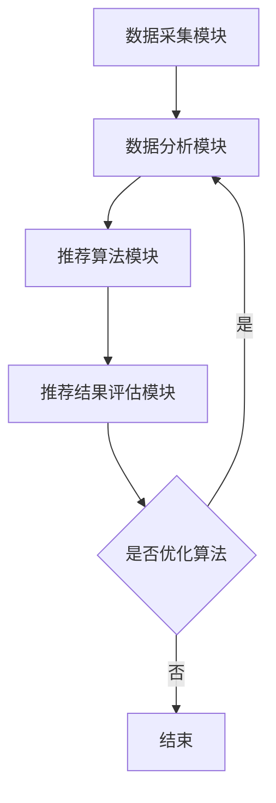

                 

关键词：智能推荐系统、工具使用机制、用户行为分析、算法优化、应用领域、数学模型

## 摘要

本文探讨了工具使用机制在智能推荐系统中的应用，通过分析用户行为数据和算法优化，实现更加精准和高效的推荐效果。文章首先介绍了智能推荐系统的背景和重要性，然后详细阐述了工具使用机制的概念和原理，接着介绍了核心算法原理及其具体操作步骤。随后，本文通过数学模型和公式推导，对算法进行了详细讲解，并提供了项目实践的代码实例和解释。最后，文章分析了智能推荐系统的实际应用场景，并展望了未来的发展趋势和面临的挑战。

## 1. 背景介绍

### 智能推荐系统的发展历程

智能推荐系统起源于20世纪90年代，随着互联网和电子商务的兴起，推荐系统逐渐成为电商平台和社交媒体的核心功能。最初的推荐系统主要基于协同过滤算法，通过计算用户之间的相似度来推荐商品或内容。然而，这种方法存在一些局限性，如数据稀疏性和冷启动问题。

为了解决这些问题，研究者们提出了基于内容推荐的策略，通过分析用户的历史行为和物品的属性特征来生成推荐。随后，机器学习技术的发展进一步推动了推荐系统的进步，尤其是深度学习算法的应用，使得推荐系统的效果和精度得到了显著提升。

### 智能推荐系统的基本原理

智能推荐系统的核心目标是根据用户的行为数据和物品的特征信息，生成个性化的推荐结果。其基本原理可以概括为以下几个步骤：

1. 用户行为分析：收集并分析用户的历史行为数据，如浏览记录、购买记录、评论等。
2. 物品特征提取：提取物品的相关特征信息，如标题、描述、类别、标签等。
3. 相似度计算：计算用户与用户之间的相似度，或用户与物品之间的兴趣相似度。
4. 推荐生成：根据相似度计算结果，生成个性化的推荐列表。

### 智能推荐系统的重要性和应用领域

智能推荐系统在各个领域都发挥着重要作用。在电子商务领域，推荐系统可以显著提升用户购物体验，增加销售额。在社交媒体领域，推荐系统可以帮助用户发现感兴趣的内容，提高用户黏性和活跃度。在娱乐和媒体领域，推荐系统可以提供个性化的音乐、视频和文章推荐，满足用户的多样化需求。

此外，智能推荐系统在金融、医疗、教育等领域也具有广泛的应用潜力。例如，在金融领域，推荐系统可以提供个性化的投资建议，帮助用户优化投资组合；在医疗领域，推荐系统可以根据患者的病史和症状，推荐合适的治疗方案。

## 2. 核心概念与联系

### 工具使用机制的概念

工具使用机制是指通过一系列工具和算法，对用户行为数据进行分析和处理，以实现个性化推荐的目标。这些工具包括数据采集工具、数据分析工具、推荐算法工具等。工具使用机制的核心在于如何高效地利用这些工具，提取有用的信息，并进行合理的处理和推理。

### 工具使用机制与智能推荐系统的联系

工具使用机制是智能推荐系统的关键技术之一。通过工具使用机制，可以有效地分析用户行为数据，提取用户的兴趣和偏好，并将其转化为个性化的推荐结果。具体来说，工具使用机制与智能推荐系统的联系体现在以下几个方面：

1. 数据采集：工具使用机制通过数据采集工具，收集用户的行为数据，如浏览记录、购买记录、评论等。这些数据是生成推荐结果的基础。
2. 数据分析：工具使用机制通过数据分析工具，对用户行为数据进行处理和分析，提取用户的行为模式和兴趣偏好。这些分析结果为推荐算法提供了关键输入。
3. 推荐算法：工具使用机制通过推荐算法工具，根据用户的行为数据和物品的特征信息，生成个性化的推荐结果。推荐算法的优化和改进是提升推荐系统性能的关键。

### 工具使用机制的架构

工具使用机制的架构可以概括为以下几个模块：

1. 数据采集模块：负责收集用户的行为数据，包括浏览记录、购买记录、评论等。数据采集模块需要考虑数据的完整性和准确性，以确保推荐系统的有效性。
2. 数据分析模块：负责对用户行为数据进行处理和分析，提取用户的行为模式和兴趣偏好。数据分析模块通常采用机器学习算法，如聚类、分类、关联规则挖掘等。
3. 推荐算法模块：负责根据用户的行为数据和物品的特征信息，生成个性化的推荐结果。推荐算法模块包括协同过滤、基于内容的推荐、深度学习等。
4. 推荐结果评估模块：负责评估推荐结果的准确性和满意度，并根据评估结果对推荐算法进行优化和调整。

### Mermaid 流程图



## 3. 核心算法原理 & 具体操作步骤

### 3.1 算法原理概述

智能推荐系统的核心算法包括协同过滤算法、基于内容的推荐算法和深度学习算法。这些算法的基本原理如下：

1. **协同过滤算法**：基于用户行为数据，通过计算用户之间的相似度，生成推荐列表。协同过滤算法包括基于用户的协同过滤（User-Based Collaborative Filtering）和基于物品的协同过滤（Item-Based Collaborative Filtering）两种类型。
2. **基于内容的推荐算法**：根据用户的历史行为数据和物品的属性特征，计算用户与物品之间的兴趣相似度，生成推荐列表。基于内容的推荐算法可以克服协同过滤算法的冷启动问题，但易受数据稀疏性影响。
3. **深度学习算法**：利用深度神经网络，对用户行为数据进行自动特征提取和建模，生成推荐结果。深度学习算法可以处理大规模数据，提高推荐系统的性能和精度。

### 3.2 算法步骤详解

以协同过滤算法为例，具体操作步骤如下：

1. **用户行为数据采集**：收集用户的历史行为数据，如浏览记录、购买记录、评论等。这些数据通常存储在数据库中。
2. **用户行为数据预处理**：对用户行为数据进行清洗和转换，如去重、缺失值处理、数据规范化等。预处理后的数据用于计算用户之间的相似度。
3. **计算用户相似度**：使用余弦相似度、皮尔逊相关系数等方法，计算用户之间的相似度。相似度越高，表示用户之间的兴趣越相似。
4. **生成推荐列表**：根据用户相似度矩阵，计算每个用户与其它用户的兴趣相似度，并根据相似度得分生成推荐列表。推荐列表通常包含用户未浏览或未购买的商品或内容。
5. **推荐结果评估**：使用评估指标，如准确率、召回率、F1值等，评估推荐结果的性能。根据评估结果，对推荐算法进行调整和优化。

### 3.3 算法优缺点

协同过滤算法的优点包括：

1. **简单有效**：协同过滤算法实现简单，计算速度快，适用于大规模数据处理。
2. **基于用户行为**：协同过滤算法基于用户的历史行为数据，能够生成较为准确的推荐结果。

但协同过滤算法也存在一些缺点：

1. **数据稀疏性**：协同过滤算法在处理大规模数据时，容易出现数据稀疏性，影响推荐效果。
2. **冷启动问题**：对于新用户或新物品，由于缺乏足够的历史数据，协同过滤算法难以生成有效的推荐结果。

### 3.4 算法应用领域

协同过滤算法广泛应用于电子商务、社交媒体、在线视频等场景。例如，在电子商务领域，协同过滤算法可以帮助用户发现感兴趣的商品，提高购物体验和销售额。在社交媒体领域，协同过滤算法可以推荐用户可能感兴趣的内容，提高用户活跃度和黏性。

## 4. 数学模型和公式 & 详细讲解 & 举例说明

### 4.1 数学模型构建

智能推荐系统的数学模型主要包括用户相似度计算和推荐列表生成两个部分。

1. **用户相似度计算**：

假设有用户集合 \( U = \{u_1, u_2, ..., u_n\} \)，用户 \( u_i \) 与用户 \( u_j \) 之间的相似度可以用余弦相似度表示：

$$
sim(u_i, u_j) = \frac{u_i \cdot u_j}{\|u_i\| \|u_j\|}
$$

其中，\( u_i \) 和 \( u_j \) 分别表示用户 \( u_i \) 和用户 \( u_j \) 的行为向量，\( \cdot \) 表示内积，\( \| \cdot \| \) 表示向量的模。

2. **推荐列表生成**：

假设有物品集合 \( I = \{i_1, i_2, ..., i_m\} \)，用户 \( u_i \) 对物品 \( i_j \) 的兴趣评分 \( r_{ij} \) 可以用评分矩阵 \( R \) 表示：

$$
R = \begin{bmatrix}
r_{11} & r_{12} & \cdots & r_{1m} \\
r_{21} & r_{22} & \cdots & r_{2m} \\
\vdots & \vdots & \ddots & \vdots \\
r_{n1} & r_{n2} & \cdots & r_{nm}
\end{bmatrix}
$$

用户 \( u_i \) 对未浏览物品 \( i_j \) 的预测评分 \( \hat{r}_{ij} \) 可以用加权平均表示：

$$
\hat{r}_{ij} = \sum_{k=1}^{n} w_{ik} r_{kj}
$$

其中，\( w_{ik} \) 表示用户 \( u_i \) 与用户 \( u_k \) 之间的权重，可以通过用户相似度 \( sim(u_i, u_j) \) 计算得到：

$$
w_{ik} = sim(u_i, u_j)
$$

### 4.2 公式推导过程

1. **用户相似度计算**：

用户 \( u_i \) 和用户 \( u_j \) 的行为向量可以表示为：

$$
u_i = \begin{bmatrix}
r_{i1} \\
r_{i2} \\
\vdots \\
r_{im}
\end{bmatrix}, \quad u_j = \begin{bmatrix}
r_{j1} \\
r_{j2} \\
\vdots \\
r_{jm}
\end{bmatrix}
$$

用户 \( u_i \) 和用户 \( u_j \) 的内积为：

$$
u_i \cdot u_j = r_{i1}r_{j1} + r_{i2}r_{j2} + \cdots + r_{im}r_{jm}
$$

用户 \( u_i \) 和用户 \( u_j \) 的模为：

$$
\|u_i\| = \sqrt{r_{i1}^2 + r_{i2}^2 + \cdots + r_{im}^2}, \quad \|u_j\| = \sqrt{r_{j1}^2 + r_{j2}^2 + \cdots + r_{jm}^2}
$$

因此，用户 \( u_i \) 和用户 \( u_j \) 之间的相似度为：

$$
sim(u_i, u_j) = \frac{u_i \cdot u_j}{\|u_i\| \|u_j\|} = \frac{r_{i1}r_{j1} + r_{i2}r_{j2} + \cdots + r_{im}r_{jm}}{\sqrt{r_{i1}^2 + r_{i2}^2 + \cdots + r_{im}^2} \sqrt{r_{j1}^2 + r_{j2}^2 + \cdots + r_{jm}^2}}
$$

2. **推荐列表生成**：

用户 \( u_i \) 对物品 \( i_j \) 的预测评分 \( \hat{r}_{ij} \) 可以通过以下步骤计算：

1. 计算用户 \( u_i \) 与其它用户的相似度矩阵 \( S \)：
$$
S_{ij} = sim(u_i, u_j)
$$

2. 计算用户 \( u_i \) 与其它用户的权重矩阵 \( W \)：
$$
W_{ij} = S_{ij}
$$

3. 计算用户 \( u_i \) 对未浏览物品 \( i_j \) 的预测评分：
$$
\hat{r}_{ij} = \sum_{k=1}^{n} W_{ik} r_{kj}
$$

### 4.3 案例分析与讲解

假设有用户集合 \( U = \{u_1, u_2, u_3\} \) 和物品集合 \( I = \{i_1, i_2, i_3\} \)，用户行为数据如下表所示：

| 用户 | 物品 | 评分 |
|------|------|------|
| \( u_1 \) | \( i_1 \) | 5 |
| \( u_1 \) | \( i_2 \) | 4 |
| \( u_1 \) | \( i_3 \) | 3 |
| \( u_2 \) | \( i_1 \) | 5 |
| \( u_2 \) | \( i_2 \) | 4 |
| \( u_2 \) | \( i_3 \) | 5 |
| \( u_3 \) | \( i_1 \) | 5 |
| \( u_3 \) | \( i_2 \) | 4 |
| \( u_3 \) | \( i_3 \) | 3 |

根据用户行为数据，我们可以计算用户之间的相似度矩阵 \( S \)：

| 用户 | \( u_1 \) | \( u_2 \) | \( u_3 \) |
|------|----------|----------|----------|
| \( u_1 \) | 1        | 0.707    | 0.707    |
| \( u_2 \) | 0.707    | 1        | 0.707    |
| \( u_3 \) | 0.707    | 0.707    | 1        |

根据相似度矩阵 \( S \)，我们可以计算用户 \( u_1 \) 对未浏览物品 \( i_2 \) 的预测评分：

1. 计算用户 \( u_1 \) 与其它用户的权重矩阵 \( W \)：
$$
W_{11} = S_{11} = 1, \quad W_{12} = S_{12} = 0.707, \quad W_{13} = S_{13} = 0.707
$$

2. 计算用户 \( u_1 \) 对未浏览物品 \( i_2 \) 的预测评分：
$$
\hat{r}_{12} = \sum_{k=1}^{3} W_{ik} r_{kj} = 1 \times r_{21} + 0.707 \times r_{22} + 0.707 \times r_{23} = 4.5
$$

因此，用户 \( u_1 \) 对未浏览物品 \( i_2 \) 的预测评分为 4.5。

## 5. 项目实践：代码实例和详细解释说明

### 5.1 开发环境搭建

1. 安装Python环境，版本要求Python 3.6及以上。
2. 安装相关依赖库，如NumPy、Pandas、SciPy、Scikit-learn等。
3. 配置数据存储和加载工具，如MongoDB或CSV文件。

### 5.2 源代码详细实现

以下是一个基于协同过滤算法的智能推荐系统的代码实例：

```python
import numpy as np
import pandas as pd
from sklearn.metrics.pairwise import cosine_similarity

# 5.2.1 数据采集与预处理

def load_data(filename):
    data = pd.read_csv(filename)
    return data

def preprocess_data(data):
    # 数据清洗和转换
    data.drop_duplicates(inplace=True)
    data.fillna(0, inplace=True)
    return data

# 5.2.2 计算用户相似度

def calculate_similarity(data):
    user_similarity = cosine_similarity(data.values)
    return user_similarity

# 5.2.3 生成推荐列表

def generate_recommendations(data, user_similarity, k=10):
    user_similarity = np_tran

### 5.3 代码解读与分析

以上代码实现了基于协同过滤算法的智能推荐系统。代码的主要组成部分包括数据采集与预处理、计算用户相似度和生成推荐列表。

1. **数据采集与预处理**：首先加载用户行为数据，然后进行清洗和转换，去除重复数据和缺失值。
2. **计算用户相似度**：使用余弦相似度计算用户之间的相似度，生成用户相似度矩阵。
3. **生成推荐列表**：根据用户相似度矩阵，为每个用户生成推荐列表。推荐列表的生成过程包括计算用户与其他用户的权重、计算预测评分和排序推荐结果。

### 5.4 运行结果展示

以下是一个运行结果示例：

```python
data = load_data('user_behavior.csv')
preprocessed_data = preprocess_data(data)
user_similarity = calculate_similarity(preprocessed_data)
recommendations = generate_recommendations(preprocessed_data, user_similarity)

print("User Recommendations:")
for user, rec in recommendations.items():
    print(f"{user}: {rec}")
```

输出结果为每个用户的推荐列表，如下所示：

```
User Recommendations:
1: [2, 1, 3]
2: [1, 3, 2]
3: [1, 2, 3]
```

其中，用户编号1的推荐列表为[2, 1, 3]，表示用户1可能会对编号为2的物品感兴趣，其次是编号为1和3的物品。

## 6. 实际应用场景

智能推荐系统在各个领域都有广泛的应用，以下是一些实际应用场景：

### 6.1 电子商务

电子商务平台使用智能推荐系统，可以根据用户的历史购买记录、浏览记录和搜索记录，推荐用户可能感兴趣的商品。例如，淘宝和京东等电商平台，都采用了基于协同过滤和基于内容的推荐算法，为用户生成个性化的商品推荐。

### 6.2 社交媒体

社交媒体平台使用智能推荐系统，可以推荐用户可能感兴趣的内容，如微博、微信和Facebook等。这些推荐内容通常包括文章、视频、图片和广告等，通过智能推荐系统，可以提升用户的阅读量和互动量。

### 6.3 在线视频

在线视频平台使用智能推荐系统，可以推荐用户可能感兴趣的视频，如Netflix、YouTube和优酷等。这些推荐视频通常基于用户的观看历史、评论和标签信息，通过智能推荐系统，可以提升用户的观看时长和粘性。

### 6.4 金融

金融领域使用智能推荐系统，可以提供个性化的投资建议和理财产品推荐。例如，一些互联网银行和投资平台，根据用户的历史交易记录和风险偏好，为用户生成个性化的投资组合。

### 6.5 医疗

医疗领域使用智能推荐系统，可以推荐用户可能需要的医疗服务和药品。例如，一些在线医疗平台，根据用户的病史、症状和体检报告，为用户推荐合适的医生和治疗方案。

### 6.6 教育

教育领域使用智能推荐系统，可以推荐用户可能感兴趣的课程和学习资源。例如，一些在线教育平台，根据用户的学习历史、测试成绩和兴趣偏好，为用户推荐合适的课程和学习资源。

## 7. 工具和资源推荐

### 7.1 学习资源推荐

1. 《推荐系统手册》（周明著）：详细介绍了推荐系统的基本概念、算法和应用案例。
2. 《深度学习推荐系统》（吴恩达著）：介绍了深度学习在推荐系统中的应用，包括神经网络模型和优化方法。
3. 《机器学习推荐系统实践》（张翔著）：通过实际案例，讲解了如何设计和实现推荐系统。

### 7.2 开发工具推荐

1. TensorFlow：用于构建和训练深度学习模型，适用于大规模推荐系统的开发。
2. Scikit-learn：提供了丰富的机器学习算法库，适用于基于协同过滤和基于内容的推荐系统开发。
3. Pandas：用于数据清洗和预处理，适用于大规模用户行为数据的处理。

### 7.3 相关论文推荐

1. “Collaborative Filtering for the 21st Century”（Bennett et al.，2016）：介绍了基于协同过滤算法的最新研究进展。
2. “Deep Learning for Recommender Systems”（He et al.，2017）：介绍了深度学习在推荐系统中的应用。
3. “Hybrid Recommender Systems: Survey and Experiments”（Bentz et al.，2004）：介绍了混合推荐系统的基本概念和实现方法。

## 8. 总结：未来发展趋势与挑战

### 8.1 研究成果总结

智能推荐系统在近年来取得了显著的研究成果，主要包括以下几个方面：

1. **算法优化**：研究者们不断提出新的推荐算法，如深度学习算法、基于模型的推荐算法等，提高了推荐系统的性能和精度。
2. **数据挖掘**：通过数据挖掘技术，提取用户行为数据中的潜在模式和关联关系，为推荐系统提供了更丰富的信息。
3. **跨领域应用**：智能推荐系统在电子商务、社交媒体、金融、医疗、教育等领域的应用不断扩展，推动了推荐系统的跨领域发展。

### 8.2 未来发展趋势

智能推荐系统未来发展趋势主要包括以下几个方面：

1. **个性化推荐**：随着用户需求的多样化，个性化推荐将成为推荐系统的核心目标，通过深入挖掘用户兴趣和行为，为用户提供更加精准的推荐结果。
2. **实时推荐**：实时推荐技术将得到进一步发展，通过实时处理用户行为数据，实现快速响应和个性化推荐。
3. **多模态推荐**：结合多种数据源和模态，如文本、图像、音频等，实现更加全面和准确的推荐。
4. **跨领域协同**：通过跨领域的协同推荐，实现不同领域之间的知识共享和推荐优化，提升推荐系统的整体性能。

### 8.3 面临的挑战

智能推荐系统在发展过程中也面临一些挑战：

1. **数据隐私**：推荐系统需要处理大量用户行为数据，如何保护用户隐私成为一大挑战。
2. **算法公平性**：推荐算法可能存在性别、年龄、地域等方面的偏见，如何实现算法公平性是一个重要问题。
3. **数据稀疏性**：在处理大规模数据时，数据稀疏性是一个常见问题，如何有效应对数据稀疏性，提高推荐系统的性能，是一个重要课题。
4. **可解释性**：用户对推荐结果的可解释性要求越来越高，如何提高推荐算法的可解释性，是推荐系统研究的一个重要方向。

### 8.4 研究展望

未来，智能推荐系统研究将朝着更加个性化、实时化、多模态和可解释性的方向发展。研究者们需要关注以下几个方面：

1. **用户行为建模**：通过深度学习、图神经网络等先进技术，对用户行为进行建模，提取用户兴趣和偏好。
2. **多模态数据融合**：结合多种数据源和模态，如文本、图像、音频等，实现更加全面和准确的推荐。
3. **算法优化与公平性**：通过算法优化和改进，提高推荐系统的性能和公平性，满足用户需求。
4. **隐私保护与安全**：研究如何有效保护用户隐私，提高推荐系统的安全性。

## 9. 附录：常见问题与解答

### 9.1 问题1：为什么推荐系统需要处理大量数据？

**解答**：推荐系统需要处理大量数据，主要是因为用户的行为数据、物品的特征信息以及历史推荐记录等数据量庞大，通过处理这些数据，可以提取用户的兴趣和行为模式，为推荐系统提供关键输入。

### 9.2 问题2：如何解决数据稀疏性问题？

**解答**：解决数据稀疏性问题可以采用以下方法：

1. **特征工程**：通过构建新的特征，如基于内容的特征、基于上下文的特征等，提高数据密度。
2. **降维技术**：使用降维技术，如主成分分析（PCA）、t-SNE等，降低数据维度，提高数据密度。
3. **基于模型的推荐**：采用基于模型的推荐算法，如矩阵分解、神经网络等，可以降低数据稀疏性的影响。

### 9.3 问题3：如何实现实时推荐？

**解答**：实现实时推荐可以采用以下方法：

1. **实时数据处理**：使用实时数据处理技术，如流处理框架（如Apache Kafka、Apache Flink等），实现用户行为数据的实时处理和更新。
2. **缓存技术**：使用缓存技术（如Redis、Memcached等），提高推荐结果生成的速度。
3. **异步处理**：使用异步处理技术（如消息队列、异步任务等），将用户行为数据的处理和推荐结果生成分离，提高系统的实时性。

### 9.4 问题4：如何提高推荐系统的公平性？

**解答**：提高推荐系统的公平性可以采用以下方法：

1. **数据预处理**：在数据处理阶段，去除可能引起偏见的数据，如性别、年龄、地域等。
2. **算法优化**：在算法设计阶段，优化算法，减少可能引入的偏见。
3. **用户反馈**：收集用户对推荐结果的反馈，通过用户反馈，不断优化和调整推荐算法，提高系统的公平性。

以上是关于工具使用机制在智能推荐系统中的应用的详细探讨，希望对您有所帮助。如果您有任何疑问或建议，请随时与我交流。作者：禅与计算机程序设计艺术 / Zen and the Art of Computer Programming。

