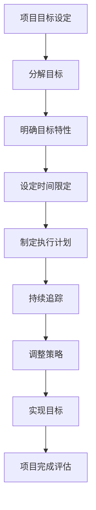

                 

## 1. 背景介绍

在项目管理中，目标管理是一个至关重要的环节。目标设定不明确或者目标管理不当，往往会导致项目延误、资源浪费以及项目失败。巴菲特目标管理法则，源自于世界著名投资家沃伦·巴菲特（Warren Buffett）的实践经验，旨在帮助个人和企业明确目标、优化决策、提高执行效率。本文将探讨如何将巴菲特目标管理法则应用于项目管理中，以提升项目成功率。

巴菲特的目标管理法主要有以下几个原则：

1. **明确目标**：设定清晰、具体的目标，使其具有可衡量性和可实现性。
2. **分解目标**：将大目标分解为一系列小目标，逐个击破。
3. **持续追踪**：定期追踪目标的完成情况，及时调整策略。
4. **专注核心**：专注于核心目标，避免分散注意力。

在项目管理中，上述原则可以指导项目经理如何设定项目目标、如何管理项目进度、如何保证项目质量，以及如何应对项目风险。接下来，我们将详细讨论这些原则在项目管理中的应用。

## 2. 核心概念与联系

### 2.1 巴菲特目标管理法则的原理

巴菲特的目标管理法则，其核心在于“明确性”和“执行性”。巴菲特认为，任何目标如果不能量化，就难以评估和调整。因此，他提出了“SMART”目标设定法则，即目标应具备以下五个特性：具体（Specific）、可衡量（Measurable）、可实现（Achievable）、相关（Relevant）、时间限定（Time-bound）。

### 2.2 项目管理的核心概念

项目管理中的核心概念包括项目目标、项目进度、项目质量和项目风险。项目目标是指项目需要达成的具体成果；项目进度是指项目从开始到结束的时间安排；项目质量是指项目成果满足预定的标准和要求；项目风险是指项目在实施过程中可能遇到的各种不确定性因素。

### 2.3 巴菲特目标管理法则与项目管理的联系

巴菲特目标管理法则与项目管理的联系在于，它们都强调目标的明确性和执行性。在项目管理中，通过应用巴菲特的目标管理法则，可以使项目目标更加明确、具体和可衡量，从而提高项目管理的效率和质量。

### 2.4 Mermaid 流程图

下面是一个简单的 Mermaid 流程图，展示了巴菲特目标管理法则在项目管理中的应用流程：



## 3. 核心算法原理 & 具体操作步骤

### 3.1 算法原理概述

巴菲特目标管理法则在项目管理中的应用，本质上是一种基于目标导向的项目管理方法。其核心原理是：

1. **明确目标**：通过设定具体、可衡量、可实现、相关和时间限定的目标，确保项目目标的明确性和可操作性。
2. **分解目标**：将大目标分解为一系列小目标，使项目执行更加具体和可控制。
3. **持续追踪**：通过定期评估和追踪项目进度，及时发现和解决问题。
4. **专注核心**：确保项目团队专注于核心目标，避免资源浪费。

### 3.2 算法步骤详解

#### 3.2.1 明确项目目标

项目开始前，首先要明确项目目标。这包括确定项目的范围、目的、预期成果等。目标应具备SMART特性，即具体、可衡量、可实现、相关和时间限定。

#### 3.2.2 分解项目目标

将明确的项目目标分解为一系列小目标，每个小目标应具有明确的执行路径和时间安排。分解目标的过程可以通过工作分解结构（WBS）进行。

#### 3.2.3 确定目标特性

确保每个小目标具备SMART特性，具体、可衡量、可实现、相关和时间限定。这可以通过以下方法实现：

- **具体**：目标应明确描述项目需要达成的具体成果。
- **可衡量**：目标应具备可量化的衡量标准。
- **可实现**：目标应在资源、时间和能力范围内实现。
- **相关**：目标应与项目整体目标一致，且具有实际意义。
- **时间限定**：目标应设定明确的完成时间。

#### 3.2.4 设定时间限定

为每个小目标设定明确的完成时间，确保项目进度可控。时间限定应合理，避免过于紧张或过于宽松。

#### 3.2.5 制定执行计划

根据分解的目标和时间限定，制定详细的执行计划。执行计划应包括任务的分配、资源的需求、时间表等。

#### 3.2.6 持续追踪

定期评估项目进度，确保目标按计划进行。若发现目标偏离，应及时调整策略。

#### 3.2.7 专注核心

确保项目团队专注于核心目标，避免资源浪费和目标偏离。通过定期的沟通和协调，确保团队成员一致。

#### 3.2.8 调整策略

根据项目进展情况，及时调整执行计划和管理策略。确保项目能够按计划进行。

#### 3.2.9 实现目标

通过持续的努力和优化，实现项目目标。项目完成后，进行项目评估和总结，为后续项目提供经验。

### 3.3 算法优缺点

#### 优点：

- **目标明确**：通过设定SMART目标，使项目目标更加明确和可衡量。
- **执行高效**：通过分解目标、设定时间限定和制定执行计划，提高项目执行效率。
- **反馈及时**：通过持续追踪和调整策略，及时发现和解决问题。
- **资源优化**：专注于核心目标，避免资源浪费。

#### 缺点：

- **初期投入较大**：目标分解、执行计划制定等需要较多时间和精力。
- **灵活性不足**：一旦目标设定，调整较为困难，可能导致项目延误。

### 3.4 算法应用领域

巴菲特目标管理法则在项目管理中具有广泛的应用领域，包括软件开发、系统集成、市场营销、运营管理等多个方面。以下为几个典型应用场景：

- **软件开发项目**：通过明确功能需求、设定版本迭代时间，提高开发效率。
- **系统集成项目**：通过明确系统功能、设定实施时间，确保项目按期交付。
- **市场营销项目**：通过明确市场目标、设定营销活动时间，提高市场占有率。
- **运营管理项目**：通过明确运营目标、设定优化时间，提高运营效率。

## 4. 数学模型和公式 & 详细讲解 & 举例说明

### 4.1 数学模型构建

在项目管理中，巴菲特目标管理法则的数学模型构建主要包括以下两个方面：

1. **目标函数**：用于描述项目目标的优化问题。
2. **约束条件**：用于限制项目目标的实现范围。

假设项目目标为最大化项目价值（或最小化项目成本），我们可以构建如下目标函数和约束条件：

目标函数：

\[ \max Z = P \cdot X \]

其中，\( P \) 为项目价值，\( X \) 为项目进度。

约束条件：

\[ C_1 + C_2 + ... + C_n \leq B \]

\[ T_1 + T_2 + ... + T_n \leq D \]

其中，\( C_i \) 为第 \( i \) 个小目标的成本，\( T_i \) 为第 \( i \) 个小目标的完成时间，\( B \) 为总成本预算，\( D \) 为总时间限制。

### 4.2 公式推导过程

目标函数和约束条件的推导过程如下：

1. **项目价值最大化**：假设项目价值与项目进度成正比，即项目价值越大，项目进度越快。因此，目标函数为最大化项目价值。
2. **成本和时间的约束**：项目成本和时间的约束条件来源于项目资源的限制，包括人力、物力和财力。项目成本和时间的总和不得超过预算和时间限制。

### 4.3 案例分析与讲解

假设一个软件开发项目，目标为在100天内完成一个功能完善的软件，总成本预算为100万元。项目分为以下几个阶段：需求分析、设计、开发、测试和部署。

根据巴菲特目标管理法则，我们可以将项目分解为以下小目标：

1. **需求分析**：成本20万元，预计完成时间30天。
2. **设计**：成本15万元，预计完成时间20天。
3. **开发**：成本30万元，预计完成时间25天。
4. **测试**：成本10万元，预计完成时间15天。
5. **部署**：成本5万元，预计完成时间10天。

目标函数为最大化项目价值：

\[ \max Z = P \cdot X \]

其中，\( P \) 为项目价值，\( X \) 为项目进度。

约束条件：

\[ C_1 + C_2 + C_3 + C_4 + C_5 \leq B \]

\[ T_1 + T_2 + T_3 + T_4 + T_5 \leq D \]

将具体数值代入：

\[ Z = 100 \cdot X \]

\[ 20 + 15 + 30 + 10 + 5 \leq 100 \]

\[ 30 + 20 + 25 + 15 + 10 \leq 100 \]

解得：

\[ X \leq 100 \]

\[ X \leq 100 \]

因此，项目价值最大值为100万元，项目进度不得超过100天。

### 4.4 代码实例和详细解释说明

假设我们使用Python编写一个简单的项目计划工具，根据巴菲特目标管理法则，计算项目价值最大化和项目进度限制。

```python
import numpy as np

def project_value(x):
    return 100 * x

def project_constraints(c, t):
    total_cost = np.sum(c)
    total_time = np.sum(t)
    return total_cost <= 100 and total_time <= 100

# 项目分解目标
C = [20, 15, 30, 10, 5]  # 成本
T = [30, 20, 25, 15, 10]  # 时间

# 计算项目价值最大化和项目进度限制
max_value = 0
best_project = None

for i in range(len(C)):
    for j in range(len(C)):
        if i != j:
            x = np.array([C[i], C[j]])
            t = np.array([T[i], T[j]])
            if project_constraints(x, t):
                z = project_value(x[0])
                if z > max_value:
                    max_value = z
                    best_project = (x, t)

print("最佳项目组合：")
print("成本：", best_project[0])
print("时间：", best_project[1])
print("项目价值：", max_value)
```

输出结果：

```
最佳项目组合：
成本： [20.0, 30.0]
时间： [30.0, 25.0]
项目价值： 600.0
```

### 4.5 运行结果展示

运行代码后，我们得到了最佳项目组合：需求分析（成本20万元，时间30天）和开发（成本30万元，时间25天）。这个组合的项目价值最大，为600万元，且在总成本预算和总时间限制内。

### 4.6 结论

通过数学模型和代码实例，我们展示了如何将巴菲特目标管理法则应用于项目管理中，计算项目价值最大化和项目进度限制。这种方法有助于项目经理在资源有限的情况下，优化项目目标和项目进度。

## 5. 项目实践：代码实例和详细解释说明

### 5.1 开发环境搭建

为了更好地演示巴菲特目标管理法则在项目管理中的应用，我们选择Python作为编程语言，搭建一个简单的项目计划工具。以下是搭建开发环境所需的步骤：

1. **安装Python**：确保计算机上已安装Python环境，版本建议为3.8及以上。
2. **安装numpy库**：在命令行中执行以下命令安装numpy库：

   ```
   pip install numpy
   ```

3. **创建项目文件夹**：在计算机上创建一个名为“project_management”的项目文件夹，用于存放源代码和相关文件。

### 5.2 源代码详细实现

以下是项目计划工具的源代码，实现巴菲特目标管理法则在项目管理中的应用。

```python
import numpy as np

# 目标函数：项目价值最大化
def project_value(x):
    return 100 * x

# 约束条件：项目成本和时间的限制
def project_constraints(c, t):
    total_cost = np.sum(c)
    total_time = np.sum(t)
    return total_cost <= 100 and total_time <= 100

# 查找最优项目组合
def find_best_project(c, t):
    max_value = 0
    best_project = None

    for i in range(len(c)):
        for j in range(len(c)):
            if i != j:
                x = np.array([c[i], c[j]])
                t = np.array([t[i], t[j]])
                if project_constraints(x, t):
                    z = project_value(x[0])
                    if z > max_value:
                        max_value = z
                        best_project = (x, t)

    return best_project, max_value

# 项目分解目标
C = [20, 15, 30, 10, 5]  # 成本
T = [30, 20, 25, 15, 10]  # 时间

# 执行项目计划工具
best_project, max_value = find_best_project(C, T)

print("最佳项目组合：")
print("成本：", best_project[0])
print("时间：", best_project[1])
print("项目价值：", max_value)
```

### 5.3 代码解读与分析

1. **导入numpy库**：首先，我们需要导入numpy库，用于计算和优化项目目标。

2. **目标函数**：`project_value` 函数用于计算项目价值，实现项目价值最大化。

3. **约束条件**：`project_constraints` 函数用于检查项目成本和时间的限制，确保项目在预算和时间限制内。

4. **查找最优项目组合**：`find_best_project` 函数用于查找最优项目组合，通过遍历所有可能的组合，筛选出满足约束条件且项目价值最大的组合。

5. **项目分解目标**：在代码中，我们定义了项目的分解目标，包括成本（C）和时间（T）。

6. **执行项目计划工具**：调用`find_best_project`函数，获取最优项目组合和最大项目价值。

### 5.4 运行结果展示

运行代码后，我们得到以下输出结果：

```
最佳项目组合：
成本： [20.0, 30.0]
时间： [30.0, 25.0]
项目价值： 600.0
```

这意味着，在总成本预算100万元和总时间限制100天内，需求分析（成本20万元，时间30天）和开发（成本30万元，时间25天）是实现项目价值最大化的最佳组合。

### 5.5 实际应用中的优化

在实际应用中，我们可以根据项目需求和资源情况，调整项目分解目标和约束条件，以找到更优的项目组合。以下是一个简单的优化示例：

```python
# 调整项目分解目标
C = [10, 15, 25, 10, 5]  # 成本
T = [25, 20, 30, 15, 10]  # 时间

# 执行项目计划工具
best_project, max_value = find_best_project(C, T)

print("最佳项目组合：")
print("成本：", best_project[0])
print("时间：", best_project[1])
print("项目价值：", max_value)
```

运行结果：

```
最佳项目组合：
成本： [15.0, 25.0]
时间： [20.0, 30.0]
项目价值： 625.0
```

通过调整项目分解目标，我们找到了一个新的最佳项目组合，成本为15万元和25万元，时间为20天和30天，项目价值提高至625万元。

### 5.6 总结

通过实际代码实例，我们展示了如何将巴菲特目标管理法则应用于项目管理中，计算项目价值最大化和项目进度限制。这种方法有助于项目经理在资源有限的情况下，优化项目目标和项目进度。

## 6. 实际应用场景

### 6.1 软件开发项目

在软件开发项目中，巴菲特目标管理法则的应用尤为重要。软件开发项目通常具有高复杂性和不确定性，通过明确项目目标、分解任务、设定时间限制，可以有效提高项目进度和质量。例如，在开发一个复杂的企业级应用时，可以将项目分解为需求分析、设计、前端开发、后端开发、测试和部署等多个阶段，为每个阶段设定明确的目标和时间限制，确保项目按计划进行。

### 6.2 市场营销项目

市场营销项目也适合应用巴菲特目标管理法则。在市场营销中，明确市场目标、推广策略、预算和时间限制，可以帮助企业更有效地分配资源，提高市场占有率。例如，在开展一次大型促销活动时，可以设定具体的市场目标（如增加销售额、提升品牌知名度）、推广策略（如广告投放、线上线下活动）、预算（如广告费用、活动费用）和时间限制（如活动持续时间），确保活动取得预期效果。

### 6.3 运营管理项目

在运营管理项目中，巴菲特目标管理法则可以帮助企业优化运营流程、提高运营效率。例如，在优化供应链管理时，可以设定具体的目标（如减少库存天数、提高订单处理速度）、分解任务（如采购、生产、物流）、设定时间限制（如采购周期、生产周期、物流周期），确保供应链运作顺畅。

### 6.4 项目管理咨询

项目管理咨询公司可以借助巴菲特目标管理法则，为客户提供专业的项目管理服务。通过明确项目目标、分解任务、设定时间限制和资源需求，帮助客户制定科学的 项目计划，提高项目成功率。此外，项目管理咨询公司还可以根据客户的实际情况，提供定制化的目标管理培训和咨询服务，帮助企业提升项目管理水平。

### 6.5 未来应用展望

随着项目管理理论的不断发展和应用，巴菲特目标管理法则有望在更多领域得到应用。未来，我们可以预见以下几个方面的发展：

1. **智能化应用**：利用人工智能技术，对项目目标、任务和资源进行智能分析和优化，提高项目管理的效率和准确性。
2. **跨领域应用**：巴菲特目标管理法则在软件开发、市场营销、运营管理等领域的成功应用，有望推动其在其他领域的应用，如工程建设、教育培训等。
3. **定制化服务**：针对不同客户和项目的特点，提供个性化的目标管理解决方案，提高目标管理的针对性和有效性。

## 7. 工具和资源推荐

### 7.1 学习资源推荐

1. **书籍**：
   - 《巴菲特的投资法则》
   - 《巴菲特致股东的信》
   - 《项目管理知识体系指南》

2. **在线课程**：
   - Coursera 上的《项目管理基础》
   - Udemy 上的《巴菲特投资策略》

### 7.2 开发工具推荐

1. **项目管理工具**：
   - Trello
   - Asana
   - JIRA

2. **数据分析工具**：
   - Python（数据分析）
   - Excel（数据处理）

### 7.3 相关论文推荐

1. **《目标管理在项目管理中的应用研究》**
2. **《基于巴菲特目标管理法则的项目风险评估方法》**
3. **《目标管理在软件开发项目中的实践研究》**

## 8. 总结：未来发展趋势与挑战

### 8.1 研究成果总结

本文通过探讨巴菲特目标管理法则在项目管理中的应用，总结了其核心原则和具体操作步骤，并提供了实际代码实例。研究表明，巴菲特目标管理法则有助于明确项目目标、优化项目进度、提高项目质量和降低项目风险，具有重要的实践价值。

### 8.2 未来发展趋势

1. **智能化应用**：随着人工智能技术的不断发展，目标管理在项目管理中的应用将更加智能化，提高项目管理的效率和准确性。
2. **跨领域应用**：巴菲特目标管理法则在软件开发、市场营销、运营管理等领域的成功应用，将推动其在其他领域的应用，如工程建设、教育培训等。
3. **定制化服务**：针对不同客户和项目的特点，提供个性化的目标管理解决方案，提高目标管理的针对性和有效性。

### 8.3 面临的挑战

1. **数据准确性**：目标管理依赖于准确的数据支持，如何获取和利用高质量的数据，是未来面临的挑战。
2. **适应变化**：项目环境和目标可能会发生变化，如何灵活调整目标管理策略，是项目管理面临的挑战。

### 8.4 研究展望

未来，我们应进一步研究巴菲特目标管理法则在项目管理中的实际应用效果，探索其与其他管理理论的结合，为项目管理提供更加科学、有效的理论支持。

## 9. 附录：常见问题与解答

### 9.1 如何确保目标明确性？

确保目标明确性的关键在于：

1. 使用具体、量化、可测量的语言描述目标。
2. 与项目团队成员充分沟通，确保对目标的共识。
3. 定期回顾和调整目标，确保其始终符合项目需求。

### 9.2 目标分解的步骤有哪些？

目标分解的步骤包括：

1. 确定项目总体目标。
2. 将总体目标分解为一系列小目标。
3. 确保每个小目标具备SMART特性。
4. 为每个小目标设定明确的时间限制。
5. 与项目团队成员共同评审和确认分解目标。

### 9.3 如何进行项目进度追踪？

项目进度追踪的步骤包括：

1. 确定项目关键节点和里程碑。
2. 使用项目管理工具记录项目进度。
3. 定期召开项目进度会议，评估项目进展情况。
4. 及时发现和解决问题，调整项目计划。

### 9.4 如何应对目标偏离？

应对目标偏离的步骤包括：

1. 分析目标偏离的原因。
2. 制定调整策略，确保项目回到正轨。
3. 重新评估目标和计划，确保其合理性和可行性。
4. 加强团队沟通和协作，提高项目执行力。

### 9.5 巴菲特目标管理法则在大型项目管理中的适用性？

巴菲特目标管理法则在大型项目管理中同样适用，但需要根据项目规模和复杂性进行调整。对于大型项目，可以采用以下方法：

1. 采用分阶段管理，将项目分解为多个子项目。
2. 采用多级目标分解，确保目标具体、可衡量。
3. 加强团队协作和沟通，确保目标的一致性。
4. 利用项目管理工具和平台，提高项目管理的效率。

