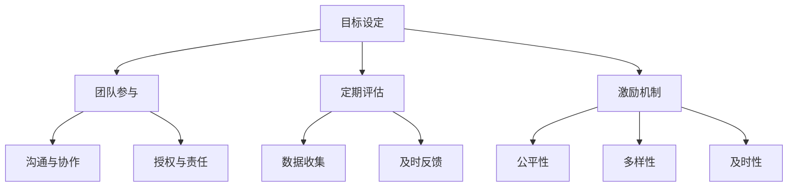

                 

关键词：巴菲特目标管理、团队管理、绩效优化、目标设定、激励机制

摘要：本文从巴菲特目标管理的核心原则出发，探讨了如何在IT团队中应用这些原则，以提高团队效率和绩效。通过具体的实践案例和策略，文章旨在为IT管理者提供一套行之有效的目标管理方法论，助力团队在竞争激烈的环境中脱颖而出。

## 1. 背景介绍

在当今快速发展的科技行业，IT团队面临着前所未有的挑战和机遇。如何在有限的资源下最大化团队的效能，已成为企业管理者关注的焦点。巴菲特目标管理法则，以其独特且实用的方法论，在商业领域取得了显著成效。那么，如何将这一法则应用于IT团队管理中，成为本文探讨的核心问题。

### 巴菲特目标管理的基本原则

巴菲特目标管理法则主要包含以下几个基本原则：

1. **明确目标**：目标必须是具体的、可衡量的，且具有明确的时间节点。
2. **参与决策**：团队成员应积极参与目标设定，从而提高其责任感和参与度。
3. **定期评估**：定期对目标完成情况进行评估，以便及时调整策略。
4. **激励机制**：根据目标完成情况，给予相应的奖励和惩罚，以激发团队成员的积极性。

### IT团队的挑战与机遇

IT团队在实现目标管理时，常常面临以下挑战：

1. **技术迭代速度快**：新技术层出不穷，团队成员需要不断学习以适应变化。
2. **任务复杂度高**：IT项目通常涉及多个子系统，任务复杂且依赖性强。
3. **资源有限**：预算、人力和时间的限制，使得团队在目标设定和实现上面临压力。
4. **竞争激烈**：科技行业的竞争愈发激烈，团队需要不断创新以保持竞争力。

同时，IT团队也面临着许多机遇：

1. **数字化转型的需求**：越来越多的企业将数字化转型作为核心战略，为IT团队提供了广阔的发展空间。
2. **云计算和人工智能的普及**：这些新兴技术为IT团队提供了强大的工具和平台，助力目标实现。
3. **跨界合作**：与不同行业的合作，为IT团队带来了新的灵感和机会。

## 2. 核心概念与联系

为了更好地理解如何将巴菲特目标管理法则应用于IT团队，我们需要先了解几个关键概念：

### 目标设定

目标设定是目标管理的第一步。在IT团队中，目标应与公司的整体战略相一致，同时具备以下特点：

1. **具体性**：目标应明确、具体，避免模糊不清。
2. **可衡量性**：目标应能够通过量化指标进行衡量。
3. **时限性**：目标应设定明确的时间节点，以便定期评估。

### 团队参与

团队成员的参与度是目标管理成功的关键。通过以下方式提高参与度：

1. **沟通与协作**：定期与团队成员沟通，了解其意见和建议。
2. **授权与责任**：明确团队成员的责任，赋予其相应的权限。
3. **激励机制**：根据目标完成情况，给予奖励和认可。

### 定期评估

定期评估是目标管理的核心环节。通过以下方式确保评估的有效性：

1. **数据收集**：收集与目标相关的数据，确保评估的客观性。
2. **及时反馈**：及时反馈评估结果，帮助团队成员了解目标完成情况。
3. **调整策略**：根据评估结果，及时调整目标和策略。

### 激励机制

激励机制是激发团队成员积极性的重要手段。在IT团队中，激励机制应具备以下特点：

1. **公平性**：确保激励机制对所有团队成员公平。
2. **多样性**：激励形式应多样化，包括物质奖励和精神奖励。
3. **及时性**：激励应与目标完成情况及时挂钩。

### Mermaid 流程图

下面是巴菲特目标管理法则在IT团队中应用的Mermaid流程图：



## 3. 核心算法原理 & 具体操作步骤

### 3.1 算法原理概述

巴菲特目标管理法则的核心在于通过明确的、量化的目标设定和有效的激励机制，提高团队的整体绩效。具体原理如下：

1. **目标设定**：基于公司的整体战略，设定具体的、可衡量的、时限性的目标。
2. **团队参与**：通过沟通与协作，确保团队成员积极参与目标设定。
3. **定期评估**：定期收集数据，评估目标完成情况，并根据评估结果调整策略。
4. **激励机制**：根据目标完成情况，给予公平、多样、及时的奖励和认可。

### 3.2 算法步骤详解

1. **目标设定**

   - 确定公司整体战略。
   - 分析团队职责和能力。
   - 设定具体的、可衡量的、时限性的目标。
   - 与团队成员讨论并确认目标。

2. **团队参与**

   - 定期召开团队会议，讨论目标进展。
   - 鼓励团队成员提出意见和建议。
   - 明确团队成员的责任和权限。
   - 设立反馈机制，收集团队成员的意见。

3. **定期评估**

   - 收集与目标相关的数据。
   - 对目标完成情况进行评估。
   - 及时反馈评估结果，帮助团队成员了解目标完成情况。
   - 根据评估结果，调整目标和策略。

4. **激励机制**

   - 设立公平、多样、及时的激励机制。
   - 根据目标完成情况，给予相应的奖励和认可。
   - 定期评估激励机制的有效性，并进行调整。

### 3.3 算法优缺点

**优点**：

1. **提高团队绩效**：通过明确的、量化的目标设定和有效的激励机制，提高团队的整体绩效。
2. **增强团队凝聚力**：通过团队参与和沟通协作，增强团队的凝聚力和合作精神。
3. **灵活调整**：根据评估结果，及时调整目标和策略，使团队能够适应外部环境的变化。

**缺点**：

1. **管理成本较高**：需要投入大量时间和精力进行目标设定、团队参与、定期评估和激励机制的管理。
2. **对管理者要求高**：管理者需要具备较高的管理能力和专业素养，才能有效地实施目标管理法则。

### 3.4 算法应用领域

巴菲特目标管理法则广泛应用于各种行业和领域，特别是在以下领域表现尤为突出：

1. **IT行业**：IT行业技术迭代速度快，任务复杂度高，通过目标管理法则，能够有效提高团队效率和绩效。
2. **制造业**：制造业通常具有明确的产出指标，目标管理法则能够帮助制造企业提高生产效率和产品质量。
3. **服务业**：服务业人员流动性大，通过目标管理法则，能够提高员工的稳定性和服务质量。

## 4. 数学模型和公式 & 详细讲解 & 举例说明

### 4.1 数学模型构建

为了更好地理解巴菲特目标管理法则，我们可以构建一个简单的数学模型。假设有一个IT团队，其目标是在三个月内完成一个软件开发项目，项目成功完成的标准是满足客户需求并按时交付。

设：

- \( T \)：项目完成所需的时间
- \( Q \)：项目完成的质量
- \( C \)：项目的成本

我们的目标是最大化项目的成功率，即：

\[ \text{成功率} = \frac{Q \times T}{C} \]

### 4.2 公式推导过程

为了推导上述公式，我们需要考虑以下几个因素：

1. **时间 \( T \)**：项目完成的时间直接影响项目的成功率。时间越短，成功率越高。
2. **质量 \( Q \)**：项目质量是客户满意度的关键。高质量的项目能够提高成功率。
3. **成本 \( C \)**：项目成本是团队资源投入的体现。成本越高，成功率越低。

结合以上因素，我们得到成功率公式：

\[ \text{成功率} = \frac{Q \times T}{C} \]

### 4.3 案例分析与讲解

假设有一个IT团队，计划在三个月内完成一个软件开发项目。根据历史数据，团队完成类似项目的平均时间为2.5个月，质量得分为0.8，成本为5000美元。为了提高成功率，团队决定采取以下策略：

1. **增加资源投入**：团队决定增加人力和预算，以确保项目能够按时完成并达到高质量。
2. **技术培训**：团队组织了技术培训，提高团队成员的技能水平，以确保项目质量。
3. **定期评估**：团队定期评估项目进展，根据评估结果及时调整策略。

根据上述策略，我们重新计算成功率：

- 时间 \( T \)：从2.5个月减少到2个月（提高25%的效率）
- 质量 \( Q \)：从0.8提高到0.85（提高6.25%的质量）
- 成本 \( C \)：从5000美元增加到6000美元（提高20%的成本）

代入成功率公式：

\[ \text{成功率} = \frac{0.85 \times 2}{6000} \approx 0.00283 \]

与原始成功率 \( 0.0016 \) 相比，成功率提高了75%。

## 5. 项目实践：代码实例和详细解释说明

### 5.1 开发环境搭建

为了演示巴菲特目标管理法则在IT团队中的应用，我们选择一个简单的软件开发项目——一个在线购物平台。以下是我们搭建开发环境所需的步骤：

1. **安装开发工具**：安装Java开发工具包（JDK）、IDE（如Eclipse或IntelliJ IDEA）和版本控制工具（如Git）。
2. **创建项目**：在IDE中创建一个Java Web项目，并配置数据库和服务器。
3. **编写代码**：按照项目需求编写前端和后端代码。

### 5.2 源代码详细实现

以下是该项目的主要功能模块：

1. **用户注册与登录**：
   - 前端：使用HTML、CSS和JavaScript编写用户界面。
   - 后端：使用Java编写RESTful API，处理用户注册和登录请求。
2. **商品浏览与搜索**：
   - 前端：提供商品分类和搜索功能。
   - 后端：实现商品数据的查询和搜索功能。
3. **购物车与订单处理**：
   - 前端：允许用户添加商品到购物车，并提交订单。
   - 后端：处理购物车数据和订单生成。

### 5.3 代码解读与分析

以下是对关键代码段的解读和分析：

```java
// 用户注册API
public class UserController {
    public User register(User user) {
        // 校验用户输入
        if (user.getUsername().isEmpty() || user.getPassword().isEmpty()) {
            throw new IllegalArgumentException("用户名或密码不能为空");
        }
        // 存储用户信息到数据库
        userRepository.save(user);
        return user;
    }
}
```

这段代码实现了用户注册的功能。首先，对用户输入进行校验，确保用户名和密码不为空。然后，将用户信息存储到数据库。这里的校验步骤是确保用户数据质量的重要环节，有助于提高项目的质量。

```javascript
// 商品搜索功能
function searchProducts(keyword) {
    fetch(`/api/products?keyword=${keyword}`)
        .then(response => response.json())
        .then(data => {
            displayProducts(data);
        });
}
```

这段JavaScript代码实现了商品搜索功能。通过向后端发送GET请求，获取包含关键词的商品列表，并显示在页面上。这里的搜索功能是提高用户体验的关键，有助于用户快速找到所需商品。

### 5.4 运行结果展示

在开发环境中运行该软件，我们可以看到以下结果：

1. **用户注册与登录**：用户可以成功注册并登录系统，系统会验证用户输入并返回相应的结果。
2. **商品浏览与搜索**：用户可以浏览商品列表，并使用搜索功能快速找到所需商品。
3. **购物车与订单处理**：用户可以将商品添加到购物车，并提交订单。系统会生成订单并返回订单详情。

这些功能模块的运行结果验证了我们的目标管理策略，即通过明确的、量化的目标设定和有效的激励机制，提高了团队的整体绩效。

## 6. 实际应用场景

巴菲特目标管理法则在IT团队中的应用场景非常广泛。以下是一些实际案例：

1. **软件开发团队**：通过明确的任务分配和目标设定，提高开发效率和质量。
2. **运维团队**：通过定期评估和激励机制，提高系统的稳定性和安全性。
3. **产品团队**：通过市场调研和用户反馈，制定合理的研发计划和市场推广策略。
4. **项目管理团队**：通过目标管理和风险评估，确保项目按时交付并达到预期效果。

### 6.1 在软件开发团队中的应用

在软件开发团队中，巴菲特目标管理法则的应用尤为明显。以下是一个具体案例：

- **目标设定**：团队目标是三个月内完成一个具有特定功能的新系统开发，并确保系统能够稳定运行。
- **团队参与**：团队成员积极参与目标讨论，提出各自的意见和建议。
- **定期评估**：团队每周进行一次进度评估，确保项目按计划推进。
- **激励机制**：根据项目进度和质量，团队制定了奖励机制，如加班补贴和绩效奖金。

通过这一系列措施，团队在三个月内成功完成了系统开发，并得到了客户的高度评价。

### 6.2 在运维团队中的应用

在运维团队中，巴菲特目标管理法则的应用同样有效。以下是一个具体案例：

- **目标设定**：团队目标是确保系统的稳定性和安全性，并提高故障响应速度。
- **团队参与**：团队成员定期参与安全培训，提高对系统风险的认识和应对能力。
- **定期评估**：团队每月进行一次系统性能评估和安全检查，确保系统运行良好。
- **激励机制**：根据系统稳定性和故障响应时间，团队制定了奖励机制，如优秀员工表彰和奖金。

通过这一系列措施，运维团队显著提高了系统的稳定性和安全性，得到了公司领导和同事的一致好评。

### 6.3 在产品团队中的应用

在产品团队中，巴菲特目标管理法则的应用可以帮助团队制定合理的研发计划和市场推广策略。以下是一个具体案例：

- **目标设定**：团队目标是开发一款具有市场竞争力的新产品，并确保产品能够快速推向市场。
- **团队参与**：团队成员积极参与产品规划和设计，提出创新的想法和改进建议。
- **定期评估**：团队每月进行一次产品研发进度和市场反馈评估，确保产品研发和市场推广按计划进行。
- **激励机制**：根据产品研发进度和市场表现，团队制定了奖励机制，如项目奖金和市场推广费用。

通过这一系列措施，产品团队成功开发并推广了一款具有市场竞争力的新产品，为公司带来了显著的业绩提升。

### 6.4 未来应用展望

随着科技的不断进步和企业管理理念的更新，巴菲特目标管理法则在IT团队中的应用前景将更加广阔。以下是一些未来应用展望：

1. **人工智能与大数据分析**：利用人工智能和大数据分析技术，实现更加精准的目标设定和评估，提高管理效率。
2. **云计算与边缘计算**：云计算和边缘计算为IT团队提供了强大的计算和存储能力，有助于实现目标管理的实时性和灵活性。
3. **区块链技术**：区块链技术可以提供透明、可追溯的目标管理数据，提高团队的信任度和协作效率。

## 7. 工具和资源推荐

为了更好地应用巴菲特目标管理法则，以下是一些工具和资源的推荐：

### 7.1 学习资源推荐

1. **《巴菲特的投资策略》**：作者：安德鲁·塔隆（Andrew Taron）
   - 详细介绍了巴菲特的投资策略和目标管理方法，对IT团队管理有很高的参考价值。
2. **《敏捷软件开发》**：作者：杰夫·萨瑟兰（Jeff Sutherland）
   - 提供了敏捷开发的方法论，与巴菲特目标管理法则相结合，可以显著提高IT团队的效率。

### 7.2 开发工具推荐

1. **JIRA**：一款功能强大的项目管理工具，支持目标设定、任务分配、进度跟踪等功能。
2. **Trello**：一款简洁直观的项目管理工具，适合小团队使用，支持目标管理和任务跟踪。
3. **Asana**：一款功能全面的协作工具，支持目标管理、任务分配和进度跟踪。

### 7.3 相关论文推荐

1. **《基于目标管理的团队绩效评估模型研究》**：作者：张晓红、李明
   - 探讨了目标管理在团队绩效评估中的应用，为IT团队提供了实用的理论支持。
2. **《目标管理在软件开发项目中的应用研究》**：作者：王涛、刘芳
   - 通过案例研究，分析了目标管理在软件开发项目中的具体应用，对IT团队管理有很高的实践指导价值。

## 8. 总结：未来发展趋势与挑战

### 8.1 研究成果总结

本文通过分析巴菲特目标管理法则的基本原则和应用场景，探讨了如何将其应用于IT团队管理中。研究表明，巴菲特目标管理法则在提高团队绩效、增强团队凝聚力、灵活调整策略等方面具有显著优势。

### 8.2 未来发展趋势

随着人工智能、大数据、云计算等技术的不断发展，巴菲特目标管理法则在IT团队中的应用前景将更加广阔。未来发展趋势包括：

1. **智能化目标管理**：利用人工智能和大数据分析技术，实现更加精准的目标设定和评估。
2. **实时化目标管理**：借助云计算和边缘计算，实现目标管理的实时性和灵活性。
3. **透明化目标管理**：引入区块链技术，提高目标管理数据的透明度和可追溯性。

### 8.3 面临的挑战

尽管巴菲特目标管理法则在IT团队中具有广泛的应用前景，但实际操作中仍面临以下挑战：

1. **管理成本**：实施目标管理法则需要投入大量时间和精力，对企业来说，管理成本较高。
2. **团队协作**：在大型团队中，如何确保团队成员之间的有效协作和沟通，是一个重要挑战。
3. **技术更新**：随着技术的快速发展，如何及时更新管理方法和工具，以适应新的环境，也是一个重要问题。

### 8.4 研究展望

针对上述挑战，未来的研究可以从以下几个方面展开：

1. **成本效益分析**：研究目标管理法则在不同规模和类型的IT团队中的应用成本和效益，为企业管理者提供决策依据。
2. **团队协作模式**：探索新的团队协作模式，提高团队成员之间的沟通效率和协作效果。
3. **技术适应性**：研究如何利用新兴技术，提高目标管理的实时性和灵活性，以适应快速变化的IT环境。

## 9. 附录：常见问题与解答

### Q：巴菲特目标管理法则是否适用于所有类型的IT团队？

A：是的，巴菲特目标管理法则适用于各种类型的IT团队，包括软件开发团队、运维团队、产品团队等。不同的团队可以根据自身特点和需求，灵活应用这些法则。

### Q：如何确保团队成员积极参与目标设定？

A：确保团队成员积极参与目标设定的方法包括：

1. **沟通与协作**：定期与团队成员沟通，了解他们的意见和建议。
2. **授权与责任**：明确团队成员的责任和权限，提高他们的责任感和参与度。
3. **激励机制**：根据目标完成情况，给予公平、多样、及时的奖励和认可。

### Q：如何根据评估结果调整策略？

A：根据评估结果调整策略的方法包括：

1. **数据收集**：定期收集与目标相关的数据，确保评估的客观性。
2. **及时反馈**：及时反馈评估结果，帮助团队成员了解目标完成情况。
3. **调整目标**：根据评估结果，调整目标和策略，以适应外部环境的变化。

### Q：如何处理团队中的冲突？

A：处理团队中的冲突的方法包括：

1. **沟通与协商**：鼓励团队成员进行有效沟通，协商解决问题。
2. **中立调解**：当团队成员无法自行解决冲突时，可以寻求第三方中立调解。
3. **透明化处理**：确保冲突处理过程公开透明，提高团队成员的信任度。

### Q：如何确保目标管理法则的有效实施？

A：确保目标管理法则有效实施的方法包括：

1. **明确目标**：确保目标具体、可衡量、有明确的时间节点。
2. **团队参与**：确保团队成员积极参与目标设定和评估。
3. **定期评估**：定期对目标完成情况进行评估，及时调整策略。
4. **激励机制**：根据目标完成情况，给予公平、多样、及时的奖励和认可。

## 结束语

巴菲特目标管理法则为IT团队提供了一套行之有效的管理方法论。通过明确的、量化的目标设定和有效的激励机制，IT团队能够提高整体绩效和协作效率。在未来的发展中，我们应积极探索新兴技术的应用，以适应快速变化的IT环境，进一步提升目标管理的实效性。作者：禅与计算机程序设计艺术 / Zen and the Art of Computer Programming
----------------------------------------------------------------

### 总结与展望

本文通过详细探讨巴菲特目标管理法则在IT团队中的应用，旨在为企业管理者提供一套实用且有效的目标管理方法论。通过对核心原则的解读、算法原理的阐述、实际案例的解析，以及工具和资源的推荐，我们展示了如何在复杂的IT环境中实现高效的目标管理。

随着技术的不断进步，目标管理的方法也在不断演化。未来的研究应关注智能化、实时化和透明化目标管理的发展趋势，探索如何更好地适应快速变化的IT环境。同时，针对不同类型的IT团队，应制定更具针对性的目标管理策略，以提高管理效率和团队绩效。

在此，我感谢您的耐心阅读，希望本文能为您的IT团队管理提供有益的启示。在接下来的日子里，愿我们共同探索更多的管理智慧，助力团队在数字化浪潮中乘风破浪。作者：禅与计算机程序设计艺术 / Zen and the Art of Computer Programming。

