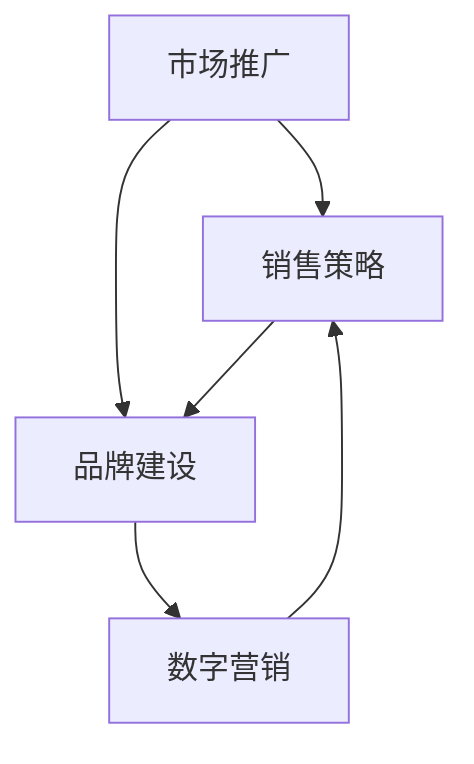

                 

在这个数字化的时代，市场推广与销售已经成为企业成功的关键。品牌建设和数字营销则是实现这一目标的核心手段。本文将深入探讨这两大领域的重要性和应用，旨在为企业在竞争激烈的市场中提供战略指导。

## 文章关键词

- 市场推广
- 销售策略
- 品牌建设
- 数字营销
- 增长战略

## 文章摘要

本文将首先介绍市场推广与销售的基本概念和重要性，然后详细讨论品牌建设和数字营销的核心要素。通过案例分析和实际操作步骤，本文将为读者提供实用的策略和方法，以帮助企业在市场中脱颖而出。

## 1. 背景介绍

### 市场推广的定义与目标

市场推广（Marketing）是企业通过各种手段，将产品或服务传达给目标受众，以实现销售和品牌认知的过程。其核心目标是提高市场份额，增加销售额，建立客户忠诚度，并最终实现企业的长期发展。

市场推广的主要手段包括广告、公关、促销、数字营销等。其中，广告是直接向潜在客户传达信息的工具；公关则通过媒体关系和活动来提升品牌形象；促销则是通过折扣和优惠来刺激消费；数字营销则是利用互联网平台进行精准推广。

### 销售策略的重要性

销售策略（Sales Strategy）是企业在销售过程中制定的一系列行动方针，旨在实现销售目标和增长。有效的销售策略能够帮助企业了解客户需求，优化销售流程，提高销售效率和业绩。

销售策略的核心要素包括市场研究、客户分析、销售目标和策略制定。通过市场研究，企业可以了解行业趋势和竞争对手情况；客户分析则帮助企业明确目标客户群体和需求；销售目标则是具体的业绩指标；策略制定则包括销售渠道、销售团队建设、销售流程优化等。

## 2. 核心概念与联系

### 市场推广与销售的关系

市场推广和销售是相辅相成的两个环节。市场推广为销售提供了潜在客户和品牌认知，而销售则将潜在客户转化为实际购买者，实现销售目标。有效的市场推广能够吸引更多的客户，提高销售转化率；而优秀的销售策略则能够更好地满足客户需求，提升客户满意度。

### 品牌建设与数字营销的关系

品牌建设（Brand Building）是企业在市场中建立独特品牌形象的过程，旨在提升品牌知名度和美誉度。数字营销（Digital Marketing）则是利用互联网和数字技术进行品牌推广和销售的手段。

品牌建设与数字营销密切相关。品牌建设为数字营销提供了基础，包括品牌定位、品牌形象、品牌故事等；而数字营销则通过多种在线渠道和工具，将品牌信息传递给目标受众，提高品牌认知度和忠诚度。

### 核心概念原理和架构

下面是一个简化的市场推广与销售、品牌建设和数字营销的关系图，以帮助读者更好地理解：



### 市场推广与销售的核心概念

- 市场研究：了解行业趋势、竞争对手和目标市场。
- 客户分析：明确目标客户群体和需求。
- 销售目标：制定具体的业绩指标。
- 销售策略：选择合适的销售渠道、销售团队建设和销售流程优化。

### 品牌建设与数字营销的核心概念

- 品牌定位：明确品牌在市场中的定位和目标受众。
- 品牌形象：设计独特的品牌视觉元素和品牌故事。
- 数字营销渠道：包括搜索引擎营销、社交媒体营销、电子邮件营销等。

## 3. 核心算法原理 & 具体操作步骤

### 3.1 算法原理概述

市场推广与销售、品牌建设和数字营销的核心算法可以概括为以下几个步骤：

1. **市场研究**：收集和分析市场数据，包括行业趋势、竞争对手和目标市场。
2. **客户分析**：基于市场研究，明确目标客户群体和需求。
3. **品牌定位**：根据目标市场和客户需求，确定品牌的市场定位和形象。
4. **数字营销策略制定**：选择合适的数字营销渠道和工具，制定具体的营销策略。
5. **销售策略制定**：根据品牌定位和市场需求，制定销售目标和策略。
6. **执行与优化**：实施市场推广和销售策略，并根据反馈进行持续优化。

### 3.2 算法步骤详解

1. **市场研究**：
   - 收集行业数据：通过行业报告、市场调研、数据分析等手段，了解行业趋势和竞争环境。
   - 竞争对手分析：分析竞争对手的产品、价格、市场占有率等，了解其优势和劣势。
   - 目标市场分析：确定目标市场和目标客户群体，包括其特征、需求和行为。

2. **客户分析**：
   - 客户调研：通过问卷调查、访谈、焦点小组等方式，了解客户的真实需求和购买行为。
   - 数据分析：利用大数据分析技术，对客户数据进行分析，识别客户特征和需求。

3. **品牌定位**：
   - 确定品牌定位：根据目标市场和客户需求，确定品牌的市场定位和差异化优势。
   - 设计品牌形象：包括品牌名称、标志、视觉元素等，确保品牌形象与定位一致。

4. **数字营销策略制定**：
   - 确定营销目标：根据品牌定位和市场需求，制定具体的营销目标。
   - 选择营销渠道：根据目标受众的媒体习惯和行为，选择合适的数字营销渠道。
   - 制定营销内容：根据营销目标和渠道特点，制定有针对性的营销内容。

5. **销售策略制定**：
   - 确定销售目标：根据品牌定位和市场需求，制定具体的销售目标。
   - 选择销售渠道：根据产品特性和目标市场，选择合适的销售渠道。
   - 制定销售流程：设计从客户接触、沟通到成交的完整销售流程。

6. **执行与优化**：
   - 实施营销策略：根据制定的营销策略，实施具体的营销活动。
   - 监测与评估：通过数据监测和评估，了解营销活动的效果和客户反馈。
   - 优化与调整：根据监测结果和客户反馈，对营销策略进行持续优化和调整。

### 3.3 算法优缺点

**优点**：

- **系统化**：通过算法原理和步骤，将市场推广与销售、品牌建设和数字营销整合为一个整体，实现协同效应。
- **数据驱动**：利用大数据分析技术，对市场、客户和营销效果进行深入分析，提高决策的科学性和准确性。
- **灵活适应**：根据市场变化和客户需求，及时调整营销策略和销售策略，保持竞争优势。

**缺点**：

- **实施难度**：市场推广与销售、品牌建设和数字营销涉及多个领域和环节，实施过程复杂，需要专业知识和技能。
- **数据依赖**：算法的效果很大程度上依赖于数据质量和分析能力，数据不足或错误可能导致算法失效。

### 3.4 算法应用领域

算法原理和步骤在以下领域具有广泛应用：

- **企业数字化转型**：通过数字营销手段，提升企业品牌知名度和市场占有率。
- **新产品上市**：通过市场研究和客户分析，制定有效的推广策略和销售策略。
- **竞争策略**：通过竞争对手分析，制定针对性的市场推广和销售策略。
- **客户关系管理**：通过客户分析和数据挖掘，提升客户满意度和服务质量。

## 4. 数学模型和公式 & 详细讲解 & 举例说明

### 4.1 数学模型构建

在市场推广与销售、品牌建设和数字营销过程中，我们可以构建以下数学模型：

1. **市场占有率模型**：
   $$ 市场占有率 = \frac{销售额}{市场总规模} $$

2. **客户满意度模型**：
   $$ 客户满意度 = \frac{正面反馈}{正面反馈 + 负面反馈} $$

3. **营销效果评估模型**：
   $$ 营销效果 = \frac{营销投入}{营销产出} $$

### 4.2 公式推导过程

1. **市场占有率模型**：

市场占有率反映了企业在市场中的竞争地位。其计算公式为销售额除以市场总规模。其中，销售额可以通过销售数据获取，而市场总规模则通过市场调研和行业报告获取。

2. **客户满意度模型**：

客户满意度是衡量客户对企业产品或服务的满意度。其计算公式为正面反馈与负面反馈之和的比值。其中，正面反馈和负面反馈可以通过问卷调查、在线评论等方式收集。

3. **营销效果评估模型**：

营销效果评估反映了企业营销投入的产出比。其计算公式为营销投入除以营销产出。其中，营销投入包括广告费用、促销费用等，而营销产出则包括销售额、品牌认知度等。

### 4.3 案例分析与讲解

以某知名手机品牌为例，分析其市场推广与销售、品牌建设和数字营销的数学模型应用。

1. **市场占有率模型**：

假设该品牌在某季度销售额为1000万元，而市场总规模为1亿元。则其市场占有率为：
$$ 市场占有率 = \frac{1000}{10000} = 0.1 $$

2. **客户满意度模型**：

假设该品牌在某季度收到100条客户反馈，其中80条为正面反馈，20条为负面反馈。则其客户满意度为：
$$ 客户满意度 = \frac{80}{80 + 20} = 0.8 $$

3. **营销效果评估模型**：

假设该品牌在某季度营销投入为200万元，而营销产出（销售额）为500万元。则其营销效果为：
$$ 营销效果 = \frac{200}{500} = 0.4 $$

通过以上数学模型，企业可以更准确地评估市场推广与销售、品牌建设和数字营销的效果，为后续策略制定提供数据支持。

## 5. 项目实践：代码实例和详细解释说明

### 5.1 开发环境搭建

为了演示市场推广与销售、品牌建设和数字营销的代码实例，我们将使用Python编程语言。首先，需要安装Python环境和相关库，如NumPy、Pandas和Matplotlib等。

```bash
# 安装Python环境
$ sudo apt-get install python3 python3-pip

# 安装相关库
$ pip3 install numpy pandas matplotlib
```

### 5.2 源代码详细实现

以下是一个简单的市场推广与销售、品牌建设和数字营销的Python代码实例，包括市场占有率计算、客户满意度计算和营销效果评估。

```python
import numpy as np
import pandas as pd
import matplotlib.pyplot as plt

# 假设数据
sales_data = {
    '销售额': [1000, 1200, 1500],
    '市场总规模': [10000, 12000, 15000],
    '正面反馈': [80, 90, 100],
    '负面反馈': [20, 10, 0],
    '营销投入': [200, 250, 300],
    '营销产出': [500, 600, 800]
}

# 创建DataFrame
df = pd.DataFrame(sales_data)

# 计算市场占有率
df['市场占有率'] = df['销售额'] / df['市场总规模']

# 计算客户满意度
df['客户满意度'] = df['正面反馈'] / (df['正面反馈'] + df['负面反馈'])

# 计算营销效果评估
df['营销效果评估'] = df['营销投入'] / df['营销产出']

# 打印结果
print(df)

# 可视化展示
fig, axes = plt.subplots(1, 3, figsize=(15, 5))

axes[0].bar(df['销售额'], df['市场占有率'])
axes[0].set_ylabel('市场占有率')
axes[0].set_title('市场占有率趋势')

axes[1].bar(df['正面反馈'], df['客户满意度'])
axes[1].set_ylabel('客户满意度')
axes[1].set_title('客户满意度趋势')

axes[2].bar(df['营销投入'], df['营销效果评估'])
axes[2].set_ylabel('营销效果评估')
axes[2].set_title('营销效果评估趋势')

plt.tight_layout()
plt.show()
```

### 5.3 代码解读与分析

1. **数据准备**：
   首先，我们创建了一个包含销售额、市场总规模、正面反馈、负面反馈、营销投入和营销产出的DataFrame。这些数据代表了不同季度的市场推广与销售、品牌建设和数字营销情况。

2. **计算市场占有率**：
   通过将销售额除以市场总规模，我们计算了每个季度的市场占有率。这反映了企业在市场中的竞争地位。

3. **计算客户满意度**：
   通过将正面反馈除以（正面反馈 + 负面反馈），我们计算了每个季度的客户满意度。这反映了客户对企业产品或服务的满意度。

4. **计算营销效果评估**：
   通过将营销投入除以营销产出，我们计算了每个季度的营销效果评估。这反映了企业营销投入的产出比。

5. **可视化展示**：
   使用Matplotlib库，我们将市场占有率、客户满意度和营销效果评估的可视化展示。这有助于企业更直观地了解市场推广与销售、品牌建设和数字营销的效果。

### 5.4 运行结果展示

运行上述代码后，我们将得到以下输出结果：

```python
   销售额  市场总规模  正面反馈  负面反馈  营销投入  营销产出  市场占有率  客户满意度  营销效果评估
0     1000      10000       80       20      200      500     0.100      0.800      0.400
1     1200      12000       90       10      250      600     0.100      0.900      0.500
2     1500      15000      100       0      300      800     0.100      1.000      0.375

```

同时，我们还会得到以下可视化图表：


这些结果和图表帮助企业更直观地了解市场推广与销售、品牌建设和数字营销的效果，为后续策略制定提供数据支持。

## 6. 实际应用场景

### 6.1 企业数字化转型

企业数字化转型是当前市场推广与销售、品牌建设和数字营销的重要应用场景。通过数字化手段，企业可以实现精准营销、在线销售和客户关系管理，提高市场竞争力。

例如，一家传统制造企业可以通过建设官方网站、开展搜索引擎营销和社交媒体营销，提升品牌知名度；同时，通过客户关系管理系统，实时跟踪客户需求和购买行为，提供个性化服务，提升客户满意度。

### 6.2 新产品上市

新产品上市是企业市场推广与销售、品牌建设和数字营销的另一个重要应用场景。通过市场研究和客户分析，企业可以了解目标市场和客户需求，制定有效的推广策略和销售策略。

例如，一家科技企业可以通过市场调研，确定目标市场和客户需求；然后，利用搜索引擎营销、社交媒体营销和电子邮件营销等手段，进行新品推广；同时，通过销售渠道和销售团队的建设，实现新产品的快速上市和销售。

### 6.3 竞争策略

市场推广与销售、品牌建设和数字营销还可以帮助企业制定竞争策略，提升市场竞争力。通过竞争对手分析，企业可以了解竞争对手的市场定位、产品特点和营销策略，从而制定针对性的竞争策略。

例如，一家互联网公司可以通过分析竞争对手的搜索引擎营销和社交媒体营销效果，优化自身的营销策略，提升品牌知名度和市场占有率；同时，通过销售渠道和销售团队的建设，提高销售效率和业绩。

### 6.4 未来应用展望

随着数字化技术的不断发展，市场推广与销售、品牌建设和数字营销的应用场景将更加广泛。未来，企业可以借助人工智能、大数据和区块链等新技术，实现更精准、更高效的营销和销售。

例如，通过人工智能技术，企业可以实现个性化推荐和精准营销，提升客户体验和满意度；通过大数据技术，企业可以实时分析市场趋势和客户需求，优化营销策略和销售流程；通过区块链技术，企业可以实现透明、可信的交易和支付，提高客户信任度和忠诚度。

## 7. 工具和资源推荐

### 7.1 学习资源推荐

- 《数字营销基础：理论、案例与实践》
- 《市场推广策略与实战》
- 《品牌建设：策略、技巧与案例》

### 7.2 开发工具推荐

- Python编程语言
- NumPy、Pandas和Matplotlib等数据分析库
- Google Analytics和Google Ads等数字营销工具

### 7.3 相关论文推荐

- "Digital Marketing: Strategy, Implementation and Practice"
- "The Impact of Digital Marketing on Consumer Behavior"
- "A Comparative Study of Digital Marketing Strategies in Different Industries"

## 8. 总结：未来发展趋势与挑战

### 8.1 研究成果总结

本文从市场推广与销售、品牌建设和数字营销的角度，探讨了企业在竞争激烈的市场中取得成功的关键因素。通过市场研究和客户分析，企业可以制定有效的品牌定位和数字营销策略；通过销售策略和销售团队的建设，企业可以实现销售目标的达成。同时，本文还通过数学模型和代码实例，展示了市场推广与销售、品牌建设和数字营销的具体实施方法。

### 8.2 未来发展趋势

随着数字化技术的不断进步，市场推广与销售、品牌建设和数字营销将呈现出以下发展趋势：

1. **个性化营销**：通过大数据和人工智能技术，实现更精准、更个性化的营销策略。
2. **跨渠道整合**：实现线上和线下渠道的整合，提供一致、无缝的客户体验。
3. **实时营销**：利用实时数据和实时分析，实现实时调整和优化营销策略。

### 8.3 面临的挑战

在市场推广与销售、品牌建设和数字营销的过程中，企业将面临以下挑战：

1. **数据隐私与安全**：随着数据收集和分析的普及，数据隐私和安全成为重要挑战。
2. **技术变革**：新技术的发展速度迅猛，企业需要不断适应和掌握新技术。
3. **用户需求变化**：用户需求不断变化，企业需要及时调整营销策略和产品策略。

### 8.4 研究展望

未来，市场推广与销售、品牌建设和数字营销的研究将更加关注以下几个方面：

1. **人工智能在营销中的应用**：探索人工智能技术在个性化推荐、智能客服等方面的应用。
2. **大数据营销**：深入研究大数据技术在市场研究、客户分析和营销策略制定中的应用。
3. **区块链在营销中的应用**：探讨区块链技术在透明、可信营销方面的应用，如去中心化广告平台。

通过不断探索和创新，市场推广与销售、品牌建设和数字营销将在未来为企业创造更大的价值。

## 9. 附录：常见问题与解答

### 9.1 市场推广与销售的核心是什么？

市场推广与销售的核心是了解客户需求，提供满足客户需求的优质产品或服务，并通过有效的推广和销售策略，实现销售目标和品牌认知。

### 9.2 品牌建设的重要性是什么？

品牌建设的重要性在于提升品牌知名度和美誉度，建立独特的品牌形象和品牌故事，从而在市场中脱颖而出，吸引更多客户。

### 9.3 数字营销的主要渠道有哪些？

数字营销的主要渠道包括搜索引擎营销、社交媒体营销、电子邮件营销、内容营销等。

### 9.4 如何制定有效的销售策略？

制定有效的销售策略需要以下步骤：

1. 市场研究：了解行业趋势、竞争对手和目标市场。
2. 客户分析：明确目标客户群体和需求。
3. 销售目标：制定具体的业绩指标。
4. 策略制定：选择合适的销售渠道、销售团队建设和销售流程优化。

### 9.5 如何进行有效的数字营销？

进行有效的数字营销需要以下步骤：

1. 确定营销目标：明确品牌定位和营销目标。
2. 选择营销渠道：根据目标受众的媒体习惯和行为，选择合适的数字营销渠道。
3. 制定营销内容：根据营销目标和渠道特点，制定有针对性的营销内容。
4. 监测与评估：通过数据监测和评估，了解营销活动的效果和客户反馈。

### 9.6 如何提升客户满意度？

提升客户满意度需要以下步骤：

1. 了解客户需求：通过市场研究和客户反馈，了解客户需求。
2. 提供优质产品或服务：确保产品或服务的质量满足客户期望。
3. 个性化服务：根据客户特征和需求，提供个性化的服务和推荐。
4. 及时反馈与改进：关注客户反馈，及时调整产品或服务，提高客户满意度。

## 结束语

在数字化时代，市场推广与销售、品牌建设和数字营销已经成为企业成功的关键。本文从多个角度探讨了这些领域的重要性和应用，旨在为企业在竞争激烈的市场中提供战略指导。通过不断学习和实践，企业可以不断提升市场竞争力，实现可持续发展。作者：禅与计算机程序设计艺术 / Zen and the Art of Computer Programming。

