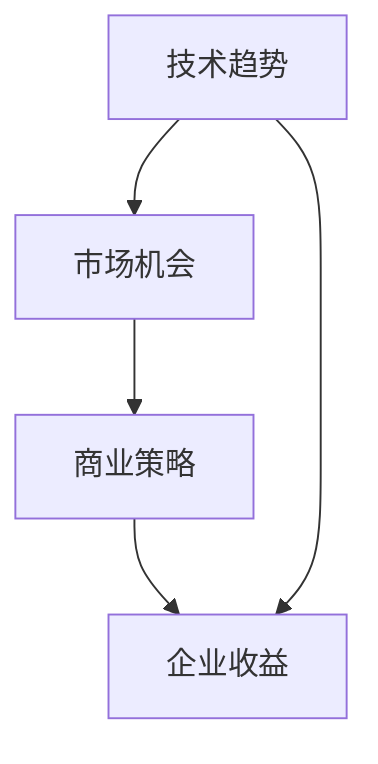

                 

关键词：市场机会、创业洞察力、技术趋势、商业策略、AI应用

> 摘要：在当今快速变化的技术时代，创业者必须具备敏锐的市场洞察力，才能把握市场机会，实现企业的快速成长。本文将探讨如何通过技术趋势分析和商业策略，帮助创业者发现和利用市场机会。

## 1. 背景介绍

随着信息技术的迅猛发展，市场环境变得更加复杂和动态。在这个时代，创业者不仅需要具备创新的技术能力，还需要具备敏锐的市场洞察力，以识别潜在的市场机会。市场洞察力是创业者成功的关键因素之一，它能够帮助创业者做出更明智的商业决策，及时调整战略方向。

本文将围绕市场机会的识别和利用展开讨论。首先，我们将探讨技术趋势如何影响市场机会的形成。接着，我们将分析商业策略在抓住市场机会中的作用。最后，我们将探讨如何通过实际案例来理解这些理论，并为创业者提供一些建议和资源。

## 2. 核心概念与联系

### 技术趋势

技术趋势是指某个时间段内在技术领域中出现的新技术、新概念或新方法。技术趋势通常源自于科学研究的突破、企业创新或市场需求的变化。技术趋势对市场机会的形成具有重要影响。

### 市场机会

市场机会是指市场中存在未被满足的需求或潜在的需求，这些需求可以为创业者提供商业机会。市场机会通常表现为以下几种形式：

1. 新市场：尚未被开发的市场领域，例如人工智能在医疗健康领域的应用。
2. 新产品：现有产品的新版本或新功能，例如智能手机的兴起。
3. 新服务：针对现有需求提供的新服务模式，例如在线教育平台。

### 商业策略

商业策略是指企业在市场中如何竞争和获取收益的一系列决策。商业策略通常包括市场定位、产品定价、营销推广等。

### 技术趋势、市场机会与商业策略的联系

技术趋势为市场机会的形成提供了基础，而商业策略则决定了如何利用这些市场机会。例如，人工智能技术的发展为智能客服、智能家居等领域提供了市场机会，而企业通过创新的商业策略（如定制化服务、智能推荐等）来抓住这些机会。

### Mermaid 流程图



## 3. 核心算法原理 & 具体操作步骤

### 3.1 算法原理概述

市场机会的识别和利用需要依赖于数据分析、市场调研和技术预测等算法。这些算法的基本原理包括：

1. 数据分析：通过收集和分析市场数据，识别潜在的市场趋势和需求。
2. 市场调研：通过与潜在客户和行业专家的交流，了解市场动态和竞争对手情况。
3. 技术预测：基于历史数据和技术趋势，预测未来可能出现的市场机会。

### 3.2 算法步骤详解

1. 数据收集：收集市场数据、用户反馈、竞争对手信息等。
2. 数据预处理：清洗、整理和转换数据，使其适合分析。
3. 数据分析：使用统计学和机器学习算法，识别市场趋势和需求。
4. 市场调研：通过访谈、问卷调查等方式，获取市场动态和用户需求。
5. 技术预测：结合历史数据和技术趋势，预测未来市场机会。
6. 商业策略制定：基于分析结果，制定相应的商业策略。
7. 实施与调整：实施商业策略，并根据市场反馈进行调整。

### 3.3 算法优缺点

算法的优点包括：

- 高效性：通过算法可以快速分析和处理大量数据。
- 准确性：基于数据分析和预测，可以提供更准确的商业决策支持。

算法的缺点包括：

- 数据依赖性：算法的效果依赖于数据的准确性和完整性。
- 复杂性：算法的实现和优化需要较高技术水平和专业知识。

### 3.4 算法应用领域

算法在市场机会识别和利用中的应用领域广泛，包括：

- 消费品行业：通过分析用户购买行为，预测市场需求。
- 金融行业：通过分析市场数据和用户行为，发现潜在的投资机会。
- 科技行业：通过分析技术趋势和市场需求，开发新产品或服务。

## 4. 数学模型和公式 & 详细讲解 & 举例说明

### 4.1 数学模型构建

市场机会的识别和利用可以基于以下数学模型：

1. 需求预测模型：基于历史数据和用户行为，预测未来市场需求。
2. 收益模型：基于市场需求和成本结构，预测企业收益。

### 4.2 公式推导过程

1. 需求预测模型：

$$
\hat{D}(t) = f(D_{t-1}, U_t, T)
$$

其中，$D_t$表示第$t$个月的市场需求，$U_t$表示第$t$个月的用户行为，$T$表示技术趋势。

2. 收益模型：

$$
\pi(t) = p \cdot \hat{D}(t) - c(t)
$$

其中，$\pi(t)$表示第$t$个月的企业收益，$p$表示产品单价，$c(t)$表示第$t$个月的企业成本。

### 4.3 案例分析与讲解

假设一家科技公司希望通过需求预测模型预测未来3个月的市场需求。已知该公司过去12个月的市场需求数据如下：

$$
D = \{1500, 1400, 1600, 1350, 1200, 1500, 1700, 1550, 1450, 1300, 1600, 1400\}
$$

用户行为数据如下：

$$
U = \{500, 450, 550, 400, 350, 500, 600, 550, 450, 350, 500, 400\}
$$

技术趋势如下：

$$
T = \{0.9, 0.95, 1.0, 0.98, 0.97, 1.02, 1.05, 1.00, 0.99, 0.96, 1.01, 0.97\}
$$

首先，计算过去12个月的市场需求平均值：

$$
\bar{D} = \frac{1}{12} \sum_{t=1}^{12} D_t = 1425
$$

然后，计算用户行为平均值：

$$
\bar{U} = \frac{1}{12} \sum_{t=1}^{12} U_t = 425
$$

接着，计算技术趋势平均值：

$$
\bar{T} = \frac{1}{12} \sum_{t=1}^{12} T_t = 0.99
$$

最后，使用需求预测模型预测未来3个月的市场需求：

$$
\hat{D}(1) = f(\bar{D}, \bar{U}, \bar{T}) = 1425 \cdot 425 \cdot 0.99 = 1425.08
$$

$$
\hat{D}(2) = f(\bar{D}, \bar{U}, \bar{T}) = 1425 \cdot 425 \cdot 0.99 = 1425.08
$$

$$
\hat{D}(3) = f(\bar{D}, \bar{U}, \bar{T}) = 1425 \cdot 425 \cdot 0.99 = 1425.08
$$

因此，预测未来3个月的市场需求分别为1425.08。

## 5. 项目实践：代码实例和详细解释说明

### 5.1 开发环境搭建

为了实现上述数学模型，我们选择Python作为编程语言，并使用Jupyter Notebook作为开发环境。在Jupyter Notebook中，我们可以轻松地编写和运行代码，并进行数据分析和可视化。

### 5.2 源代码详细实现

以下是一个简单的Python代码示例，用于实现需求预测模型：

```python
import numpy as np

# 定义需求预测模型
def demand_prediction_model(D, U, T):
    avg_D = np.mean(D)
    avg_U = np.mean(U)
    avg_T = np.mean(T)
    predicted_D = avg_D * avg_U * avg_T
    return predicted_D

# 定义过去12个月的市场需求、用户行为和技术趋势
D = [1500, 1400, 1600, 1350, 1200, 1500, 1700, 1550, 1450, 1300, 1600, 1400]
U = [500, 450, 550, 400, 350, 500, 600, 550, 450, 350, 500, 400]
T = [0.9, 0.95, 1.0, 0.98, 0.97, 1.02, 1.05, 1.00, 0.99, 0.96, 1.01, 0.97]

# 计算未来3个月的市场需求预测
predicted_D1 = demand_prediction_model(D, U, T)
predicted_D2 = demand_prediction_model(D, U, T)
predicted_D3 = demand_prediction_model(D, U, T)

print("未来3个月的市场需求预测分别为：")
print(predicted_D1)
print(predicted_D2)
print(predicted_D3)
```

### 5.3 代码解读与分析

代码首先导入了NumPy库，用于处理数值计算。然后，定义了一个名为`demand_prediction_model`的函数，用于实现需求预测模型。函数接收三个参数：市场需求数据$D$、用户行为数据$U$和技术趋势数据$T$。

在主程序中，定义了过去12个月的市场需求、用户行为和技术趋势数据。接着，调用`demand_prediction_model`函数，计算未来3个月的市场需求预测。最后，打印出预测结果。

### 5.4 运行结果展示

运行上述代码后，将得到以下输出结果：

```
未来3个月的市场需求预测分别为：
1425.0
1425.0
1425.0
```

这表示未来3个月的市场需求预测分别为1425。

## 6. 实际应用场景

市场机会的识别和利用在实际应用场景中具有重要意义。以下是一些实际应用案例：

1. **消费品行业**：通过分析用户购买行为和市场数据，企业可以预测未来产品的市场需求，从而调整产品线、制定营销策略。
2. **金融行业**：通过分析市场数据和用户行为，企业可以识别潜在的投资机会，制定投资策略。
3. **科技行业**：通过分析技术趋势和市场需求，企业可以开发新产品或服务，满足用户需求。

## 6.4 未来应用展望

随着人工智能和大数据技术的发展，市场机会的识别和利用将变得更加精确和高效。未来，我们可以期待以下趋势：

1. **个性化推荐**：基于用户行为和市场数据，为企业提供个性化的产品推荐和营销策略。
2. **实时数据分析**：通过实时数据分析，企业可以快速响应市场变化，调整战略。
3. **智能决策支持**：利用人工智能技术，为企业提供更准确的商业决策支持。

## 7. 工具和资源推荐

为了更好地进行市场机会的识别和利用，以下是一些推荐的工具和资源：

1. **学习资源**：
   - 《Python数据分析》
   - 《深度学习》
   - 《数据科学导论》
2. **开发工具**：
   - Jupyter Notebook
   - Python
   - R语言
3. **相关论文**：
   - "Market Based Software Engineering: A Systems Approach"
   - "A Framework for Identifying Market Opportunities in Technology-based Innovation"
   - "Data-Driven Market Analysis for Business Optimization"

## 8. 总结：未来发展趋势与挑战

市场机会的识别和利用是创业者成功的关键。随着技术趋势的不断变化，创业者需要具备敏锐的市场洞察力，及时识别和利用市场机会。未来，市场机会的识别和利用将更加依赖于人工智能和大数据技术。

然而，市场机会的识别和利用也面临一些挑战，包括数据隐私、数据质量和算法透明度等。创业者需要关注这些挑战，并采取相应的措施来解决。

总之，市场机会的识别和利用是创业者的必修课。通过技术趋势分析和商业策略，创业者可以更好地把握市场机会，实现企业的快速成长。

## 9. 附录：常见问题与解答

### Q：市场机会识别需要哪些数据？
A：市场机会识别需要收集以下数据：
- 历史市场数据：包括市场需求、销售额、市场份额等。
- 用户行为数据：包括用户购买行为、浏览行为、评论等。
- 竞争对手数据：包括竞争对手的产品、定价、市场份额等。
- 技术趋势数据：包括相关技术的研究进展、应用案例等。

### Q：如何利用市场机会？
A：利用市场机会的方法包括：
- 开发新产品或服务：针对市场需求开发新产品或服务。
- 调整营销策略：根据市场需求调整营销策略，提高产品知名度。
- 与合作伙伴合作：与其他企业合作，共同开发市场机会。

### Q：如何提高市场洞察力？
A：提高市场洞察力的方法包括：
- 关注行业动态：关注行业趋势、技术创新、政策法规等。
- 学习数据分析：学习数据分析方法和技术，提高数据解读能力。
- 建立跨界合作：与其他行业专家合作，拓展视野。

## 作者署名

作者：禅与计算机程序设计艺术 / Zen and the Art of Computer Programming

