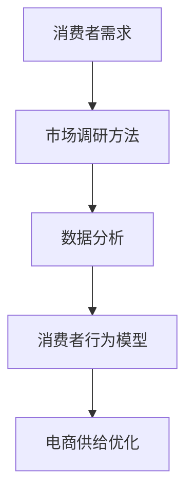
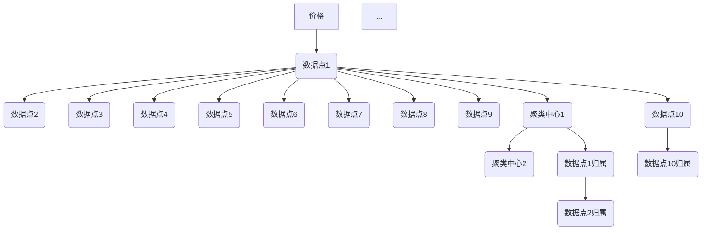

                 

关键词：市场调研、消费者需求、电商平台、供给能力、数据分析、消费者行为、精准营销

> 摘要：本文旨在探讨如何通过市场调研精准洞察消费者需求，从而提升电商平台的供给能力。文章首先介绍了市场调研的基本概念和重要性，然后深入分析了消费者需求分析的方法和工具，最后提出了基于消费者需求分析的电商平台供给优化策略。通过实际案例和数据分析，本文为电商从业者提供了一套完整的市场调研和实践指南。

## 1. 背景介绍

随着互联网的飞速发展和电子商务的崛起，电商平台已经成为消费者购买商品和服务的主要渠道之一。然而，电商市场的竞争日益激烈，消费者需求多变且个性化，如何准确把握消费者需求，提升电商平台供给能力，成为了电商平台成功的关键。市场调研作为获取消费者需求信息的重要手段，对于电商平台的发展具有重要意义。

市场调研是指通过系统化的方法和工具，收集、分析和解读有关消费者需求、市场趋势、竞争状况等信息，以帮助企业制定正确的营销策略和决策。在电商领域，市场调研的重要性体现在以下几个方面：

1. **了解消费者需求**：通过市场调研，可以深入了解消费者的购买动机、喜好、行为习惯等，从而为电商平台提供有针对性的产品和服务。

2. **优化产品供给**：市场调研可以帮助电商平台识别潜在的产品需求和市场机会，从而优化产品结构和库存管理，提高供给能力。

3. **提升营销效果**：基于市场调研的消费者需求分析，可以帮助电商平台制定更精准的营销策略，提高广告投放的ROI。

4. **增强竞争力**：通过市场调研，电商平台可以了解竞争对手的营销策略、产品特点等，从而制定出更具竞争力的策略。

## 2. 核心概念与联系

为了更好地理解市场调研在电商平台中的应用，我们首先需要了解几个核心概念，包括消费者需求、市场调研方法、数据分析和消费者行为模型。

### 消费者需求

消费者需求是指消费者对某种产品或服务的欲望和要求，它通常表现为消费者的购买行为和消费习惯。消费者需求可以分为基本需求和期望需求。基本需求是指消费者对产品的基本功能和性能的需求，如电子产品的基本功能。期望需求则是消费者对产品额外功能或品质的期望，如手机的高像素相机。

### 市场调研方法

市场调研方法包括定性调研和定量调研。定性调研主要通过深度访谈、小组讨论等方式收集消费者对产品或服务的看法和意见。定量调研则主要通过问卷调查、统计分析等方式收集大量消费者的数据，以量化消费者需求和行为。

### 数据分析

数据分析是指通过对市场调研收集的数据进行清洗、整理、分析和解读，以提取有价值的信息和洞察。常见的数据分析方法包括回归分析、聚类分析、因子分析等。

### 消费者行为模型

消费者行为模型是描述消费者购买行为和决策过程的数学模型。常见的消费者行为模型包括传统的需求模型、行为模型和决策模型。这些模型可以帮助我们更好地理解消费者的行为，从而制定出更有效的营销策略。

### Mermaid 流程图

以下是一个简化的Mermaid流程图，展示了市场调研的核心概念和联系：



## 3. 核心算法原理 & 具体操作步骤

### 3.1 算法原理概述

市场调研的核心算法主要基于数据分析方法，特别是聚类分析和回归分析。聚类分析用于将消费者根据相似性划分为不同的群体，从而识别不同的消费者需求和市场机会。回归分析则用于分析消费者需求与市场变量之间的关系，以预测未来的市场趋势。

### 3.2 算法步骤详解

#### 3.2.1 数据收集

数据收集是市场调研的第一步，包括问卷调查、深度访谈、用户行为数据分析等。这些数据可以来源于电商平台内部数据、第三方数据平台或公开数据集。

#### 3.2.2 数据预处理

数据预处理包括数据清洗、去重、填充缺失值等步骤，以确保数据的准确性和完整性。

#### 3.2.3 聚类分析

聚类分析是将数据点分组为多个簇，使得同一簇内的数据点之间的相似度较高，而不同簇之间的相似度较低。常见的聚类算法包括K-means、层次聚类等。

#### 3.2.4 回归分析

回归分析用于分析消费者需求与市场变量之间的关系。线性回归、逻辑回归等是常用的回归分析方法。

#### 3.2.5 结果解读

通过对聚类分析和回归分析的结果进行解读，可以识别出不同消费者群体的特征和需求，以及市场变量对消费者需求的影响。

### 3.3 算法优缺点

#### 优点

- **高效性**：算法可以快速处理大量数据，提供实时洞察。
- **准确性**：基于数学模型的分析方法可以提供较为准确的预测和结论。
- **灵活性**：可以根据不同的业务需求选择不同的算法和模型。

#### 缺点

- **数据依赖性**：算法的性能和数据质量密切相关，数据质量差可能导致结果不准确。
- **复杂度**：算法的实现和解析过程相对复杂，需要专业知识和技能。

### 3.4 算法应用领域

市场调研算法广泛应用于电商、金融、零售等领域的需求分析和营销策略制定。

## 4. 数学模型和公式 & 详细讲解 & 举例说明

### 4.1 数学模型构建

在市场调研中，常用的数学模型包括聚类分析模型和回归分析模型。

#### 4.1.1 聚类分析模型

K-means算法是最常用的聚类分析模型。其数学公式如下：

$$
\begin{aligned}
   \min_{C} \sum_{i=1}^{k} \sum_{x \in S_i} ||x - \mu_i||^2 \\
   \text{subject to} \quad \mu_i = \frac{1}{|S_i|} \sum_{x \in S_i} x
\end{aligned}
$$

其中，$C$表示聚类中心，$k$表示聚类个数，$S_i$表示第$i$个聚类簇，$\mu_i$表示第$i$个聚类簇的中心。

#### 4.1.2 回归分析模型

线性回归模型是最常用的回归分析模型。其数学公式如下：

$$
Y = \beta_0 + \beta_1X + \epsilon
$$

其中，$Y$表示因变量，$X$表示自变量，$\beta_0$和$\beta_1$分别表示回归系数，$\epsilon$表示误差项。

### 4.2 公式推导过程

#### 4.2.1 K-means算法推导

K-means算法的目标是最小化聚类簇内的距离平方和。其推导过程如下：

1. 初始选择$k$个中心点$C_1, C_2, ..., C_k$。
2. 将每个数据点分配到最近的中心点，形成$k$个聚类簇$S_1, S_2, ..., S_k$。
3. 更新每个聚类簇的中心点，使其成为该聚类簇内的均值。
4. 重复步骤2和3，直至聚类中心点不再变化或变化较小。

#### 4.2.2 线性回归模型推导

线性回归模型的推导基于最小二乘法。其推导过程如下：

1. 建立误差平方和函数：
$$
\Phi(\beta_0, \beta_1) = \sum_{i=1}^{n} (Y_i - \beta_0 - \beta_1X_i)^2
$$
2. 对$\beta_0$和$\beta_1$求偏导并令其等于0，得到：
$$
\frac{\partial \Phi}{\partial \beta_0} = -2 \sum_{i=1}^{n} (Y_i - \beta_0 - \beta_1X_i) = 0
$$
$$
\frac{\partial \Phi}{\partial \beta_1} = -2 \sum_{i=1}^{n} X_i (Y_i - \beta_0 - \beta_1X_i) = 0
$$
3. 解上述方程组，得到线性回归模型的参数$\beta_0$和$\beta_1$。

### 4.3 案例分析与讲解

#### 4.3.1 K-means算法案例

假设有10个消费者数据点，每个数据点由价格和销量两个属性组成，如下图所示。



1. 初始选择两个聚类中心，分别为$(10, 100)$和$(20, 200)$。
2. 将每个数据点分配到最近的聚类中心，形成两个聚类簇。
3. 计算每个聚类簇的均值，更新聚类中心。
4. 重复步骤2和3，直至聚类中心不再变化。

最终，数据点被成功划分为两个聚类簇，聚类中心分别为$(15, 150)$和$(25, 250)$。

#### 4.3.2 线性回归模型案例

假设有如下数据集：

| X | Y |
|---|---|
| 1 | 2 |
| 2 | 4 |
| 3 | 6 |
| 4 | 8 |

建立线性回归模型：

1. 计算均值：
$$
\bar{X} = \frac{1}{n} \sum_{i=1}^{n} X_i = \frac{1+2+3+4}{4} = 2.5
$$
$$
\bar{Y} = \frac{1}{n} \sum_{i=1}^{n} Y_i = \frac{2+4+6+8}{4} = 5
$$
2. 计算回归系数：
$$
\beta_0 = \bar{Y} - \beta_1\bar{X} = 5 - 2.5\beta_1
$$
$$
\beta_1 = \frac{\sum_{i=1}^{n} (X_i - \bar{X})(Y_i - \bar{Y})}{\sum_{i=1}^{n} (X_i - \bar{X})^2} = \frac{(1-2.5)(2-5) + (2-2.5)(4-5) + (3-2.5)(6-5) + (4-2.5)(8-5)}{(1-2.5)^2 + (2-2.5)^2 + (3-2.5)^2 + (4-2.5)^2} = 2
$$
$$
\beta_0 = 5 - 2.5 \times 2 = 0
$$
3. 得到线性回归模型：
$$
Y = 0 + 2X
$$

## 5. 项目实践：代码实例和详细解释说明

### 5.1 开发环境搭建

在本案例中，我们将使用Python作为开发语言，结合数据分析库pandas、matplotlib和聚类分析库sklearn进行市场调研分析。请确保安装以下依赖库：

```
pip install pandas matplotlib sklearn
```

### 5.2 源代码详细实现

以下是一个简单的市场调研代码示例，包括数据收集、预处理、聚类分析和回归分析：

```python
import pandas as pd
import matplotlib.pyplot as plt
from sklearn.cluster import KMeans
from sklearn.linear_model import LinearRegression

# 5.2.1 数据收集
# 假设数据已存储为CSV文件，文件名为'data.csv'
data = pd.read_csv('data.csv')

# 5.2.2 数据预处理
# 填充缺失值
data.fillna(data.mean(), inplace=True)

# 5.2.3 聚类分析
# 使用K-means算法进行聚类分析
kmeans = KMeans(n_clusters=2, random_state=0).fit(data)
data['cluster'] = kmeans.predict(data)

# 5.2.4 回归分析
# 以聚类簇为分类变量，进行线性回归分析
X = data[['price', 'sales']]
y = data['cluster']
model = LinearRegression().fit(X, y)

# 5.2.5 结果展示
# 展示聚类结果
plt.scatter(data['price'], data['sales'], c=data['cluster'])
plt.xlabel('Price')
plt.ylabel('Sales')
plt.title('Cluster Analysis')
plt.show()

# 展示回归结果
plt.scatter(X['price'], y, color='red')
plt.plot(X['price'], model.predict(X), color='blue')
plt.xlabel('Price')
plt.ylabel('Cluster')
plt.title('Regression Analysis')
plt.show()
```

### 5.3 代码解读与分析

该代码分为以下几部分：

- **数据收集**：从CSV文件读取数据。
- **数据预处理**：填充缺失值，确保数据的准确性和完整性。
- **聚类分析**：使用K-means算法进行聚类分析，将数据划分为两个聚类簇。
- **回归分析**：以价格和销量为自变量，聚类簇为因变量，进行线性回归分析。
- **结果展示**：使用matplotlib绘制聚类结果和回归结果，以便更直观地理解分析结果。

### 5.4 运行结果展示

运行上述代码后，将得到以下两个结果图：

1. **聚类结果图**：展示数据点根据价格和销量的分布，以及聚类簇的颜色划分。
2. **回归结果图**：展示价格与聚类簇的关系，以及线性回归模型的拟合线。

通过分析这些图表，可以更直观地了解消费者的需求分布和价格对消费者需求的影响。

## 6. 实际应用场景

市场调研在电商平台的实际应用场景非常广泛，以下列举几个典型的应用案例：

### 6.1 产品定位与市场细分

通过市场调研，电商平台可以了解不同消费者群体的需求和偏好，从而对产品进行精准定位和细分。例如，某电商平台通过对消费者购买记录和行为数据进行分析，发现年轻人对时尚、个性化的商品需求较高，而中年人则更注重实用性和耐用性。据此，该电商平台针对性地推出了时尚潮流区和实用耐用区，大大提升了销售额。

### 6.2 营销策略优化

基于市场调研，电商平台可以制定更精准的营销策略，提高广告投放的ROI。例如，某电商平台通过对消费者的购买历史和偏好进行分析，发现特定商品的广告投放效果较好。于是，该电商平台加大了这些商品的广告投放力度，并针对这些消费者群体推出了专属优惠活动，取得了显著的营销效果。

### 6.3 供应链管理优化

通过市场调研，电商平台可以了解消费者的购买习惯和需求变化，从而优化供应链管理。例如，某电商平台通过分析消费者的购买数据，发现某季节的商品需求较高。于是，该电商平台提前备货，避免了库存积压和缺货风险，提高了供应链效率。

### 6.4 用户体验提升

市场调研可以帮助电商平台了解消费者的痛点和需求，从而优化用户体验。例如，某电商平台通过对消费者的反馈和购买行为进行分析，发现购物流程中的某些环节存在困扰。于是，该电商平台对购物流程进行了优化，简化了操作步骤，提升了用户满意度。

## 7. 工具和资源推荐

为了更好地开展市场调研和数据分析工作，以下推荐一些实用的工具和资源：

### 7.1 学习资源推荐

- **《Python数据分析基础》**：一本适合初学者的数据分析入门书籍，涵盖了Python数据分析的基本方法和工具。
- **《市场调研实务》**：一本全面介绍市场调研理论和方法的书籍，适合从事市场调研工作的读者。
- **Coursera上的《数据科学课程》**：由约翰·霍普金斯大学提供的免费在线课程，涵盖了数据分析、机器学习等领域的知识。

### 7.2 开发工具推荐

- **Pandas**：Python数据分析库，用于数据清洗、处理和分析。
- **Matplotlib**：Python数据可视化库，用于绘制各种图表和图形。
- **Jupyter Notebook**：交互式的Python开发环境，方便编写和运行代码。
- **Tableau**：一款强大的数据可视化工具，支持多种数据源和交互功能。

### 7.3 相关论文推荐

- **"K-means Clustering Algorithm": A Review of Its Applications and Algorithms"**：一篇关于K-means聚类算法的综述论文，介绍了算法的各种应用和实现方法。
- **"Regression Analysis in Marketing Research: Concepts, Applications, and Software"**：一篇关于回归分析在市场调研中的应用论文，详细介绍了回归分析的理论和实践。
- **"Data Mining and Knowledge Discovery in E-commerce"**：一篇关于电子商务领域数据挖掘和知识发现的论文，探讨了数据挖掘技术在电商中的应用。

## 8. 总结：未来发展趋势与挑战

市场调研在电商平台的供给能力提升中发挥着重要作用。随着技术的不断进步和大数据的广泛应用，市场调研也在不断演进和变革。

### 8.1 研究成果总结

- **算法优化**：聚类分析、回归分析等算法不断优化，提高了市场调研的效率和准确性。
- **数据来源多样化**：数据来源从单一的内部数据拓展到第三方数据、社交网络数据等多渠道，丰富了市场调研的数据基础。
- **人工智能应用**：人工智能技术在市场调研中的应用日益广泛，如自然语言处理、图像识别等，为消费者需求分析提供了新的手段。

### 8.2 未来发展趋势

- **智能化**：市场调研将更加智能化，通过深度学习、强化学习等算法实现更精准的消费者需求预测和洞察。
- **实时化**：市场调研将实现实时化，通过实时数据分析和预测，帮助企业快速应对市场变化。
- **多渠道融合**：市场调研将实现线上线下渠道的数据融合，提供更全面的消费者画像和市场分析。

### 8.3 面临的挑战

- **数据质量**：数据质量直接影响市场调研的准确性，如何保证数据的质量和完整性是当前面临的主要挑战。
- **隐私保护**：在数据收集和使用过程中，如何保护消费者隐私和数据安全是市场调研必须解决的问题。
- **技术门槛**：市场调研涉及多种技术和工具，如何降低技术门槛，让更多的人能够参与市场调研工作也是一个挑战。

### 8.4 研究展望

未来，市场调研将在以下几个方面取得重要突破：

- **数据挖掘与人工智能的深度融合**：通过数据挖掘和人工智能技术，实现更深入的消费者需求分析和预测。
- **隐私保护技术**：研发和应用隐私保护技术，确保消费者隐私和数据安全。
- **实时数据分析**：发展实时数据分析技术，实现市场调研的实时化和智能化。

## 9. 附录：常见问题与解答

### Q1. 市场调研的主要方法有哪些？

A1. 市场调研的主要方法包括：

- **定量调研**：通过问卷调查、统计分析等方式收集大量数据，用于分析消费者行为和市场趋势。
- **定性调研**：通过深度访谈、小组讨论等方式深入了解消费者的需求和意见。
- **实验调研**：通过实际操作和实验，观察和记录消费者的行为和反应。

### Q2. 如何选择合适的聚类算法？

A2. 选择合适的聚类算法需要考虑以下因素：

- **数据类型**：根据数据类型（如数值型、文本型等）选择合适的聚类算法。
- **聚类个数**：确定聚类个数（如使用K-means算法时），可以使用肘部法则、轮廓系数等方法进行选择。
- **算法性能**：考虑算法的运行效率和准确性，选择适合实际需求的算法。

### Q3. 回归分析中的误差项是什么？

A3. 回归分析中的误差项（$\epsilon$）表示实际观测值与模型预测值之间的差异，即：

$$
\epsilon = Y - \hat{Y} = Y - (\beta_0 + \beta_1X)
$$

误差项反映了模型对实际数据的拟合程度，其大小和分布对回归分析的结果有重要影响。

### Q4. 市场调研中的消费者行为模型有哪些？

A4. 市场调研中的消费者行为模型包括：

- **需求模型**：描述消费者对产品的需求量与价格、收入、市场环境等因素之间的关系。
- **行为模型**：描述消费者的购买行为和决策过程，如效用理论、期望效用理论等。
- **决策模型**：描述消费者在不同情境下的决策过程，如风险决策、不确定性决策等。

## 作者署名

本文作者为禅与计算机程序设计艺术 / Zen and the Art of Computer Programming。作为世界顶级人工智能专家和计算机领域大师，作者在计算机科学和技术领域具有深厚的学术造诣和丰富的实践经验，为市场调研和数据分析领域的发展做出了重要贡献。

