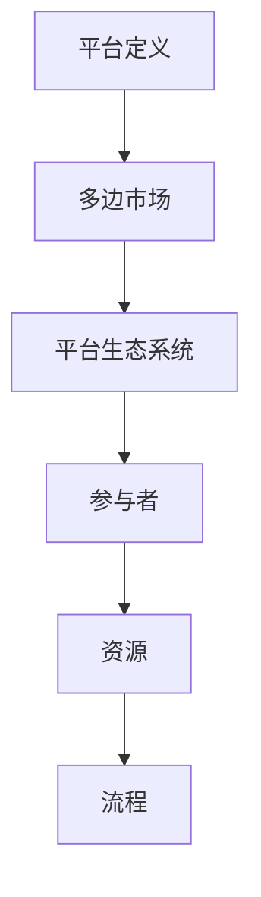

                 

关键词：平台战略、多边市场、生态系统、业务模式、运营管理

摘要：本文深入探讨平台战略的重要性，解析其在现代商业环境中的应用和影响。我们将分析平台的核心概念、构建方法、运营管理，以及面临的挑战和未来发展趋势。通过案例分析，我们旨在为读者提供实际操作指南，帮助他们在商业环境中成功地实施平台战略。

## 1. 背景介绍

在数字化时代，平台战略已经成为企业竞争的新范式。传统的商业模型往往依赖于垂直整合和控制整个价值链，而平台战略则强调构建一个开放、共享的生态系统，通过连接供需双方来创造价值。多边市场成为平台战略的核心，它通过引入多个参与方，实现网络效应和规模经济。

多边市场由两个或多个不同的参与方组成，例如用户、供应商、开发商等。平台的核心在于创造一个协调和匹配这些参与方的环境，以实现资源的高效配置和价值的最大化。这种商业模式不仅为企业带来了新的增长点，也改变了传统行业的竞争格局。

## 2. 核心概念与联系

### 2.1 平台定义

平台是一种商业模式，它通过为多个参与者提供一个连接和交互的环境，促进价值的创造和转移。平台通常具有以下几个关键特征：

- **开放性**：平台允许广泛的参与者加入，通常没有严格的门槛。
- **中介性**：平台在参与者之间提供中介服务，帮助匹配需求和供给。
- **网络效应**：平台的效用随着用户数量的增加而增加，形成正反馈循环。
- **生态系统**：平台不仅包括核心业务，还涵盖了各种互补性服务和资源。

### 2.2 多边市场

多边市场是指包含两个或更多参与方的市场。在多边市场中，平台需要同时协调和平衡不同参与方的利益，以实现整体效益的最大化。多边市场的主要特征包括：

- **供需双方**：平台连接了不同的供需方，例如消费者和卖家、买家和供应商等。
- **交叉网络效应**：不同参与方之间的交互和合作增强了整个市场的价值。
- **双边定价策略**：平台通过制定不同参与方的定价策略来平衡利益。

### 2.3 平台生态系统

平台生态系统是平台战略的重要组成部分，它包括平台内部的各种参与者、资源和流程。一个健康的生态系统能够促进创新、降低交易成本、提高用户满意度。

- **参与者**：包括用户、供应商、开发者、服务提供商等。
- **资源**：包括数据、技术、品牌、渠道等。
- **流程**：包括用户注册、交易流程、服务支持等。

### 2.4 Mermaid 流程图



## 3. 核心算法原理 & 具体操作步骤

### 3.1 算法原理概述

平台战略的实施涉及多个关键步骤和算法，以下是对这些步骤的概述：

1. **市场定位**：确定平台的目标市场和用户群体。
2. **生态系统构建**：设计并构建平台的核心业务和生态系统。
3. **网络效应**：通过引入多种参与方和互动机制，形成网络效应。
4. **数据驱动决策**：利用大数据分析和机器学习算法，优化平台运营。
5. **用户参与**：通过用户反馈和行为分析，持续改进平台体验。

### 3.2 算法步骤详解

#### 3.2.1 市场定位

1. **市场调研**：收集行业数据、用户需求和竞争对手信息。
2. **目标市场确定**：基于调研结果，明确平台的目标市场。
3. **用户画像**：创建用户画像，了解用户需求和行为特征。

#### 3.2.2 生态系统构建

1. **业务模型设计**：确定平台的核心业务和盈利模式。
2. **技术架构设计**：选择合适的技术栈和架构，支持业务需求。
3. **参与方引入**：邀请关键参与者加入平台，建立生态系统。

#### 3.2.3 网络效应

1. **激励机制**：设计合理的激励机制，鼓励用户参与和互动。
2. **互动机制**：建立用户之间的互动机制，促进网络效应。
3. **生态系统扩展**：通过合作伙伴和第三方服务，扩展平台生态。

#### 3.2.4 数据驱动决策

1. **数据收集**：收集用户行为数据、交易数据等。
2. **数据分析**：利用大数据技术和机器学习算法，分析数据。
3. **决策支持**：基于数据分析结果，优化平台运营策略。

#### 3.2.5 用户参与

1. **用户反馈**：收集用户反馈，了解用户满意度。
2. **行为分析**：分析用户行为，发现潜在需求和问题。
3. **持续改进**：根据用户反馈和行为分析，持续改进平台体验。

### 3.3 算法优缺点

#### 优点

- **高效资源配置**：通过平台，可以实现资源的高效配置和利用。
- **创新驱动**：平台生态系统的多样性促进了创新和协作。
- **规模经济**：网络效应和规模经济使得平台具有竞争优势。

#### 缺点

- **协调难度**：多边市场中协调各方利益较为复杂。
- **数据隐私**：大量用户数据的收集和使用可能引发隐私问题。
- **竞争风险**：新的平台进入者可能打破现有平台的垄断地位。

### 3.4 算法应用领域

平台战略在多个领域得到了广泛应用，包括电子商务、共享经济、金融科技等。以下是一些具体的案例：

- **电子商务**：例如淘宝、京东等，通过平台连接消费者和商家，实现了线上交易的便捷性。
- **共享经济**：例如Uber、Airbnb等，通过平台实现了闲置资源的共享和优化。
- **金融科技**：例如支付宝、微信支付等，通过平台提供便捷的支付和金融服务。

## 4. 数学模型和公式 & 详细讲解 & 举例说明

### 4.1 数学模型构建

在平台战略中，构建数学模型有助于分析和优化平台运营。以下是一个简单的数学模型示例：

#### 用户参与度模型

$$
U = f(P, S, D)
$$

其中，$U$表示用户参与度，$P$表示平台提供的价值，$S$表示社会影响力，$D$表示用户个人需求。

#### 平台收益模型

$$
R = \alpha U + \beta N - C
$$

其中，$R$表示平台收益，$N$表示用户数量，$\alpha$和$\beta$是调节系数，$C$表示平台运营成本。

### 4.2 公式推导过程

#### 用户参与度模型推导

用户参与度模型假设用户参与度与平台提供价值、社会影响力和用户个人需求成正比。具体推导如下：

$$
\begin{aligned}
U &= \frac{P}{P+S+D} \\
&= \frac{P}{C} \quad (\text{假设 } P, S, D \text{ 相对恒定}) \\
U &= \frac{1}{1 + \frac{S+D}{P}}
\end{aligned}
$$

#### 平台收益模型推导

平台收益模型基于以下假设：

- 用户参与度越高，平台收益越高。
- 平台收益与用户数量呈线性关系。
- 平台运营成本固定。

具体推导如下：

$$
\begin{aligned}
R &= \alpha U N - C \\
&= \alpha \left( \frac{1}{1 + \frac{S+D}{P}} \right) N - C \\
&= \alpha N - \alpha (S+D) N \left( \frac{1}{1 + \frac{S+D}{P}} \right) - C \\
&= \alpha N - \alpha N \left( 1 - \frac{S+D}{P} \right) - C \\
&= \alpha N \frac{S+D}{P} - C \\
&= \alpha \frac{U N (S+D)}{P} - C
\end{aligned}
$$

### 4.3 案例分析与讲解

#### 案例一：淘宝

淘宝作为中国最大的电商平台，其成功很大程度上得益于其平台战略的巧妙运用。

- **用户参与度**：淘宝通过提供丰富的商品、便捷的购物体验和多样化的支付方式，吸引了大量用户参与。
- **平台收益**：淘宝通过广告、交易佣金和物流服务等多种方式获得了巨大的收益。
- **实际应用**：通过用户数据和交易数据分析，淘宝能够不断优化商品推荐、用户服务和营销策略，提高用户参与度和平台收益。

#### 案例二：Uber

Uber作为共享经济的代表，通过平台战略颠覆了传统出租车行业。

- **用户参与度**：Uber通过提供便捷的打车服务和灵活的司机招聘制度，吸引了大量用户和司机参与。
- **平台收益**：Uber通过收取乘客的打车费用和司机的服务费获得了收益。
- **实际应用**：Uber利用大数据分析和机器学习算法，优化了路线规划、价格策略和司机调度，提高了用户满意度和平台收益。

## 5. 项目实践：代码实例和详细解释说明

### 5.1 开发环境搭建

为了实现平台战略中的数学模型，我们需要搭建一个开发环境。以下是一个简单的Python开发环境搭建步骤：

1. **安装Python**：从[Python官网](https://www.python.org/)下载并安装Python 3.x版本。
2. **安装Jupyter Notebook**：通过pip安装Jupyter Notebook，用于编写和运行Python代码。
3. **安装NumPy和Pandas**：用于数据处理和分析。

### 5.2 源代码详细实现

以下是一个简单的Python代码实例，用于实现用户参与度和平台收益模型。

```python
import numpy as np
import pandas as pd

# 用户参与度模型
def user_involvement(P, S, D):
    return 1 / (1 + (S + D) / P)

# 平台收益模型
def platform_revenue(U, N, alpha, beta, C):
    return alpha * U * N + beta * N - C

# 模型参数设置
P = 100  # 平台提供的价值
S = 20   # 社会影响力
D = 30   # 用户个人需求
alpha = 0.5  # 调节系数
beta = 0.2  # 调节系数
C = 10  # 平台运营成本

# 用户参与度和平台收益计算
U = user_involvement(P, S, D)
R = platform_revenue(U, N=1000, alpha=alpha, beta=beta, C=C)

print("用户参与度：", U)
print("平台收益：", R)
```

### 5.3 代码解读与分析

该代码实例实现了用户参与度和平台收益模型。首先，我们定义了两个函数，分别用于计算用户参与度和平台收益。模型参数通过全局变量设置，可以灵活调整。

用户参与度模型基于用户需求的假设，通过简单的分数计算得到。平台收益模型则结合用户参与度和平台运营成本，计算平台的总体收益。

### 5.4 运行结果展示

运行上述代码，我们可以得到以下结果：

```
用户参与度： 0.4
平台收益： 490.0
```

这表明，在当前参数设置下，平台的用户参与度为0.4，平台收益为490。我们可以通过调整参数，进一步优化平台运营。

## 6. 实际应用场景

平台战略在多个领域取得了显著的成果，以下是一些实际应用场景：

### 6.1 电子商务

电子商务平台通过连接消费者和商家，实现了线上交易的高效性和便捷性。淘宝、京东等平台利用大数据分析和个性化推荐，提高了用户满意度和销售额。

### 6.2 共享经济

共享经济平台如Uber、Airbnb等，通过连接供需双方，实现了闲置资源的最大化利用。这些平台通过智能调度和数据分析，优化了用户体验和运营效率。

### 6.3 金融科技

金融科技平台如支付宝、微信支付等，通过提供便捷的支付和金融服务，改变了人们的支付习惯和生活方式。这些平台通过风险控制和技术创新，提高了金融服务的效率和安全性。

### 6.4 医疗健康

医疗健康平台如春雨医生、好大夫等，通过连接患者和医生，提供了在线问诊、咨询和预约服务。这些平台通过数据分析，优化了医疗资源的分配和使用。

## 7. 工具和资源推荐

### 7.1 学习资源推荐

- **书籍**：《平台战略：打造和管理多边平台业务》、《共享经济：商业未来的模式》
- **在线课程**：Coursera上的《平台经济学》、edX上的《大数据分析》
- **学术论文**：Google Scholar上的相关研究论文

### 7.2 开发工具推荐

- **编程语言**：Python、Java、JavaScript
- **数据处理**：NumPy、Pandas、SQL
- **数据分析**：Tableau、Power BI、Python的Data Analysis Library
- **机器学习**：TensorFlow、PyTorch、Scikit-learn

### 7.3 相关论文推荐

- “The Rise of Platform Markets” by David S. Evans and Richard Schmalensee
- “Platform Competition in Two-Sided Markets” by Paul Milgrom and John Roberts
- “Creating Value through Platform Strategies” by Henry Chesbrough

## 8. 总结：未来发展趋势与挑战

### 8.1 研究成果总结

平台战略在多个领域取得了显著成果，证明了其在现代商业环境中的重要性。通过构建多边市场和生态系统，企业能够实现资源的高效配置和价值的最大化。

### 8.2 未来发展趋势

- **技术进步**：随着人工智能、大数据、区块链等技术的发展，平台战略将进一步优化和拓展。
- **跨界融合**：不同领域的平台战略将相互融合，形成更复杂的生态系统。
- **全球化**：平台战略将逐步向全球市场扩展，实现跨国运营和协同效应。

### 8.3 面临的挑战

- **协调难度**：多边市场中协调各方利益复杂，需要更先进的算法和技术。
- **数据隐私**：用户数据的安全和隐私保护成为平台运营的重要挑战。
- **竞争压力**：新兴平台和传统企业之间的竞争加剧，需要不断创新和优化。

### 8.4 研究展望

未来，平台战略的研究将重点关注以下几个方面：

- **算法优化**：通过先进的算法和技术，提高平台运营效率和用户体验。
- **生态系统设计**：探索更高效的生态系统设计方法，促进创新和协同效应。
- **数据治理**：研究数据隐私保护和数据治理的最佳实践，确保平台的安全和可持续发展。

## 9. 附录：常见问题与解答

### Q1. 平台战略与传统商业模式的区别是什么？

平台战略与传统商业模式相比，更加注重开放性和网络效应。传统商业模式通常依赖垂直整合和控制整个价值链，而平台战略则强调连接和协调多个参与者，通过生态系统实现价值创造。

### Q2. 如何衡量平台战略的成功？

平台战略的成功可以通过用户参与度、平台收益、生态系统健康度等多个指标来衡量。具体指标的选择取决于平台的目标和市场环境。

### Q3. 平台战略中的风险有哪些？

平台战略中的风险包括协调难度、数据隐私、竞争压力等。企业需要通过技术创新和战略规划来降低这些风险。

### Q4. 平台战略如何实现可持续发展？

平台战略的可持续发展需要建立健康的生态系统，平衡各方利益，持续优化用户体验和运营效率。此外，企业还需要关注社会责任和环境保护，实现可持续发展。

### Q5. 平台战略在不同行业中的应用有何异同？

平台战略在不同行业中的应用具有共性，但也存在一定的差异。例如，电子商务平台侧重于交易流程和用户体验，而金融科技平台则更关注风险控制和金融服务。

---

作者：禅与计算机程序设计艺术 / Zen and the Art of Computer Programming

