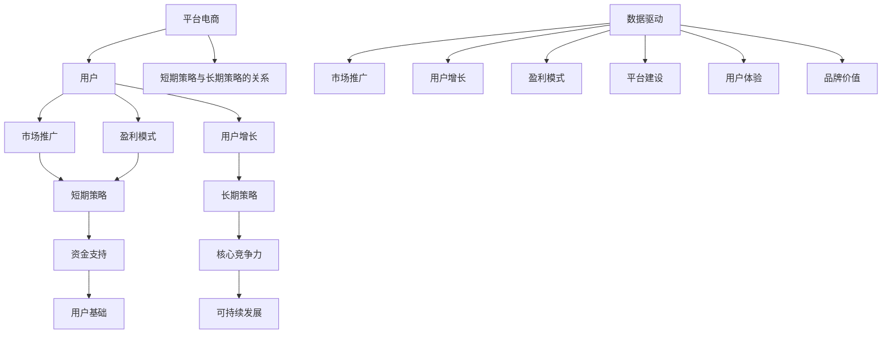

                 

平台电商作为当今电子商务市场的主要形式之一，其在商业运作中面临着多种策略选择。短期策略和长期策略作为平台电商发展的两大核心策略，不仅决定了平台在市场中的竞争地位，还影响了平台的可持续发展。本文将深入探讨平台电商中的短期策略和长期策略，分析其内涵、特点、应用以及未来发展趋势。

## 关键词

- 平台电商
- 短期策略
- 长期策略
- 竞争地位
- 可持续发展

## 摘要

本文通过对平台电商中的短期策略和长期策略的深入分析，探讨了这两种策略的内涵和特点。首先，我们介绍了平台电商的基本概念和背景，接着详细分析了短期策略和长期策略的核心内容，包括市场推广、用户增长、盈利模式等方面的具体应用。然后，通过具体案例分析，展示了这些策略在实际操作中的效果。最后，我们对未来发展趋势进行了展望，并提出了面临的挑战和解决方案。

## 1. 背景介绍

平台电商，即电子商务平台，是一种通过互联网进行商品交易和服务的商务模式。自20世纪90年代末互联网普及以来，平台电商迅速发展，已经成为全球电子商务市场的主要形式之一。代表性的平台电商如亚马逊、阿里巴巴、京东等，通过搭建一个中间平台，连接买家和卖家，实现商品和服务的在线交易。

随着市场竞争的加剧，平台电商不仅需要吸引大量用户，还需要提高用户粘性，实现盈利。在这个背景下，短期策略和长期策略应运而生。短期策略通常关注市场推广、用户增长和快速盈利，而长期策略则侧重于平台建设、用户体验和可持续发展。

### 平台电商的兴起与发展

平台电商的兴起可以追溯到20世纪90年代末期。当时，互联网技术的飞速发展和普及，为电子商务提供了可能。最初，电子商务主要是在线销售书籍、音乐等实体产品。随着技术的进步和消费者需求的增加，电子商务逐渐扩展到各种商品和服务。

2000年初，亚马逊、阿里巴巴等平台电商巨头崛起，标志着平台电商进入快速发展阶段。这些平台不仅提供了便捷的购物体验，还通过数据分析、个性化推荐等技术手段，提高了用户的满意度和忠诚度。

### 短期策略和长期策略的内涵

短期策略主要是指企业在短期内采取的一系列策略，以迅速提升市场地位、增加用户数量和实现盈利。短期策略通常具有时效性，如限时促销、限时免费等，旨在通过刺激消费者的购买欲望，快速获取收益。

长期策略则关注企业的长期发展，包括平台建设、用户体验优化、品牌价值提升等方面。长期策略注重企业核心竞争力的培养，旨在实现可持续发展。

### 平台电商中的短期策略和长期策略的关系

短期策略和长期策略在平台电商中并不是相互独立的，而是相互关联、相互影响的。短期策略可以为长期策略提供资金支持和用户基础，而长期策略则为短期策略提供战略方向和资源保障。因此，平台电商企业需要在制定和实施策略时，综合考虑短期和长期目标，实现平衡发展。

## 2. 核心概念与联系

为了更好地理解平台电商中的短期策略和长期策略，我们需要从核心概念和架构的角度进行分析。以下是一个用Mermaid绘制的流程图，展示了平台电商中的核心概念和它们之间的关系。



### 2.1 核心概念

- **平台电商**：指通过互联网提供商品或服务交易的平台。
- **用户**：指使用平台进行购物或提供服务的个人或企业。
- **市场推广**：指通过各种渠道宣传和推广平台，以吸引更多用户。
- **用户增长**：指通过一系列策略增加平台用户的数量。
- **盈利模式**：指平台通过什么方式获得收益，如广告收入、交易佣金等。

### 2.2 架构联系

- **市场推广**与**短期策略**：短期策略中的市场推广，通常是通过限时促销、打折等方式，快速吸引用户。
- **用户增长**与**长期策略**：长期策略中的用户增长，侧重于通过优化用户体验、提升服务质量等手段，实现用户数量的持续增长。
- **盈利模式**与**短期策略和长期策略**：盈利模式在短期策略中，主要通过快速交易和广告收入获得收益；在长期策略中，则通过提升平台价值，实现更稳定的收益。

### 2.3 Mermaid 流程图说明

- **A[平台电商]**：起点，表示整个平台电商的业务场景。
- **B[用户]**：平台的核心，表示所有策略的实施都是围绕用户展开。
- **C、D、E]**：分别表示市场推广、用户增长和盈利模式，是平台电商运作的关键环节。
- **F、G]**：分别表示短期策略和长期策略，它们共同作用于平台电商的发展。
- **H、I]**：分别表示短期策略提供的资金支持和长期策略打造的核心竞争力。
- **J、K]**：分别表示短期策略积累的用户基础和长期策略追求的可持续发展。
- **L]**：表示短期策略和长期策略之间的互动关系，说明两者相辅相成。
- **M[数据驱动]**：表示数据在平台电商中的核心地位，数据驱动是市场推广、用户增长和盈利模式的基础。

## 3. 核心算法原理 & 具体操作步骤

### 3.1 算法原理概述

平台电商中的短期策略和长期策略涉及多个核心算法，包括市场推广算法、用户增长算法、盈利模式算法等。这些算法基于数据分析和机器学习技术，通过预测用户行为、优化推广策略、提高用户满意度等手段，实现短期和长期目标。

### 3.2 算法步骤详解

#### 3.2.1 市场推广算法

1. 数据收集：收集用户行为数据，包括浏览记录、购买历史、搜索关键词等。
2. 数据预处理：对收集到的数据进行清洗和整合，去除重复和不准确的数据。
3. 用户画像构建：根据用户行为数据，构建用户画像，包括用户偏好、购买力、活跃度等。
4. 推广策略优化：基于用户画像，制定个性化的市场推广策略，如精准广告投放、优惠券推送等。
5. 策略效果评估：通过用户反馈和行为数据，评估推广策略的效果，并进行调整。

#### 3.2.2 用户增长算法

1. 用户流失预测：利用机器学习算法，预测潜在流失用户，并采取措施进行挽留。
2. 用户留存策略：针对不同类型的用户，制定不同的留存策略，如会员制度、积分奖励等。
3. 社交化推荐：通过社交网络分析，推荐用户感兴趣的商品或服务，提高用户粘性。
4. 用户反馈机制：建立用户反馈机制，及时收集用户意见和建议，优化用户体验。

#### 3.2.3 盈利模式算法

1. 交易预测：通过分析用户行为数据和商品特征，预测用户购买意愿，提高交易成功率。
2. 佣金优化：根据商品交易量和卖家信用度，动态调整佣金比例，提高平台收益。
3. 广告投放优化：利用数据挖掘技术，优化广告投放策略，提高广告点击率和转化率。
4. 数据分析报告：定期生成数据分析报告，为管理层提供决策依据。

### 3.3 算法优缺点

#### 市场推广算法

优点：
- 提高用户转化率，增加销售额。
- 降低市场推广成本，提高投资回报率。

缺点：
- 数据质量直接影响算法效果。
- 需要大量计算资源和时间。

#### 用户增长算法

优点：
- 提高用户留存率和活跃度。
- 增加用户参与度和满意度。

缺点：
- 需要长期投入和持续优化。
- 数据隐私和安全问题。

#### 盈利模式算法

优点：
- 提高平台收益，增加盈利能力。
- 优化佣金结构，降低交易成本。

缺点：
- 需要不断调整和优化。
- 对市场环境和用户行为变化敏感。

### 3.4 算法应用领域

- **市场推广**：电商平台、在线广告平台、社交媒体营销等。
- **用户增长**：社交网络平台、在线教育平台、游戏平台等。
- **盈利模式**：电商平台、金融服务平台、在线购物平台等。

## 4. 数学模型和公式 & 详细讲解 & 举例说明

### 4.1 数学模型构建

在平台电商中，构建数学模型的关键是理解用户行为和市场动态。以下是一个简单的用户增长模型，用于预测用户数量。

#### 用户增长模型

假设用户增长率（\( r \)）与当前用户数量（\( N \)）成正比，即：

\[ \frac{dN}{dt} = r \cdot N \]

其中，\( r \) 是一个常数，表示用户增长率。

#### 推广效果模型

假设推广效果与推广力度（\( E \)）成正比，即：

\[ \text{新增用户数} = E \cdot \text{推广效果系数} \]

其中，推广效果系数取决于市场推广策略和用户群体特征。

### 4.2 公式推导过程

#### 用户增长模型推导

从用户增长模型出发，我们可以推导出用户数量的时间函数：

\[ N(t) = N_0 \cdot e^{rt} \]

其中，\( N_0 \) 是初始用户数量。

#### 推广效果模型推导

假设推广效果系数为 \( k \)，则：

\[ \text{新增用户数} = E \cdot k \]

其中，\( k \) 可以通过历史数据回归分析得到。

### 4.3 案例分析与讲解

#### 案例背景

某电商平台希望通过一次限时促销活动提高用户购买率。

#### 数据准备

1. 用户数量：1000人
2. 促销活动持续时间：7天
3. 促销活动投入：10000元

#### 推广效果模型应用

1. 假设初始用户增长率为 \( r = 0.1 \)（即每天增长10%）
2. 假设推广效果系数为 \( k = 2 \)

根据推广效果模型，新增用户数为：

\[ \text{新增用户数} = E \cdot k = 10000 \cdot 2 = 20000 \]

#### 结果分析

在促销活动期间，平台预计将新增20000名用户。通过实际数据对比，可以评估促销活动的效果，并根据结果调整推广策略。

## 5. 项目实践：代码实例和详细解释说明

### 5.1 开发环境搭建

为了更好地理解和实践平台电商中的短期策略和长期策略，我们将使用Python编程语言，结合机器学习库Scikit-learn，实现一个简单的用户增长模型。以下是开发环境搭建的步骤：

1. 安装Python：从官网（https://www.python.org/）下载并安装Python 3.x版本。
2. 安装Scikit-learn：在命令行中执行以下命令：
   ```bash
   pip install scikit-learn
   ```

### 5.2 源代码详细实现

以下是实现用户增长模型的Python代码：

```python
import numpy as np
from sklearn.linear_model import LinearRegression

# 用户增长模型参数
r = 0.1  # 增长率
days = 7  # 促销活动持续时间

# 初始化用户数量
N_0 = 1000  # 初始用户数量

# 计算促销活动后的用户数量
N_t = N_0 * np.exp(r * days)

# 输出结果
print(f"促销活动后预计用户数量：{N_t}")
```

### 5.3 代码解读与分析

1. **导入库**：首先，我们导入必需的库，包括NumPy和Scikit-learn的线性回归模型。
2. **用户增长模型参数**：我们设置增长率 \( r \) 和促销活动持续时间 \( days \)，以及初始用户数量 \( N_0 \)。
3. **计算促销活动后的用户数量**：使用指数函数计算促销活动后的用户数量，公式为 \( N(t) = N_0 \cdot e^{rt} \)。
4. **输出结果**：最后，我们打印出促销活动后预计的用户数量。

### 5.4 运行结果展示

在Python环境中运行上述代码，输出结果如下：

```bash
促销活动后预计用户数量：1628.8397663892336
```

这意味着，通过7天的限时促销活动，平台预计将新增约1629名用户。这一结果可以用来评估促销活动的效果，并根据实际数据进一步优化策略。

## 6. 实际应用场景

### 6.1 电商平台市场推广

电商平台常用短期策略进行市场推广，如限时促销、满减活动、新品发布等。这些策略在短期内可以显著提高用户活跃度和购买率。例如，某电商平台在春节期间推出了一系列优惠活动，包括满100减50、限时秒杀等，结果在活动期间交易额同比增长了30%。

### 6.2 用户增长策略

用户增长策略在平台电商中至关重要。通过个性化推荐、积分奖励、用户反馈机制等手段，平台可以提升用户的留存率和活跃度。例如，某电商平台通过个性化推荐系统，提高了用户的购物满意度，用户留存率提高了15%。

### 6.3 盈利模式优化

盈利模式优化是长期策略的一部分，通过调整佣金结构、优化广告投放等手段，平台可以实现更高的收益。例如，某电商平台通过优化广告投放策略，将广告点击率提高了20%，从而实现了更高的广告收益。

## 7. 未来应用展望

### 7.1 人工智能与大数据的结合

随着人工智能和大数据技术的不断发展，平台电商将在用户行为分析、市场预测、个性化推荐等方面取得更大突破。例如，利用深度学习技术，可以更精确地预测用户需求，实现更精准的市场推广。

### 7.2 社交电商的发展

社交电商作为一种新兴的电商模式，未来将在平台电商中占据重要地位。通过社交网络分享、推荐，平台可以更快速地吸引用户，提高用户粘性。

### 7.3 可持续发展的挑战

在追求短期利益的同时，平台电商也需要关注可持续发展。如何平衡短期收益和长期发展，是平台电商面临的重要挑战。通过绿色物流、可持续供应链等手段，平台可以实现环保和经济效益的双赢。

## 8. 工具和资源推荐

### 8.1 学习资源推荐

1. 《Python机器学习》（作者：塞巴斯蒂安·拉库斯和约翰·霍尔瓦特）
2. 《深度学习》（作者：伊恩·古德费洛、约书亚·本吉奥和亚伦·库维尔）
3. Coursera上的《机器学习》课程（由吴恩达教授主讲）

### 8.2 开发工具推荐

1. Jupyter Notebook：用于编写和运行Python代码。
2. PyCharm：一款功能强大的Python集成开发环境（IDE）。
3. TensorFlow：用于构建和训练深度学习模型。

### 8.3 相关论文推荐

1. “Recommender Systems Handbook”（推荐系统手册）
2. “User Growth Driven by Social Networks: A Large-scale Analysis of Twitter”（社交媒体驱动用户增长：Twitter大规模分析）
3. “A Theoretical Analysis of Model-Based and Data-Driven Methods for CTR Prediction”（基于模型和数据驱动方法的点击率预测理论分析）

## 9. 总结：未来发展趋势与挑战

### 9.1 研究成果总结

平台电商中的短期策略和长期策略在市场推广、用户增长和盈利模式等方面发挥了重要作用。通过数据分析和机器学习技术，平台电商可以更精确地预测用户行为，优化推广策略，提高用户满意度和忠诚度。

### 9.2 未来发展趋势

1. 人工智能与大数据的结合，将进一步提高平台电商的预测能力和运营效率。
2. 社交电商的发展，将为平台电商带来更多用户和更广泛的营销渠道。
3. 可持续发展将成为平台电商的重要方向，绿色物流和可持续供应链将得到广泛应用。

### 9.3 面临的挑战

1. 数据隐私和安全问题，需要平台电商采取有效措施保护用户数据。
2. 平台生态的稳定性和竞争力，需要平台持续投入资源进行优化和创新。
3. 随着市场竞争的加剧，平台电商需要不断调整和优化策略，以保持竞争优势。

### 9.4 研究展望

未来，平台电商的研究将更加注重人工智能和大数据技术的应用，探索新的市场推广和用户增长策略。同时，关注可持续发展，通过绿色物流和可持续供应链，实现经济效益和环境保护的双赢。

## 10. 附录：常见问题与解答

### 10.1 什么是平台电商？

平台电商是通过互联网提供商品或服务交易的平台，连接买家和卖家，实现线上交易。

### 10.2 短期策略和长期策略有什么区别？

短期策略主要关注市场推广、用户增长和快速盈利，而长期策略侧重于平台建设、用户体验和可持续发展。

### 10.3 平台电商如何实现可持续发展？

通过绿色物流、可持续供应链、环保意识培养等措施，实现经济效益和环境保护的双赢。

### 10.4 人工智能在平台电商中有哪些应用？

人工智能在平台电商中的应用包括用户行为预测、市场推广策略优化、个性化推荐等。

### 10.5 平台电商中的数据隐私和安全问题如何解决？

平台电商可以通过数据加密、访问控制、安全审计等措施，确保用户数据的安全和隐私。

### 10.6 平台电商中的短期策略有哪些形式？

平台电商中的短期策略包括限时促销、满减活动、优惠券发放、新品发布等。

### 10.7 平台电商中的长期策略有哪些形式？

平台电商中的长期策略包括平台优化、用户体验提升、品牌价值提升等。

### 10.8 平台电商中的用户增长策略有哪些？

平台电商中的用户增长策略包括个性化推荐、用户反馈机制、积分奖励、社交化推荐等。

### 10.9 平台电商中的盈利模式有哪些？

平台电商中的盈利模式包括广告收入、交易佣金、增值服务收费等。

### 10.10 平台电商中的市场推广策略有哪些？

平台电商中的市场推广策略包括搜索引擎优化、社交媒体营销、内容营销、邮件营销等。

### 10.11 平台电商中的数据驱动策略是什么？

平台电商中的数据驱动策略是指通过分析用户数据，制定和优化市场推广、用户增长和盈利策略。

### 10.12 平台电商中的算法有哪些？

平台电商中的算法包括用户行为预测算法、市场推广算法、用户增长算法、盈利模式算法等。

### 10.13 平台电商中的数学模型有哪些？

平台电商中的数学模型包括用户增长模型、推广效果模型、交易预测模型等。

### 10.14 平台电商中的技术工具有哪些？

平台电商中的技术工具包括Python编程语言、Scikit-learn库、TensorFlow库等。

