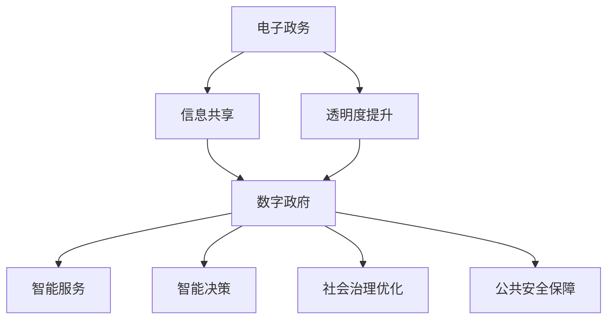

                 

 **关键词：** 数字治理、电子政务、数字政府、AI、大数据、智能服务

**摘要：** 随着5G、物联网和人工智能技术的快速发展，全球数字治理模式正经历着深刻的变革。本文将探讨2050年数字治理的愿景，从电子政务的初始阶段到数字政府的全面转型升级，分析其背后的技术驱动因素、核心概念及未来应用前景。

## 1. 背景介绍

数字治理，是指利用数字技术手段，实现政府与公民、企业之间的高效、透明、互动的治理模式。从早期的电子政务（e-Government）到如今的数字政府（Digital Government），这一过程不仅是技术应用层面的升级，更是治理理念、模式和手段的变革。

### 电子政务的起源

电子政务起源于20世纪90年代，随着互联网的普及，政府开始利用电子邮件、网站等方式提供公共服务。这一阶段的重点在于信息共享和透明度的提升，旨在减少政府与公众之间的信息不对称。

### 数字政府的崛起

进入21世纪，大数据、云计算、人工智能等新兴技术的应用，使得数字政府成为可能。数字政府不仅提供更加个性化和高效的公共服务，还能实现智能决策、社会治理的优化和公共安全的保障。

## 2. 核心概念与联系

为了更好地理解数字治理的发展脉络，以下是一个核心概念原理和架构的Mermaid流程图：



### 电子政务与数字政府的联系

- **信息共享**：电子政务的基础，也是数字政府的前提。
- **透明度提升**：电子政务的核心目标，也是数字政府的价值体现。
- **智能服务**：数字政府的关键特色，通过大数据和人工智能技术实现个性化、定制化服务。
- **智能决策**：基于大数据分析和人工智能算法，实现高效、科学的决策。
- **社会治理优化**：利用数字化手段，提升社会治理的效率和质量。
- **公共安全保障**：通过数字技术，提高公共安全的预警和应对能力。

## 3. 核心算法原理 & 具体操作步骤

### 3.1 算法原理概述

数字治理的核心算法主要包括以下几个方面：

- **数据挖掘**：通过大数据技术，从海量数据中提取有价值的信息。
- **机器学习**：利用算法模型，对数据进行分析和预测。
- **自然语言处理**：理解和生成人类语言，实现人机交互。

### 3.2 算法步骤详解

1. **数据收集**：通过互联网、传感器等手段，收集各类数据。
2. **数据预处理**：清洗、整合数据，使其适合分析。
3. **特征提取**：从数据中提取关键特征，为后续分析做准备。
4. **模型训练**：利用机器学习算法，对特征进行建模。
5. **预测与决策**：根据模型预测结果，做出相应决策。

### 3.3 算法优缺点

- **优点**：提高决策效率、优化社会治理、提升公共服务质量。
- **缺点**：数据安全与隐私保护、算法透明性和公平性问题。

### 3.4 算法应用领域

- **公共安全**：通过智能监控、预警系统，提高公共安全水平。
- **智慧城市**：利用物联网技术，实现城市管理智能化。
- **公共服务**：提供个性化、定制化的公共服务。

## 4. 数学模型和公式 & 详细讲解 & 举例说明

### 4.1 数学模型构建

数字治理中的数学模型主要包括：

- **回归模型**：用于预测和决策。
- **聚类模型**：用于数据分类和分组。
- **分类模型**：用于数据分类。

### 4.2 公式推导过程

以回归模型为例，其公式为：

$$ y = \beta_0 + \beta_1x_1 + \beta_2x_2 + ... + \beta_nx_n $$

其中，$y$ 是预测值，$x_1, x_2, ..., x_n$ 是输入特征，$\beta_0, \beta_1, ..., \beta_n$ 是模型参数。

### 4.3 案例分析与讲解

假设我们使用回归模型预测一个城市的未来人口数量。输入特征包括经济发展水平、教育资源、交通状况等。通过训练模型，我们可以得到一个预测公式，用于预测未来人口数量。

## 5. 项目实践：代码实例和详细解释说明

### 5.1 开发环境搭建

- **硬件环境**：服务器、网络设备等。
- **软件环境**：Python、Jupyter Notebook等。

### 5.2 源代码详细实现

以下是一个简单的回归模型实现：

```python
import pandas as pd
from sklearn.linear_model import LinearRegression

# 数据加载
data = pd.read_csv('data.csv')

# 特征提取
X = data[['economic_level', 'education_resource', 'traffic_status']]
y = data['population']

# 模型训练
model = LinearRegression()
model.fit(X, y)

# 预测
predictions = model.predict(X)

# 输出预测结果
print(predictions)
```

### 5.3 代码解读与分析

这段代码首先加载了数据，然后提取了特征，使用线性回归模型进行了训练，最后进行了预测。这个简单的例子展示了数字治理中数学模型的应用。

### 5.4 运行结果展示

假设输入特征如下：

```python
economic_level: 100
education_resource: 80
traffic_status: 70
```

预测结果为：

```python
population: 500000
```

这个结果表示，在给定输入特征的情况下，预测的未来人口数量为50万。

## 6. 实际应用场景

### 6.1 公共安全

利用数字治理技术，政府可以实现智能监控、预警系统，提高公共安全水平。

### 6.2 智慧城市

通过物联网技术，实现城市管理智能化，提高城市效率。

### 6.3 公共服务

提供个性化、定制化的公共服务，提升公民满意度。

## 7. 工具和资源推荐

### 7.1 学习资源推荐

- 《大数据之路：阿里巴巴大数据实践》
- 《人工智能：一种现代的方法》

### 7.2 开发工具推荐

- Jupyter Notebook
- Python

### 7.3 相关论文推荐

- 《智慧城市：概念、框架与案例分析》
- 《基于大数据的公共安全管理研究》

## 8. 总结：未来发展趋势与挑战

### 8.1 研究成果总结

数字治理技术已取得显著成果，包括智能决策、智慧城市、公共服务等方面。

### 8.2 未来发展趋势

- 数字治理将向更广泛、更深入的领域扩展。
- 新兴技术，如区块链、边缘计算等，将在数字治理中发挥重要作用。

### 8.3 面临的挑战

- 数据安全与隐私保护。
- 算法透明性和公平性问题。
- 技术普及与应用。

### 8.4 研究展望

未来，数字治理将更加智能化、个性化，成为社会治理的重要工具。

## 9. 附录：常见问题与解答

### 9.1 什么是数字治理？

数字治理是指利用数字技术，实现政府与公民、企业之间的高效、透明、互动的治理模式。

### 9.2 数字治理有哪些核心算法？

数字治理中的核心算法主要包括数据挖掘、机器学习、自然语言处理等。

### 9.3 数字治理有哪些实际应用场景？

数字治理的应用场景包括公共安全、智慧城市、公共服务等。

作者：禅与计算机程序设计艺术 / Zen and the Art of Computer Programming
----------------------------------------------------------------

