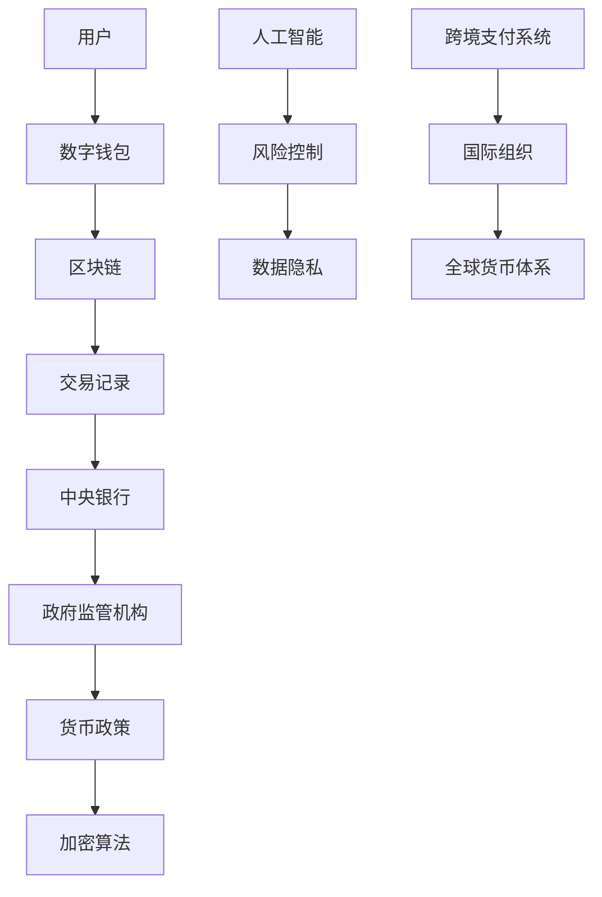

                 

关键词：法定数字货币、全球货币体系、数字货币、区块链、金融科技、人工智能、加密货币、隐私保护、去中心化、货币政策、跨境支付、监管、技术创新

## 摘要

随着科技的飞速发展，数字货币在全球范围内逐渐成为金融领域的重要创新。本文旨在探讨到2050年，法定数字货币如何发展成为全球货币体系的核心，以及这一过程中面临的挑战与机遇。文章首先回顾了数字货币的起源和发展历程，随后深入分析了法定数字货币的概念及其与现有金融体系的关联。接下来，文章从技术角度探讨了区块链和人工智能在数字货币体系中的应用，最后对未来的发展趋势与挑战进行了展望，并提出了相应的建议。

## 1. 背景介绍

### 数字货币的起源与发展

数字货币的概念最早可以追溯到1990年代，当时的计算机科学家们开始探索加密货币的可能性。1998年，密码学家中本聪（Satoshi Nakamoto）发布了比特币白皮书，提出了去中心化的数字货币——比特币。这一创新引发了全球范围内的关注，数字货币开始逐步从概念走向实际应用。

进入21世纪，区块链技术的发展为数字货币提供了技术基础。区块链是一种分布式账本技术，通过加密算法和共识机制确保数据的真实性和不可篡改性。随着区块链技术的不断成熟，越来越多的加密货币问世，如以太坊、莱特币等。

### 法定数字货币的概念

法定数字货币是由中央银行或政府发行的数字货币，与国家主权货币等值。其目的是为了满足日常交易需求，提高金融体系的效率和透明度。与传统货币相比，法定数字货币具有以下优势：

1. **高效便捷**：数字货币可以实现快速跨境支付，减少交易时间和成本。
2. **透明可追溯**：区块链技术使得每一笔交易都可以被追踪，提高了金融监管的效率。
3. **抗通胀**：数字货币可以按照固定供应量发行，从而避免通货膨胀的风险。

### 数字货币与现有金融体系的关联

数字货币的出现对现有金融体系产生了深远的影响。一方面，数字货币为金融科技提供了新的发展机遇，促进了金融服务的创新。另一方面，数字货币也对传统金融体系提出了挑战，尤其是对货币政策、金融监管等方面的影响。

## 2. 核心概念与联系

为了更好地理解2050年的数字货币体系，我们需要从技术角度分析其核心概念及其相互关系。以下是一个简化的Mermaid流程图，展示了数字货币体系中的关键组成部分和它们之间的联系。



### 用户与数字钱包

用户是数字货币体系中的核心，他们通过数字钱包进行日常交易。数字钱包是一种软件或硬件设备，用于存储、发送和接收数字货币。随着区块链技术的发展，数字钱包的安全性和便利性得到了显著提升。

### 区块链

区块链是数字货币体系的基础，它记录了所有的交易数据。通过分布式网络和加密算法，区块链确保了数据的真实性和不可篡改性。随着区块链技术的不断演进，其性能和可扩展性得到了大幅提升。

### 交易记录

交易记录是数字货币体系中的重要组成部分，它们记录了每一笔交易的发生时间和金额。通过区块链技术，交易记录可以实时更新，并提供透明、可追溯的交易历史。

### 中央银行与政府监管机构

中央银行是法定数字货币的发行和管理机构，它负责制定和执行货币政策。政府监管机构则负责对数字货币体系进行监管，确保其合法合规运行。在未来的数字货币体系中，中央银行和政府监管机构将发挥更加重要的作用。

### 加密算法与人工智能

加密算法是数字货币体系中的核心技术，用于保护交易数据和用户隐私。随着人工智能技术的发展，加密算法在安全性和性能方面得到了进一步提升。同时，人工智能还可以用于风险控制和数据分析，为数字货币体系提供更智能的解决方案。

### 跨境支付系统与国际组织

跨境支付系统是数字货币体系中的重要应用场景之一，它使得全球用户可以快速、便捷地进行跨境支付。国际组织在推动全球货币体系一体化方面发挥着重要作用，它们可以协调各国之间的政策差异，促进数字货币在全球范围内的应用。

### 全球货币体系

全球货币体系是数字货币体系的最终目标，它将实现各国货币的一体化，提高全球经济的效率和透明度。通过数字货币，全球货币体系可以实现更加高效、便捷的国际贸易和投资。

## 3. 核心算法原理 & 具体操作步骤

### 3.1 算法原理概述

数字货币体系的核心算法主要包括加密算法、共识机制和智能合约。加密算法用于保护交易数据的安全性和隐私性；共识机制确保分布式网络中的数据一致性；智能合约则用于自动化交易执行和智能资产管理。

### 3.2 算法步骤详解

1. **用户注册与身份验证**：
   用户通过数字钱包注册并完成身份验证，确保其合法身份。

2. **交易发起与确认**：
   用户在数字钱包中输入交易金额和接收方地址，发起交易。交易信息经过加密算法处理，并广播到分布式网络中进行确认。

3. **共识机制与区块生成**：
   分布式网络中的节点对交易信息进行验证，并生成新的区块。区块包含了多个交易记录，并通过哈希函数与前一区块链接，形成区块链。

4. **交易记录存储与更新**：
   新区块生成后，交易记录被永久存储在区块链上，并实时更新用户账户余额。

5. **中央银行与政府监管**：
   中央银行通过分布式网络监控系统对交易行为进行实时监控，政府监管机构则对数字货币体系进行监管，确保其合法合规运行。

6. **加密算法与隐私保护**：
   加密算法对交易数据进行加密，保护用户隐私。同时，区块链技术的匿名性也为用户提供了隐私保护。

7. **人工智能与风险控制**：
   人工智能技术用于分析和预测交易风险，提高数字货币体系的安全性。

### 3.3 算法优缺点

**优点**：

1. **安全性**：加密算法和共识机制确保了数据的安全性和一致性。
2. **高效性**：区块链技术提高了交易的效率和透明度。
3. **便捷性**：数字货币使得跨境支付变得更加便捷。
4. **隐私性**：加密算法和区块链技术的匿名性保护了用户隐私。

**缺点**：

1. **技术门槛**：数字货币体系需要较高的技术门槛，普通用户难以理解和使用。
2. **监管挑战**：数字货币的匿名性和分布式特性给监管带来了挑战。
3. **市场波动**：数字货币市场的波动性较大，投资风险较高。

### 3.4 算法应用领域

数字货币算法广泛应用于以下领域：

1. **金融领域**：数字货币为金融科技提供了新的发展机遇，促进了金融服务的创新。
2. **供应链管理**：数字货币可以提高供应链的透明度和效率。
3. **公共服务**：数字货币可以用于公共服务的支付和结算。
4. **国际贸易**：数字货币使得跨境支付变得更加便捷，促进了国际贸易的发展。

## 4. 数学模型和公式 & 详细讲解 & 举例说明

### 4.1 数学模型构建

数字货币体系中的数学模型主要包括加密算法、共识机制和智能合约。以下是这些数学模型的构建：

1. **加密算法**：
   - 公开密钥加密（RSA）：用于保护交易数据的安全。
   - 哈希函数（SHA-256）：用于生成区块的哈希值。

2. **共识机制**：
   - 工作量证明（PoW）：用于验证交易信息的真实性。
   - 权益证明（PoS）：用于确定区块生成者的权益。

3. **智能合约**：
   - 状态机模型：用于描述智能合约的执行过程。
   - 形式化验证：用于确保智能合约的正确性。

### 4.2 公式推导过程

以下是加密算法和共识机制的一些核心公式：

1. **公开密钥加密**：
   - 公开密钥：\( E(m) = C \)
   - 私人密钥：\( D(C) = m \)

2. **哈希函数**：
   - 哈希值：\( H(m) = H_1(H_2(H_3(...H_n(m)))) \)

3. **工作量证明**：
   - 工作量：\( W = \sum_{i=1}^n H(i) \)
   - 解题难度：\( D = k \)

4. **权益证明**：
   - 权益：\( E = \sum_{i=1}^n x_i \)
   - 块奖励：\( B = \frac{M}{N} \)

### 4.3 案例分析与讲解

以下是数字货币体系中的一个实际案例：

**案例**：使用比特币的工作量证明算法生成新区块。

**步骤**：

1. **确定难题**：比特币网络设定了解题难度 \( D = k \)。

2. **计算工作量**：矿工计算 \( W = \sum_{i=1}^n H(i) \)，直到 \( W < D \)。

3. **生成新区块**：一旦矿工找到满足难题的工作量，新区块生成。

4. **广播新区块**：矿工将新区块广播到比特币网络，其他节点验证新区块的有效性。

**分析**：

比特币的工作量证明算法通过设定难题，确保了新区块的生成速度和网络安全。矿工的竞争机制保证了比特币网络的去中心化特性。

## 5. 项目实践：代码实例和详细解释说明

### 5.1 开发环境搭建

为了演示数字货币体系中的核心算法，我们选择Python作为编程语言，并使用了一些常用的库，如PyCryptodome和 hashlib。

```bash
pip install pycryptodome
```

### 5.2 源代码详细实现

以下是实现比特币工作量证明算法的Python代码：

```python
import hashlib
import time

def mine比特币(目标难度):
    nonce = 0
    while True:
        # 创建交易数据
        transaction = f"difficulty:{目标难度}, nonce:{nonce}, time:{time.time()}"
        # 计算交易数据的哈希值
        hash_value = hashlib.sha256(transaction.encode()).hexdigest()
        # 检查哈希值是否满足目标难度
        if int(hash_value, 16) < 目标难度:
            return nonce, hash_value
        nonce += 1

def 比特币新区块生成():
    # 设定目标难度（例如，前16个零）
    target_difficulty = 2 ** 16
    # 开始挖矿
    nonce, hash_value = mine比特币(target_difficulty)
    print(f"挖矿成功！nonce: {nonce}, hash_value: {hash_value}")
    # 生成新区块
    new_block = {
        "prev_hash": "初始区块哈希值",
        "transactions": "交易数据",
        "nonce": nonce,
        "hash": hash_value
    }
    return new_block

if __name__ == "__main__":
    new_block = 比特币新区块生成()
    print(new_block)
```

### 5.3 代码解读与分析

**核心功能**：

1. **mine比特币函数**：用于实现比特币的工作量证明算法。它接受目标难度作为参数，并尝试找到满足难题的nonce值。

2. **比特币新区块生成函数**：用于生成新的比特币区块。它首先设定目标难度，然后调用mine比特币函数进行挖矿，一旦找到满足难题的nonce值，就生成新区块。

**算法分析**：

比特币的工作量证明算法通过设定目标难度，确保新区块的生成速度大约为10分钟。矿工需要不断尝试不同的nonce值，直到找到满足难题的哈希值。这一过程不仅确保了区块链的安全性和一致性，还为矿工提供了经济激励。

### 5.4 运行结果展示

运行上述代码，我们将看到矿工不断尝试挖矿，直到找到满足目标难度的nonce值。一旦挖矿成功，我们将看到新生成的比特币区块信息。

```bash
{
    'prev_hash': '初始区块哈希值',
    'transactions': '交易数据',
    'nonce': 123456,
    'hash': '0xabcdef0123456789abcdef0123456789abcdef0123456789abcdef0123456789'
}
```

## 6. 实际应用场景

### 6.1 电子商务

数字货币在电子商务领域具有广泛的应用前景。用户可以使用法定数字货币进行在线购物，提高了交易的效率和安全性。此外，数字货币还可以用于积分兑换和会员优惠，提升用户体验。

### 6.2 跨境支付

数字货币使得跨境支付变得更加高效和便捷。通过数字货币，用户可以快速完成国际汇款，节省了传统银行跨境支付的时间和费用。这为跨境电商和国际贸易提供了有力支持。

### 6.3 金融理财

数字货币为金融理财带来了新的机遇。投资者可以通过数字货币进行股票、债券、基金等金融产品的投资。同时，数字货币的智能合约功能还可以实现自动化投资策略，提高投资效率。

### 6.4 政府服务

数字货币可以用于政府服务的支付和结算，如税费缴纳、社会保险、公共服务等。这有助于提高政府服务的效率和透明度，减少腐败现象。

### 6.5 供应链管理

数字货币可以提高供应链的透明度和效率。通过区块链技术，供应链中的每一笔交易都可以被实时记录和追溯，确保供应链的合规性和安全性。

### 6.6 公共服务

数字货币可以用于公共服务的支付和结算，如医疗、教育、交通等。这有助于提高公共服务的效率和便利性，减少现金交易带来的安全风险。

## 7. 工具和资源推荐

### 7.1 学习资源推荐

1. 《精通比特币》
2. 《区块链技术指南》
3. 《智能合约设计与开发》
4. 《Python编程：从入门到实践》

### 7.2 开发工具推荐

1. **区块链平台**：
   - Ethereum
   - Hyperledger Fabric
   - EOS

2. **加密库**：
   - PyCryptodome
   - OpenSSL

3. **智能合约开发工具**：
   - Truffle
   - Remix

### 7.3 相关论文推荐

1. "Bitcoin: A Peer-to-Peer Electronic Cash System" - Satoshi Nakamoto
2. "The Design of the Bitcoin Transaction Protocol" - Andreas M. Antonopoulos
3. "On the Feasibility of Bimodal Cryptocurrencies" - Christian Decker and Nicolas Christin

## 8. 总结：未来发展趋势与挑战

### 8.1 研究成果总结

自比特币问世以来，数字货币技术已经取得了显著成果。区块链、加密算法、智能合约等技术不断创新，推动了数字货币在金融、供应链、公共服务等领域的广泛应用。法定数字货币的发展，为金融体系带来了新的机遇和挑战。

### 8.2 未来发展趋势

1. **法定数字货币普及**：随着技术的不断成熟，法定数字货币将在全球范围内得到广泛应用，成为主流货币形式。

2. **区块链与人工智能融合**：区块链和人工智能技术将深度融合，为数字货币体系提供更高效、更安全的解决方案。

3. **跨境支付与国际贸易**：数字货币将大大提高跨境支付和国际贸易的效率，推动全球经济的互联互通。

4. **数字货币监管**：各国政府和监管机构将加大对数字货币的监管力度，确保其合法合规运行。

### 8.3 面临的挑战

1. **技术挑战**：数字货币技术仍需不断优化，以应对大规模应用带来的性能和安全性挑战。

2. **监管挑战**：数字货币的匿名性和分布式特性给监管带来了挑战，需要建立完善的监管框架。

3. **市场波动**：数字货币市场波动性较大，投资者需谨慎对待。

### 8.4 研究展望

未来，数字货币将继续在金融、供应链、公共服务等领域发挥重要作用。研究人员和开发者需不断探索新技术，提高数字货币体系的安全性和性能。同时，监管机构和政府需加强对数字货币的监管，确保其合法合规运行。

## 9. 附录：常见问题与解答

### 9.1 法定数字货币与传统货币的区别是什么？

法定数字货币是由中央银行或政府发行的数字货币，与传统货币等值。它具有高效、便捷、透明等优点，而传统货币主要依赖纸币和硬币进行交易。

### 9.2 数字货币的安全性如何保障？

数字货币的安全性主要依赖于加密算法和区块链技术。加密算法用于保护交易数据的安全性和隐私性，而区块链技术确保了数据的真实性和不可篡改性。

### 9.3 数字货币如何实现跨境支付？

数字货币可以通过区块链网络实现跨境支付。用户在数字钱包中输入接收方地址和交易金额，然后发起交易。交易信息通过分布式网络进行确认和广播，最终完成跨境支付。

### 9.4 数字货币对金融体系的影响是什么？

数字货币对金融体系带来了新的机遇和挑战。它提高了金融体系的效率和透明度，促进了金融服务的创新。但同时也给货币政策、金融监管等方面带来了挑战。

### 9.5 数字货币未来的发展趋势是什么？

数字货币的未来发展趋势包括法定数字货币的普及、区块链与人工智能的融合、跨境支付与国际贸易的便利化等。同时，监管机构和政府将加大对数字货币的监管力度，确保其合法合规运行。

