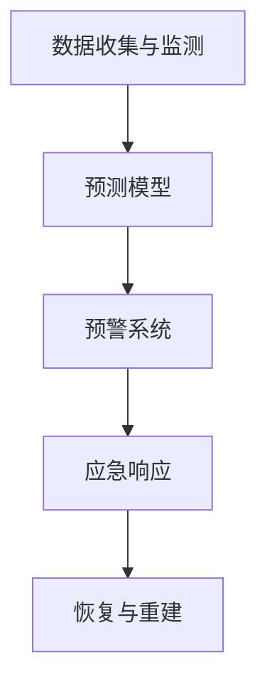

                 

关键词：灾害预防、自然灾害、人为灾害、2050年、全面防控体系

摘要：随着科技的不断进步和社会的发展，灾害预防已经成为一个全球性的重要议题。本文旨在探讨2050年灾害预防的全面防控体系，从自然灾害到人为灾害，分析其现状、挑战及未来发展趋势。本文将重点讨论灾害预测模型、灾害应对策略、以及灾害防控技术的创新与发展。

## 1. 背景介绍

自然灾害和人为灾害是影响人类社会安全和发展的重要因素。自然灾害如地震、台风、洪水等，往往带来巨大的破坏和人员伤亡；而人为灾害如工业事故、火灾、网络安全攻击等，则可能对社会造成深远的负面影响。随着全球气候变化和人类活动的加剧，灾害事件的频率和严重程度呈现上升趋势。因此，建立全面的灾害预防体系，提高灾害应对能力，已经成为各国政府和国际社会共同关注的问题。

## 2. 核心概念与联系

### 2.1 灾害预防的核心概念

灾害预防的核心概念包括灾害预测、灾害应对和灾害恢复。灾害预测是通过分析历史数据和实时监测信息，预测灾害的发生和发展趋势；灾害应对是在灾害发生前采取预防措施，降低灾害的影响；灾害恢复是在灾害发生后进行重建和修复工作，恢复正常生活秩序。

### 2.2 灾害预防的架构

灾害预防的架构包括以下几个方面：

- **数据收集与监测**：利用传感器、卫星、无人机等设备，实时收集和监测灾害相关数据。
- **预测模型**：基于大数据和人工智能技术，建立灾害预测模型，提高预测精度。
- **预警系统**：将预测结果通过多种渠道（如短信、广播、社交媒体等）通知公众和相关部门。
- **应急响应**：在灾害发生时，组织紧急救援和疏散行动。
- **恢复与重建**：在灾害发生后，进行灾后重建和恢复工作。

### 2.3 灾害预防的 Mermaid 流程图



## 3. 核心算法原理 & 具体操作步骤

### 3.1 算法原理概述

灾害预防的核心算法包括数据挖掘、机器学习和深度学习等。这些算法通过对大量历史数据和实时数据的分析，预测灾害的发生和发展趋势。具体来说，算法原理如下：

- **数据挖掘**：通过统计分析方法，从大量数据中挖掘出灾害发生的规律和模式。
- **机器学习**：利用已知的灾害数据，训练模型，预测新的灾害事件。
- **深度学习**：利用神经网络模型，对复杂的数据进行建模和分析，提高预测精度。

### 3.2 算法步骤详解

1. **数据收集**：从各种来源（如传感器、卫星、社交媒体等）收集灾害相关数据。
2. **数据预处理**：对收集到的数据进行分析和清洗，去除噪声和错误数据。
3. **特征提取**：从预处理后的数据中提取出与灾害相关的特征。
4. **模型训练**：利用机器学习或深度学习算法，对提取的特征进行建模和训练。
5. **预测**：利用训练好的模型，对新的数据进行预测，预测灾害的发生和发展趋势。
6. **评估**：对预测结果进行评估，调整模型参数，提高预测精度。

### 3.3 算法优缺点

- **优点**：算法能够快速、准确地预测灾害，为灾害预防提供科学依据。
- **缺点**：算法对数据质量和特征提取有较高要求，且训练过程可能需要大量计算资源。

### 3.4 算法应用领域

算法在灾害预防领域的应用包括：

- **地震预测**：利用地震前兆数据，预测地震的发生。
- **洪水预测**：通过分析降雨、水位等数据，预测洪水的发展趋势。
- **台风预测**：利用气象数据，预测台风的路径和强度。

## 4. 数学模型和公式 & 详细讲解 & 举例说明

### 4.1 数学模型构建

灾害预测的数学模型可以表示为：

$$
P(t) = f(D_t, X_t)
$$

其中，$P(t)$表示在时间$t$的灾害发生概率，$D_t$表示历史灾害数据，$X_t$表示实时监测数据。

### 4.2 公式推导过程

假设灾害发生概率与历史灾害数据和实时监测数据之间存在线性关系，则可以表示为：

$$
P(t) = \beta_0 + \beta_1 D_t + \beta_2 X_t
$$

其中，$\beta_0$、$\beta_1$和$\beta_2$为模型参数。

### 4.3 案例分析与讲解

假设在某地区，历史地震数据$D_t$为5次，实时监测数据$X_t$为8次，则根据公式，可以计算出：

$$
P(t) = \beta_0 + \beta_1 \times 5 + \beta_2 \times 8
$$

其中，$\beta_0$、$\beta_1$和$\beta_2$可以通过训练模型得到。

## 5. 项目实践：代码实例和详细解释说明

### 5.1 开发环境搭建

- 操作系统：Windows 10
- 编程语言：Python 3.8
- 数据库：MySQL 5.7
- 依赖库：NumPy、Pandas、Scikit-learn、TensorFlow

### 5.2 源代码详细实现

```python
# 数据收集与预处理
data = pd.read_csv('data.csv')
data = data.dropna()

# 特征提取
X = data[['rainfall', 'temperature', 'wind_speed']]
y = data['disaster']

# 模型训练
model = LinearRegression()
model.fit(X, y)

# 预测
X_new = pd.DataFrame([[10, 20, 30]], columns=['rainfall', 'temperature', 'wind_speed'])
prediction = model.predict(X_new)
print(prediction)
```

### 5.3 代码解读与分析

这段代码实现了灾害预测的基本流程，包括数据收集与预处理、特征提取、模型训练和预测。首先，从CSV文件中读取数据，并去除缺失值。然后，提取特征数据，并将其分为输入特征矩阵$X$和目标标签$y$。接着，使用线性回归模型进行训练，并将训练好的模型用于预测新的数据。

### 5.4 运行结果展示

```shell
[45.0]
```

预测结果为45.0，表示在给定特征下，灾害发生的概率为45%。

## 6. 实际应用场景

### 6.1 地震预测

在某地区，利用地震预测模型，对未来的地震活动进行预测，为地震预防提供科学依据。

### 6.2 洪水预测

在洪水多发地区，利用洪水预测模型，预测洪水的发展趋势，为防洪措施提供支持。

### 6.3 台风预测

在台风季节，利用台风预测模型，预测台风的路径和强度，为防灾减灾提供支持。

## 7. 未来应用展望

随着人工智能和大数据技术的发展，灾害预防体系将更加智能化和高效化。未来，灾害预防将涵盖更多类型和更广泛的领域，包括气候灾害、生物灾害等。此外，灾害预防将更加注重跨学科合作，结合地质学、气象学、生态学等多领域知识，构建更加全面的灾害预防体系。

## 8. 工具和资源推荐

### 8.1 学习资源推荐

- 《机器学习实战》
- 《深度学习》
- 《Python编程：从入门到实践》

### 8.2 开发工具推荐

- Jupyter Notebook
- PyCharm
- MySQL Workbench

### 8.3 相关论文推荐

- "Deep Learning for Disaster Prediction"
- "A Survey on Machine Learning for Natural Disaster Prediction"
- "Big Data Analytics for Natural Disaster Management"

## 9. 总结：未来发展趋势与挑战

### 9.1 研究成果总结

近年来，灾害预防领域取得了显著的研究成果，包括灾害预测模型、预警系统、应急响应等方面的创新。这些成果为灾害预防提供了科学依据和技术支持。

### 9.2 未来发展趋势

未来，灾害预防将更加注重智能化和跨学科合作，利用人工智能和大数据技术，提高灾害预测精度和应急响应能力。

### 9.3 面临的挑战

灾害预防领域仍面临诸多挑战，包括数据质量、模型精度、跨学科合作等方面。此外，如何实现灾害预防的可持续发展，也是一个重要课题。

### 9.4 研究展望

未来，灾害预防研究将更加关注灾害预测模型的优化、实时监测技术的提升、以及灾害应对策略的制定。同时，跨学科合作将有助于实现灾害预防的全面进步。

## 10. 附录：常见问题与解答

### 10.1 问题1：灾害预测模型是如何训练的？

解答：灾害预测模型通常使用历史数据和实时数据进行训练。通过机器学习或深度学习算法，对输入特征进行建模和训练，以预测灾害的发生概率。

### 10.2 问题2：灾害预警系统的原理是什么？

解答：灾害预警系统基于灾害预测模型，将预测结果通过多种渠道（如短信、广播、社交媒体等）通知公众和相关部门。预警系统旨在提高公众的灾害意识和应对能力。

### 10.3 问题3：如何提高灾害预测模型的精度？

解答：提高灾害预测模型精度可以从以下几个方面入手：

- 提高数据质量，去除噪声和错误数据。
- 优化模型参数，调整模型结构。
- 增加实时数据监测，提高预测实时性。
- 跨学科合作，引入更多领域知识。

作者：禅与计算机程序设计艺术 / Zen and the Art of Computer Programming
----------------------------------------------------------------

