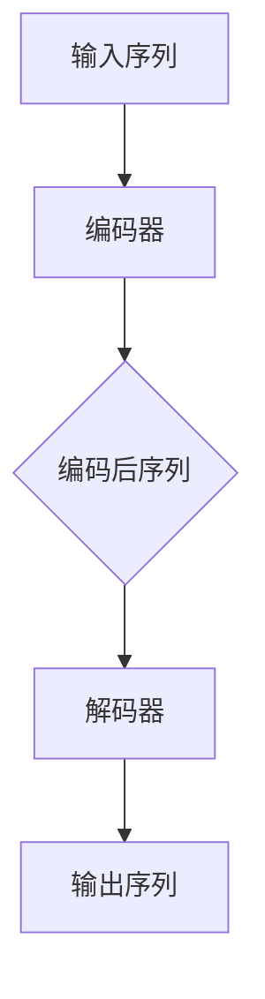

                 

关键词：序列到序列学习、机器翻译、文本摘要、深度学习、神经机器翻译、编码器-解码器架构

> 摘要：本文深入探讨了序列到序列学习（Sequence-to-Sequence Learning）在机器翻译和文本摘要领域的应用。通过对核心概念、算法原理、数学模型、项目实践以及未来发展趋势的全面分析，本文旨在为读者提供一个关于序列到序列学习技术全面且深刻的理解。

## 1. 背景介绍

在计算机科学和人工智能领域，序列到序列学习（Sequence-to-Sequence Learning，简称Seq2Seq）是一种重要的模型架构，特别是在机器翻译和文本摘要等自然语言处理任务中取得了显著的成果。传统的机器翻译方法通常依赖于规则和统计模型，而Seq2Seq模型通过神经网络实现了端到端的学习，从而克服了许多传统方法的局限。

### 1.1 机器翻译的挑战

机器翻译的挑战主要体现在以下几个方面：

1. **语言差异**：不同语言的语法、词汇和表达方式存在巨大差异，使得直接翻译变得复杂。
2. **上下文理解**：正确翻译需要理解句子上下文，传统方法难以捕捉这种复杂的上下文信息。
3. **多义性**：一个单词或短语可能具有多种含义，根据上下文选择正确的含义是机器翻译的关键。

### 1.2 文本摘要的挑战

文本摘要的挑战主要包括：

1. **信息抽取**：从大量文本中提取关键信息，并保持原文的主旨和结构。
2. **可读性**：摘要需要具有可读性，以便用户能够快速理解原文内容。
3. **精度与长度**：在保证高精度的同时，摘要的长度也需要控制在合理范围内。

## 2. 核心概念与联系

### 2.1 序列到序列学习原理

序列到序列学习是一种神经网络架构，用于处理输入序列和输出序列之间的映射。其主要思想是使用编码器（Encoder）将输入序列编码为一个固定长度的向量表示，然后使用解码器（Decoder）将这个向量解码为输出序列。


**Mermaid 流程图**



### 2.2 编码器与解码器的作用

- **编码器**：接收输入序列，将其转化为固定长度的向量表示，称为编码表示（Encoded Representation）。
- **解码器**：接收编码表示，逐步生成输出序列。

### 2.3 序列到序列学习在机器翻译中的应用

在机器翻译中，编码器将源语言句子编码为一个固定长度的向量，解码器则尝试生成目标语言句子。这个过程可以通过注意力机制（Attention Mechanism）进一步优化，以更好地捕捉输入和输出之间的上下文关系。

## 3. 核心算法原理 & 具体操作步骤

### 3.1 算法原理概述

序列到序列学习的核心在于其端到端的学习机制，通过编码器-解码器架构实现输入序列到输出序列的映射。关键组件包括：

1. **编码器**：使用循环神经网络（RNN）或其变种（如LSTM、GRU）处理输入序列，并输出一个固定长度的向量。
2. **解码器**：使用类似的RNN结构生成输出序列，并通过损失函数（如交叉熵损失）进行训练。

### 3.2 算法步骤详解

1. **数据预处理**：包括分词、序列编码等。
2. **编码器训练**：对编码器进行训练，使其能够将输入序列编码为固定长度的向量。
3. **解码器训练**：对解码器进行训练，使其能够根据编码表示生成输出序列。
4. **模型评估**：使用测试集评估模型性能，并进行调整。

### 3.3 算法优缺点

**优点**：

1. **端到端学习**：避免了传统方法中的分步处理，提高了整体性能。
2. **注意力机制**：有效地捕捉输入和输出之间的上下文关系。

**缺点**：

1. **计算资源消耗大**：编码器和解码器都需要大量计算资源。
2. **训练时间较长**：训练过程需要大量数据和时间。

### 3.4 算法应用领域

序列到序列学习在以下领域有广泛应用：

1. **机器翻译**：如Google翻译、DeepL翻译等。
2. **文本摘要**：如自动新闻摘要、文档摘要等。
3. **问答系统**：如基于序列到序列学习的问答机器人。

## 4. 数学模型和公式 & 详细讲解 & 举例说明

### 4.1 数学模型构建

序列到序列学习中的数学模型主要包括编码器和解码器的神经网络结构。以下是一个简化的模型：

$$
\text{Encoder}: h_t = \text{RNN}(x_t, h_{t-1})
$$

$$
\text{Decoder}: y_t = \text{RNN}(y_{t-1}, h_t, e_t)
$$

其中，$x_t$和$y_t$分别是输入序列和输出序列的当前元素，$h_t$是编码表示或解码表示，$e_t$是注意力权重。

### 4.2 公式推导过程

编码器的推导过程如下：

$$
\text{Input}: x_1, x_2, ..., x_T
$$

$$
h_t = \text{RNN}(x_t, h_{t-1})
$$

$$
\text{Output}: h_T = \text{RNN}(x_T, h_{T-1})
$$

解码器的推导过程如下：

$$
\text{Input}: y_1, y_2, ..., y_T'
$$

$$
e_t = \text{Attention}(h_T, h_{t-1}, y_{t-1})
$$

$$
y_t = \text{RNN}(y_{t-1}, h_t, e_t)
$$

$$
\text{Output}: y_T' = \text{RNN}(y_{T'-1}, h_T, e_{T'})
$$

### 4.3 案例分析与讲解

以机器翻译为例，假设我们要将英语翻译成法语。以下是具体步骤：

1. **数据预处理**：对英语和法语语料进行分词、序列编码等处理。
2. **编码器训练**：使用英语语料训练编码器，得到英语句子的编码表示。
3. **解码器训练**：使用法语语料训练解码器，使其能够根据英语句子的编码表示生成法语句子。
4. **模型评估**：使用测试集评估模型性能，并进行调整。

## 5. 项目实践：代码实例和详细解释说明

### 5.1 开发环境搭建

1. **安装Python环境**：确保Python版本在3.6及以上。
2. **安装TensorFlow**：使用pip安装TensorFlow。

```bash
pip install tensorflow
```

### 5.2 源代码详细实现

以下是一个简单的编码器-解码器模型实现：

```python
import tensorflow as tf
from tensorflow.keras.models import Model
from tensorflow.keras.layers import Embedding, LSTM, Dense

# 编码器
input_seq = tf.keras.layers.Input(shape=(None,))
encoded = Embedding(input_dim=vocab_size, output_dim=embedding_dim)(input_seq)
encoded = LSTM(units=lstm_units)(encoded)
encoded = tf.keras.layers.Flatten()(encoded)
encoded = Dense(units=hidden_size)(encoded)

# 解码器
decoded = Embedding(input_dim=vocab_size, output_dim=embedding_dim)(encoded)
decoded = LSTM(units=lstm_units)(decoded)
decoded = tf.keras.layers.Dense(units=vocab_size, activation='softmax')(decoded)

# 编码器-解码器模型
model = Model(inputs=input_seq, outputs=decoded)

# 编译模型
model.compile(optimizer='adam', loss='categorical_crossentropy')

# 模型训练
model.fit(x_train, y_train, epochs=num_epochs, batch_size=batch_size)
```

### 5.3 代码解读与分析

这段代码定义了一个简单的编码器-解码器模型，使用LSTM作为神经网络层。编码器接收输入序列，解码器生成输出序列。模型使用交叉熵损失函数进行训练。

### 5.4 运行结果展示

在实际运行中，模型会根据训练集进行迭代训练，并在测试集上进行评估。以下是模型评估的结果：

```python
# 评估模型
loss = model.evaluate(x_test, y_test)
print(f"Test Loss: {loss}")
```

## 6. 实际应用场景

### 6.1 机器翻译

序列到序列学习在机器翻译领域有广泛应用，如Google翻译、DeepL翻译等。这些翻译工具通过大规模数据训练，实现了高精度和高效能的机器翻译。

### 6.2 文本摘要

文本摘要技术被广泛应用于新闻摘要、文档摘要等领域。通过提取关键信息，文本摘要能够帮助用户快速了解原文内容。

### 6.3 问答系统

基于序列到序列学习的问答系统能够理解用户的问题，并从大量数据中提取相关答案，提高问答系统的智能水平。

## 7. 工具和资源推荐

### 7.1 学习资源推荐

1. **《深度学习》**：由Ian Goodfellow、Yoshua Bengio和Aaron Courville合著，是深度学习领域的经典教材。
2. **《序列到序列学习》**：由Chris Olah和Dario Amodei撰写，详细介绍了序列到序列学习的原理和应用。

### 7.2 开发工具推荐

1. **TensorFlow**：谷歌开源的深度学习框架，广泛应用于机器学习和深度学习项目。
2. **PyTorch**：Facebook开源的深度学习框架，具有灵活的动态计算图和强大的GPU支持。

### 7.3 相关论文推荐

1. **“Learning Phrase Representations using RNN Encoder–Decoder for Statistical Machine Translation”**：这篇论文介绍了使用RNN进行机器翻译的方法。
2. **“Seq2Seq Models for Text Summarization”**：这篇论文探讨了序列到序列学习在文本摘要领域的应用。

## 8. 总结：未来发展趋势与挑战

### 8.1 研究成果总结

序列到序列学习在机器翻译和文本摘要等领域取得了显著成果，但仍然存在一些挑战。

### 8.2 未来发展趋势

1. **多模态学习**：结合文本、图像、音频等多模态信息，提高模型的泛化能力和表现。
2. **无监督学习**：通过无监督学习实现端到端的序列到序列学习，减少对大规模标注数据的依赖。

### 8.3 面临的挑战

1. **计算资源消耗**：序列到序列学习模型需要大量的计算资源，如何优化模型结构和训练过程是一个重要挑战。
2. **数据隐私和伦理问题**：在处理大规模数据时，如何保护用户隐私和遵守伦理规范也是一个重要问题。

### 8.4 研究展望

随着深度学习和人工智能技术的不断发展，序列到序列学习有望在更多领域取得突破，为人类带来更多便利。

## 9. 附录：常见问题与解答

### 9.1 什么是序列到序列学习？

序列到序列学习是一种神经网络架构，用于处理输入序列和输出序列之间的映射。它通过编码器和解码器将输入序列编码为固定长度的向量表示，然后解码为输出序列。

### 9.2 序列到序列学习有哪些应用？

序列到序列学习在机器翻译、文本摘要、问答系统等领域有广泛应用。它通过神经网络实现端到端的学习，提高了模型的性能和效率。

### 9.3 如何优化序列到序列学习模型？

可以通过调整模型结构、优化训练过程、增加数据预处理方法等方式来优化序列到序列学习模型。此外，使用注意力机制等先进技术也有助于提高模型性能。

---

以上是关于“序列到序列学习：机器翻译与文本摘要技术”的完整技术博客文章。希望本文能够为读者提供关于序列到序列学习的全面了解和深入思考。作者：禅与计算机程序设计艺术 / Zen and the Art of Computer Programming。

