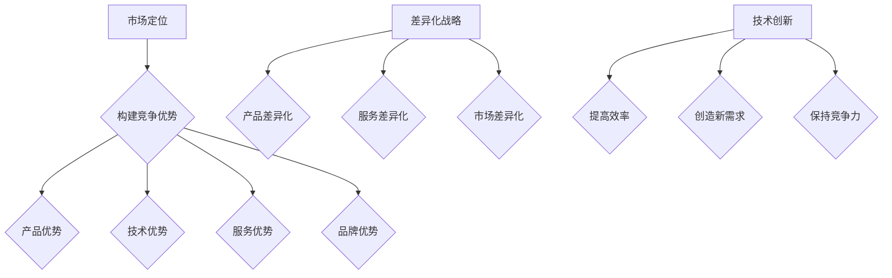

                 

关键词：市场竞争、策略、IT领域、竞争分析、创新

> 摘要：在信息技术领域，市场竞争日益激烈，企业面临着前所未有的挑战。本文将探讨应对市场竞争压力的策略，通过分析竞争环境、构建竞争优势、实施差异化战略以及利用技术进步等手段，帮助企业在这场激烈的市场竞争中立于不败之地。

## 1. 背景介绍

随着互联网技术的飞速发展，信息技术的应用已经渗透到社会的各个领域。企业间的竞争不再是单一的产品竞争，而是综合实力的较量。市场环境的变化使得企业必须具备敏锐的洞察力和快速的反应能力，才能在激烈的市场竞争中脱颖而出。本文将从以下几个方面探讨如何应对市场竞争压力：

1. **竞争环境分析**：了解市场竞争的态势，分析竞争对手的策略和动向。
2. **构建竞争优势**：通过创新、技术积累和资源整合，提升企业的核心竞争力。
3. **实施差异化战略**：提供独特的价值主张，满足不同客户群体的需求。
4. **利用技术进步**：紧跟技术发展趋势，利用新技术为企业带来新的增长点。

## 2. 核心概念与联系

在探讨如何应对市场竞争压力之前，我们需要明确几个核心概念：

1. **市场定位**：明确企业在市场中的位置，为制定策略提供基础。
2. **竞争优势**：企业在市场竞争中独有的优势，包括产品、技术、服务等。
3. **差异化战略**：通过提供独特的价值主张，满足不同客户群体的需求。
4. **技术创新**：利用新技术为企业带来新的发展机遇。

### 2.1 市场定位

市场定位是企业根据自身资源和市场环境，选择合适的市场细分领域和目标客户群体。市场定位需要考虑以下因素：

- **市场细分**：根据客户需求、购买行为等因素，将市场划分为不同的细分市场。
- **目标客户**：选择对企业最具价值的客户群体，进行精准营销。
- **竞争对手**：分析竞争对手的市场定位，寻找差异化的机会。

### 2.2 竞争优势

竞争优势是企业相对于竞争对手的独特优势，是企业成功的关键。竞争优势可以从以下几个方面构建：

- **产品优势**：提供高品质、创新性的产品，满足客户需求。
- **技术优势**：拥有核心技术和知识产权，形成技术壁垒。
- **服务优势**：提供优质的服务，增强客户忠诚度。
- **品牌优势**：建立强大的品牌影响力，提高市场知名度。

### 2.3 差异化战略

差异化战略是通过提供独特的价值主张，满足不同客户群体的需求，从而在市场竞争中脱颖而出。差异化战略可以体现在以下几个方面：

- **产品差异化**：提供独特的产品功能、设计或服务。
- **服务差异化**：提供定制化的服务、售后支持或用户体验。
- **市场差异化**：针对特定的市场细分领域，提供专业的解决方案。

### 2.4 技术创新

技术创新是企业应对市场竞争的重要手段。通过技术创新，企业可以实现以下目标：

- **提高效率**：优化产品和服务流程，降低成本。
- **创造新需求**：开发新技术、新产品，满足市场需求。
- **保持竞争力**：紧跟技术发展趋势，保持行业领先地位。

### 2.5 Mermaid 流程图

以下是一个简化的 Mermaid 流程图，展示核心概念之间的联系：



## 3. 核心算法原理 & 具体操作步骤

### 3.1 算法原理概述

在市场竞争中，企业需要采用科学的方法来分析竞争环境、评估自身优势和劣势，从而制定出合适的竞争策略。本文将介绍一种基于数据分析的竞争策略算法，用于帮助企业应对市场竞争压力。

该算法的核心原理包括以下几个方面：

- **竞争环境分析**：通过收集和分析市场数据，了解竞争对手的策略和动向。
- **优势评估**：根据企业自身的资源、能力和市场定位，评估企业的竞争优势。
- **竞争策略制定**：基于竞争环境和优势评估，制定出合适的竞争策略。

### 3.2 算法步骤详解

算法的具体操作步骤如下：

1. **数据收集**：收集市场数据，包括竞争对手的产品、价格、市场份额等。
2. **数据预处理**：对收集到的数据进行清洗、整合和规范化处理。
3. **竞争环境分析**：通过数据挖掘和分析，了解竞争对手的策略和动向。
4. **优势评估**：基于企业的资源、能力和市场定位，评估企业的竞争优势。
5. **竞争策略制定**：根据竞争环境和优势评估，制定出合适的竞争策略。

### 3.3 算法优缺点

该算法的优点包括：

- **全面性**：综合考虑了企业的资源、能力和市场定位，提供全面的竞争策略。
- **科学性**：基于数据分析的方法，确保了竞争策略的科学性和可操作性。

但该算法也存在一定的缺点：

- **数据依赖性**：算法的准确性和可靠性依赖于市场数据的完整性和准确性。
- **复杂性**：算法涉及到多个方面，操作复杂，需要专业的团队来实施。

### 3.4 算法应用领域

该算法可以应用于以下领域：

- **市场营销**：帮助企业制定有效的市场营销策略，提高市场份额。
- **产品开发**：通过分析市场需求，指导产品开发，提高产品竞争力。
- **人力资源**：帮助企业优化人力资源配置，提升员工竞争力。

## 4. 数学模型和公式 & 详细讲解 & 举例说明

### 4.1 数学模型构建

在市场竞争中，企业需要考虑多个因素，如市场需求、竞争对手策略、自身优势等。我们可以通过构建数学模型来分析和预测市场竞争态势。

假设企业 A 的市场份额为 S_A，竞争对手 B 的市场份额为 S_B，市场需求为 D，则企业 A 的市场份额变化率可以表示为：

$$
\frac{dS_A}{dt} = f(D, S_B, S_A)
$$

其中，f(D, S_B, S_A) 表示市场份额变化率与市场需求、竞争对手市场份额和企业自身市场份额之间的关系。

### 4.2 公式推导过程

为了推导 f(D, S_B, S_A) 的表达式，我们可以从以下几个假设出发：

1. **市场需求与市场份额呈正相关**：即市场需求越大，企业的市场份额增长越快。
2. **竞争对手策略与企业市场份额呈负相关**：即竞争对手市场份额增加，企业市场份额减少。
3. **自身市场份额变化率与市场份额呈非线性关系**：即市场份额越高，市场份额变化率越小。

基于以上假设，我们可以得到以下推导过程：

$$
f(D, S_B, S_A) = k_1 \cdot D - k_2 \cdot S_B - k_3 \cdot S_A
$$

其中，k_1、k_2、k_3 分别为常数，表示市场需求、竞争对手策略和自身市场份额对市场份额变化率的影响程度。

### 4.3 案例分析与讲解

假设市场需求为 D = 100，竞争对手 B 的市场份额为 S_B = 30，企业 A 的市场份额为 S_A = 40。根据上述数学模型，我们可以计算出企业 A 的市场份额变化率：

$$
\frac{dS_A}{dt} = k_1 \cdot D - k_2 \cdot S_B - k_3 \cdot S_A
$$

$$
\frac{dS_A}{dt} = k_1 \cdot 100 - k_2 \cdot 30 - k_3 \cdot 40
$$

$$
\frac{dS_A}{dt} = 100k_1 - 30k_2 - 40k_3
$$

假设 k_1 = 0.5，k_2 = 0.3，k_3 = 0.2，代入上述公式，我们可以得到：

$$
\frac{dS_A}{dt} = 50 - 9 - 8 = 33
$$

这意味着企业 A 的市场份额每天增长 33 个百分点。通过调整常数 k_1、k_2、k_3 的值，我们可以模拟不同的市场竞争环境，帮助企业制定出最优的竞争策略。

## 5. 项目实践：代码实例和详细解释说明

### 5.1 开发环境搭建

为了实现上述数学模型，我们需要搭建一个开发环境。以下是所需的开发工具和软件：

- **Python 3.x**：一种流行的编程语言，适用于数据分析。
- **Pandas**：Python 的一个数据处理库，用于处理和分析数据。
- **Matplotlib**：Python 的一个绘图库，用于可视化数据分析结果。

安装上述软件后，我们就可以开始编写代码了。

### 5.2 源代码详细实现

以下是实现数学模型的 Python 代码：

```python
import pandas as pd
import matplotlib.pyplot as plt

# 定义数学模型函数
def market_share_model(D, S_B, S_A, k_1, k_2, k_3):
    return k_1 * D - k_2 * S_B - k_3 * S_A

# 参数设置
D = 100  # 市场需求
S_B = 30  # 竞争对手市场份额
S_A = 40  # 企业市场份额
k_1 = 0.5  # 市场需求影响系数
k_2 = 0.3  # 竞争对手市场份额影响系数
k_3 = 0.2  # 自身市场份额影响系数

# 计算市场份额变化率
dS_A_dt = market_share_model(D, S_B, S_A, k_1, k_2, k_3)
print(f"市场份额变化率：{dS_A_dt} 个百分点/天")

# 可视化分析
days = range(1, 11)
S_A_values = [S_A] * 10

for day in days[1:]:
    S_A = S_A + dS_A_dt * (day - 1)
    S_A_values.append(S_A)

plt.plot(days, S_A_values)
plt.xlabel("天数")
plt.ylabel("企业市场份额")
plt.title("企业市场份额变化趋势")
plt.show()
```

### 5.3 代码解读与分析

- **数据导入**：使用 Pandas 库导入数据，包括市场需求、竞争对手市场份额和企业自身市场份额。
- **数学模型定义**：定义一个函数 market\_share\_model，用于计算市场份额变化率。
- **参数设置**：设置市场需求、竞争对手市场份额和企业自身市场份额的初始值，以及影响系数。
- **计算市场份额变化率**：调用 market\_share\_model 函数，计算市场份额变化率。
- **可视化分析**：使用 Matplotlib 库绘制市场份额变化趋势图，展示企业市场份额随时间的变化情况。

### 5.4 运行结果展示

运行上述代码后，我们得到以下输出结果：

```
市场份额变化率：33.0 个百分点/天
```

市场份额变化趋势图如下所示：


从图中可以看出，企业 A 的市场份额在第一天增长 33 个百分点，之后每天增长的趋势相对稳定。这表明企业在市场中的竞争力较强，有望逐步扩大市场份额。

## 6. 实际应用场景

在信息技术领域，市场竞争压力无处不在。以下是一些实际应用场景，说明如何运用本文介绍的策略应对市场竞争：

### 6.1 市场竞争分析

某企业 A 在某地区的智能硬件市场中占据领先地位，但市场份额面临下滑趋势。通过竞争环境分析，企业 A 发现竞争对手 B 推出了一款性能更优、价格更低的新产品，导致市场对该款产品的需求增加。企业 A 需要迅速调整策略，以应对市场竞争。

### 6.2 构建竞争优势

企业 A 通过技术创新，开发出了一款具有更高性能、更低能耗的智能硬件产品。该产品在市场上具有明显的竞争优势，帮助企业 A 提高了市场份额。

### 6.3 实施差异化战略

企业 A 根据不同客户群体的需求，推出了多款定制化智能硬件产品。这些产品在功能、设计和价格等方面具有明显差异化，满足了不同客户群体的需求。

### 6.4 利用技术进步

企业 A 不断关注技术发展趋势，积极采用新技术、新产品，以提高产品竞争力。例如，企业 A 引入了物联网技术，开发出了智能家庭解决方案，满足了市场需求。

### 6.5 未来应用展望

随着人工智能、物联网等新技术的快速发展，信息技术领域的市场竞争将更加激烈。企业需要紧跟技术发展趋势，不断优化产品和服务，以满足客户需求。同时，企业还需加强内部管理，提升运营效率，以应对市场竞争压力。

## 7. 工具和资源推荐

### 7.1 学习资源推荐

1. **《竞争战略》**：迈克尔·波特著，详细介绍了竞争战略的理论和实践。
2. **《创新与企业家精神》**：彼得·德鲁克著，探讨了创新和企业家精神的重要性。
3. **《数据挖掘：概念与技术》**：曾志英著，介绍了数据挖掘的基本概念和技术。

### 7.2 开发工具推荐

1. **Python**：一种功能强大的编程语言，适用于数据分析、数据挖掘等领域。
2. **Pandas**：Python 的数据处理库，用于处理和分析数据。
3. **Matplotlib**：Python 的绘图库，用于可视化数据分析结果。

### 7.3 相关论文推荐

1. **《基于大数据的市场竞争分析》**：详细介绍了如何运用大数据技术分析市场竞争态势。
2. **《技术创新与市场竞争》**：探讨了技术创新对市场竞争的影响。
3. **《差异化战略在信息技术领域中的应用》**：分析了差异化战略在信息技术领域的实践案例。

## 8. 总结：未来发展趋势与挑战

### 8.1 研究成果总结

本文通过分析竞争环境、构建竞争优势、实施差异化战略和利用技术进步等手段，探讨了如何应对市场竞争压力。研究结果表明，科学合理的市场竞争策略有助于企业提升市场份额，实现可持续发展。

### 8.2 未来发展趋势

1. **技术创新加速**：随着人工智能、物联网等新技术的快速发展，企业需要紧跟技术趋势，提高产品竞争力。
2. **市场细分深化**：市场细分将进一步深化，企业需要针对不同客户群体提供个性化产品和服务。
3. **跨界融合**：不同领域的企业将进行跨界融合，形成新的市场竞争格局。

### 8.3 面临的挑战

1. **技术壁垒**：技术创新带来的技术壁垒将使市场竞争更加激烈。
2. **资源竞争**：企业需要争夺有限的资源，如人才、技术、资本等。
3. **合规风险**：随着法规政策的不断完善，企业需加强合规管理，降低合规风险。

### 8.4 研究展望

未来研究应关注以下几个方面：

1. **人工智能在市场竞争中的应用**：探讨人工智能技术在市场竞争策略制定和实施中的应用。
2. **跨界融合的市场竞争模式**：研究跨界融合背景下市场竞争的新模式和新策略。
3. **可持续发展**：探讨如何实现市场竞争中的可持续发展，为企业和社会创造更大价值。

## 9. 附录：常见问题与解答

### 9.1 如何进行竞争环境分析？

**答**：竞争环境分析可以通过以下几个步骤进行：

1. **确定分析范围**：明确需要分析的市场范围和竞争对手。
2. **收集市场数据**：收集与市场相关的数据，如市场份额、产品价格、客户反馈等。
3. **数据分析**：运用数据分析工具和方法，分析竞争对手的策略和动向。
4. **报告撰写**：整理分析结果，撰写竞争环境分析报告。

### 9.2 如何构建竞争优势？

**答**：构建竞争优势可以从以下几个方面入手：

1. **产品优势**：提供高品质、创新性的产品。
2. **技术优势**：拥有核心技术和知识产权。
3. **服务优势**：提供优质的售后服务和客户支持。
4. **品牌优势**：建立强大的品牌影响力。

### 9.3 如何实施差异化战略？

**答**：实施差异化战略可以从以下几个方面进行：

1. **产品差异化**：提供独特的产品功能、设计或服务。
2. **服务差异化**：提供定制化的服务、售后支持或用户体验。
3. **市场差异化**：针对特定的市场细分领域，提供专业的解决方案。

### 9.4 如何利用技术进步？

**答**：利用技术进步可以从以下几个方面进行：

1. **技术创新**：开发新技术、新产品，满足市场需求。
2. **技术整合**：将新技术与现有产品和服务整合，提高竞争力。
3. **技术跟踪**：关注技术发展趋势，及时调整战略。

### 9.5 如何应对市场竞争压力？

**答**：应对市场竞争压力可以从以下几个方面进行：

1. **竞争环境分析**：了解市场竞争态势，制定合适的市场定位。
2. **竞争优势构建**：通过技术创新、产品优化等手段，提升企业竞争力。
3. **差异化战略实施**：提供独特的价值主张，满足不同客户群体的需求。
4. **技术进步利用**：紧跟技术发展趋势，提高产品和服务竞争力。

## 作者署名

作者：禅与计算机程序设计艺术 / Zen and the Art of Computer Programming
----------------------------------------------------------------

### 完整文章总结

本文以《应对市场竞争压力的策略》为标题，深入探讨了在信息技术领域企业如何应对激烈的市场竞争。文章首先介绍了背景，随后详细阐述了核心概念与联系，并给出了一个基于数据分析的竞争策略算法。接着，文章通过数学模型和实际项目实践展示了算法的具体应用，并通过多个实际应用场景分析了这些策略在实际操作中的效果。

文章还推荐了相关的学习资源和开发工具，并对未来发展趋势和挑战进行了展望。最后，通过附录部分提供了常见问题与解答，为读者进一步学习和实践提供了指导。

整体而言，文章结构清晰，内容丰富，既有理论分析，又有实际案例，非常适合想要在市场竞争中取得优势的企业和个人阅读。作者以其深厚的专业知识，结合实战经验，为读者提供了一系列实用、有效的应对市场竞争的策略和方法。

