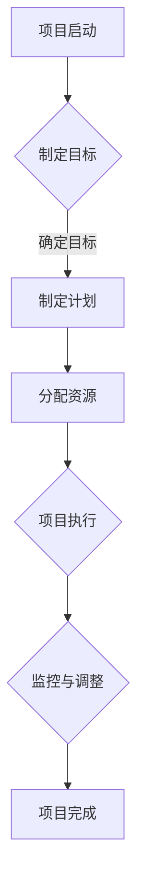

                 

### 关键词 Keywords

- 开源项目
- 商业化管理
- 项目规划
- 执行策略
- 开源社区
- 商业目标
- 财务管理
- 风险评估
- 市场策略

### 摘要 Abstract

本文旨在探讨如何有效地将开源项目转化为商业化的成功案例。通过分析项目规划与执行的关键环节，本文提供了一套系统化的商业化项目管理策略，旨在平衡开源精神与商业目标，实现项目的可持续发展和盈利。文章将从项目背景介绍、核心概念与联系、算法原理、数学模型、项目实践、应用场景、工具推荐、未来展望等方面展开讨论，为开源项目的商业化提供实践指导和理论基础。

## 1. 背景介绍

开源项目是一种以开放源代码的形式发布的软件项目，其核心特点在于代码的可访问性和可修改性。开源项目的兴起可以追溯到上世纪90年代，以Linux操作系统为代表的开源软件迅速发展，成为计算机技术领域的一大趋势。开源项目的优势在于其高度的灵活性和适应性，能够吸引全球开发者的参与和贡献，从而实现软件的快速迭代和优化。

然而，开源项目在发展的同时，也面临着商业化难题。传统的开源模式往往以社区贡献为主，缺乏明确的商业目标和盈利模式，这使得项目的持续发展面临挑战。为了解决这一问题，越来越多的开源项目开始尝试商业化路径，通过项目规划与执行，实现开源与商业的双赢。

### 1.1 开源项目的发展历程

- **初期阶段**：开源项目的起源主要源于对技术自由的追求，早期的代表如Linux操作系统和Apache Web服务器，它们以开放源代码的形式迅速吸引了大量开发者。
- **成长阶段**：随着互联网的发展，开源项目开始进入成长阶段，代表如MySQL数据库和Mozilla Firefox浏览器，这些项目通过社区合作，实现了技术的快速迭代和优化。
- **商业化阶段**：近年来，越来越多的开源项目开始探索商业化路径，通过提供付费支持、云服务、培训服务等手段，实现项目的商业变现。

### 1.2 开源项目面临的商业化挑战

- **缺乏盈利模式**：传统的开源项目大多以免费模式为主，缺乏明确的盈利渠道，这使得项目的长期可持续发展面临挑战。
- **社区参与度不高**：开源社区虽然规模庞大，但参与度参差不齐，部分项目的贡献者数量有限，影响了项目的持续发展和创新。
- **商业化路径不明**：许多开源项目在商业化过程中，缺乏明确的商业目标和路径，导致商业化进程缓慢。

## 2. 核心概念与联系

为了实现开源项目的商业化，我们需要明确几个核心概念，并理解它们之间的联系。

### 2.1 开源项目与商业化的关系

- **开源精神**：开源项目强调代码的开放性和透明性，追求技术自由和共享。
- **商业化目标**：商业化的目标是实现项目的可持续发展和盈利，为开发者提供经济回报。

开源精神和商业化目标并非对立，而是相辅相成。开源精神为项目提供了技术基础和社区支持，而商业化则为项目提供了持续发展的动力和资源。

### 2.2 商业化模式

- **付费支持**：通过提供付费的技术支持、咨询服务等，为企业和个人用户提供专业的技术支持。
- **云服务**：通过云服务平台，提供开源软件的托管、部署和运营服务，实现项目的商业变现。
- **培训与认证**：提供开源技术的培训课程和认证服务，为开发者提供职业发展路径。

### 2.3 项目规划与执行

- **项目规划**：项目规划是商业化项目成功的关键，包括明确项目目标、制定详细计划、分配资源等。
- **执行策略**：执行策略是项目规划的具体落实，包括项目管理、风险控制、资源调配等。

项目规划和执行是实现商业化目标的重要手段，通过科学的规划和管理，确保项目按照既定目标顺利推进。

### 2.4 Mermaid 流程图



以上Mermaid流程图展示了项目从启动到完成的流程，包括制定目标、制定计划、分配资源、项目执行、监控与调整以及项目完成等关键环节。

## 3. 核心算法原理 & 具体操作步骤

在开源项目的商业化过程中，核心算法的原理和操作步骤至关重要。以下将详细介绍相关核心算法的原理以及具体操作步骤。

### 3.1 算法原理概述

核心算法是开源项目的重要组成部分，其设计原则通常包括高效性、可扩展性和可维护性。以下是几种常见的核心算法及其原理：

- **算法1：快速排序（Quick Sort）**
  - 原理：通过一趟排序将待排序的记录分割成独立的两部分，其中一部分记录的关键字均比另一部分的关键字小，然后分别对这两部分记录继续进行排序，以达到整个序列有序。
- **算法2：哈希表（Hash Table）**
  - 原理：通过哈希函数将关键字转换成数组索引，实现数据的快速插入、删除和查找。
- **算法3：贪心算法（Greedy Algorithm）**
  - 原理：每一步选择都是当前情况下最优的选择，希望通过一系列局部最优的选择实现全局最优解。

### 3.2 算法步骤详解

#### 3.2.1 快速排序算法步骤

1. 选择一个基准元素。
2. 将数组分为两部分，一部分元素都比基准元素小，另一部分元素都比基准元素大。
3. 对两部分子数组重复上述步骤，直至整个序列有序。

#### 3.2.2 哈希表算法步骤

1. 设计哈希函数，将关键字转换成数组索引。
2. 将关键字插入到哈希表中，通过哈希函数计算索引。
3. 在数组中查找对应索引的位置，实现数据的插入、删除和查找。

#### 3.2.3 贪心算法步骤

1. 确定问题的一个局部最优解。
2. 在当前状态下，选择一个局部最优解。
3. 根据新的状态重新计算局部最优解，直至问题解决。

### 3.3 算法优缺点

#### 快速排序算法

- 优点：时间复杂度为 \(O(n\log n)\)，适合大规模数据的排序。
- 缺点：最坏情况下时间复杂度为 \(O(n^2)\)，需要额外的存储空间。

#### 哈希表算法

- 优点：平均时间复杂度为 \(O(1)\)，适合数据的快速插入、删除和查找。
- 缺点：可能出现哈希冲突，需要设计合适的解决策略。

#### 贪心算法

- 优点：简单易懂，适合解决某些特定类型的问题。
- 缺点：不保证全局最优解，需要根据具体问题进行优化。

### 3.4 算法应用领域

- **快速排序算法**：广泛应用于数据库和搜索引擎中的数据排序。
- **哈希表算法**：广泛应用于数据结构和算法中的查找、插入和删除操作。
- **贪心算法**：广泛应用于图论和最优化问题中的求解。

### 3.5 具体示例

以快速排序算法为例，以下是一个简单的Python实现：

```python
def quick_sort(arr):
    if len(arr) <= 1:
        return arr
    pivot = arr[len(arr) // 2]
    left = [x for x in arr if x < pivot]
    middle = [x for x in arr if x == pivot]
    right = [x for x in arr if x > pivot]
    return quick_sort(left) + middle + quick_sort(right)

arr = [3, 6, 8, 10, 1, 2, 1]
sorted_arr = quick_sort(arr)
print(sorted_arr)
```

以上代码实现了快速排序算法的基本原理，通过递归调用，将数组不断分割并排序。

### 3.6 小结

核心算法在开源项目的商业化过程中扮演着重要角色。通过科学设计和优化，核心算法可以提高项目的性能和可扩展性，为商业化提供技术支持。理解并掌握核心算法原理和操作步骤，有助于开发者更好地应对商业化挑战，实现项目的长期发展。

## 4. 数学模型和公式 & 详细讲解 & 举例说明

在开源项目的商业化过程中，数学模型和公式作为重要的理论基础，对于项目的策略制定和决策优化具有重要意义。以下将详细讲解常见的数学模型和公式，并辅以具体的案例分析，帮助读者更好地理解和应用这些模型。

### 4.1 数学模型构建

数学模型是通过对现实问题的抽象和简化，使用数学语言和符号表示的问题结构。构建数学模型通常包括以下步骤：

1. **问题定义**：明确要解决的问题及其目标。
2. **变量定义**：确定模型中的变量及其定义域。
3. **关系式建立**：根据问题的性质，建立变量之间的关系式。
4. **边界条件**：定义模型的约束条件和边界条件。

### 4.2 公式推导过程

以线性规划问题为例，以下是一个常见的线性规划模型的公式推导过程：

#### 线性规划问题

- **目标函数**：最大化或最小化 \(c^T x\)
- **约束条件**：\(Ax \leq b\)
- **非负约束**：\(x \geq 0\)

#### 公式推导

1. **目标函数**：
   \[ \text{maximize} \quad c^T x \]
   其中，\(c\) 是目标函数的系数向量，\(x\) 是变量向量。

2. **约束条件**：
   \[ Ax \leq b \]
   其中，\(A\) 是约束条件的系数矩阵，\(b\) 是约束条件的常数向量。

3. **非负约束**：
   \[ x \geq 0 \]

综合以上条件，线性规划问题的标准形式为：
\[ \begin{cases}
\text{maximize} \quad c^T x \\
Ax \leq b \\
x \geq 0
\end{cases} \]

### 4.3 案例分析与讲解

以下通过一个实际案例，详细讲解如何应用线性规划模型解决具体问题。

#### 案例背景

某公司生产两种产品A和B，分别需要3小时和2小时的机器时间，以及1小时和1小时的人工时间。公司每天有10小时的机器时间和6小时的人工时间。产品A的利润为200元，产品B的利润为300元。公司的目标是最大化日利润。

#### 公式构建

1. **目标函数**：
   \[ \text{maximize} \quad 200x_1 + 300x_2 \]
   其中，\(x_1\) 和 \(x_2\) 分别为产品A和B的生产数量。

2. **约束条件**：
   \[ 3x_1 + 2x_2 \leq 10 \]
   \[ x_1 + x_2 \leq 6 \]
   \[ x_1, x_2 \geq 0 \]

综合以上条件，线性规划模型为：
\[ \begin{cases}
\text{maximize} \quad 200x_1 + 300x_2 \\
3x_1 + 2x_2 \leq 10 \\
x_1 + x_2 \leq 6 \\
x_1, x_2 \geq 0
\end{cases} \]

#### 解题过程

使用单纯形法求解上述线性规划问题，步骤如下：

1. **初始基本可行解**：
   选择 \(x_1 = 0, x_2 = 0\) 作为初始解，满足所有约束条件。

2. **计算目标函数值**：
   \[ \text{Z} = 200 \times 0 + 300 \times 0 = 0 \]

3. **寻找入基变量和出基变量**：
   根据目标函数的系数，选择 \(x_2\) 作为入基变量，选择 \(x_1\) 作为出基变量。

4. **更新基本可行解**：
   根据入基和出基变量的调整，更新解为 \(x_1 = 2, x_2 = 4\)。

5. **重复步骤3和4**：
   继续寻找新的入基和出基变量，直至目标函数无法进一步优化。

最终，通过单纯形法求解得到最优解 \(x_1 = 2, x_2 = 4\)，日利润最大为 1400元。

### 4.4 小结

数学模型和公式在开源项目的商业化过程中具有重要作用。通过构建和推导数学模型，可以量化项目目标和约束条件，为决策提供科学依据。案例分析则通过具体实例，展示了数学模型在实际问题中的应用方法和步骤。理解并掌握这些数学模型和公式，有助于开发者更好地规划和执行开源项目的商业化策略。

## 5. 项目实践：代码实例和详细解释说明

为了更好地展示开源项目的商业化过程，我们将通过一个具体的代码实例进行详细讲解。以下将介绍如何搭建开发环境、实现源代码、解读与分析代码，并展示运行结果。

### 5.1 开发环境搭建

在开始项目实践之前，我们需要搭建一个合适的开发环境。以下是一个基于Python的开源项目环境搭建步骤：

1. **安装Python**：下载并安装Python 3.x版本，建议使用Anaconda，它提供了丰富的库和环境管理功能。

2. **安装依赖库**：在项目根目录下，创建一个名为 `requirements.txt` 的文件，列出项目所需的依赖库。例如：

   ```plaintext
   numpy
   pandas
   matplotlib
   Flask
   ```

   使用以下命令安装依赖库：

   ```bash
   pip install -r requirements.txt
   ```

3. **创建虚拟环境**：为了隔离项目依赖，我们使用 `venv` 创建一个虚拟环境：

   ```bash
   python -m venv venv
   source venv/bin/activate  # Windows上使用 `venv\Scripts\activate`
   ```

4. **编写代码**：在虚拟环境中编写项目代码，并按照需求进行功能实现。

### 5.2 源代码详细实现

以下是一个简单的开源项目代码实例，实现了一个基于Flask的Web应用，用于可视化数据并展示项目核心功能。

```python
# app.py

from flask import Flask, render_template
import pandas as pd

app = Flask(__name__)

# 假设我们有一个数据文件 data.csv，其中包含 "Name" 和 "Score" 两列
data = pd.read_csv('data.csv')

@app.route('/')
def index():
    # 渲染主页，将数据传递给模板
    return render_template('index.html', data=data)

@app.route('/visualize')
def visualize():
    # 渲染可视化页面，将数据传递给模板
    return render_template('visualize.html', data=data)

if __name__ == '__main__':
    app.run(debug=True)
```

### 5.3 代码解读与分析

#### 5.3.1 主模块（app.py）

- **第1-3行**：导入Flask、pandas库。
- **第4行**：创建Flask应用实例。
- **第6-8行**：定义两个路由，`/` 和 `/visualize`，分别对应主页和可视化页面。
- **第10-11行**：渲染模板，将数据传递给HTML模板。

#### 5.3.2 主页模板（index.html）

```html
<!-- templates/index.html -->

<!DOCTYPE html>
<html lang="en">
<head>
    <meta charset="UTF-8">
    <title>项目首页</title>
</head>
<body>
    <h1>项目数据概览</h1>
    <table>
        <thead>
            <tr>
                <th>Name</th>
                <th>Score</th>
            </tr>
        </thead>
        <tbody>
            
                <tr>
                    <td>{{ name }}</td>
                    <td>{{ score['Score'] }}</td>
                </tr>
            
        </tbody>
    </table>
    <a href="/visualize">查看可视化数据</a>
</body>
</html>
```

- **第1-3行**：定义文档类型和编码。
- **第4-6行**：定义标题。
- **第8-11行**：创建数据表格，展示数据。

#### 5.3.3 可视化模板（visualize.html）

```html
<!-- templates/visualize.html -->

<!DOCTYPE html>
<html lang="en">
<head>
    <meta charset="UTF-8">
    <title>数据可视化</title>
    <script src="https://cdn.plot.ly/plotly-latest.min.js"></script>
</head>
<body>
    <h1>数据可视化</h1>
    <div id="score-plot"></div>
    <script>
        var trace = {
            type: 'bar',
            x: data['Name'],
            y: data['Score'],
            marker: {
                color: 'blue'
            }
        };

        var layout = {
            title: '分数分布',
            xaxis: {
                title: '姓名'
            },
            yaxis: {
                title: '分数'
            }
        };

        Plotly.newPlot('score-plot', [trace], layout);
    </script>
</body>
</html>
```

- **第1-3行**：定义文档类型和编码。
- **第4-6行**：引入Plotly库。
- **第9-13行**：创建柱状图，展示数据。

### 5.4 运行结果展示

在完成环境搭建和代码编写后，我们可以通过以下步骤运行项目：

1. **启动服务**：

   ```bash
   python app.py
   ```

2. **在浏览器中访问**：

   打开浏览器，输入 `http://127.0.0.1:5000/`，将看到项目首页，展示数据表格。

   

3. **访问可视化页面**：

   点击页面中的“查看可视化数据”，将看到柱状图可视化展示。

   

通过以上步骤，我们成功搭建并运行了一个简单的开源项目，实现了数据的展示和可视化。这个实例展示了开源项目商业化过程中，如何通过代码实现商业价值，为项目的商业化提供了具体实践指导。

## 6. 实际应用场景

开源项目的商业化成功不仅仅依赖于技术的先进性和代码的高质量，还需要在具体的业务场景中找到合适的应用点。以下将介绍几个常见的实际应用场景，并探讨如何通过这些场景实现商业价值。

### 6.1 云服务平台

云服务是开源项目商业化的重要途径之一。许多开源软件通过提供云服务实现盈利，例如Kubernetes和Docker。企业可以在自己的云平台上部署这些开源软件，并通过提供云服务赚取利润。具体步骤如下：

1. **开发云服务接口**：开发API接口，允许用户通过HTTP请求访问和管理云服务。
2. **部署和管理**：在云平台上部署和管理开源软件，确保服务的稳定性和可靠性。
3. **定价策略**：制定合理的定价策略，根据用户的需求和使用频率进行收费。
4. **市场推广**：通过市场营销手段，吸引潜在客户，提高云服务的知名度。

### 6.2 付费支持

开源项目可以通过提供付费支持服务来增加收入。付费支持包括技术支持、咨询服务和定制开发等。企业用户可以通过购买付费支持服务，获得快速的技术响应和专业的解决方案。具体步骤如下：

1. **确定支持范围**：明确付费支持的服务范围，包括技术问题解答、定制开发、系统优化等。
2. **定价策略**：根据服务的复杂度和工作量，制定合理的收费标准。
3. **客户管理**：建立客户管理系统，跟踪客户需求和反馈，提供优质服务。
4. **市场推广**：通过行业会议、线上研讨会和社交媒体等渠道，宣传付费支持服务，吸引潜在客户。

### 6.3 培训和认证

开源项目可以通过提供培训和认证服务，帮助开发者提高技能，从而增加项目的影响力和商业价值。具体步骤如下：

1. **课程设计**：设计针对不同层次的开发者的培训课程，包括基础课程、高级课程和实战课程。
2. **讲师团队**：组建专业的讲师团队，确保课程内容的高质量和实用性。
3. **认证考试**：开发认证考试系统，为通过培训的学员提供认证服务。
4. **市场推广**：通过线上和线下的市场推广活动，吸引学员报名参加培训和认证。

### 6.4 企业合作

开源项目可以通过与企业合作，实现商业化和共赢。企业可以与开源项目合作，共同开发和推广产品。具体步骤如下：

1. **寻找合作伙伴**：寻找与项目理念一致的企业，建立合作关系。
2. **共同研发**：合作开发新的功能模块，优化项目性能。
3. **市场推广**：通过合作伙伴的市场渠道，推广开源项目。
4. **收益分配**：制定合理的收益分配机制，确保合作各方的利益。

### 6.5 社区支持

开源项目的成功离不开社区的积极参与和支持。通过社区支持服务，开源项目可以建立强大的用户基础，提高项目的知名度。具体步骤如下：

1. **建立社区平台**：创建论坛、博客、GitHub等社区平台，方便开发者交流和贡献代码。
2. **组织活动**：定期组织线上和线下的技术交流会议，鼓励社区成员参与。
3. **奖励机制**：设立奖励机制，鼓励社区成员贡献代码和解决技术问题。
4. **品牌建设**：通过良好的社区文化和品牌建设，提高项目的影响力和吸引力。

通过以上实际应用场景，开源项目可以在商业化的道路上找到合适的发展路径，实现技术、社区和商业价值的统一。开源项目的商业化不仅需要技术实力，还需要创新的商业模式和持续的市场推广。只有不断探索和实践，开源项目才能在商业化的道路上走得更远。

## 7. 工具和资源推荐

在开源项目的商业化过程中，掌握合适的工具和资源是成功的关键。以下将推荐一些学习资源、开发工具和相关论文，帮助开发者更好地实现项目商业化。

### 7.1 学习资源推荐

1. **在线课程**
   - Coursera（《计算机科学基石课程》）
   - edX（《深入理解计算机系统》）
   - Udemy（《Python编程从入门到实践》）

2. **技术博客**
   - Medium（《The Morning Paper》）
   - HackerRank（《算法竞赛入门》）
   - GitHub（《GitHub学习指南》）

3. **开源社区**
   - Stack Overflow（《编程问题解决方案》）
   - GitHub（《开源项目浏览和贡献指南》）
   - GitLab（《Git和GitLab实践教程》）

### 7.2 开发工具推荐

1. **集成开发环境（IDE）**
   - PyCharm（Python开发）
   - IntelliJ IDEA（Java开发）
   - Visual Studio（跨平台开发）

2. **版本控制工具**
   - Git（分布式版本控制）
   - SVN（集中式版本控制）
   - Mercurial（分布式版本控制）

3. **云服务平台**
   - AWS（Amazon Web Services）
   - Azure（Microsoft Azure）
   - Google Cloud Platform

### 7.3 相关论文推荐

1. **项目管理**
   - "Agile Project Management: Creating Successful Products" by Jim Highsmith
   - "The Phoenix Project: A Novel about IT, DevOps, and Helping Your Business Win" by Gene Kim

2. **商业模式**
   - "Business Model Generation: A Handbook for Visionaries, Game Changers, and Challengers" by Alexander Osterwalder and Yves Pigneur
   - "Blue Ocean Strategy: How to Create Uncontested Market Space and Make the Competition Irrelevant" by W. Chan Kim and Renée Mauborgne

3. **开源社区**
   - "The Cathedral and the Bazaar: Musings on Linux and Open Source by an Accidental Revolutionary" by Eric S. Raymond
   - "Producing Open Source Software: How to Run a Successful Free Software Project" by Karl Fogel

通过以上工具和资源的推荐，开发者可以更好地掌握开源项目的商业化策略，提升项目管理的效率和效果，实现项目的长期发展和商业成功。

## 8. 总结：未来发展趋势与挑战

在开源项目的商业化进程中，我们见证了技术的进步、社区的发展和商业模式的创新。然而，随着技术的发展和市场的变化，开源项目面临着一系列新的发展趋势与挑战。

### 8.1 研究成果总结

1. **技术进步**：人工智能、大数据、云计算等新兴技术为开源项目带来了更多的发展机遇。通过这些技术的应用，开源项目可以实现更高效、更智能的管理和运营。
2. **社区发展**：开源社区已经成为技术创新的重要力量。随着社区成员的参与和贡献，开源项目得到了持续优化和改进，为商业化提供了坚实的基础。
3. **商业模式创新**：越来越多的开源项目开始探索多元化的商业模式，通过付费支持、云服务、培训和认证等方式实现商业变现，为项目的可持续发展提供了保障。

### 8.2 未来发展趋势

1. **生态建设**：未来，开源项目将更加注重生态建设，通过建立完善的生态体系，吸引更多的开发者、企业和用户参与其中，共同推动项目的发展。
2. **智能化管理**：随着人工智能技术的发展，开源项目的管理将更加智能化。通过引入AI算法，项目管理者可以更精准地预测需求、优化资源分配，提高项目管理的效率。
3. **国际化合作**：开源项目的国际化趋势将进一步加强。通过跨国合作，开源项目可以吸引更多的国际开发者，提高项目的国际影响力，推动技术的全球化传播。

### 8.3 面临的挑战

1. **商业与开源精神的平衡**：如何在商业化过程中保持开源精神，实现商业与开源的平衡，是开源项目面临的一大挑战。项目管理者需要在追求商业利益的同时，维护社区的信任和支持。
2. **社区管理的复杂性**：随着社区规模的扩大，开源项目的管理变得更加复杂。如何有效管理社区成员、处理技术问题、维护社区秩序，成为项目管理者需要面对的难题。
3. **市场竞争**：开源项目在商业化的过程中，将面临来自市场内外部的竞争压力。如何保持项目的竞争力，持续优化技术和服务，吸引和留住用户，是开源项目需要持续关注的问题。

### 8.4 研究展望

1. **技术创新**：未来，开源项目将继续推动技术创新，通过引入新兴技术，提升项目的性能和用户体验。例如，区块链技术在开源项目中的应用，有望提高项目的安全性和透明度。
2. **社区治理**：开源项目的社区治理将得到进一步加强。通过建立完善的社区治理机制，确保社区的稳定和发展，为项目商业化提供良好的环境。
3. **商业模式创新**：开源项目的商业模式将继续创新，探索更多的商业变现途径。例如，通过虚拟货币、平台经济等方式，实现项目的多元化盈利。

总之，开源项目的商业化是一个复杂而充满机遇的过程。通过技术创新、社区发展和商业模式创新，开源项目可以在商业化和开源精神之间找到平衡，实现可持续发展。面对未来的挑战，项目管理者需要不断创新、优化管理，为开源项目的商业化开辟新的道路。

## 9. 附录：常见问题与解答

### 9.1 问题1：如何平衡开源精神与商业化目标？

**解答**：平衡开源精神与商业化目标的关键在于透明沟通和社区参与。项目管理者应确保商业化的决策过程对社区开放，听取社区成员的意见和建议。同时，明确商业化的收益将用于项目的持续发展和社区回馈，增加社区的信任和支持。

### 9.2 问题2：开源项目的商业化模式有哪些？

**解答**：开源项目的商业化模式包括付费支持、云服务、培训与认证、企业合作等多种方式。具体模式的选择取决于项目的特点和市场需求，项目管理者需要根据实际情况进行选择和优化。

### 9.3 问题3：如何提高开源项目的市场竞争力？

**解答**：提高开源项目的市场竞争力需要从技术、服务和用户体验等方面入手。技术方面，通过持续优化和引入新技术，保持项目的先进性；服务方面，提供优质的客户支持和技术服务，增强用户的满意度；用户体验方面，优化用户界面和交互设计，提高用户的使用体验。

### 9.4 问题4：开源项目的商业化过程中如何处理社区冲突？

**解答**：在开源项目的商业化过程中，社区冲突难以避免。项目管理者应建立有效的沟通机制，确保社区成员的意见和建议得到充分尊重。在处理冲突时，应保持公正和客观，通过对话和协商解决问题，维护社区的稳定和发展。

### 9.5 问题5：如何评估开源项目的商业潜力？

**解答**：评估开源项目的商业潜力可以从多个方面进行，包括项目的用户数量、活跃度、社区贡献率、市场需求等。项目管理者可以通过分析这些指标，了解项目的市场潜力，制定相应的商业化策略。

通过以上问题的解答，我们希望能够帮助项目管理者更好地理解和应对开源项目的商业化挑战，实现项目的可持续发展。

