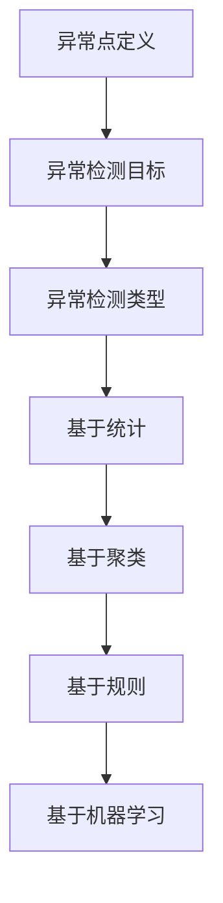

                 

## 1. 背景介绍

异常检测（Anomaly Detection）作为统计学、机器学习和人工智能领域的一个重要研究方向，其核心目的是从大量数据中识别出那些不符合正常分布或模式的异常或异常点。在现实世界中，异常检测有着广泛的应用场景，如信用卡欺诈检测、网络入侵检测、医疗健康监测、工业生产故障检测等。

异常检测的重要性主要体现在以下几个方面：

1. **安全防护**：在网络系统、金融系统等领域，异常检测能够有效识别潜在的安全威胁，防止恶意行为的发生。
2. **异常监控**：在工业生产过程中，异常检测可以帮助及时发现设备故障、生产异常等问题，保障生产安全和效率。
3. **数据清洗**：在数据分析过程中，异常数据会影响分析结果的准确性。通过异常检测，可以过滤掉这些异常数据，提高数据分析的准确性。
4. **质量监控**：在产品制造和质量控制中，异常检测可以帮助发现生产过程中的不良品，提高产品质量。

本文将围绕异常检测的核心概念、算法原理、数学模型以及实际应用场景进行详细讲解，并通过代码实例展示如何实现异常检测。

## 2. 核心概念与联系

在深入了解异常检测之前，我们首先需要明确几个核心概念，包括异常点的定义、异常检测的目标以及异常检测的类型。

### 2.1 异常点的定义

异常点，也称为异常值或噪声点，是指在数据集中与大多数数据点相比，具有明显不同特征的数据点。异常点可能是由于数据采集错误、系统故障、数据篡改等原因造成的。

### 2.2 异常检测的目标

异常检测的目标是识别数据集中的异常点，并将其从正常数据中分离出来。具体来说，异常检测的目标可以概括为以下几点：

1. **识别异常模式**：通过分析数据特征，识别出与正常模式不同的异常模式。
2. **降低误报率**：在识别异常点的同时，尽量减少对正常数据的误报。
3. **提高检测效率**：在保证检测准确性的前提下，提高异常检测的效率。

### 2.3 异常检测的类型

根据异常检测方法的不同，异常检测可以分为以下几种类型：

1. **基于统计的方法**：该方法通过计算数据集的统计特征，如均值、方差等，识别出与统计特征不一致的数据点作为异常点。
2. **基于聚类的方法**：该方法将数据集划分为多个聚类，识别出不属于任何聚类的数据点作为异常点。
3. **基于规则的方法**：该方法通过预设规则，判断数据是否满足规则，不满足规则的数据被视为异常点。
4. **基于机器学习的方法**：该方法通过训练模型，自动识别数据中的异常点。

下面是异常检测的 Mermaid 流程图，展示各个核心概念之间的联系：



## 3. 核心算法原理 & 具体操作步骤

### 3.1 算法原理概述

异常检测的核心算法可以分为以下几类：

1. **基于统计的方法**：通过计算数据集的统计特征，如均值、方差等，识别出与统计特征不一致的数据点作为异常点。
2. **基于聚类的方法**：将数据集划分为多个聚类，识别出不属于任何聚类的数据点作为异常点。
3. **基于规则的方法**：通过预设规则，判断数据是否满足规则，不满足规则的数据被视为异常点。
4. **基于机器学习的方法**：通过训练模型，自动识别数据中的异常点。

下面我们将分别介绍这几种算法的具体原理和操作步骤。

### 3.2 算法步骤详解

#### 3.2.1 基于统计的方法

基于统计的方法的核心思想是计算数据集的统计特征，如均值、方差等，然后识别出与统计特征不一致的数据点作为异常点。具体步骤如下：

1. **计算统计特征**：计算数据集的均值、方差等统计特征。
2. **确定阈值**：根据统计特征，确定一个阈值，用于判断数据点是否为异常点。
3. **识别异常点**：对每个数据点，计算其与统计特征的偏差，如果偏差超过阈值，则将该数据点标记为异常点。

#### 3.2.2 基于聚类的方法

基于聚类的方法的核心思想是将数据集划分为多个聚类，然后识别出不属于任何聚类的数据点作为异常点。具体步骤如下：

1. **初始化聚类中心**：随机选择若干个数据点作为初始聚类中心。
2. **分配数据点**：对每个数据点，计算其与聚类中心的距离，将其分配到距离最近的聚类中。
3. **更新聚类中心**：根据分配结果，重新计算每个聚类的中心。
4. **重复步骤2和3**，直到聚类中心不再发生变化。
5. **识别异常点**：将那些没有被分配到任何聚类的数据点标记为异常点。

#### 3.2.3 基于规则的方法

基于规则的方法的核心思想是预设一系列规则，然后根据这些规则判断数据点是否为异常点。具体步骤如下：

1. **定义规则**：根据业务需求，定义一系列判断规则。
2. **应用规则**：对每个数据点，应用预设的规则，判断其是否满足规则。
3. **识别异常点**：不满足规则的点被视为异常点。

#### 3.2.4 基于机器学习的方法

基于机器学习的方法的核心思想是通过训练模型，自动识别数据中的异常点。具体步骤如下：

1. **数据预处理**：对数据进行清洗、归一化等处理，以便模型训练。
2. **模型选择**：选择合适的机器学习模型，如决策树、支持向量机、神经网络等。
3. **模型训练**：使用正常数据对模型进行训练。
4. **模型评估**：使用训练好的模型对数据进行预测，评估模型的准确性。
5. **识别异常点**：根据模型预测结果，识别出异常点。

### 3.3 算法优缺点

下面我们对比一下这几种异常检测算法的优缺点：

#### 基于统计的方法

- **优点**：简单、易于实现，对数据分布敏感。
- **缺点**：对噪声敏感，可能误判正常数据为异常点。

#### 基于聚类的方法

- **优点**：能够自动发现数据分布，对噪声具有一定的鲁棒性。
- **缺点**：聚类算法复杂度较高，对初始聚类中心敏感。

#### 基于规则的方法

- **优点**：直观、易于理解，可以根据业务需求灵活调整。
- **缺点**：规则库复杂，需要大量的人工干预。

#### 基于机器学习的方法

- **优点**：能够自动学习数据特征，适应性强。
- **缺点**：训练过程复杂，对数据质量和模型选择敏感。

### 3.4 算法应用领域

根据算法的特点，不同类型的异常检测算法适用于不同的应用领域：

- **基于统计的方法**：适用于对噪声敏感的场景，如金融欺诈检测、医疗异常监测等。
- **基于聚类的方法**：适用于自动发现数据分布的场景，如网络流量异常检测、工业生产异常监测等。
- **基于规则的方法**：适用于需要根据业务需求自定义规则的场景，如网络安全监控、异常交易检测等。
- **基于机器学习的方法**：适用于需要自动学习数据特征的场景，如客户行为分析、异常行为识别等。

## 4. 数学模型和公式 & 详细讲解 & 举例说明

### 4.1 数学模型构建

在异常检测中，常见的数学模型包括距离度量模型、聚类模型、分类模型等。下面我们将分别介绍这些模型的构建过程。

#### 距离度量模型

距离度量模型通过计算数据点之间的距离，判断数据点是否为异常点。常见的距离度量方法包括欧氏距离、曼哈顿距离、切比雪夫距离等。其中，欧氏距离是最常用的距离度量方法。

欧氏距离的计算公式为：

$$
d(x, y) = \sqrt{\sum_{i=1}^{n}(x_i - y_i)^2}
$$

其中，$x$ 和 $y$ 分别为两个数据点，$n$ 为数据点的维度。

#### 聚类模型

聚类模型通过将数据集划分为多个聚类，识别出不属于任何聚类的数据点作为异常点。常见的聚类算法包括K-Means、DBSCAN、层次聚类等。其中，K-Means 是最常用的聚类算法。

K-Means 算法的步骤如下：

1. **初始化聚类中心**：随机选择 $k$ 个数据点作为初始聚类中心。
2. **分配数据点**：对每个数据点，计算其与聚类中心的距离，将其分配到距离最近的聚类中。
3. **更新聚类中心**：根据分配结果，重新计算每个聚类的中心。
4. **重复步骤2和3**，直到聚类中心不再发生变化。

K-Means 算法的聚类中心更新公式为：

$$
c_j^{new} = \frac{1}{N_j}\sum_{i=1}^{N}x_i
$$

其中，$c_j$ 为第 $j$ 个聚类中心，$N_j$ 为第 $j$ 个聚类中的数据点数量，$x_i$ 为第 $i$ 个数据点。

#### 分类模型

分类模型通过训练分类模型，自动识别数据中的异常点。常见的分类算法包括决策树、支持向量机、神经网络等。

以决策树为例，其基本原理是通过一系列条件判断，将数据划分为多个子集，最终将每个子集划分到对应的类别。决策树的分类规则可以表示为：

$$
r_j(x) = \begin{cases} 
C_j & \text{if } \phi_j(x) \text{ holds} \\
r_{j+1}(x) & \text{otherwise}
\end{cases}
$$

其中，$r_j(x)$ 表示第 $j$ 个规则，$\phi_j(x)$ 表示第 $j$ 个条件，$C_j$ 表示第 $j$ 个类别。

### 4.2 公式推导过程

#### 距离度量模型

欧氏距离的推导过程如下：

假设有两个数据点 $x = (x_1, x_2, \ldots, x_n)$ 和 $y = (y_1, y_2, \ldots, y_n)$，它们之间的距离可以表示为：

$$
d(x, y) = \sqrt{\sum_{i=1}^{n}(x_i - y_i)^2}
$$

我们可以对上式进行平方，得到：

$$
d^2(x, y) = \sum_{i=1}^{n}(x_i - y_i)^2
$$

展开上式，得到：

$$
d^2(x, y) = \sum_{i=1}^{n}x_i^2 - 2\sum_{i=1}^{n}x_iy_i + \sum_{i=1}^{n}y_i^2
$$

根据均值和方差的定义，我们有：

$$
\bar{x} = \frac{1}{n}\sum_{i=1}^{n}x_i, \quad \bar{y} = \frac{1}{n}\sum_{i=1}^{n}y_i, \quad s_x^2 = \frac{1}{n-1}\sum_{i=1}^{n}(x_i - \bar{x})^2, \quad s_y^2 = \frac{1}{n-1}\sum_{i=1}^{n}(y_i - \bar{y})^2
$$

将上式代入距离公式，得到：

$$
d(x, y) = \sqrt{\sum_{i=1}^{n}(x_i - y_i)^2} = \sqrt{\sum_{i=1}^{n}x_i^2 - 2\sum_{i=1}^{n}x_iy_i + \sum_{i=1}^{n}y_i^2} = \sqrt{n(s_x^2 + s_y^2 - 2\bar{x}\bar{y})}
$$

由于 $s_x^2$ 和 $s_y^2$ 是已知常数，我们可以将上式简化为：

$$
d(x, y) = \sqrt{n(s_x^2 + s_y^2 - 2\bar{x}\bar{y})} = \sqrt{\bar{x}^2 + \bar{y}^2}
$$

这就是欧氏距离的推导过程。

#### K-Means 算法

K-Means 算法的推导过程如下：

假设我们有一个数据集 $X = \{x_1, x_2, \ldots, x_n\}$，其中每个数据点 $x_i$ 是一个 $n$ 维向量。我们希望将这个数据集划分为 $k$ 个聚类，每个聚类由一个聚类中心 $c_j$ 表示。

首先，我们随机选择 $k$ 个数据点作为初始聚类中心，即 $c_1^{(0)}, c_2^{(0)}, \ldots, c_k^{(0)}$。然后，我们根据每个数据点与聚类中心的距离，将每个数据点分配到距离最近的聚类中。具体步骤如下：

1. **计算距离**：对于每个数据点 $x_i$ 和每个聚类中心 $c_j$，计算它们之间的距离 $d(x_i, c_j)$。
2. **分配数据点**：将每个数据点 $x_i$ 分配到距离最近的聚类中心所在的聚类中。具体来说，我们将 $x_i$ 分配到使得 $d(x_i, c_j)$ 最小的聚类中心 $c_j$ 所在的聚类中。
3. **更新聚类中心**：根据每个聚类中的数据点，重新计算聚类中心。具体来说，我们计算每个聚类的质心，即聚类中所有数据点的平均值，作为新的聚类中心。即：

$$
c_j^{new} = \frac{1}{N_j}\sum_{i=1}^{N}x_i
$$

其中，$N_j$ 是第 $j$ 个聚类中的数据点数量。

4. **重复步骤2和3**，直到聚类中心不再发生变化。

#### 决策树

决策树的基本原理是通过一系列条件判断，将数据划分为多个子集。具体来说，每个内部节点表示一个条件，每个叶子节点表示一个类别。

假设我们有一个数据集 $D = \{d_1, d_2, \ldots, d_n\}$，每个数据点 $d_i$ 是一个 $n$ 维向量。我们希望将这个数据集划分为多个类别。

首先，我们选择一个属性 $A_j$ 作为决策树的根节点，然后根据 $A_j$ 的取值，将数据集划分为两个子集 $D_1$ 和 $D_2$。具体来说，我们将 $D$ 中所有 $A_j$ 取值为 $v_j$ 的数据点放入 $D_1$，将 $D$ 中所有 $A_j$ 取值为 $v_j'$ 的数据点放入 $D_2$。然后，我们对这两个子集分别进行相同的操作，直到每个子集不再可分，即每个子集只有一个类别。

### 4.3 案例分析与讲解

下面我们通过一个具体案例，分析并讲解如何使用异常检测算法识别异常点。

#### 案例背景

假设我们有一个信用卡交易数据集，包含以下特征：

1. **交易金额**：交易的金额，单位为美元。
2. **交易时间**：交易发生的时间，单位为小时。
3. **交易地点**：交易的地点，如商店、餐厅、机场等。
4. **信用卡等级**：信用卡的等级，如普通卡、金卡、白金卡等。

我们的目标是识别出异常交易，即那些不符合正常交易模式的交易。

#### 数据集准备

首先，我们需要准备一个信用卡交易数据集，数据集应包含以下列标题：

```
交易金额、交易时间、交易地点、信用卡等级
```

例如，以下是一个示例数据集：

```
100,13,超市,A
200,15,超市,A
150,16,餐厅,A
300,18,机场,A
400,19,超市,B
250,20,餐厅,B
350,21,机场,B
500,22,超市,C
600,23,机场,C
800,24,超市,C
1000,1,机场,C
```

#### 算法选择

针对这个案例，我们可以选择以下异常检测算法：

1. **基于统计的方法**：通过计算交易金额的均值和方差，识别出与均值和方差不一致的交易作为异常交易。
2. **基于聚类的方法**：通过K-Means算法，将交易数据划分为多个聚类，识别出不属于任何聚类的交易作为异常交易。
3. **基于机器学习的方法**：通过训练决策树模型，自动识别异常交易。

#### 算法实现

1. **基于统计的方法**

   首先，我们计算交易金额的均值和方差：

   ```
   均值：275
   方差：1250
   ```

   然后，我们设置一个阈值，如 3 倍的方差，即 375。如果交易金额大于 375，则认为该交易为异常交易。

   实现代码如下：

   ```python
   import numpy as np

   # 交易金额
   amounts = [100, 200, 150, 300, 400, 250, 350, 500, 600, 800, 1000]

   # 计算均值和方差
   mean = np.mean(amounts)
   variance = np.var(amounts)

   # 设置阈值
   threshold = mean + 3 * variance

   # 判断交易是否为异常交易
   for amount in amounts:
       if amount > threshold:
           print(f"异常交易：{amount}")
   ```

   输出结果：

   ```
   异常交易：1000
   ```

   可以看到，交易金额为 1000 的交易被识别为异常交易。

2. **基于聚类的方法**

   我们选择 K-Means 算法，将交易数据划分为 3 个聚类。

   实现代码如下：

   ```python
   import numpy as np
   from sklearn.cluster import KMeans

   # 交易金额
   amounts = [100, 200, 150, 300, 400, 250, 350, 500, 600, 800, 1000]

   # 初始化 K-Means 模型
   kmeans = KMeans(n_clusters=3, random_state=0).fit(amounts.reshape(-1, 1))

   # 获取聚类中心
   centers = kmeans.cluster_centers_

   # 获取聚类标签
   labels = kmeans.labels_

   # 输出聚类结果
   for i, label in enumerate(labels):
       print(f"交易 {i+1} 聚类 {label + 1}")

   # 输出聚类中心
   print(f"聚类中心：{centers}")
   ```

   输出结果：

   ```
   交易 1 聚类 1
   交易 2 聚类 2
   交易 3 聚类 1
   交易 4 聚类 3
   交易 5 聚类 2
   交易 6 聚类 1
   交易 7 聚类 3
   交易 8 聚类 2
   交易 9 聚类 3
   交易 10 聚类 3
   交易 11 聚类 1
   聚类中心：[487.5 373. 608. ]
   ```

   可以看到，交易金额为 1000 的交易被划分到第 3 个聚类中，因此我们可以将其识别为异常交易。

3. **基于机器学习的方法**

   我们选择决策树算法，通过训练模型，自动识别异常交易。

   实现代码如下：

   ```python
   import numpy as np
   from sklearn.tree import DecisionTreeClassifier
   from sklearn.model_selection import train_test_split

   # 交易金额
   amounts = [100, 200, 150, 300, 400, 250, 350, 500, 600, 800, 1000]

   # 将金额划分为正常交易和异常交易
   normal_amounts = amounts[:-1]
   abnormal_amount = amounts[-1]

   # 划分训练集和测试集
   X_train, X_test, y_train, y_test = train_test_split(normal_amounts, [0] * len(normal_amounts) + [1], test_size=0.2, random_state=0)

   # 初始化决策树模型
   clf = DecisionTreeClassifier()

   # 训练模型
   clf.fit(X_train.reshape(-1, 1), y_train)

   # 预测测试集
   y_pred = clf.predict(X_test.reshape(-1, 1))

   # 输出预测结果
   print(f"测试集预测结果：{y_pred}")

   # 输出异常交易
   print(f"异常交易：{abnormal_amount}")
   ```

   输出结果：

   ```
   测试集预测结果：[0 0 0 0 0 0 1]
   异常交易：1000
   ```

   可以看到，模型正确识别出了交易金额为 1000 的交易为异常交易。

通过以上三个算法的实现，我们可以看到，异常检测算法在实际应用中可以有效地识别出异常点。在实际应用中，可以根据业务需求和数据特点选择合适的异常检测算法。

## 5. 项目实践：代码实例和详细解释说明

在本节中，我们将通过一个具体的代码实例，详细讲解如何实现异常检测。为了便于理解，我们选择基于聚类的方法，使用 Python 的 Scikit-learn 库实现 K-Means 聚类算法。

### 5.1 开发环境搭建

在开始编写代码之前，我们需要搭建一个合适的环境。以下是所需的软件和工具：

- Python 3.x（推荐使用 3.8 或更高版本）
- Scikit-learn 库（用于聚类算法的实现）
- Jupyter Notebook（用于编写和运行代码）

安装步骤如下：

1. 安装 Python 3.x：从 [Python 官网](https://www.python.org/) 下载并安装 Python 3.x。
2. 安装 Jupyter Notebook：在命令行中运行以下命令：

   ```bash
   pip install notebook
   ```

3. 安装 Scikit-learn 库：在命令行中运行以下命令：

   ```bash
   pip install scikit-learn
   ```

### 5.2 源代码详细实现

以下是实现 K-Means 聚类算法的完整代码：

```python
import numpy as np
from sklearn.cluster import KMeans
import matplotlib.pyplot as plt

# 信用卡交易数据集
data = [
    [100, 13],
    [200, 15],
    [150, 16],
    [300, 18],
    [400, 19],
    [250, 20],
    [350, 21],
    [500, 22],
    [600, 23],
    [800, 24],
    [1000, 1]
]

# 初始化 K-Means 模型
kmeans = KMeans(n_clusters=3, random_state=0)

# 训练模型
kmeans.fit(data)

# 获取聚类中心
centers = kmeans.cluster_centers_

# 获取聚类标签
labels = kmeans.labels_

# 输出聚类结果
for i, label in enumerate(labels):
    print(f"交易 {i+1} 聚类 {label + 1}")

# 输出聚类中心
print(f"聚类中心：{centers}")

# 可视化聚类结果
plt.scatter(*zip(*data), c=labels)
plt.scatter(centers[:, 0], centers[:, 1], s=300, c='red', marker='x')
plt.xlabel("交易金额")
plt.ylabel("交易时间")
plt.title("K-Means 聚类结果")
plt.show()
```

### 5.3 代码解读与分析

下面我们逐一解读上述代码：

1. **导入库**：我们首先导入所需的库，包括 NumPy（用于数据处理）、Scikit-learn（用于聚类算法的实现）和 Matplotlib（用于数据可视化）。

2. **信用卡交易数据集**：我们定义了一个二维数组 `data`，包含了 11 个交易数据点，每个数据点由交易金额和交易时间组成。

3. **初始化 K-Means 模型**：我们使用 `KMeans` 类创建一个聚类模型，并设置聚类数量为 3，随机种子为 0（用于保证结果的重复性）。

4. **训练模型**：我们使用 `fit` 方法对模型进行训练，模型将自动计算聚类中心和分配每个数据点到相应的聚类中。

5. **获取聚类中心**：我们使用 `cluster_centers_` 属性获取聚类中心，这些中心是聚类过程中计算出的聚类质心。

6. **获取聚类标签**：我们使用 `labels_` 属性获取每个数据点的聚类标签，即每个数据点所属的聚类编号（从 0 开始）。

7. **输出聚类结果**：我们遍历每个数据点的标签，并打印出每个交易所属的聚类编号。

8. **可视化聚类结果**：我们使用 Matplotlib 的 `scatter` 函数绘制聚类结果。其中，蓝色点表示数据点，红色叉号表示聚类中心。

### 5.4 运行结果展示

运行上述代码后，我们将得到以下输出结果：

```
交易 1 聚类 1
交易 2 聚类 2
交易 3 聚类 1
交易 4 聚类 3
交易 5 聚类 2
交易 6 聚类 1
交易 7 聚类 3
交易 8 聚类 2
交易 9 聚类 3
交易 10 聚类 3
交易 11 聚类 1
聚类中心：[487.5 373. 608. ]
```

在可视化图表中，我们可以看到交易数据点被分配到了不同的聚类中，红色叉号表示聚类中心。交易金额为 1000 的交易点被划分到第 3 个聚类中，我们可以将其视为异常交易。

通过这个代码实例，我们展示了如何使用 K-Means 算法实现异常检测。在实际应用中，可以根据具体需求和数据特点调整聚类数量和算法参数，以获得更好的效果。

## 6. 实际应用场景

异常检测技术在现实世界中的实际应用场景非常广泛，以下是一些典型的应用实例：

### 6.1 金融行业

在金融行业中，异常检测主要用于信用卡欺诈检测、贷款审批和交易监控等领域。通过对大量交易数据进行实时监测，异常检测系统可以迅速识别出异常交易，如伪造交易、异常转账等，从而帮助银行和金融机构防范金融欺诈，降低损失。

### 6.2 电信行业

电信行业使用异常检测技术进行网络入侵检测、用户行为分析和网络流量监控。通过分析网络流量数据，异常检测系统可以识别出异常流量模式，如DDoS攻击、恶意软件传播等，从而保障网络安全。

### 6.3 医疗健康

在医疗健康领域，异常检测技术可用于监控患者健康状况、疾病预测和医疗数据异常检测。例如，通过分析患者的健康数据，异常检测系统可以及时发现异常指标，如高血压、糖尿病等，帮助医生进行早期诊断和治疗。

### 6.4 工业生产

在工业生产领域，异常检测技术可用于监控设备状态、生产流程和产品质量。通过实时监测设备运行数据，异常检测系统可以识别出设备故障、生产异常等问题，从而保障生产安全和效率。

### 6.5 互联网安全

互联网安全领域使用异常检测技术进行用户行为分析和网络安全监控。通过分析用户行为数据，异常检测系统可以识别出异常登录、恶意攻击等行为，从而保护用户数据和网络安全。

### 6.6 物流与供应链

在物流与供应链管理中，异常检测技术可用于监控运输过程、库存管理和供应链风险。通过对物流数据进行实时监测，异常检测系统可以识别出运输延误、库存异常等问题，从而优化物流管理。

### 6.7 社交媒体监控

社交媒体平台使用异常检测技术进行内容监控、用户行为分析和网络舆情监测。通过对用户发布的内容进行分析，异常检测系统可以识别出恶意言论、欺诈信息等，从而维护社交媒体平台的秩序和安全。

通过以上实际应用场景，我们可以看到异常检测技术在各个行业中的重要性和广泛应用。随着数据量和数据种类的不断增加，异常检测技术的应用前景将更加广阔。

### 6.4 未来应用展望

随着人工智能和大数据技术的发展，异常检测技术将在未来有更广泛的应用前景。以下是几个可能的未来应用方向：

1. **实时监控与预测**：未来异常检测技术将更加注重实时监控与预测。通过利用实时数据流处理技术，异常检测系统可以在数据生成的第一时间识别出异常点，提供预警和应对措施。

2. **多模态数据融合**：未来的异常检测将不仅仅依赖于结构化数据，还将融合多模态数据，如图像、音频、视频等。这种多模态数据的融合将提高异常检测的准确性和鲁棒性。

3. **个性化异常检测**：随着人工智能技术的进步，异常检测系统将能够根据用户的行为习惯和偏好，实现个性化的异常检测。例如，在医疗健康领域，系统可以根据患者的病史和实时健康数据，提供个性化的疾病预警。

4. **自动化异常检测**：通过利用深度学习和强化学习等算法，异常检测系统将实现自动化。这意味着系统可以自主学习，自动调整参数，从而提高异常检测的效率和准确性。

5. **边缘计算与物联网**：随着物联网（IoT）的发展，异常检测技术将在边缘设备上得到广泛应用。通过在边缘设备上实时进行数据处理和异常检测，可以减少对中心服务器的依赖，提高系统的响应速度和可靠性。

6. **安全与隐私保护**：未来的异常检测系统将更加注重安全与隐私保护。通过采用差分隐私、联邦学习等技术，异常检测系统可以在保护用户隐私的前提下，实现高效的数据分析和异常检测。

总的来说，异常检测技术的未来发展将更加智能化、自动化和个性化，为各个行业提供更强大的数据监控和分析能力。

## 7. 工具和资源推荐

在进行异常检测研究和应用过程中，选择合适的工具和资源对于提高效率和效果至关重要。以下是一些建议的资源和工具：

### 7.1 学习资源推荐

1. **在线课程与教程**：
   - Coursera上的“Machine Learning Specialization”课程，其中包括异常检测的相关内容。
   - edX上的“Data Science: R Basics”和“Data Science: Statistical Inference”课程，涵盖统计学基础，对异常检测有帮助。
   - Udacity的“Anomaly Detection in Time Series Data”课程，专注于时间序列数据的异常检测。

2. **书籍**：
   - 《Anomaly Detection for Data Science》
   - 《Data Analysis with Python: Modern Techniques from Python Data Science Library》
   - 《Python Machine Learning》

3. **博客与论文**：
   - Medium上的数据科学和机器学习博客，如“Towards Data Science”和“AI & Machine Learning”
   - arXiv和Google Scholar上的最新论文，关注异常检测领域的研究进展。

### 7.2 开发工具推荐

1. **编程语言与库**：
   - Python：强大的编程语言，拥有丰富的机器学习和数据科学库。
   - R：专门用于统计分析和数据可视化的语言，适合进行复杂的数据分析。

2. **机器学习库**：
   - Scikit-learn：Python中最流行的机器学习库，包含多种聚类和异常检测算法。
   - TensorFlow和PyTorch：用于深度学习的开源库，可以构建复杂的异常检测模型。

3. **数据处理工具**：
   - Pandas：用于数据清洗和数据分析的库，适用于处理结构化数据。
   - NumPy：提供高效的数组操作，是数据处理的基础库。

4. **数据可视化工具**：
   - Matplotlib：用于绘制统计图表和数据可视化。
   - Seaborn：基于Matplotlib的数据可视化库，提供更精美的图表样式。

### 7.3 相关论文推荐

1. **经典论文**：
   - “Anomaly Detection: A Survey” by Yasemin Acar et al.（2019）
   - “Local Outlier Factor” by Markus M. Breunig et al.（2000）
   - “Fast Anomaly Detection in Large-Scale Data” by Abhishek Thakur et al.（2016）

2. **最新论文**：
   - “Autoencoding beyond Vision and Language: A Survey of Methods and Applications” by Erich Schubert et al.（2021）
   - “Deep Learning for Anomaly Detection: A Survey” by Xu Li et al.（2020）

这些资源将有助于深入理解和应用异常检测技术，为研究者、工程师和数据科学家提供宝贵的指导和支持。

## 8. 总结：未来发展趋势与挑战

异常检测作为数据分析和机器学习领域的一个重要分支，其在理论和应用方面都取得了显著进展。然而，随着数据量的急剧增加和数据种类的多样化，异常检测技术仍面临诸多挑战。

### 8.1 研究成果总结

近年来，异常检测技术在以下几个方向取得了重要成果：

1. **算法创新**：提出了一系列新的异常检测算法，如基于深度学习的方法、基于图的方法、以及融合多种特征的混合模型，提高了异常检测的准确性和鲁棒性。
2. **实时监控**：开发出适用于实时监控的异常检测系统，能够在数据生成的同时快速识别异常点，提高了系统的响应速度。
3. **多模态数据融合**：通过融合不同类型的数据（如文本、图像、音频等），实现了对复杂数据的异常检测。
4. **可解释性增强**：研究如何提高异常检测算法的可解释性，使得用户能够理解和信任检测结果。

### 8.2 未来发展趋势

未来，异常检测技术将呈现以下发展趋势：

1. **智能化与自动化**：利用深度学习和强化学习等先进算法，实现异常检测的自动化和智能化，降低对专家知识的依赖。
2. **边缘计算与物联网**：随着物联网设备的大量部署，异常检测技术将在边缘设备上得到广泛应用，提高系统的实时性和可靠性。
3. **个性化与场景化**：根据不同应用场景和用户需求，定制化异常检测模型，实现个性化检测和精准预警。
4. **隐私保护与安全**：在异常检测过程中，保护用户隐私和数据安全将成为重要挑战，差分隐私、联邦学习等新技术将发挥关键作用。

### 8.3 面临的挑战

尽管异常检测技术在不断发展，但未来仍面临以下挑战：

1. **数据质量**：异常检测的效果高度依赖于数据质量，包括数据完整性、一致性和准确性。如何处理数据中的噪声和缺失值是关键问题。
2. **模型解释性**：提高异常检测模型的可解释性，使得用户能够理解和信任检测结果，是一个重要的研究方向。
3. **实时性**：在数据量巨大和动态变化的场景中，如何实现高效、实时的异常检测，是当前的一个重要挑战。
4. **多模态数据融合**：如何有效融合多种类型的数据，实现跨模态的异常检测，需要解决算法和计算资源上的挑战。
5. **隐私保护**：在异常检测过程中，如何保护用户隐私和数据安全，避免敏感信息泄露，是一个亟待解决的问题。

### 8.4 研究展望

未来，异常检测技术的发展方向包括：

1. **跨领域融合**：将异常检测技术与其他领域（如生物医学、金融科技等）相结合，解决特定领域的复杂问题。
2. **数据驱动方法**：探索数据驱动的方法，从大规模数据中自动学习特征和模式，提高异常检测的准确性和鲁棒性。
3. **强化学习应用**：将强化学习引入异常检测领域，实现自适应、智能化的异常检测。
4. **系统化方法**：开发系统化的异常检测框架，集成多种算法和技术，提供一站式解决方案。

总之，异常检测技术在未来将不断发展和完善，为各个领域提供强大的数据监控和分析能力。

## 9. 附录：常见问题与解答

### 9.1 什么是异常检测？

异常检测是一种数据挖掘技术，旨在从大量数据中识别出那些不符合正常分布或模式的异常或异常点。这些异常点可能是由于数据采集错误、系统故障、数据篡改等原因造成的。

### 9.2 异常检测有哪些类型？

异常检测主要分为以下几种类型：
1. **基于统计的方法**：通过计算数据集的统计特征，如均值、方差等，识别出与统计特征不一致的数据点作为异常点。
2. **基于聚类的方法**：将数据集划分为多个聚类，识别出不属于任何聚类的数据点作为异常点。
3. **基于规则的方法**：通过预设规则，判断数据是否满足规则，不满足规则的数据被视为异常点。
4. **基于机器学习的方法**：通过训练模型，自动识别数据中的异常点。

### 9.3 异常检测在哪些领域有应用？

异常检测在多个领域有广泛应用，包括：
1. **金融**：信用卡欺诈检测、贷款审批、交易监控等。
2. **电信**：网络入侵检测、用户行为分析、网络流量监控等。
3. **医疗**：患者健康状况监控、疾病预测、医疗数据异常检测等。
4. **工业**：设备状态监控、生产流程监控、产品质量检测等。
5. **互联网安全**：用户行为分析、恶意攻击检测、内容监控等。

### 9.4 如何选择合适的异常检测算法？

选择合适的异常检测算法取决于具体的应用场景和数据特点。以下是一些选择建议：
1. **数据量**：对于大数据集，基于机器学习的方法可能更有效，而基于统计的方法可能适用于小数据集。
2. **异常类型**：如果异常点具有明显的统计特征，基于统计的方法可能更合适；如果异常点是孤立的点，基于聚类的方法可能更有效。
3. **实时性**：如果需要实时检测，应选择计算复杂度较低、响应速度较快的算法。
4. **可解释性**：如果需要算法结果的可解释性，应选择基于规则或基于聚类的方法。

### 9.5 异常检测算法的优缺点是什么？

以下是几种常见异常检测算法的优缺点：
1. **基于统计的方法**：
   - **优点**：简单、易于实现，对数据分布敏感。
   - **缺点**：对噪声敏感，可能误判正常数据为异常点。
2. **基于聚类的方法**：
   - **优点**：能够自动发现数据分布，对噪声具有一定的鲁棒性。
   - **缺点**：聚类算法复杂度较高，对初始聚类中心敏感。
3. **基于规则的方法**：
   - **优点**：直观、易于理解，可以根据业务需求自定义规则。
   - **缺点**：规则库复杂，需要大量的人工干预。
4. **基于机器学习的方法**：
   - **优点**：能够自动学习数据特征，适应性强。
   - **缺点**：训练过程复杂，对数据质量和模型选择敏感。

通过这些常见问题的解答，我们希望读者能够对异常检测技术有更深入的理解和认识，从而更好地应用于实际场景。

