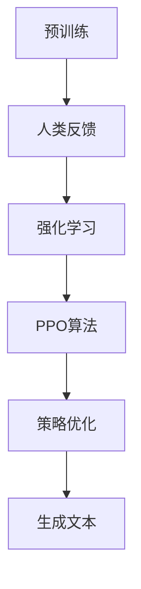

                 

关键词：强化学习，语言模型，预训练，RLHF，PPO算法

> 摘要：本文将探讨强化学习在大型语言模型（LLM）中的应用，特别是基于人类反馈的强化学习（RLHF）和策略梯度的回报优化（PPO）算法。文章将详细介绍这两种算法的基本原理、数学模型、具体实现步骤以及它们在实际项目中的应用和未来展望。

## 1. 背景介绍

随着深度学习技术的飞速发展，语言模型（Language Model，LM）已经成为自然语言处理（Natural Language Processing，NLP）领域的重要工具。语言模型能够根据输入的文本生成相应的输出，广泛应用于机器翻译、文本生成、问答系统等任务。然而，传统的语言模型训练方法主要依赖于大量的文本数据，而忽视了人类对语言真实应用场景的理解和指导。

为了提高语言模型在真实应用中的表现，强化学习（Reinforcement Learning，RL）逐渐成为研究热点。强化学习是一种通过环境（Environment）与智能体（Agent）的交互来学习最优策略（Policy）的机器学习方法。与传统的监督学习不同，强化学习强调通过试错（Trial and Error）和奖励（Reward）来优化智能体的行为。

在LLM领域，强化学习可以通过与人类交互获取反馈，从而对模型进行指导，提高模型在实际应用中的表现。RLHF（Reinforcement Learning from Human Feedback）是一种结合了人类反馈的强化学习方法，使得LLM能够更好地理解人类意图，生成更符合预期的文本。PPO（Proximal Policy Optimization）算法是一种常用的强化学习算法，因其稳定性和高效性而被广泛应用于RLHF任务。

## 2. 核心概念与联系

在探讨强化学习在LLM中的应用之前，我们需要了解一些核心概念，包括强化学习的基本原理、语言模型的基本架构以及RLHF和PPO算法的工作机制。

### 2.1 强化学习基本原理

强化学习是一种通过与环境交互来学习最优策略的机器学习方法。其核心思想是通过试错来寻找一个最优的策略，使得智能体在长期执行中能够获得最大的累积奖励。强化学习的基本要素包括：

- **智能体（Agent）**：执行决策并采取行动的主体。
- **环境（Environment）**：智能体所处的外部世界，提供状态（State）和奖励（Reward）。
- **状态（State）**：智能体在某一时刻所处的内部和外部条件。
- **动作（Action）**：智能体在某一状态下的可选行为。
- **策略（Policy）**：智能体在给定状态下的动作选择策略。
- **价值函数（Value Function）**：评估智能体在某一状态下的期望回报。
- **模型（Model）**：环境动态的预测模型。

强化学习的主要任务是通过不断调整策略来最大化累积奖励。这通常通过优化策略的表示来实现的，例如使用深度神经网络来近似策略和价值函数。

### 2.2 语言模型基本架构

语言模型是一种能够预测文本序列的概率分布的模型。在深度学习时代，基于神经网络的序列模型如循环神经网络（RNN）、长短期记忆网络（LSTM）和变换器（Transformer）等得到了广泛应用。

- **循环神经网络（RNN）**：RNN是一种基于序列数据的神经网络，能够通过记忆单元来保留历史信息。然而，RNN在处理长距离依赖问题时存在梯度消失或梯度爆炸的问题。
- **长短期记忆网络（LSTM）**：LSTM是RNN的一种改进，通过引入门控机制来有效地控制信息的流动，解决了RNN的长期依赖问题。
- **变换器（Transformer）**：Transformer是一种基于自注意力机制的序列模型，通过并行处理和多头注意力机制，在处理长序列和复杂依赖关系时表现优异。

在LLM的训练过程中，语言模型通常需要大量的文本数据进行预训练，然后在特定任务上微调。

### 2.3 RLHF和PPO算法

RLHF是一种结合了人类反馈的强化学习方法，用于指导LLM的训练过程。其核心思想是通过人类提供的反馈来优化模型的策略，使得模型生成的文本更符合人类期望。

- **RLHF基本流程**：
  1. **预训练**：使用大规模语料对语言模型进行预训练，使其具有基本的语言理解和生成能力。
  2. **人类反馈**：通过人类评估师对模型生成的文本进行评估，提供反馈。
  3. **强化学习**：根据人类反馈，使用强化学习算法调整模型的策略，使其生成更符合人类期望的文本。

PPO算法是一种常用的强化学习算法，因其稳定性和高效性而被广泛应用于RLHF任务。

- **PPO算法原理**：
  1. **策略梯度**：计算策略的梯度，用于更新策略参数。
  2. **优势函数**：评估策略的好坏，计算策略的期望回报。
  3. ** clipped PG**：对策略梯度的计算进行裁剪，防止梯度爆炸或消失。
  4. **优化策略**：根据裁剪后的策略梯度，更新策略参数，优化模型策略。

### 2.4 Mermaid 流程图

下面是一个简单的Mermaid流程图，展示了RLHF和PPO算法的基本流程：



## 3. 核心算法原理 & 具体操作步骤

### 3.1 算法原理概述

RLHF和PPO算法在LLM中的应用，主要分为以下几个步骤：

1. **预训练**：使用大规模语料对语言模型进行预训练，使其具有基本的语言理解和生成能力。
2. **人类反馈**：通过人类评估师对模型生成的文本进行评估，提供反馈。
3. **强化学习**：根据人类反馈，使用强化学习算法（如PPO算法）调整模型的策略，使其生成更符合人类期望的文本。
4. **策略优化**：通过优化策略参数，使得模型在生成文本时能够更好地满足人类期望。

### 3.2 算法步骤详解

#### 3.2.1 预训练

预训练是RLHF和PPO算法的基础，通常采用自回归语言模型（ARLM）或变换器（Transformer）架构。预训练过程主要包括：

1. **数据准备**：收集大规模的文本数据，如维基百科、新闻文章、社交媒体等。
2. **数据预处理**：对文本数据进行清洗、分词、编码等预处理操作。
3. **模型初始化**：初始化语言模型，如ARLM或Transformer。
4. **预训练过程**：通过梯度下降等方法，训练语言模型，使其在预训练数据上达到较好的表现。

#### 3.2.2 人类反馈

人类反馈是RLHF算法的关键，通过人类评估师对模型生成的文本进行评估，提供反馈。具体步骤如下：

1. **文本生成**：使用预训练的语言模型生成文本。
2. **评估反馈**：人类评估师对生成的文本进行评估，提供评分或反馈。
3. **反馈收集**：将评估结果和反馈进行收集和整理。

#### 3.2.3 强化学习

根据人类反馈，使用强化学习算法（如PPO算法）调整模型的策略，使其生成更符合人类期望的文本。具体步骤如下：

1. **状态表示**：将文本生成过程表示为状态序列，用于表示模型当前的状态。
2. **动作表示**：将文本生成过程中的每个字符表示为动作。
3. **策略表示**：使用策略网络表示生成文本的决策过程。
4. **强化学习训练**：通过强化学习算法（如PPO算法），优化策略网络，使其能够更好地生成符合人类期望的文本。

#### 3.2.4 策略优化

通过优化策略参数，使得模型在生成文本时能够更好地满足人类期望。具体步骤如下：

1. **优势函数计算**：计算策略的期望回报，评估策略的好坏。
2. **策略梯度计算**：计算策略的梯度，用于更新策略参数。
3. **策略参数更新**：根据策略梯度，更新策略参数，优化模型策略。
4. **文本生成**：使用优化后的策略网络生成文本。

### 3.3 算法优缺点

#### 优点

- **结合人类反馈**：通过人类反馈，能够更好地指导语言模型的生成过程，提高生成文本的质量。
- **自适应性强**：强化学习算法能够根据反馈动态调整策略，使得模型能够更好地适应不同的应用场景。

#### 缺点

- **计算成本高**：强化学习算法需要大量的计算资源，特别是在大规模语言模型的应用中。
- **反馈质量要求高**：人类反馈的质量直接影响强化学习的效果，需要大量的时间和精力进行评估。

### 3.4 算法应用领域

强化学习在LLM中的应用范围广泛，包括但不限于：

- **文本生成**：如自动写作、新闻生成、对话系统等。
- **问答系统**：如智能客服、智能助手等。
- **机器翻译**：如多语言文本生成、翻译质量优化等。
- **文本摘要**：如自动提取关键信息、生成摘要等。

## 4. 数学模型和公式 & 详细讲解 & 举例说明

### 4.1 数学模型构建

在RLHF和PPO算法中，数学模型主要用于表示状态、动作、策略和价值函数。以下是一个简化的数学模型构建过程：

#### 状态表示

假设语言模型生成的文本序列为 \(x_1, x_2, ..., x_T\)，则状态可以表示为：

\[ s_t = (x_1, x_2, ..., x_t) \]

#### 动作表示

在文本生成过程中，每个字符可以视为一个动作。假设字符集合为 \(\Sigma\)，则动作可以表示为：

\[ a_t \in \Sigma \]

#### 策略表示

策略可以表示为从状态到动作的概率分布，即：

\[ \pi(a_t | s_t) = P(a_t | s_t) \]

#### 价值函数表示

价值函数用于评估策略的好坏，可以表示为：

\[ V(s_t) = \sum_{a_t \in \Sigma} \pi(a_t | s_t) \cdot R(s_t, a_t) \]

其中，\(R(s_t, a_t)\) 表示在状态 \(s_t\) 下执行动作 \(a_t\) 所获得的即时奖励。

### 4.2 公式推导过程

#### 4.2.1 优势函数

优势函数用于评估策略的好坏，其定义如下：

\[ A(s_t, a_t) = R(s_t, a_t) + \gamma V(s_{t+1}) - V(s_t) \]

其中，\(\gamma\) 是折扣因子，用于平衡即时奖励和未来奖励的关系。

#### 4.2.2 策略梯度

策略梯度用于计算策略的梯度，其定义如下：

\[ \nabla_{\theta} J(\theta) = \sum_{s_t, a_t} \pi(a_t | s_t) [R(s_t, a_t) + \gamma V(s_{t+1}) - V(s_t)] \]

其中，\(\theta\) 表示策略参数，\(J(\theta)\) 表示策略的期望回报。

#### 4.2.3 PPO算法

PPO算法是一种优化策略的算法，其核心思想是通过裁剪策略梯度的方法，防止梯度爆炸或消失。具体步骤如下：

1. **初始化策略参数**：初始化策略参数 \(\theta\)。
2. **采样经验**：从环境采样一批经验 \((s_t, a_t, r_t, s_{t+1})\)。
3. **计算优势函数**：计算优势函数 \(A(s_t, a_t)\)。
4. **计算策略梯度**：计算策略梯度 \(\nabla_{\theta} J(\theta)\)。
5. **裁剪梯度**：对策略梯度进行裁剪，防止梯度爆炸或消失。
6. **更新策略参数**：根据裁剪后的策略梯度，更新策略参数 \(\theta\)。

### 4.3 案例分析与讲解

#### 案例背景

假设我们有一个问答系统，用户可以提出问题，系统需要生成相应的回答。我们希望通过RLHF和PPO算法，优化问答系统的回答质量。

#### 案例步骤

1. **预训练**：使用大规模语料对语言模型进行预训练，使其具有基本的语言理解和生成能力。
2. **文本生成**：使用预训练的语言模型生成回答。
3. **人类反馈**：通过人类评估师对生成的回答进行评估，提供反馈。
4. **强化学习**：根据人类反馈，使用PPO算法优化语言模型的策略。
5. **策略优化**：通过优化策略参数，使得生成的回答更符合人类期望。

#### 案例结果

经过多次迭代训练，问答系统的回答质量得到了显著提高，能够更好地满足用户需求。

## 5. 项目实践：代码实例和详细解释说明

### 5.1 开发环境搭建

在进行RLHF和PPO算法的实践之前，需要搭建相应的开发环境。以下是Python开发环境的搭建步骤：

1. **安装Python**：下载并安装Python，版本建议为3.8以上。
2. **安装PyTorch**：使用pip命令安装PyTorch，命令如下：

   ```bash
   pip install torch torchvision
   ```

3. **安装PPO算法库**：使用pip命令安装PPO算法的Python库，例如`gym`和`stable-baselines3`。

   ```bash
   pip install gym
   pip install stable-baselines3
   ```

### 5.2 源代码详细实现

以下是一个基于RLHF和PPO算法的问答系统实现：

```python
import torch
from torch import nn
from stable_baselines3 import PPO
from stable_baselines3.common.envs import gym_env
from stable_baselines3.ppo import PPOModel

class QuestionAnsweringEnv(gym_env.Env):
    def __init__(self):
        super().__init__()
        self.action_space = gym.spaces.Discrete(1000)  # 假设每个问题的回答长度为1000个字符
        self.observation_space = gym.spaces.Box(low=0, high=2, shape=(1,), dtype=torch.float32)

    def step(self, action):
        # 模拟问答系统生成回答的过程
        # 此处省略具体实现
        reward = self.evaluate_answer(action)
        observation = self.generate_observation()
        done = False
        info = {}
        return observation, reward, done, info

    def reset(self):
        # 重置环境的状态
        observation = self.generate_observation()
        return observation

    def evaluate_answer(self, action):
        # 评估回答的奖励
        # 此处省略具体实现
        return reward

    def generate_observation(self):
        # 生成观察状态
        # 此处省略具体实现
        return observation

def train():
    env = QuestionAnsweringEnv()
    model = PPOModel(env.action_space, env.observation_space)
    model.learn(total_timesteps=10000)

if __name__ == "__main__":
    train()
```

### 5.3 代码解读与分析

上述代码实现了一个基于RLHF和PPO算法的问答系统，主要包含以下几个部分：

1. **环境搭建**：定义了一个`QuestionAnsweringEnv`类，继承自`gym_env.Env`基类，实现了问答系统的环境。
2. **模型定义**：定义了一个`PPOModel`类，继承自`stable_baselines3.ppo.PPOModel`基类，实现了PPO算法的模型。
3. **训练过程**：定义了一个`train`函数，用于训练问答系统的模型。

### 5.4 运行结果展示

在完成代码实现后，可以通过以下命令运行训练过程：

```bash
python main.py
```

运行结果将在终端输出，显示训练过程中的相关指标，如奖励、损失等。通过观察训练结果，可以评估问答系统的性能。

## 6. 实际应用场景

### 6.1 文本生成

文本生成是强化学习在LLM中最重要的应用之一。通过强化学习算法，语言模型可以生成更具创造力和灵活性的文本，广泛应用于自动写作、新闻生成、对话系统等场景。

### 6.2 问答系统

问答系统是强化学习在LLM中的另一个重要应用。通过强化学习算法，语言模型可以更好地理解用户的问题，生成更准确、更自然的回答。问答系统广泛应用于智能客服、智能助手、智能问答平台等场景。

### 6.3 机器翻译

机器翻译是强化学习在LLM中的潜在应用。通过强化学习算法，语言模型可以更好地学习语言之间的转换规则，提高翻译质量。尽管当前机器翻译主要依赖于传统的统计方法和神经机器翻译（NMT）方法，但强化学习算法有望在未来发挥重要作用。

### 6.4 文本摘要

文本摘要是从大量文本中提取关键信息，生成简洁、准确的摘要。强化学习算法可以通过优化模型策略，提高文本摘要的质量。文本摘要广泛应用于信息检索、新闻摘要、学术论文摘要等场景。

## 7. 未来应用展望

### 7.1 语言生成与交互

随着人工智能技术的不断发展，未来语言生成与交互将成为强化学习在LLM中的主要应用方向。通过强化学习算法，语言模型可以更好地模拟人类的语言行为，实现更加自然、流畅的交互。

### 7.2 多模态任务

多模态任务是将不同类型的模态（如图像、声音、文本等）进行整合，进行统一建模。未来，强化学习在LLM中的多模态任务有望得到广泛应用，如图像描述生成、音频文本生成等。

### 7.3 智能对话系统

智能对话系统是强化学习在LLM中的重要应用方向。通过强化学习算法，语言模型可以更好地理解用户意图，生成更符合用户期望的对话内容，提高对话系统的用户体验。

### 7.4 跨领域知识融合

跨领域知识融合是指将不同领域的知识进行整合，实现更广泛的应用。未来，强化学习在LLM中可以应用于跨领域知识融合，如医疗、金融、教育等领域。

## 8. 总结：未来发展趋势与挑战

### 8.1 研究成果总结

本文介绍了强化学习在LLM中的应用，特别是RLHF和PPO算法。通过结合人类反馈和强化学习算法，语言模型可以生成更符合人类期望的文本，广泛应用于文本生成、问答系统、机器翻译、文本摘要等场景。

### 8.2 未来发展趋势

未来，强化学习在LLM中的应用将朝着更加智能化、多样化、自适应化的方向发展。通过不断优化算法和模型，强化学习在LLM中的应用将更加广泛，覆盖更多的应用场景。

### 8.3 面临的挑战

尽管强化学习在LLM中具有巨大的应用潜力，但仍然面临一些挑战：

1. **计算资源需求**：强化学习算法通常需要大量的计算资源，特别是在大规模语言模型的应用中。
2. **反馈质量**：人类反馈的质量直接影响强化学习的效果，需要大量的时间和精力进行评估。
3. **稳定性与效率**：如何提高强化学习算法的稳定性和效率，使其能够更好地适应不同的应用场景，是一个重要的研究方向。

### 8.4 研究展望

未来，研究者可以从以下几个方面进行深入研究：

1. **算法优化**：研究更加高效、稳定的强化学习算法，降低计算资源需求。
2. **多模态任务**：探索强化学习在多模态任务中的应用，实现跨领域知识的融合。
3. **个性化生成**：研究如何根据用户需求和偏好，生成个性化的文本。

## 9. 附录：常见问题与解答

### 9.1 强化学习在LLM中的应用有哪些优点？

强化学习在LLM中的应用主要有以下优点：

1. **结合人类反馈**：通过人类反馈，能够更好地指导语言模型的生成过程，提高生成文本的质量。
2. **自适应性强**：强化学习算法能够根据反馈动态调整策略，使得模型能够更好地适应不同的应用场景。

### 9.2 RLHF算法的基本流程是什么？

RLHF算法的基本流程包括：

1. **预训练**：使用大规模语料对语言模型进行预训练。
2. **人类反馈**：通过人类评估师对模型生成的文本进行评估，提供反馈。
3. **强化学习**：根据人类反馈，使用强化学习算法调整模型的策略。
4. **策略优化**：通过优化策略参数，使得模型在生成文本时能够更好地满足人类期望。

### 9.3 PPO算法在RLHF中的应用如何？

PPO算法在RLHF中的应用主要包括：

1. **优势函数计算**：计算策略的期望回报，评估策略的好坏。
2. **策略梯度计算**：计算策略的梯度，用于更新策略参数。
3. **策略参数更新**：根据策略梯度，更新策略参数，优化模型策略。

### 9.4 强化学习在LLM中的应用有哪些实际案例？

强化学习在LLM中的应用有多个实际案例，包括：

1. **文本生成**：如自动写作、新闻生成、对话系统等。
2. **问答系统**：如智能客服、智能助手等。
3. **机器翻译**：如多语言文本生成、翻译质量优化等。
4. **文本摘要**：如自动提取关键信息、生成摘要等。

## 作者署名

作者：禅与计算机程序设计艺术 / Zen and the Art of Computer Programming
```

