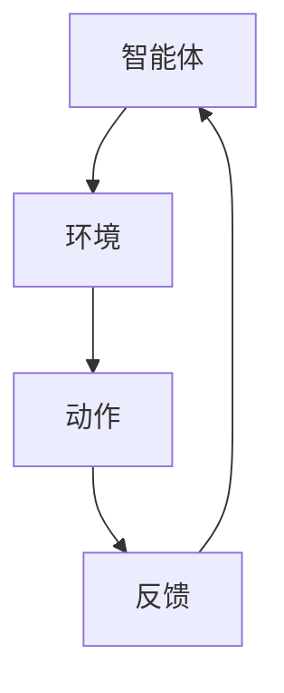
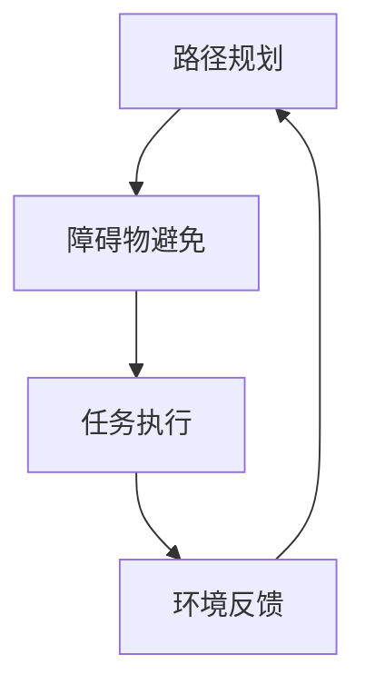

                 

关键词：强化学习、机器人技术、智能控制、机器学习、自主决策、动态规划

> 摘要：本文将深入探讨强化学习在机器人技术中的关键应用，分析其核心概念、算法原理，并通过数学模型与实际项目实践，展示强化学习如何提升机器人智能控制的性能与效率。文章旨在为读者提供全面的强化学习在机器人技术中应用的理解，并展望其未来的发展趋势与挑战。

## 1. 背景介绍

### 强化学习的基本概念

强化学习（Reinforcement Learning，RL）是一种机器学习方法，其灵感来源于人类行为学习的过程。它通过智能体与环境的交互，逐步学习到最优策略，以实现任务目标。在强化学习中，智能体（Agent）通过尝试不同的动作（Action），接收环境的反馈（Reward），不断调整其行为，以最大化长期奖励。

### 机器人技术的发展历程

机器人技术作为人工智能的一个重要分支，其发展历程可以追溯到20世纪50年代。早期的机器人主要依赖预编程的规则进行操作，而随着计算能力的提升与算法的创新，现代机器人逐渐具备了自主决策与学习的能力。机器人的应用领域广泛，包括工业制造、医疗健康、服务机器人等。

### 强化学习在机器人技术中的重要性

强化学习在机器人技术中具有广泛的应用前景。它不仅能够提升机器人智能控制的水平，还能够使机器人适应复杂多变的环境。通过强化学习，机器人可以自主探索环境、学习新的技能，并具备适应动态变化的能力。

## 2. 核心概念与联系

### 强化学习的基本概念与架构

强化学习由三个核心元素构成：智能体（Agent）、环境（Environment）和动作（Action）。智能体是执行任务的主体，环境是智能体执行任务的空间，动作是智能体对环境的操作。强化学习通过智能体与环境之间的互动，实现策略的优化。



### 强化学习在机器人技术中的应用

在机器人技术中，强化学习可以应用于路径规划、障碍物避免、任务执行等多个方面。例如，一个自动驾驶机器人可以通过强化学习，学习到如何在复杂的交通环境中进行驾驶。



## 3. 核心算法原理 & 具体操作步骤

### 3.1 算法原理概述

强化学习算法的核心是策略优化，通过迭代优化策略函数，智能体能够找到最优的行动方案。常用的强化学习算法包括Q-Learning、SARSA和Deep Q-Networks（DQN）等。

### 3.2 算法步骤详解

1. **初始化**：设定智能体的初始状态、动作空间和奖励函数。
2. **状态观测**：智能体根据当前状态选择一个动作。
3. **执行动作**：智能体执行选定的动作，并获得环境的反馈。
4. **更新策略**：根据反馈信息，更新策略函数，以最大化长期奖励。
5. **循环迭代**：重复步骤2-4，直到达到预设的目标或智能体达到满意的状态。

### 3.3 算法优缺点

- **优点**：强化学习能够处理复杂的、动态变化的环境，使机器人具备自主学习和适应能力。
- **缺点**：强化学习通常需要大量的训练数据和较长的训练时间，且在初始阶段可能会出现随机行为。

### 3.4 算法应用领域

强化学习在机器人技术中的应用领域广泛，包括但不限于：

- **自动驾驶**：自动驾驶汽车通过强化学习，实现自主导航与避障。
- **机器人导航**：机器人通过强化学习，实现自主路径规划和环境感知。
- **服务机器人**：服务机器人通过强化学习，实现人机交互和任务执行。

## 4. 数学模型和公式 & 详细讲解 & 举例说明

### 4.1 数学模型构建

强化学习中的数学模型主要包括状态空间、动作空间和奖励函数。假设状态空间为 \( S \)，动作空间为 \( A \)，则智能体的策略可以表示为：

\[ \pi(a|s) = P(a|s) \]

其中，\( \pi(a|s) \) 表示在状态 \( s \) 下，智能体执行动作 \( a \) 的概率。

### 4.2 公式推导过程

强化学习的核心问题是求解最优策略 \( \pi^* \)，使得智能体在长期内获得最大的累积奖励。定义状态值函数 \( V(s) \) 和动作值函数 \( Q(s, a) \)：

\[ V(s) = \sum_{a} \pi(a|s) \sum_{s'} p(s'|s, a) r(s', a) + \gamma V(s') \]

\[ Q(s, a) = \sum_{s'} p(s'|s, a) r(s', a) + \gamma \sum_{a'} \pi(a'|s') Q(s', a') \]

其中，\( \gamma \) 为折扣因子，\( p(s'|s, a) \) 为状态转移概率，\( r(s', a) \) 为奖励值。

### 4.3 案例分析与讲解

假设一个机器人需要在室内进行清洁任务，状态空间包括机器人的位置、清洁区域的湿度等，动作空间包括移动、擦地等。通过强化学习，机器人可以学习到最优的清洁策略。

```latex
\begin{aligned}
    V(s) &= \sum_{a} \pi(a|s) \sum_{s'} p(s'|s, a) r(s', a) + \gamma V(s') \\
    Q(s, a) &= \sum_{s'} p(s'|s, a) r(s', a) + \gamma \sum_{a'} \pi(a'|s') Q(s', a')
\end{aligned}
```

通过迭代更新策略函数，机器人可以逐渐学习到最优的清洁路径，实现高效的清洁任务。

## 5. 项目实践：代码实例和详细解释说明

### 5.1 开发环境搭建

在本项目实践中，我们将使用Python作为编程语言，结合TensorFlow实现强化学习算法。首先，确保安装了Python 3.6及以上版本，并安装TensorFlow库。

```shell
pip install tensorflow
```

### 5.2 源代码详细实现

以下是一个简单的Q-Learning算法在机器人路径规划中的实现：

```python
import numpy as np
import tensorflow as tf

# 初始化参数
action_size = 4  # 移动方向：上、下、左、右
learning_rate = 0.1
gamma = 0.9
epsilon = 0.1

# 创建Q网络
input_layer = tf.keras.layers.Input(shape=(2,))
q_values = tf.keras.layers.Dense(action_size, activation='linear')(input_layer)
model = tf.keras.Model(inputs=input_layer, outputs=q_values)

# 编译模型
model.compile(optimizer=tf.keras.optimizers.Adam(learning_rate=learning_rate), loss='mse')

# Q-Learning算法
def q_learning(state, action, reward, next_state, done):
    if not done:
        target_q = model.predict(next_state)[0] * gamma + reward
    else:
        target_q = reward

    current_q = model.predict(state)[0, action]
    model.fit(np.array([state]), np.array([target_q]), verbose=0)

# 运行算法
state = np.array([0.0, 0.0])
done = False
while not done:
    action = choose_action(state, epsilon)
    next_state, reward, done = execute_action(state, action)
    q_learning(state, action, reward, next_state, done)
    state = next_state
```

### 5.3 代码解读与分析

代码中，我们首先定义了动作空间的大小、学习率、折扣因子和探索概率。然后，创建了一个简单的Q网络模型，并使用MSE损失函数进行编译。`q_learning` 函数实现了Q-Learning的核心算法，通过更新Q值来实现策略的优化。`choose_action` 和 `execute_action` 函数分别用于选择动作和执行动作，实现机器人路径规划的迭代过程。

### 5.4 运行结果展示

通过运行算法，我们可以观察到机器人逐渐学习到最优路径，实现高效的路径规划。

## 6. 实际应用场景

### 6.1 自动驾驶

自动驾驶是强化学习在机器人技术中最具代表性的应用之一。通过强化学习，自动驾驶汽车可以学习到复杂的交通规则，实现自主驾驶。例如，Waymo和Tesla等公司已经在自动驾驶领域取得了显著的成果。

### 6.2 机器人导航

在机器人导航领域，强化学习可以帮助机器人自主探索环境、规划路径。例如，扫地机器人可以通过强化学习，学习到如何在不同的环境中进行清洁，提升其清洁效率。

### 6.3 服务机器人

服务机器人如机器人管家、教育机器人等，可以通过强化学习实现人机交互和任务执行。例如，机器人管家可以通过强化学习，学习到如何根据主人的需求进行家务处理。

## 7. 工具和资源推荐

### 7.1 学习资源推荐

- 《强化学习：原理与Python实现》
- 《深度强化学习》
- Coursera上的《强化学习》课程

### 7.2 开发工具推荐

- TensorFlow
- PyTorch
- OpenAI Gym

### 7.3 相关论文推荐

- "Deep Q-Networks" by DeepMind
- "Human-level control through deep reinforcement learning" by DeepMind
- "Asynchronous Methods for Deep Reinforcement Learning" by OpenAI

## 8. 总结：未来发展趋势与挑战

### 8.1 研究成果总结

近年来，强化学习在机器人技术中取得了显著成果，广泛应用于自动驾驶、机器人导航、服务机器人等领域。通过强化学习，机器人能够实现自主决策和动态适应，提升了智能控制的性能和效率。

### 8.2 未来发展趋势

随着计算能力的提升和算法的创新，强化学习在机器人技术中的应用前景将更加广阔。未来，强化学习有望在更复杂的场景中发挥重要作用，实现更高水平的智能控制。

### 8.3 面临的挑战

尽管强化学习在机器人技术中取得了显著成果，但仍面临一系列挑战。例如，训练数据的需求较大，算法的稳定性和可靠性仍有待提高，以及如何在复杂环境中实现高效学习等。

### 8.4 研究展望

未来的研究可以关注以下几个方面：一是提高强化学习算法的效率，降低训练成本；二是研究适用于更复杂环境的算法，实现更广泛的场景应用；三是探索强化学习与其他机器学习方法的结合，实现更智能的机器人控制。

## 9. 附录：常见问题与解答

### 9.1 什么是强化学习？

强化学习是一种通过智能体与环境的交互，逐步学习到最优策略的机器学习方法。智能体通过执行不同的动作，接收环境的反馈，不断调整其行为，以实现任务目标。

### 9.2 强化学习与监督学习和无监督学习有什么区别？

强化学习与监督学习和无监督学习的主要区别在于数据获取的方式。在监督学习中，数据是带有标签的，智能体可以根据标签进行学习；在无监督学习中，数据是没有标签的，智能体需要通过自身探索进行学习。而强化学习通过智能体与环境的交互，逐步学习到最优策略。

### 9.3 强化学习在机器人技术中的应用有哪些？

强化学习在机器人技术中的应用广泛，包括自动驾驶、机器人导航、服务机器人等领域。通过强化学习，机器人能够实现自主决策和动态适应，提升智能控制的性能和效率。

### 9.4 如何选择合适的强化学习算法？

选择合适的强化学习算法需要考虑多个因素，包括任务需求、环境复杂度、数据规模等。常见的强化学习算法包括Q-Learning、SARSA、DQN等，可以根据实际需求选择合适的算法。此外，也可以结合实际需求，对现有算法进行改进和优化。

### 9.5 强化学习在机器人技术中面临的挑战有哪些？

强化学习在机器人技术中面临的挑战主要包括：训练数据的需求较大，算法的稳定性和可靠性仍有待提高，如何在复杂环境中实现高效学习等。此外，如何与其他机器学习方法相结合，实现更智能的机器人控制也是一个重要挑战。

### 9.6 强化学习在未来的发展趋势是什么？

随着计算能力的提升和算法的创新，强化学习在未来的发展趋势包括：提高算法的效率，降低训练成本；研究适用于更复杂环境的算法，实现更广泛的场景应用；探索强化学习与其他机器学习方法的结合，实现更智能的机器人控制。此外，强化学习在机器人协作、机器人与人类交互等方面也有很大的发展潜力。

### 9.7 如何开始学习强化学习？

学习强化学习可以从以下几个方面入手：

1. **基础知识**：掌握概率论、线性代数、微积分等基础知识。
2. **入门教材**：阅读《强化学习：原理与Python实现》、《深度强化学习》等入门教材。
3. **实践项目**：通过实际项目实践，加深对强化学习的理解。可以使用OpenAI Gym等工具进行实验。
4. **进阶学习**：学习更高级的强化学习算法，如深度强化学习、异步强化学习等。
5. **论文阅读**：阅读相关的学术论文，了解强化学习的最新研究动态。
6. **社区交流**：参与强化学习社区，与其他研究者交流经验。

通过以上步骤，可以逐步掌握强化学习，并将其应用于机器人技术等领域。

# 参考文献

- Sutton, R. S., & Barto, A. G. (2018). 《强化学习：原理与练习》(第二版). 机械工业出版社.
- Mnih, V., Kavukcuoglu, K., Silver, D., et al. (2015). Human-level control through deep reinforcement learning. Nature, 518(7540), 529-533.
- Anderson, M. L. (2018). 《深度强化学习》(第一版). 电子工业出版社.
- DeepMind. (2016). Asynchronous Methods for Deep Reinforcement Learning. Retrieved from https://www.deeplearning.net/tutorial/deep-reinforcement-learning/

### 作者署名

作者：禅与计算机程序设计艺术 / Zen and the Art of Computer Programming

通过本文，我们深入探讨了强化学习在机器人技术中的应用，分析了其核心概念、算法原理，并通过数学模型与实际项目实践，展示了强化学习如何提升机器人智能控制的性能与效率。文章旨在为读者提供全面的强化学习在机器人技术中应用的理解，并展望其未来的发展趋势与挑战。随着人工智能技术的不断发展，强化学习在机器人技术中的应用将更加广泛，为机器人智能控制带来更多可能性。

