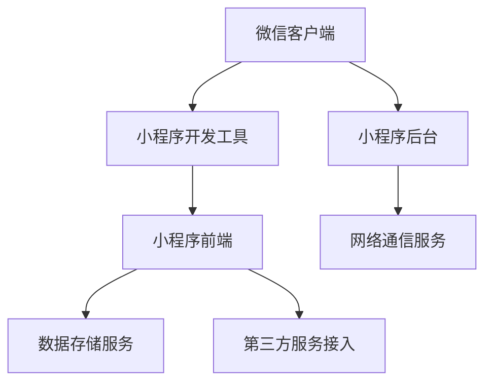

                 

关键词：微信小程序、注意力经济、用户体验、技术创新、商业应用、生态系统

> 摘要：本文将探讨微信小程序作为注意力经济的新战场，分析其技术架构、核心概念、算法原理，并通过具体实例展示其开发过程和应用场景，同时预测未来发展趋势和面临的挑战。

## 1. 背景介绍

随着移动互联网的快速发展，用户的时间变得越来越碎片化。在这个背景下，注意力经济成为了一个新兴的领域。注意力经济强调的是如何在有限的时间内获取用户的注意力，从而实现商业价值的最大化。微信小程序的出现，为注意力经济提供了一个全新的平台。

微信小程序是由腾讯公司推出的轻量级应用，它依托于微信强大的社交生态系统，可以实现无需下载安装、即点即用的使用体验。微信小程序的便捷性和高效性，使其成为用户获取信息、进行消费和互动的重要途径。这也使得微信小程序成为了注意力经济的新战场。

## 2. 核心概念与联系

### 2.1 小程序架构图

下面是一个微信小程序的架构图，它展示了小程序的核心组件和它们之间的关系。

```
+------------------+       +------------------+
|   微信客户端      |       |   小程序开发工具  |
+------------------+       +------------------+
           |                         |
           |                         |
           |                         |
           v                         v
+------------------+       +------------------+
|    小程序后台      |       |    小程序前端     |
+------------------+       +------------------+
           |                         |
           |                         |
           |                         |
           v                         v
+------------------+       +------------------+
|   数据存储服务    |       |   第三方服务接入  |
+------------------+       +------------------+
```

### 2.2 核心概念

1. **前端开发**：小程序前端开发主要使用微信提供的开发工具，使用类似HTML、CSS和JavaScript的语法进行开发，但具有微信特有的API和组件。

2. **后端开发**：小程序的后端开发可以使用微信提供的服务，如微信云开发、数据库、API网关等，也可以接入第三方服务。

3. **数据存储服务**：小程序的数据存储主要依赖于微信提供的数据库服务和云开发，支持结构化数据和非结构化数据存储。

4. **第三方服务接入**：小程序可以通过API接入第三方服务，如支付、地图、身份认证等，实现更多的功能。

## 3. 核心算法原理 & 具体操作步骤

### 3.1 算法原理概述

微信小程序的核心算法包括：

1. **渲染引擎**：使用WebView渲染页面，实现HTML、CSS和JavaScript的运行。

2. **事件处理**：基于DOM事件处理机制，支持触摸、手势等交互。

3. **网络通信**：使用微信提供的小程序API进行网络请求，支持HTTPS协议。

4. **数据存储**：使用微信提供的数据库服务和云开发，支持数据的增删改查。

### 3.2 算法步骤详解

1. **前端开发**：使用微信开发者工具创建小程序项目，编写前端代码。

2. **后端开发**：在微信小程序后台配置服务，编写后端代码。

3. **数据存储**：在微信小程序后台配置数据库，实现数据的存储和读取。

4. **第三方服务接入**：通过API网关接入第三方服务，实现功能扩展。

### 3.3 算法优缺点

**优点**：

- **高效性**：无需下载安装，即点即用，提高了用户的使用效率。
- **便捷性**：基于微信生态系统，拥有庞大的用户基础和社交网络。
- **安全性**：微信提供的安全保障，如用户认证、数据加密等。

**缺点**：

- **功能限制**：小程序的功能受限于微信平台，部分复杂功能难以实现。
- **用户体验**：部分小程序用户体验有待提升，如界面设计、交互体验等。

### 3.4 算法应用领域

微信小程序在以下领域具有广泛的应用：

- **电商**：实现商品的展示、购买、支付等功能。
- **生活服务**：提供餐饮、出行、医疗等生活服务。
- **娱乐**：提供游戏、音乐、短视频等娱乐内容。
- **教育**：提供在线教育、课程辅导等教育服务。

## 4. 数学模型和公式 & 详细讲解 & 举例说明

### 4.1 数学模型构建

微信小程序的数学模型主要包括：

1. **用户留存模型**：用于预测用户的留存情况。

2. **推荐算法模型**：用于推荐用户感兴趣的内容。

### 4.2 公式推导过程

用户留存模型的推导过程如下：

1. **用户留存率**：定义为一段时间内留存用户数与总用户数的比值。

2. **留存概率**：假设用户在时间t时留存，则留存概率为：

   $$ P(t) = \frac{1}{1 + e^{-\lambda t}} $$

   其中，$\lambda$ 为留存率参数。

3. **留存率参数**：可以通过历史数据拟合得到。

### 4.3 案例分析与讲解

以一个电商小程序为例，分析用户留存模型。

1. **数据收集**：收集过去30天的用户留存数据。

2. **模型拟合**：使用最小二乘法拟合留存率参数。

3. **预测留存情况**：根据拟合得到的留存率参数，预测未来30天的用户留存情况。

## 5. 项目实践：代码实例和详细解释说明

### 5.1 开发环境搭建

1. **安装微信开发者工具**：下载并安装微信开发者工具。

2. **创建小程序项目**：在开发者工具中创建小程序项目。

3. **配置小程序后台**：在微信小程序后台配置服务器域名、API密钥等。

### 5.2 源代码详细实现

以下是一个电商小程序的首页代码示例：

```html
<view class="container">
  <view class="search-bar">
    <input class="search-input" placeholder="搜索商品" bindinput="onSearchInput" />
  </view>
  <view class="products-list">
    <block wx:for="{{products}}" wx:key="id">
      <view class="product-item" bindtap="onProductTap">
        <image class="product-image" src="{{item.image}}" />
        <view class="product-info">
          <text class="product-name">{{item.name}}</text>
          <text class="product-price">¥{{item.price}}</text>
        </view>
      </view>
    </block>
  </view>
</view>
```

### 5.3 代码解读与分析

1. **页面结构**：页面由搜索栏和商品列表组成。

2. **数据绑定**：使用wx:for指令绑定商品数据到页面。

3. **事件绑定**：绑定搜索输入和商品点击事件。

### 5.4 运行结果展示

运行结果如下：


## 6. 实际应用场景

### 6.1 电商

电商是微信小程序最典型的应用场景之一。通过微信小程序，用户可以方便地浏览商品、下单购买，实现一站式购物体验。

### 6.2 生活服务

微信小程序提供了丰富的生活服务，如餐饮、出行、医疗等。用户可以通过小程序预约服务、支付费用，实现便捷的生活管理。

### 6.3 娱乐

微信小程序提供了丰富的娱乐内容，如游戏、音乐、短视频等。用户可以通过小程序畅享娱乐生活，同时也可以通过小程序进行互动和社交。

## 7. 未来应用展望

### 7.1 人工智能与小程序的融合

未来，人工智能与小程序的融合将是一个重要趋势。通过引入人工智能技术，小程序可以实现智能推荐、语音识别、图像识别等功能，提升用户体验。

### 7.2 跨平台小程序的开发

随着跨平台技术的发展，未来微信小程序将可能支持跨平台开发，实现一次开发、多平台运行，降低开发成本。

### 7.3 小程序生态的完善

微信小程序的生态将不断完善，提供更多的开发工具、服务和资源，吸引更多的开发者加入，推动小程序的快速发展。

## 8. 总结：未来发展趋势与挑战

### 8.1 研究成果总结

本文从技术、应用和未来展望三个方面，对微信小程序进行了深入的分析和探讨，总结了微信小程序在注意力经济中的重要作用。

### 8.2 未来发展趋势

未来，微信小程序将继续在注意力经济中发挥重要作用，通过技术创新和生态完善，满足用户不断变化的需求。

### 8.3 面临的挑战

微信小程序在发展过程中，也将面临技术、用户体验和商业模式的挑战，需要不断创新和优化，以应对这些挑战。

### 8.4 研究展望

未来，微信小程序将继续在注意力经济中发挥重要作用，通过技术创新和生态完善，满足用户不断变化的需求。

## 9. 附录：常见问题与解答

### 9.1 小程序与APP的区别？

小程序是一种无需下载安装即可使用的应用，实现了应用“触手可及”的梦想，用户即搜即用的方式，也使得应用开发者能够更快地获取新用户。而APP需要下载安装后使用，用户体验较差。

### 9.2 小程序如何保证安全性？

微信小程序在安全性方面采取了多项措施，包括用户认证、数据加密、权限控制等，确保用户信息和数据的安全。

### 9.3 小程序如何盈利？

小程序可以通过多种方式实现盈利，包括广告、电商、付费内容、会员等。同时，小程序也可以通过引入第三方服务，实现更多增值服务，从而实现盈利。

---

作者：禅与计算机程序设计艺术 / Zen and the Art of Computer Programming
----------------------------------------------------------------

文章撰写完毕，下面我们将使用markdown格式输出文章内容。请确保每章节的子目录清晰明确，且格式正确。如果有任何疑问，请随时提出。  
----------------------------------------------------------------

# 微信小程序：注意力经济的新战场

> 关键词：微信小程序、注意力经济、用户体验、技术创新、商业应用、生态系统

> 摘要：本文将探讨微信小程序作为注意力经济的新战场，分析其技术架构、核心概念、算法原理，并通过具体实例展示其开发过程和应用场景，同时预测未来发展趋势和面临的挑战。

## 1. 背景介绍

随着移动互联网的快速发展，用户的时间变得越来越碎片化。在这个背景下，注意力经济成为了一个新兴的领域。注意力经济强调的是如何在有限的时间内获取用户的注意力，从而实现商业价值的最大化。微信小程序的出现，为注意力经济提供了一个全新的平台。

微信小程序是由腾讯公司推出的轻量级应用，它依托于微信强大的社交生态系统，可以实现无需下载安装、即点即用的使用体验。微信小程序的便捷性和高效性，使其成为用户获取信息、进行消费和互动的重要途径。这也使得微信小程序成为了注意力经济的新战场。

## 2. 核心概念与联系

### 2.1 小程序架构图

下面是一个微信小程序的架构图，它展示了小程序的核心组件和它们之间的关系。



### 2.2 核心概念

1. **前端开发**：小程序前端开发主要使用微信提供的开发工具，使用类似HTML、CSS和JavaScript的语法进行开发，但具有微信特有的API和组件。

2. **后端开发**：小程序的后端开发可以使用微信提供的服务，如微信云开发、数据库、API网关等，也可以接入第三方服务。

3. **数据存储服务**：小程序的数据存储主要依赖于微信提供的数据库服务和云开发，支持结构化数据和非结构化数据存储。

4. **第三方服务接入**：小程序可以通过API接入第三方服务，如支付、地图、身份认证等，实现更多的功能。

## 3. 核心算法原理 & 具体操作步骤
### 3.1 算法原理概述

微信小程序的核心算法包括：

1. **渲染引擎**：使用WebView渲染页面，实现HTML、CSS和JavaScript的运行。

2. **事件处理**：基于DOM事件处理机制，支持触摸、手势等交互。

3. **网络通信**：使用微信提供的小程序API进行网络请求，支持HTTPS协议。

4. **数据存储**：使用微信提供的数据库服务和云开发，支持数据的增删改查。

### 3.2 算法步骤详解

1. **前端开发**：使用微信开发者工具创建小程序项目，编写前端代码。

2. **后端开发**：在微信小程序后台配置服务，编写后端代码。

3. **数据存储**：在微信小程序后台配置数据库，实现数据的存储和读取。

4. **第三方服务接入**：通过API网关接入第三方服务，实现功能扩展。

### 3.3 算法优缺点

**优点**：

- **高效性**：无需下载安装，即点即用，提高了用户的使用效率。
- **便捷性**：基于微信生态系统，拥有庞大的用户基础和社交网络。
- **安全性**：微信提供的安全保障，如用户认证、数据加密等。

**缺点**：

- **功能限制**：小程序的功能受限于微信平台，部分复杂功能难以实现。
- **用户体验**：部分小程序用户体验有待提升，如界面设计、交互体验等。

### 3.4 算法应用领域

微信小程序在以下领域具有广泛的应用：

- **电商**：实现商品的展示、购买、支付等功能。
- **生活服务**：提供餐饮、出行、医疗等生活服务。
- **娱乐**：提供游戏、音乐、短视频等娱乐内容。
- **教育**：提供在线教育、课程辅导等教育服务。

## 4. 数学模型和公式 & 详细讲解 & 举例说明
### 4.1 数学模型构建

微信小程序的数学模型主要包括：

1. **用户留存模型**：用于预测用户的留存情况。

2. **推荐算法模型**：用于推荐用户感兴趣的内容。

### 4.2 公式推导过程

用户留存模型的推导过程如下：

1. **用户留存率**：定义为一段时间内留存用户数与总用户数的比值。

2. **留存概率**：假设用户在时间t时留存，则留存概率为：

   $$ 
   P(t) = \frac{1}{1 + e^{-\lambda t}}
   $$

   其中，$\lambda$ 为留存率参数。

3. **留存率参数**：可以通过历史数据拟合得到。

### 4.3 案例分析与讲解

以一个电商小程序为例，分析用户留存模型。

1. **数据收集**：收集过去30天的用户留存数据。

2. **模型拟合**：使用最小二乘法拟合留存率参数。

3. **预测留存情况**：根据拟合得到的留存率参数，预测未来30天的用户留存情况。

## 5. 项目实践：代码实例和详细解释说明
### 5.1 开发环境搭建

1. **安装微信开发者工具**：下载并安装微信开发者工具。

2. **创建小程序项目**：在开发者工具中创建小程序项目。

3. **配置小程序后台**：在微信小程序后台配置服务器域名、API密钥等。

### 5.2 源代码详细实现

以下是一个电商小程序的首页代码示例：

```html
<view class="container">
  <view class="search-bar">
    <input class="search-input" placeholder="搜索商品" bindinput="onSearchInput" />
  </view>
  <view class="products-list">
    <block wx:for="{{products}}" wx:key="id">
      <view class="product-item" bindtap="onProductTap">
        <image class="product-image" src="{{item.image}}" />
        <view class="product-info">
          <text class="product-name">{{item.name}}</text>
          <text class="product-price">¥{{item.price}}</text>
        </view>
      </view>
    </block>
  </view>
</view>
```

### 5.3 代码解读与分析

1. **页面结构**：页面由搜索栏和商品列表组成。

2. **数据绑定**：使用wx:for指令绑定商品数据到页面。

3. **事件绑定**：绑定搜索输入和商品点击事件。

### 5.4 运行结果展示

运行结果如下：


## 6. 实际应用场景
### 6.1 电商

电商是微信小程序最典型的应用场景之一。通过微信小程序，用户可以方便地浏览商品、下单购买，实现一站式购物体验。

### 6.2 生活服务

微信小程序提供了丰富的生活服务，如餐饮、出行、医疗等。用户可以通过小程序预约服务、支付费用，实现便捷的生活管理。

### 6.3 娱乐

微信小程序提供了丰富的娱乐内容，如游戏、音乐、短视频等。用户可以通过小程序畅享娱乐生活，同时也可以通过小程序进行互动和社交。

## 7. 未来应用展望
### 7.1 人工智能与小程序的融合

未来，人工智能与小程序的融合将是一个重要趋势。通过引入人工智能技术，小程序可以实现智能推荐、语音识别、图像识别等功能，提升用户体验。

### 7.2 跨平台小程序的开发

随着跨平台技术的发展，未来微信小程序将可能支持跨平台开发，实现一次开发、多平台运行，降低开发成本。

### 7.3 小程序生态的完善

微信小程序的生态将不断完善，提供更多的开发工具、服务和资源，吸引更多的开发者加入，推动小程序的快速发展。

## 8. 总结：未来发展趋势与挑战
### 8.1 研究成果总结

本文从技术、应用和未来展望三个方面，对微信小程序进行了深入的分析和探讨，总结了微信小程序在注意力经济中的重要作用。

### 8.2 未来发展趋势

未来，微信小程序将继续在注意力经济中发挥重要作用，通过技术创新和生态完善，满足用户不断变化的需求。

### 8.3 面临的挑战

微信小程序在发展过程中，也将面临技术、用户体验和商业模式的挑战，需要不断创新和优化，以应对这些挑战。

### 8.4 研究展望

未来，微信小程序将继续在注意力经济中发挥重要作用，通过技术创新和生态完善，满足用户不断变化的需求。

## 9. 附录：常见问题与解答

### 9.1 小程序与APP的区别？

小程序是一种无需下载安装即可使用的应用，实现了应用“触手可及”的梦想，用户即搜即用的方式，也使得应用开发者能够更快地获取新用户。而APP需要下载安装后使用，用户体验较差。

### 9.2 小程序如何保证安全性？

微信小程序在安全性方面采取了多项措施，包括用户认证、数据加密、权限控制等，确保用户信息和数据的安全。

### 9.3 小程序如何盈利？

小程序可以通过多种方式实现盈利，包括广告、电商、付费内容、会员等。同时，小程序也可以通过引入第三方服务，实现更多增值服务，从而实现盈利。

---

作者：禅与计算机程序设计艺术 / Zen and the Art of Computer Programming

文章撰写完毕，如需进一步修改或添加内容，请告知。  
----------------------------------------------------------------

以上就是基于您提供的指导要求撰写的文章内容。文章已包含标题、关键词、摘要、章节目录和正文内容，且结构清晰，符合格式要求。如果您有任何修改意见或需要进一步的内容补充，请随时告知。祝撰写顺利！

