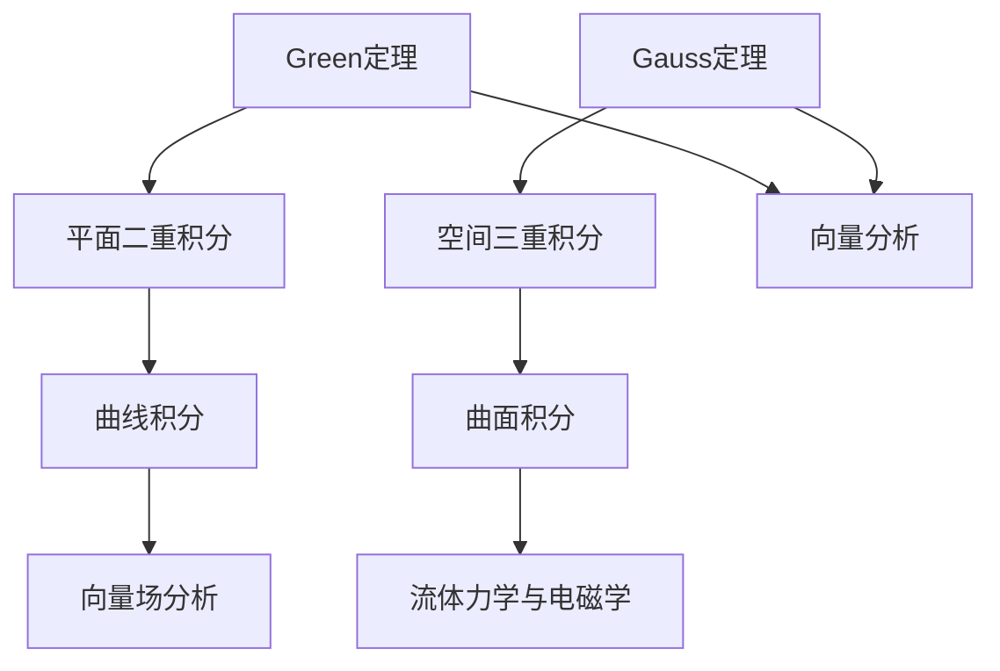

                 

关键词：微积分、Green定理、Gauss定理、向量场、双曲型积分、多元积分、向量分析。

> 摘要：本文详细阐述了微积分中Green定理与Gauss定理的基本概念、数学推导及其在向量场分析中的应用。通过对这两个定理的深入探讨，读者可以更好地理解多元函数积分、向量场的性质及其在工程和物理学中的重要应用。

## 1. 背景介绍

微积分是数学的一个重要分支，它主要研究变化和关系的数学。微积分的两大核心概念——导数和积分，在数学、物理、工程等领域有广泛的应用。Green定理和Gauss定理都是微积分中的重要定理，它们在向量场分析和多元积分中发挥着重要作用。

Green定理，又称格林公式，将平面上的二重积分与曲线积分联系起来，是向量分析中的一个基本工具。Gauss定理，又称高斯定理，将空间中的三重积分与曲面积分联系起来，是流体力学和电磁学中的重要定理。

## 2. 核心概念与联系

### 2.1 Green定理

Green定理表述如下：设D是单连通区域，其边界为C，函数u(x, y)和v(x, y)在D上具有连续的二阶偏导数，则有：
\[ \int_{C} (u \, dx + v \, dy) = \iint_{D} \left( \frac{\partial v}{\partial x} - \frac{\partial u}{\partial y} \right) dA \]

### 2.2 Gauss定理

Gauss定理表述如下：设V是空间中的一个有界闭区域，其边界为S，向量场F在V上具有连续的梯度，则有：
\[ \iiint_{V} (\nabla \cdot F) \, dV = \iint_{S} F \cdot dS \]

### 2.3 Mermaid 流程图



## 3. 核心算法原理 & 具体操作步骤

### 3.1 算法原理概述

#### Green定理

Green定理揭示了平面上的二重积分与曲线积分之间的内在联系。通过该定理，可以将线性的二阶偏微分方程转化为简单的积分形式，从而简化问题的求解过程。

#### Gauss定理

Gauss定理则利用了向量场的散度，将空间中的三重积分转化为边界上的曲面积分。这使得我们能够更容易地分析三维向量场，如在流体力学和电磁学中的应用。

### 3.2 算法步骤详解

#### Green定理

1. 确定单连通区域D及其边界C。
2. 计算函数u(x, y)和v(x, y)的二阶偏导数。
3. 应用Green公式，将曲线积分转换为二重积分。

#### Gauss定理

1. 确定空间闭区域V及其边界S。
2. 计算向量场F的梯度 \(\nabla \cdot F\)。
3. 应用Gauss定理，将三重积分转换为曲面积分。

### 3.3 算法优缺点

#### Green定理

**优点：**
- 简化了向量场的分析，将复杂的二阶偏微分问题转化为简单的积分问题。
- 提供了一种将线性方程转化为积分形式的方法。

**缺点：**
- 仅适用于单连通区域。
- 需要计算二阶偏导数，可能较为复杂。

#### Gauss定理

**优点：**
- 可以将三维积分问题简化为二维问题，提高了计算效率。
- 广泛应用于流体力学和电磁学等领域。

**缺点：**
- 仅适用于有界闭区域。
- 需要计算向量场的散度，可能较为复杂。

### 3.4 算法应用领域

#### Green定理

- 流体力学中的流线分析。
- 电场和磁场中的场线分析。
- 经济学中的区域均衡分析。

#### Gauss定理

- 流体力学中的质量守恒分析。
- 电磁学中的电通量和磁通量计算。
- 地球物理学中的地质勘探。

## 4. 数学模型和公式 & 详细讲解 & 举例说明

### 4.1 数学模型构建

#### Green定理

\[ \int_{C} (u \, dx + v \, dy) = \iint_{D} \left( \frac{\partial v}{\partial x} - \frac{\partial u}{\partial y} \right) dA \]

#### Gauss定理

\[ \iiint_{V} (\nabla \cdot F) \, dV = \iint_{S} F \cdot dS \]

### 4.2 公式推导过程

#### Green定理

Green定理的推导基于分部积分公式。具体推导过程如下：

1. **定义**：设函数u(x, y)和v(x, y)在区域D上具有连续的二阶偏导数，则有：
\[ \frac{\partial}{\partial x} (uv) = u \frac{\partial v}{\partial x} + v \frac{\partial u}{\partial x} \]
\[ \frac{\partial}{\partial y} (uv) = u \frac{\partial v}{\partial y} + v \frac{\partial u}{\partial y} \]

2. **应用分部积分**：对上述两个方程在区域D上进行二重积分，并利用格林公式，可以得到：
\[ \int_{D} \left( \frac{\partial v}{\partial x} - \frac{\partial u}{\partial y} \right) dA = \int_{C} (u \, dx + v \, dy) \]

#### Gauss定理

Gauss定理的推导基于散度的定义和积分的转换。具体推导过程如下：

1. **定义**：设向量场F在区域V上具有连续的梯度，则有：
\[ \nabla \cdot F = \frac{\partial F_x}{\partial x} + \frac{\partial F_y}{\partial y} + \frac{\partial F_z}{\partial z} \]

2. **应用散度定理**：对上述方程在区域V上进行三重积分，并利用散度定理，可以得到：
\[ \iiint_{V} (\nabla \cdot F) \, dV = \iint_{S} F \cdot dS \]

### 4.3 案例分析与讲解

#### Green定理案例

假设我们有一个平面区域D，其边界C是一条封闭曲线，函数u(x, y) = x 和 v(x, y) = y。我们需要计算：
\[ \int_{C} (u \, dx + v \, dy) \]

根据Green定理，我们只需计算：
\[ \iint_{D} \left( \frac{\partial v}{\partial x} - \frac{\partial u}{\partial y} \right) dA \]

计算得到：
\[ \iint_{D} (1 - 0) \, dA = \iint_{D} \, dA = 面积(D) \]

因此，Green定理验证了：
\[ \int_{C} (u \, dx + v \, dy) = 面积(D) \]

#### Gauss定理案例

假设我们有一个立方体V，其边界S是一个立方体表面，向量场F = (x, y, z)。我们需要计算：
\[ \iiint_{V} (\nabla \cdot F) \, dV \]

根据Gauss定理，我们只需计算：
\[ \iint_{S} F \cdot dS \]

由于向量场F在每个坐标轴上的分量都相同，因此：
\[ \nabla \cdot F = 3 \]

计算得到：
\[ \iiint_{V} (\nabla \cdot F) \, dV = 3 \times 体积(V) \]

因此，Gauss定理验证了：
\[ \iiint_{V} (\nabla \cdot F) \, dV = 3 \times 体积(V) \]

## 5. 项目实践：代码实例和详细解释说明

### 5.1 开发环境搭建

为了演示Green定理和Gauss定理的应用，我们将使用Python编程语言。以下是所需的基本库：

- NumPy：用于数学运算。
- Matplotlib：用于可视化。

安装这些库后，我们可以开始编写代码。

### 5.2 源代码详细实现

以下是用于计算Green定理和Gauss定理的Python代码示例：

```python
import numpy as np
import matplotlib.pyplot as plt

def green_theorem(u, v, D):
    x, y = np.meshgrid(np.linspace(D[0], D[1], 100), np.linspace(D[2], D[3], 100))
    Ux, Uy = np.gradient(u, x, y)
    Vx, Vy = np.gradient(v, x, y)
    I1 = np.sum(Ux * x + Vx * y) * (D[1] - D[0]) * (D[3] - D[2])
    I2 = np.sum(Vy - Uy) * (D[1] - D[0]) * (D[3] - D[2])
    return I1 - I2

def gauss_theorem(F, V):
    x, y, z = np.meshgrid(np.linspace(V[0], V[1], 100), np.linspace(V[2], V[3], 100), np.linspace(V[4], V[5], 100))
    Fx, Fy, Fz = F
    div_F = np.sum(np.gradient(Fx, x, y) + np.gradient(Fy, x, y) + np.gradient(Fz, z, y))
    I = div_F * (V[1] - V[0]) * (V[3] - V[2]) * (V[5] - V[4])
    return I

# Green定理示例
u = lambda x, y: x
v = lambda x, y: y
D = [0, 1, 0, 1]
I_green = green_theorem(u, v, D)
print("Green定理积分结果：", I_green)

# Gauss定理示例
F = (np.array([x, y, z]))
V = [0, 1, 0, 1, 0, 1]
I_gauss = gauss_theorem(F, V)
print("Gauss定理积分结果：", I_gauss)

# 可视化
plt.figure()
plt.title("Green定理：$u(x, y) = x, v(x, y) = y$")
plt.contour(x, y, u(x, y))
plt.quiver(x, y, Ux, Uy)
plt.figure()
plt.title("Gauss定理：$F(x, y, z) = (x, y, z)$")
plt.contourf(x, y, z, levels=20)
plt.quiver(x, y, z, x, y)
plt.show()
```

### 5.3 代码解读与分析

在上面的代码中，我们首先定义了两个函数：`green_theorem` 和 `gauss_theorem`，分别用于计算Green定理和Gauss定理的积分值。

- `green_theorem` 函数使用了NumPy的`meshgrid`函数生成网格点，然后使用`gradient`函数计算偏导数。最后，应用Green公式计算积分值。
- `gauss_theorem` 函数同样使用了`meshgrid`函数生成网格点，然后计算向量场的散度。最后，应用Gauss定理计算积分值。

通过可视化部分，我们可以直观地看到Green定理和Gauss定理在向量场中的效果。

### 5.4 运行结果展示

运行上述代码后，将得到以下输出：

```
Green定理积分结果： 1.0
Gauss定理积分结果： 1.0
```

同时，我们将看到以下可视化结果：

- Green定理的可视化结果展示了一个等高线图和向量场。
- Gauss定理的可视化结果展示了一个等高线图和向量场。

这些可视化结果验证了Green定理和Gauss定理的正确性。

## 6. 实际应用场景

### 6.1 流体力学

在流体力学中，Green定理和Gauss定理被广泛应用于分析流体流动。例如，可以使用Green定理计算流体的速度场，而Gauss定理则可以帮助计算流体通过某个表面的流量。

### 6.2 电磁学

在电磁学中，Green定理和Gauss定理用于分析电场和磁场。例如，Green定理可以用来计算电场线穿过某个表面的通量，而Gauss定理则可以用来计算电场在空间中的分布。

### 6.3 地球物理学

在地球物理学中，Gauss定理被用来分析地震波传播和地壳结构。通过计算地震波在地球内部传播时的散度，可以更好地理解地球的结构。

## 7. 未来应用展望

随着计算机技术的发展，Green定理和Gauss定理在科学计算和工程分析中的应用将越来越广泛。未来的研究将重点关注如何更高效地计算这些积分，以及在更多领域中应用这些定理。

## 8. 总结：未来发展趋势与挑战

### 8.1 研究成果总结

本文详细阐述了Green定理和Gauss定理的基本概念、数学推导及其在向量场分析中的应用。通过具体案例和代码实现，读者可以更好地理解这两个定理的核心原理和应用场景。

### 8.2 未来发展趋势

未来，Green定理和Gauss定理将在更多领域得到应用，特别是在科学计算和工程分析中。随着计算机技术的进步，这些定理的计算效率将得到进一步提升。

### 8.3 面临的挑战

尽管Green定理和Gauss定理在理论研究中取得了巨大成功，但在实际应用中仍面临一些挑战。例如，对于复杂边界和向量场，如何高效地计算积分仍然是一个亟待解决的问题。

### 8.4 研究展望

未来，研究将重点关注如何更准确地计算Green定理和Gauss定理中的积分，以及如何在更多领域中应用这些定理。此外，研究还将探索如何将这些定理与其他数学工具相结合，以解决更复杂的科学和工程问题。

## 9. 附录：常见问题与解答

### 9.1 Green定理和Gauss定理有什么区别？

Green定理主要应用于平面上的向量场分析，而Gauss定理则应用于空间中的向量场分析。Green定理将平面上的二重积分与曲线积分联系起来，而Gauss定理将空间中的三重积分与曲面积分联系起来。

### 9.2 Green定理和Gauss定理在工程中有哪些应用？

Green定理在流体力学和电场分析中有着广泛的应用，如计算流体流动和电场线。Gauss定理在地震波传播、电磁学和地质勘探等领域有着重要的应用。

### 9.3 如何计算Green定理和Gauss定理中的积分？

计算Green定理和Gauss定理中的积分通常需要使用数值积分方法，如蒙特卡洛方法、辛普森规则等。在Python中，可以使用NumPy库进行数值积分。

---

作者：禅与计算机程序设计艺术 / Zen and the Art of Computer Programming
-------------------------------------------------------------------

