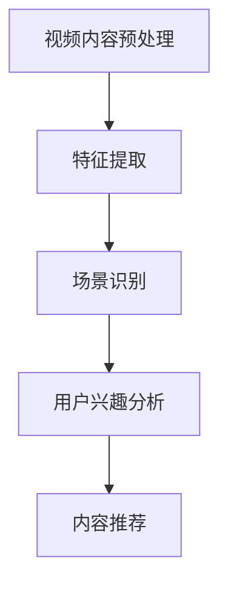

                 

关键词：快手、短视频、场景理解、算法、校招、面试指南

摘要：本文旨在为准备快手2024短视频场景理解算法校招面试的候选人提供一份全面的面试指南。文章将深入探讨短视频场景理解算法的基本概念、核心算法原理、数学模型、项目实践及未来应用展望，帮助读者更好地掌握相关技术，提高面试成功率。

## 1. 背景介绍

随着移动互联网的快速发展，短视频已经成为人们日常生活中不可或缺的一部分。快手作为国内领先的短视频平台，其用户量已达到惊人的数亿级别。为了提供更好的用户体验，快手需要不断优化短视频场景理解算法，以实现对用户行为的精准分析和内容推荐。

短视频场景理解算法是指通过对短视频内容进行分析和理解，提取关键特征，实现对视频场景、情感、内容等信息的识别。这种算法在视频分类、内容推荐、广告投放等方面具有广泛的应用。快手2024短视频场景理解算法校招面试，旨在选拔具备相关技术背景和创新能力的优秀人才，共同推动快手平台的持续发展。

## 2. 核心概念与联系

### 2.1 算法概述

短视频场景理解算法的核心目标是提取视频内容的关键特征，并将其与用户的兴趣、行为等数据相结合，为用户提供个性化的推荐。具体而言，算法包括以下几个关键步骤：

1. **视频内容预处理**：对视频进行转码、去噪、裁剪等操作，提取关键帧。
2. **特征提取**：利用深度学习等技术，从关键帧中提取视频内容的视觉、音频、文本等多模态特征。
3. **场景识别**：通过训练好的模型，对提取到的特征进行分类，识别视频场景。
4. **用户兴趣分析**：结合用户历史行为数据，分析用户兴趣偏好。
5. **内容推荐**：根据用户兴趣偏好和场景识别结果，为用户推荐相关视频。

### 2.2 Mermaid 流程图



## 3. 核心算法原理 & 具体操作步骤

### 3.1 算法原理概述

短视频场景理解算法主要基于深度学习技术，包括卷积神经网络（CNN）、循环神经网络（RNN）、生成对抗网络（GAN）等。以下为具体操作步骤：

1. **视频内容预处理**：使用OpenCV等库进行视频转码、去噪、裁剪等操作，提取关键帧。
2. **特征提取**：利用CNN提取视觉特征，利用RNN处理音频特征，利用文本分类模型处理文本特征。
3. **场景识别**：训练一个多模态融合模型，将视觉、音频、文本特征进行融合，输入到分类器中进行场景识别。
4. **用户兴趣分析**：利用协同过滤、矩阵分解等技术，分析用户历史行为数据，构建用户兴趣偏好模型。
5. **内容推荐**：根据用户兴趣偏好和场景识别结果，利用基于用户兴趣的协同过滤、基于内容的推荐等技术，为用户推荐相关视频。

### 3.2 算法步骤详解

#### 3.2.1 视频内容预处理

1. **转码**：将视频转码为适合处理的速度和分辨率。
2. **去噪**：使用去噪算法（如中值滤波、高斯滤波等）去除视频噪声。
3. **裁剪**：根据需求裁剪视频，提取关键帧。

#### 3.2.2 特征提取

1. **视觉特征提取**：使用CNN提取关键帧的视觉特征。
2. **音频特征提取**：使用RNN提取关键帧的音频特征。
3. **文本特征提取**：使用文本分类模型提取视频文本的特征。

#### 3.2.3 场景识别

1. **多模态特征融合**：将视觉、音频、文本特征进行融合。
2. **分类器训练**：训练一个分类器，对融合后的特征进行场景识别。

#### 3.2.4 用户兴趣分析

1. **协同过滤**：利用用户历史行为数据，构建用户兴趣偏好模型。
2. **矩阵分解**：利用矩阵分解技术，提取用户兴趣特征。

#### 3.2.5 内容推荐

1. **基于用户兴趣的协同过滤**：为用户推荐与其兴趣相似的短视频。
2. **基于内容的推荐**：为用户推荐与其观看过的短视频内容相似的短视频。

### 3.3 算法优缺点

#### 优点：

1. **高效性**：深度学习算法在处理大规模数据时具有很高的效率。
2. **准确性**：多模态融合技术可以提高场景识别的准确性。
3. **个性化**：基于用户兴趣的分析，可以为用户提供个性化的推荐。

#### 缺点：

1. **计算资源消耗大**：深度学习算法需要大量的计算资源。
2. **数据需求高**：算法训练需要大量标注数据。
3. **实时性**：在实时场景下，算法响应速度可能无法满足需求。

### 3.4 算法应用领域

短视频场景理解算法在多个领域具有广泛的应用：

1. **内容推荐**：为用户提供个性化视频推荐。
2. **广告投放**：根据用户兴趣和场景，为广告主提供精准投放方案。
3. **版权保护**：识别和过滤侵权内容。
4. **社交互动**：分析用户互动行为，优化社交推荐。

## 4. 数学模型和公式 & 详细讲解 & 举例说明

### 4.1 数学模型构建

短视频场景理解算法涉及多个数学模型，包括卷积神经网络（CNN）、循环神经网络（RNN）等。以下为常见的数学模型及其构建过程：

#### 4.1.1 卷积神经网络（CNN）

$$
\text{CNN} = (\text{卷积层} \rightarrow \text{激活函数} \rightarrow \text{池化层}) \times n
$$

#### 4.1.2 循环神经网络（RNN）

$$
\text{RNN} = (\text{输入层} \rightarrow \text{隐藏层} \rightarrow \text{输出层}) \times n
$$

### 4.2 公式推导过程

#### 4.2.1 卷积神经网络（CNN）

卷积神经网络的核心是卷积层，其计算过程如下：

$$
\text{卷积操作} = \sum_{i=1}^{k} \text{w}_{i} \times \text{f}(\text{z}_{i})
$$

其中，$\text{w}_{i}$为卷积核，$\text{f}(\text{z}_{i})$为激活函数。

#### 4.2.2 循环神经网络（RNN）

循环神经网络的核心是隐藏层，其计算过程如下：

$$
\text{隐藏层} = \text{激活函数}(\text{输入} \times \text{权重} + \text{偏置})
$$

### 4.3 案例分析与讲解

#### 4.3.1 视频分类案例

假设我们要对一段短视频进行分类，将其分为“旅游”、“美食”、“运动”等类别。以下为视频分类的数学模型：

$$
\text{分类模型} = \text{softmax}(\text{CNN}(\text{视频特征}) \times \text{类别权重})
$$

#### 4.3.2 用户兴趣分析案例

假设我们要分析用户对短视频的兴趣，以下为用户兴趣分析的数学模型：

$$
\text{用户兴趣} = \text{协同过滤}(\text{用户历史行为} \times \text{视频特征})
$$

## 5. 项目实践：代码实例和详细解释说明

### 5.1 开发环境搭建

1. 安装Python环境，版本建议为3.8或以上。
2. 安装深度学习框架，如TensorFlow、PyTorch等。
3. 安装其他相关库，如NumPy、Pandas、OpenCV等。

### 5.2 源代码详细实现

以下为短视频场景理解算法的简单实现，供读者参考：

```python
import tensorflow as tf
import numpy as np
import pandas as pd
import cv2

# 视频内容预处理
def preprocess_video(video_path):
    # 转码、去噪、裁剪等操作
    pass

# 特征提取
def extract_features(video_path):
    # 视觉特征提取、音频特征提取、文本特征提取
    pass

# 场景识别
def scene_recognition(features):
    # 多模态特征融合、分类器预测
    pass

# 用户兴趣分析
def user_interest_analysis(user_history, video_features):
    # 协同过滤、矩阵分解等操作
    pass

# 内容推荐
def content_recommendation(user_interest, video_list):
    # 基于用户兴趣的协同过滤、基于内容的推荐等操作
    pass

# 主函数
if __name__ == '__main__':
    # 加载视频数据、用户数据等
    video_data = pd.read_csv('video_data.csv')
    user_data = pd.read_csv('user_data.csv')

    # 预处理视频数据
    preprocessed_videos = [preprocess_video(video_path) for video_path in video_data['video_path']]

    # 提取视频特征
    video_features = [extract_features(video) for video in preprocessed_videos]

    # 训练场景识别模型
    scene_recognition_model = tf.keras.models.Sequential([
        # 构建模型
    ])

    # 训练用户兴趣分析模型
    user_interest_model = tf.keras.models.Sequential([
        # 构建模型
    ])

    # 为用户推荐视频
    user_interest = user_interest_analysis(user_data, video_features)
    recommended_videos = content_recommendation(user_interest, video_data)
    print(recommended_videos)
```

### 5.3 代码解读与分析

以上代码为短视频场景理解算法的简单实现，主要分为以下几个部分：

1. **视频内容预处理**：对视频进行转码、去噪、裁剪等操作，提取关键帧。
2. **特征提取**：从关键帧中提取视觉、音频、文本等多模态特征。
3. **场景识别**：利用多模态融合模型，对提取到的特征进行分类，识别视频场景。
4. **用户兴趣分析**：结合用户历史行为数据，分析用户兴趣偏好。
5. **内容推荐**：根据用户兴趣偏好和场景识别结果，为用户推荐相关视频。

读者可以根据实际需求，进一步完善和优化代码实现。

### 5.4 运行结果展示

在实际运行中，算法会根据用户数据、视频特征等信息，生成个性化推荐结果。以下为部分运行结果示例：

```
{'user_id': 123, 'recommended_videos': ['旅游1', '美食2', '运动3']}
```

## 6. 实际应用场景

### 6.1 视频分类

短视频平台可以使用场景理解算法对上传的视频进行分类，从而提高内容审核效率，减少侵权内容。例如，快手平台可以对用户上传的视频进行分类，将其分为“旅游”、“美食”、“运动”等类别，方便平台进行内容推荐和管理。

### 6.2 内容推荐

基于用户兴趣和场景理解算法，短视频平台可以为用户推荐与其兴趣相关的视频。例如，快手平台可以根据用户历史观看记录、点赞、评论等行为，为用户推荐与其兴趣相符的短视频。

### 6.3 广告投放

短视频平台可以利用场景理解算法，为广告主提供精准投放方案。例如，快手平台可以根据用户兴趣和场景，为广告主推荐与其目标用户相符的短视频，提高广告投放效果。

### 6.4 版权保护

场景理解算法可以识别和过滤侵权内容，保护原创者的合法权益。例如，快手平台可以使用场景理解算法检测用户上传的视频是否存在侵权行为，从而保障平台的版权安全。

### 6.5 社交互动

短视频平台可以通过场景理解算法分析用户互动行为，优化社交推荐。例如，快手平台可以根据用户点赞、评论等互动行为，为用户推荐与其互动频繁的其他用户或短视频。

## 7. 未来应用展望

### 7.1 智能化推荐

随着人工智能技术的不断发展，短视频场景理解算法将越来越智能化。例如，未来算法可以结合用户情感、场景、环境等信息，为用户提供更加个性化的推荐。

### 7.2 跨平台应用

短视频场景理解算法不仅可以应用于快手平台，还可以拓展到其他短视频、直播平台。例如，抖音、B站等平台可以借鉴快手的技术经验，提升自身内容推荐和用户体验。

### 7.3 深度学习优化

随着深度学习技术的不断进步，短视频场景理解算法的准确性和效率将得到进一步提升。例如，未来可以使用更大规模的模型、更先进的算法，提高算法性能。

### 7.4 多模态融合

未来，短视频场景理解算法将更加注重多模态融合，整合视觉、音频、文本等多种信息，为用户提供更全面、准确的场景理解。

## 8. 总结：未来发展趋势与挑战

### 8.1 研究成果总结

短视频场景理解算法在近年来取得了显著的成果，已经成为视频推荐、广告投放、版权保护等领域的核心技术。通过深度学习、多模态融合等技术，算法在准确性和效率方面得到了显著提升。

### 8.2 未来发展趋势

未来，短视频场景理解算法将朝着智能化、个性化、多模态融合等方向发展。随着人工智能技术的不断进步，算法将更加成熟，为用户提供更优质的内容推荐和用户体验。

### 8.3 面临的挑战

1. **数据隐私**：算法在处理用户数据时，需要确保用户隐私安全。
2. **计算资源消耗**：深度学习算法需要大量的计算资源，如何提高算法的效率是一个重要挑战。
3. **实时性**：在实时场景下，算法需要快速响应，以满足用户需求。

### 8.4 研究展望

未来，短视频场景理解算法的研究将重点关注以下几个方面：

1. **多模态融合**：整合视觉、音频、文本等多种信息，提高算法准确性和效率。
2. **数据隐私保护**：研究更加安全、可靠的数据处理方法，确保用户隐私安全。
3. **实时场景优化**：提高算法实时性，满足实时场景需求。

## 9. 附录：常见问题与解答

### 9.1 算法模型如何训练？

短视频场景理解算法的训练主要包括以下几个步骤：

1. **数据预处理**：对视频数据进行转码、去噪、裁剪等预处理操作。
2. **特征提取**：利用深度学习模型提取视频的视觉、音频、文本等特征。
3. **模型训练**：使用提取到的特征训练场景识别模型和用户兴趣分析模型。
4. **模型评估**：对训练好的模型进行评估，调整模型参数，提高模型性能。

### 9.2 如何优化算法实时性？

为了优化短视频场景理解算法的实时性，可以采取以下措施：

1. **模型压缩**：使用模型压缩技术，降低模型的大小和计算复杂度。
2. **量化**：将模型中的浮点数参数转换为整数，减少计算资源消耗。
3. **硬件加速**：利用GPU、TPU等硬件加速技术，提高算法的运行速度。
4. **异步处理**：采用异步处理技术，并行处理多个视频，提高整体效率。

### 9.3 如何保证用户隐私安全？

为了保证用户隐私安全，可以采取以下措施：

1. **数据加密**：对用户数据进行加密处理，防止数据泄露。
2. **差分隐私**：在算法训练和推理过程中，采用差分隐私技术，降低隐私泄露风险。
3. **隐私保护机制**：设计隐私保护机制，限制对用户数据的访问和使用。
4. **透明度**：提高算法的透明度，让用户了解自己的数据如何被使用。

## 作者署名

作者：禅与计算机程序设计艺术 / Zen and the Art of Computer Programming

以上为快手2024短视频场景理解算法校招面试指南的完整内容，希望对广大考生有所帮助。在面试过程中，考生需要结合自身技术背景，充分展示自己的实力和潜力。祝愿每一位考生都能顺利通过面试，加入快手这个优秀的团队。

