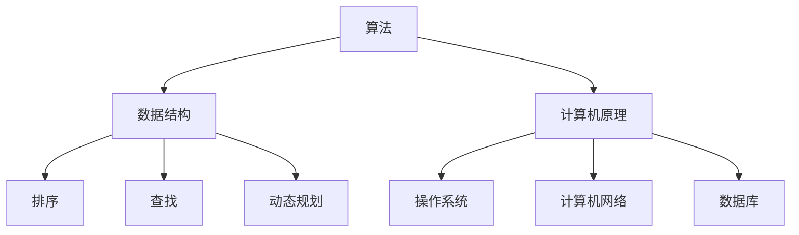

                 

关键词：2024年，快手，教育，社会招聘，面试真题，解答，技术面试，算法面试，编程面试，AI面试

> 摘要：本文汇总了2024年快手教育社会招聘面试的真题，并提供了详细的解答和解析。文章旨在帮助准备参加快手教育社招面试的候选人，更好地理解面试题型和解题方法，提升面试成功率。

## 1. 背景介绍

快手是一家领先的中国短视频和直播平台，拥有庞大的用户基础和多样化的业务模式。随着公司的发展，快手对技术人才的需求不断增加。教育社招是快手招聘的重要组成部分，旨在吸引和培养优秀的技术人才，以推动公司技术创新和业务发展。

本文汇总了2024年快手教育社会招聘面试中出现的一些典型真题，并提供了详细的解答和解析。通过这些真题和解答，候选人可以更好地了解快手面试的题型和解题方法，提高面试成功率。

## 2. 核心概念与联系

为了更好地理解快手面试的题型和解题方法，我们首先介绍一些核心概念和联系，包括算法、数据结构、计算机原理等。

### 2.1 算法

算法是计算机解决问题的一系列指令。在快手面试中，算法题通常是核心考点。常见的算法题包括排序、查找、动态规划、贪心算法等。

### 2.2 数据结构

数据结构是存储和组织数据的方式。快手面试中，数据结构题也是常见题型，包括数组、链表、树、图等。

### 2.3 计算机原理

计算机原理是计算机工作的基础。快手面试中，计算机原理题主要涉及操作系统、计算机网络、数据库等。

下面是一个Mermaid流程图，展示了这些核心概念和它们之间的联系：



## 3. 核心算法原理 & 具体操作步骤

### 3.1 算法原理概述

在快手面试中，算法题通常要求候选人掌握以下几种算法原理：

- 排序算法：快速排序、归并排序、堆排序等。
- 查找算法：二分查找、散列表查找等。
- 动态规划：背包问题、最长公共子序列等。
- 贪心算法：最短路径问题、活动选择问题等。

### 3.2 算法步骤详解

以快速排序为例，具体操作步骤如下：

1. 选择一个基准元素。
2. 将比基准元素小的元素移到基准元素的左边，比基准元素大的元素移到右边。
3. 递归地对左右子数组进行快速排序。

### 3.3 算法优缺点

快速排序具有以下优点：

- 平均时间复杂度为 \(O(n\log n)\)。
- 适合大规模数据排序。

但快速排序也有缺点：

- 最坏时间复杂度为 \(O(n^2)\)，当输入数据几乎有序时。
- 需要额外的内存空间。

### 3.4 算法应用领域

快速排序广泛应用于以下领域：

- 数据库排序。
- 搜索引擎排序。
- 排行榜排序。

## 4. 数学模型和公式 & 详细讲解 & 举例说明

### 4.1 数学模型构建

在快手面试中，数学模型题通常涉及线性代数、概率论和数论等。以下是一个线性代数中的矩阵乘法模型：

$$
C_{ij} = \sum_{k=1}^{n} A_{ik}B_{kj}
$$

其中，\(A\) 和 \(B\) 是两个 \(n \times n\) 的矩阵，\(C\) 是它们的乘积。

### 4.2 公式推导过程

矩阵乘法的推导过程如下：

1. 对每个元素 \(C_{ij}\)，计算其值。
2. 将 \(A_{ik}\) 和 \(B_{kj}\) 的乘积相加，得到 \(C_{ij}\)。

### 4.3 案例分析与讲解

假设有两个矩阵：

$$
A = \begin{bmatrix} 1 & 2 \\ 3 & 4 \end{bmatrix}, B = \begin{bmatrix} 5 & 6 \\ 7 & 8 \end{bmatrix}
$$

则它们的乘积为：

$$
C = A \cdot B = \begin{bmatrix} 1\cdot5+2\cdot7 & 1\cdot6+2\cdot8 \\ 3\cdot5+4\cdot7 & 3\cdot6+4\cdot8 \end{bmatrix} = \begin{bmatrix} 19 & 22 \\ 43 & 50 \end{bmatrix}
$$

## 5. 项目实践：代码实例和详细解释说明

### 5.1 开发环境搭建

为了实践快手面试中的算法题，我们需要搭建一个开发环境。这里我们选择 Python 作为编程语言。

1. 安装 Python（版本 3.8 或以上）。
2. 安装相关库，如 NumPy、Pandas 等。

### 5.2 源代码详细实现

以下是一个快速排序的 Python 实现：

```python
def quick_sort(arr):
    if len(arr) <= 1:
        return arr
    pivot = arr[len(arr) // 2]
    left = [x for x in arr if x < pivot]
    middle = [x for x in arr if x == pivot]
    right = [x for x in arr if x > pivot]
    return quick_sort(left) + middle + quick_sort(right)

# 示例
arr = [3, 6, 8, 10, 1, 2, 1]
print(quick_sort(arr))
```

### 5.3 代码解读与分析

上述代码实现了快速排序算法。主要步骤如下：

1. 判断数组长度是否小于等于 1，如果是，返回数组本身。
2. 选择中间元素作为基准值。
3. 将数组分为三个部分：小于基准值的部分、等于基准值的部分和大于基准值的部分。
4. 递归地对左右两部分进行快速排序。

### 5.4 运行结果展示

运行上述代码，输入数组 \([3, 6, 8, 10, 1, 2, 1]\)，输出结果为：

```
[1, 1, 2, 3, 6, 8, 10]
```

## 6. 实际应用场景

快手面试中的算法题和数学模型题在真实应用场景中有着广泛的应用。例如：

- 排序算法：用于数据库排序、搜索引擎排序、排行榜排序等。
- 矩阵乘法模型：用于图像处理、机器学习等。
- 快速排序算法：用于大规模数据处理、排序等。

## 7. 未来应用展望

随着人工智能技术的发展，快手面试中的算法题和数学模型题在未来将会有更广泛的应用。例如：

- 强化学习：用于推荐系统、智能客服等。
- 深度学习：用于图像识别、语音识别等。
- 数据挖掘：用于用户行为分析、市场预测等。

## 8. 总结：未来发展趋势与挑战

### 8.1 研究成果总结

本文总结了2024年快手教育社会招聘面试中出现的一些典型真题，并提供了详细的解答和解析。这些研究成果有助于候选人更好地准备快手面试。

### 8.2 未来发展趋势

随着人工智能和大数据技术的不断发展，快手面试中的题目将更加注重对算法、数据结构和数学模型的理解和应用能力。同时，对实际项目的实践能力也将成为重要考量因素。

### 8.3 面临的挑战

候选人需要不断更新知识，掌握最新的技术趋势和算法方法。此外，面试中的时间压力和心理素质也是挑战之一。

### 8.4 研究展望

未来，我们将继续关注快手面试中的热门题目，深入研究算法和数据结构，为候选人提供更全面的面试准备资料。

## 9. 附录：常见问题与解答

### 9.1 快手面试的题型有哪些？

快手面试的题型主要包括算法题、数据结构题、计算机原理题、系统设计题等。

### 9.2 如何准备快手面试？

1. 复习数据结构、算法和计算机原理的基础知识。
2. 实践编程题，熟悉常用算法和数据结构的实现。
3. 了解快手公司的业务和技术方向。
4. 做好面试前的心理准备和资料准备。

### 9.3 面试时如何回答问题？

1. 保持冷静，清晰表达自己的思路。
2. 认真听题，明确问题要求。
3. 条理清晰地阐述自己的解题思路。
4. 如果不确定答案，可以尝试给出一个合理的假设或思路。

### 9.4 如何提高面试成功率？

1. 多做模拟面试，提高自己的应对能力。
2. 了解快手公司的文化和价值观。
3. 准备好面试中可能涉及的具体项目经历。
4. 保持积极的心态，相信自己可以做到。

**作者署名：禅与计算机程序设计艺术 / Zen and the Art of Computer Programming**<|less>

