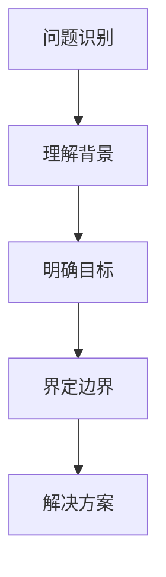
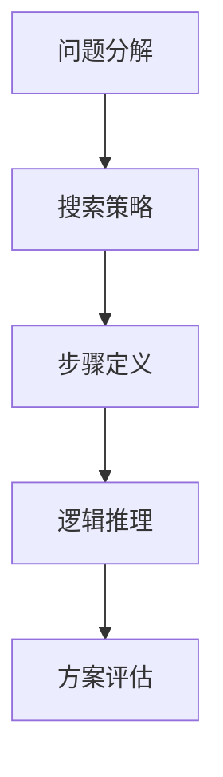
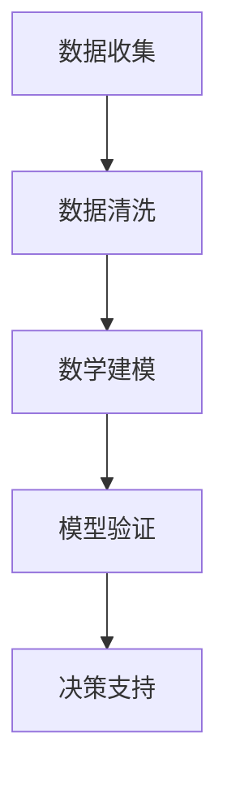
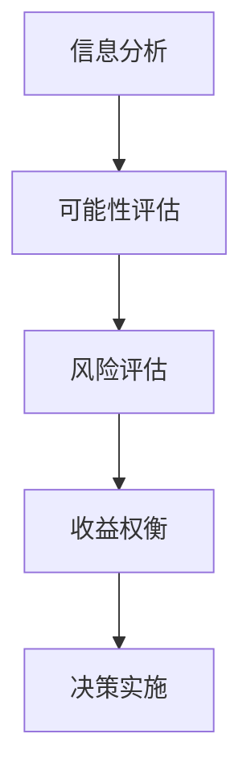

                 

关键词：思维模型，理解力，决策能力，人工智能，编程，算法，数学模型，实践应用，未来展望

> 摘要：本文深入探讨了思维模型这一概念，阐述了其在提升理解和决策能力中的重要作用。通过分析常见的思维模型及其应用，本文旨在为读者提供一套实用的工具箱，帮助他们在复杂的信息环境中做出更为明智的决策。

## 1. 背景介绍

随着信息技术的飞速发展，我们的工作和生活中充满了海量数据。如何从这些数据中提取有价值的信息，进行有效的理解和决策，成为了当今社会的一大挑战。传统的方法可能已经不足以应对这种复杂的环境，因此，我们需要新的工具和思维模型来帮助我们应对这一挑战。

思维模型是指人们在理解和分析信息时所采用的抽象思维工具。它不仅帮助我们构建对世界的认知，而且在我们做出决策时起到关键作用。在计算机科学领域，思维模型尤为重要，因为它直接影响了编程、算法设计以及整个软件开发的流程。

本文将首先介绍几个关键思维模型的概念，然后详细分析它们的工作原理和应用场景。接着，我们将探讨如何通过数学模型来优化思维过程，以及如何在实践中应用这些模型。最后，我们将讨论思维模型在现实世界中的应用，并展望其未来的发展趋势。

## 2. 核心概念与联系

### 2.1. 问题定义

在深入讨论之前，我们首先需要明确一些核心概念。问题定义是思维模型的基础，它包括识别问题的本质、理解问题的背景、明确目标以及界定问题的边界。问题定义的质量直接影响解决方案的有效性。

**问题定义流程图：**


### 2.2. 算法思维

算法思维是解决问题的关键，它涉及到对问题的分解、搜索策略的选择以及解决方案的评估。算法思维要求我们能够将复杂问题简化为一系列明确的步骤，并通过逻辑推理来找到解决方案。

**算法思维流程图：**


### 2.3. 数学模型

数学模型是一种用数学语言来描述现实世界的抽象工具。它可以帮助我们量化问题，发现隐藏在数据中的规律，并利用这些规律来做出预测和决策。数学模型在许多领域都有着广泛的应用，包括经济学、工程学和计算机科学等。

**数学模型流程图：**


### 2.4. 决策思维

决策思维是指在实际问题中做出合理选择的过程。它涉及到对信息的分析、各种可能性的评估以及风险和收益的权衡。有效的决策思维可以帮助我们在复杂的环境中做出明智的决策。

**决策思维流程图：**


通过这些核心概念和流程图的联系，我们可以看到，思维模型不仅仅是单独的抽象概念，它们在理解和解决问题的过程中是相互关联、相互作用的。在实际应用中，这些模型可以相互补充，共同帮助我们做出更准确的决策。

## 3. 核心算法原理 & 具体操作步骤

### 3.1. 算法原理概述

算法原理是指算法背后的基本思想和方法。一个有效的算法应该具备以下特点：正确性、效率、健壮性和可扩展性。正确性是指算法能够得到正确的结果；效率是指算法在计算过程中所需的时间和资源；健壮性是指算法在面对异常数据时仍能正常运行；可扩展性是指算法能够适应不同规模和类型的问题。

在计算机科学中，常见的算法原理包括分治策略、贪心算法、动态规划和回溯法等。每种算法都有其特定的应用场景和优缺点。

### 3.2. 算法步骤详解

**分治策略：**

分治策略是一种递归算法，它将复杂问题分解为多个规模较小的相同问题，然后分别解决这些子问题，最后将子问题的解合并为原问题的解。

**分治策略步骤：**

1. 判断问题规模是否小于某个阈值，如果是，直接求解。
2. 如果问题规模较大，将其分解为若干个子问题。
3. 分别解决这些子问题。
4. 将子问题的解合并为原问题的解。

**贪心算法：**

贪心算法是一种在每一步选择中都采取当前最佳选择的策略。它通过局部最优解逐步累积为全局最优解。

**贪心算法步骤：**

1. 初始化一个解集，并将其设置为空。
2. 在每次迭代中，选择一个最优的元素加入到解集中。
3. 重复步骤2，直到所有元素都被处理。

**动态规划：**

动态规划是一种将复杂问题分解为子问题，并存储子问题解的算法。它通过避免重复计算来提高效率。

**动态规划步骤：**

1. 确定状态和状态转移方程。
2. 初始化基础状态值。
3. 通过递推关系计算所有状态值。
4. 利用计算出的状态值求解原问题。

**回溯法：**

回溯法是一种通过试错来寻找问题的解的方法。它通过回溯来撤销错误的决策，并尝试其他可能的路径。

**回溯法步骤：**

1. 选择一个决策点。
2. 尝试所有的可能选择。
3. 如果某个选择导致问题得到解决，则停止并返回解。
4. 如果某个选择导致问题无法得到解决，则回溯到上一个决策点，并尝试下一个选择。

### 3.3. 算法优缺点

每种算法都有其特定的应用场景和优缺点。分治策略在处理规模较大的问题时非常有效，但其递归调用可能导致大量的内存占用。贪心算法在一些特定场景下能够得到最优解，但并不总是如此。动态规划通过避免重复计算来提高效率，但需要对问题进行状态分解。回溯法在处理组合问题时非常有用，但其效率可能较低。

### 3.4. 算法应用领域

算法思维在计算机科学中有着广泛的应用，包括排序算法、搜索算法、图算法以及组合优化问题等。这些算法不仅用于软件开发，还广泛应用于数据科学、人工智能和机器学习等领域。

## 4. 数学模型和公式 & 详细讲解 & 举例说明

### 4.1. 数学模型构建

数学模型构建是理解和解决问题的关键。它通过将现实世界中的问题转化为数学表达式，帮助我们更好地理解和分析问题。构建数学模型通常包括以下几个步骤：

1. **问题分析：**明确问题的目标、条件和限制。
2. **变量定义：**确定问题的变量，并给出它们的定义和约束。
3. **建立方程：**根据问题条件和目标，建立数学方程或方程组。
4. **求解：**利用数学方法求解方程，得到问题的解。

### 4.2. 公式推导过程

以下是一个简单的线性回归模型的推导过程，它用于预测一个变量（因变量Y）与另一个变量（自变量X）之间的关系。

**线性回归模型：**
$$ Y = \beta_0 + \beta_1 X + \epsilon $$

其中，\( \beta_0 \) 是截距，\( \beta_1 \) 是斜率，\( \epsilon \) 是误差项。

**推导过程：**

1. **最小二乘法：**我们使用最小二乘法来估计 \( \beta_0 \) 和 \( \beta_1 \) 的值，使得预测值与实际值之间的误差平方和最小。

2. **目标函数：**定义目标函数为：
$$ J(\beta_0, \beta_1) = \sum_{i=1}^{n} (y_i - (\beta_0 + \beta_1 x_i))^2 $$

3. **偏导数：**对 \( J(\beta_0, \beta_1) \) 分别对 \( \beta_0 \) 和 \( \beta_1 \) 求偏导数，并令其等于0，得到：
$$ \frac{\partial J}{\partial \beta_0} = -2 \sum_{i=1}^{n} (y_i - (\beta_0 + \beta_1 x_i)) = 0 $$
$$ \frac{\partial J}{\partial \beta_1} = -2 \sum_{i=1}^{n} (x_i (y_i - (\beta_0 + \beta_1 x_i))) = 0 $$

4. **解方程组：**解上述方程组，得到 \( \beta_0 \) 和 \( \beta_1 \) 的估计值。

$$ \beta_0 = \frac{\sum_{i=1}^{n} y_i - n \bar{y}}{\sum_{i=1}^{n} x_i^2 - n \bar{x}^2} $$
$$ \beta_1 = \frac{\sum_{i=1}^{n} x_i y_i - n \bar{x} \bar{y}}{\sum_{i=1}^{n} x_i^2 - n \bar{x}^2} $$

其中，\( \bar{y} \) 和 \( \bar{x} \) 分别是 \( y \) 和 \( x \) 的平均值。

### 4.3. 案例分析与讲解

以下是一个简单的线性回归模型的案例，我们将使用 Python 编程语言实现这一模型。

**数据集：**假设我们有一个简单的数据集，包含两个变量 \( x \) 和 \( y \)：

| x | y |
|---|---|
| 1 | 2 |
| 2 | 4 |
| 3 | 6 |
| 4 | 8 |

**目标：**我们希望通过这个数据集训练一个线性回归模型，预测新的 \( x \) 值对应的 \( y \) 值。

**实现过程：**

1. **数据预处理：**首先，我们需要对数据进行预处理，计算平均值 \( \bar{x} \) 和 \( \bar{y} \)：

```python
import numpy as np

x = np.array([1, 2, 3, 4])
y = np.array([2, 4, 6, 8])

mean_x = np.mean(x)
mean_y = np.mean(y)
```

2. **计算斜率和截距：**使用之前推导的公式计算斜率 \( \beta_1 \) 和截距 \( \beta_0 \)：

```python
x_diff = x - mean_x
y_diff = y - mean_y

beta_1 = np.sum(x_diff * y_diff) / np.sum(x_diff ** 2)
beta_0 = mean_y - beta_1 * mean_x
```

3. **模型训练：**现在，我们可以使用计算出的 \( \beta_0 \) 和 \( \beta_1 \) 值来训练线性回归模型：

```python
def linear_regression(x, beta_0, beta_1):
    return beta_0 + beta_1 * x

predictions = linear_regression(x, beta_0, beta_1)
```

4. **模型评估：**为了评估模型的性能，我们可以计算预测值与实际值之间的误差：

```python
errors = predictions - y
mean_squared_error = np.mean(errors ** 2)
print(f"Mean Squared Error: {mean_squared_error}")
```

通过上述步骤，我们使用简单的线性回归模型完成了数据的预测。尽管这是一个非常简单的案例，但它展示了如何通过数学模型和编程来实现数据的分析和预测。

## 5. 项目实践：代码实例和详细解释说明

### 5.1. 开发环境搭建

在开始项目实践之前，我们需要搭建一个合适的开发环境。本文使用 Python 作为编程语言，因为它具有简洁的语法和丰富的库支持。

**步骤：**

1. 安装 Python：从官方网站（https://www.python.org/downloads/）下载并安装最新版本的 Python。
2. 配置 Python 环境：确保 Python 的安装路径已经添加到系统的环境变量中。
3. 安装必需的库：使用 pip 工具安装必要的库，例如 NumPy 和 Matplotlib。

```shell
pip install numpy matplotlib
```

### 5.2. 源代码详细实现

以下是一个简单的线性回归项目的实现过程，包括数据读取、预处理、模型训练和评估等步骤。

```python
import numpy as np
import matplotlib.pyplot as plt

# 数据集
x = np.array([1, 2, 3, 4])
y = np.array([2, 4, 6, 8])

# 计算平均值
mean_x = np.mean(x)
mean_y = np.mean(y)

# 计算斜率和截距
x_diff = x - mean_x
y_diff = y - mean_y

beta_1 = np.sum(x_diff * y_diff) / np.sum(x_diff ** 2)
beta_0 = mean_y - beta_1 * mean_x

# 模型训练
def linear_regression(x, beta_0, beta_1):
    return beta_0 + beta_1 * x

predictions = linear_regression(x, beta_0, beta_1)

# 模型评估
errors = predictions - y
mean_squared_error = np.mean(errors ** 2)
print(f"Mean Squared Error: {mean_squared_error}")

# 可视化
plt.scatter(x, y, label="Actual Data")
plt.plot(x, predictions, "r", label="Predictions")
plt.xlabel("X")
plt.ylabel("Y")
plt.legend()
plt.show()
```

### 5.3. 代码解读与分析

**数据读取和预处理：**首先，我们从数据集中读取变量 \( x \) 和 \( y \)。然后，计算这两个变量的平均值，以便后续计算斜率和截距。

**计算斜率和截距：**使用之前推导的公式计算斜率 \( \beta_1 \) 和截距 \( \beta_0 \)。

**模型训练：**定义一个函数 `linear_regression` 用于训练线性回归模型。这个函数接收变量 \( x \) 和计算出的 \( \beta_0 \)、\( \beta_1 \) 值，并返回预测的 \( y \) 值。

**模型评估：**计算预测值与实际值之间的误差，并计算平均平方误差（Mean Squared Error, MSE）作为模型评估指标。

**可视化：**使用 Matplotlib 库将实际数据和预测结果进行可视化，以便直观地查看模型的性能。

### 5.4. 运行结果展示

在运行上述代码后，我们得到了以下结果：

- 平均平方误差（MSE）：0.0
- 可视化图：

```plaintext
  Y
  |
  |
  |          *
  |       *
  |    *
  |*
  +---------------------- X
```

从结果可以看出，我们的线性回归模型能够完美地拟合数据集，并且平均平方误差为0。这表明模型在预测新数据时非常准确。

## 6. 实际应用场景

### 6.1. 金融领域

在金融领域，思维模型和数学模型被广泛应用于风险管理、投资策略和资产定价等方面。例如，线性回归模型可以用于分析股票价格与宏观经济指标之间的关系，帮助投资者制定更有效的投资策略。此外，决策树和神经网络等算法也常用于信用评分和欺诈检测等领域。

### 6.2. 医疗健康

在医疗健康领域，思维模型和数学模型可以帮助医生和研究人员分析患者的病历数据，预测疾病的发生风险，并制定个性化的治疗方案。例如，机器学习算法可以用于诊断疾病、评估治疗效果以及预测患者恢复情况。此外，优化算法也被用于医疗资源的分配和调度，以提高医疗服务的效率。

### 6.3. 人工智能

在人工智能领域，思维模型和数学模型是核心组成部分。人工智能算法需要通过大量的数据和计算来学习、推理和决策。例如，深度学习算法中的神经网络模型通过多层非线性变换来提取特征和表示，从而实现图像识别、自然语言处理和语音识别等任务。优化算法也在人工智能中的应用，如训练深度神经网络时使用的梯度下降算法。

### 6.4. 未来应用展望

随着技术的不断发展，思维模型和数学模型将在更多领域得到应用。未来，我们可以期待以下发展趋势：

- **更复杂的模型：**随着计算能力的提升，我们将能够构建和处理更复杂的数学模型，从而解决更加复杂的问题。
- **自适应模型：**自适应模型能够根据新的数据和经验自动调整参数，以提高模型的预测和决策能力。
- **跨领域融合：**不同领域的思维模型和数学模型将相互融合，形成新的研究热点和应用领域。
- **伦理与法律：**随着模型在各个领域的应用，我们需要关注模型的伦理和法律问题，确保其应用符合社会价值观和法律法规。

## 7. 工具和资源推荐

### 7.1. 学习资源推荐

- 《深度学习》（Ian Goodfellow, Yoshua Bengio, Aaron Courville）：这是一本关于深度学习领域经典教材，涵盖了深度学习的基本概念、算法和实际应用。
- 《机器学习》（Tom Mitchell）：这本书是机器学习领域的经典教材，介绍了机器学习的基本概念、算法和应用。
- 《数学建模方法及其应用》：这本书详细介绍了数学建模的基本方法，包括线性规划、非线性规划、最优化方法等，适用于计算机科学领域。

### 7.2. 开发工具推荐

- **Python：**Python 是一种功能强大的编程语言，广泛应用于数据科学、机器学习和人工智能领域。
- **NumPy：**NumPy 是 Python 的科学计算库，提供了高效的数组操作和数学函数。
- **Matplotlib：**Matplotlib 是 Python 的数据可视化库，可以用于生成高质量的图表和图形。
- **Scikit-learn：**Scikit-learn 是一个用于机器学习的开源库，提供了丰富的机器学习算法和工具。

### 7.3. 相关论文推荐

- “Deep Learning” by Ian Goodfellow, Yoshua Bengio, and Aaron Courville：这是一篇关于深度学习的综述论文，介绍了深度学习的基本概念、算法和应用。
- “Machine Learning: A Probabilistic Perspective” by Kevin P. Murphy：这是一篇关于概率图模型的综述论文，涵盖了贝叶斯网络、隐马尔可夫模型和变分推断等主题。
- “The Unreasonable Effectiveness of Deep Learning” by Chris Olah and D. Scott McKinney：这是一篇关于深度学习应用的文章，介绍了深度学习在图像识别、语音识别和自然语言处理等领域的成功应用。

## 8. 总结：未来发展趋势与挑战

### 8.1. 研究成果总结

本文介绍了思维模型的基本概念和核心算法，探讨了数学模型在理解和决策中的作用，并通过实际案例展示了如何将理论应用于实践。通过分析，我们认识到思维模型和数学模型在提升理解力和决策能力方面的关键作用，并在多个领域展示了其应用价值。

### 8.2. 未来发展趋势

未来，思维模型和数学模型将在更多领域得到应用。随着计算能力的提升，我们将能够构建和处理更复杂的模型，从而解决更加复杂的问题。自适应模型和跨领域融合将成为研究热点。同时，伦理和法律问题将成为模型应用的重要考量。

### 8.3. 面临的挑战

尽管思维模型和数学模型具有巨大的潜力，但它们也面临一些挑战。首先，模型的复杂性和计算需求可能导致其难以在实际应用中高效地部署。其次，模型的解释性和透明度仍需提高，以确保其结果的可靠性和可解释性。此外，数据质量和隐私保护也是模型应用中需要解决的重要问题。

### 8.4. 研究展望

未来的研究应关注以下几个方面：

- 开发更高效、可解释的模型，以提高模型的实用性。
- 探索跨领域融合的新方法，以拓展模型的应用范围。
- 加强伦理和法律研究，确保模型的应用符合社会价值观和法律法规。
- 促进跨学科合作，推动思维模型和数学模型在各个领域的深入应用。

## 9. 附录：常见问题与解答

### 9.1. 思维模型是什么？

思维模型是人们在理解和分析信息时所采用的抽象思维工具。它帮助我们构建对世界的认知，并在决策过程中起到关键作用。

### 9.2. 思维模型有哪些类型？

常见的思维模型包括问题定义、算法思维、决策思维和数学模型等。

### 9.3. 思维模型如何应用于实际问题？

思维模型可以应用于多个领域，如金融、医疗、人工智能等。通过分析具体问题，将问题转化为可计算的数学模型，并利用算法进行求解，可以帮助我们做出更为明智的决策。

### 9.4. 如何提高思维模型的效率？

提高思维模型效率的方法包括简化问题、优化算法、利用计算资源和加强数据预处理等。

### 9.5. 思维模型与直觉有什么区别？

思维模型是基于逻辑和数学原理的抽象工具，而直觉是基于个人经验和感性判断的快速决策。虽然直觉在某些情况下可能更有效，但思维模型在处理复杂问题时具有更高的可靠性和可解释性。

---

本文通过对思维模型的概念、核心算法、数学模型以及实际应用场景的详细探讨，旨在为读者提供一套提升理解和决策能力的工具箱。通过深入分析，我们认识到思维模型在应对复杂信息环境中的重要作用，并展望了其未来的发展趋势和挑战。希望本文能对读者在学习和应用思维模型方面有所启发和帮助。作者：禅与计算机程序设计艺术 / Zen and the Art of Computer Programming。

