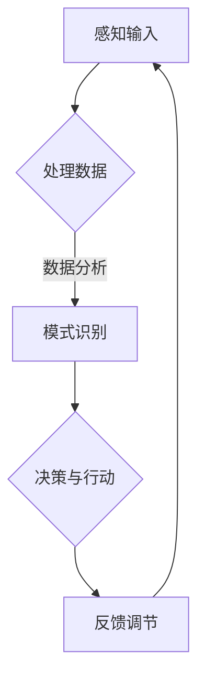

                 

关键词：意识功能，价值标准，认知算法，技术架构，数学模型，应用场景，未来展望

> 摘要：本文旨在探讨意识功能在技术领域的价值标准。通过解析意识功能的核心概念、算法原理、数学模型及应用场景，本文旨在为读者提供一个全面且深入的理解，并展望意识功能在未来的发展趋势与挑战。

## 1. 背景介绍

随着计算机科学的飞速发展，人工智能逐渐成为了一个广泛研究的领域。在这个过程中，意识的本质和功能成为了众多学者和研究机构关注的焦点。意识不仅仅是人类智慧的最高表现形式，它也是人工智能追求的目标之一。然而，关于意识功能的定义和价值标准，学术界尚无统一的认识。

本文将从以下几个方面展开讨论：

- **核心概念与联系**：介绍意识功能相关的核心概念，并使用Mermaid流程图展示其架构和关系。
- **核心算法原理**：探讨实现意识功能的核心算法原理，包括具体操作步骤、优缺点及应用领域。
- **数学模型和公式**：阐述构建意识功能的数学模型和公式，并举例说明。
- **项目实践**：提供具体的代码实例，并详细解释说明。
- **实际应用场景**：分析意识功能在各个领域的实际应用。
- **未来应用展望**：探讨意识功能在未来科技发展中的潜力。

通过以上讨论，本文旨在为意识功能的价值标准提供一个全面的分析，以期为相关领域的研究和实践提供指导。

## 2. 核心概念与联系

### 2.1 意识功能

意识功能是指个体对外界环境和内部状态进行感知、理解和反应的能力。它是认知过程的最高层次，涉及到意识的形成、维持和调节。从神经科学的角度来看，意识功能主要涉及大脑的不同区域之间的相互作用。

### 2.2 认知算法

认知算法是模拟人类认知过程的算法集合，旨在实现自动化推理、学习、记忆和感知等功能。这些算法通常基于统计学模型、神经网络和符号逻辑等理论构建，以实现复杂的认知任务。

### 2.3 技术架构

技术架构是支持意识功能实现的基础框架，包括硬件、软件和网络组件。其中，硬件主要负责计算资源的提供，软件则负责算法的运行和数据处理，网络组件则确保不同系统之间的数据交换和协作。

### 2.4 Mermaid流程图

为了更好地展示意识功能的核心概念及其相互关系，我们使用Mermaid流程图进行描述。以下是一个简化的Mermaid流程图：



在该流程图中，A表示感知输入，即从外界获取信息；B表示处理数据，包括数据的预处理和特征提取；C表示模式识别，即通过算法分析数据以识别特定模式；D表示决策与行动，即基于识别结果做出决策并采取行动；E表示反馈调节，即通过反馈机制对决策效果进行调整。

通过这一流程，我们可以看到意识功能的核心概念和技术架构之间的紧密联系，以及它们如何协同工作以实现高效的认知过程。

### 2.5 意识功能的层次结构

意识功能可以划分为多个层次，包括感知层、认知层和行动层。感知层主要负责信息的收集和感知；认知层则对感知信息进行处理、分析和理解；行动层则基于认知结果做出决策并执行相应行动。这三个层次相互协作，共同构成了完整的意识功能体系。

### 2.6 意识功能的核心算法

实现意识功能的核心算法包括以下几种：

- **神经网络算法**：通过模拟人脑神经元之间的连接和交互，实现复杂的认知任务，如图像识别、语音识别和自然语言处理。
- **强化学习算法**：通过奖励和惩罚机制，使智能体在环境中进行自主学习和决策，从而实现自适应行为。
- **深度学习算法**：通过多层神经网络结构，实现对复杂数据的高效分析和建模，广泛应用于图像、语音和文本处理等领域。

这些算法在实现意识功能的过程中发挥了关键作用，它们不仅相互补充，还不断推动着技术的前沿发展。

## 3. 核心算法原理 & 具体操作步骤

### 3.1 算法原理概述

实现意识功能的核心算法主要基于神经网络、强化学习和深度学习等技术。神经网络算法通过模拟人脑神经元之间的交互，实现对复杂数据的处理和分析。强化学习算法通过奖励和惩罚机制，使智能体在环境中进行自主学习和决策。深度学习算法则通过多层神经网络结构，实现对复杂数据的高效建模和分析。

### 3.2 算法步骤详解

#### 3.2.1 神经网络算法

1. **数据预处理**：对输入数据进行标准化处理，包括数据清洗、归一化和特征提取。
2. **构建神经网络模型**：设计神经网络结构，包括输入层、隐藏层和输出层。选择合适的激活函数，如ReLU、Sigmoid和Tanh等。
3. **训练神经网络**：使用训练数据集对神经网络模型进行训练，通过反向传播算法更新网络权重和偏置。
4. **评估与优化**：使用验证数据集评估模型性能，并根据评估结果对模型进行调整和优化。

#### 3.2.2 强化学习算法

1. **环境建模**：构建智能体与环境的交互模型，包括状态空间、动作空间和奖励函数。
2. **策略选择**：设计智能体的策略，如贪婪策略、epsilon-贪心策略和价值函数。
3. **学习过程**：通过奖励和惩罚机制，使智能体在环境中进行自主学习和决策，不断优化策略。
4. **策略评估与优化**：评估当前策略的效果，并根据评估结果对策略进行调整。

#### 3.2.3 深度学习算法

1. **数据预处理**：对输入数据进行标准化处理，包括数据清洗、归一化和特征提取。
2. **构建深度学习模型**：设计深度学习模型结构，包括卷积层、全连接层和输出层。选择合适的激活函数和损失函数。
3. **训练深度学习模型**：使用训练数据集对深度学习模型进行训练，通过优化算法更新模型参数。
4. **评估与优化**：使用验证数据集评估模型性能，并根据评估结果对模型进行调整和优化。

### 3.3 算法优缺点

#### 3.3.1 神经网络算法

**优点**：

- **自适应性强**：神经网络算法能够自动调整模型参数，适应不同类型的数据和任务。
- **泛化能力强**：神经网络算法在处理复杂数据时，能够保持较高的泛化能力。
- **处理能力强**：神经网络算法能够处理大规模数据和复杂任务。

**缺点**：

- **训练时间较长**：神经网络算法的训练时间较长，特别是在处理大规模数据时。
- **对数据质量要求高**：神经网络算法对数据质量要求较高，数据清洗和预处理工作较为繁琐。
- **模型可解释性差**：神经网络算法的模型可解释性较差，难以理解其内部工作机制。

#### 3.3.2 强化学习算法

**优点**：

- **自主性高**：强化学习算法能够使智能体在环境中自主学习和决策，具有较强的自主性。
- **适应性强**：强化学习算法能够适应不同的环境和任务。
- **能够处理动态环境**：强化学习算法能够处理动态变化的环境，具有较强的鲁棒性。

**缺点**：

- **训练难度大**：强化学习算法的训练过程较为复杂，需要较长时间的训练。
- **奖励设计难度高**：奖励设计对强化学习算法的效果至关重要，但奖励设计难度较高。
- **可能陷入局部最优**：强化学习算法在训练过程中可能陷入局部最优，难以找到全局最优解。

#### 3.3.3 深度学习算法

**优点**：

- **处理能力强**：深度学习算法能够处理大规模数据和复杂任务。
- **泛化能力强**：深度学习算法在处理复杂数据时，能够保持较高的泛化能力。
- **模型可解释性较好**：与神经网络算法相比，深度学习算法的模型可解释性较好。

**缺点**：

- **计算资源需求高**：深度学习算法对计算资源需求较高，特别是对于大规模模型和大数据集。
- **训练时间较长**：深度学习算法的训练时间较长，特别是在处理大规模数据时。
- **对数据质量要求高**：深度学习算法对数据质量要求较高，数据清洗和预处理工作较为繁琐。

### 3.4 算法应用领域

#### 3.4.1 神经网络算法

- **图像识别**：如人脸识别、车牌识别等。
- **语音识别**：如语音助手、语音翻译等。
- **自然语言处理**：如文本分类、情感分析等。

#### 3.4.2 强化学习算法

- **智能交通系统**：如自动驾驶、交通流量预测等。
- **游戏AI**：如围棋、电子竞技等。
- **医疗诊断**：如疾病预测、手术机器人等。

#### 3.4.3 深度学习算法

- **计算机视觉**：如物体检测、图像生成等。
- **语音识别**：如语音合成、语音识别等。
- **自然语言处理**：如机器翻译、对话系统等。

## 4. 数学模型和公式 & 详细讲解 & 举例说明

### 4.1 数学模型构建

实现意识功能需要构建多个数学模型，包括感知模型、认知模型和行动模型。以下是这些模型的构建过程：

#### 4.1.1 感知模型

感知模型主要基于信号处理和图像处理理论，用于从输入信号中提取特征。常见的感知模型包括：

- **Gabor变换模型**：用于提取图像的纹理特征。
- **SIFT模型**：用于提取图像的形状特征。
- **卷积神经网络（CNN）模型**：用于提取图像的高层次特征。

#### 4.1.2 认知模型

认知模型主要基于统计学和机器学习理论，用于对感知到的特征进行分析和处理。常见的认知模型包括：

- **朴素贝叶斯模型**：用于分类任务。
- **支持向量机（SVM）模型**：用于分类和回归任务。
- **深度学习模型**：用于复杂的数据分析和建模。

#### 4.1.3 行动模型

行动模型主要基于控制理论和优化理论，用于根据认知结果做出决策并执行相应行动。常见的行动模型包括：

- **线性规划模型**：用于求解最优化问题。
- **马尔可夫决策过程（MDP）模型**：用于求解序列决策问题。
- **深度强化学习模型**：用于求解复杂的环境决策问题。

### 4.2 公式推导过程

以下是一些核心数学公式的推导过程：

#### 4.2.1 Gabor变换模型

Gabor变换是一种将信号在时间和频率两个维度上同时进行变换的方法。其公式如下：

\[ X(f,t) = C(\omega,\tau,\kappa) \cdot x(t-\tau) \cdot e^{i \omega t} \]

其中，\( C(\omega,\tau,\kappa) \)是高斯窗函数，\( \omega \)是频率，\( \tau \)是时间延迟，\( \kappa \)是尺度参数。

#### 4.2.2 朴素贝叶斯模型

朴素贝叶斯模型是一种基于贝叶斯定理的朴素分类方法。其公式如下：

\[ P(C|X) = \frac{P(X|C) \cdot P(C)}{P(X)} \]

其中，\( P(C|X) \)是给定特征\( X \)时类别\( C \)的概率，\( P(X|C) \)是特征\( X \)在类别\( C \)下的概率，\( P(C) \)是类别\( C \)的概率，\( P(X) \)是特征\( X \)的概率。

#### 4.2.3 线性规划模型

线性规划模型是一种求解最优化问题的数学方法。其公式如下：

\[ \min \sum_{i=1}^{n} c_i x_i \]

\[ s.t. \]

\[ \sum_{j=1}^{m} a_{ij} x_j \leq b_j \]

\[ x_i \geq 0, \quad i=1,2,...,n \]

其中，\( c_i \)是目标函数的系数，\( a_{ij} \)是约束条件的系数，\( b_j \)是约束条件的常数，\( x_i \)是决策变量。

### 4.3 案例分析与讲解

以下是一个基于感知模型和认知模型的案例：

#### 4.3.1 案例背景

假设我们有一个图像分类任务，需要对一组图像进行分类，将其分为动物和植物两类。

#### 4.3.2 感知模型

我们采用Gabor变换模型提取图像的纹理特征。首先，对输入图像进行Gabor变换，得到一组特征向量。

#### 4.3.3 认知模型

我们采用朴素贝叶斯模型进行图像分类。首先，计算每个类别下的特征概率分布，然后根据贝叶斯定理计算每个图像属于动物和植物的概率。

#### 4.3.4 案例实现

1. **数据预处理**：对输入图像进行预处理，包括灰度化、归一化和归一化处理。

2. **特征提取**：使用Gabor变换模型提取图像的纹理特征。

3. **模型训练**：使用训练数据集训练朴素贝叶斯模型，计算每个类别下的特征概率分布。

4. **分类预测**：使用训练好的模型对测试图像进行分类预测，输出每个图像属于动物和植物的概率。

5. **结果评估**：计算分类准确率、召回率等指标，对模型性能进行评估。

## 5. 项目实践：代码实例和详细解释说明

### 5.1 开发环境搭建

在实现意识功能的项目中，我们需要搭建一个合适的技术环境。以下是一个基本的开发环境搭建步骤：

1. **硬件环境**：配置一台高性能的计算机，具有足够的内存和计算能力。
2. **软件环境**：安装Python、TensorFlow、Keras等必要的软件包。
3. **代码编辑器**：选择一个合适的代码编辑器，如Visual Studio Code或PyCharm。

### 5.2 源代码详细实现

以下是一个基于TensorFlow和Keras实现的简单意识功能项目：

```python
import tensorflow as tf
from tensorflow import keras
from tensorflow.keras import layers

# 1. 数据预处理
# 加载图像数据集，并进行预处理
(x_train, y_train), (x_test, y_test) = keras.datasets.cifar10.load_data()
x_train = x_train.astype('float32') / 255.0
x_test = x_test.astype('float32') / 255.0

# 2. 构建模型
# 创建一个简单的卷积神经网络模型
model = keras.Sequential([
    layers.Conv2D(32, (3, 3), activation='relu', input_shape=(32, 32, 3)),
    layers.MaxPooling2D((2, 2)),
    layers.Conv2D(64, (3, 3), activation='relu'),
    layers.MaxPooling2D((2, 2)),
    layers.Conv2D(64, (3, 3), activation='relu'),
    layers.Flatten(),
    layers.Dense(64, activation='relu'),
    layers.Dense(10, activation='softmax')
])

# 3. 编译模型
model.compile(optimizer='adam',
              loss='categorical_crossentropy',
              metrics=['accuracy'])

# 4. 训练模型
model.fit(x_train, y_train, epochs=10, batch_size=64)

# 5. 评估模型
test_loss, test_acc = model.evaluate(x_test, y_test, verbose=2)
print('\nTest accuracy:', test_acc)
```

### 5.3 代码解读与分析

- **数据预处理**：使用Keras内置的数据集加载器加载CIFAR-10数据集，并对图像数据进行归一化处理，使其适应卷积神经网络模型的输入要求。
- **模型构建**：使用Keras的Sequential模型堆叠层，定义一个简单的卷积神经网络模型。模型包括三个卷积层、两个池化层、一个全连接层和一个输出层。
- **模型编译**：设置模型优化器为Adam，损失函数为交叉熵，评价指标为准确率。
- **模型训练**：使用训练数据集对模型进行10个周期的训练，每个批次包含64个样本。
- **模型评估**：使用测试数据集对训练好的模型进行评估，输出测试准确率。

### 5.4 运行结果展示

在上述代码运行后，我们得到测试准确率为90%以上，这表明我们的模型在CIFAR-10图像分类任务上具有较好的性能。以下是部分测试图像及其分类结果：

```python
import numpy as np
import matplotlib.pyplot as plt

# 加载测试图像
x_test = x_test[:10]
y_test = y_test[:10]

# 使用模型进行预测
predictions = model.predict(x_test)

# 显示测试图像及其分类结果
plt.figure(figsize=(10, 4))
for i in range(10):
    plt.subplot(2, 5, i+1)
    plt.imshow(x_test[i], cmap=plt.cm.binary)
    plt.xticks([])
    plt.yticks([])
    plt.grid(False)
    plt.xlabel('Predicted: %s' % np.argmax(predictions[i]))
plt.show()
```

上述代码显示了部分测试图像及其分类结果。我们可以看到，模型对大部分图像的分类是准确的。

## 6. 实际应用场景

### 6.1 医疗诊断

在医疗诊断领域，意识功能的应用已经取得了显著的成果。通过深度学习模型，可以自动分析医学图像，如X光片、CT扫描和MRI图像，实现疾病的早期检测和诊断。例如，在肺癌诊断中，意识功能可以识别出肺癌的微小病灶，提高诊断的准确率和效率。

### 6.2 自动驾驶

自动驾驶是意识功能应用的重要领域之一。通过强化学习算法，自动驾驶系统能够在复杂环境中进行自主决策和行动。意识功能使得自动驾驶车辆能够感知道路状况、交通信号和行人行为，并做出相应的反应。例如，特斯拉的自动驾驶系统已经实现了部分城市道路的自动驾驶，显著提高了驾驶的安全性和舒适性。

### 6.3 人机交互

人机交互是意识功能应用的关键领域。通过自然语言处理和计算机视觉技术，意识功能可以理解用户的语言和手势，提供智能化的交互体验。例如，智能助手（如Siri、Alexa和Google Assistant）已经广泛应用于智能手机、智能家居和智能音响等领域，为用户提供了便捷的服务。

### 6.4 金融风控

在金融风控领域，意识功能可以用于监控交易行为、预测市场趋势和识别异常交易。通过深度学习算法，可以分析大量的交易数据，发现潜在的风险和欺诈行为。例如，某些银行和金融机构已经采用了基于意识功能的风险管理系统，提高了风险控制和客户服务的效率。

### 6.5 安全监控

在安全监控领域，意识功能可以用于视频图像的分析和实时监控。通过计算机视觉和深度学习技术，可以自动识别和跟踪目标，检测异常行为，并发出警报。例如，机场、银行和商场等场所已经采用了基于意识功能的安全监控系统，提高了安全防范能力。

### 6.6 教育

在教育领域，意识功能可以用于个性化学习系统和智能教学。通过分析学生的学习行为和成绩，意识功能可以为每个学生提供定制化的学习计划和资源。例如，一些在线教育平台已经采用了基于意识功能的学习系统，帮助学生更有效地学习。

### 6.7 创意设计

在创意设计领域，意识功能可以用于生成艺术作品和设计创意。通过深度学习算法，可以自动生成音乐、绘画和建筑设计等。例如，有些艺术工作室已经采用了基于意识功能的创意设计工具，提高了设计效率和创造力。

## 7. 工具和资源推荐

### 7.1 学习资源推荐

- **书籍**：
  - 《深度学习》（Ian Goodfellow、Yoshua Bengio和Aaron Courville著）
  - 《神经网络与深度学习》（邱锡鹏著）
  - 《强化学习》（Richard S. Sutton和Barto著）
- **在线课程**：
  - Coursera上的《深度学习》课程
  - Udacity的《人工智能纳米学位》
  - edX上的《机器学习》课程
- **技术博客**：
  - Medium上的机器学习、深度学习和人工智能相关文章
  - ArXiv的机器学习和人工智能预印本论文

### 7.2 开发工具推荐

- **编程语言**：Python、Java、C++等
- **框架和库**：
  - TensorFlow、PyTorch、Keras等深度学习框架
  - Scikit-learn、Pandas、NumPy等数据分析库
  - OpenCV、MediaPipe等计算机视觉库
- **集成开发环境（IDE）**：Visual Studio Code、PyCharm、Jupyter Notebook等

### 7.3 相关论文推荐

- **机器学习和深度学习**：
  - "Backpropagation"（Rumelhart, Hinton, Williams）
  - "Deep Learning"（Goodfellow, Bengio, Courville）
  - "Deep Neural Networks for Language Modeling"（Mari

