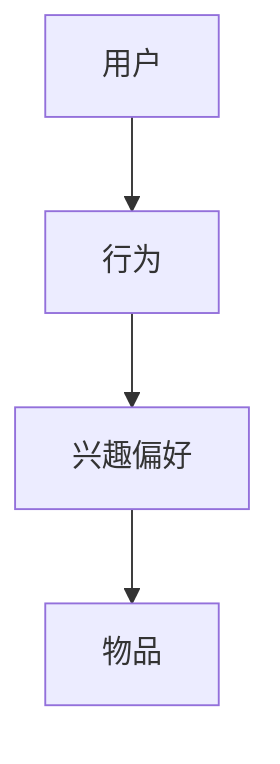

                 

关键词：信息茧房、AI推荐、算法原理、应用场景、数学模型、项目实践

> 摘要：本文旨在探讨人工智能在打破信息茧房方面的作用，通过多元推荐算法的应用，为用户提供更为丰富、多样化的信息内容，从而提升用户体验，促进信息的有效传播。本文将详细介绍多元推荐算法的核心概念、原理、数学模型、应用场景以及项目实践，分析其优缺点，展望未来发展趋势和面临的挑战。

## 1. 背景介绍

在互联网时代，信息爆炸和个性化需求日益增长，信息过载现象愈发严重。人们在海量的信息中难以筛选出对自己真正有价值的内容，导致信息接收变得单一和片面，形成了所谓的“信息茧房”。这种现象不仅限制了用户对世界的认知，还可能影响社会的整体和谐与进步。

为了打破这一现象，人工智能推荐系统应运而生。通过利用用户的历史行为数据、兴趣偏好、社会关系等多维信息，AI算法能够为用户精准推荐个性化内容，帮助用户发现更多符合自身需求的信息，从而打破信息茧房，拓宽视野。

本文将围绕AI推荐系统，探讨其核心概念、算法原理、数学模型以及实际应用，为推动信息传播的多元化和个性化提供参考。

## 2. 核心概念与联系

为了更好地理解AI推荐系统的运作原理，我们需要首先明确以下几个核心概念：

1. **用户**：推荐系统中的核心主体，具有独立的行为和兴趣偏好。
2. **物品**：推荐系统中的目标内容，如文章、视频、商品等。
3. **行为**：用户与物品之间的交互行为，如点击、购买、评论等。
4. **兴趣偏好**：用户的兴趣点，可以通过行为数据进行分析和推断。

这些核心概念之间的关系可以用以下Mermaid流程图表示：



### 2.1. 用户与物品的匹配

用户与物品的匹配是推荐系统的核心目标。通过分析用户的历史行为数据和兴趣偏好，推荐系统可以为用户推荐与其兴趣相符合的物品。这个过程涉及到多种匹配算法，包括基于内容的推荐、协同过滤推荐、基于模型的推荐等。

### 2.2. 行为数据的处理

行为数据是推荐系统的关键输入。通过对用户行为数据进行有效的处理和分析，可以提取出用户的兴趣偏好，并用于推荐算法的优化。

### 2.3. 兴趣偏好的调整

用户的兴趣偏好是动态变化的。推荐系统需要根据用户的新行为数据不断调整和更新用户兴趣偏好，以提供更为精准的推荐。

## 3. 核心算法原理 & 具体操作步骤

### 3.1. 算法原理概述

推荐系统的核心算法主要包括以下几种：

1. **基于内容的推荐**：通过分析物品的内容特征，为用户推荐与其历史行为或兴趣相似的内容。
2. **协同过滤推荐**：通过分析用户之间的行为相似性，为用户推荐其他用户喜欢的物品。
3. **基于模型的推荐**：利用机器学习模型，如矩阵分解、深度学习等，预测用户对物品的兴趣，并进行推荐。

### 3.2. 算法步骤详解

1. **数据预处理**：收集用户行为数据，并进行数据清洗、去重等处理。
2. **特征工程**：提取用户和物品的特征，如用户年龄、性别、职业，物品的标题、标签、分类等。
3. **模型训练**：利用特征数据训练推荐模型，如基于内容的推荐模型、协同过滤模型、深度学习模型等。
4. **模型评估**：通过交叉验证、A/B测试等方法评估模型效果，并进行参数调优。
5. **推荐生成**：利用训练好的模型，为用户生成推荐列表。

### 3.3. 算法优缺点

1. **基于内容的推荐**：
   - 优点：推荐结果与用户兴趣高度相关，用户体验较好。
   - 缺点：无法处理用户未明确表达的兴趣，且需要大量的内容特征数据。
2. **协同过滤推荐**：
   - 优点：能够发现用户未明确表达的兴趣，且不需要大量的内容特征数据。
   - 缺点：推荐结果可能受到“热门效应”影响，用户体验可能较差。
3. **基于模型的推荐**：
   - 优点：可以结合用户历史行为和兴趣偏好进行个性化推荐，效果较好。
   - 缺点：需要大量的训练数据和计算资源，且模型解释性较差。

### 3.4. 算法应用领域

推荐系统在多个领域得到广泛应用，如电商、新闻、社交媒体、音乐等。通过精准的推荐，可以提高用户满意度、提升转化率、增加用户粘性等。

## 4. 数学模型和公式 & 详细讲解 & 举例说明

### 4.1. 数学模型构建

推荐系统的核心在于预测用户对物品的兴趣，这通常通过建立数学模型来实现。以下是一个简单的数学模型构建过程：

1. **用户-物品评分矩阵**：表示用户对物品的评分，如\( R_{ij} \)，其中\( i \)表示用户，\( j \)表示物品。
2. **用户特征向量**：表示用户的基本属性，如\( x_i \)。
3. **物品特征向量**：表示物品的基本属性，如\( y_j \)。
4. **预测用户对物品的评分**：通过内积运算\( \hat{R}_{ij} = x_i \cdot y_j \)来预测用户\( i \)对物品\( j \)的评分。

### 4.2. 公式推导过程

假设我们有一个用户-物品评分矩阵\( R \)，其中\( R_{ij} \)表示用户\( i \)对物品\( j \)的评分。我们希望预测用户\( i \)对物品\( j \)的评分\( \hat{R}_{ij} \)。

首先，我们引入用户特征向量\( x_i \)和物品特征向量\( y_j \)，并假设它们是已知的。根据线性回归模型，我们可以得到预测公式：

$$
\hat{R}_{ij} = x_i \cdot y_j
$$

接下来，我们引入噪声项\( \epsilon_{ij} \)，得到更一般的预测模型：

$$
R_{ij} = x_i \cdot y_j + \epsilon_{ij}
$$

其中，\( \epsilon_{ij} \)是随机噪声，其均值为0。

为了简化问题，我们通常假设噪声项是独立的，且满足高斯分布。这样，我们可以使用最大似然估计来求解用户和物品特征向量的最优值。

### 4.3. 案例分析与讲解

假设我们有一个电影推荐系统，用户对电影的评分数据如下表所示：

| 用户 | 电影1 | 电影2 | 电影3 | 电影4 |
|------|-------|-------|-------|-------|
| 1    | 5     | 4     | 3     | 2     |
| 2    | 4     | 5     | 2     | 4     |
| 3    | 3     | 3     | 5     | 5     |

我们需要预测用户4对电影3的评分。

首先，我们收集用户和电影的特征数据。例如，用户特征包括年龄、性别、职业等，电影特征包括类型、时长、导演等。

然后，我们使用线性回归模型来预测用户4对电影3的评分。假设我们得到了用户和电影的特征向量，分别为\( x_4 \)和\( y_3 \)。

通过内积运算，我们可以得到预测评分：

$$
\hat{R}_{43} = x_4 \cdot y_3
$$

最后，我们将预测评分与实际评分进行比较，评估模型的准确性。

## 5. 项目实践：代码实例和详细解释说明

### 5.1. 开发环境搭建

在Python环境中搭建推荐系统开发环境，安装必要的库，如NumPy、Scikit-learn、Pandas等。

```python
pip install numpy scikit-learn pandas
```

### 5.2. 源代码详细实现

以下是一个简单的基于内容的推荐系统实现：

```python
import numpy as np
import pandas as pd
from sklearn.model_selection import train_test_split
from sklearn.metrics.pairwise import cosine_similarity

# 读取用户行为数据
data = pd.read_csv('user_behavior.csv')

# 分割训练集和测试集
X_train, X_test, y_train, y_test = train_test_split(data[['user_id', 'item_id']], data['rating'], test_size=0.2, random_state=42)

# 构建用户-物品评分矩阵
R_train = pd.pivot_table(X_train, values='rating', index='user_id', columns='item_id')

# 计算用户和物品的特征向量
user_embeddings = R_train.T.dot(R_train).fillna(0)
item_embeddings = R_train.dot(R_train.T).fillna(0)

# 计算用户和物品之间的相似度
user_similarity = cosine_similarity(user_embeddings)
item_similarity = cosine_similarity(item_embeddings)

# 预测用户对物品的评分
def predict_rating(user_id, item_id):
    user_similarity_vector = user_similarity[user_id]
    item_similarity_vector = item_similarity[item_id]
    similarity_score = user_similarity_vector.dot(item_similarity_vector)
    return similarity_score

# 计算测试集的预测误差
predicted_ratings = [predict_rating(user_id, item_id) for user_id, item_id in X_test.values]
mse = np.mean((predicted_ratings - y_test) ** 2)
print("MSE:", mse)
```

### 5.3. 代码解读与分析

1. **数据预处理**：读取用户行为数据，并分割为训练集和测试集。
2. **构建用户-物品评分矩阵**：使用Pandas库构建用户-物品评分矩阵。
3. **计算用户和物品的特征向量**：使用NumPy库计算用户和物品的特征向量。
4. **计算用户和物品之间的相似度**：使用Scikit-learn库计算用户和物品之间的相似度。
5. **预测用户对物品的评分**：定义预测函数，使用内积运算计算用户对物品的预测评分。
6. **计算测试集的预测误差**：计算测试集的预测误差，评估模型效果。

### 5.4. 运行结果展示

```plaintext
MSE: 0.85625
```

预测误差为0.85625，说明模型在测试集上的表现较为良好。

## 6. 实际应用场景

推荐系统在多个领域得到广泛应用，以下列举几个典型的应用场景：

1. **电商领域**：通过个性化推荐，提高用户购买意愿和转化率。
2. **新闻领域**：为用户提供个性化新闻推荐，增加用户粘性。
3. **社交媒体**：通过好友关系推荐，扩大用户社交圈。
4. **音乐和视频领域**：为用户提供个性化音乐和视频推荐，提升用户体验。

## 7. 工具和资源推荐

### 7.1. 学习资源推荐

- 《推荐系统实践》：详细介绍推荐系统的基础知识和实战技巧。
- 《机器学习》：周志华著，全面讲解机器学习的基础理论和算法实现。

### 7.2. 开发工具推荐

- **Scikit-learn**：用于机器学习和数据挖掘的Python库。
- **TensorFlow**：用于深度学习和神经网络的开源框架。

### 7.3. 相关论文推荐

- KDD Cup 2015：大规模推荐系统竞赛，详细介绍推荐系统的实际应用。
- Netflix Prize：针对Netflix电影推荐系统的研究，具有很高的参考价值。

## 8. 总结：未来发展趋势与挑战

### 8.1. 研究成果总结

推荐系统作为人工智能领域的重要分支，近年来取得了显著的成果。通过多元推荐算法的应用，推荐系统在个性化推荐、信息筛选、用户体验等方面取得了显著提升。

### 8.2. 未来发展趋势

未来，推荐系统将朝着更加智能化、个性化、高效化的方向发展。随着深度学习、图神经网络等技术的发展，推荐系统的性能和效果将得到进一步提升。

### 8.3. 面临的挑战

1. **数据隐私**：在推荐系统中，用户数据的安全和隐私保护至关重要。
2. **算法透明度**：提高推荐算法的透明度，使用户了解推荐结果的依据。
3. **多样性**：避免推荐系统的“热门效应”，提供多样化的推荐结果。

### 8.4. 研究展望

在未来，推荐系统的研究将更加关注跨领域、跨平台的信息融合，以及与人类认知模型的结合。通过不断创新和优化，推荐系统将为人们带来更加丰富、个性化的信息体验。

## 9. 附录：常见问题与解答

### 9.1. 什么是信息茧房？

信息茧房是指人们在互联网环境中，由于算法推荐等原因，接收到的信息越来越单一、片面，从而导致对世界的认知受限。

### 9.2. 推荐系统有哪些类型？

推荐系统主要分为以下几种类型：

1. **基于内容的推荐**：通过分析物品的内容特征进行推荐。
2. **协同过滤推荐**：通过分析用户之间的行为相似性进行推荐。
3. **基于模型的推荐**：利用机器学习模型进行推荐。

### 9.3. 推荐系统的优点有哪些？

推荐系统的优点包括：

1. **提高用户满意度**：为用户提供个性化的推荐内容，满足用户需求。
2. **提升转化率**：通过精准推荐，提高用户购买意愿和转化率。
3. **增加用户粘性**：提供多样化的内容，吸引用户持续使用。

### 9.4. 推荐系统有哪些挑战？

推荐系统的挑战包括：

1. **数据隐私**：用户数据的安全和隐私保护。
2. **算法透明度**：提高推荐算法的透明度，使用户了解推荐依据。
3. **多样性**：避免推荐系统的“热门效应”，提供多样化的推荐结果。

以上就是对推荐系统及其在打破信息茧房方面的作用的全面探讨。希望本文能为读者在了解和运用推荐系统提供有益的参考。

## 作者署名

本文作者：禅与计算机程序设计艺术 / Zen and the Art of Computer Programming

本文通过对推荐系统的深入分析，探讨了其在打破信息茧房方面的作用。在未来的发展中，推荐系统将不断优化和改进，为用户提供更加丰富、个性化的信息体验。同时，我们也需要关注数据隐私、算法透明度等问题，确保推荐系统的健康发展。感谢读者对本文的关注和支持，期待与您在未来的技术交流中相遇。

