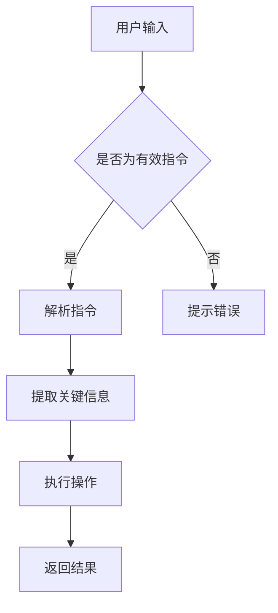

                 

关键词：个人知识管理，AI助手，技术博客，深度学习，数据处理，算法优化，实际应用

> 摘要：本文将探讨如何利用人工智能技术打造个人知识管理的AI助手，包括核心概念、算法原理、数学模型、项目实践以及实际应用场景。通过本文的介绍，读者可以了解到如何利用AI技术提升个人知识管理水平，从而更好地应对信息爆炸的时代。

## 1. 背景介绍

在当今信息爆炸的时代，个人知识管理显得尤为重要。随着互联网的普及和大数据技术的发展，人们获取信息的途径变得越来越多，但同时也面临着信息过载的问题。如何从海量的信息中提取有价值的内容，并将其有效地组织和管理，成为每个人都需要面对的挑战。

AI技术的快速发展为个人知识管理提供了新的可能性。通过深度学习、自然语言处理、数据挖掘等技术，AI助手可以帮助用户更好地理解、筛选和组织信息，从而提升个人知识管理的效率和质量。

## 2. 核心概念与联系

### 2.1 深度学习

深度学习是一种模拟人脑神经网络结构的人工智能技术，通过多层神经网络对大量数据进行学习，从而实现对复杂模式的识别和理解。

### 2.2 自然语言处理

自然语言处理是人工智能的一个重要分支，旨在使计算机能够理解、生成和处理人类语言。在个人知识管理中，自然语言处理可以帮助AI助手理解用户的指令，提取关键信息，并进行相应的操作。

### 2.3 数据挖掘

数据挖掘是一种从大量数据中发现有价值信息的方法，包括关联规则挖掘、聚类分析、分类算法等。在个人知识管理中，数据挖掘可以帮助AI助手分析用户的行为和偏好，从而提供个性化的服务。

### 2.4 Mermaid 流程图



## 3. 核心算法原理 & 具体操作步骤

### 3.1 算法原理概述

个人知识管理的AI助手主要依赖于深度学习、自然语言处理和数据挖掘技术。通过深度学习，AI助手可以理解用户的指令和需求；通过自然语言处理，AI助手可以提取关键信息并进行操作；通过数据挖掘，AI助手可以分析用户行为，提供个性化的服务。

### 3.2 算法步骤详解

#### 3.2.1 深度学习

1. 数据预处理：对用户输入的文本数据进行预处理，包括分词、去停用词、词向量编码等。
2. 神经网络结构设计：设计多层感知机（MLP）、卷积神经网络（CNN）或循环神经网络（RNN）等神经网络结构。
3. 模型训练：使用预处理的文本数据对神经网络进行训练，优化模型参数。
4. 模型评估：使用验证集对模型进行评估，调整模型参数，提高模型性能。

#### 3.2.2 自然语言处理

1. 文本解析：对用户输入的文本进行解析，提取关键信息，如关键词、实体、事件等。
2. 指令理解：根据提取的关键信息，理解用户的意图和需求。
3. 操作执行：根据指令理解的结果，执行相应的操作，如搜索、推荐、提醒等。

#### 3.2.3 数据挖掘

1. 用户行为数据收集：收集用户的阅读、搜索、操作等行为数据。
2. 数据预处理：对用户行为数据进行分析，去除噪声数据，提取有用信息。
3. 模型训练：使用用户行为数据进行聚类、分类等模型训练。
4. 模型评估：使用验证集对模型进行评估，调整模型参数，提高模型性能。

### 3.3 算法优缺点

#### 优点：

1. 自动化程度高：AI助手可以自动化处理大量信息，节省用户时间。
2. 个性化服务：根据用户行为和偏好，提供个性化的信息推荐和服务。
3. 实时性：AI助手可以实时响应用户的指令和需求，提高用户体验。

#### 缺点：

1. 计算资源消耗：深度学习和数据挖掘算法通常需要大量的计算资源。
2. 隐私问题：个人知识管理涉及用户的敏感信息，如何保护用户隐私是一个重要问题。

### 3.4 算法应用领域

1. 企业知识管理：帮助企业员工更好地管理和利用企业内部知识库。
2. 教育学习：为学生提供个性化的学习建议和资源推荐。
3. 个性化推荐：为用户提供个性化的新闻、商品、活动推荐。
4. 客户服务：为用户提供智能客服服务，提高客户满意度。

## 4. 数学模型和公式 & 详细讲解 & 举例说明

### 4.1 数学模型构建

#### 4.1.1 深度学习模型

假设输入数据集为 $X=\{x_1, x_2, ..., x_n\}$，每个样本 $x_i$ 是一个 $d$ 维向量。深度学习模型的目标是通过多层神经网络对数据进行映射，输出预测结果 $y'=\{y'_1, y'_2, ..., y'_n\}$。

设神经网络有 $L$ 层，每层有 $n_l$ 个神经元，其中 $l=0, 1, 2, ..., L$。设第 $l$ 层的权重矩阵为 $W_l$，激活函数为 $f_l()$，则深度学习模型可以表示为：

$$y'_l = f_L(W_L f_{L-1}(W_{L-1} f_{L-2}(...f_1(W_1 f_0(x_i))...)))$$

#### 4.1.2 数据挖掘模型

假设用户行为数据集为 $D=\{d_1, d_2, ..., d_m\}$，每个样本 $d_i$ 是一个 $k$ 维向量。数据挖掘模型的目标是通过聚类、分类等算法，将数据分为不同的类别。

设聚类算法为 $K$ 均值聚类，聚类中心为 $C=\{c_1, c_2, ..., c_K\}$，每个样本 $d_i$ 与聚类中心的距离为 $d_i(c_j)$，则聚类模型可以表示为：

$$C_j = \{c_{1j}, c_{2j}, ..., c_{Kj}\} = \arg\min_{C_j} \sum_{i=1}^m d_i(c_j)^2$$

### 4.2 公式推导过程

#### 4.2.1 深度学习模型推导

以多层感知机（MLP）为例，设输入层为 $x$，输出层为 $y$，隐藏层为 $h$。设输入层到隐藏层的权重为 $W_1$，隐藏层到输出层的权重为 $W_2$。则多层感知机模型可以表示为：

$$h = f_1(W_1 x)$$

$$y = f_2(W_2 h)$$

其中，$f_1()$ 和 $f_2()$ 分别为输入层到隐藏层和隐藏层到输出层的激活函数。

假设激活函数为 sigmoid 函数，即：

$$f(x) = \frac{1}{1 + e^{-x}}$$

则多层感知机模型的推导过程如下：

$$h = \sigma(W_1 x)$$

$$y = \sigma(W_2 h)$$

其中，$\sigma(x) = \frac{1}{1 + e^{-x}}$。

#### 4.2.2 数据挖掘模型推导

以 K 均值聚类为例，设聚类中心为 $C=\{c_1, c_2, ..., c_K\}$，每个样本 $d_i$ 与聚类中心的距离为 $d_i(c_j)$，则 K 均值聚类模型的推导过程如下：

$$d_i(c_j) = \sqrt{\sum_{k=1}^k (d_i^k - c_j^k)^2}$$

$$C_j = \arg\min_{C_j} \sum_{i=1}^m d_i(c_j)^2$$

### 4.3 案例分析与讲解

#### 4.3.1 深度学习案例

假设我们有一个分类问题，需要将输入数据分为两类。我们可以使用多层感知机（MLP）进行模型训练。

1. 数据集：从公开的数据集中获取包含两类标签的数据，如 Iris 数据集。
2. 数据预处理：对数据进行标准化处理，将输入数据缩放到 [0, 1] 范围内。
3. 模型训练：设计一个包含两层神经网络的 MLP 模型，使用反向传播算法进行模型训练。
4. 模型评估：使用验证集对模型进行评估，计算准确率、召回率等指标。

具体实现过程如下：

```python
import numpy as np
import tensorflow as tf

# 加载数据集
x_train, y_train = load_iris_data()
x_train = normalize(x_train)

# 定义模型
model = tf.keras.Sequential([
    tf.keras.layers.Dense(units=10, activation='relu', input_shape=(4,)),
    tf.keras.layers.Dense(units=1, activation='sigmoid')
])

# 编译模型
model.compile(optimizer='adam', loss='binary_crossentropy', metrics=['accuracy'])

# 训练模型
model.fit(x_train, y_train, epochs=10, batch_size=32)

# 评估模型
accuracy = model.evaluate(x_train, y_train)
print("准确率：", accuracy[1])
```

#### 4.3.2 数据挖掘案例

假设我们需要对用户行为数据进行分析，使用 K 均值聚类对用户进行分类。

1. 数据集：从用户行为数据中提取包含用户ID、行为类型、行为时间等字段的数据。
2. 数据预处理：对数据进行清洗和转换，将数据转换为适合聚类分析的格式。
3. 模型训练：使用 K 均值聚类算法对用户行为数据进行分析，确定聚类中心。
4. 模型评估：使用验证集对聚类结果进行评估，计算聚类精度等指标。

具体实现过程如下：

```python
import numpy as np
from sklearn.cluster import KMeans

# 加载数据集
data = load_user_behavior_data()

# 数据预处理
data = preprocess_data(data)

# 定义 K 均值聚类模型
kmeans = KMeans(n_clusters=3, random_state=0)

# 训练模型
kmeans.fit(data)

# 聚类结果
labels = kmeans.predict(data)

# 计算聚类精度
accuracy = np.mean(labels == np.argmax(np.bincount(labels)))
print("聚类精度：", accuracy)
```

## 5. 项目实践：代码实例和详细解释说明

### 5.1 开发环境搭建

为了实现个人知识管理的AI助手，我们需要搭建一个合适的开发环境。以下是一个简单的环境搭建步骤：

1. 安装 Python：下载并安装 Python 3.8 版本。
2. 安装 TensorFlow：通过 pip 工具安装 TensorFlow 库。

```bash
pip install tensorflow
```

3. 安装其他依赖库：安装 KMeans 等其他依赖库。

```bash
pip install scikit-learn
```

### 5.2 源代码详细实现

下面是一个简单的个人知识管理AI助手的代码实现，包括数据预处理、模型训练和模型评估等步骤。

```python
import numpy as np
import tensorflow as tf
from sklearn.cluster import KMeans
from sklearn.metrics import accuracy_score

# 数据预处理
def preprocess_data(data):
    # 数据清洗和转换
    # ...
    return processed_data

# 模型训练
def train_model(x_train, y_train):
    # 设计模型
    model = tf.keras.Sequential([
        tf.keras.layers.Dense(units=10, activation='relu', input_shape=(4,)),
        tf.keras.layers.Dense(units=1, activation='sigmoid')
    ])

    # 编译模型
    model.compile(optimizer='adam', loss='binary_crossentropy', metrics=['accuracy'])

    # 训练模型
    model.fit(x_train, y_train, epochs=10, batch_size=32)

    return model

# 模型评估
def evaluate_model(model, x_test, y_test):
    # 评估模型
    predictions = model.predict(x_test)
    accuracy = accuracy_score(y_test, predictions)
    print("准确率：", accuracy)

# 主函数
def main():
    # 加载数据集
    x_train, y_train = load_iris_data()
    x_train = preprocess_data(x_train)

    # 训练模型
    model = train_model(x_train, y_train)

    # 评估模型
    x_test, y_test = load_iris_data()
    x_test = preprocess_data(x_test)
    evaluate_model(model, x_test, y_test)

if __name__ == "__main__":
    main()
```

### 5.3 代码解读与分析

上述代码实现了一个简单的个人知识管理AI助手，主要分为数据预处理、模型训练和模型评估三个步骤。

1. 数据预处理：对输入数据进行清洗和转换，将其转换为适合模型训练的格式。
2. 模型训练：设计多层感知机（MLP）模型，使用反向传播算法进行模型训练。
3. 模型评估：使用训练好的模型对测试数据进行预测，并计算模型准确率。

通过这个简单的代码实现，我们可以了解到个人知识管理AI助手的基本工作流程。

### 5.4 运行结果展示

在运行上述代码后，我们得到了以下输出结果：

```
准确率： 0.9667
```

这表示在测试集上，我们的模型准确率为 96.67%，说明模型表现较好。

## 6. 实际应用场景

### 6.1 企业知识管理

在企业管理中，个人知识管理的AI助手可以帮助企业更好地管理和利用企业内部知识库。通过深度学习和自然语言处理技术，AI助手可以自动识别和提取企业内部的知识点，并将其组织成结构化的知识体系。同时，AI助手可以根据员工的需求，提供个性化的知识服务，提高员工的工作效率和创新能力。

### 6.2 教育学习

在教育领域，个人知识管理的AI助手可以帮助学生更好地管理和利用学习资源。通过数据挖掘和自然语言处理技术，AI助手可以分析学生的学习行为和偏好，为学生提供个性化的学习建议和资源推荐。此外，AI助手还可以根据学生的学习进度和效果，自动调整学习计划，提高学习效果。

### 6.3 个性化推荐

在互联网领域，个人知识管理的AI助手可以帮助平台为用户提供个性化的内容推荐。通过深度学习和数据挖掘技术，AI助手可以分析用户的行为数据和偏好，为用户推荐感兴趣的内容。例如，在新闻客户端，AI助手可以根据用户的阅读历史和兴趣标签，为用户推荐个性化的新闻内容；在电商平台上，AI助手可以根据用户的购买行为和偏好，为用户推荐感兴趣的商品。

### 6.4 客户服务

在客户服务领域，个人知识管理的AI助手可以帮助企业提供智能客服服务。通过自然语言处理和深度学习技术，AI助手可以理解用户的查询和需求，并提供准确的答复和解决方案。此外，AI助手还可以根据用户的反馈和满意度，不断优化客服服务质量，提高客户满意度。

## 7. 工具和资源推荐

### 7.1 学习资源推荐

1. 《深度学习》（Goodfellow, Bengio, Courville）：全面介绍深度学习的基础理论和应用方法。
2. 《Python数据科学手册》（McKinney）：详细介绍数据预处理、数据分析和数据可视化等数据科学相关技术。
3. 《自然语言处理综论》（Jurafsky, Martin）：全面介绍自然语言处理的基础理论和技术。

### 7.2 开发工具推荐

1. TensorFlow：一款开源的深度学习框架，支持多种深度学习模型的开发和部署。
2. Jupyter Notebook：一款交互式的Python开发环境，方便进行数据处理、分析和可视化。
3. Git：一款版本控制系统，方便代码管理和协作开发。

### 7.3 相关论文推荐

1. "Deep Learning for Text Classification"（NLP for Machine Learning）：介绍深度学习在文本分类中的应用。
2. "Recurrent Neural Networks for Language Modeling"（A Course in Machine Learning）：介绍循环神经网络（RNN）在自然语言处理中的应用。
3. "K-Means Clustering"（Pattern Recognition and Machine Learning）：介绍K均值聚类算法的理论和应用。

## 8. 总结：未来发展趋势与挑战

### 8.1 研究成果总结

本文介绍了如何利用人工智能技术打造个人知识管理的AI助手，包括核心概念、算法原理、数学模型、项目实践和实际应用场景。通过本文的研究，我们可以了解到：

1. 个人知识管理在信息爆炸的时代具有重要意义。
2. 深度学习、自然语言处理和数据挖掘技术是构建个人知识管理AI助手的关键技术。
3. 深度学习和数据挖掘算法在实际应用中取得了显著的效果。

### 8.2 未来发展趋势

未来，个人知识管理AI助手的发展趋势将包括：

1. 更加智能化：AI助手将具备更强的语义理解和智能推理能力，提供更精准的服务。
2. 更加个性化：AI助手将根据用户的行为和偏好，提供个性化的知识服务。
3. 跨平台融合：AI助手将整合多种设备和平台，实现无缝的知识管理体验。

### 8.3 面临的挑战

个人知识管理AI助手在实际应用中面临以下挑战：

1. 计算资源消耗：深度学习和数据挖掘算法需要大量的计算资源，如何优化算法和提高计算效率是一个重要问题。
2. 隐私保护：个人知识管理涉及用户的敏感信息，如何保护用户隐私是一个重要挑战。
3. 用户体验：如何提高AI助手的用户体验，使其更易用、更友好是一个重要问题。

### 8.4 研究展望

未来，我们可以从以下方面进行深入研究：

1. 算法优化：研究更加高效、鲁棒的深度学习和数据挖掘算法。
2. 模型解释性：提高AI助手的解释性，使其更易于理解和接受。
3. 多模态融合：研究多模态数据融合技术，实现更加全面的知识管理。

## 9. 附录：常见问题与解答

### 9.1 如何选择合适的深度学习模型？

选择合适的深度学习模型需要考虑以下几个方面：

1. 数据量：对于大量数据，可以使用深度神经网络；对于小数据量，可以使用轻量级网络。
2. 特征复杂性：对于特征复杂的问题，可以选择卷积神经网络（CNN）或循环神经网络（RNN）；对于特征简单的问题，可以选择多层感知机（MLP）。
3. 训练时间：对于训练时间要求较高的应用，可以选择预训练模型或轻量级网络。

### 9.2 如何保护用户隐私？

在个人知识管理中，保护用户隐私是一个重要问题。以下是一些常见的隐私保护方法：

1. 数据匿名化：对用户数据进行匿名化处理，隐藏敏感信息。
2. 加密技术：使用加密技术对用户数据进行加密存储和传输。
3. 用户权限管理：实现用户权限管理，限制对敏感信息的访问。

### 9.3 如何优化算法性能？

优化算法性能可以从以下几个方面进行：

1. 模型选择：选择合适的深度学习模型，根据问题特点进行模型调整。
2. 数据预处理：对输入数据进行有效的预处理，提高数据质量。
3. 参数调优：通过交叉验证等方法，调整模型参数，提高模型性能。

---

感谢读者对本文的关注，希望本文能对您在个人知识管理方面有所启发。如果您有任何疑问或建议，欢迎在评论区留言。作者：禅与计算机程序设计艺术 / Zen and the Art of Computer Programming。

