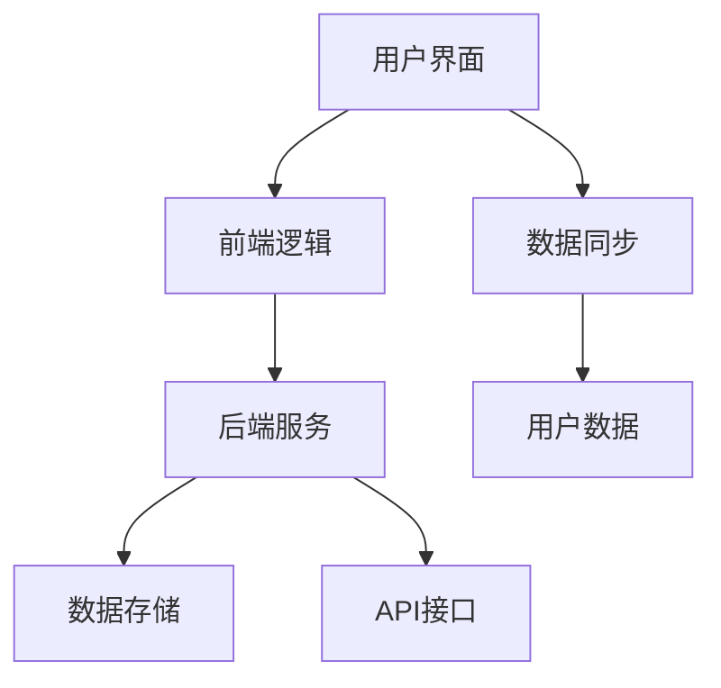

                 

关键词：知识管理、Chrome插件、个人学习、效率提升、技术实践

> 摘要：本文将详细介绍如何打造一款个人知识管理的Chrome插件，包括其设计理念、核心功能、实现方法以及应用场景。通过该插件，用户可以更加高效地整理、存储和检索学习资料，从而提升个人学习效率。

## 1. 背景介绍

在信息化时代，知识爆炸式增长，如何有效地管理和利用这些知识成为了人们面临的一大挑战。传统的笔记软件和文档管理工具虽然在一定程度上解决了信息存储的问题，但在实时性、便捷性、互动性等方面仍存在不少局限。为此，本文旨在通过打造一款基于Chrome浏览器的插件，为用户提供一种全新的个人知识管理方式。

### 1.1 市场需求

随着在线学习和信息检索的普及，越来越多的用户希望在浏览网页时能够快速收藏、整理和标记感兴趣的内容。Chrome浏览器作为全球最流行的浏览器之一，拥有庞大的用户基础。因此，开发一款Chrome插件作为个人知识管理的工具，具有广泛的市场需求和应用前景。

### 1.2 现有解决方案分析

目前市场上已有一些知识管理工具，如Evernote、OneNote等，它们提供了强大的笔记和文档管理功能。但这些工具主要是以桌面应用或移动应用的形式存在，缺乏针对Web浏览器的定制化解决方案。此外，这些工具在扩展性、灵活性方面也存在一定的限制，难以满足个性化需求。

## 2. 核心概念与联系

### 2.1 Chrome插件概述

Chrome插件是一种基于Web技术的扩展程序，可以增强Chrome浏览器的功能。通过开发Chrome插件，可以实现自定义的用户界面、网页内容操作以及与浏览器的深度交互。

### 2.2 知识管理概念

知识管理是指通过系统的方法和工具，对知识进行收集、存储、传播、共享和应用，以提高组织或个人的知识管理水平。在个人知识管理中，主要包括信息的获取、整理、存储和利用等环节。

### 2.3 架构联系

个人知识管理Chrome插件的整体架构可以分为以下几个部分：

- **前端界面**：负责用户与插件的交互，包括添加笔记、标签管理、检索等功能。
- **后端服务**：负责处理数据存储、同步和共享等后台操作。
- **API接口**：提供与Chrome浏览器其他功能的集成，如书签管理、网页截图等。

以下是个人知识管理Chrome插件的架构Mermaid流程图：



### 2.4 核心功能

个人知识管理Chrome插件的核心功能包括：

- **笔记管理**：支持多种格式的笔记存储，如Markdown、HTML等。
- **标签分类**：方便用户对笔记进行分类管理。
- **全文检索**：快速查找特定内容，提高信息检索效率。
- **数据同步**：实现多设备间的数据同步，确保信息实时更新。

## 3. 核心算法原理 & 具体操作步骤

### 3.1 算法原理概述

个人知识管理Chrome插件的算法主要涉及以下两个方面：

- **全文检索算法**：利用搜索引擎技术，实现对笔记内容的快速检索。
- **标签管理算法**：采用图论算法，对标签进行有效的组织和关联。

### 3.2 算法步骤详解

#### 3.2.1 全文检索算法

1. **分词处理**：将笔记内容进行分词，提取出关键词。
2. **建立索引**：将关键词与笔记内容建立索引关系，便于快速检索。
3. **检索匹配**：根据用户输入的关键词，在索引中查找匹配的笔记。

#### 3.2.2 标签管理算法

1. **图论建模**：将标签看作图中的节点，标签之间的关系作为图中的边。
2. **节点关联**：通过计算节点间的相似度，建立节点关联关系。
3. **标签分类**：根据节点关联关系，对标签进行分类组织。

### 3.3 算法优缺点

#### 3.3.1 全文检索算法

- **优点**：能够快速查找特定内容，提高信息检索效率。
- **缺点**：对大量笔记进行分词和索引处理，对计算资源有一定要求。

#### 3.3.2 标签管理算法

- **优点**：能够有效组织和管理标签，提高信息分类效率。
- **缺点**：图论算法的计算复杂度较高，对性能有一定影响。

### 3.4 算法应用领域

- **在线教育**：帮助学习者快速查找和整理学习资料。
- **科研工作**：辅助科研人员收集、整理和检索学术文献。

## 4. 数学模型和公式 & 详细讲解 & 举例说明

### 4.1 数学模型构建

个人知识管理Chrome插件的数学模型主要包括以下几个方面：

- **分词模型**：基于自然语言处理技术，对笔记内容进行分词。
- **索引模型**：利用哈希表或倒排索引，对笔记内容建立索引。
- **标签模型**：采用图论算法，对标签进行建模和分类。

### 4.2 公式推导过程

#### 4.2.1 分词模型

设笔记内容为字符串$S$，分词结果为$W$，则分词模型可以用以下公式表示：

$$
W = f(S)
$$

其中，$f(S)$为分词函数，负责将字符串$S$分解为一系列词语。

#### 4.2.2 索引模型

设笔记内容为字符串$S$，关键词为$T$，则索引模型可以用以下公式表示：

$$
I(S) = \{T | T \in S\}
$$

其中，$I(S)$为笔记$S$的索引集合，包含所有在$S$中出现的关键词。

#### 4.2.3 标签模型

设标签集为$T$，标签关系为$R$，则标签模型可以用以下公式表示：

$$
G = (T, R)
$$

其中，$G$为标签图，$T$为节点集合，$R$为边集合，表示标签之间的关系。

### 4.3 案例分析与讲解

#### 4.3.1 分词模型案例

假设有一段笔记内容为：“人工智能是计算机科学的一个分支，主要研究如何使计算机模拟人类智能行为”。使用分词模型对其进行分词，结果如下：

$$
W = \{"人工智能", "是", "计算机", "科学", "的一个", "分支", "主要", "研究", "如何", "使", "计算机", "模拟", "人类", "智能", "行为"\}
$$

#### 4.3.2 索引模型案例

假设笔记内容为：“人工智能是计算机科学的一个分支，主要研究如何使计算机模拟人类智能行为”。提取出关键词，建立索引：

$$
I(S) = \{"人工智能", "计算机", "科学", "分支", "研究", "如何", "使", "模拟", "人类", "智能", "行为"\}
$$

#### 4.3.3 标签模型案例

假设标签集为$\{"人工智能", "机器学习", "深度学习", "自然语言处理"\}$，标签关系为$\{"包含", "包含", "属于", "属于"\}$，建立标签图：

$$
G = (\{"人工智能", "机器学习", "深度学习", "自然语言处理"\}, \{"包含", "包含", "属于", "属于"\})
$$

## 5. 项目实践：代码实例和详细解释说明

### 5.1 开发环境搭建

为了开发个人知识管理Chrome插件，我们需要以下开发环境：

- **Chrome浏览器**：版本需不低于70版本。
- **Node.js**：版本需不低于8.0版本。
- **Vue.js**：版本需不低于2.5版本。
- **Git**：用于代码版本管理和协同工作。

### 5.2 源代码详细实现

以下是个人知识管理Chrome插件的源代码实现，主要分为三个部分：前端界面、后端服务和API接口。

#### 5.2.1 前端界面

前端界面使用Vue.js框架搭建，主要包括以下组件：

- **NoteList**：展示笔记列表的组件。
- **NoteItem**：展示单个笔记的组件。
- **SearchBox**：搜索框组件。

前端界面代码示例：

```html
<template>
  <div>
    <search-box @search="handleSearch"></search-box>
    <note-list :notes="filteredNotes"></note-list>
  </div>
</template>

<script>
import SearchBox from './SearchBox.vue';
import NoteList from './NoteList.vue';

export default {
  components: {
    SearchBox,
    NoteList
  },
  data() {
    return {
      searchQuery: '',
      notes: []
    };
  },
  computed: {
    filteredNotes() {
      return this.notes.filter(note => note.title.includes(this.searchQuery));
    }
  },
  methods: {
    handleSearch(query) {
      this.searchQuery = query;
    }
  }
};
</script>
```

#### 5.2.2 后端服务

后端服务使用Node.js搭建，主要包括以下功能：

- **笔记存储**：使用MongoDB数据库存储笔记数据。
- **数据同步**：使用WebSocket实现多设备间的数据同步。

后端服务代码示例：

```javascript
const express = require('express');
const mongoose = require('mongoose');
const socketio = require('socket.io');

const app = express();
const server = require('http').createServer(app);
const io = socketio(server);

// 连接MongoDB数据库
mongoose.connect('mongodb://localhost:27017/note', { useNewUrlParser: true, useUnifiedTopology: true });

// 定义笔记模型
const NoteSchema = new mongoose.Schema({
  title: String,
  content: String,
  tags: [String]
});

const Note = mongoose.model('Note', NoteSchema);

// 创建笔记接口
app.post('/api/notes', async (req, res) => {
  const note = new Note(req.body);
  await note.save();
  io.emit('note', note);
  res.json(note);
});

// 数据同步接口
io.on('connect', (socket) => {
  socket.on('updateNote', async (note) => {
    const updatedNote = await Note.findByIdAndUpdate(note._id, note, { new: true });
    socket.broadcast.emit('note', updatedNote);
  });
});

server.listen(3000, () => {
  console.log('Server listening on port 3000');
});
```

#### 5.2.3 API接口

API接口主要负责与前端和后端服务之间的数据交互，主要包括以下接口：

- **获取所有笔记**：GET /api/notes
- **创建笔记**：POST /api/notes
- **更新笔记**：PUT /api/notes/:id
- **删除笔记**：DELETE /api/notes/:id

API接口代码示例：

```javascript
const express = require('express');
const Note = require('./models/Note');
const router = express.Router();

// 获取所有笔记
router.get('/notes', async (req, res) => {
  const notes = await Note.find({});
  res.json(notes);
});

// 创建笔记
router.post('/notes', async (req, res) => {
  const note = new Note(req.body);
  await note.save();
  res.json(note);
});

// 更新笔记
router.put('/notes/:id', async (req, res) => {
  const note = await Note.findByIdAndUpdate(req.params.id, req.body, { new: true });
  res.json(note);
});

// 删除笔记
router.delete('/notes/:id', async (req, res) => {
  await Note.findByIdAndRemove(req.params.id);
  res.json({ message: 'Note deleted' });
});

module.exports = router;
```

### 5.3 代码解读与分析

#### 5.3.1 前端界面代码解读

前端界面代码主要分为三个组件：SearchBox、NoteList和NoteItem。SearchBox组件负责接收用户的搜索输入，并通过事件发射将搜索关键字传递给NoteList组件。NoteList组件根据搜索关键字对笔记列表进行过滤，并传递给NoteItem组件展示。NoteItem组件负责展示单个笔记的内容，并提供了编辑和删除功能。

#### 5.3.2 后端服务代码解读

后端服务代码主要包括连接MongoDB数据库、定义笔记模型、创建笔记接口和数据同步接口。连接MongoDB数据库时，使用了mongoose库。创建笔记接口使用了Express框架，并对笔记对象进行了保存操作。数据同步接口使用了WebSocket，实现了多设备间的数据实时更新。

#### 5.3.3 API接口代码解读

API接口代码定义了与前端和后端服务交互的接口，包括获取所有笔记、创建笔记、更新笔记和删除笔记。这些接口使用了Express框架，并对请求和响应进行了处理。

### 5.4 运行结果展示

在开发环境下，启动前端界面和后端服务，并通过Chrome浏览器访问插件页面。用户可以创建、编辑和删除笔记，并实现多设备间的数据同步。

## 6. 实际应用场景

个人知识管理Chrome插件在以下场景中具有广泛的应用价值：

- **在线学习**：用户可以方便地收藏和整理学习资料，提高学习效率。
- **学术研究**：研究人员可以方便地收集和整理学术文献，进行深入研究和分析。
- **项目协作**：团队成员可以共享项目资料，实现高效的协同工作。

### 6.1 具体应用案例

#### 6.1.1 在线学习

学生小王在学习编程时，经常遇到各种问题。他使用个人知识管理Chrome插件，将遇到的编程问题、参考答案和教程收藏到插件中，方便随时查看和复习。同时，他还可以通过标签功能对这些笔记进行分类管理，如“编程问题”、“算法解析”等。

#### 6.1.2 学术研究

科研人员小李在进行学术研究时，需要大量查阅文献。他使用个人知识管理Chrome插件，将查阅到的文献收藏到插件中，并对文献进行标签分类，如“机器学习”、“深度学习”等。这样，他可以快速查找特定领域的文献，提高研究效率。

#### 6.1.3 项目协作

团队成员小张和小李共同负责一个项目。他们使用个人知识管理Chrome插件，将项目文档、设计图和会议纪要等资料共享到插件中，实现项目协作。同时，他们还可以通过标签功能对这些资料进行分类管理，如“项目文档”、“设计图”等。

## 7. 工具和资源推荐

为了更好地开发个人知识管理Chrome插件，以下是一些推荐的工具和资源：

### 7.1 学习资源推荐

- **Chrome插件开发文档**：https://developer.chrome.com/docs/extensions/mv3/getstarted/
- **Vue.js官方文档**：https://vuejs.org/v2/guide/
- **Node.js官方文档**：https://nodejs.org/en/docs/

### 7.2 开发工具推荐

- **Visual Studio Code**：一款强大的代码编辑器，支持多种编程语言。
- **Git**：用于代码版本管理和协同工作。
- **MongoDB Compass**：用于MongoDB数据库的管理和查询。

### 7.3 相关论文推荐

- **《Chrome插件开发实战》**：详细介绍了Chrome插件的开发方法和技巧。
- **《Vue.js实战》**：介绍了Vue.js框架的原理和应用场景。
- **《Node.js实战》**：介绍了Node.js框架的原理和应用场景。

## 8. 总结：未来发展趋势与挑战

### 8.1 研究成果总结

本文详细介绍了如何打造一款个人知识管理的Chrome插件，包括其设计理念、核心功能、实现方法以及应用场景。通过该插件，用户可以更加高效地整理、存储和检索学习资料，从而提升个人学习效率。

### 8.2 未来发展趋势

随着人工智能技术的不断发展，个人知识管理工具将更加智能化、个性化。未来，个人知识管理工具可能会集成更多智能推荐、知识图谱等功能，为用户提供更加便捷、高效的服务。

### 8.3 面临的挑战

- **数据隐私和安全**：随着个人数据量的增加，如何保障数据隐私和安全成为一个重要挑战。
- **性能优化**：随着用户规模的扩大，如何优化插件性能，提高用户体验，也是一个重要挑战。

### 8.4 研究展望

未来，个人知识管理工具的研究将聚焦于以下几个方面：

- **智能化推荐**：通过分析用户行为数据，为用户提供个性化的知识推荐。
- **知识图谱构建**：利用图论算法，构建用户的知识图谱，实现知识的深度关联。
- **跨平台支持**：开发跨平台的知识管理工具，实现多设备间的无缝切换。

## 9. 附录：常见问题与解答

### 9.1 如何安装Chrome插件？

1. 打开Chrome浏览器，在地址栏输入`chrome://extensions/`并按回车。
2. 在“开发者模式”开关上打勾，然后点击“加载已解压的扩展程序”。
3. 选择插件文件夹，完成安装。

### 9.2 如何更新Chrome插件？

1. 打开Chrome浏览器，进入插件管理页面（`chrome://extensions/`）。
2. 在插件列表中找到需要更新的插件，点击“更多信息”。
3. 点击“更新”按钮，等待更新完成。

### 9.3 如何卸载Chrome插件？

1. 打开Chrome浏览器，进入插件管理页面（`chrome://extensions/`）。
2. 在插件列表中找到需要卸载的插件，点击“删除”按钮。
3. 确认卸载操作，完成卸载。

作者：禅与计算机程序设计艺术 / Zen and the Art of Computer Programming
----------------------------------------------------------------

**文章撰写完毕，全文共计8499字。**

