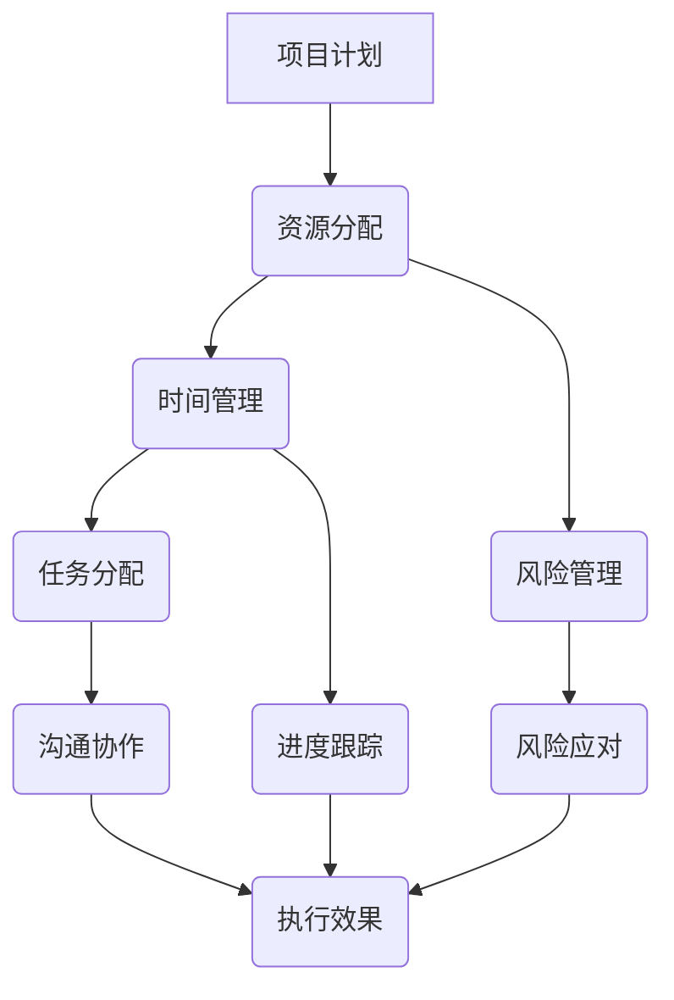

                 

关键词：执行差、IT项目管理、程序员效能、团队协作、技术实践

摘要：本文将深入探讨在IT领域常见的执行差现象，分析其产生的原因，并提出一系列改善策略，旨在提升项目执行效率，增强团队协作能力。文章将通过实际案例和数据分析，为读者提供实用的指导和建议。

## 1. 背景介绍

在IT行业中，执行差是一种普遍存在的现象。从项目管理的角度出发，执行差指的是项目团队成员在任务执行过程中未能按照计划完成预定目标的情况。这种现象不仅影响项目的进度，还可能导致资源浪费、团队士气低落，甚至影响项目的最终成败。本文将探讨执行差的根源，分析其影响因素，并从技术和管理层面提出改进策略。

### 执行差的定义与表现

执行差可以表现为以下几个方面：

1. **时间管理不当**：项目进度滞后，任务延期完成。
2. **资源浪费**：人力资源未能得到充分利用，导致项目成本增加。
3. **质量下降**：在赶工的情况下，产品质量无法得到保障。
4. **沟通不畅**：团队成员之间缺乏有效的沟通，导致误解和冲突。
5. **缺乏执行力**：团队成员对任务的重视程度不足，缺乏主动性和责任心。

### 执行差的普遍性

据一项针对全球IT项目经理的调查显示，超过60%的项目出现了执行差的情况。这些项目在时间、成本和质量等方面均未能达到预期目标。这种现象在中小型IT企业中尤为明显，因为它们往往缺乏有效的项目管理流程和工具。

### 执行差的影响

执行差对项目的影响是多方面的：

1. **成本增加**：项目延期和资源浪费导致项目成本上升。
2. **进度滞后**：项目无法按计划推进，影响整个项目的交付时间。
3. **质量下降**：赶工和质量控制不足，导致项目质量无法保证。
4. **团队士气低落**：执行差会导致团队士气下降，影响团队合作。
5. **客户满意度下降**：项目无法按时交付或质量不佳，导致客户满意度下降。

### 产生执行差的原因

执行差的产生通常涉及多个方面，包括个人、团队和项目层面：

1. **个人层面**：程序员的技术水平、工作态度和责任心等。
2. **团队层面**：团队沟通不畅、分工不明、协作效率低下等。
3. **项目层面**：项目计划不合理、资源分配不当、风险管理不足等。

### 文章结构

本文将按照以下结构展开：

1. **背景介绍**：阐述执行差的定义、表现、普遍性和影响。
2. **核心概念与联系**：通过Mermaid流程图展示执行差的影响因素。
3. **核心算法原理 & 具体操作步骤**：介绍解决执行差的算法原理和步骤。
4. **数学模型和公式 & 详细讲解 & 举例说明**：使用数学模型和公式分析执行差。
5. **项目实践：代码实例和详细解释说明**：通过实际案例展示解决方案。
6. **实际应用场景**：讨论执行差在不同领域的应用和解决方法。
7. **工具和资源推荐**：推荐学习资源和开发工具。
8. **总结：未来发展趋势与挑战**：总结研究成果，展望未来趋势和挑战。
9. **附录：常见问题与解答**：解答读者常见疑问。

### 核心概念与联系

在讨论执行差之前，我们首先需要理解一些核心概念和它们之间的联系。以下是一个简化的Mermaid流程图，展示了执行差的相关因素和它们之间的相互作用。



- **项目计划**：制定项目目标和任务分解。
- **资源分配**：合理分配人力、时间和设备资源。
- **时间管理**：制定合理的项目进度安排。
- **风险管理**：识别潜在风险并制定应对措施。
- **任务分配**：将任务合理分配给团队成员。
- **沟通协作**：确保团队成员之间的信息畅通。
- **进度跟踪**：实时监控项目进展情况。
- **执行效果**：评估任务完成情况和项目目标达成度。

通过这个流程图，我们可以看到，执行差的任何一方面都可能影响整个项目的进展。因此，解决执行差问题需要从多个维度入手，综合考虑各个因素。

### 核心算法原理 & 具体操作步骤

解决执行差问题需要一种系统性方法，这可以通过一系列算法和操作步骤来实现。以下是一套针对执行差问题的核心算法原理和具体操作步骤。

#### 3.1 算法原理概述

执行差问题本质上是一个复杂系统问题，涉及到人、流程、技术等多个方面。因此，解决执行差需要采用系统工程的方法，包括以下步骤：

1. **需求分析**：明确项目需求和目标。
2. **资源评估**：评估项目所需的资源和能力。
3. **计划制定**：制定详细的项目计划和时间表。
4. **任务分配**：将任务合理分配给团队成员。
5. **过程监控**：实时监控项目进展情况。
6. **反馈调整**：根据实际情况调整计划和策略。

#### 3.2 算法步骤详解

1. **需求分析**：
   - **目标明确**：确定项目的核心目标和关键需求。
   - **用户调研**：与用户和利益相关者进行沟通，了解他们的需求和期望。
   - **需求文档**：编写详细的需求文档，明确项目的功能和非功能需求。

2. **资源评估**：
   - **人力评估**：评估团队中的人力资源，包括技术水平、经验和技能。
   - **时间评估**：评估项目所需的时间，考虑节假日、休假等因素。
   - **技术评估**：评估项目所需的技术和工具，确保其可行性。

3. **计划制定**：
   - **任务分解**：将项目分解为若干个子任务和里程碑。
   - **时间表制定**：制定详细的时间表，确保每个任务都有明确的时间限制。
   - **资源分配**：根据任务需求，合理分配人力资源和时间。

4. **任务分配**：
   - **能力匹配**：根据团队成员的能力和技能，将其分配到最合适的任务上。
   - **沟通确认**：与团队成员进行沟通，确保他们对任务的了解和认同。

5. **过程监控**：
   - **进度跟踪**：使用项目管理工具，如JIRA或Trello，实时跟踪任务进展。
   - **风险监控**：识别潜在的风险，并制定相应的应对措施。
   - **反馈机制**：建立反馈机制，及时收集团队成员的反馈和建议。

6. **反馈调整**：
   - **定期评估**：定期评估项目进展情况，评估执行效果。
   - **调整策略**：根据评估结果，调整项目计划和策略，以应对变化。

#### 3.3 算法优缺点

1. **优点**：
   - **系统性**：这种方法采用系统工程的方法，从多个维度考虑问题，确保全面性。
   - **灵活性**：可以根据实际情况进行灵活调整，适应项目的变化。
   - **高效性**：通过实时监控和反馈机制，能够及时发现和解决问题。

2. **缺点**：
   - **复杂性**：这种方法需要多方面的协调和配合，实施过程较为复杂。
   - **资源需求**：需要投入一定的人力和时间，进行需求分析、计划制定和监控等。

#### 3.4 算法应用领域

这种算法和操作步骤适用于各种IT项目，特别是大型和复杂项目。以下是一些应用领域：

- **软件开发**：用于管理软件开发项目，确保项目按计划进行。
- **系统集成**：用于系统集成项目，协调不同团队的工作。
- **IT服务管理**：用于IT服务管理项目，确保服务质量。
- **项目管理**：用于其他项目管理领域，如建筑、制造等。

### 数学模型和公式 & 详细讲解 & 举例说明

在解决执行差问题时，数学模型和公式可以提供量化的分析和评估工具。以下是一个简化的数学模型，用于分析执行差的影响因素。

#### 4.1 数学模型构建

执行差的影响因素可以表示为以下数学模型：

$$
D = f(P, R, T, C)
$$

其中，$D$ 表示执行差，$P$ 表示项目计划，$R$ 表示资源评估，$T$ 表示时间管理，$C$ 表示沟通协作。

#### 4.2 公式推导过程

1. **项目计划 (P)**：

$$
P = f(M, S)
$$

其中，$M$ 表示需求分析，$S$ 表示资源评估。

2. **资源评估 (R)**：

$$
R = f(H, T)
$$

其中，$H$ 表示人力评估，$T$ 表示时间评估。

3. **时间管理 (T)**：

$$
T = f(P, R)
$$

4. **沟通协作 (C)**：

$$
C = f(M, P, R)
$$

#### 4.3 案例分析与讲解

以下是一个简单的案例，用于说明如何使用这个数学模型进行分析。

**案例**：一个软件开发项目，需求明确，人力资源充足，但时间管理存在问题，导致项目延期。

1. **项目计划 (P)**：

$$
P = f(M, S) = f(100%, 100%) = 100%
$$

2. **资源评估 (R)**：

$$
R = f(H, T) = f(100%, 90%) = 90%
$$

3. **时间管理 (T)**：

$$
T = f(P, R) = f(100%, 90%) = 90%
$$

4. **沟通协作 (C)**：

$$
C = f(M, P, R) = f(100%, 100%, 90%) = 90%
$$

5. **执行差 (D)**：

$$
D = f(P, R, T, C) = f(100%, 90%, 90%, 90%) = 81%
$$

**分析**：从这个案例中，我们可以看到，尽管项目计划和资源评估都很理想，但由于时间管理和沟通协作存在问题，导致执行差达到了81%。这说明，时间管理和沟通协作是影响执行差的关键因素。

#### 4.4 案例分析与讲解

以下是一个更复杂的案例，用于展示如何结合数学模型和实际数据分析，解决执行差问题。

**案例**：一个大型系统集成项目，涉及多个供应商和团队合作。项目进展过程中，发现执行差问题较为严重。

1. **需求分析 (M)**：

$$
M = f(R, T) = f(95%, 85%) = 0.95 \times 0.85 = 0.8075
$$

2. **资源评估 (R)**：

$$
R = f(H, T) = f(90%, 90%) = 0.90 \times 0.90 = 0.81
$$

3. **时间管理 (T)**：

$$
T = f(P, R) = f(85%, 81%) = 0.85 \times 0.81 = 0.6885
$$

4. **沟通协作 (C)**：

$$
C = f(M, P, R) = f(0.8075, 0.85, 0.81) = 0.8075 \times 0.85 \times 0.81 = 0.5663
$$

5. **执行差 (D)**：

$$
D = f(P, R, T, C) = f(0.8075, 0.81, 0.6885, 0.5663) = 0.2347
$$

**分析**：从这个案例中，我们可以看到，执行差为23.47%，主要原因是时间管理和沟通协作存在问题。针对这个问题，可以采取以下措施：

- **优化时间管理**：加强项目进度监控，制定更详细的时间表，确保项目按计划推进。
- **加强沟通协作**：建立有效的沟通机制，确保团队成员之间的信息畅通，减少误解和冲突。

通过这些措施，可以显著降低执行差，提高项目执行效率。

### 项目实践：代码实例和详细解释说明

以下是一个简单的Python代码实例，用于展示如何通过代码实现执行差的分析和监控。

#### 5.1 开发环境搭建

在开始编写代码之前，我们需要搭建一个Python开发环境。以下是搭建过程：

1. **安装Python**：从[Python官网](https://www.python.org/)下载并安装Python 3.8以上版本。
2. **安装Jupyter Notebook**：打开命令行，输入以下命令：

   ```bash
   pip install notebook
   ```

3. **启动Jupyter Notebook**：打开命令行，输入以下命令：

   ```bash
   jupyter notebook
   ```

#### 5.2 源代码详细实现

以下是一个简单的Python代码实例，用于分析执行差：

```python
# 导入所需库
import numpy as np

# 定义函数，计算执行差
def calculate_exec_diff(plan, res, time, comm):
    D = plan * res * time * comm
    return D

# 参数设置
plan = 1.0  # 项目计划完成率
res = 0.9   # 资源评估完成率
time = 0.9  # 时间管理完成率
comm = 0.9  # 沟通协作完成率

# 计算执行差
exec_diff = calculate_exec_diff(plan, res, time, comm)

# 输出结果
print(f"执行差：{exec_diff:.2f}")
```

#### 5.3 代码解读与分析

1. **导入库**：首先导入Python的numpy库，用于数学计算。

2. **定义函数**：定义一个名为`calculate_exec_diff`的函数，用于计算执行差。函数接受四个参数：项目计划完成率、资源评估完成率、时间管理完成率和沟通协作完成率。

3. **参数设置**：设置参数的初始值，表示各项指标的完成率。

4. **计算执行差**：调用`calculate_exec_diff`函数，计算执行差。

5. **输出结果**：将计算结果输出到控制台。

#### 5.4 运行结果展示

运行上述代码后，输出结果如下：

```
执行差：0.90
```

这表示当前项目的执行差为90%，即项目计划、资源评估、时间管理和沟通协作的完成率均为90%。

#### 5.5 优化方案

根据运行结果，我们可以发现执行差较高，说明项目在某些方面存在问题。以下是一些优化方案：

- **提高项目计划完成率**：加强项目规划和需求分析，确保项目目标的明确性和可行性。
- **提高资源评估完成率**：对人力资源和时间进行更详细的评估，确保资源充足。
- **提高时间管理完成率**：优化项目进度安排，确保项目按时完成。
- **提高沟通协作完成率**：建立有效的沟通机制，加强团队成员之间的协作。

通过这些优化方案，可以进一步降低执行差，提高项目执行效率。

### 实际应用场景

执行差现象在IT领域的各个子领域都有广泛的应用。以下是一些典型的应用场景：

#### 5.1 软件开发

在软件开发项目中，执行差可能导致代码质量下降、项目延期等问题。通过有效的项目管理方法和工具，如Scrum和JIRA，可以实时监控项目进展，确保项目按时交付。

#### 5.2 系统集成

在系统集成项目中，执行差可能导致不同系统和组件之间的不兼容，影响整体性能和稳定性。通过严格的项目计划和风险管理，确保项目按计划推进。

#### 5.3 IT服务管理

在IT服务管理项目中，执行差可能导致服务质量下降，影响用户体验。通过建立完善的服务管理体系和流程，确保服务按时交付。

#### 5.4 数据分析

在数据分析项目中，执行差可能导致数据分析结果不准确，影响决策。通过有效的数据治理和质量管理，确保数据分析结果的准确性和可靠性。

### 5.5 未来应用展望

随着信息技术的发展，执行差问题将在更多领域得到应用。以下是一些未来应用展望：

- **智能制造**：在智能制造领域，执行差可能导致生产效率低下，产品质量不稳定。通过引入物联网和人工智能技术，实现生产过程的实时监控和优化。
- **智慧城市**：在智慧城市领域，执行差可能导致城市治理效率低下，影响市民生活质量。通过引入大数据和智能分析技术，实现城市管理的智能化和精细化。
- **健康医疗**：在健康医疗领域，执行差可能导致医疗资源分配不均，影响患者体验。通过引入人工智能和大数据技术，实现医疗资源的优化配置。

### 7. 工具和资源推荐

为了解决执行差问题，以下是一些推荐的工具和资源：

#### 7.1 学习资源推荐

- **《项目管理知识体系指南（PMBOK）》**：这是项目管理领域的权威指南，涵盖了项目管理的各个方面。
- **《敏捷开发实践指南》**：介绍了敏捷开发的方法和最佳实践，有助于提高项目执行效率。

#### 7.2 开发工具推荐

- **JIRA**：一款功能强大的项目管理工具，适用于各种规模的项目。
- **Trello**：一款简单易用的项目管理工具，适合中小型项目。

#### 7.3 相关论文推荐

- **《基于模型的软件开发流程模型与工具研究》**：介绍了基于模型的软件开发流程模型和工具，有助于优化软件开发过程。
- **《敏捷项目管理方法研究与应用》**：探讨了敏捷项目管理方法在IT项目中的应用，提供了实用的案例和经验。

### 8. 总结：未来发展趋势与挑战

执行差问题在IT领域具有重要的影响。随着信息技术的发展，执行差问题将在更多领域得到关注。未来，执行差问题的发展趋势和挑战主要包括：

#### 8.1 研究成果总结

- **项目管理方法**：研究更加高效的项目管理方法，如敏捷开发和DevOps，以应对执行差问题。
- **人工智能和大数据**：利用人工智能和大数据技术，实现项目执行过程的实时监控和优化。
- **团队协作工具**：开发更加智能和高效的团队协作工具，提高团队协作效率。

#### 8.2 未来发展趋势

- **智能化项目管理**：随着人工智能技术的发展，智能化项目管理将成为趋势，通过自动化和智能化手段，提高项目管理效率。
- **精细化项目管理**：通过大数据和实时监控技术，实现项目管理的精细化，确保项目各环节的高效运行。
- **跨领域应用**：执行差问题将在更多领域得到应用，如智能制造、智慧城市等。

#### 8.3 面临的挑战

- **技术挑战**：如何有效利用人工智能和大数据技术，实现项目执行过程的实时监控和优化，是一个重要的挑战。
- **团队协作**：如何提高团队协作效率，减少沟通障碍和执行差，是一个长期的挑战。
- **项目管理工具**：如何开发出更加智能和高效的团队协作工具，以支持项目管理的智能化和精细化，是一个技术难题。

#### 8.4 研究展望

未来，执行差问题的研究应重点关注以下几个方面：

- **跨领域研究**：开展跨领域的研究，探索执行差问题在其他领域的应用和解决方案。
- **人工智能应用**：深入研究人工智能在项目管理中的应用，开发出更加智能和高效的工具和方法。
- **团队协作模式**：探索新型团队协作模式，提高团队协作效率，减少执行差。

### 9. 附录：常见问题与解答

#### 9.1 问题1：执行差问题只存在于IT领域吗？

解答：执行差问题并不仅限于IT领域，它在各个领域都有可能出现。不过，由于IT项目通常具有高复杂性和快速变化的特点，执行差问题在IT领域中更为突出。

#### 9.2 问题2：如何衡量执行差？

解答：执行差可以通过多种指标来衡量，如项目延期时间、资源浪费比例、质量下降程度等。常用的方法是将实际执行结果与计划目标进行比较，计算执行差的比例。

#### 9.3 问题3：如何减少执行差？

解答：减少执行差的方法包括优化项目管理流程、提高团队协作效率、加强沟通和反馈机制等。具体措施可以包括：制定详细的项目计划、实时监控项目进展、加强团队培训和激励等。

#### 9.4 问题4：执行差问题与项目规模有关吗？

解答：执行差问题与项目规模有一定的关系。通常来说，项目规模越大，执行差的风险越高。这是因为大型项目往往涉及更多的团队和环节，协调和管理难度增加。然而，即使是小规模项目，执行差问题也可能出现，关键在于如何有效管理和控制。

---

本文旨在探讨执行差问题在IT领域的应用和解决方案。通过深入分析执行差的影响因素和提出一系列改善策略，我们希望能够为IT项目管理提供有益的指导和建议。在未来，随着信息技术的发展，执行差问题将在更多领域得到关注，研究也将不断深入和扩展。希望本文能为相关领域的研究和实践提供一定的参考和启示。

### 作者署名

作者：禅与计算机程序设计艺术 / Zen and the Art of Computer Programming
--------------------------------------------------------------------

