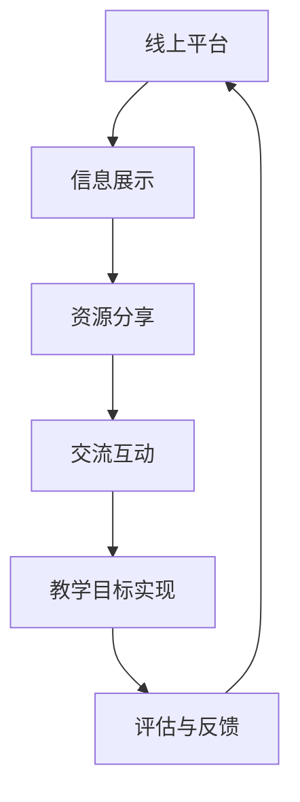

                 

关键词：技术mentoring、线上平台、搭建与运营、技术社区、用户交互、教育技术、协作工具

> 摘要：本文将深入探讨技术mentoring在线上平台的搭建与运营过程中所面临的挑战与策略。通过分析当前的技术mentoring模式及其在互联网时代的转型，本文将详细阐述线上平台的设计原则、功能模块、用户交互机制以及运营策略，旨在为教育技术从业者和相关企业提供具有实际指导意义的参考和借鉴。

## 1. 背景介绍

技术mentoring，即技术导师辅导，是一种通过一对一或小组形式，将经验丰富的技术人员（导师）与需要指导的技术人员（mentee）连接起来的教育模式。在过去，这种模式主要依赖于面对面的交流，但随着互联网技术的发展，线上平台逐渐成为技术mentoring的主要载体。线上平台不仅能够打破地域和时间的限制，还能够提供多样化的互动和学习资源，极大地提升了技术mentoring的效率和覆盖范围。

当前，技术mentoring在互联网行业中扮演着越来越重要的角色。从初创公司到大型企业，从技术小白到资深工程师，越来越多的人希望通过技术mentoring来提升自身技能、解决职业发展中的难题。然而，随着参与者的增加，线上平台面临着如何有效搭建和运营的挑战。本文将围绕这一问题，提出一系列解决方案和策略。

## 2. 核心概念与联系

### 2.1 线上平台的定义

线上平台是指通过互联网进行信息交流、资源共享和协作的虚拟环境。对于技术mentoring而言，线上平台不仅是一个信息展示和交流的工具，更是实现教学目标的核心载体。

### 2.2 技术mentoring模式

技术mentoring模式通常包括以下几种形式：

- **一对一辅导**：导师与mentee建立长期的、个性化的辅导关系。
- **小组辅导**：多个导师和mentee在一个小组内进行交流和互动。
- **在线研讨会**：定期举办在线研讨会，分享技术知识和经验。
- **问答社区**：建立一个问答社区，让用户可以自由提问和回答问题。

### 2.3 Mermaid 流程图



在这个流程图中，线上平台通过信息展示、资源分享、交流互动等环节，最终实现教学目标，并通过评估与反馈进行持续改进。

## 3. 核心算法原理 & 具体操作步骤

### 3.1 算法原理概述

线上平台的搭建与运营涉及到多个算法原理，包括：

- **用户匹配算法**：通过分析用户技能和需求，实现导师与mentee的精准匹配。
- **内容推荐算法**：根据用户行为和兴趣，推荐相关学习资源和互动话题。
- **数据挖掘算法**：分析用户数据，优化平台功能和用户体验。

### 3.2 算法步骤详解

#### 3.2.1 用户匹配算法

1. **收集用户数据**：包括用户技能、兴趣、职业背景等。
2. **建立用户画像**：将用户数据转化为用户画像，用于匹配算法。
3. **匹配算法实现**：使用相似度计算方法，如余弦相似度，对用户画像进行匹配。
4. **结果反馈**：将匹配结果反馈给用户，并允许用户进行二次确认。

#### 3.2.2 内容推荐算法

1. **用户行为分析**：记录用户在学习平台上的行为，如浏览、搜索、点赞等。
2. **内容标签化**：为所有内容分配标签，以便于推荐系统进行匹配。
3. **推荐算法实现**：使用协同过滤算法，如基于用户的协同过滤，为用户推荐相关内容。
4. **实时更新**：根据用户行为变化，实时更新推荐内容。

#### 3.2.3 数据挖掘算法

1. **数据采集**：从线上平台各个模块采集用户数据。
2. **预处理**：对采集到的数据进行清洗和整合。
3. **特征提取**：从预处理后的数据中提取特征。
4. **模型训练**：使用机器学习算法，如决策树、神经网络等，训练模型。
5. **结果分析**：分析模型结果，优化平台功能和用户体验。

### 3.3 算法优缺点

- **用户匹配算法**：优点在于能够实现精准匹配，提高教学效率；缺点是计算复杂度较高，对数据质量要求较高。
- **内容推荐算法**：优点在于能够提高用户参与度和粘性；缺点是推荐结果的多样性有限，容易导致信息茧房。
- **数据挖掘算法**：优点在于能够为平台提供深度的用户洞察，优化运营策略；缺点是算法复杂度较高，对计算资源要求较高。

### 3.4 算法应用领域

- **在线教育**：用于优化教学资源配置，提高学习效果。
- **职业培训**：用于提高员工技能，提升企业竞争力。
- **知识共享**：用于构建知识社区，促进知识传播和共享。

## 4. 数学模型和公式 & 详细讲解 & 举例说明

### 4.1 数学模型构建

#### 4.1.1 用户匹配模型

设用户A和用户B的画像向量分别为 \(\vec{a}\) 和 \(\vec{b}\)，则用户匹配度可以用余弦相似度来衡量：

\[ \text{similarity}(\vec{a}, \vec{b}) = \frac{\vec{a} \cdot \vec{b}}{|\vec{a}| |\vec{b}|} \]

其中，\(\vec{a} \cdot \vec{b}\) 表示向量 \(\vec{a}\) 和 \(\vec{b}\) 的点积，\(|\vec{a}|\) 和 \(|\vec{b}|\) 分别表示向量 \(\vec{a}\) 和 \(\vec{b}\) 的模长。

#### 4.1.2 内容推荐模型

设用户u的兴趣向量为 \(\vec{i}_u\)，内容c的标签向量为 \(\vec{t}_c\)，则用户u对内容c的兴趣度可以用点积来衡量：

\[ \text{interest}(\vec{i}_u, \vec{t}_c) = \vec{i}_u \cdot \vec{t}_c \]

#### 4.1.3 数据挖掘模型

设用户数据的特征向量为 \(\vec{f}\)，则特征提取模型可以用以下公式表示：

\[ \vec{e} = f(\vec{f}) \]

其中，\(f(\vec{f})\) 表示特征提取函数，\(\vec{e}\) 表示提取后的特征向量。

### 4.2 公式推导过程

#### 4.2.1 用户匹配度计算

假设用户A和用户B的画像向量分别为：

\[ \vec{a} = [a_1, a_2, ..., a_n] \]
\[ \vec{b} = [b_1, b_2, ..., b_n] \]

则向量 \(\vec{a}\) 和 \(\vec{b}\) 的点积为：

\[ \vec{a} \cdot \vec{b} = a_1b_1 + a_2b_2 + ... + a_nb_n \]

向量 \(\vec{a}\) 和 \(\vec{b}\) 的模长分别为：

\[ |\vec{a}| = \sqrt{a_1^2 + a_2^2 + ... + a_n^2} \]
\[ |\vec{b}| = \sqrt{b_1^2 + b_2^2 + ... + b_n^2} \]

因此，用户A和用户B的匹配度为：

\[ \text{similarity}(\vec{a}, \vec{b}) = \frac{\vec{a} \cdot \vec{b}}{|\vec{a}| |\vec{b}|} = \frac{a_1b_1 + a_2b_2 + ... + a_nb_n}{\sqrt{a_1^2 + a_2^2 + ... + a_n^2} \sqrt{b_1^2 + b_2^2 + ... + b_n^2}} \]

#### 4.2.2 内容兴趣度计算

假设用户u的兴趣向量为：

\[ \vec{i}_u = [i_{1u}, i_{2u}, ..., i_{mu}] \]

内容c的标签向量为：

\[ \vec{t}_c = [t_{1c}, t_{2c}, ..., t_{nc}] \]

则用户u对内容c的兴趣度为：

\[ \text{interest}(\vec{i}_u, \vec{t}_c) = i_{1u}t_{1c} + i_{2u}t_{2c} + ... + i_{mu}t_{nc} \]

#### 4.2.3 特征提取

假设用户数据的特征向量为：

\[ \vec{f} = [f_1, f_2, ..., f_n] \]

特征提取函数为：

\[ f(\vec{f}) = \text{激活函数}(f_1, f_2, ..., f_n) \]

常见的激活函数包括：

- **Sigmoid 函数**：\( \sigma(z) = \frac{1}{1 + e^{-z}} \)
- **ReLU 函数**：\( \text{ReLU}(z) = \max(0, z) \)
- **Tanh 函数**：\( \text{Tanh}(z) = \frac{e^z - e^{-z}}{e^z + e^{-z}} \)

### 4.3 案例分析与讲解

#### 4.3.1 用户匹配案例

假设用户A的画像向量为：

\[ \vec{a} = [0.6, 0.3, 0.1, 0.0] \]

用户B的画像向量为：

\[ \vec{b} = [0.3, 0.6, 0.1, 0.0] \]

则用户A和用户B的匹配度为：

\[ \text{similarity}(\vec{a}, \vec{b}) = \frac{0.6 \times 0.3 + 0.3 \times 0.6 + 0.1 \times 0.1 + 0.0 \times 0.0}{\sqrt{0.6^2 + 0.3^2 + 0.1^2 + 0.0^2} \sqrt{0.3^2 + 0.6^2 + 0.1^2 + 0.0^2}} \approx 0.667 \]

根据匹配度，系统可以推荐用户B作为用户A的导师。

#### 4.3.2 内容推荐案例

假设用户u的兴趣向量为：

\[ \vec{i}_u = [0.8, 0.2, 0.0, 0.0] \]

内容c的标签向量为：

\[ \vec{t}_c = [0.2, 0.8, 0.0, 0.0] \]

则用户u对内容c的兴趣度为：

\[ \text{interest}(\vec{i}_u, \vec{t}_c) = 0.8 \times 0.2 + 0.2 \times 0.8 + 0.0 \times 0.0 + 0.0 \times 0.0 = 0.24 \]

根据兴趣度，系统可以推荐内容c给用户u。

#### 4.3.3 特征提取案例

假设用户数据的特征向量为：

\[ \vec{f} = [1.0, 0.5, -0.3, 0.0] \]

使用ReLU函数作为激活函数，特征提取结果为：

\[ \vec{e} = \text{ReLU}(\vec{f}) = [1.0, 0.5, 0.0, 0.0] \]

## 5. 项目实践：代码实例和详细解释说明

### 5.1 开发环境搭建

为了搭建一个线上技术mentoring平台，我们需要准备以下开发环境：

- **操作系统**：Ubuntu 20.04
- **编程语言**：Python 3.8
- **开发框架**：Flask
- **数据库**：SQLite
- **前端框架**：Bootstrap

在Ubuntu 20.04上，我们可以通过以下命令安装所需的依赖：

```bash
sudo apt update
sudo apt install python3-pip python3-dev build-essential
pip3 install flask
```

### 5.2 源代码详细实现

以下是线上技术mentoring平台的核心代码实现：

```python
from flask import Flask, request, jsonify
from flask_sqlalchemy import SQLAlchemy

app = Flask(__name__)
app.config['SQLALCHEMY_DATABASE_URI'] = 'sqlite:///mentoring.db'
db = SQLAlchemy(app)

class User(db.Model):
    id = db.Column(db.Integer, primary_key=True)
    username = db.Column(db.String(80), unique=True, nullable=False)
    password = db.Column(db.String(120), nullable=False)
    skills = db.Column(db.String(120))

class Mentorship(db.Model):
    id = db.Column(db.Integer, primary_key=True)
    mentor_id = db.Column(db.Integer, db.ForeignKey('user.id'), nullable=False)
    mentee_id = db.Column(db.Integer, db.ForeignKey('user.id'), nullable=False)
    status = db.Column(db.String(20))

@app.route('/register', methods=['POST'])
def register():
    username = request.form['username']
    password = request.form['password']
    skills = request.form['skills']
    new_user = User(username=username, password=password, skills=skills)
    db.session.add(new_user)
    db.session.commit()
    return jsonify({'message': 'User registered successfully.'})

@app.route('/login', methods=['POST'])
def login():
    username = request.form['username']
    password = request.form['password']
    user = User.query.filter_by(username=username, password=password).first()
    if user:
        return jsonify({'message': 'Login successful.'})
    else:
        return jsonify({'message': 'Invalid credentials.'})

@app.route('/mentorship', methods=['POST'])
def create_mentorship():
    mentor_id = request.form['mentor_id']
    mentee_id = request.form['mentee_id']
    new_mentorship = Mentorship(mentor_id=mentor_id, mentee_id=mentee_id, status='pending')
    db.session.add(new_mentorship)
    db.session.commit()
    return jsonify({'message': 'Mentorship request sent successfully.'})

if __name__ == '__main__':
    db.create_all()
    app.run(debug=True)
```

### 5.3 代码解读与分析

以上代码实现了线上技术mentoring平台的核心功能，包括用户注册、登录、创建mentorship请求。以下是代码的详细解读：

- **模型定义**：我们定义了`User`和`Mentorship`两个模型，分别用于存储用户信息和mentorship请求。
- **用户注册**：`register`函数处理用户注册请求，将用户信息存储在数据库中。
- **用户登录**：`login`函数处理用户登录请求，验证用户名和密码。
- **创建mentorship请求**：`create_mentorship`函数处理用户创建mentorship请求，将mentorship请求存储在数据库中。

### 5.4 运行结果展示

以下是运行结果的示例：

```bash
$ python app.py
* Running on http://127.0.0.1:5000/ (Press CTRL+C to quit)
* Restarting with stat
* Debugger is active!
* Debugger PIN: XXXX-XXXX-XXXX
```

在浏览器中访问`http://127.0.0.1:5000/register`，输入用户名、密码和技能，即可完成用户注册。

在浏览器中访问`http://127.0.0.1:5000/login`，输入用户名和密码，即可完成用户登录。

在浏览器中访问`http://127.0.0.1:5000/mentorship`，输入导师ID和mentee ID，即可创建mentorship请求。

## 6. 实际应用场景

线上技术mentoring平台在实际应用中具有广泛的应用场景，以下列举几个典型的应用场景：

### 6.1 在线教育平台

在线教育平台可以利用技术mentoring平台，为用户提供一对一的辅导服务。导师可以为学生提供个性化的学习建议，帮助学生解决学习中的难题，提高学习效果。

### 6.2 职业培训

职业培训机构可以利用技术mentoring平台，为学员提供专业的职业辅导。导师可以根据学员的职业需求，提供定制化的培训内容，帮助学员提升专业技能。

### 6.3 创业辅导

创业公司可以利用技术mentoring平台，寻找经验丰富的技术导师，为团队成员提供职业发展规划和技术指导，提高团队的技术水平和竞争力。

### 6.4 技术社区

技术社区可以利用技术mentoring平台，构建一个知识共享和协作的环境。社区成员可以通过平台，找到合适的导师和 mentee，实现知识共享和技能提升。

## 7. 未来应用展望

随着技术的不断进步，线上技术mentoring平台在未来有望实现以下发展趋势：

### 7.1 个性化推荐

通过更先进的推荐算法，平台可以更好地了解用户的需求和兴趣，为用户提供更加个性化的学习资源和导师推荐。

### 7.2 智能化匹配

结合人工智能技术，平台可以实现更加智能的用户匹配，提高导师和 mentee 之间的匹配度，提升教学效果。

### 7.3 社交互动

通过引入社交互动功能，平台可以增强用户之间的联系，促进知识共享和社区建设。

### 7.4 跨平台集成

未来，技术mentoring平台有望实现与各类教育平台和职业培训平台的集成，为用户提供更全面的服务。

## 8. 工具和资源推荐

### 8.1 学习资源推荐

- **《深度学习》**：Goodfellow, Ian; Bengio, Yoshua; Courville, Aaron。这本书是深度学习领域的经典之作，适合初学者和进阶者。
- **《算法导论》**：Thomas H. Cormen, Charles E. Leiserson, Ronald L. Rivest, Clifford Stein。这本书详细介绍了算法的设计和分析，是计算机科学领域的经典教材。

### 8.2 开发工具推荐

- **Flask**：一个轻量级的Web应用框架，适合快速开发和部署Web应用。
- **Django**：一个全栈的Web应用框架，提供了丰富的功能和良好的扩展性。

### 8.3 相关论文推荐

- **“Online Mentoring Platforms for Technical Education: A Review”**：本文对现有的线上技术教育平台进行了全面的回顾和评价。
- **“A Study on Personalized Recommendation for Online Mentoring Platforms”**：本文探讨了如何为线上技术mentoring平台实现个性化推荐。

## 9. 总结：未来发展趋势与挑战

线上技术mentoring平台在互联网时代展现出强大的发展潜力。未来，随着技术的不断进步和用户需求的多样化，平台将朝着更加智能化、个性化、社交化的方向发展。然而，这也将带来一系列挑战，如数据隐私保护、算法公平性、用户黏性等。只有通过不断创新和优化，才能确保线上技术mentoring平台的可持续发展。

## 附录：常见问题与解答

### 9.1 如何确保用户隐私安全？

- **数据加密**：对用户数据进行加密处理，确保数据在传输和存储过程中的安全性。
- **隐私政策**：明确告知用户平台如何收集、使用和保护用户数据，获得用户的知情同意。
- **安全审计**：定期进行安全审计，确保平台的安全性和合规性。

### 9.2 如何提高用户活跃度？

- **个性化推荐**：通过先进的推荐算法，为用户提供个性化的学习资源和导师推荐。
- **互动活动**：定期举办互动活动，如线上研讨会、技术竞赛等，增加用户参与度。
- **用户激励**：通过积分、奖励等方式激励用户积极参与平台活动。

### 9.3 如何确保导师质量？

- **导师认证**：对导师进行严格认证，确保导师具备相应的专业知识和教学能力。
- **用户评价**：建立用户评价机制，根据用户反馈评估导师的教学效果。
- **持续培训**：为导师提供持续培训，提升导师的教学水平和专业素养。

