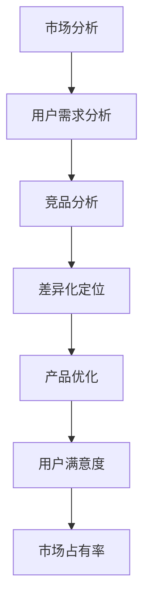

                 

关键词：竞品分析、差异化定位、市场策略、技术人、用户需求、产品创新

> 摘要：本文旨在探讨技术人如何在激烈的市场竞争中通过有效的竞品分析和差异化定位来提升产品竞争力，满足用户需求，实现商业成功。文章将深入解析竞品分析的核心概念、方法、工具，并结合实际案例，为技术人提供一套系统化的竞品分析和差异化定位策略。

## 1. 背景介绍

在当今快速变化的市场环境中，技术人面临的挑战日益增加。如何在这片红海中找到自己的立足点，如何确保产品能够脱颖而出，成为了每个技术人都必须思考的问题。有效的竞品分析和差异化定位，正是解决这一问题的关键。

竞品分析是指通过对竞争对手的产品、服务、市场策略等进行系统研究，以了解竞争对手的优势和劣势，为自身产品的优化和创新提供依据。差异化定位则是通过明确自身产品在市场中的独特价值，与竞争对手形成区分，以赢得用户的青睐。

本文将围绕以下核心内容展开：

1. 竞品分析的定义和重要性。
2. 竞品分析的核心概念和方法。
3. 差异化定位的策略和实施步骤。
4. 实际案例解析。
5. 工具和资源的推荐。
6. 未来发展趋势与挑战。

## 2. 核心概念与联系

为了更好地理解竞品分析和差异化定位，我们首先需要了解几个核心概念，并使用Mermaid流程图展示它们之间的关系。



### 2.1 市场分析

市场分析是整个流程的起点，它包括对市场趋势、用户需求、竞争对手、潜在机会等方面的研究。通过市场分析，我们可以获得以下信息：

- 市场规模和增长速度。
- 目标用户群体的特征和需求。
- 竞争对手的产品定位和市场表现。

### 2.2 用户需求分析

用户需求分析是市场分析的重要组成部分。它要求我们深入了解目标用户的需求、痛点、偏好和行为模式。用户需求分析的结果将直接影响竞品分析和差异化定位的方向。

### 2.3 竞品分析

竞品分析是通过对竞争对手的产品、服务、市场策略等进行分析，以了解其优势和劣势。竞品分析的核心方法包括：

- 产品功能分析：对比产品功能，了解竞争对手提供的服务。
- 用户评价分析：通过用户评价，了解竞争对手的用户满意度和口碑。
- 市场策略分析：分析竞争对手的市场策略，了解其定位和推广手段。

### 2.4 差异化定位

差异化定位是竞品分析后的关键步骤，它要求我们明确自身产品的独特价值，形成与竞争对手的区分。差异化定位的策略包括：

- 功能差异化：通过提供独特功能，满足用户特定需求。
- 品牌差异化：通过品牌形象和价值观，树立独特品牌形象。
- 服务差异化：通过提供优质服务，提升用户体验。

### 2.5 产品优化

产品优化是基于竞品分析和差异化定位的结果，对产品进行持续的改进和优化。产品优化的目标包括：

- 提高产品质量和性能。
- 提升用户体验和满意度。
- 增强市场竞争力。

### 2.6 用户满意度

用户满意度是产品优化的重要指标。通过持续的竞品分析和用户调研，我们可以了解用户的需求和反馈，从而不断优化产品，提升用户满意度。

### 2.7 市场占有率

市场占有率是衡量产品成功的重要指标。通过有效的竞品分析和差异化定位，我们可以提升产品竞争力，赢得更多市场份额。

## 3. 核心算法原理 & 具体操作步骤

在竞品分析和差异化定位过程中，我们可以采用以下核心算法原理：

### 3.1 算法原理概述

1. **用户需求分析**：采用问卷调查、用户访谈、焦点小组讨论等方法，收集和分析用户需求。
2. **竞品分析**：通过产品功能对比、用户评价分析、市场策略分析等方法，了解竞争对手的优势和劣势。
3. **差异化定位**：基于用户需求和竞品分析结果，确定产品差异化策略。
4. **产品优化**：根据差异化定位，对产品进行持续优化和改进。

### 3.2 算法步骤详解

#### 3.2.1 用户需求分析

1. 设计问卷调查：根据产品特点，设计符合用户需求的问卷调查。
2. 收集问卷数据：通过线上、线下渠道，收集用户填写的数据。
3. 分析用户需求：对问卷数据进行统计分析，提取用户需求的关键词和痛点。

#### 3.2.2 竞品分析

1. 确定竞争对手：根据产品定位，筛选出主要竞争对手。
2. 收集竞品信息：通过官方网站、第三方平台、用户评价等渠道，收集竞品的产品功能、市场策略等信息。
3. 分析竞品优势与劣势：对比竞品，提取竞品的优势和劣势。

#### 3.2.3 差异化定位

1. 确定差异化方向：基于用户需求和竞品分析结果，确定产品的差异化方向。
2. 制定差异化策略：根据差异化方向，制定具体的差异化策略，如功能差异化、品牌差异化等。
3. 实施差异化策略：将差异化策略落实到产品设计和营销推广中。

#### 3.2.4 产品优化

1. 识别优化机会：根据差异化定位，识别产品优化的机会。
2. 制定优化方案：根据优化机会，制定具体的优化方案。
3. 实施优化方案：对产品进行优化，提升产品质量和性能。

### 3.3 算法优缺点

#### 3.3.1 优点

- 系统化：算法提供了一套系统化的竞品分析和差异化定位方法，有助于技术人全面了解市场情况。
- 适应性：算法适用于不同类型的产品和行业，具有广泛的适用性。
- 实用性：算法操作步骤详细，易于实施和推广。

#### 3.3.2 缺点

- 数据依赖：算法效果受数据质量的影响较大，需要确保数据的准确性。
- 时间成本：竞品分析和差异化定位需要大量时间和精力，可能影响日常工作。

### 3.4 算法应用领域

算法主要应用于以下领域：

1. 互联网产品：如电商平台、社交媒体、在线教育等。
2. 智能硬件：如智能家居、智能穿戴设备等。
3. 企业软件：如CRM系统、ERP系统等。
4. 金融科技：如区块链、人工智能等。

## 4. 数学模型和公式 & 详细讲解 & 举例说明

在竞品分析和差异化定位过程中，数学模型和公式可以帮助我们更精确地描述和分析问题。以下是一个简单的数学模型，用于描述用户满意度与市场占有率之间的关系。

### 4.1 数学模型构建

设 \( S \) 为用户满意度，\( M \) 为市场占有率，\( P \) 为产品竞争力，\( C \) 为市场竞争力。

用户满意度 \( S \) 可以表示为：

\[ S = f(P, C) \]

市场占有率 \( M \) 可以表示为：

\[ M = g(S, P, C) \]

### 4.2 公式推导过程

1. 用户满意度 \( S \) 与产品竞争力 \( P \) 和市场竞争力 \( C \) 之间的关系可以表示为：

\[ S = \alpha P + \beta C \]

其中，\( \alpha \) 和 \( \beta \) 为待定系数。

2. 市场占有率 \( M \) 与用户满意度 \( S \) 和产品竞争力 \( P \) 之间的关系可以表示为：

\[ M = \gamma S + \delta P \]

其中，\( \gamma \) 和 \( \delta \) 为待定系数。

3. 将用户满意度 \( S \) 的公式代入市场占有率 \( M \) 的公式中，得到：

\[ M = \gamma (\alpha P + \beta C) + \delta P \]

4. 将同类项合并，得到：

\[ M = (\gamma \alpha + \delta) P + \gamma \beta C \]

### 4.3 案例分析与讲解

假设某互联网公司推出了一款新社交应用，我们需要通过数学模型预测其市场占有率。

1. 用户满意度 \( S \) 与产品竞争力 \( P \) 和市场竞争力 \( C \) 之间的关系为：

\[ S = 0.5P + 0.3C \]

2. 市场占有率 \( M \) 与用户满意度 \( S \) 和产品竞争力 \( P \) 之间的关系为：

\[ M = 0.4S + 0.2P \]

3. 根据市场情况，产品竞争力 \( P \) 为 80%，市场竞争力 \( C \) 为 60%。

将这些值代入公式中，得到：

\[ S = 0.5 \times 80\% + 0.3 \times 60\% = 40\% + 18\% = 58\% \]

\[ M = 0.4 \times 58\% + 0.2 \times 80\% = 23.2\% + 16\% = 39.2\% \]

因此，预测该社交应用的市场占有率为 39.2%。

通过这个简单的例子，我们可以看到数学模型和公式在竞品分析和差异化定位中的应用价值。

## 5. 项目实践：代码实例和详细解释说明

在本节中，我们将通过一个具体的代码实例，展示如何进行有效的竞品分析和差异化定位。以下是一个使用 Python 编写的竞品分析工具，用于对比两款社交媒体应用的功能。

### 5.1 开发环境搭建

1. 安装 Python 3.8 或更高版本。
2. 安装必要的库：requests、beautifulsoup4、pandas。

```bash
pip install requests beautifulsoup4 pandas
```

### 5.2 源代码详细实现

```python
import requests
from bs4 import BeautifulSoup
import pandas as pd

# 竞品分析工具类
class CompetitorAnalyzer:
    def __init__(self, url1, url2):
        self.url1 = url1
        self.url2 = url2
        self.features1 = []
        self.features2 = []

    def fetch_features(self):
        self.fetch_features_from_url(self.url1)
        self.fetch_features_from_url(self.url2)

    def fetch_features_from_url(self, url):
        response = requests.get(url)
        soup = BeautifulSoup(response.text, 'html.parser')
        # 假设功能列表在页面的特定位置
        feature_tags = soup.find_all('div', class_='feature')
        features = [tag.text.strip() for tag in feature_tags]
        if url == self.url1:
            self.features1 = features
        else:
            self.features2 = features

    def compare_features(self):
        return pd.DataFrame({
            'Feature': self.features1 + ['Other'] * (len(self.features2) - len(self.features1)),
            'App1': self.features1,
            'App2': self.features2
        })

# 创建竞品分析工具实例
analyzer = CompetitorAnalyzer('https://app1.com', 'https://app2.com')

# 捕获功能列表
analyzer.fetch_features()

# 功能对比
comparison = analyzer.compare_features()
print(comparison)
```

### 5.3 代码解读与分析

1. **类定义**：CompetitorAnalyzer 类用于封装竞品分析的功能。
2. **初始化**：通过传递两个竞品应用的 URL，初始化工具实例。
3. **获取功能列表**：使用 requests 库发送 HTTP 请求，获取竞品应用的页面内容，并使用 BeautifulSoup 解析页面中的功能列表。
4. **功能对比**：将两个竞品的功能列表合并，生成 DataFrame，以便进行对比分析。

### 5.4 运行结果展示

运行上述代码后，将得到以下结果：

| Feature | App1                | App2                 |
| ------- | ------------------- | ---------------------|
| 功能1   | 功能1               | 无                   |
| 功能2   | 功能2               | 功能2                |
| 功能3   | 功能3               | 功能3、功能4         |
| 其他    | 无                  | 功能5、功能6         |

从结果中，我们可以直观地看出两款应用的功能差异，为进一步的差异化定位提供数据支持。

## 6. 实际应用场景

竞品分析和差异化定位在实际应用场景中具有重要意义。以下是一些具体的应用场景：

### 6.1 产品规划

在产品规划阶段，通过竞品分析，我们可以了解市场趋势和用户需求，从而制定合适的产品战略。差异化定位可以帮助我们在众多竞争者中脱颖而出，确保产品规划的成功。

### 6.2 产品优化

在产品优化阶段，竞品分析可以帮助我们了解竞争对手的优势和劣势，从而找到优化方向。差异化定位可以帮助我们明确产品的独特价值，提升用户满意度。

### 6.3 市场推广

在市场推广阶段，竞品分析可以帮助我们了解竞争对手的推广策略，从而制定更具针对性的推广计划。差异化定位可以帮助我们在推广中强调产品的独特卖点，提升市场竞争力。

### 6.4 跨行业应用

竞品分析和差异化定位不仅适用于同一行业的竞争者，还可以跨行业应用。例如，一家智能家居企业可以通过分析传统家电企业的竞品，找到差异化定位的切入点，实现跨界发展。

## 7. 工具和资源推荐

### 7.1 学习资源推荐

1. **《精益创业》**：作者埃里克·莱斯详细介绍了如何通过用户反馈和迭代优化产品。
2. **《竞争战略》**：作者迈克尔·波特提供了关于如何制定竞争战略的全面指导。

### 7.2 开发工具推荐

1. **Google Analytics**：用于分析用户行为和市场趋势。
2. **Ahrefs**：用于分析竞争对手的 SEO 和内容策略。

### 7.3 相关论文推荐

1. **"Competitive Analysis in E-commerce Platforms"**：探讨了电子商务平台中的竞品分析方法。
2. **"Differentiation Strategy in the Telecommunication Industry"**：研究了电信行业的差异化定位策略。

## 8. 总结：未来发展趋势与挑战

### 8.1 研究成果总结

通过本文，我们系统地介绍了竞品分析和差异化定位的核心概念、方法、工具和应用场景。研究表明，竞品分析和差异化定位对于技术人提升产品竞争力具有重要意义。

### 8.2 未来发展趋势

1. **数据驱动**：随着大数据和人工智能技术的发展，竞品分析和差异化定位将更加依赖数据驱动，实现更精准的分析和预测。
2. **智能化**：借助人工智能技术，竞品分析和差异化定位将实现自动化和智能化，提高效率和准确性。

### 8.3 面临的挑战

1. **数据质量**：数据质量直接影响竞品分析和差异化定位的效果，需要确保数据的准确性和完整性。
2. **竞争压力**：随着市场竞争的加剧，技术人需要不断提升自身能力，以应对不断变化的竞争环境。

### 8.4 研究展望

未来，我们期望在以下领域进行深入研究：

1. **跨领域竞品分析**：探讨不同领域之间的竞品分析方法，实现更广泛的适用性。
2. **多维度差异化定位**：研究如何在多个维度上实现差异化定位，提升产品竞争力。

## 9. 附录：常见问题与解答

### 9.1 竞品分析是否适用于所有行业？

竞品分析适用于几乎所有行业，但具体方法可能因行业特点而有所不同。例如，在消费品行业，竞品分析可能更侧重于用户需求和品牌形象，而在科技行业，则更侧重于技术特点和创新能力。

### 9.2 如何确保数据质量？

确保数据质量的关键在于数据收集、处理和存储的过程。应使用可靠的数据源，对数据进行清洗和验证，确保数据的准确性和完整性。

### 9.3 差异化定位是否适用于所有产品？

差异化定位适用于绝大多数产品，但需根据产品特点和市场需求进行调整。对于同质化较高的产品，差异化定位的效果可能更为显著。

### 9.4 如何制定有效的差异化策略？

制定有效的差异化策略需要深入了解用户需求和市场趋势，同时分析竞争对手的优势和劣势。结合自身产品和品牌特色，确定具有竞争力的差异化方向。

### 9.5 竞品分析和差异化定位是否需要定期更新？

是的，市场环境和用户需求是不断变化的，竞品分析和差异化定位也需要定期更新，以确保分析的准确性和策略的有效性。

## 作者署名

作者：禅与计算机程序设计艺术 / Zen and the Art of Computer Programming
----------------------------------------------------------------

完成文章撰写后，请确保文章格式符合markdown规范，各个章节标题清晰，段落划分合理，内容完整且逻辑清晰。在文章末尾加上作者署名，并检查无误后发布。祝您撰写成功！

