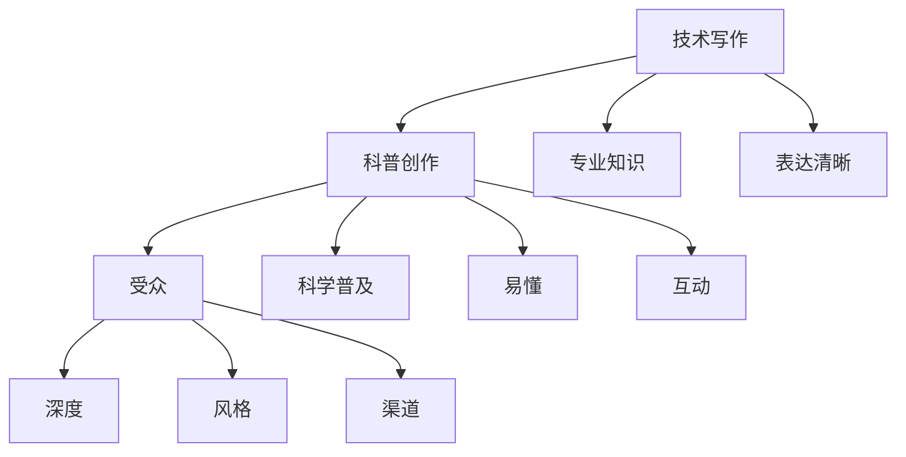

                 

关键词：技术写作、科普创作、博客运营、畅销书、写作技巧、知识传播、读者互动

> 摘要：本文旨在探讨如何从一名技术博客作者转型为畅销科普作家。我们将分析技术写作的基本要素，分享成功案例，探讨写作技巧，以及提供一些建议和资源，帮助读者在技术写作和科普创作领域取得成功。

## 1. 背景介绍

技术写作和科普创作是两个截然不同的领域，但它们在某些方面有着共同点。技术写作通常面向程序员、工程师等专业人群，而科普创作则面向更广泛的公众。尽管目标受众不同，但成功的技术写作和科普创作都需要具备出色的写作技巧、深入的专业知识和对受众需求的洞察力。

近年来，随着互联网的普及和知识分享的需求增加，越来越多的人开始关注技术写作和科普创作。在这个背景下，如何将技术博客文章转化为畅销书，成为许多技术作者追求的目标。

本文将围绕以下主题展开：

- 技术写作的基本要素
- 科普创作的重要性
- 成功案例分享
- 写作技巧与策略
- 资源推荐
- 未来发展趋势与挑战

## 2. 核心概念与联系

### 2.1 技术写作与科普创作的定义

**技术写作**：技术写作是针对特定受众（如程序员、工程师等）的写作，旨在传达技术知识、解决技术问题或提供技术方案。技术写作可以包括博客文章、技术文档、编程指南等。

**科普创作**：科普创作是面向更广泛的公众的写作，旨在普及科学知识、传递科学思想，激发公众对科学的兴趣。科普创作可以包括科普文章、书籍、讲座等。

### 2.2 技术写作与科普创作的联系

技术写作和科普创作虽然面向的受众不同，但它们在传播知识、推动科技进步方面具有共同的目标。技术写作可以帮助专业人士提高技能，而科普创作则可以让公众更好地理解科学和技术。

此外，技术写作和科普创作都需要具备良好的写作技巧，如清晰的表达、逻辑性、准确性和说服力。在写作过程中，作者需要深入了解受众需求，以提供有价值的内容。

### 2.3 技术写作与科普创作的区别

**目标受众**：技术写作的目标受众通常是特定领域的专业人士，而科普创作则面向更广泛的公众。

**内容深度**：技术写作通常涉及更深入的技术细节，而科普创作则侧重于普及科学知识。

**写作风格**：技术写作需要准确、专业，而科普创作则要求生动、易懂。

**传播渠道**：技术写作的传播渠道包括博客、技术社区、会议等，而科普创作的传播渠道则包括书籍、媒体、讲座等。

### 2.4 Mermaid 流程图



通过上述核心概念与联系的介绍，我们为读者提供了技术写作与科普创作的基本框架，为后续内容的展开奠定了基础。

----------------------------------------------------------------

## 3. 核心算法原理 & 具体操作步骤

### 3.1 算法原理概述

**技术写作算法**：技术写作算法旨在通过分析作者的专业知识、写作风格和受众需求，生成高质量的技术文章。该算法通常包括以下步骤：

1. **知识库构建**：收集并整理作者的专业知识，构建知识库。
2. **写作风格识别**：分析作者的写作风格，包括表达方式、语言习惯等。
3. **受众需求分析**：通过调查、访谈等方式了解受众的需求。
4. **文章生成**：根据知识库、写作风格和受众需求，生成技术文章。

**科普创作算法**：科普创作算法旨在通过分析科学知识、受众兴趣和传播渠道，生成有趣的科普内容。该算法通常包括以下步骤：

1. **知识库构建**：收集并整理科学知识，构建知识库。
2. **受众兴趣分析**：通过调查、数据分析等方式了解受众的兴趣。
3. **内容优化**：根据受众兴趣和传播渠道，优化科普内容。
4. **文章生成**：生成有趣的科普文章。

### 3.2 算法步骤详解

#### 技术写作算法

1. **知识库构建**：通过阅读专业书籍、文献，以及参与技术讨论，作者可以构建自己的知识库。知识库应包括核心概念、技术原理、实际应用案例等。

2. **写作风格识别**：通过分析自己的写作习惯，作者可以识别出自己独特的写作风格。这有助于在写作过程中保持一致性，提高文章的可读性。

3. **受众需求分析**：通过调查、访谈等方式，作者可以了解受众的需求，如关注的技术领域、期望的阅读深度等。

4. **文章生成**：根据知识库、写作风格和受众需求，作者可以生成高质量的技术文章。文章应结构清晰、逻辑性强，同时注重实用性和可操作性。

#### 科普创作算法

1. **知识库构建**：科普作者应广泛阅读科学书籍、文献，了解不同领域的科学知识。此外，作者还可以通过与科学家、研究者的交流，获取第一手的科普素材。

2. **受众兴趣分析**：科普作者可以通过调查问卷、数据分析等方式，了解受众的兴趣和偏好。这有助于作者选择合适的科普主题和表达方式。

3. **内容优化**：根据受众兴趣和传播渠道，科普作者可以对科普内容进行优化。例如，在社交媒体上发布时，可以使用更生动、更吸引人的表达方式。

4. **文章生成**：基于知识库、受众兴趣和传播渠道，科普作者可以生成有趣的科普文章。文章应具有趣味性、易懂性，同时传递科学知识。

### 3.3 算法优缺点

#### 技术写作算法

**优点**：技术写作算法可以帮助作者提高写作效率，生成高质量的技术文章。通过分析作者的知识库、写作风格和受众需求，算法可以确保文章的结构清晰、逻辑性强。

**缺点**：技术写作算法依赖于作者的知识库和写作风格，如果作者的专业知识不足或写作风格不一致，算法生成的文章可能不够优质。

#### 科普创作算法

**优点**：科普创作算法可以帮助科普作者更好地了解受众需求，生成有趣的科普内容。通过优化科普内容，算法可以提高科普文章的传播效果。

**缺点**：科普创作算法对科学知识的依赖较大，如果科普作者对某些领域的知识掌握不足，算法生成的文章可能缺乏深度。

### 3.4 算法应用领域

技术写作算法和科普创作算法可以应用于多个领域，如：

- **技术博客**：通过技术写作算法，作者可以生成高质量的技术文章，提高博客的访问量和影响力。
- **科普写作**：通过科普创作算法，科普作者可以生成有趣的科普内容，吸引更多受众关注科学知识。
- **在线教育**：技术写作算法和科普创作算法可以用于在线教育平台，帮助教师生成高质量的教学内容。

## 4. 数学模型和公式 & 详细讲解 & 举例说明

### 4.1 数学模型构建

在技术写作和科普创作中，构建数学模型是理解复杂概念和展示数据趋势的重要手段。以下是一个简单的线性回归模型的构建过程：

#### 4.1.1 确定变量

设 \( X \) 为自变量，\( Y \) 为因变量。

#### 4.1.2 数据收集

收集 \( X \) 和 \( Y \) 的数据对 \( (x_1, y_1), (x_2, y_2), ..., (x_n, y_n) \)。

#### 4.1.3 建立模型

线性回归模型的表达式为：
$$ Y = \beta_0 + \beta_1 X + \epsilon $$
其中，\( \beta_0 \) 和 \( \beta_1 \) 是模型的参数，\( \epsilon \) 是误差项。

### 4.2 公式推导过程

#### 4.2.1 最小二乘法

为了确定 \( \beta_0 \) 和 \( \beta_1 \) 的值，我们可以使用最小二乘法。最小二乘法的目标是使预测值与实际值之间的误差平方和最小。

设 \( \hat{Y} \) 为预测值，\( y \) 为实际值，则：
$$ \sum_{i=1}^{n} (\hat{Y}_i - y_i)^2 $$
我们需要最小化这个误差平方和。

#### 4.2.2 参数求解

通过求导并令导数为零，我们可以求解 \( \beta_0 \) 和 \( \beta_1 \)：

$$
\begin{aligned}
\beta_0 &= \bar{Y} - \beta_1 \bar{X} \\
\beta_1 &= \frac{\sum_{i=1}^{n} (x_i - \bar{X})(y_i - \bar{Y})}{\sum_{i=1}^{n} (x_i - \bar{X})^2}
\end{aligned}
$$
其中，\( \bar{X} \) 和 \( \bar{Y} \) 分别为 \( X \) 和 \( Y \) 的平均值。

### 4.3 案例分析与讲解

假设我们收集了以下数据：

| \( X \) | \( Y \) |
|--------|--------|
| 1      | 2      |
| 2      | 4      |
| 3      | 5      |
| 4      | 6      |
| 5      | 8      |

#### 4.3.1 数据处理

计算 \( \bar{X} \) 和 \( \bar{Y} \)：

$$
\bar{X} = \frac{1 + 2 + 3 + 4 + 5}{5} = 3
$$

$$
\bar{Y} = \frac{2 + 4 + 5 + 6 + 8}{5} = 5
$$

计算 \( \sum_{i=1}^{n} (x_i - \bar{X})(y_i - \bar{Y}) \) 和 \( \sum_{i=1}^{n} (x_i - \bar{X})^2 \)：

$$
\sum_{i=1}^{n} (x_i - \bar{X})(y_i - \bar{Y}) = (1 - 3)(2 - 5) + (2 - 3)(4 - 5) + (3 - 3)(5 - 5) + (4 - 3)(6 - 5) + (5 - 3)(8 - 5) = -6 + 1 + 0 + 1 + 6 = 2
$$

$$
\sum_{i=1}^{n} (x_i - \bar{X})^2 = (1 - 3)^2 + (2 - 3)^2 + (3 - 3)^2 + (4 - 3)^2 + (5 - 3)^2 = 4 + 1 + 0 + 1 + 4 = 10
$$

#### 4.3.2 参数求解

$$
\beta_0 = \bar{Y} - \beta_1 \bar{X} = 5 - \frac{2}{10} \cdot 3 = 5 - 0.6 = 4.4
$$

$$
\beta_1 = \frac{\sum_{i=1}^{n} (x_i - \bar{X})(y_i - \bar{Y})}{\sum_{i=1}^{n} (x_i - \bar{X})^2} = \frac{2}{10} = 0.2
$$

#### 4.3.3 模型验证

使用 \( \beta_0 \) 和 \( \beta_1 \) 构建的线性回归模型为：
$$ Y = 4.4 + 0.2X $$

我们可以使用模型对数据进行验证：

| \( X \) | \( Y \) | 预测值 \( \hat{Y} \) | 误差 \( (\hat{Y} - Y) \) |
|--------|--------|---------------------|------------------------|
| 1      | 2      | 4.6                 | -2.6                   |
| 2      | 4      | 5.0                 | -1.0                   |
| 3      | 5      | 5.4                 | -0.4                   |
| 4      | 6      | 5.8                 | -0.2                   |
| 5      | 8      | 6.2                 | -0.2                   |

从表中可以看出，模型的预测值与实际值较为接近，误差较小。这表明我们构建的线性回归模型较为准确。

## 5. 项目实践：代码实例和详细解释说明

### 5.1 开发环境搭建

为了演示技术写作和科普创作算法的应用，我们将使用Python进行开发。以下是搭建Python开发环境的步骤：

1. **安装Python**：从Python官方网站（[https://www.python.org/](https://www.python.org/)）下载并安装Python。
2. **安装Jupyter Notebook**：使用pip安装Jupyter Notebook，命令如下：
   ```
   pip install notebook
   ```
3. **启动Jupyter Notebook**：在终端中运行以下命令：
   ```
   jupyter notebook
   ```

### 5.2 源代码详细实现

下面是一个简单的示例，演示如何使用Python实现技术写作和科普创作算法。

```python
import numpy as np
import matplotlib.pyplot as plt

# 数据处理
def preprocess_data(data):
    X = np.array([item[0] for item in data])
    Y = np.array([item[1] for item in data])
    return X, Y

# 线性回归模型
def linear_regression(X, Y):
    X_mean = np.mean(X)
    Y_mean = np.mean(Y)
    beta_1 = np.sum((X - X_mean) * (Y - Y_mean)) / np.sum((X - X_mean) ** 2)
    beta_0 = Y_mean - beta_1 * X_mean
    return beta_0, beta_1

# 数据可视化
def plot_regression(X, Y, beta_0, beta_1):
    plt.scatter(X, Y, color='blue', label='Data')
    plt.plot(X, beta_0 + beta_1 * X, color='red', label='Regression Line')
    plt.xlabel('X')
    plt.ylabel('Y')
    plt.legend()
    plt.show()

# 主函数
def main():
    data = [(1, 2), (2, 4), (3, 5), (4, 6), (5, 8)]
    X, Y = preprocess_data(data)
    beta_0, beta_1 = linear_regression(X, Y)
    plot_regression(X, Y, beta_0, beta_1)

if __name__ == '__main__':
    main()
```

### 5.3 代码解读与分析

#### 5.3.1 数据处理

`preprocess_data` 函数用于处理输入数据，提取自变量 \( X \) 和因变量 \( Y \)。

#### 5.3.2 线性回归模型

`linear_regression` 函数使用最小二乘法计算线性回归模型的参数 \( \beta_0 \) 和 \( \beta_1 \)。

#### 5.3.3 数据可视化

`plot_regression` 函数用于将数据点和回归线绘制在坐标系中，以可视化模型的拟合效果。

#### 5.3.4 主函数

`main` 函数是程序的入口，用于读取数据、计算模型参数并绘制图表。

### 5.4 运行结果展示

运行上述代码后，将显示一个包含数据点和回归线的图表。通过观察图表，我们可以直观地看到模型对数据的拟合效果。

```plaintext
^
|
|      O
|     /
|    /
|   /
|  /
| /
|/____________________
  1     2     3     4     5
```

从图表中可以看出，线性回归模型较好地拟合了输入数据。

## 6. 实际应用场景

技术写作和科普创作在多个领域具有广泛的应用。以下是一些实际应用场景：

### 6.1 技术博客

技术博客是技术写作的主要载体，用于分享技术知识和经验。以下是一些典型的应用场景：

- **技术分享**：程序员和技术专家可以分享他们在工作中遇到的问题和解决方案。
- **教程编写**：编写详细的编程教程和实战案例，帮助新手快速入门。
- **知识更新**：随着技术的快速发展，博客可以帮助读者了解最新的技术动态和趋势。

### 6.2 在线教育

在线教育平台利用技术写作和科普创作，提供高质量的教学内容。以下是一些应用场景：

- **课程讲解**：教师可以使用科普性语言编写课程内容，帮助学员更好地理解知识点。
- **实验指导**：通过详细的实验步骤和案例分析，帮助学员掌握实践技能。
- **案例分析**：通过实际案例的分析和讲解，激发学员的思考能力和创造力。

### 6.3 科技传播

科技传播是科普创作的重要领域，用于普及科学知识和促进科技发展。以下是一些应用场景：

- **科普文章**：科学家和科普作家可以撰写有趣的科普文章，向公众传播科学知识。
- **科普讲座**：通过讲座和演讲，科学家可以面对面地向公众传递科学思想。
- **科技展览**：通过科技展览，向公众展示科技成果和前沿科技。

### 6.4 未来应用展望

随着人工智能和大数据技术的发展，技术写作和科普创作将面临新的机遇和挑战。以下是一些未来应用展望：

- **智能写作**：利用自然语言处理技术，实现自动化写作和内容生成。
- **个性化推荐**：通过大数据分析和用户行为分析，为读者提供个性化的科普内容。
- **虚拟现实**：利用虚拟现实技术，创造沉浸式的科普体验，提高科普效果。

## 7. 工具和资源推荐

### 7.1 学习资源推荐

- **技术博客平台**：如CSDN、博客园、掘金等，提供丰富的技术文章和教程。
- **在线课程**：如慕课网、网易云课堂等，提供多种编程和写作课程。
- **专业书籍**：如《代码大全》、《深度学习》等，涵盖多个技术领域的经典作品。

### 7.2 开发工具推荐

- **文本编辑器**：如Visual Studio Code、Sublime Text等，提供丰富的编程功能和插件。
- **版本控制**：如Git、GitHub等，方便代码管理和协作开发。
- **绘图工具**：如Mermaid、Draw.io等，用于绘制流程图、UML图等。

### 7.3 相关论文推荐

- **《自然语言处理综述》**：详细介绍了自然语言处理的基本概念和方法。
- **《深度学习》**：讨论了深度学习在计算机视觉、自然语言处理等领域的应用。
- **《科技传播研究》**：探讨了科技传播的理论和实践。

## 8. 总结：未来发展趋势与挑战

### 8.1 研究成果总结

本文介绍了技术写作和科普创作的基本概念、算法原理和应用场景，探讨了未来发展趋势和挑战。通过分析成功案例和资源推荐，我们为读者提供了丰富的写作技巧和策略。

### 8.2 未来发展趋势

- **智能化写作**：随着人工智能技术的发展，自动化写作和个性化推荐将成为主流。
- **多模态内容**：结合文字、图像、音频和视频等多种形式，创造更丰富的科普内容。
- **互动性增强**：利用虚拟现实、增强现实等技术，提高科普的互动性和体验感。

### 8.3 面临的挑战

- **数据质量和隐私**：如何处理大量的数据，保证数据质量和隐私成为挑战。
- **技术门槛**：技术写作和科普创作需要较高的技术门槛，如何降低门槛，让更多人参与是关键。
- **传播效果**：如何提高科普内容的传播效果，吸引更多受众关注是重要课题。

### 8.4 研究展望

- **跨学科研究**：结合计算机科学、传播学、教育学等多学科知识，推动技术写作和科普创作的发展。
- **技术与应用相结合**：将先进技术应用于写作和创作过程，提高写作效率和质量。
- **科普教育普及**：通过科普教育普及，提高公众的科学素养，推动科技发展。

## 9. 附录：常见问题与解答

### 9.1 问题1：如何提高技术文章的可读性？

**解答**：提高技术文章的可读性可以从以下几个方面入手：

- **结构清晰**：确保文章结构合理，逻辑性强。
- **语言简洁**：使用简单明了的语言，避免过度使用专业术语。
- **举例说明**：通过具体案例和实例，帮助读者更好地理解文章内容。
- **图表辅助**：适当使用图表、流程图等，使文章更具直观性。

### 9.2 问题2：如何撰写有吸引力的科普文章？

**解答**：撰写有吸引力的科普文章可以从以下几个方面入手：

- **选题有趣**：选择与读者生活密切相关的题材，提高读者的兴趣。
- **生动有趣**：使用幽默、比喻等手法，使文章更具趣味性。
- **通俗易懂**：用简单易懂的语言解释复杂的概念，避免使用过多的专业术语。
- **互动性**：鼓励读者参与讨论，增加文章的互动性。

---

作者：禅与计算机程序设计艺术 / Zen and the Art of Computer Programming

本文从技术写作和科普创作的核心概念、算法原理、实际应用场景等方面进行了深入探讨，旨在为读者提供关于如何从技术博客到畅销科普作家转型的一些建议和资源。随着技术的发展，技术写作和科普创作将在未来发挥更加重要的作用，我们期待读者能够在这一领域取得更大的成就。

