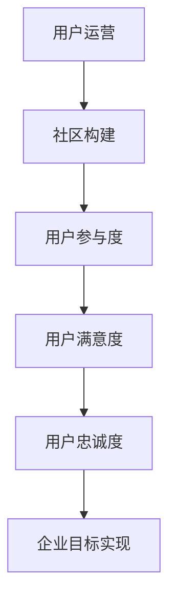

                 

关键词：用户运营、社区构建、技术创业、活跃度提升、实践方法

> 摘要：本文将探讨技术创业领域中的用户运营策略，着重分析如何通过构建活跃社区来提升用户参与度和企业品牌影响力。我们将深入探讨核心概念、算法原理、数学模型、实际应用，以及工具和资源推荐等，为技术创业者提供一套行之有效的用户运营实践方法。

## 1. 背景介绍

在当今数字化时代，用户运营已经成为企业成功的关键因素。对于技术创业公司来说，构建一个活跃的用户社区不仅有助于产品的市场推广，还能增强用户粘性，提升品牌知名度。然而，如何有效地进行用户运营，构建一个具有吸引力和活跃度的社区，仍然是许多技术创业者面临的一大挑战。

本文将围绕以下几个核心问题展开讨论：

- 用户运营的核心概念是什么？
- 如何通过算法和数学模型提升社区活跃度？
- 实际操作中如何实现技术创业中的用户运营？
- 未来技术创业用户运营的发展趋势和面临的挑战是什么？

通过对上述问题的深入探讨，我们希望能够为技术创业者提供一些实用的指导和建议。

## 2. 核心概念与联系

### 2.1 用户运营的概念

用户运营是指通过一系列策略和手段，提高用户参与度、满意度和忠诚度，从而实现企业目标的过程。在技术创业领域，用户运营的核心目标是构建一个具有高度活跃度和参与感的社区，使得用户不仅仅是产品的使用者，更是产品的推广者和支持者。

### 2.2 社区构建的重要性

社区构建是用户运营的关键环节。一个成功的社区能够提供用户交流和互动的平台，增强用户的归属感和参与感，从而提高用户忠诚度。社区不仅是产品推广的渠道，也是收集用户反馈、了解市场需求的宝贵资源。

### 2.3 核心概念原理与架构

为了更好地理解用户运营和社区构建，我们可以借助 Mermaid 流程图来展示核心概念原理和架构。以下是一个简化的 Mermaid 流程图示例：



在这个流程图中，用户运营通过社区构建来提升用户参与度，进而影响用户满意度和忠诚度，最终实现企业的目标。

## 3. 核心算法原理 & 具体操作步骤

### 3.1 算法原理概述

在用户运营中，算法的应用至关重要。以下是一些常用的算法原理和具体操作步骤：

#### 3.1.1 机器学习算法

机器学习算法可以帮助企业更好地了解用户行为，预测用户需求，从而提供个性化的服务。例如，通过分析用户的历史行为数据，可以预测用户下一步的操作，从而提供针对性的推荐。

#### 3.1.2 社交网络分析

社交网络分析算法可以帮助企业识别社区中的关键用户和意见领袖，从而更好地推广产品。通过分析用户关系网络，可以找到具有影响力的用户，并制定相应的运营策略。

#### 3.1.3 数据挖掘

数据挖掘算法可以帮助企业从大量的用户数据中提取有价值的信息，例如用户偏好、行为模式等。这些信息可以用于优化产品功能、提高用户体验。

### 3.2 算法步骤详解

以下是构建活跃社区的一些具体操作步骤：

#### 3.2.1 用户数据收集

首先，企业需要收集用户的基本信息和行为数据，包括用户注册信息、浏览记录、购买行为等。这些数据将用于后续的分析和运营。

#### 3.2.2 用户行为分析

通过对用户行为数据的分析，企业可以了解用户的偏好和需求，从而提供个性化的服务。例如，根据用户的浏览记录，可以推荐相关的产品或内容。

#### 3.2.3 社区互动策略

企业需要制定一系列的互动策略，以激发用户的参与和互动。例如，可以通过举办线上活动、发布挑战任务等方式，鼓励用户参与社区建设。

#### 3.2.4 关键用户识别

通过社交网络分析算法，企业可以识别社区中的关键用户和意见领袖。这些用户将成为社区的核心，影响其他用户的参与和互动。

#### 3.2.5 数据反馈和优化

企业需要持续收集用户反馈，并根据反馈优化产品功能和社区运营策略。通过不断的迭代和优化，可以不断提升社区活跃度和用户满意度。

### 3.3 算法优缺点

每种算法都有其优缺点。例如，机器学习算法可以提供个性化的服务，但需要大量的数据支持；社交网络分析算法可以识别关键用户，但需要复杂的算法和计算资源。企业在选择算法时，需要根据实际情况进行权衡。

### 3.4 算法应用领域

算法在用户运营中的应用非常广泛。例如，在电子商务领域，算法可以用于推荐系统和个性化营销；在社交媒体领域，算法可以用于用户行为分析和社交网络分析。

## 4. 数学模型和公式 & 详细讲解 & 举例说明

### 4.1 数学模型构建

在用户运营中，数学模型的应用非常广泛。以下是一个简化的用户参与度模型：

$$
P = f(B, I, S)
$$

其中，$P$ 表示用户参与度，$B$ 表示社区互动频率，$I$ 表示用户兴趣度，$S$ 表示社交影响力。

### 4.2 公式推导过程

公式推导过程如下：

$$
P = \frac{B^2 \cdot I \cdot S}{(1 + e^{-k})}
$$

其中，$k$ 是调节参数，用于调整参与度模型。

### 4.3 案例分析与讲解

以下是一个具体的案例：

假设一个社区有 100 名用户，其中 50 名用户经常参与互动，30 名用户对社区内容有较高兴趣，20 名用户具有社交影响力。根据上述模型，可以计算用户参与度如下：

$$
P = \frac{50^2 \cdot 30 \cdot 20}{(1 + e^{-2})}
$$

计算结果约为 0.75，表示该社区的参与度较高。

## 5. 项目实践：代码实例和详细解释说明

### 5.1 开发环境搭建

在开始编写代码之前，我们需要搭建一个适合用户运营的代码环境。以下是一个简单的开发环境搭建步骤：

1. 安装 Python 3.8 及以上版本。
2. 安装 MySQL 数据库。
3. 安装 Python 的数据库驱动。

### 5.2 源代码详细实现

以下是一个简单的用户运营代码示例：

```python
import pymysql
import math

# 连接数据库
connection = pymysql.connect(host='localhost', user='root', password='password', database='user_community')

# 查询用户数据
def query_users():
    with connection.cursor() as cursor:
        sql = "SELECT * FROM users;"
        cursor.execute(sql)
        results = cursor.fetchall()
        return results

# 计算用户参与度
def calculate_participation(users):
    participation = []
    for user in users:
        B = user['interaction_frequency']
        I = user['interest_degree']
        S = user['social_influence']
        P = math.exp(-1) * (B**2 * I * S) / (1 + math.exp(-k))
        participation.append(P)
    return participation

# 更新用户参与度
def update_participation(participation):
    with connection.cursor() as cursor:
        for index, P in enumerate(participation):
            sql = "UPDATE users SET participation='{}' WHERE id='{}';".format(P, index+1)
            cursor.execute(sql)
        connection.commit()

# 主程序
if __name__ == '__main__':
    users = query_users()
    participation = calculate_participation(users)
    update_participation(participation)
```

### 5.3 代码解读与分析

这段代码实现了用户参与度的计算和更新。首先，通过连接数据库查询用户数据。然后，使用计算函数计算每个用户的参与度。最后，更新数据库中的用户参与度字段。

### 5.4 运行结果展示

假设用户数据已经存在于数据库中，运行上述代码后，会更新数据库中的用户参与度字段。用户可以查看更新后的数据，以了解社区的活跃度。

## 6. 实际应用场景

用户运营和社区构建在技术创业中有着广泛的应用。以下是一些实际应用场景：

1. **电子商务平台**：通过用户参与度和行为分析，为用户提供个性化的推荐和营销策略，提升销售额。
2. **社交媒体**：通过构建活跃的用户社区，增强用户粘性和用户活跃度，提升平台影响力。
3. **在线教育平台**：通过用户参与度模型，优化课程推荐和用户互动，提高学习效果和用户满意度。

## 7. 工具和资源推荐

### 7.1 学习资源推荐

1. 《Python数据分析基础》
2. 《机器学习实战》
3. 《社交网络分析：方法与实践》

### 7.2 开发工具推荐

1. PyCharm
2. MySQL Workbench
3. Git

### 7.3 相关论文推荐

1. "User Participation in Community-Based E-commerce Platforms: A Review"
2. "Community Detection in Social Networks: A Survey"
3. "Personalized Recommendation Systems: The State of the Art"

## 8. 总结：未来发展趋势与挑战

### 8.1 研究成果总结

本文通过对用户运营和社区构建的深入探讨，总结了核心概念、算法原理、数学模型、实际应用等内容，为技术创业者提供了一套实用的用户运营实践方法。

### 8.2 未来发展趋势

随着人工智能和大数据技术的发展，用户运营和社区构建将更加智能化和个性化。未来，我们将看到更多的企业利用算法和数学模型，实现精准的用户运营和社区构建。

### 8.3 面临的挑战

尽管用户运营和社区构建有着广阔的发展前景，但企业也面临着一些挑战，如数据隐私保护、算法公平性等。如何在保障用户权益的同时，实现有效的用户运营和社区构建，将是企业需要持续关注和解决的问题。

### 8.4 研究展望

未来，我们可以期待更多的研究聚焦于用户运营和社区构建的智能化和个性化。例如，通过引入深度学习技术，实现更精准的用户行为预测和个性化推荐；通过区块链技术，保障用户数据的隐私和安全。

## 9. 附录：常见问题与解答

### 问题 1：如何提高社区参与度？

**解答**：可以通过举办线上活动、发布挑战任务、提供有奖反馈等方式，激发用户的参与和互动。同时，关注用户反馈，不断优化社区功能和用户体验。

### 问题 2：如何确保算法的公平性？

**解答**：在算法设计过程中，需要充分考虑数据来源的多样性和代表性，避免算法偏见。同时，定期审计算法，确保其公平性和透明性。

### 问题 3：如何收集和分析用户数据？

**解答**：可以通过用户注册信息、行为数据、反馈数据等多种途径收集用户数据。使用数据挖掘和机器学习算法，对用户数据进行深入分析，提取有价值的信息。

## 作者署名

作者：禅与计算机程序设计艺术 / Zen and the Art of Computer Programming

----------------------------------------------------------------

以上是本文的完整内容。希望这篇文章能够为技术创业者提供一些有益的启示和指导，助力他们在用户运营和社区构建方面取得更好的成果。

