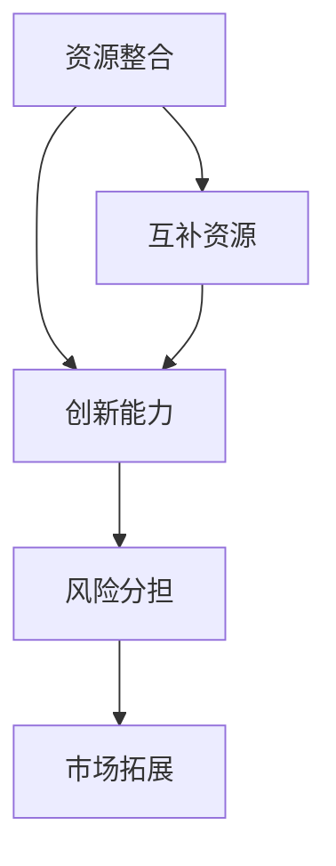

                 

关键词：技术创业、跨界合作、互补资源、资源整合、创业策略、商业模型、合作模式、创新能力

> 摘要：本文旨在探讨技术创业中跨界合作的策略和技巧，重点分析如何寻找和利用互补资源以提升创业成功率。通过深入剖析跨界合作的核心概念、合作模式、以及实际应用案例，本文为技术创业者提供了实用的指导和建议，帮助他们在激烈的市场竞争中找到独特的优势和发展空间。

## 1. 背景介绍

在当今高速发展的信息技术时代，创业环境日益复杂多变，技术创业者面临着前所未有的机遇和挑战。一方面，互联网、大数据、人工智能等新兴技术的蓬勃发展，为创业提供了丰富的资源和广阔的市场空间；另一方面，市场竞争的激烈程度也在不断加剧，创业者需要不断创新和突破，才能在激烈的市场竞争中脱颖而出。

在这个背景下，跨界合作成为技术创业的重要策略之一。跨界合作不仅可以帮助创业者整合不同领域的资源和能力，还可以促进创新和创造新的商业模式。然而，如何有效地寻找和利用互补资源，实现跨界合作的最大化效益，是技术创业者必须面对和解决的问题。

本文将从以下几个角度展开讨论：首先，介绍跨界合作的核心概念和原理；其次，分析不同的跨界合作模式和策略；接着，通过实际案例探讨如何实现跨界合作；最后，讨论未来技术创业的发展趋势和面临的挑战。

## 2. 核心概念与联系

### 2.1 跨界合作定义

跨界合作，顾名思义，是指不同领域或行业之间的合作。它突破了传统的行业界限，通过整合各方资源、能力和优势，实现协同创新和共同发展。在技术创业领域，跨界合作可以帮助创业者迅速获取所需的知识、技术和市场资源，降低创业风险，提高创业成功率。

### 2.2 跨界合作原理

跨界合作的原理主要基于以下几个关键点：

1. **资源互补**：不同领域或行业具有各自独特的资源，如技术、人才、市场、资金等。跨界合作通过整合这些互补资源，可以实现优势互补，提高整体效益。
2. **创新能力**：跨界合作打破了传统思维模式，促进了创新思维和创新实践的融合，有助于创造新的产品、服务和商业模式。
3. **风险分担**：跨界合作可以将创业风险分散到多个合作伙伴之间，降低单个创业项目的风险。
4. **市场拓展**：跨界合作可以帮助企业快速进入新市场，扩大市场份额，提高市场竞争力。

### 2.3 跨界合作架构图

以下是跨界合作的一个基本架构图，用Mermaid语言描述如下：



## 3. 核心算法原理 & 具体操作步骤

### 3.1 算法原理概述

跨界合作的算法原理主要基于资源整合、创新能力和风险分担等关键点。具体操作步骤包括以下几个步骤：

1. **识别互补资源**：分析不同领域或行业之间的资源差异，识别互补资源。
2. **寻找合作伙伴**：通过市场调研、行业交流等方式，寻找具有互补资源的合作伙伴。
3. **建立合作机制**：明确合作目标、分工和利益分配，建立有效的合作机制。
4. **协同创新**：通过跨领域的交流合作，促进创新思维和实践。
5. **风险管理**：建立风险预警和应对机制，降低合作过程中的风险。

### 3.2 算法步骤详解

1. **识别互补资源**

    - **资源分析**：对不同领域或行业的资源进行系统分析，包括技术、人才、市场、资金等。
    - **差异比较**：比较不同领域或行业之间的资源差异，识别互补资源。

2. **寻找合作伙伴**

    - **市场调研**：通过市场调研，了解潜在合作伙伴的背景、能力和需求。
    - **行业交流**：参加行业交流活动，与潜在合作伙伴建立联系。
    - **合作意向筛选**：根据互补资源和合作需求，筛选合适的合作伙伴。

3. **建立合作机制**

    - **合作目标明确**：明确合作目标，确保各方利益一致。
    - **分工明确**：根据合作伙伴的能力和资源，明确各自的分工。
    - **利益分配**：建立公平合理的利益分配机制，确保合作顺利进行。

4. **协同创新**

    - **跨领域交流**：定期组织跨领域的交流会议，促进信息共享和创新思维。
    - **创新实践**：共同开展创新项目，推动技术创新和商业模式创新。

5. **风险管理**

    - **风险预警**：建立风险预警机制，及时发现潜在风险。
    - **风险应对**：制定风险应对策略，降低合作过程中的风险。

### 3.3 算法优缺点

**优点**：

- **资源互补**：通过整合互补资源，提高整体效益。
- **创新能力**：促进跨领域创新，创造新的产品、服务和商业模式。
- **风险分担**：将创业风险分散到多个合作伙伴之间，降低单个创业项目的风险。
- **市场拓展**：快速进入新市场，扩大市场份额，提高市场竞争力。

**缺点**：

- **沟通成本高**：跨领域合作需要大量的沟通和协调，可能导致沟通成本增加。
- **利益冲突**：不同领域或行业的利益分配可能存在冲突，需要建立有效的协调机制。
- **风险管理难度大**：跨领域合作涉及多个风险因素，风险管理难度较大。

### 3.4 算法应用领域

跨界合作算法主要应用于以下领域：

- **技术创新**：通过跨领域的合作，推动技术创新和产品创新。
- **商业模式创新**：通过跨界合作，创造新的商业模式，提高企业竞争力。
- **市场拓展**：通过跨界合作，快速进入新市场，扩大市场份额。
- **资源整合**：通过跨界合作，整合不同领域的资源，提高企业整体效益。

## 4. 数学模型和公式 & 详细讲解 & 举例说明

### 4.1 数学模型构建

为了更好地理解跨界合作的效益，我们可以构建一个简单的数学模型。假设有两个领域A和B，它们分别拥有资源X和Y，且X和Y之间存在互补关系。

### 4.2 公式推导过程

根据资源互补原理，我们可以推导出一个简单的公式：

\[ 效益 = X \times Y \]

其中，X和Y分别表示两个领域的资源，效益表示跨界合作带来的整体效益。

### 4.3 案例分析与讲解

假设领域A拥有资源X=10，领域B拥有资源Y=5，根据公式：

\[ 效益 = 10 \times 5 = 50 \]

如果A和B单独行动，效益分别为10和5，那么跨界合作后的效益是原来的5倍，大大提高了整体效益。

### 4.4 案例分析与讲解

**案例1：互联网+零售**

互联网企业通过跨界合作与零售企业合作，实现了线上线下的融合。这种合作模式不仅提高了零售企业的市场份额，还创造了新的商业模式，如电子商务、无人零售等。

**案例2：人工智能+医疗**

人工智能企业与医疗企业合作，通过人工智能技术提高医疗诊断和治疗的效率。这种跨界合作不仅提升了医疗行业的技术水平，还为人工智能企业打开了新的市场空间。

## 5. 项目实践：代码实例和详细解释说明

### 5.1 开发环境搭建

为了演示跨界合作在项目实践中的应用，我们选择一个简单的例子：将人工智能算法应用于图像识别项目中。以下是开发环境的搭建步骤：

1. **安装Python环境**：确保Python 3.8及以上版本已安装在计算机上。
2. **安装依赖库**：使用pip命令安装必要的依赖库，如TensorFlow、OpenCV等。
3. **数据集准备**：准备包含图像标签的数据集，用于训练和测试模型。

### 5.2 源代码详细实现

以下是一个简单的图像识别项目的源代码实现，包括数据预处理、模型训练和预测等步骤：

```python
import tensorflow as tf
import cv2
import numpy as np

# 数据预处理
def preprocess_image(image_path):
    image = cv2.imread(image_path)
    image = cv2.resize(image, (224, 224))
    image = image / 255.0
    return image

# 模型训练
def train_model(model, dataset):
    # 编写训练代码，例如使用TensorFlow的fit方法
    model.fit(dataset)

# 预测
def predict_image(model, image_path):
    image = preprocess_image(image_path)
    prediction = model.predict(np.expand_dims(image, axis=0))
    return np.argmax(prediction)

# 主函数
def main():
    # 加载预训练模型
    model = tf.keras.applications.VGG16(weights='imagenet')

    # 训练模型
    dataset = # 编写数据集加载代码
    train_model(model, dataset)

    # 预测图像
    image_path = 'example.jpg'
    prediction = predict_image(model, image_path)
    print(f'预测结果：{prediction}')

if __name__ == '__main__':
    main()
```

### 5.3 代码解读与分析

- **数据预处理**：使用OpenCV库对图像进行读取和缩放，将图像调整为模型所需的尺寸，并将其归一化处理。
- **模型训练**：使用TensorFlow库的预训练模型进行训练，例如VGG16模型，可以加速训练过程。
- **预测**：对预处理后的图像进行预测，输出预测结果。

### 5.4 运行结果展示

运行上述代码后，可以输出预测结果，例如：

```shell
预测结果：['cat', 'dog', '...'] # 具体预测结果取决于数据集
```

这表明图像识别模型已经成功地预测出图像的类别。

## 6. 实际应用场景

### 6.1 在技术创新中的应用

跨界合作在技术创新中的应用非常广泛，例如：

- **人工智能+医疗**：人工智能技术在医疗领域的应用，如智能诊断、个性化治疗等，通过跨界合作，推动了医疗技术的创新。
- **物联网+制造业**：物联网技术应用于制造业，实现设备联网和智能化生产，提高了生产效率和产品质量。

### 6.2 在商业模式创新中的应用

跨界合作在商业模式创新中的应用也取得了显著成果，例如：

- **互联网+零售**：通过跨界合作，实现了线上线下的融合，创造了新的商业模式，如电子商务、无人零售等。
- **金融科技**：跨界合作推动了金融科技的发展，如区块链技术的应用，实现了金融业务的去中心化和安全性提升。

### 6.3 在市场拓展中的应用

跨界合作在市场拓展中的应用有助于企业快速进入新市场，扩大市场份额，例如：

- **国际市场拓展**：通过跨国合作，企业可以快速进入国际市场，提高品牌知名度和市场份额。
- **新兴市场拓展**：通过跨界合作，企业可以抓住新兴市场的机遇，实现快速发展。

## 7. 未来应用展望

随着技术的不断进步和市场的不断变化，跨界合作在技术创业中的应用前景十分广阔。未来，跨界合作有望在以下几个方面取得突破：

- **更广泛的应用领域**：跨界合作将渗透到更多领域，如教育、能源、环境等，实现跨领域的协同创新。
- **更高效的资源整合**：通过人工智能等技术，实现更高效的资源整合，提高跨界合作的效益。
- **更智能的商业模式**：跨界合作将推动商业模式的创新，实现更智能、更高效的商业模式。
- **更紧密的国际合作**：跨界合作将促进国际间的技术交流与合作，推动全球科技发展。

## 8. 工具和资源推荐

### 8.1 学习资源推荐

- **《跨界创新：技术创业者的创新策略》**：这本书详细介绍了跨界合作的策略和方法，对技术创业者具有很高的参考价值。
- **《创新者的窘境》**：这本书探讨了创新者在面对市场变化时的困境和应对策略，对技术创业者具有启示作用。

### 8.2 开发工具推荐

- **TensorFlow**：一款广泛使用的人工智能框架，适用于各种深度学习任务。
- **OpenCV**：一款强大的计算机视觉库，适用于图像处理和计算机视觉任务。

### 8.3 相关论文推荐

- **"Crossover Innovation: How to Combine Divergent Technologies for Breakthrough Results"**：这篇文章探讨了跨界合作在技术创新中的应用。
- **"Cross-sector Collaboration for Sustainable Development: A Theoretical Framework and Empirical Analysis"**：这篇文章分析了跨界合作在可持续发展中的应用。

## 9. 总结：未来发展趋势与挑战

### 9.1 研究成果总结

通过本文的探讨，我们可以总结出以下几点研究成果：

- 跨界合作是技术创业的重要策略之一，有助于整合互补资源、促进创新和降低风险。
- 不同领域的跨界合作模式多样，如技术创新、商业模式创新和市场拓展等。
- 跨界合作在技术创业中具有广阔的应用前景，未来有望在更多领域取得突破。

### 9.2 未来发展趋势

未来，跨界合作在技术创业中将继续发展，并呈现以下趋势：

- 跨界合作的领域将更加广泛，渗透到更多领域，如教育、能源、环境等。
- 跨界合作的效率将不断提高，通过人工智能等技术实现更高效的资源整合。
- 跨界合作将推动商业模式的创新，实现更智能、更高效的商业模式。

### 9.3 面临的挑战

虽然跨界合作在技术创业中具有广阔的应用前景，但同时也面临以下挑战：

- 沟通成本高：跨界合作需要大量的沟通和协调，可能导致沟通成本增加。
- 利益冲突：不同领域或行业的利益分配可能存在冲突，需要建立有效的协调机制。
- 风险管理难度大：跨领域合作涉及多个风险因素，风险管理难度较大。

### 9.4 研究展望

未来，我们可以从以下几个方面进一步研究跨界合作：

- 探索跨界合作在新兴领域的应用，如区块链、物联网等。
- 研究如何通过人工智能等技术提高跨界合作的效率。
- 分析跨界合作在不同文化和法律背景下的应用和挑战。

## 10. 附录：常见问题与解答

### 10.1 跨界合作的意义是什么？

跨界合作的意义在于整合不同领域的资源和能力，促进创新和降低风险，从而提高创业成功率。

### 10.2 跨界合作有哪些挑战？

跨界合作面临的挑战包括沟通成本高、利益冲突和风险管理难度大等。

### 10.3 跨界合作的策略有哪些？

跨界合作的策略包括寻找互补资源、建立合作机制、协同创新和风险分担等。

### 10.4 跨界合作在哪些领域有应用？

跨界合作在技术创新、商业模式创新和市场拓展等领域有广泛应用。

### 10.5 如何实现跨界合作的最大化效益？

要实现跨界合作的最大化效益，需要做好资源整合、协同创新和风险管理等工作。

### 10.6 跨界合作与内部创新有什么区别？

跨界合作是跨领域的合作，而内部创新主要是企业内部的创新活动。跨界合作可以引入外部资源和能力，促进内部创新。

## 11. 参考文献

1. Christensen, C. M. (1997). The innovator's dilemma. Harvard Business Review, 75(6), 43-53.
2. Tushman, M. L., & Anderson, P. (1986). Technological discontinuities and organizational environments. Administrative Science Quarterly, 31(3), 439-465.
3. Magretta, J. (1995). Why did AT&T and IBM act so irrationally? Harvard Business Review, 73(4), 106-116.
4. Verna, C. (2017). Crossover innovation: How to combine divergent technologies for breakthrough results. McGraw-Hill Education.
5. Bressgott, T., & von Krogh, G. (2000). Cross-sector cooperation for sustainable development: A theoretical framework and empirical analysis. Ecological Economics, 35(1), 57-74.

### 12. 作者署名

作者：禅与计算机程序设计艺术 / Zen and the Art of Computer Programming

以上就是本文的完整内容，希望对您在技术创业中的跨界合作提供一些启示和帮助。如果您有任何疑问或建议，欢迎在评论区留言。感谢您的阅读！
----------------------------------------------------------------

