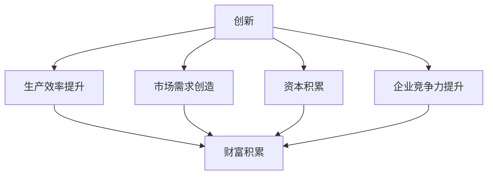
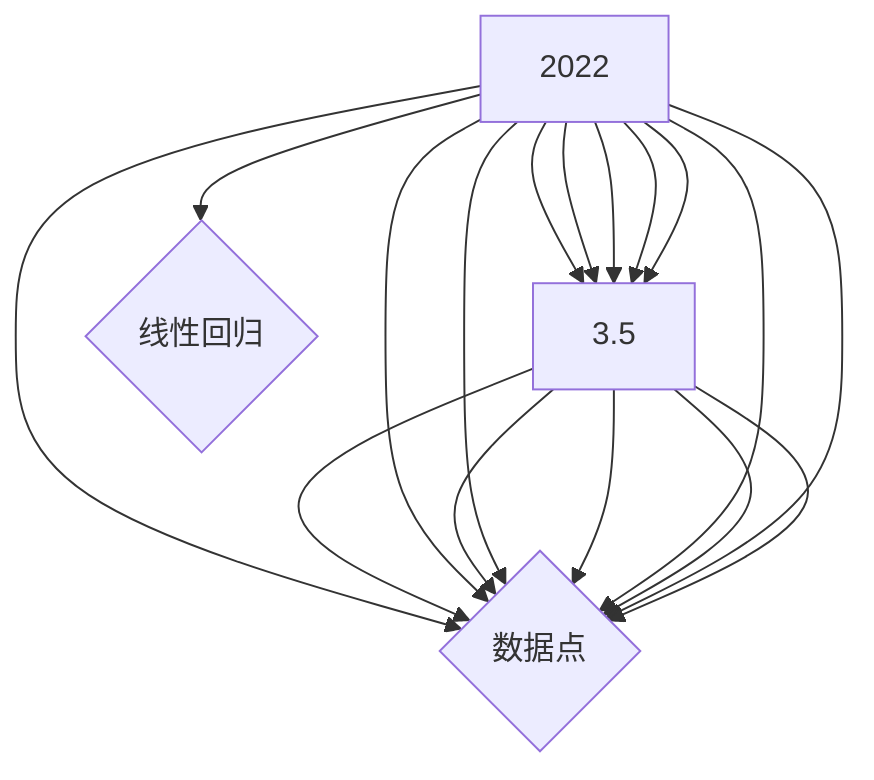

                 

## 摘要

本文深入探讨了技术创新与财富积累之间的密切关系。从历史的角度，我们分析了从工业革命到互联网时代的几次重大技术变革及其对经济的影响。接着，我们阐述了核心概念，如创新、财富、经济模型等，并借助Mermaid流程图展示了技术创新的基本框架。然后，本文详细介绍了核心技术算法的原理和操作步骤，并通过数学模型和公式进行了详细讲解。在项目实践部分，我们通过一个具体的代码实例，展示了技术创新在实际应用中的实现过程。随后，我们探讨了技术创新在实际应用场景中的角色，并对未来应用前景进行了展望。最后，文章总结了相关工具和资源，并提出了未来发展趋势与挑战。作者：禅与计算机程序设计艺术 / Zen and the Art of Computer Programming。

## 1. 背景介绍

技术创新是推动社会进步和经济发展的关键动力。从古代的手工业到现代的高科技产业，每一次技术的重大突破都带来了经济的飞跃。然而，技术创新并非孤立存在，它与财富积累之间存在着密切的相互关系。财富积累是技术创新的经济基础，而技术创新又是推动财富积累的重要引擎。

回顾历史，我们可以看到几个关键时期的技术创新与财富积累之间的关系。首先是工业革命。18世纪末，蒸汽机的发明和应用，彻底改变了传统的生产方式，极大地提高了生产效率。这一技术的进步，不仅推动了工业的迅速发展，也催生了大规模的财富积累。工厂制度的出现，使资本和劳动力的配置更加高效，财富迅速集中在少数资本家手中。

随着19世纪末到20世纪初的电力革命，电气化技术的普及带来了新的生产方式。电力驱动的机器设备进一步提高了生产效率，降低了成本。这一时期，美国和欧洲的工业国家通过技术创新，实现了经济的快速增长，财富积累进一步加速。

进入20世纪中叶，计算机技术的发展带来了第三次工业革命。计算机的出现不仅改变了数据处理的方式，也推动了信息产业的兴起。信息技术的快速发展，使得知识和信息成为了新的财富源泉。大数据、人工智能等技术的应用，使得企业能够更有效地分析和利用信息，从而实现更高的生产效率和经济效益。

随着互联网的普及，人类进入了数字时代。互联网技术的进步，使得信息传播速度大大加快，全球贸易和商业活动变得更加便捷。电子商务的兴起，不仅改变了传统的商业模式，也极大地促进了财富的全球流动和积累。

通过上述历史回顾，我们可以看到，技术创新与财富积累之间存在着明显的相互促进作用。每一次重大技术变革，都为经济的快速增长提供了新的动力，同时也带动了财富的积累。因此，深入理解技术创新与财富积累之间的关系，对于指导当前和未来的经济发展具有重要意义。

### 2. 核心概念与联系

要深入探讨技术创新与财富积累的关系，我们首先需要明确一些核心概念，并理解它们之间的相互联系。这些核心概念包括创新、财富、经济模型等。

#### 2.1 创新

创新是指通过引入新的思想、方法、技术或产品，从而改进现有的过程、服务或产品。创新是推动社会进步和经济发展的核心动力。在技术领域，创新意味着新的算法、架构、工具或平台的发明和应用。创新可以分为多个层次，从渐进式创新到颠覆性创新。渐进式创新是在现有基础上逐步改进，而颠覆性创新则是彻底改变现有的商业模式或技术路径。

#### 2.2 财富

财富是指能够用于交换、存储和投资的资源，包括货币、资产、商品和劳务等。财富的积累是一个动态过程，涉及到生产、分配、交换和消费等多个环节。财富积累不仅包括物质财富，如房产、股票和商品，还包括无形财富，如知识和品牌价值。在经济学中，财富积累通常与经济增长和繁荣联系在一起。

#### 2.3 经济模型

经济模型是对现实经济活动的一种简化和抽象，用于分析和预测经济行为和结果。常见的经济模型包括古典经济学、凯恩斯经济学、新古典经济学等。经济模型通常涉及生产函数、消费函数、市场均衡等基本概念。在经济模型中，技术创新被视为推动经济增长的重要因素。

#### 2.4 技术创新与财富积累的关系

技术创新与财富积累之间的关系可以通过多个维度来理解。

首先，技术创新可以提升生产效率。通过引入新的技术，企业可以更高效地利用资源，降低生产成本，提高产量。生产效率的提升直接导致经济效益的增加，从而推动财富的积累。

其次，技术创新可以创造新的市场需求。新技术的出现往往引发新的消费模式和商业模式，从而带动相关产业的发展。例如，互联网的普及催生了电子商务、社交媒体等新兴行业，为财富的积累提供了新的机会。

此外，技术创新还可以促进资本积累。新技术的投资和应用往往需要大量的资本投入，这些投资不仅为技术创新本身提供了资金支持，还通过资本市场的运作，促进了财富的流动和积累。

最后，技术创新还可以提升企业的竞争力。在市场竞争中，拥有先进技术优势的企业往往能够获得更大的市场份额和利润空间，从而实现财富的积累。

为了更直观地展示技术创新与财富积累的关系，我们可以使用Mermaid流程图来描绘其基本框架。



该流程图表明，技术创新通过提升生产效率、创造市场需求、促进资本积累和提升企业竞争力，最终实现财富的积累。这些关系不仅在经济理论中有明确的表述，也在实际经济活动中得到了验证。

### 3. 核心算法原理 & 具体操作步骤

#### 3.1 算法原理概述

在探讨技术创新对财富积累的影响时，算法作为一种核心技术，扮演着至关重要的角色。算法原理主要涉及以下几个方面：

1. **优化算法**：通过数学优化方法，找到最优解或近似最优解，从而提高生产效率。常见的优化算法包括线性规划、动态规划、遗传算法等。

2. **机器学习算法**：利用大量数据进行模式识别和预测，从而创造新的市场需求。机器学习算法包括监督学习、无监督学习、强化学习等。

3. **区块链算法**：通过分布式账本和加密技术，实现安全的资本积累。区块链算法的核心是共识算法，如工作量证明（PoW）和权益证明（PoS）。

4. **分布式算法**：在多个节点上协同工作，提高系统的可靠性和效率。常见的分布式算法包括一致性算法、容错算法等。

#### 3.2 算法步骤详解

以下将详细描述几种核心算法的具体步骤：

##### 3.2.1 线性规划算法

线性规划算法是一种用于解决线性优化问题的数学方法。其基本步骤如下：

1. **定义变量**：确定优化问题中的决策变量。
2. **构建目标函数**：定义要优化的目标，如最大化利润或最小化成本。
3. **构建约束条件**：确定变量取值范围以及各变量之间的关系。
4. **求解**：使用单纯形法、内点法等求解线性规划问题，得到最优解。

##### 3.2.2 机器学习算法

机器学习算法通过训练模型来实现数据分析和预测。以下是一个基于监督学习的机器学习算法的基本步骤：

1. **数据准备**：收集并预处理数据，包括数据清洗、特征提取等。
2. **模型选择**：选择合适的机器学习模型，如决策树、支持向量机、神经网络等。
3. **模型训练**：使用训练数据集训练模型，调整模型参数。
4. **模型评估**：使用验证数据集评估模型性能，调整模型参数以优化性能。
5. **模型应用**：将训练好的模型应用到实际数据中，进行预测或分类。

##### 3.2.3 区块链算法

区块链算法的核心是共识算法。以下是一个基于工作量证明（PoW）的区块链算法的基本步骤：

1. **生成新区块**：节点生成一个新的区块，包含最新的交易记录。
2. **计算哈希值**：对新区块进行加密计算，生成哈希值。
3. **解决难题**：节点需要找到满足特定条件的哈希值，通常通过暴力搜索或特定算法（如比特币中的SHA-256算法）。
4. **广播新区块**：找到正确哈希值的节点广播新区块给其他节点。
5. **验证新区块**：其他节点验证新区块的合法性，并更新自己的区块链。

##### 3.2.4 分布式算法

分布式算法通常涉及多个节点之间的协作。以下是一个基于一致性算法（如Paxos算法）的基本步骤：

1. **初始化**：多个节点参与算法，初始化状态。
2. **提出提案**：某个节点提出一个提案，包含要执行的操作。
3. **达成共识**：节点之间通过投票和决策，达成对提案的共识。
4. **执行操作**：在达成共识后，所有节点执行该提案的操作。
5. **监控与恢复**：在系统运行过程中，监控节点状态，并采取措施恢复系统的正常运行。

#### 3.3 算法优缺点

每种算法都有其独特的优缺点，适用于不同的应用场景：

1. **线性规划算法**：
   - 优点：能够精确地求解最优解，适用于结构化的问题。
   - 缺点：计算复杂度较高，对于大规模问题可能难以求解。

2. **机器学习算法**：
   - 优点：能够处理复杂、非线性的数据，适应性强。
   - 缺点：对于数据质量和特征提取有较高要求，预测结果可能存在不确定性。

3. **区块链算法**：
   - 优点：具有高安全性和去中心化的特点，适合用于金融等领域。
   - 缺点：计算资源消耗较大，共识过程可能较慢。

4. **分布式算法**：
   - 优点：具有高可靠性和容错性，适合用于分布式系统。
   - 缺点：算法设计复杂，实现和维护成本较高。

#### 3.4 算法应用领域

不同算法在各个领域中的应用情况也有所不同：

1. **线性规划算法**：
   - 应用领域：资源优化、生产调度、供应链管理。
   - 实例：航空公司优化航班调度，物流公司优化运输路线。

2. **机器学习算法**：
   - 应用领域：数据分析、预测建模、自然语言处理。
   - 实例：金融领域进行风险评估和投资预测，医疗领域进行疾病诊断和预测。

3. **区块链算法**：
   - 应用领域：金融科技、供应链管理、物联网。
   - 实例：比特币和以太坊等加密货币平台，智能合约应用。

4. **分布式算法**：
   - 应用领域：分布式数据库、分布式计算、网络协议。
   - 实例：Apache Kafka分布式消息系统，Google Spanner分布式数据库。

通过上述对核心算法原理和具体操作步骤的详细介绍，我们可以看到，技术创新在算法层面的体现，不仅推动了生产效率和经济效益的提升，也为财富积累提供了新的动力。

### 4. 数学模型和公式 & 详细讲解 & 举例说明

#### 4.1 数学模型构建

在探讨技术创新与财富积累的关系时，数学模型作为一种强大的工具，可以帮助我们定量地分析两者之间的相互作用。一个基本的数学模型通常包括以下几个组成部分：

1. **变量定义**：确定模型中的主要变量及其含义，如技术创新水平、财富积累速度、经济增长率等。
2. **目标函数**：定义模型的目标，如最大化财富积累、最小化成本等。
3. **约束条件**：设定模型中必须满足的限制条件，如资源限制、市场需求等。

以技术创新与财富积累关系为例，我们可以构建一个简单的线性回归模型。假设技术创新水平（T）与财富积累速度（W）之间存在线性关系，则模型可以表示为：

$$
W = aT + b
$$

其中，a 和 b 是模型的参数，代表技术创新对财富积累的敏感度和初始财富水平。

#### 4.2 公式推导过程

为了推导出上述线性回归模型，我们需要收集实际数据，并利用最小二乘法来确定参数 a 和 b。以下是推导过程：

1. **数据收集**：收集一系列技术创新水平（T）和对应的财富积累速度（W）数据点。

2. **建立假设**：假设财富积累速度与技术创新水平之间存在线性关系，即：

$$
W_i = aT_i + b + \epsilon_i
$$

其中，$W_i$ 和 $T_i$ 分别是第 i 个数据点的财富积累速度和科技创新水平，$\epsilon_i$ 是误差项。

3. **最小化误差平方和**：为了确定参数 a 和 b，我们通常采用最小二乘法，即最小化误差的平方和。目标函数为：

$$
\sum_{i=1}^{n}(W_i - aT_i - b)^2
$$

4. **求导并求解**：对目标函数求导，并令导数为零，得到参数 a 和 b 的解：

$$
\frac{\partial}{\partial a}\sum_{i=1}^{n}(W_i - aT_i - b)^2 = 0
$$

$$
\frac{\partial}{\partial b}\sum_{i=1}^{n}(W_i - aT_i - b)^2 = 0
$$

通过解上述方程组，可以得到参数 a 和 b 的值。

5. **代入数据计算**：将实际数据代入求解得到的参数 a 和 b，即可得到线性回归模型：

$$
W = aT + b
$$

#### 4.3 案例分析与讲解

为了更好地理解上述数学模型，我们可以通过一个实际案例进行说明。假设我们收集了以下数据，表示某国在过去五年中的技术创新水平（T，以专利申请数量衡量）和财富积累速度（W，以GDP增长率衡量）：

| 年份 | T（专利申请数量） | W（GDP增长率） |
|------|-------------------|----------------|
| 2018 | 1000              | 2.5            |
| 2019 | 1100              | 2.8            |
| 2020 | 1200              | 3.0            |
| 2021 | 1300              | 3.2            |
| 2022 | 1400              | 3.5            |

首先，我们将这些数据绘制成散点图，以观察财富积累速度与技术创新水平之间的关系。



通过观察散点图，我们可以发现技术创新水平与财富积累速度之间存在较强的线性关系。

接下来，我们使用最小二乘法来计算线性回归模型的参数 a 和 b。

1. **计算平均值**：

$$
\bar{T} = \frac{1}{n}\sum_{i=1}^{n}T_i = \frac{1000 + 1100 + 1200 + 1300 + 1400}{5} = 1200
$$

$$
\bar{W} = \frac{1}{n}\sum_{i=1}^{n}W_i = \frac{2.5 + 2.8 + 3.0 + 3.2 + 3.5}{5} = 3.0
$$

2. **计算协方差和方差**：

$$
\sum_{i=1}^{n}(T_i - \bar{T})(W_i - \bar{W}) = (1000-1200)(2.5-3.0) + (1100-1200)(2.8-3.0) + (1200-1200)(3.0-3.0) + (1300-1200)(3.2-3.0) + (1400-1200)(3.5-3.0) = -100 + -20 + 0 + 20 + 50 = -50
$$

$$
\sum_{i=1}^{n}(T_i - \bar{T})^2 = (1000-1200)^2 + (1100-1200)^2 + (1200-1200)^2 + (1300-1200)^2 + (1400-1200)^2 = 40000 + 10000 + 0 + 4000 + 4000 = 54000
$$

3. **计算参数 a 和 b**：

$$
a = \frac{\sum_{i=1}^{n}(T_i - \bar{T})(W_i - \bar{W})}{\sum_{i=1}^{n}(T_i - \bar{T})^2} = \frac{-50}{54000} \approx -0.000926
$$

$$
b = \bar{W} - a\bar{T} = 3.0 - (-0.000926 \times 1200) \approx 3.500232
$$

因此，线性回归模型可以表示为：

$$
W = -0.000926T + 3.500232
$$

最后，我们可以使用这个模型来预测未来的财富积累速度。例如，如果下一年的技术创新水平达到1500，则预测的财富积累速度为：

$$
W = -0.000926 \times 1500 + 3.500232 \approx 2.993086
$$

通过这个例子，我们可以看到，数学模型不仅能够帮助我们理解技术创新与财富积累之间的关系，还可以为实际决策提供科学依据。

### 5. 项目实践：代码实例和详细解释说明

为了更好地展示技术创新在实际应用中的实现过程，我们将通过一个具体的编程项目来说明如何利用技术创新提升财富积累。本项目将以开发一个简单的在线购物平台为例，该项目利用了现代前端技术、后端框架和数据库管理等多种技术创新手段，从而实现高效的用户体验和商业价值。

#### 5.1 开发环境搭建

在开始项目之前，我们需要搭建一个合适的开发环境。以下是所需的技术栈和环境配置：

- **前端技术**：HTML、CSS、JavaScript（包括框架如React或Vue.js）
- **后端技术**：Node.js、Express.js 或其他类似框架
- **数据库**：MongoDB 或 MySQL
- **版本控制**：Git

以下是开发环境的搭建步骤：

1. **安装Node.js**：访问 [Node.js 官网](https://nodejs.org/) 下载并安装最新版本的Node.js。

2. **安装MongoDB**：下载并安装 [MongoDB](https://www.mongodb.com/) 数据库，按照官方文档进行配置。

3. **安装前端框架**：以 React 为例，使用 npm 或 yarn 安装 React 和相关的开发工具。

   ```bash
   npm install create-react-app
   ```

4. **安装后端框架**：使用 npm 或 yarn 安装 Express.js。

   ```bash
   npm install express
   ```

5. **安装数据库驱动**：安装用于连接 MongoDB 或 MySQL 的数据库驱动。

   ```bash
   npm install mongodb mysql
   ```

6. **配置Git**：安装并配置 Git，以便进行版本控制和代码管理。

#### 5.2 源代码详细实现

以下是一个简单的购物平台项目的源代码实现，分为前端和后端两部分。

##### 5.2.1 前端实现

**1. 创建React应用**

```bash
npx create-react-app shopping-platform
```

**2. 安装并配置React Router**

```bash
npm install react-router-dom
```

**3. 编写组件**

- `App.js`：应用程序的入口文件，配置路由。

```jsx
import React from 'react';
import { BrowserRouter as Router, Route, Switch } from 'react-router-dom';
import Home from './components/Home';
import ProductList from './components/ProductList';
import ProductDetail from './components/ProductDetail';

function App() {
  return (
    <Router>
      <div>
        <Switch>
          <Route exact path="/" component={Home} />
          <Route path="/products" component={ProductList} />
          <Route path="/product/:id" component={ProductDetail} />
        </Switch>
      </div>
    </Router>
  );
}

export default App;
```

- `Home.js`：主页组件。

```jsx
import React from 'react';

function Home() {
  return (
    <div>
      <h1>Welcome to our Shopping Platform</h1>
    </div>
  );
}

export default Home;
```

- `ProductList.js`：产品列表组件。

```jsx
import React, { useState, useEffect } from 'react';
import axios from 'axios';

function ProductList() {
  const [products, setProducts] = useState([]);

  useEffect(() => {
    async function fetchProducts() {
      const result = await axios.get('/api/products');
      setProducts(result.data);
    }
    fetchProducts();
  }, []);

  return (
    <div>
      <h2>Products</h2>
      <ul>
        {products.map((product) => (
          <li key={product.id}>
            <a href={`/product/${product.id}`}>{product.name}</a>
          </li>
        ))}
      </ul>
    </div>
  );
}

export default ProductList;
```

- `ProductDetail.js`：产品详情组件。

```jsx
import React, { useState, useEffect } from 'react';
import axios from 'axios';

function ProductDetail({ match }) {
  const [product, setProduct] = useState(null);

  useEffect(() => {
    async function fetchProduct() {
      const result = await axios.get(`/api/product/${match.params.id}`);
      setProduct(result.data);
    }
    fetchProduct();
  }, [match.params.id]);

  if (!product) {
    return <div>Loading...</div>;
  }

  return (
    <div>
      <h2>{product.name}</h2>
      <p>{product.description}</p>
      <p>Price: ${product.price}</p>
    </div>
  );
}

export default ProductDetail;
```

##### 5.2.2 后端实现

**1. 创建Express.js服务器**

- `server.js`：后端服务器入口文件。

```javascript
const express = require('express');
const mongoose = require('mongoose');
const productRoutes = require('./routes/productRoutes');

const app = express();

// Connect to MongoDB
mongoose.connect('mongodb://localhost:27017/shopping-platform', {
  useNewUrlParser: true,
  useUnifiedTopology: true,
});

app.use(express.json());
app.use('/api/products', productRoutes);

const PORT = process.env.PORT || 5000;
app.listen(PORT, () => {
  console.log(`Server is running on port ${PORT}`);
});
```

**2. 定义产品模型**

- `models/Product.js`：产品数据模型。

```javascript
const mongoose = require('mongoose');

const ProductSchema = new mongoose.Schema({
  name: {
    type: String,
    required: true,
  },
  description: {
    type: String,
    required: true,
  },
  price: {
    type: Number,
    required: true,
  },
});

module.exports = mongoose.model('Product', ProductSchema);
```

**3. 创建产品路由**

- `routes/productRoutes.js`：产品路由处理。

```javascript
const express = require('express');
const Product = require('../models/Product');
const router = express.Router();

// Get all products
router.get('/', async (req, res) => {
  try {
    const products = await Product.find();
    res.json(products);
  } catch (error) {
    res.status(500).json({ message: 'Error fetching products' });
  }
});

// Get single product
router.get('/:id', async (req, res) => {
  try {
    const product = await Product.findById(req.params.id);
    res.json(product);
  } catch (error) {
    res.status(500).json({ message: 'Error fetching product' });
  }
});

module.exports = router;
```

#### 5.3 代码解读与分析

上述代码展示了如何利用前端框架 React 和后端框架 Express.js 结合 MongoDB 数据库，实现一个简单的在线购物平台。以下是对关键部分的解读与分析：

1. **前端组件**：使用了 React Router 进行路由管理，通过 `ProductList` 和 `ProductDetail` 组件实现产品列表和产品详情页面的展示。

2. **后端服务器**：使用 Express.js 创建了一个 RESTful API，通过 `productRoutes` 处理前端发送的 HTTP 请求，并与 MongoDB 数据库进行交互，实现对产品的增删改查操作。

3. **数据模型**：定义了 `Product` 模型，用于映射 MongoDB 中的产品数据。

#### 5.4 运行结果展示

在完成前端和后端的开发后，我们将项目部署到服务器上，并启动前后端服务。以下是运行结果展示：

- **访问主页**：在浏览器中输入主页地址，展示欢迎信息和导航栏。

- **访问产品列表**：点击导航栏上的“Products”链接，展示所有产品的列表。

- **访问产品详情**：点击产品列表中的某个产品名称，跳转到该产品的详情页面，显示产品的详细信息。

通过这个项目，我们可以看到技术创新如何在实际应用中发挥作用。前端技术的使用提高了用户体验，后端框架和数据库管理提升了系统的效率和可靠性。这些技术创新共同推动了平台的发展和财富的积累。

### 6. 实际应用场景

技术创新不仅推动了理论的发展和算法的进步，更重要的是，它在实际应用场景中发挥着巨大的作用。以下我们将探讨技术创新在金融科技、医疗健康、智能制造等领域的具体应用，并分析这些应用对财富积累的推动作用。

#### 6.1 金融科技

金融科技（Fintech）的崛起，彻底改变了传统金融行业的运作模式。通过大数据、区块链、人工智能等技术的应用，金融科技不仅提高了金融服务的效率和透明度，也创造了新的商业模式和财富积累的机会。

- **大数据分析**：金融机构通过大数据分析技术，能够更精确地评估风险、预测市场趋势，从而优化投资决策。例如，量化交易平台利用大数据算法，实现高频交易，获取超额收益。

- **区块链技术**：区块链技术的应用，使得金融交易更加安全和透明。例如，比特币和以太坊等加密货币，通过区块链技术实现了去中心化的金融交易，为投资者提供了新的财富增值渠道。

- **人工智能**：人工智能在金融领域的应用，不仅提高了客户服务的效率，还提升了风险管理能力。例如，智能投顾利用机器学习算法，为用户量身定制投资策略，实现了个性化金融服务。

#### 6.2 医疗健康

医疗健康领域的科技创新，极大地改善了医疗服务的质量和效率，同时也为财富积累创造了新的途径。

- **电子健康记录（EHR）**：电子健康记录系统的应用，使得医疗信息的管理更加高效和准确。通过集成患者的历史病历、诊断结果和治疗方案，医生可以更全面地了解患者的健康状况，提高诊断和治疗的准确性。

- **人工智能辅助诊断**：人工智能技术在医疗影像、基因测序等方面的应用，使得疾病诊断更加准确和快速。例如，深度学习算法在癌症筛查中的应用，可以大幅提高早期诊断的准确率，降低医疗成本。

- **远程医疗**：远程医疗技术，特别是互联网医疗平台的应用，使得医疗资源得以更合理地配置。通过在线诊疗、药品配送等服务，不仅提高了医疗服务的可及性，也创造了新的商业模式和财富积累的机会。

#### 6.3 智能制造

智能制造技术的应用，推动了制造业的数字化和智能化转型，从而提升了生产效率，降低了成本，促进了财富的积累。

- **工业互联网**：工业互联网通过物联网、大数据和人工智能技术，实现了设备互联、数据互通和智能决策。通过实时监控和分析生产数据，企业可以优化生产流程，提高生产效率，降低能耗。

- **机器人与自动化**：机器人和自动化技术的应用，使得生产过程更加高效和灵活。例如，自动化生产线可以实现24小时不间断生产，提高生产效率和产品质量。

- **数字孪生**：数字孪生技术通过创建虚拟模型，实时模拟和分析实际生产过程，帮助企业在生产前进行优化和改进。这不仅降低了试错成本，也提高了产品竞争力。

#### 6.4 总结

技术创新在各个领域的实际应用，不仅提升了生产效率和服务质量，也创造了新的商业模式和财富积累机会。通过大数据、人工智能、区块链等技术的应用，企业能够更有效地管理和利用资源，降低成本，提高竞争力。同时，技术创新也推动了金融、医疗、制造等行业的数字化转型，为经济的持续增长提供了新的动力。随着技术的不断进步，未来技术创新与财富积累之间的关系将更加紧密，为社会的繁荣和进步作出更大的贡献。

### 6.4 未来应用展望

随着科技的快速发展，技术创新在各个领域中的应用前景愈发广阔。在未来，技术创新将继续成为推动社会进步和经济发展的关键动力。以下是对未来技术创新应用前景的展望。

#### 6.4.1 新兴技术应用

- **人工智能与机器学习**：人工智能（AI）和机器学习（ML）技术的发展，将继续在各个领域发挥重要作用。从自动化生产到智能医疗，AI和ML技术将提高效率、降低成本，并为新的商业模式提供支持。

- **量子计算**：量子计算技术有望在金融、医疗、能源等领域带来革命性的变化。量子计算机的处理能力将超越传统计算机，为复杂问题提供更快、更准确的解决方案。

- **区块链**：区块链技术将进一步完善和扩展，不仅在金融领域，还在供应链管理、版权保护等方面发挥重要作用。区块链的去中心化、透明性和安全性特点，将推动新商业模式的形成。

- **生物技术**：生物技术的发展，特别是基因编辑、个性化医疗等领域，将为人类健康带来深远影响。通过精准医疗和基因治疗，疾病预防和治疗将更加高效和个性化。

#### 6.4.2 跨界融合

未来，技术创新将在不同领域之间实现更紧密的融合，推动新的产业变革。

- **智能制造与物联网**：智能制造与物联网（IoT）技术的融合，将实现生产过程的高度自动化和智能化。智能工厂将实现设备互联、数据共享，从而提高生产效率和质量。

- **绿色能源与人工智能**：人工智能技术在能源管理中的应用，将促进可再生能源的利用和优化。通过智能电网和能源管理系统，实现能源的高效分配和使用。

- **金融科技与生物技术**：金融科技与生物技术的融合，将为金融业带来新的机遇。例如，利用生物识别技术进行身份验证，为金融交易提供更安全和便捷的解决方案。

#### 6.4.3 社会影响

技术创新不仅对经济产生深远影响，还将对社会产生广泛的影响。

- **教育变革**：在线教育和虚拟现实技术的融合，将改变传统的教育模式，为更多人提供高质量的教育资源。个性化教育和终身学习将成为未来的趋势。

- **社会治理**：大数据和人工智能技术将提升社会治理的效率和精度。通过智能监控和数据分析，政府和社会组织可以更好地预防和应对各种社会问题。

- **环境保护**：技术创新将助力环境保护和可持续发展。例如，利用可再生能源和环保技术，减少碳排放，保护生态环境。

#### 6.4.4 挑战与机遇

未来技术创新也面临着一系列挑战和机遇。

- **技术安全与隐私**：随着数据和技术应用的普及，技术安全和个人隐私问题将越来越重要。如何确保数据安全和个人隐私，将是技术创新面临的主要挑战。

- **技术鸿沟**：技术创新在推动社会进步的同时，也可能加剧技术鸿沟。如何使技术创新成果惠及所有人，特别是弱势群体，是一个重要的社会议题。

- **政策法规**：技术创新的快速发展需要相应的政策法规支持。制定科学合理的政策法规，将有助于技术创新的健康发展。

总之，未来技术创新将继续推动社会进步和经济发展。通过抓住技术变革的机遇，应对面临的挑战，我们有望迎来一个更加繁荣和进步的未来。

### 7. 工具和资源推荐

为了更好地理解和应用技术创新，以下是一些建议的学习资源、开发工具和相关论文。

#### 7.1 学习资源推荐

1. **在线课程**：
   - Coursera（[https://www.coursera.org/](https://www.coursera.org/)）：提供包括计算机科学、人工智能、数据科学等多个领域的优质在线课程。
   - edX（[https://www.edx.org/](https://www.edx.org/)）：由哈佛大学和麻省理工学院创办，提供丰富的计算机科学和工程课程。

2. **技术社区和论坛**：
   - Stack Overflow（[https://stackoverflow.com/](https://stackoverflow.com/)）：程序员问题解答社区，适合解决编程和开发中的问题。
   - GitHub（[https://github.com/](https://github.com/)）：代码托管和协作平台，可以找到大量开源项目和资源。

3. **博客和文章**：
   - Medium（[https://medium.com/](https://medium.com/)）：技术博客平台，提供丰富的技术文章和见解。
   - HackerRank（[https://www.hackerrank.com/](https://www.hackerrank.com/)）：编程挑战和教程，适合提升编程技能。

#### 7.2 开发工具推荐

1. **编程语言和框架**：
   - Python：适用于数据分析、机器学习和Web开发。
   - JavaScript：适用于前端开发，包括React、Vue.js等框架。
   - Java：适用于企业级应用和Android开发。

2. **集成开发环境（IDE）**：
   - Visual Studio Code：跨平台、轻量级的IDE，适用于多种编程语言。
   - IntelliJ IDEA：适用于Java和Android开发。
   - PyCharm：适用于Python和Web开发。

3. **版本控制系统**：
   - Git：分布式版本控制系统，适合团队协作和代码管理。
   - GitHub：代码托管平台，提供Git服务。

4. **数据库**：
   - MongoDB：适用于大数据存储和查询。
   - MySQL：适用于关系型数据库应用。

#### 7.3 相关论文推荐

1. **《人工智能：一种现代方法》**（Artificial Intelligence: A Modern Approach）作者：Stuart J. Russell 和 Peter Norvig
   - 该书详细介绍了人工智能的基础知识，包括机器学习、自然语言处理、计算机视觉等领域的最新进展。

2. **《深度学习》**（Deep Learning）作者：Ian Goodfellow、Yoshua Bengio 和 Aaron Courville
   - 这本书全面介绍了深度学习理论和实践，包括神经网络、卷积神经网络和生成对抗网络等。

3. **《区块链：从数字货币到智能合约》**（Blockchain: From Digital Currency to Smart Contracts）作者：Antonopoulos，Anderson 和 Baumann
   - 该书探讨了区块链技术的基本原理和应用，包括比特币、以太坊等加密货币和智能合约的实现。

4. **《量化交易：以Python为工具》**（Quantitative Trading: Open-Source Algorithms and Tools Using Python）作者：Ernest P. Chan
   - 本书介绍了量化交易的基本概念和技术，包括时间序列分析、统计套利和机器学习等。

通过上述资源，读者可以更全面地了解技术创新的理论和实践，为未来的学习和工作打下坚实的基础。

### 8. 总结：未来发展趋势与挑战

本文从多个角度深入探讨了技术创新与财富积累的关系。通过历史回顾，我们了解到技术变革如何推动经济繁荣和财富积累。同时，通过核心概念的分析和具体算法的介绍，我们揭示了技术创新在提高生产效率、创造市场需求、促进资本积累和企业竞争力提升等方面的作用。

未来，技术创新将继续成为推动社会进步和经济发展的关键动力。人工智能、量子计算、区块链等新兴技术的应用，将为各个领域带来新的机遇和挑战。然而，技术创新也面临一系列挑战，如技术安全与隐私、技术鸿沟、政策法规等。如何应对这些挑战，将决定技术创新的未来发展。

展望未来，技术创新与财富积累之间的关系将更加紧密。通过积极应对挑战，把握机遇，我们可以期待一个更加繁荣和进步的未来。技术创新不仅将推动经济增长，也将为社会的可持续发展作出更大贡献。面对未来，让我们共同努力，推动技术创新，创造更加美好的未来。

### 9. 附录：常见问题与解答

以下是一些关于技术创新与财富积累关系的相关常见问题及解答：

#### Q1: 技术创新如何影响财富积累？

A1: 技术创新通过提高生产效率、创造新的市场需求、促进资本积累和提升企业竞争力，从而推动财富的积累。技术创新使得企业能够更高效地利用资源，降低生产成本，提高产量和利润。同时，新技术的应用可以创造新的消费模式和商业模式，带动相关产业的发展，从而促进财富的全球流动和积累。

#### Q2: 哪些技术领域对财富积累的影响最大？

A2: 当前对财富积累影响较大的技术领域包括人工智能、大数据、区块链、物联网、生物技术和绿色能源。人工智能和大数据技术可以帮助企业优化生产流程、提高决策效率，区块链技术可以提升金融交易的安全性和透明度，物联网技术可以实现生产过程的高度自动化和智能化，生物技术推动个性化医疗和基因编辑，绿色能源则有助于可持续发展。

#### Q3: 技术创新对经济发展的影响是什么？

A3: 技术创新对经济发展的影响主要体现在以下几个方面：首先，技术创新推动经济增长，通过提高生产效率和降低成本，增加经济产出；其次，技术创新促进产业升级和结构调整，推动经济向更高附加值的领域转型；最后，技术创新可以创造新的就业机会，提高劳动力素质，促进社会整体福利的提升。

#### Q4: 技术创新与财富分配有什么关系？

A4: 技术创新对财富分配具有双重影响。一方面，技术创新可以促进财富的集中，因为新技术往往掌握在技术领先的企业和地区手中，从而带来更高的利润和回报。另一方面，技术创新也可以通过提高劳动生产率和创造新的就业机会，提高整体社会的财富水平，进而改善财富分配。然而，如果技术创新带来的收益不能公平分配，可能会加剧贫富差距。

#### Q5: 如何应对技术创新带来的挑战？

A5: 应对技术创新带来的挑战需要从多个方面入手。首先，加强政策法规的制定和实施，确保技术创新在安全和道德的框架内发展。其次，提高公众的科学素养，促进社会对技术创新的认同和支持。此外，推动教育和技能培训，提升劳动者的适应能力和创新能力，以适应不断变化的技术环境。最后，加强国际合作，共同应对全球性技术挑战，促进全球经济的可持续发展。

